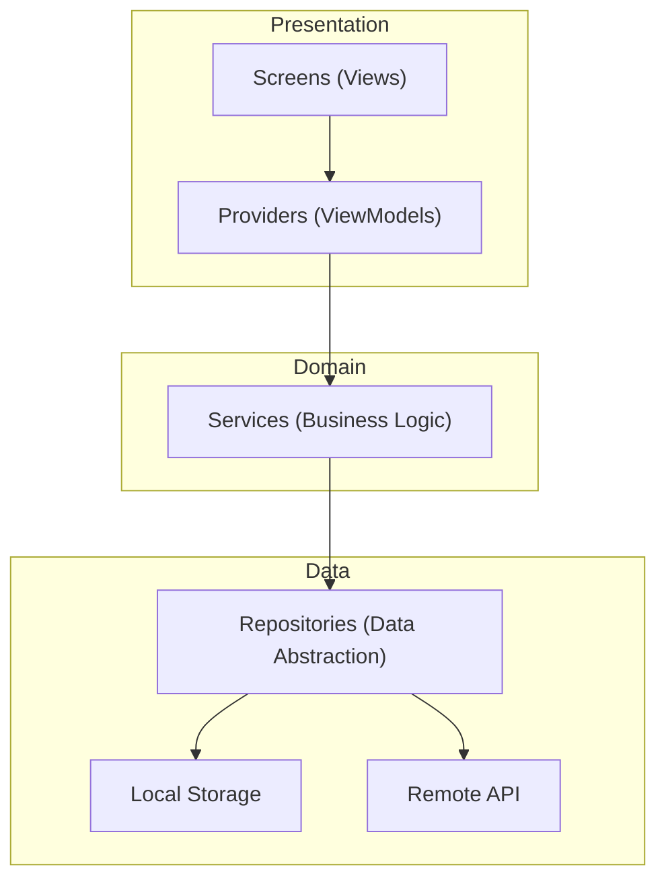
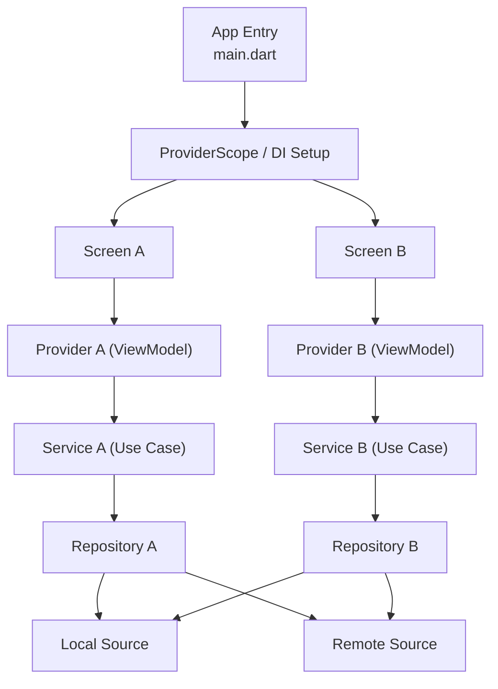
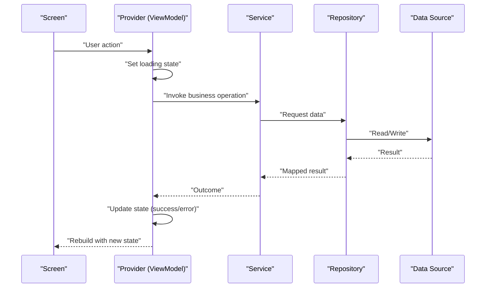
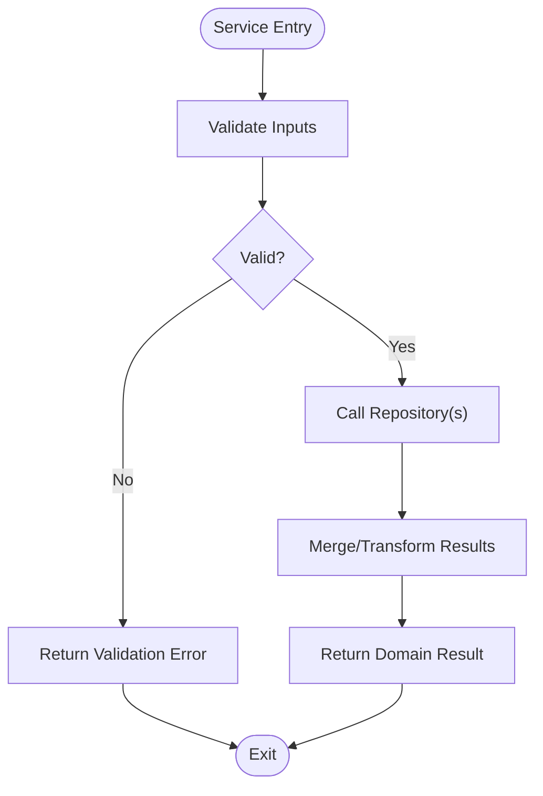
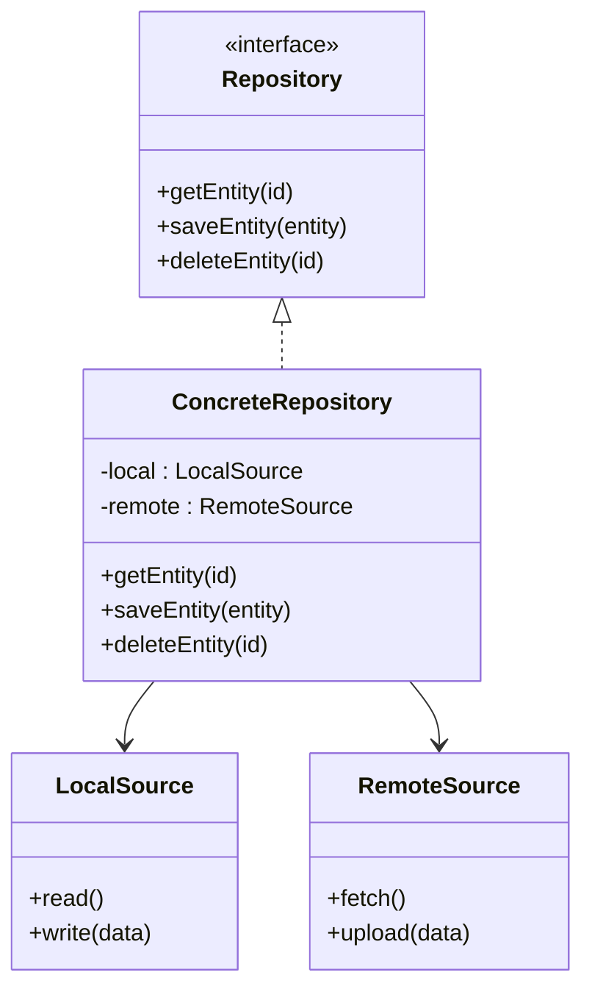
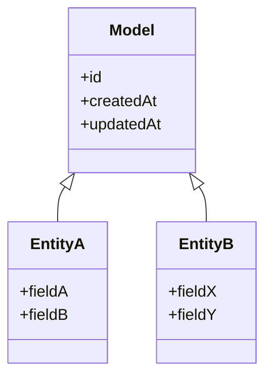
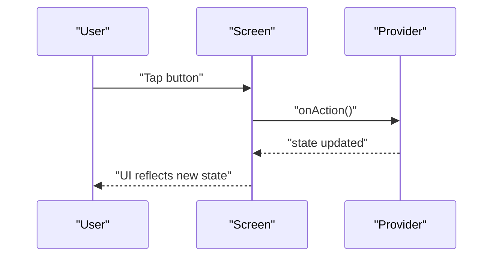
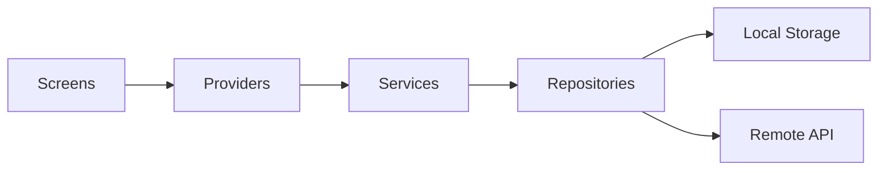

# Architecture & Design

<cite>
**Referenced Files in This Document**
- [main.dart](file://lib/main.dart)
- [pubspec.yaml](file://pubspec.yaml)
- [ARCHITECTURE.md](file://docs/ARCHITECTURE.md)
- [PROJECT_BRIEF.md](file://docs/PROJECT_BRIEF.md)
- [README.md](file://README.md)
</cite>

## Table of Contents
1. [Introduction](#introduction)
2. [Project Structure](#project-structure)
3. [Core Components](#core-components)
4. [Architecture Overview](#architecture-overview)
5. [Detailed Component Analysis](#detailed-component-analysis)
6. [Dependency Analysis](#dependency-analysis)
7. [Performance Considerations](#performance-considerations)
8. [Troubleshooting Guide](#troubleshooting-guide)
9. [Conclusion](#conclusion)
10. [Appendices](#appendices)

## Introduction
This document explains the architectural design and design patterns used by the ASSINATURAS NINJA application. It focuses on how Clean Architecture is combined with MVVM to organize Models, ViewModels (Providers), and Views (Screens). It also documents the Provider pattern for state management, service layer abstraction for business logic, repository pattern for data access, and integration points between layers. The goal is to provide a clear understanding of component interactions, data flow, technical decisions, trade-offs, scalability, maintainability, and cross-cutting concerns such as error handling, logging, and performance optimization.

## Project Structure
The project follows a layered structure aligned with Clean Architecture principles:
- Presentation layer: Screens (Views) and Providers (ViewModels)
- Domain layer: Business logic encapsulated in Services
- Data layer: Repositories abstracting data sources
- Shared utilities and models

[No sources needed since this diagram shows conceptual workflow, not actual code structure]

**Section sources**
- [ARCHITECTURE.md](file://docs/ARCHITECTURE.md)
- [PROJECT_BRIEF.md](file://docs/PROJECT_BRIEF.md)

## Core Components
- Models: Plain data structures representing domain entities. They are immutable where possible and carry no business logic.
- Providers (ViewModels): State holders that expose reactive state to screens. They orchestrate calls to services and update UI state accordingly.
- Screens (Views): Pure UI components that render state from providers and forward user actions to them.
- Services: Encapsulate business rules and workflows. They coordinate multiple repositories and may perform validation or transformations.
- Repositories: Abstract data access behind interfaces. They aggregate local and remote sources and present a unified API to services.
- Utilities: Cross-cutting helpers for formatting, parsing, constants, and common operations.

Key responsibilities and boundaries:
- Screens must not contain business logic; they only react to provider state.
- Providers manage lifecycle and state updates, delegating work to services.
- Services implement use cases and enforce domain constraints.
- Repositories isolate persistence details and external dependencies.

**Section sources**
- [ARCHITECTURE.md](file://docs/ARCHITECTURE.md)
- [PROJECT_BRIEF.md](file://docs/PROJECT_BRIEF.md)

## Architecture Overview
The system implements Clean Architecture with MVVM:
- Presentation Layer: Screens + Providers
- Domain Layer: Services
- Data Layer: Repositories + Data Sources

**Diagram sources**
- [main.dart:1-200](file://lib/main.dart#L1-L200)

**Section sources**
- [main.dart:1-200](file://lib/main.dart#L1-L200)
- [ARCHITECTURE.md](file://docs/ARCHITECTURE.md)

## Detailed Component Analysis

### Provider Pattern (State Management)
- Purpose: Provide reactive state to screens and handle side effects.
- Responsibilities:
  - Expose state via getters and streams/listeners.
  - Update state based on user actions and service results.
  - Manage loading, success, and error states.
- Integration:
  - Consumed by screens through provider instances.
  - Calls services for business operations.
  - Updates UI state upon completion or failure.

**Diagram sources**
- [main.dart:1-200](file://lib/main.dart#L1-L200)

**Section sources**
- [ARCHITECTURE.md](file://docs/ARCHITECTURE.md)
- [PROJECT_BRIEF.md](file://docs/PROJECT_BRIEF.md)

### Service Layer Abstraction (Business Logic)
- Purpose: Encapsulate domain rules and workflows.
- Responsibilities:
  - Validate inputs and enforce invariants.
  - Orchestrate multiple repositories.
  - Transform data into domain-friendly shapes.
- Characteristics:
  - Stateless where possible.
  - Testable without UI or persistence details.

**Diagram sources**
- [ARCHITECTURE.md](file://docs/ARCHITECTURE.md)

**Section sources**
- [ARCHITECTURE.md](file://docs/ARCHITECTURE.md)

### Repository Pattern (Data Access)
- Purpose: Abstract data sources behind a clean interface.
- Responsibilities:
  - Aggregate local and remote sources.
  - Implement caching strategies and conflict resolution.
  - Present consistent APIs to services.
- Benefits:
  - Decouples domain from storage specifics.
  - Simplifies testing and mocking.

**Diagram sources**
- [ARCHITECTURE.md](file://docs/ARCHITECTURE.md)

**Section sources**
- [ARCHITECTURE.md](file://docs/ARCHITECTURE.md)

### Model Layer
- Purpose: Represent domain entities and DTOs.
- Characteristics:
  - Immutable where feasible.
  - No business logic.
  - Serializable/deserializable for persistence and networking.

**Diagram sources**
- [ARCHITECTURE.md](file://docs/ARCHITECTURE.md)

**Section sources**
- [ARCHITECTURE.md](file://docs/ARCHITECTURE.md)

### Screens (Views)
- Purpose: Render UI and forward user actions to providers.
- Characteristics:
  - Stateless or minimal state.
  - Subscribe to provider state changes.
  - Defer all logic to providers/services.

**Diagram sources**
- [main.dart:1-200](file://lib/main.dart#L1-L200)

**Section sources**
- [ARCHITECTURE.md](file://docs/ARCHITECTURE.md)

## Dependency Analysis
High-level dependency direction aligns with Clean Architecture:
- Presentation depends on Domain and Data abstractions.
- Domain does not depend on presentation or data implementations.
- Data depends on external sources but is isolated behind repositories.

**Diagram sources**
- [pubspec.yaml:1-200](file://pubspec.yaml#L1-L200)

**Section sources**
- [pubspec.yaml:1-200](file://pubspec.yaml#L1-L200)
- [ARCHITECTURE.md](file://docs/ARCHITECTURE.md)

## Performance Considerations
- Minimize rebuilds: Keep providers focused and avoid unnecessary state updates.
- Debounce/throttle frequent events (e.g., search input) at the provider level.
- Cache frequently accessed data in repositories to reduce network calls.
- Use pagination and lazy loading for large datasets.
- Avoid heavy computations on the UI thread; offload to background tasks when necessary.
- Prefer immutable models to simplify change detection.

[No sources needed since this section provides general guidance]

## Troubleshooting Guide
Common issues and strategies:
- State inconsistencies: Ensure providers update state atomically and handle loading/success/error transitions explicitly.
- Network errors: Centralize error mapping in repositories or services; propagate user-friendly messages to providers.
- Memory leaks: Dispose listeners and cancel pending requests in providers.
- Performance regressions: Profile rebuilds and identify excessive provider scopes or broad state slices.

Recommended practices:
- Wrap async operations with try/catch and map exceptions to domain errors.
- Log key transitions (loading, success, error) for observability.
- Add unit tests for services and repositories to validate behavior under failures.

[No sources needed since this section provides general guidance]

## Conclusion
The ASSINATURAS NINJA application adopts Clean Architecture with MVVM and the Provider pattern to achieve clear separation of concerns, testability, and scalability. Services encapsulate business logic, repositories abstract data access, and providers manage UI state while coordinating with services. This design supports maintainability by isolating changes within layers and encourages robust error handling and performance optimizations.

[No sources needed since this section summarizes without analyzing specific files]

## Appendices

### Technical Decisions and Trade-offs
- Provider over other state managers: Simpler setup and good fit for medium-complexity apps; consider more advanced solutions if state complexity grows significantly.
- Repository abstraction: Enables easy swapping of data sources and comprehensive testing; adds indirection overhead.
- Service layer: Improves reusability and testability of business logic; requires careful scoping to avoid becoming a god object.

[No sources needed since this section provides general guidance]

### References
- Application architecture overview and guidelines.
- Project brief and goals.
- Main entry point and app initialization.

**Section sources**
- [ARCHITECTURE.md](file://docs/ARCHITECTURE.md)
- [PROJECT_BRIEF.md](file://docs/PROJECT_BRIEF.md)
- [README.md](file://README.md)
- [main.dart:1-200](file://lib/main.dart#L1-L200)