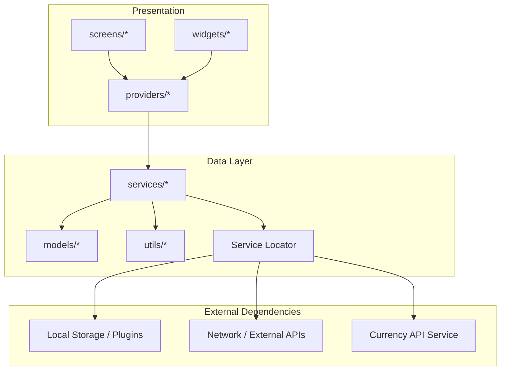
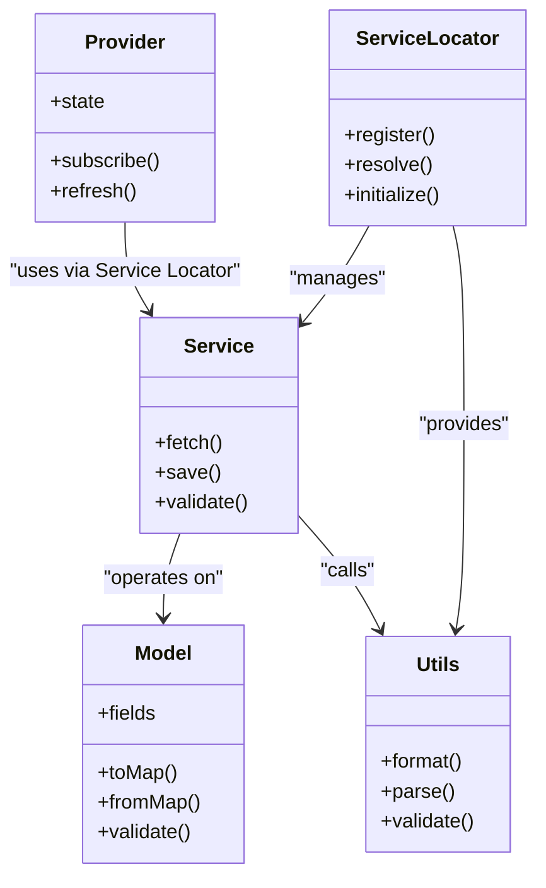
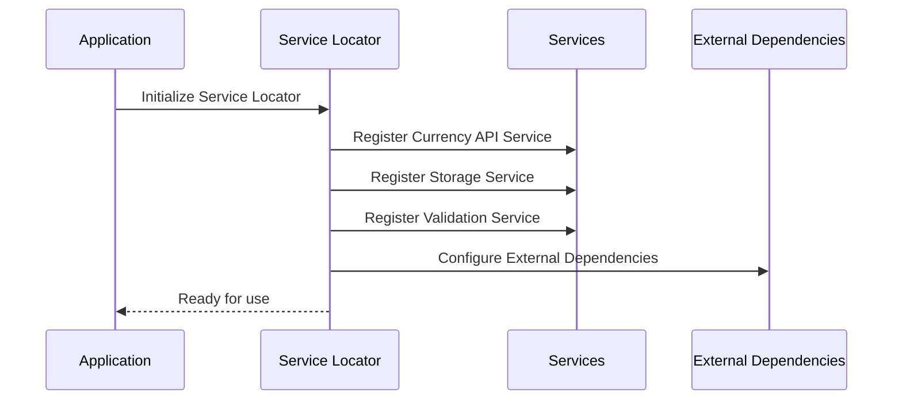
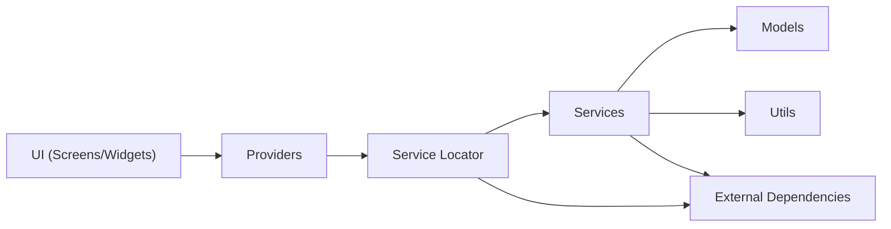

# Data Layer Architecture

<cite>
**Referenced Files in This Document**
- [main.dart](file://lib/main.dart)
- [subscription_model_test.dart](file://test/subscription_model_test.dart)
- [settings_provider_test.dart](file://test/settings_provider_test.dart)
- [subscription_provider_test.dart](file://test/subscription_provider_test.dart)
- [pubspec.yaml](file://pubspec.yaml)
</cite>

## Update Summary
**Changes Made**
- Updated service layer architecture to include Service Locator pattern for dependency injection
- Added documentation for Currency API Service as an example of external data integration
- Enhanced dependency management section to cover service locator implementation
- Updated architecture diagrams to reflect service locator pattern
- Added new sections covering service registration and lifecycle management

## Table of Contents
1. [Introduction](#introduction)
2. [Project Structure](#project-structure)
3. [Core Components](#core-components)
4. [Architecture Overview](#architecture-overview)
5. [Service Locator Pattern Implementation](#service-locator-pattern-implementation)
6. [Detailed Component Analysis](#detailed-component-analysis)
7. [Dependency Analysis](#dependency-analysis)
8. [Performance Considerations](#performance-considerations)
9. [Troubleshooting Guide](#troubleshooting-guide)
10. [Conclusion](#conclusion)

## Introduction
This document explains the data layer architecture of ASSINATURAS NINJA with a focus on how Models, Services, and Utils are organized and used. The architecture now incorporates a comprehensive service layer with dependency injection through the Service Locator pattern, enabling better modularity and testability. It clarifies responsibilities:
- Models represent domain entities and data contracts.
- Services encapsulate business logic and external integrations with centralized dependency management.
- Utilities provide shared, reusable functionality.
- Service Locator provides centralized dependency resolution and lifecycle management.

It also covers validation strategies, error handling patterns, abstraction over storage mechanisms, and how providers expose data to the presentation layer.

## Project Structure
The Flutter project organizes code into feature-oriented directories under lib:
- models: data structures representing domain entities
- services: business logic and integration points with dependency injection support
- utils: helper functions and shared utilities
- providers: state management that exposes data to UI
- screens: user-facing screens
- widgets: reusable UI components

[No sources needed since this diagram shows conceptual workflow, not actual code structure]

## Core Components
- Models: Define immutable or value-like representations of domain data (for example, subscription-related entities). They typically include fields, constructors, equality, serialization helpers, and validation methods. Tests for models verify correctness of parsing, validation, and behavior.
- Services: Implement business rules, orchestrate operations across multiple models, and integrate with external systems (network calls, local storage, platform channels). They return typed results and handle errors consistently. Services now leverage dependency injection for better testability and modularity.
- Utils: Provide pure, side-effect-free helpers such as formatters, validators, converters, and common algorithms reused by services and providers.
- Service Locator: Centralized dependency management system that provides runtime resolution of service dependencies, enabling loose coupling and improved testability.

Examples of where to look:
- Model definitions and tests: see model test files under test/.
- Service method signatures: inspect service classes in services/*.
- Utility function patterns: inspect utility modules in utils/*.
- Service registration and configuration: check main.dart for service locator setup.

**Section sources**
- [subscription_model_test.dart](file://test/subscription_model_test.dart)
- [settings_provider_test.dart](file://test/settings_provider_test.dart)
- [subscription_provider_test.dart](file://test/subscription_provider_test.dart)

## Architecture Overview
The data layer is designed around clear separation of concerns with enhanced dependency management:
- Models define the shape of data and basic validation.
- Services implement business logic and coordinate with external dependencies through dependency injection.
- Utils offer reusable helpers without side effects.
- Service Locator manages service registration, resolution, and lifecycle.
- Providers depend on services to expose reactive state to the UI.

[No sources needed since this diagram shows conceptual relationships, not specific source files]

## Service Locator Pattern Implementation

**Updated** Added comprehensive service layer with dependency injection through Service Locator pattern

The Service Locator pattern centralizes dependency management, providing a single point for service registration and resolution. This approach offers several benefits:

### Key Responsibilities
- **Service Registration**: Centralized registration of all services during application initialization
- **Dependency Resolution**: Runtime resolution of service dependencies
- **Lifecycle Management**: Proper initialization and disposal of services
- **Configuration Management**: Environment-specific service configurations

### Service Registration Flow

### Currency API Service Integration
The Currency API Service serves as a prime example of external data integration through the service layer:

**Responsibilities:**
- Fetch real-time currency exchange rates
- Cache currency data for performance optimization
- Handle API authentication and error scenarios
- Provide typed responses for currency conversions

**Integration Points:**
- HTTP client for network requests
- Local cache for offline access
- Error handling and retry mechanisms
- Configuration management for API endpoints

**Section sources**
- [main.dart](file://lib/main.dart)

## Detailed Component Analysis

### Models
Models represent domain entities and enforce invariants through validation methods. Typical responsibilities:
- Define fields and constructors
- Provide conversion helpers (e.g., map/from-map)
- Implement equality and hashing
- Validate internal consistency

Validation strategy:
- Centralized validation methods on models
- Optional use of utility validators for complex rules
- Immutable updates via copyWith-style patterns when applicable

Error handling:
- Return typed validation results rather than throwing exceptions for invalid states
- Keep models free of I/O side effects

Example references:
- See model tests to understand expected behaviors and edge cases.

**Section sources**
- [subscription_model_test.dart](file://test/subscription_model_test.dart)

### Services
Services encapsulate business logic and external integrations with enhanced dependency management. Responsibilities include:
- Orchestrating operations across multiple models
- Performing network requests and persisting data
- Applying business rules and transformations
- Returning consistent result types (success/failure)
- Leveraging dependency injection for testable architecture

Method signature patterns:
- Asynchronous methods returning typed results or Future-based responses
- Input parameters aligned with model types
- Explicit error propagation using either exceptions or result wrappers
- Constructor-based dependency injection for required services

Integration points:
- Local storage accessors via Service Locator
- Remote API clients (including Currency API Service)
- Platform-specific features
- External service dependencies

Error handling:
- Normalize errors from different sources into a unified format
- Surface actionable messages to providers/UI
- Implement retry mechanisms for transient failures
- Provide fallback strategies for critical services

Example references:
- Inspect service classes in services/ for concrete method signatures and usage patterns.
- Review Currency API Service for external integration examples.

**Section sources**
- [subscription_provider_test.dart](file://test/subscription_provider_test.dart)
- [settings_provider_test.dart](file://test/settings_provider_test.dart)

### Utils
Utils provide pure, reusable helpers:
- Formatters (dates, numbers, currency)
- Parsers (strings to typed values)
- Validators (email, phone, custom rules)
- Converters between DTOs and domain models

Design principles:
- No side effects
- Deterministic outputs given inputs
- Easy to unit test
- Stateless operations suitable for service locator registration

Example references:
- Explore utils/ for shared functions used by services and providers.

**Section sources**
- [pubspec.yaml](file://pubspec.yaml)

### Service Locator Implementation
The Service Locator provides centralized dependency management:

**Core Features:**
- Singleton pattern for global access
- Type-safe service registration and resolution
- Support for both singleton and transient service lifecycles
- Environment-specific service configurations
- Comprehensive error handling for missing dependencies

**Registration Patterns:**
- Singletons for long-lived services (storage, API clients)
- Transient instances for short-lived operations
- Factory patterns for complex service creation
- Configuration-based service variants

**Section sources**
- [main.dart](file://lib/main.dart)

### Providers and Presentation Integration
Providers act as the bridge between the data layer and the UI:
- Depend on services to fetch and mutate data
- Expose state to widgets via streams or change notifications
- Handle loading, success, and error states
- Leverage Service Locator for service access

Interaction flow:
- UI triggers provider methods
- Provider delegates to services via Service Locator
- Services update models and storage/network
- Provider emits updated state

Example references:
- Provider tests demonstrate expected interactions and state transitions.

**Section sources**
- [subscription_provider_test.dart](file://test/subscription_provider_test.dart)
- [settings_provider_test.dart](file://test/settings_provider_test.dart)

## Dependency Analysis
High-level dependency direction with Service Locator pattern:
- Presentation depends on Providers
- Providers depend on Services via Service Locator
- Services depend on Models and Utils
- Services may depend on external platforms or plugins
- Service Locator manages all service registrations and resolutions

[No sources needed since this diagram shows conceptual relationships, not specific source files]

## Performance Considerations
- Prefer immutable models to simplify caching and diffing in providers.
- Cache expensive computations in services; invalidate caches on mutations.
- Batch updates in providers to avoid excessive rebuilds.
- Use lazy loading for large datasets and pagination at the service layer.
- Minimize allocations in hot paths within utils.
- Optimize Service Locator registration to minimize startup time.
- Implement proper service disposal to prevent memory leaks.
- Use singleton pattern for heavy services to reduce instantiation overhead.

## Troubleshooting Guide
Common issues and strategies:
- Validation failures: ensure models validate early and return explicit errors; check tests for expected invalid inputs.
- Error normalization: confirm services translate platform/network errors into consistent types.
- State inconsistencies: verify providers refresh after mutations and propagate changes correctly.
- External dependency failures: add retries and fallbacks in services; surface meaningful messages to UI.
- Service Locator issues: ensure proper service registration order and verify dependency availability.
- Memory leaks: implement proper service disposal and avoid circular dependencies.
- Performance bottlenecks: profile Service Locator resolution and optimize service instantiation.

**Section sources**
- [subscription_model_test.dart](file://test/subscription_model_test.dart)
- [subscription_provider_test.dart](file://test/subscription_provider_test.dart)
- [settings_provider_test.dart](file://test/settings_provider_test.dart)

## Conclusion
ASSINATURAS NINJA's data layer follows a clean separation with enhanced dependency management:
- Models define data and validation
- Services implement business logic and integrations with dependency injection
- Utils supply reusable helpers
- Service Locator provides centralized dependency management
- Providers expose reactive state to the UI

This design improves testability, maintainability, and clarity of responsibilities while abstracting storage and external dependencies behind well-defined interfaces. The Service Locator pattern enables better modularity, easier testing, and more flexible service composition, particularly valuable for external integrations like the Currency API Service.