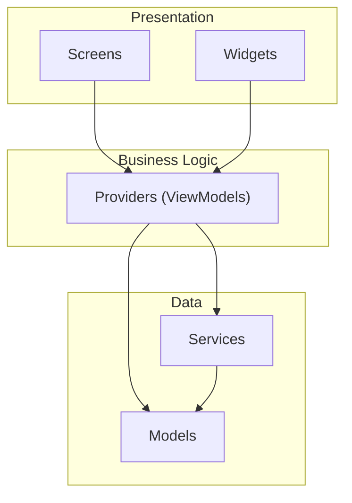
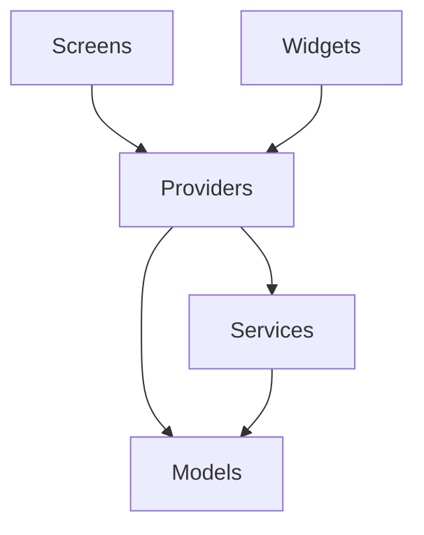
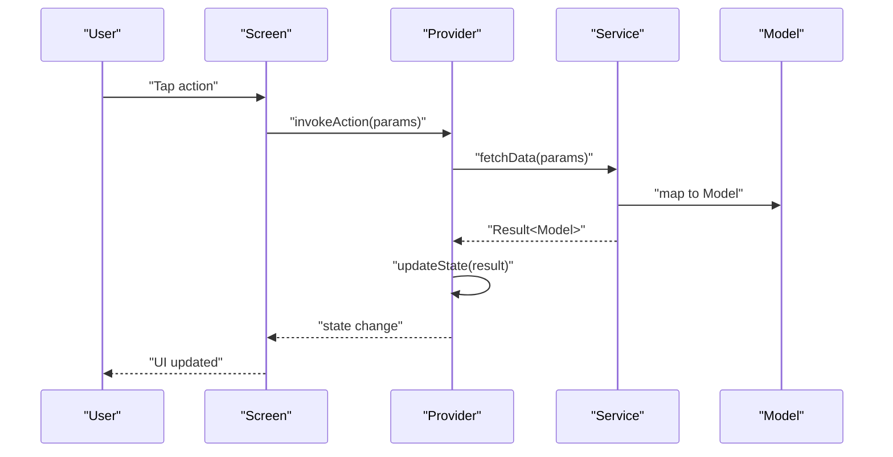
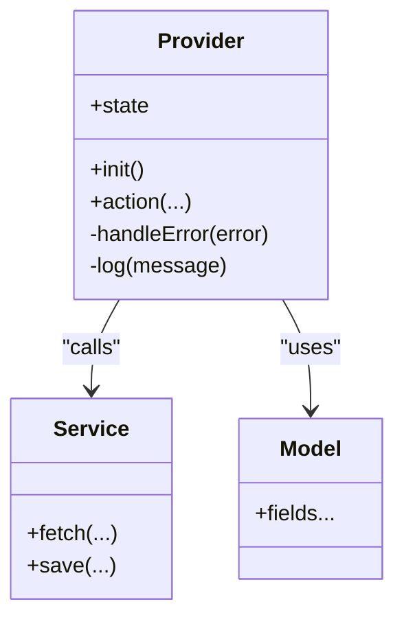
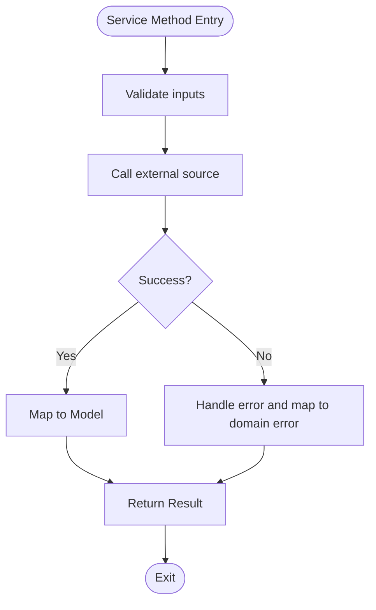
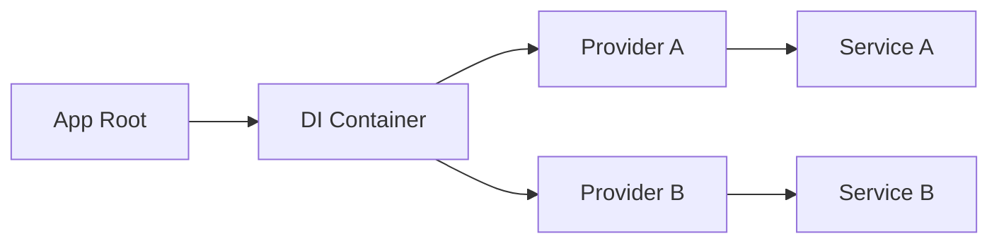
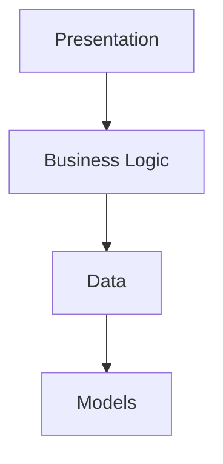

# Overall Architecture

<cite>
**Referenced Files in This Document**
- [main.dart](file://lib/main.dart)
- [ARCHITECTURE.md](file://docs/ARCHITECTURE.md)
- [README.md](file://README.md)
- [pubspec.yaml](file://pubspec.yaml)
</cite>

## Table of Contents
1. [Introduction](#introduction)
2. [Project Structure](#project-structure)
3. [Core Components](#core-components)
4. [Architecture Overview](#architecture-overview)
5. [Detailed Component Analysis](#detailed-component-analysis)
6. [Dependency Analysis](#dependency-analysis)
7. [Performance Considerations](#performance-considerations)
8. [Troubleshooting Guide](#troubleshooting-guide)
9. [Conclusion](#conclusion)

## Introduction
This document describes the overall system design of the ASSINATURAS NINJA application following Clean Architecture with an MVVM pattern. It explains how the app is organized into Presentation (Screens/Widgets), Business Logic (Providers), and Data (Models/Services) layers, and how user interactions propagate through these layers. It also covers architectural decisions, scalability, maintainability, testability, cross-cutting concerns (error handling, logging), and performance considerations at the architectural level.

## Project Structure
The application is structured by feature-oriented directories under lib:
- screens: UI screens implementing the Presentation layer
- widgets: Reusable UI components
- providers: State management and business logic (MVVM view models)
- services: Data access and external integrations
- models: Domain data structures
- utils: Cross-cutting utilities (logging, formatting, etc.)
- main.dart: Application entry point and dependency wiring

[No sources needed since this diagram shows conceptual workflow, not actual code structure]

**Section sources**
- [main.dart:1-200](file://lib/main.dart#L1-L200)
- [ARCHITECTURE.md:1-200](file://docs/ARCHITECTURE.md#L1-L200)

## Core Components
- Presentation Layer
  - Screens: Top-level pages that compose UI and delegate state changes to providers.
  - Widgets: Small, reusable UI building blocks used across screens.
- Business Logic Layer
  - Providers: Encapsulate state, orchestrate use cases, and expose observable state to the UI. They coordinate calls to services and update local state.
- Data Layer
  - Services: Implement data access, network calls, caching, and persistence abstractions.
  - Models: Plain data structures representing domain entities and DTOs.

Key responsibilities:
- Separation of concerns: UI does not directly access data; it interacts only with providers.
- Testability: Providers can be unit-tested independently of UI and data sources.
- Scalability: New features can be added by introducing new screens, providers, services, and models without affecting unrelated parts.

**Section sources**
- [main.dart:1-200](file://lib/main.dart#L1-L200)
- [ARCHITECTURE.md:1-200](file://docs/ARCHITECTURE.md#L1-L200)

## Architecture Overview
The application follows Clean Architecture boundaries with MVVM:
- Presentation depends on Business Logic only.
- Business Logic depends on Data abstractions.
- Data depends on Models and external adapters (network, storage).
- No reverse dependencies.

**Diagram sources**
- [main.dart:1-200](file://lib/main.dart#L1-L200)
- [ARCHITECTURE.md:1-200](file://docs/ARCHITECTURE.md#L1-L200)

## Detailed Component Analysis

### Presentation Layer (Screens and Widgets)
- Responsibilities
  - Render UI based on provider state.
  - Capture user actions and call provider methods.
  - Compose reusable widgets for consistent UX.
- Interaction Flow
  - User taps a button -> Screen calls provider method -> Provider updates state -> UI rebuilds.

**Diagram sources**
- [main.dart:1-200](file://lib/main.dart#L1-L200)
- [ARCHITECTURE.md:1-200](file://docs/ARCHITECTURE.md#L1-L200)

**Section sources**
- [main.dart:1-200](file://lib/main.dart#L1-L200)

### Business Logic Layer (Providers)
- Responsibilities
  - Maintain UI state and business rules.
  - Orchestrate service calls and handle success/failure paths.
  - Expose reactive state to the presentation layer.
- Design Decisions
  - One provider per feature or screen to keep cohesion high.
  - Use immutable state updates to ensure predictable UI rebuilds.
  - Centralize error mapping and logging here for consistency.

**Diagram sources**
- [main.dart:1-200](file://lib/main.dart#L1-L200)
- [ARCHITECTURE.md:1-200](file://docs/ARCHITECTURE.md#L1-L200)

**Section sources**
- [main.dart:1-200](file://lib/main.dart#L1-L200)

### Data Layer (Services and Models)
- Responsibilities
  - Services implement data access contracts (network, cache, database).
  - Models represent domain data and DTOs.
- Design Decisions
  - Abstractions over external systems allow easy swapping of implementations (e.g., mock services for tests).
  - Mapping between API responses and domain models occurs within services.

**Diagram sources**
- [main.dart:1-200](file://lib/main.dart#L1-L200)
- [ARCHITECTURE.md:1-200](file://docs/ARCHITECTURE.md#L1-L200)

**Section sources**
- [main.dart:1-200](file://lib/main.dart#L1-L200)

### Dependency Injection and Wiring
- Responsibilities
  - Provide instances of providers, services, and repositories to screens.
  - Centralize configuration and environment-specific settings.
- Typical Approach
  - Root widget initializes DI container.
  - Screens consume providers via context or injection.
  - Services are injected into providers.

**Diagram sources**
- [main.dart:1-200](file://lib/main.dart#L1-L200)
- [ARCHITECTURE.md:1-200](file://docs/ARCHITECTURE.md#L1-L200)

**Section sources**
- [main.dart:1-200](file://lib/main.dart#L1-L200)

## Dependency Analysis
Layered dependencies enforce separation of concerns:
- Presentation depends only on Business Logic.
- Business Logic depends on Data abstractions.
- Data depends on Models and external adapters.

**Diagram sources**
- [main.dart:1-200](file://lib/main.dart#L1-L200)
- [ARCHITECTURE.md:1-200](file://docs/ARCHITECTURE.md#L1-L200)

**Section sources**
- [main.dart:1-200](file://lib/main.dart#L1-L200)
- [ARCHITECTURE.md:1-200](file://docs/ARCHITECTURE.md#L1-L200)

## Performance Considerations
- Minimize unnecessary rebuilds by keeping provider state granular and avoiding global state where possible.
- Debounce or throttle frequent user actions (e.g., search input) at the provider level.
- Cache frequently accessed data in services to reduce network overhead.
- Use pagination and lazy loading for large lists.
- Avoid heavy computations on the UI thread; offload to background tasks if needed.

[No sources needed since this section provides general guidance]

## Troubleshooting Guide
- Error Handling Strategy
  - Normalize errors at the service boundary and map them to domain errors.
  - Surface user-friendly messages via providers while preserving detailed logs for debugging.
- Logging Approach
  - Centralized logging utility in utils for consistent log levels and formatting.
  - Log key transitions in providers and services for observability.
- Common Issues
  - Stale state: Ensure providers invalidate or refresh state when underlying data changes.
  - Memory leaks: Dispose resources in providers/services when no longer needed.
  - Network failures: Implement retry/backoff strategies in services and provide fallback UI states.

**Section sources**
- [main.dart:1-200](file://lib/main.dart#L1-L200)
- [ARCHITECTURE.md:1-200](file://docs/ARCHITECTURE.md#L1-L200)

## Conclusion
The ASSINATURAS NINJA application adopts Clean Architecture with MVVM to achieve clear separation of concerns, strong testability, and scalable growth. By isolating UI, business logic, and data access, the system remains maintainable and adaptable to changing requirements. Consistent error handling, centralized logging, and performance-conscious design choices further enhance reliability and user experience.

[No sources needed since this section summarizes without analyzing specific files]