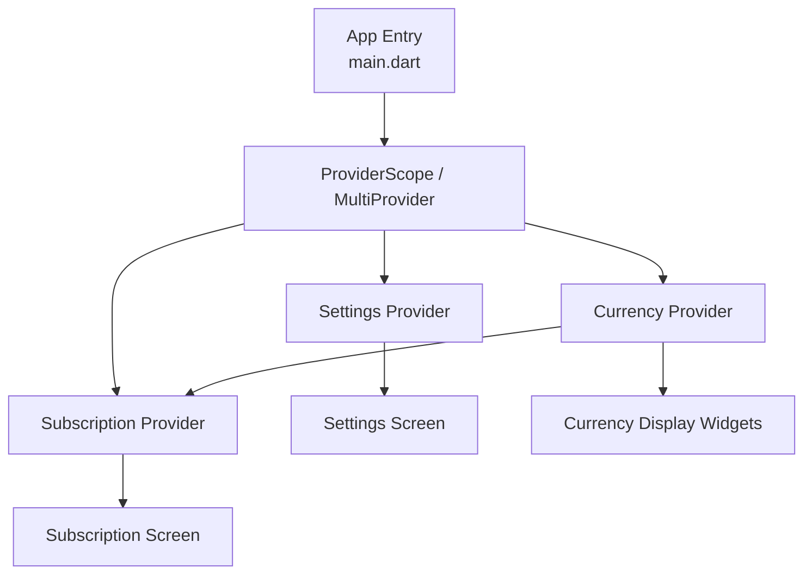
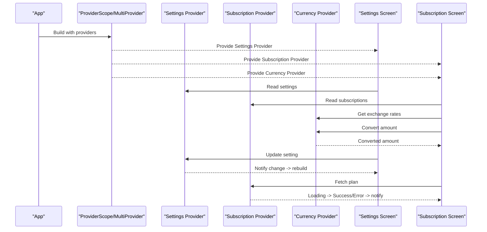
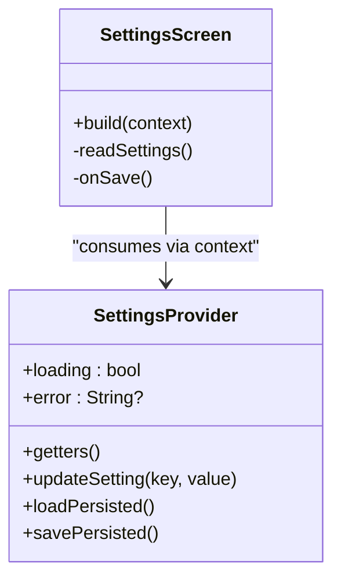
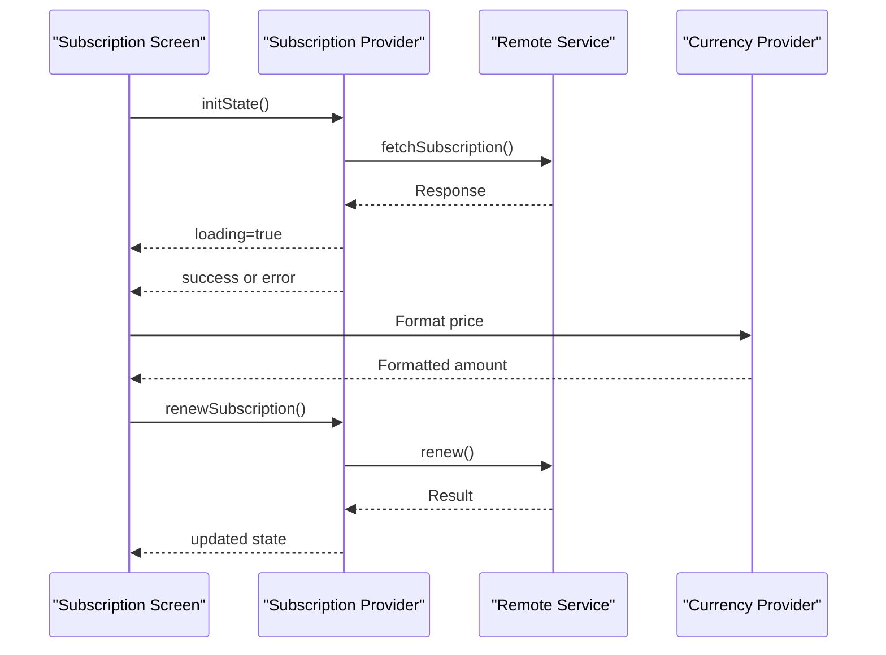
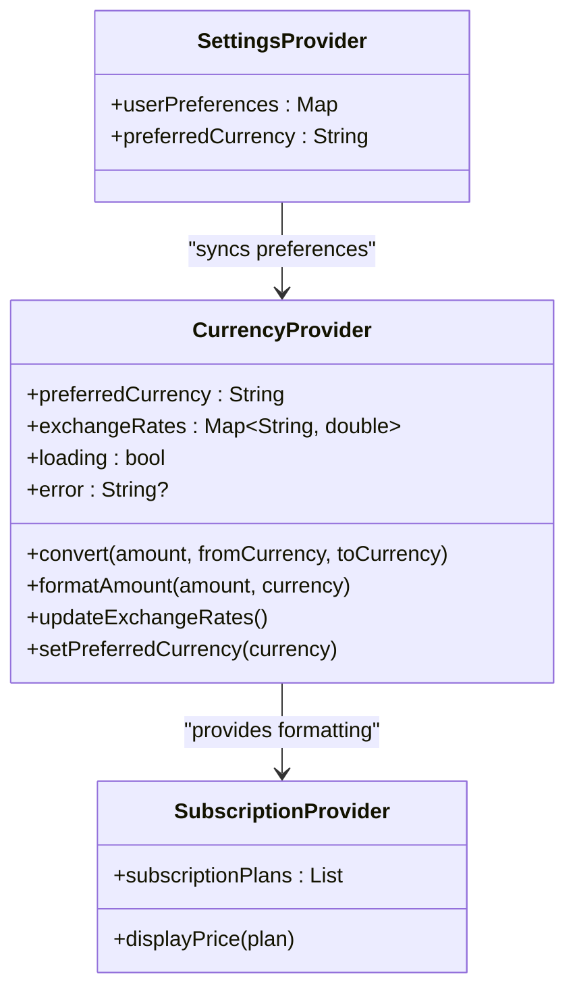
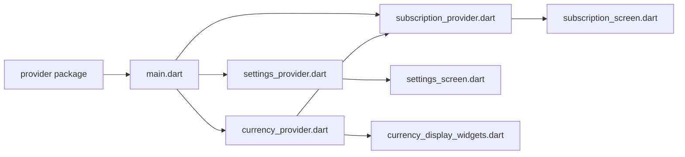

# State Management with Provider

<cite>
**Referenced Files in This Document**
- [main.dart](file://lib/main.dart)
- [settings_provider.dart](file://lib/providers/settings_provider.dart)
- [subscription_provider.dart](file://lib/providers/subscription_provider.dart)
- [currency_provider.dart](file://lib/providers/currency_provider.dart)
- [settings_screen.dart](file://lib/screens/settings_screen.dart)
- [subscription_screen.dart](file://lib/screens/subscription_screen.dart)
- [pubspec.yaml](file://pubspec.yaml)
</cite>

## Update Summary
**Changes Made**
- Added comprehensive documentation for the new Currency Provider implementation
- Updated subscription provider section to reflect recent improvements
- Enhanced multi-currency support architecture overview
- Added currency exchange rate handling patterns and best practices
- Updated provider hierarchy diagrams to include currency management

## Table of Contents
1. [Introduction](#introduction)
2. [Project Structure](#project-structure)
3. [Core Components](#core-components)
4. [Architecture Overview](#architecture-overview)
5. [Detailed Component Analysis](#detailed-component-analysis)
6. [Dependency Analysis](#dependency-analysis)
7. [Performance Considerations](#performance-considerations)
8. [Troubleshooting Guide](#troubleshooting-guide)
9. [Conclusion](#conclusion)
10. [Appendices](#appendices)

## Introduction
This document explains how the application uses the Provider pattern to manage state across screens and widgets. It focuses on provider hierarchy, dependency injection, reactive updates, and best practices for organization and performance. The system now includes enhanced multi-currency support through a dedicated Currency Provider, improved subscription management, and robust settings handling. It covers all provider implementations including synchronization, loading states, error states, and exchange rate management. Finally, it provides guidance on creating new providers and handling complex state scenarios.

## Project Structure
The project organizes stateful logic under a dedicated providers directory and consumes these providers from screens and widgets. The main entry point wires up providers at the root of the widget tree so that any descendant can access them via context. The architecture now includes specialized providers for different domains: settings, subscriptions, and currency management.

**Diagram sources**
- [main.dart](file://lib/main.dart)
- [settings_provider.dart](file://lib/providers/settings_provider.dart)
- [subscription_provider.dart](file://lib/providers/subscription_provider.dart)
- [currency_provider.dart](file://lib/providers/currency_provider.dart)

## Core Components
- **Settings Provider**: Manages user preferences and configuration state. It exposes methods to update settings, persists changes where applicable, and notifies listeners to trigger UI rebuilds. It also encapsulates loading and error states during asynchronous operations.
- **Subscription Provider**: Manages subscription-related data such as plans, status, and lifecycle events. It coordinates fetching, caching, and updating subscription state, while exposing clear APIs for consumers to read and mutate state safely. Recent improvements include enhanced error handling and better state synchronization.
- **Currency Provider**: New component that handles multi-currency support and exchange rate management. It maintains current currency preferences, manages exchange rate data, and provides conversion utilities for displaying amounts in different currencies.

Key responsibilities:
- Encapsulate domain-specific state
- Provide immutable snapshots or getters for reading
- Expose mutation methods that update internal state and notify listeners
- Centralize side effects (network calls, persistence) and expose loading/error states
- Handle currency conversions and exchange rate updates

**Section sources**
- [settings_provider.dart](file://lib/providers/settings_provider.dart)
- [subscription_provider.dart](file://lib/providers/subscription_provider.dart)
- [currency_provider.dart](file://lib/providers/currency_provider.dart)

## Architecture Overview
At runtime, the app initializes providers near the top of the widget tree. Screens consume providers through context-based accessors. When a provider's state changes, only the parts of the UI subscribed to those specific values rebuild, minimizing unnecessary work. The currency provider integrates with other providers to provide consistent currency formatting across the application.

**Diagram sources**
- [main.dart](file://lib/main.dart)
- [settings_provider.dart](file://lib/providers/settings_provider.dart)
- [subscription_provider.dart](file://lib/providers/subscription_provider.dart)
- [currency_provider.dart](file://lib/providers/currency_provider.dart)

## Detailed Component Analysis

### Settings Provider
Responsibilities:
- Maintain current settings snapshot
- Persist changes when necessary
- Expose loading and error states for async operations
- Provide typed getters and setters for safe consumption

State synchronization:
- On initialization, load persisted settings if available
- On mutation, update in-memory state and persist asynchronously
- Emit notifications after successful persistence or propagate errors

Error and loading states:
- Track operation phases to show spinners or banners
- Surface actionable error messages to consumers

Consumption example:
- A screen reads settings via context and rebuilds when values change
- User actions call provider methods; UI reflects updates reactively

Best practices:
- Keep settings small and focused
- Debounce frequent writes if needed
- Separate read-only and mutating APIs for clarity

**Section sources**
- [settings_provider.dart](file://lib/providers/settings_provider.dart)
- [settings_screen.dart](file://lib/screens/settings_screen.dart)

#### Class Diagram

**Diagram sources**
- [settings_provider.dart](file://lib/providers/settings_provider.dart)
- [settings_screen.dart](file://lib/screens/settings_screen.dart)

### Subscription Provider
Responsibilities:
- Manage subscription data model(s)
- Coordinate network requests and local cache
- Expose loading, success, and error states
- Provide methods to refresh or apply changes

Data flow:
- Initial load triggers fetch
- On success, update state and notify listeners
- On failure, set error state and optionally retry
- Mutations trigger optimistic updates followed by confirmation

Recent Improvements:
- Enhanced error handling with more granular error states
- Improved state synchronization between local cache and remote data
- Better integration with currency provider for displaying subscription costs
- Optimized rebuild patterns to reduce unnecessary UI updates

Consumption example:
- A screen subscribes to subscription state and renders different views based on loading/success/error
- Actions like "Renew" or "Cancel" call provider methods and reflect results immediately
- Subscription amounts are automatically formatted using the currency provider

**Section sources**
- [subscription_provider.dart](file://lib/providers/subscription_provider.dart)
- [subscription_screen.dart](file://lib/screens/subscription_screen.dart)

#### Sequence Diagram

**Diagram sources**
- [subscription_provider.dart](file://lib/providers/subscription_provider.dart)
- [subscription_screen.dart](file://lib/screens/subscription_screen.dart)
- [currency_provider.dart](file://lib/providers/currency_provider.dart)

### Currency Provider
Responsibilities:
- Manage user's preferred currency selection
- Maintain exchange rate data and caching
- Provide currency conversion utilities
- Handle exchange rate updates and error states
- Format monetary amounts according to locale and currency

Exchange Rate Management:
- Load exchange rates from configured sources
- Cache rates locally with expiration policies
- Handle network failures gracefully with fallback rates
- Support real-time updates when available

Currency Conversion:
- Convert amounts between supported currencies
- Apply proper rounding and precision rules
- Handle edge cases like zero amounts and invalid inputs
- Provide both exact and approximate conversion options

Integration Patterns:
- Subscribe to currency changes across the application
- Automatically format subscription prices and other monetary values
- Respect user preferences for display formats
- Handle loading states during exchange rate updates

Consumption example:
- Subscription screen displays prices in user's preferred currency
- Settings screen allows users to change their preferred currency
- All monetary values are consistently formatted throughout the app

**Section sources**
- [currency_provider.dart](file://lib/providers/currency_provider.dart)

#### Class Diagram

**Diagram sources**
- [currency_provider.dart](file://lib/providers/currency_provider.dart)
- [subscription_provider.dart](file://lib/providers/subscription_provider.dart)
- [settings_provider.dart](file://lib/providers/settings_provider.dart)

### Provider Hierarchy and Dependency Injection
Providers are typically layered:
- Global providers (e.g., settings, currency) are provided at the root
- Feature-scoped providers (e.g., subscription) are provided closer to their usage
- Consumers use context to access the nearest provider instance

Injection patterns:
- Use scoped providers to limit rebuild scope
- Prefer singletons for global state and feature-scoped instances for ephemeral state
- Currency provider is provided globally to ensure consistent formatting across the app
- Settings provider syncs with currency provider for preference consistency

**Section sources**
- [main.dart](file://lib/main.dart)

## Dependency Analysis
External dependencies relevant to state management include the provider package, currency conversion libraries, and any persistence or networking libraries used by providers.

**Diagram sources**
- [pubspec.yaml](file://pubspec.yaml)
- [main.dart](file://lib/main.dart)
- [settings_provider.dart](file://lib/providers/settings_provider.dart)
- [subscription_provider.dart](file://lib/providers/subscription_provider.dart)
- [currency_provider.dart](file://lib/providers/currency_provider.dart)

## Performance Considerations
- Selective rebuilding: Consume only the minimal state needed using fine-grained selectors or smaller provider scopes to avoid unnecessary rebuilds.
- Provider disposal: Ensure long-lived providers do not leak resources; dispose streams or cancel pending requests when appropriate.
- Avoid heavy computations in build: Move expensive work out of build methods and memoize derived values.
- Batch updates: Group multiple state changes into a single notification to reduce rebuild frequency.
- Lazy initialization: Defer loading until the provider is actually consumed.
- Currency conversion caching: Store converted amounts to avoid repeated calculations.
- Exchange rate optimization: Implement efficient caching strategies for exchange rate data.

## Troubleshooting Guide
Common issues and resolutions:
- Notifier not found: Verify the provider is placed above the consumer in the widget tree and accessed via the correct context.
- Stale state: Ensure mutations call the proper update method and that listeners are notified.
- Memory leaks: Cancel timers, streams, or network requests in provider cleanup paths.
- Excessive rebuilds: Narrow the scope of consumers or split large providers into smaller ones.
- Currency conversion errors: Check exchange rate availability and handle missing rates gracefully.
- Subscription state inconsistencies: Verify proper synchronization between local cache and remote data.

**Section sources**
- [settings_provider.dart](file://lib/providers/settings_provider.dart)
- [subscription_provider.dart](file://lib/providers/subscription_provider.dart)
- [currency_provider.dart](file://lib/providers/currency_provider.dart)

## Conclusion
The application leverages Provider to create a clear separation between UI and state logic. By organizing providers hierarchically, exposing well-defined APIs, and managing loading and error states explicitly, the codebase remains maintainable and performant. The addition of the Currency Provider enhances internationalization capabilities, while improvements to the Subscription Provider provide better reliability and user experience. Following the best practices outlined here will help you extend the system with new features while preserving responsiveness and memory efficiency.

## Appendices

### Creating a New Provider
Steps:
- Define a provider class that encapsulates state and behavior
- Expose getters for reading and methods for mutating state
- Handle loading and error states consistently
- Provide the provider near its usage scope
- Consume in screens using context and subscribe only to required fields

Guidelines:
- Keep providers focused on a single responsibility
- Prefer immutable snapshots for read paths
- Centralize side effects within the provider
- Consider integration with existing providers (like Currency Provider)
- Implement proper error handling and loading states

**Section sources**
- [settings_provider.dart](file://lib/providers/settings_provider.dart)
- [subscription_provider.dart](file://lib/providers/subscription_provider.dart)
- [currency_provider.dart](file://lib/providers/currency_provider.dart)

### Handling Complex State Scenarios
Patterns:
- Split monolithic providers into smaller, composable units
- Use composition to combine related state
- Introduce action reducers for predictable state transitions
- Cache frequently accessed data locally to reduce network calls
- Implement cross-provider communication patterns
- Handle currency conversions consistently across the application

**Section sources**
- [settings_provider.dart](file://lib/providers/settings_provider.dart)
- [subscription_provider.dart](file://lib/providers/subscription_provider.dart)
- [currency_provider.dart](file://lib/providers/currency_provider.dart)

### Currency Provider Implementation Details
The Currency Provider follows these key patterns:

Exchange Rate Management:
- Implements caching with configurable expiration times
- Handles network failures with fallback mechanisms
- Supports multiple exchange rate sources for reliability

Currency Conversion:
- Provides both exact and approximate conversion methods
- Handles edge cases like zero amounts and invalid currencies
- Maintains precision and rounding consistency

Integration Points:
- Syncs with Settings Provider for user preferences
- Provides formatting services to Subscription Provider
- Supports real-time updates when exchange rates change

**Section sources**
- [currency_provider.dart](file://lib/providers/currency_provider.dart)