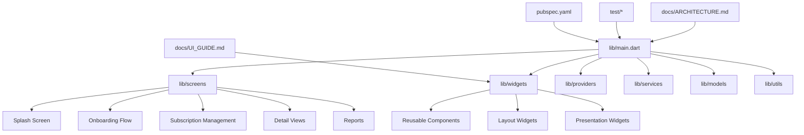
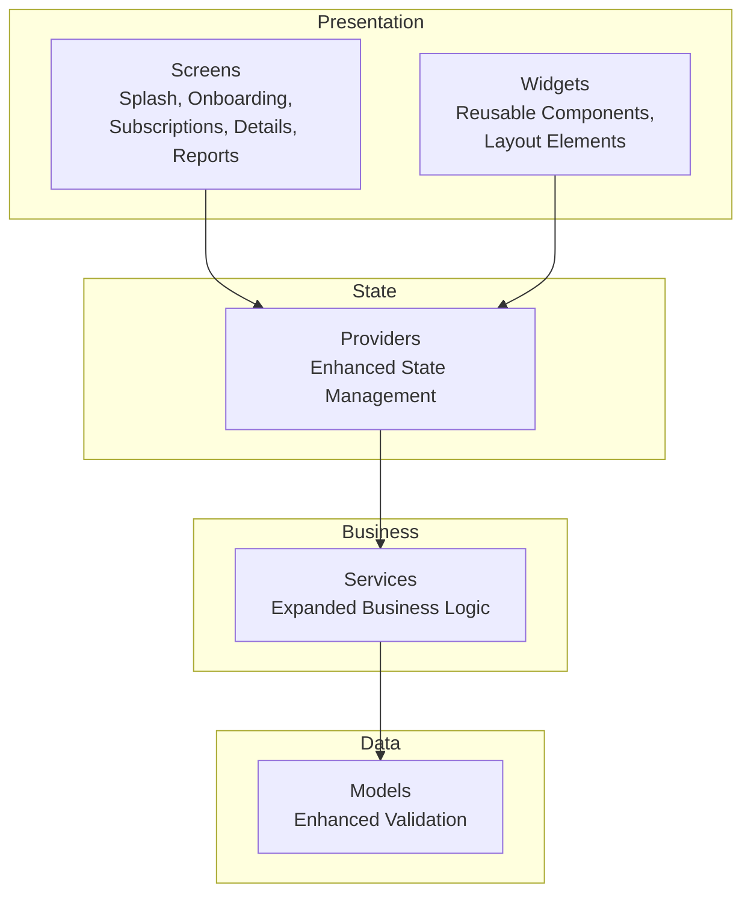
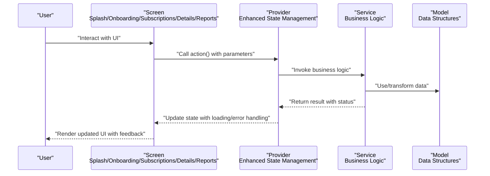
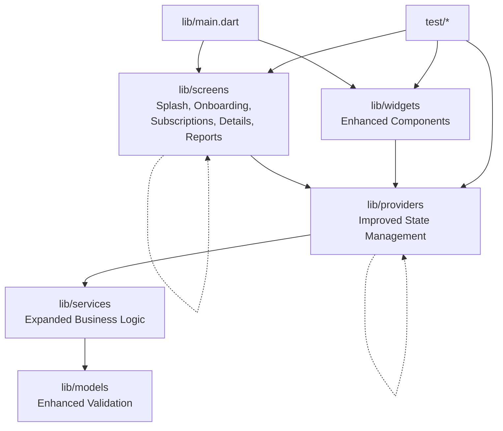

# UI Architecture & Component Design

<cite>
**Referenced Files in This Document**
- [main.dart](file://lib/main.dart)
- [ARCHITECTURE.md](file://docs/ARCHITECTURE.md)
- [UI_GUIDE.md](file://docs/UI_GUIDE.md)
- [PROJECT_BRIEF.md](file://docs/PROJECT_BRIEF.md)
- [README.md](file://README.md)
- [pubspec.yaml](file://pubspec.yaml)
- [onboarding_screen_test.dart](file://test/onboarding_screen_test.dart)
- [settings_provider_test.dart](file://test/settings_provider_test.dart)
- [subscription_model_test.dart](file://test/subscription_model_test.dart)
- [subscription_provider_test.dart](file://test/subscription_provider_test.dart)
- [widgets_test.dart](file://test/widgets_test.dart)
</cite>

## Update Summary
**Changes Made**
- Updated screen organization section to reflect new splash screen, onboarding flow, and subscription management implementations
- Enhanced widget composition strategies with new reusable components for detail views and reports
- Added comprehensive coverage of the enhanced navigation patterns supporting multiple screen flows
- Expanded provider communication patterns to include new business logic integration
- Updated responsive design considerations for new screen layouts and complex data presentations

## Table of Contents
1. [Introduction](#introduction)
2. [Project Structure](#project-structure)
3. [Core Components](#core-components)
4. [Architecture Overview](#architecture-overview)
5. [Detailed Component Analysis](#detailed-component-analysis)
6. [Dependency Analysis](#dependency-analysis)
7. [Performance Considerations](#performance-considerations)
8. [Troubleshooting Guide](#troubleshooting-guide)
9. [Conclusion](#conclusion)
10. [Appendices](#appendices)

## Introduction
This document explains the UI architecture and component design patterns used in ASSINATURAS NINJA, focusing on how screens are organized, how reusable widgets are structured, and how the UI layer interacts with business logic. It also provides guidelines for creating new screens and widgets, maintaining visual consistency, navigation patterns, theming, accessibility considerations, and strategies to ensure maintainability and reusability across platforms.

The project follows a layered approach:
- UI Layer: Screens and Widgets
- State Management Layer: Providers
- Business Logic Layer: Services and Models
- Data Layer: Local storage and external integrations (as needed)

This separation ensures clear responsibilities, testability, and scalability.

[No sources needed since this section summarizes without analyzing specific files]

## Project Structure
The Flutter application is organized by feature and layer:
- lib/main.dart: Application entry point, theme setup, routing configuration, and provider initialization
- lib/screens: Feature-specific screen implementations including splash, onboarding, subscriptions, details, and reports
- lib/widgets: Reusable UI components with enhanced composition patterns
- lib/providers: State management using providers with improved state synchronization
- lib/services: Business logic and data access with expanded functionality
- lib/models: Domain models and data structures with enhanced validation
- lib/utils: Shared utilities and helpers with new formatting and conversion tools
- docs: Project documentation including architecture and UI guidelines
- test: Unit and widget tests covering providers, models, and UI components

**Diagram sources**
- [main.dart](file://lib/main.dart)
- [ARCHITECTURE.md](file://docs/ARCHITECTURE.md)
- [UI_GUIDE.md](file://docs/UI_GUIDE.md)
- [pubspec.yaml](file://pubspec.yaml)
- [onboarding_screen_test.dart](file://test/onboarding_screen_test.dart)
- [settings_provider_test.dart](file://test/settings_provider_test.dart)
- [subscription_model_test.dart](file://test/subscription_model_test.dart)
- [subscription_provider_test.dart](file://test/subscription_provider_test.dart)
- [widgets_test.dart](file://test/widgets_test.dart)

**Section sources**
- [main.dart](file://lib/main.dart)
- [ARCHITECTURE.md](file://docs/ARCHITECTURE.md)
- [UI_GUIDE.md](file://docs/UI_GUIDE.md)
- [PROJECT_BRIEF.md](file://docs/PROJECT_BRIEF.md)
- [README.md](file://README.md)
- [pubspec.yaml](file://pubspec.yaml)

## Core Components
- Entry Point and App Bootstrap: The main application initializes providers, configures theme, sets up routing, and launches the root navigator with enhanced navigation support.
- Screens: Each screen represents a distinct user flow or feature area including splash, onboarding, subscription management, detail views, and reports. They consume providers via ProviderScope or context-based accessors and render state-driven UI.
- Widgets: Reusable components encapsulate common UI patterns (buttons, cards, inputs, lists) with enhanced composition capabilities and consistent styling.
- Providers: Centralized state holders that expose data and actions to the UI with improved state synchronization and error handling.
- Services: Encapsulate business rules, data fetching, caching, and persistence with expanded functionality for new features.
- Models: Immutable data structures representing domain entities with enhanced validation and serialization support.

Guidelines:
- Keep screens thin: delegate business logic to providers/services.
- Prefer composition over inheritance for widgets.
- Use typed parameters and named constructors for clarity.
- Maintain consistent naming conventions and folder organization.
- Implement proper loading states and error handling across all screens.

**Section sources**
- [main.dart](file://lib/main.dart)
- [ARCHITECTURE.md](file://docs/ARCHITECTURE.md)
- [UI_GUIDE.md](file://docs/UI_GUIDE.md)

## Architecture Overview
The UI architecture separates concerns into layers with enhanced communication patterns:
- Presentation Layer: Screens and Widgets with improved state consumption
- State Layer: Providers with better state management and synchronization
- Business Layer: Services with expanded business logic capabilities
- Data Layer: Models and repositories with enhanced data handling

Navigation is managed centrally from the entry point with support for complex multi-screen flows, while providers supply reactive state to the UI. Theming is configured at the app level and consumed throughout the widget tree with consistent styling tokens.

**Diagram sources**
- [main.dart](file://lib/main.dart)
- [ARCHITECTURE.md](file://docs/ARCHITECTURE.md)

## Detailed Component Analysis

### Screen Organization and Navigation
**Updated** Enhanced with multiple new screen implementations and improved navigation patterns

Screens are grouped by feature and follow a consistent structure with enhanced navigation support:
- Build method renders state from providers with improved loading and error handling
- Event handlers call provider methods or service functions with proper error propagation
- Navigation uses a centralized router configured in the entry point with support for complex flows
- Splash screen handles initial app setup and authentication checks
- Onboarding flow manages user introduction and preference setup
- Subscription management provides CRUD operations and status monitoring
- Detail views offer comprehensive information display with interactive elements
- Reports functionality delivers data visualization and export capabilities

Navigation patterns:
- Named routes for top-level screens with parameter passing
- Push/pop transitions for nested flows with proper back button handling
- Conditional navigation based on authentication and user preferences
- Deep linking support for specific content access

Best practices:
- Avoid deep nesting; prefer flat route hierarchies when possible
- Pass minimal data between screens; rely on providers for shared state
- Handle loading and error states consistently across all screen types
- Implement proper cleanup and resource management in screen lifecycle

**Section sources**
- [main.dart](file://lib/main.dart)
- [ARCHITECTURE.md](file://docs/ARCHITECTURE.md)

### Widget Composition Strategies
**Updated** Enhanced with new reusable components and improved composition patterns

Reusable widgets should be small, focused, and composable with enhanced flexibility:
- Use parameters for data and callbacks for behavior with proper type safety
- Provide default values and validate inputs with comprehensive error handling
- Separate layout widgets from presentation widgets for maximum flexibility
- Implement consistent styling through theme tokens and design system principles
- Support both light and dark mode themes seamlessly

Example composition pattern:
- Card wrapper with header, body, and footer slots for flexible content arrangement
- Input field with label, helper text, and validation feedback with real-time validation
- Button variants (primary, secondary, icon-only) sharing core behavior and accessibility
- Data display components with loading states and error handling built-in

Accessibility:
- Ensure semantic labels and semantics properties are set for all interactive elements
- Support dynamic text scaling with proper font size adjustments
- Provide sufficient contrast and touch targets meeting WCAG guidelines
- Implement keyboard navigation and screen reader compatibility

**Section sources**
- [UI_GUIDE.md](file://docs/UI_GUIDE.md)

### Screen-to-Provider Communication Patterns
**Updated** Enhanced with improved state synchronization and error handling

Reading state:
- Access provider state within build methods with optimized selectors
- Use selectors to minimize rebuilds and improve performance
- Implement proper null safety and defensive programming practices

Updating state:
- Call provider methods triggered by user interactions with proper event handling
- Avoid direct mutations; use immutable updates with proper state transitions
- Implement optimistic updates with rollback capabilities for better UX

Error and loading states:
- Display skeletons during loading with appropriate placeholders
- Show actionable error messages with retry options and detailed feedback
- Implement global error handling with user-friendly notifications

Testing:
- Mock providers in widget tests with comprehensive test scenarios
- Verify UI reacts correctly to state changes with edge case coverage
- Test error states and loading conditions thoroughly

**Section sources**
- [settings_provider_test.dart](file://test/settings_provider_test.dart)
- [subscription_provider_test.dart](file://test/subscription_provider_test.dart)
- [widgets_test.dart](file://test/widgets_test.dart)

### Theming Implementation
**Updated** Enhanced with comprehensive theme support and design system integration

Theme configuration is centralized in the entry point with extended customization options:
- Define color schemes, typography, and spacing tokens following design system principles
- Consume theme via theme context in widgets with automatic theme switching
- Support light/dark modes with smooth transitions and proper fallbacks
- Implement custom theme extensions for advanced styling requirements

Consistency:
- Use theme tokens instead of hard-coded colors throughout the application
- Maintain consistent elevation and border radius following material design guidelines
- Align with platform guidelines while maintaining brand identity
- Ensure accessibility compliance with proper contrast ratios

**Section sources**
- [main.dart](file://lib/main.dart)
- [UI_GUIDE.md](file://docs/UI_GUIDE.md)

### Responsive Design Considerations
**Updated** Enhanced with improved responsive layouts and adaptive components

Responsive design implementation:
- Use flexible layouts (flexible, expanded, wrap) with adaptive sizing
- Adapt to different screen sizes and orientations with breakpoint-aware components
- Test on multiple devices and emulators ensuring consistent experience
- Leverage media queries and constraints for optimal layout adaptation

Guidelines:
- Prioritize content hierarchy with responsive typography and spacing
- Avoid fixed widths; use relative sizing with percentage-based layouts
- Ensure readability and usability across breakpoints with proper scaling
- Implement progressive enhancement for larger screens while maintaining mobile-first approach

**Section sources**
- [UI_GUIDE.md](file://docs/UI_GUIDE.md)

### Accessibility Considerations
**Updated** Enhanced with comprehensive accessibility features and testing

Accessibility implementation:
- Semantic labeling for interactive elements with descriptive labels
- Keyboard navigation support with logical tab order and focus management
- Screen reader compatibility with proper ARIA attributes and announcements
- High contrast mode support with theme-aware color adjustments

Validation:
- Run accessibility audits using automated tools and manual testing
- Test with various assistive technologies and user agents
- Ensure compliance with WCAG 2.1 AA standards
- Implement continuous accessibility monitoring in development workflow

**Section sources**
- [UI_GUIDE.md](file://docs/UI_GUIDE.md)

### Guidelines for Creating New Screens and Widgets
**Updated** Enhanced with comprehensive checklist and best practices

Follow folder structure: place screens under lib/screens and widgets under lib/widgets with proper organization
Create corresponding provider if state is needed with proper state management patterns
Implement unit/widget tests early with comprehensive test coverage
Document public APIs and usage examples with clear documentation

Checklist:
- Is the screen thin and delegating logic to providers/services?
- Are widgets composed and reusable following composition patterns?
- Is theming applied consistently with proper token usage?
- Are accessibility features implemented with proper semantic markup?
- Are tests passing with adequate coverage for edge cases?
- Does the screen handle loading, error, and empty states properly?
- Is navigation integrated with proper parameter passing and cleanup?

**Section sources**
- [ARCHITECTURE.md](file://docs/ARCHITECTURE.md)
- [UI_GUIDE.md](file://docs/UI_GUIDE.md)

### Conceptual Overview
**Updated** Enhanced sequence diagram reflecting new screen interactions and provider communication

[No sources needed since this diagram shows conceptual workflow, not actual code structure]

## Dependency Analysis
**Updated** Enhanced dependency graph reflecting new screen implementations and improved provider relationships

The UI layer depends on providers, which depend on services and models with enhanced communication patterns. Tests verify these relationships and behaviors with comprehensive coverage.

**Diagram sources**
- [main.dart](file://lib/main.dart)
- [onboarding_screen_test.dart](file://test/onboarding_screen_test.dart)
- [settings_provider_test.dart](file://test/settings_provider_test.dart)
- [subscription_model_test.dart](file://test/subscription_model_test.dart)
- [subscription_provider_test.dart](file://test/subscription_provider_test.dart)
- [widgets_test.dart](file://test/widgets_test.dart)

**Section sources**
- [main.dart](file://lib/main.dart)
- [onboarding_screen_test.dart](file://test/onboarding_screen_test.dart)
- [settings_provider_test.dart](file://test/settings_provider_test.dart)
- [subscription_model_test.dart](file://test/subscription_model_test.dart)
- [subscription_provider_test.dart](file://test/subscription_provider_test.dart)
- [widgets_test.dart](file://test/widgets_test.dart)

## Performance Considerations
**Updated** Enhanced with new optimization strategies for complex screen implementations

Performance optimization strategies:
- Minimize unnecessary rebuilds by using selectors and const constructors with improved state isolation
- Lazy load heavy widgets and images with proper loading strategies
- Debounce frequent user inputs with configurable thresholds
- Profile UI performance with Flutter DevTools and identify bottlenecks
- Keep provider state granular to reduce scope of updates with proper state partitioning
- Implement virtual scrolling for large lists and data-heavy screens
- Optimize image loading with caching and compression strategies
- Use efficient animations with proper hardware acceleration

## Troubleshooting Guide
**Updated** Enhanced troubleshooting guide with new common issues and solutions

Common issues and resolutions:
- State not updating:
  - Ensure provider methods mutate state immutably with proper equality checks
  - Verify listeners are subscribed correctly with proper disposal
  - Check for circular dependencies in provider relationships
- Navigation problems:
  - Check route definitions and arguments with proper type safety
  - Confirm navigator context usage with proper context propagation
  - Handle navigation errors gracefully with fallback routes
- Theming inconsistencies:
  - Validate theme token usage with proper theme context access
  - Ensure theme is provided at the root with proper widget tree structure
  - Check for hardcoded values that bypass theme system
- Accessibility failures:
  - Add semantic labels and roles with proper accessibility annotations
  - Test with screen readers and assistive technologies
  - Verify keyboard navigation works correctly
- Screen-specific issues:
  - Splash screen timing and initialization problems
  - Onboarding flow state persistence and progress tracking
  - Subscription management data synchronization conflicts
  - Detail view loading states and error handling
  - Reports generation performance and memory usage

Debugging tips:
- Use print statements sparingly; prefer logging utilities with proper log levels
- Inspect widget trees with DevTools and analyze rebuild patterns
- Write targeted tests for problematic areas with comprehensive edge cases
- Monitor memory usage and performance metrics during development
- Implement crash reporting and error tracking in production

**Section sources**
- [onboarding_screen_test.dart](file://test/onboarding_screen_test.dart)
- [settings_provider_test.dart](file://test/settings_provider_test.dart)
- [subscription_provider_test.dart](file://test/subscription_provider_test.dart)
- [widgets_test.dart](file://test/widgets_test.dart)

## Conclusion
ASSINATURAS NINJA's UI architecture emphasizes clear separation of concerns, composability, and testability with enhanced capabilities for complex screen implementations. By organizing screens and widgets thoughtfully, centralizing state management with providers, and adhering to theming and accessibility guidelines, the application achieves maintainability and cross-platform consistency. The recent enhancements with splash screen, onboarding flow, subscription management, detail views, and reports functionality demonstrate the scalability and extensibility of the architectural patterns. Following the provided guidelines ensures predictable behavior, easier onboarding for new contributors, and scalable growth as features evolve.

[No sources needed since this section summarizes without analyzing specific files]

## Appendices
**Updated** Enhanced appendices with additional references and resources

- Additional references:
  - Project brief and goals with feature specifications
  - README overview with setup instructions and contribution guidelines
  - Pubspec dependencies relevant to UI with version compatibility matrix
  - Design system documentation with component library reference
  - Testing strategy document with coverage requirements
  - Performance optimization guide with profiling techniques

**Section sources**
- [PROJECT_BRIEF.md](file://docs/PROJECT_BRIEF.md)
- [README.md](file://README.md)
- [pubspec.yaml](file://pubspec.yaml)