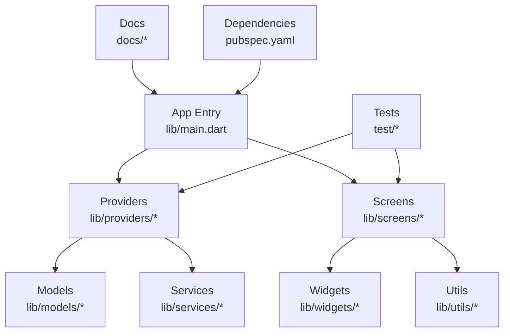
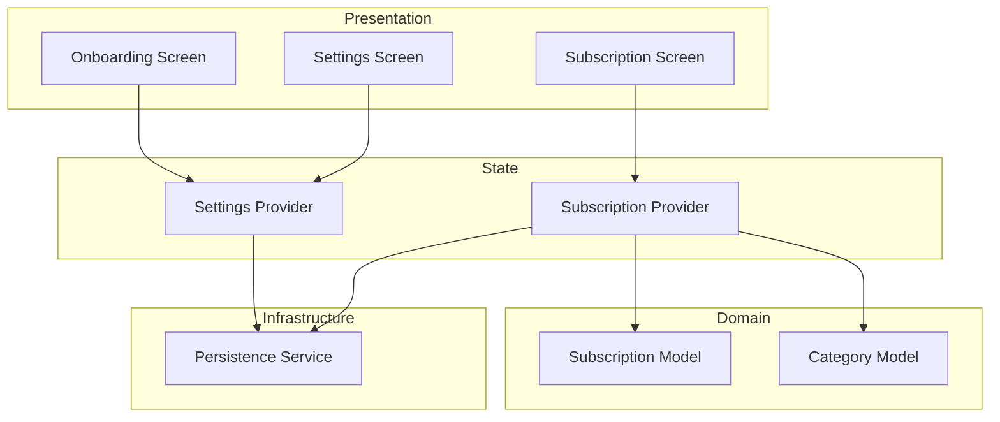
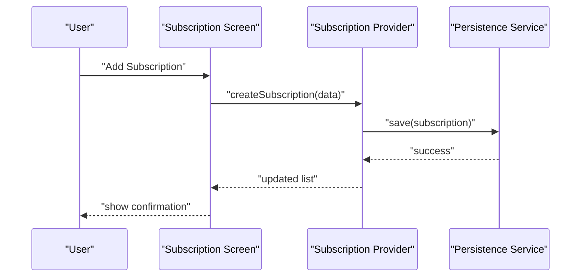
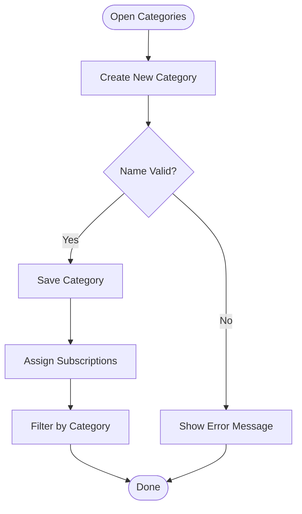
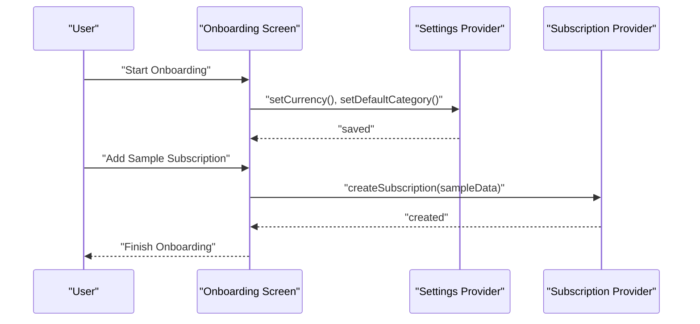
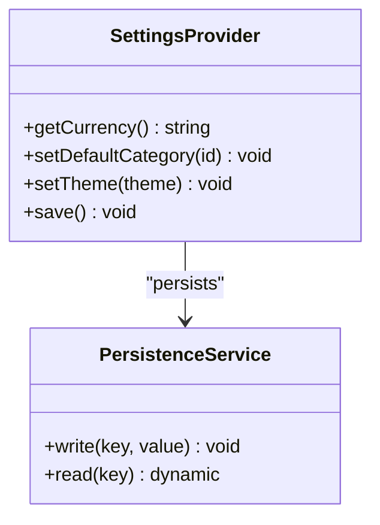
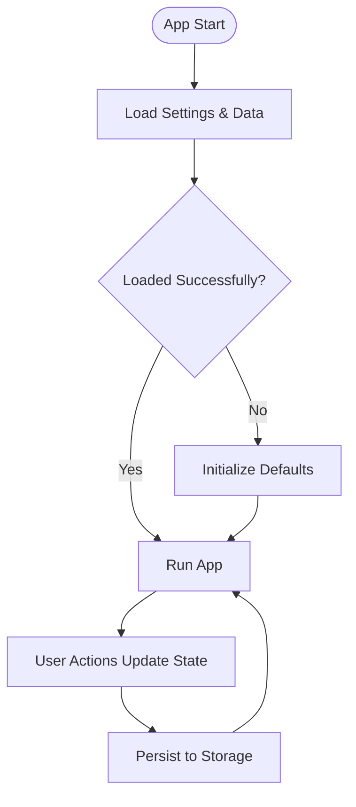
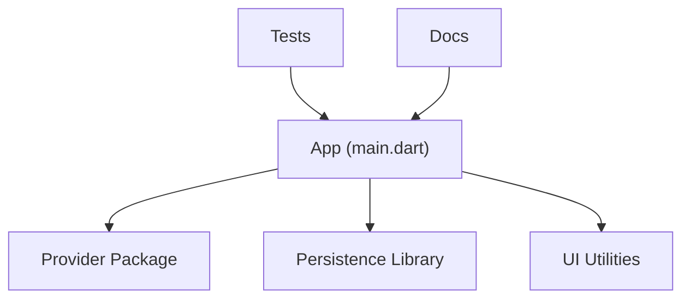

# Core Features

<cite>
**Referenced Files in This Document**
- [main.dart](file://lib/main.dart)
- [pubspec.yaml](file://pubspec.yaml)
- [README.md](file://README.md)
- [ARCHITECTURE.md](file://docs/ARCHITECTURE.md)
- [PROJECT_BRIEF.md](file://docs/PROJECT_BRIEF.md)
- [UI_GUIDE.md](file://docs/UI_GUIDE.md)
- [STRENGTHS_IMPROVEMENTS.md](file://docs/STRENGTHS_IMPROVEMENTS.md)
- [TASKS.md](file://docs/TASKS.md)
- [VALIDATION.md](file://docs/VALIDATION.md)
- [onboarding_screen_test.dart](file://test/onboarding_screen_test.dart)
- [settings_provider_test.dart](file://test/settings_provider_test.dart)
- [subscription_model_test.dart](file://test/subscription_model_test.dart)
- [subscription_provider_test.dart](file://test/subscription_provider_test.dart)
- [widgets_test.dart](file://test/widgets_test.dart)
</cite>

## Table of Contents
1. [Introduction](#introduction)
2. [Project Structure](#project-structure)
3. [Core Components](#core-components)
4. [Architecture Overview](#architecture-overview)
5. [Detailed Component Analysis](#detailed-component-analysis)
6. [Dependency Analysis](#dependency-analysis)
7. [Performance Considerations](#performance-considerations)
8. [Troubleshooting Guide](#troubleshooting-guide)
9. [Conclusion](#conclusion)
10. [Appendices](#appendices)

## Introduction
This document explains the core features of the ASSINATURAS NINJA subscription management application from both user and technical perspectives. It covers:
- Subscription management (CRUD operations, categories, analytics)
- User onboarding flow
- Settings and preferences management
- Data persistence approach
It also describes user workflows, data models involved, state management strategy, integration points, practical usage examples, and configuration options available to end users.

## Project Structure
The project follows a standard Flutter layout with clear separation of concerns:
- lib: Application source code (models, providers, screens, services, utils, widgets)
- test: Unit and widget tests for key features
- docs: Architecture, UI guide, project brief, tasks, validation notes
- android/ios: Platform-specific configurations and entry points
- pubspec.yaml: Dependencies and assets

**Diagram sources**
- [main.dart](file://lib/main.dart)
- [pubspec.yaml](file://pubspec.yaml)
- [ARCHITECTURE.md](file://docs/ARCHITECTURE.md)

**Section sources**
- [README.md](file://README.md)
- [ARCHITECTURE.md](file://docs/ARCHITECTURE.md)
- [pubspec.yaml](file://pubspec.yaml)

## Core Components
- Subscription Management
  - Create, read, update, delete subscriptions
  - Categorize subscriptions
  - View analytics (e.g., monthly spend, upcoming renewals)
- Onboarding Flow
  - Guided setup for first-time users
  - Collects initial preferences and sample data
- Settings and Preferences
  - Currency, theme, notifications, default category
  - Persisted across app sessions
- Data Persistence
  - Local storage via provider-backed state
  - Optional platform integrations as needed

User perspective highlights:
- New users are guided through onboarding to set currency, default category, and add an initial subscription.
- Users can manage subscriptions by adding/editing/removing entries and organizing them into categories.
- Analytics provide insights into spending trends and renewal schedules.
- Settings allow customization of appearance and behavior.

Technical perspective highlights:
- State is managed using providers (state containers) that expose CRUD operations and computed metrics.
- Models represent domain entities such as Subscription and Category.
- Services encapsulate persistence logic and any external integrations.
- Screens orchestrate UI flows and consume provider state.

**Section sources**
- [ARCHITECTURE.md](file://docs/ARCHITECTURE.md)
- [PROJECT_BRIEF.md](file://docs/PROJECT_BRIEF.md)
- [UI_GUIDE.md](file://docs/UI_GUIDE.md)

## Architecture Overview
The application uses a layered architecture typical of modern Flutter apps:
- Presentation layer: Screens and Widgets render UI and handle user interactions.
- State layer: Providers hold and mutate application state, exposing reactive APIs.
- Domain layer: Models define data structures and business rules.
- Infrastructure layer: Services implement persistence and platform integrations.

[No sources needed since this diagram shows conceptual architecture]

## Detailed Component Analysis

### Subscription Management
User workflow:
- Add a new subscription: choose name, cost, billing cycle, start date, and category.
- Edit existing subscriptions: update details or change category.
- Remove subscriptions: confirm deletion before removal.
- Filter and sort by category or due date.
- View analytics: total monthly cost, upcoming renewals, per-category breakdown.

Implementation overview:
- Models define subscription fields and derived properties (e.g., next renewal).
- Provider exposes methods to create, update, delete, and query subscriptions.
- Analytics compute aggregates from the current dataset.
- Screens bind to provider state and trigger actions on user input.

Practical example:
- To add a streaming service: enter name, monthly cost, select “Streaming” category, set billing cycle to monthly, and save. The screen updates immediately and analytics reflect the new recurring expense.

Configuration options:
- Default category for quick-add
- Sorting order (by name, cost, due date)
- Display currency symbol and locale formatting

**Section sources**
- [subscription_model_test.dart](file://test/subscription_model_test.dart)
- [subscription_provider_test.dart](file://test/subscription_provider_test.dart)
- [UI_GUIDE.md](file://docs/UI_GUIDE.md)

### Categories
User workflow:
- Create, rename, or delete categories.
- Assign subscriptions to categories during creation or edit.
- Use category filters in lists and analytics views.

Implementation overview:
- Category model defines identifiers and display attributes.
- Provider manages category list and associations with subscriptions.
- Validation ensures unique names and prevents deletion if in use.

Practical example:
- Create a “Utilities” category and assign internet and electricity subscriptions. Then filter the subscription list to view only utilities.

**Section sources**
- [subscription_provider_test.dart](file://test/subscription_provider_test.dart)
- [UI_GUIDE.md](file://docs/UI_GUIDE.md)

### Analytics
User workflow:
- View total monthly cost and per-category breakdown.
- See upcoming renewals within a configurable time window.
- Export or share summary (if supported by platform).

Implementation overview:
- Provider computes metrics based on current subscriptions and settings (currency, locale).
- Analytics components subscribe to provider state and re-render when data changes.

Practical example:
- After adding multiple subscriptions, open the analytics tab to see your projected monthly spend and which subscriptions renew soon.

**Section sources**
- [subscription_provider_test.dart](file://test/subscription_provider_test.dart)
- [UI_GUIDE.md](file://docs/UI_GUIDE.md)

### User Onboarding Flow
User workflow:
- First launch presents onboarding steps: choose currency, set default category, optionally add a sample subscription.
- Completion saves preferences and initializes default data.

Implementation overview:
- Onboarding screen orchestrates step-by-step inputs and validates entries.
- Settings provider persists choices; subscription provider seeds initial data if requested.

Practical example:
- Select “BRL” as currency, choose “Streaming” as default category, and add a sample Netflix subscription. Finish to go to the main dashboard.

**Section sources**
- [onboarding_screen_test.dart](file://test/onboarding_screen_test.dart)
- [UI_GUIDE.md](file://docs/UI_GUIDE.md)

### Settings and Preferences
User workflow:
- Configure currency, theme, notification preferences, and default category.
- Changes apply immediately and persist across sessions.

Implementation overview:
- Settings provider holds preferences and exposes setters/getters.
- Persistence service writes settings to local storage.
- UI binds to provider state for live updates.

Practical example:
- Change theme to dark mode and set default category to “Entertainment”. All subsequent quick-adds will use the selected category and theme applies instantly.

**Section sources**
- [settings_provider_test.dart](file://test/settings_provider_test.dart)
- [UI_GUIDE.md](file://docs/UI_GUIDE.md)

### Data Persistence
User perspective:
- All subscriptions, categories, and settings are saved automatically.
- App restores previous state after restart.

Technical approach:
- Provider-based state with persistence service abstraction.
- Local storage implementation handles serialization and retrieval.
- Tests validate consistency and recovery scenarios.

**Section sources**
- [subscription_provider_test.dart](file://test/subscription_provider_test.dart)
- [settings_provider_test.dart](file://test/settings_provider_test.dart)

## Dependency Analysis
Key dependencies include:
- Flutter framework and Dart SDK
- State management package (provider)
- Persistence library (as configured in pubspec)
- UI and utility packages referenced in pubspec

**Diagram sources**
- [pubspec.yaml](file://pubspec.yaml)
- [main.dart](file://lib/main.dart)

**Section sources**
- [pubspec.yaml](file://pubspec.yaml)
- [ARCHITECTURE.md](file://docs/ARCHITECTURE.md)

## Performance Considerations
- Minimize unnecessary rebuilds by scoping provider listeners to specific widgets.
- Compute analytics lazily and cache results when datasets are large.
- Debounce frequent writes to persistence to avoid excessive I/O.
- Use efficient sorting and filtering strategies in lists.

[No sources needed since this section provides general guidance]

## Troubleshooting Guide
Common issues and resolutions:
- Onboarding does not complete: verify required fields and validation rules.
- Settings not persisting: check persistence service initialization and storage permissions.
- Analytics show incorrect totals: ensure currency and billing cycles are correctly set.
- Widget tests failing: confirm provider mocks and test fixtures match expected state.

Useful references:
- Test files demonstrate expected behaviors and edge cases for providers and screens.
- Validation notes outline constraints and error messages.

**Section sources**
- [onboarding_screen_test.dart](file://test/onboarding_screen_test.dart)
- [settings_provider_test.dart](file://test/settings_provider_test.dart)
- [subscription_model_test.dart](file://test/subscription_model_test.dart)
- [subscription_provider_test.dart](file://test/subscription_provider_test.dart)
- [widgets_test.dart](file://test/widgets_test.dart)
- [VALIDATION.md](file://docs/VALIDATION.md)

## Conclusion
ASSINATURAS NINJA delivers a focused subscription management experience with clear user workflows and robust technical foundations. Subscription CRUD, categorization, and analytics are powered by provider-based state and persisted locally. Onboarding streamlines initial setup, while settings enable personalization. The modular structure and comprehensive tests support maintainability and reliability.

[No sources needed since this section summarizes without analyzing specific files]

## Appendices
- Practical usage checklist:
  - Complete onboarding to configure currency and default category.
  - Add subscriptions with accurate billing cycles and categories.
  - Review analytics regularly to monitor spending and renewals.
  - Adjust settings to tailor the app to your preferences.
- Configuration options summary:
  - Currency and locale formatting
  - Theme selection
  - Default category assignment
  - Notification preferences (if enabled)

[No sources needed since this section provides general guidance]