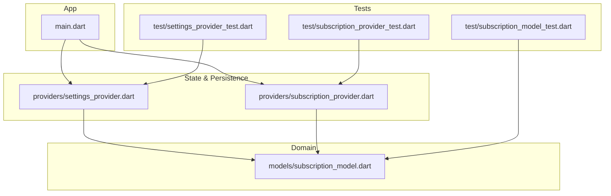
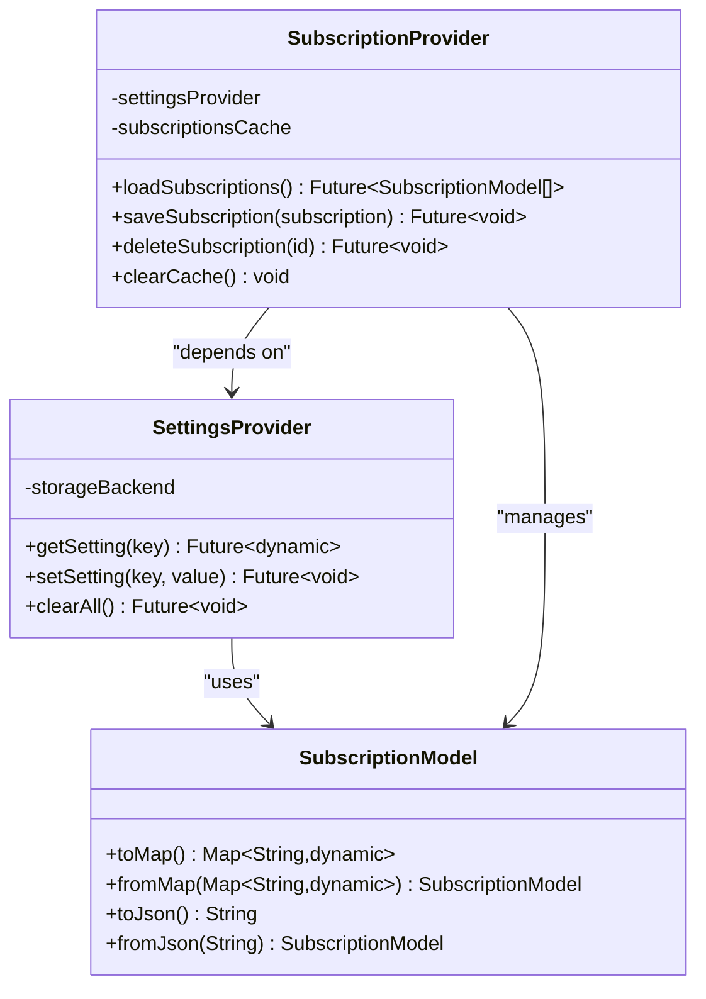
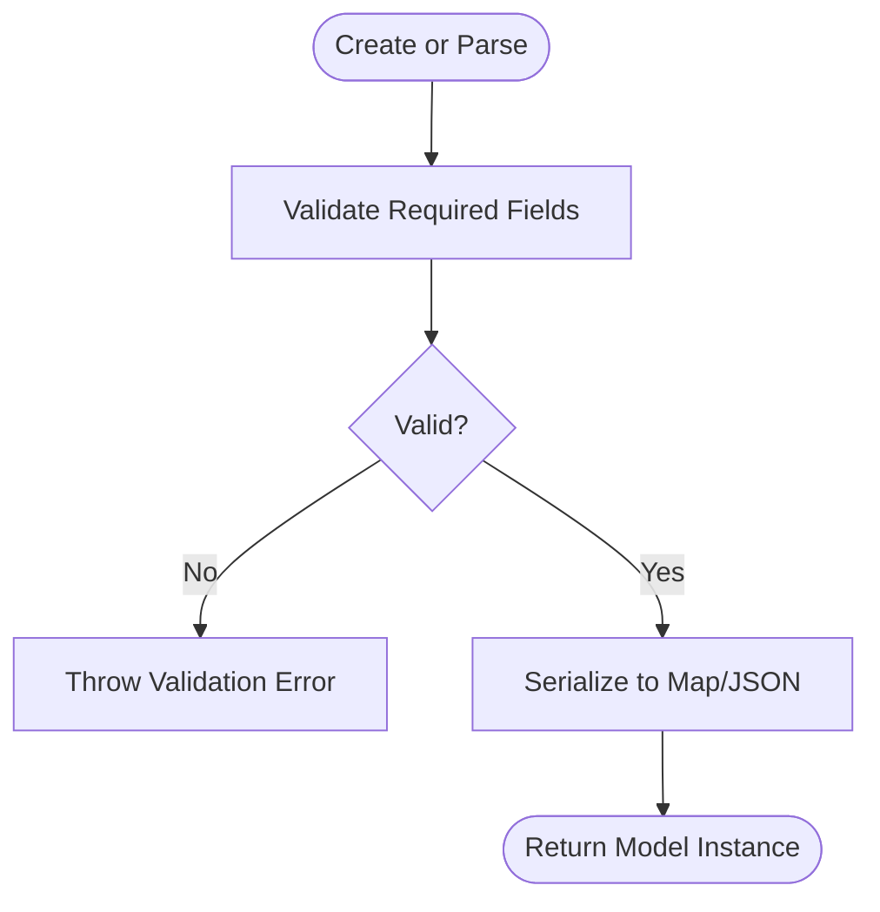
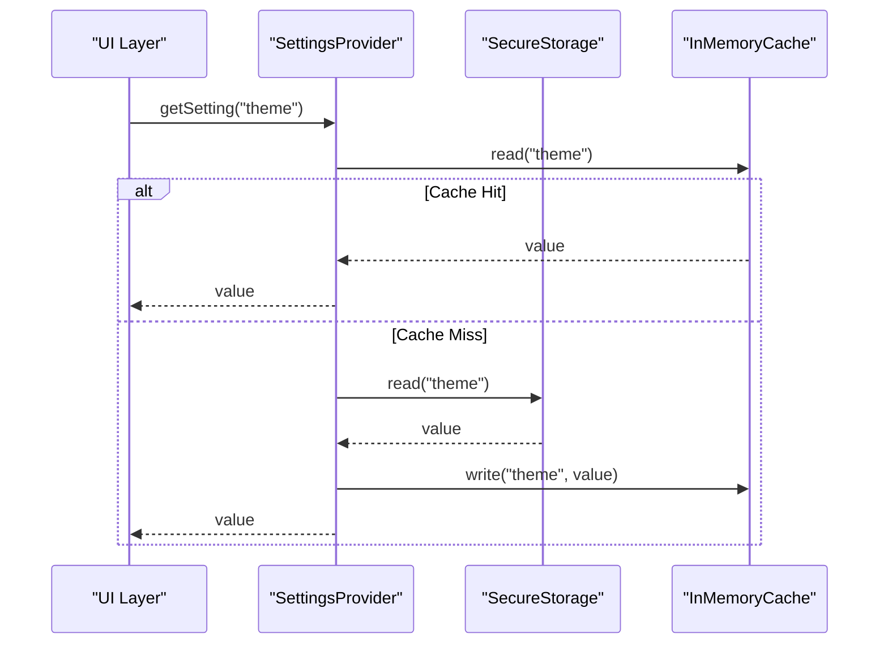
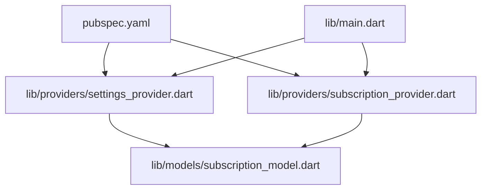

# Data Persistence and Storage

<cite>
**Referenced Files in This Document**
- [pubspec.yaml](file://pubspec.yaml)
- [lib/main.dart](file://lib/main.dart)
- [lib/models/subscription_model.dart](file://lib/models/subscription_model.dart)
- [lib/providers/settings_provider.dart](file://lib/providers/settings_provider.dart)
- [lib/providers/subscription_provider.dart](file://lib/providers/subscription_provider.dart)
- [test/subscription_model_test.dart](file://test/subscription_model_test.dart)
- [test/settings_provider_test.dart](file://test/settings_provider_test.dart)
- [test/subscription_provider_test.dart](file://test/subscription_provider_test.dart)
</cite>

## Table of Contents
1. [Introduction](#introduction)
2. [Project Structure](#project-structure)
3. [Core Components](#core-components)
4. [Architecture Overview](#architecture-overview)
5. [Detailed Component Analysis](#detailed-component-analysis)
6. [Dependency Analysis](dependency-analysis)
7. [Performance Considerations](#performance-considerations)
8. [Troubleshooting Guide](#troubleshooting-guide)
9. [Conclusion](#conclusion)
10. [Appendices](#appendices)

## Introduction
This document explains the data persistence layer for ASSINATURAS NINJA, focusing on how data is modeled, stored, accessed, and tested. It covers local storage implementation, serialization formats, repository-style abstractions, caching strategies, migration and versioning considerations, encryption guidance, validation at storage boundaries, conflict resolution approaches, backup mechanisms, integrity checks, corruption recovery, cleanup procedures, and testing strategies including mocks and test data management. The goal is to provide a clear, actionable guide for extending and maintaining the persistence layer safely and efficiently.

## Project Structure
The project follows a Flutter architecture with models, providers (state and persistence), and tests. The key areas relevant to persistence are:
- Models: define domain entities and their serialization logic
- Providers: encapsulate state and persistence operations using repositories or services
- Tests: validate model behavior and provider interactions with mocked storage

[No sources needed since this diagram shows conceptual workflow, not actual code structure]

## Core Components
- Subscription Model: Represents subscription entities and provides serialization/deserialization methods used by storage layers.
- Settings Provider: Manages application settings and persists them locally, typically via a secure storage package.
- Subscription Provider: Encapsulates CRUD operations for subscriptions, coordinating between UI state and persistent storage.

These components implement a repository-like pattern where providers act as the single source of truth for persistence operations, abstracting underlying storage details from the UI.

**Section sources**
- [lib/models/subscription_model.dart](file://lib/models/subscription_model.dart)
- [lib/providers/settings_provider.dart](file://lib/providers/settings_provider.dart)
- [lib/providers/subscription_provider.dart](file://lib/providers/subscription_provider.dart)

## Architecture Overview
The persistence architecture separates concerns across models, providers, and storage backends:
- Models define data contracts and conversion utilities
- Providers implement repository-style APIs and manage caching
- Storage backends handle serialization and platform-specific persistence

**Diagram sources**
- [lib/models/subscription_model.dart](file://lib/models/subscription_model.dart)
- [lib/providers/settings_provider.dart](file://lib/providers/settings_provider.dart)
- [lib/providers/subscription_provider.dart](file://lib/providers/subscription_provider.dart)

## Detailed Component Analysis

### Subscription Model
Responsibilities:
- Define fields for subscription entities
- Provide map/json conversion methods for serialization
- Validate inputs during construction or parsing

Serialization format:
- JSON-based representation for portability and readability
- Map-based internal representation for efficient processing

Validation:
- Ensure required fields are present and non-null
- Enforce constraints such as date ranges and numeric bounds

Migration and compatibility:
- Use versioned deserialization to handle schema evolution
- Provide default values for optional fields to maintain backward compatibility

**Section sources**
- [lib/models/subscription_model.dart](file://lib/models/subscription_model.dart)

### Settings Provider
Responsibilities:
- Persist user preferences securely
- Provide synchronous/asynchronous getters/setters
- Handle initialization and fallback defaults

Local storage implementation:
- Uses a secure storage backend suitable for mobile platforms
- Ensures sensitive keys are encrypted at rest

Caching strategy:
- In-memory cache for frequently accessed settings
- Lazy loading on first access to reduce startup time

Encryption guidance:
- Rely on platform-provided secure storage for encryption
- Avoid storing raw secrets; prefer tokens or references

Conflict resolution:
- Last-write-wins semantics for simple settings
- Merge strategies for complex nested objects if needed

Backup mechanism:
- Export settings to a secure file when requested
- Import settings with validation and rollback on failure

Data integrity checks:
- Validate imported settings against expected schema
- Rollback changes if validation fails

Cleanup procedures:
- Clear all settings on app reset or logout
- Remove orphaned entries after migrations

**Diagram sources**
- [lib/providers/settings_provider.dart](file://lib/providers/settings_provider.dart)

**Section sources**
- [lib/providers/settings_provider.dart](file://lib/providers/settings_provider.dart)

### Subscription Provider
Responsibilities:
- Manage subscription lifecycle (create, read, update, delete)
- Coordinate with settings provider for configuration
- Maintain an in-memory cache for performance

Repository pattern:
- Exposes high-level APIs that hide storage specifics
- Allows swapping storage backends without changing UI code

Caching strategy:
- Cache subscription list in memory
- Invalidate cache on mutations or explicit refresh

Query optimization:
- Filter and sort in-memory after fetching once
- Defer heavy computations until needed

Conflict resolution:
- Detect concurrent updates using timestamps or version numbers
- Apply merge rules based on business logic

Backup and restore:
- Export subscriptions to a secure file
- Import with validation and conflict handling

Integrity checks:
- Verify referential integrity before persisting
- Rebuild indexes after import to ensure consistency

Corruption recovery:
- Attempt to parse persisted data with fallbacks
- Reset to defaults if corruption is detected

Cleanup procedures:
- Remove expired or archived subscriptions
- Compact storage periodically

```mermaid
sequenceDiagram
participant UI as "UI Layer"
participant Prov as "SubscriptionProvider"
participant Cache as "InMemoryCache"
participant Store as "PersistentStore"
UI->>Prov : loadSubscriptions()
Prov->>Cache : readAll()
alt Cache Has Data
Cache-->>Prov : list
Prov-->>UI : list
else Cache Empty
Prov->>Store : readAll()
Store-->>Prov : list
Prov->>Cache : writeAll(list)
Prov-->>UI : list
end
```

**Diagram sources**
- [lib/providers/subscription_provider.dart](file://lib/providers/subscription_provider.dart)

**Section sources**
- [lib/providers/subscription_provider.dart](file://lib/providers/subscription_provider.dart)

### Data Migration Procedures
- Versioned schema: store a schema version alongside data
- Migration functions: apply incremental transformations
- Rollback support: keep backups before applying migrations
- Compatibility handling: gracefully handle missing fields with defaults

Example approach:
- On app start, check current schema version
- If outdated, run migration steps sequentially
- Update version and persist new schema

**Section sources**
- [lib/providers/settings_provider.dart](file://lib/providers/settings_provider.dart)
- [lib/providers/subscription_provider.dart](file://lib/providers/subscription_provider.dart)

### Encryption for Sensitive Data
- Use platform-backed secure storage for keys and tokens
- Encrypt payloads before writing to less secure stores
- Rotate encryption keys periodically and migrate existing data

**Section sources**
- [lib/providers/settings_provider.dart](file://lib/providers/settings_provider.dart)

### Data Validation at Storage Level
- Validate inputs before serialization
- Reject malformed records and log errors
- Provide detailed error messages for debugging

**Section sources**
- [lib/models/subscription_model.dart](file://lib/models/subscription_model.dart)

### Conflict Resolution Strategies
- Timestamp-based last-write-wins
- Field-level merging for partial updates
- User prompts for ambiguous conflicts

**Section sources**
- [lib/providers/subscription_provider.dart](file://lib/providers/subscription_provider.dart)

### Backup Mechanisms
- Export to encrypted files
- Import with validation and rollback
- Schedule periodic backups

**Section sources**
- [lib/providers/settings_provider.dart](file://lib/providers/settings_provider.dart)
- [lib/providers/subscription_provider.dart](file://lib/providers/subscription_provider.dart)

### Data Integrity Checks and Corruption Recovery
- Schema validation on load
- Fallback to defaults on corruption
- Rebuild indexes and caches after recovery

**Section sources**
- [lib/providers/subscription_provider.dart](file://lib/providers/subscription_provider.dart)

### Storage Cleanup Procedures
- Remove obsolete entries
- Compact storage to reclaim space
- Periodic maintenance tasks

**Section sources**
- [lib/providers/subscription_provider.dart](file://lib/providers/subscription_provider.dart)

### Implementing New Data Entities
Steps:
- Create a new model with serialization methods
- Add repository methods in the appropriate provider
- Integrate into UI via provider APIs
- Write unit tests for model and provider interactions

**Section sources**
- [lib/models/subscription_model.dart](file://lib/models/subscription_model.dart)
- [lib/providers/subscription_provider.dart](file://lib/providers/subscription_provider.dart)

### Writing Custom Storage Adapters
Approach:
- Define an interface for storage operations
- Implement adapters for different backends (e.g., secure storage, file system)
- Inject adapter into providers for flexibility

**Section sources**
- [lib/providers/settings_provider.dart](file://lib/providers/settings_provider.dart)
- [lib/providers/subscription_provider.dart](file://lib/providers/subscription_provider.dart)

### Optimizing Query Performance
Techniques:
- Cache results in memory
- Batch writes to reduce I/O
- Use indexes for frequent filters and sorts

**Section sources**
- [lib/providers/subscription_provider.dart](file://lib/providers/subscription_provider.dart)

## Dependency Analysis
External dependencies relevant to persistence are declared in the project manifest. Review the manifest to identify packages used for secure storage, JSON serialization, and other persistence utilities.

**Diagram sources**
- [pubspec.yaml](file://pubspec.yaml)
- [lib/main.dart](file://lib/main.dart)
- [lib/providers/settings_provider.dart](file://lib/providers/settings_provider.dart)
- [lib/providers/subscription_provider.dart](file://lib/providers/subscription_provider.dart)
- [lib/models/subscription_model.dart](file://lib/models/subscription_model.dart)

**Section sources**
- [pubspec.yaml](file://pubspec.yaml)
- [lib/main.dart](file://lib/main.dart)

## Performance Considerations
- Minimize disk I/O by batching operations
- Use in-memory caches for hot paths
- Avoid unnecessary serialization/deserialization
- Profile storage operations under realistic workloads

[No sources needed since this section provides general guidance]

## Troubleshooting Guide
Common issues and resolutions:
- Serialization failures: validate input shapes and field types
- Storage permission errors: check platform permissions and fallbacks
- Corrupted data: detect and recover using defaults or backups
- Cache inconsistencies: invalidate caches on mutations and reload

Testing aids:
- Unit tests for model conversions
- Provider tests with mocked storage backends
- Integration tests for end-to-end flows

**Section sources**
- [test/subscription_model_test.dart](file://test/subscription_model_test.dart)
- [test/settings_provider_test.dart](file://test/settings_provider_test.dart)
- [test/subscription_provider_test.dart](file://test/subscription_provider_test.dart)

## Conclusion
The persistence layer in ASSINATURAS NINJA uses a clean separation between models, providers, and storage backends. Providers implement repository-style APIs with caching and robust error handling. By following the guidelines for migration, encryption, validation, conflict resolution, backup, integrity checks, and testing, you can extend the system safely and maintain high reliability.

[No sources needed since this section summarizes without analyzing specific files]

## Appendices

### Testing Approaches for Persistence Layer
- Mock implementations: replace real storage with in-memory or fake backends
- Test data management: create fixtures for common scenarios
- Assertions: verify both state changes and side effects (e.g., cache updates)

**Section sources**
- [test/subscription_model_test.dart](file://test/subscription_model_test.dart)
- [test/settings_provider_test.dart](file://test/settings_provider_test.dart)
- [test/subscription_provider_test.dart](file://test/subscription_provider_test.dart)