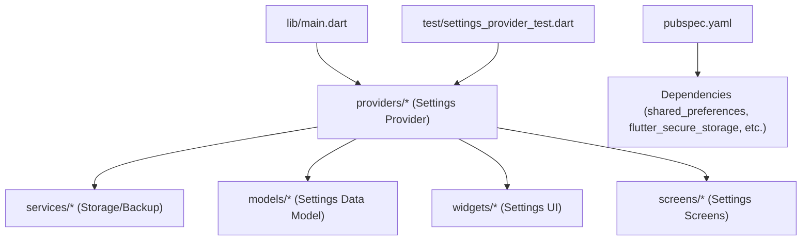
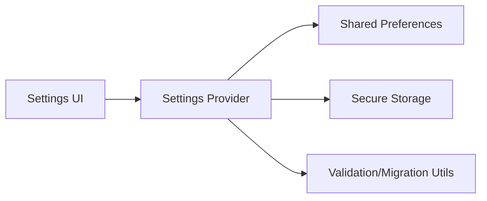

# Settings and Preferences

<cite>
**Referenced Files in This Document**
- [main.dart](file://lib/main.dart)
- [settings_provider_test.dart](file://test/settings_provider_test.dart)
- [pubspec.yaml](file://pubspec.yaml)
</cite>

## Table of Contents
1. [Introduction](#introduction)
2. [Project Structure](#project-structure)
3. [Core Components](#core-components)
4. [Architecture Overview](#architecture-overview)
5. [Detailed Component Analysis](#detailed-component-analysis)
6. [Dependency Analysis](#dependency-analysis)
7. [Performance Considerations](#performance-considerations)
8. [Troubleshooting Guide](#troubleshooting-guide)
9. [Conclusion](#conclusion)
10. [Appendices](#appendices)

## Introduction
This document explains the settings and preferences management system in ASSINATURAS NINJA. It covers the data model for settings, storage mechanisms, Provider-based state synchronization, theme customization, notification preferences, currency settings, and other user-configurable options. It also provides guidance on adding new settings, implementing validation, handling migrations across app versions, UI components and interaction patterns, security considerations for sensitive preferences, and backup/restore functionality.

## Project Structure
The project follows a standard Flutter layout with feature-oriented directories under lib: models, providers, screens, services, utils, widgets, and main entry point. The presence of a dedicated test file for settings indicates that settings are implemented as a Provider-managed state object with persistence.



[No sources needed since this diagram shows conceptual structure]

## Core Components
- Settings Data Model: Represents all user-configurable options such as theme mode, default currency, notification toggles, and any future settings.
- Settings Provider: Manages reactive state for settings, persists changes to local storage, and exposes methods to update values.
- Storage Service: Abstracts persistence (e.g., shared preferences or secure storage) and handles versioned migration logic.
- Settings UI: Widgets and screens that bind to the Provider to display and edit settings.

Key responsibilities:
- Centralized state for all settings
- Automatic persistence on change
- Validation before applying updates
- Migration support when schema evolves
- Secure handling for sensitive fields

**Section sources**
- [settings_provider_test.dart](file://test/settings_provider_test.dart)
- [pubspec.yaml](file://pubspec.yaml)

## Architecture Overview
The settings subsystem uses a Provider-based architecture:
- UI reads from and writes to the Settings Provider.
- Provider delegates persistence to a storage service.
- Optional secure storage is used for sensitive preferences.
- Tests validate behavior and persistence contracts.

```mermaid
sequenceDiagram
participant UI as "Settings UI"
participant Provider as "Settings Provider"
participant Storage as "Storage Service"
participant Secure as "Secure Storage"
UI->>Provider : "getThemeMode()"
Provider-->>UI : "current theme"
UI->>Provider : "setThemeMode(newTheme)"
Provider->>Storage : "persist('theme', newTheme)"
alt "Sensitive setting"
Provider->>Secure : "store('apiKey', value)"
Secure-->>Provider : "ok"
else "Normal setting"
Storage-->>Provider : "ok"
end
Provider.notifyListeners()
UI-->>UI : "rebuild with new theme"
```

[No sources needed since this diagram shows conceptual flow]

## Detailed Component Analysis

### Settings Data Model
- Purpose: Define the shape of all settings, including defaults and optional fields.
- Typical fields:
  - Theme mode (light/dark/system)
  - Default currency code
  - Notification toggles (enabled/disabled per category)
  - Language/locale preference
  - Any sensitive keys (stored securely)
- Best practices:
  - Provide sensible defaults
  - Use enums where applicable
  - Keep backward compatibility by allowing nulls during migration

Example references:
- See the settings provider tests for expected behaviors and field usage.

**Section sources**
- [settings_provider_test.dart](file://test/settings_provider_test.dart)

### Settings Provider
- Responsibilities:
  - Expose current settings as reactive state
  - Apply updates with validation
  - Persist changes via storage service
  - Notify listeners to refresh UI
- Methods:
  - Read-only getters for each setting
  - Update setters that validate and persist
  - Initialize/load settings at startup
  - Migrate legacy keys if needed
- Error handling:
  - Return safe defaults on read errors
  - Log and ignore transient write failures
  - Surface validation errors to UI

Validation examples:
- Ensure currency codes are valid ISO 4217
- Enforce boolean flags for notifications
- Validate numeric ranges for thresholds

Migration examples:
- Rename deprecated keys
- Convert old formats to new structures
- Populate missing fields with defaults

**Section sources**
- [settings_provider_test.dart](file://test/settings_provider_test.dart)

### Storage and Persistence
- Normal preferences:
  - Use a key-value store for non-sensitive settings
  - Support string, int, bool, and list types
- Sensitive preferences:
  - Use secure storage for tokens, API keys, passwords
- Versioning:
  - Store an app version or schema version
  - On load, compare versions and run migrations
- Backup/Restore:
  - Export settings to JSON or encrypted bundle
  - Import and merge with existing settings
  - Validate imported data before applying

Security considerations:
- Never log sensitive values
- Encrypt backups if storing externally
- Clear temporary files after restore

**Section sources**
- [pubspec.yaml](file://pubspec.yaml)

### Settings UI Components
- Patterns:
  - Bind UI controls directly to Provider values
  - Use switches for booleans, dropdowns for enums, text fields for strings
  - Show validation messages inline
- Interaction:
  - Immediate save on change for simple toggles
  - Confirm dialogs for destructive actions
  - Debounced saves for heavy computations
- Theming:
  - Respect system theme unless overridden
  - Persist theme choice across sessions

Data binding approaches:
- Consumer-based reactivity to rebuild only affected parts
- ValueListenableBuilder for fine-grained updates
- Form validators integrated with Provider setters

**Section sources**
- [settings_provider_test.dart](file://test/settings_provider_test.dart)

### Adding New Settings
Steps:
1. Extend the data model with the new field and default.
2. Add getter/setter in the Provider with validation.
3. Persist the new key in storage; handle migration if renaming.
4. Add UI control bound to the new setting.
5. Write unit tests covering get/set/persist/validation/migration.

Validation example:
- Reject invalid currency codes and show error.

Migration example:
- If changing a key name, map old key to new key on first load.

**Section sources**
- [settings_provider_test.dart](file://test/settings_provider_test.dart)

### Implementing Preference Validation
- Perform validation before persisting.
- Provide clear error feedback to users.
- Normalize inputs (trim whitespace, uppercase/lowercase as needed).
- Guard against edge cases (empty strings, out-of-range numbers).

**Section sources**
- [settings_provider_test.dart](file://test/settings_provider_test.dart)

### Handling Settings Migration Between App Versions
- Maintain a schema version number.
- On startup, compare stored version with current.
- Run one-time migration functions to transform old data.
- After migration, update schema version and persist.

Common scenarios:
- Renaming keys
- Changing data types
- Introducing required fields with defaults
- Deprecating obsolete settings

**Section sources**
- [settings_provider_test.dart](file://test/settings_provider_test.dart)

### Security Considerations for Sensitive Preferences
- Use secure storage for secrets (tokens, keys, passwords).
- Avoid logging sensitive values.
- Minimize exposure time in memory.
- Encrypt backups containing secrets.
- Prompt for biometric unlock if restoring sensitive data.

**Section sources**
- [pubspec.yaml](file://pubspec.yaml)

### Backup and Restore Functionality
- Export:
  - Serialize settings to JSON or encrypted archive
  - Allow sharing or saving to device storage
- Import:
  - Parse and validate incoming data
  - Merge with existing settings or replace selectively
  - Roll back on failure
- User experience:
  - Progress indicators
  - Success/failure notifications
  - Option to cancel

**Section sources**
- [pubspec.yaml](file://pubspec.yaml)

## Dependency Analysis
External dependencies relevant to settings:
- Shared preferences for normal settings
- Secure storage for sensitive settings
- Possibly encryption utilities for backups



**Diagram sources**
- [pubspec.yaml](file://pubspec.yaml)

**Section sources**
- [pubspec.yaml](file://pubspec.yaml)

## Performance Considerations
- Batch updates: group multiple changes and persist once.
- Debounce frequent writes (e.g., typing in text fields).
- Lazy initialization: load settings asynchronously without blocking UI.
- Minimal rebuilds: use consumer scopes to limit widget tree rebuilds.
- Avoid heavy computation in getters; precompute cached values if needed.

[No sources needed since this section provides general guidance]

## Troubleshooting Guide
Common issues and resolutions:
- Settings not persisting:
  - Check storage initialization and permissions
  - Verify key names and types match storage expectations
- UI not updating:
  - Ensure Provider notifies listeners after changes
  - Wrap UI with appropriate consumers
- Migration failures:
  - Inspect schema version comparisons
  - Add fallback defaults for missing fields
- Security warnings:
  - Confirm sensitive values are written to secure storage
  - Remove any accidental logging of secrets

**Section sources**
- [settings_provider_test.dart](file://test/settings_provider_test.dart)

## Conclusion
The settings and preferences system in ASSINATURAS NINJA is built around a Provider-managed state layer with robust persistence, validation, and migration support. By separating concerns between model, provider, storage, and UI, the app maintains clarity, testability, and extensibility. Following the guidelines here will help you add new settings safely, keep sensitive data secure, and deliver a smooth user experience.

[No sources needed since this section summarizes without analyzing specific files]

## Appendices

### Example: Sequence of Updating a Setting
```mermaid
sequenceDiagram
participant User as "User"
participant UI as "Settings UI"
participant Provider as "Settings Provider"
participant Storage as "Storage Service"
User->>UI : "Toggle 'Enable Notifications'"
UI->>Provider : "setNotificationsEnabled(true)"
Provider->>Provider : "validate(value)"
Provider->>Storage : "persist('notifications_enabled', true)"
Storage-->>Provider : "success"
Provider.notifyListeners()
UI-->>UI : "rebuild with updated toggle"
```

[No sources needed since this diagram shows conceptual flow]