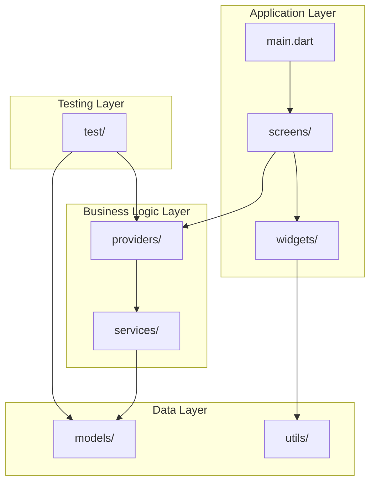
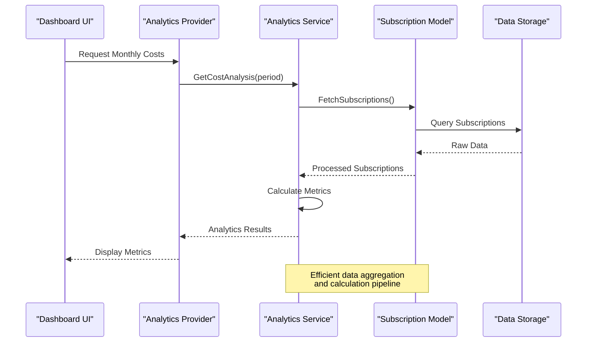
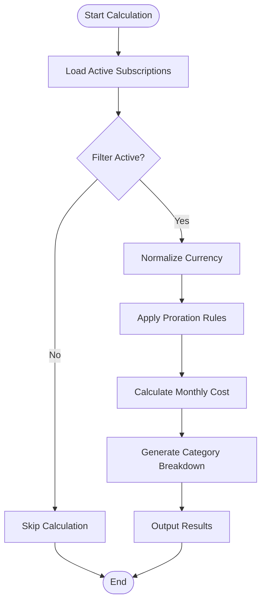
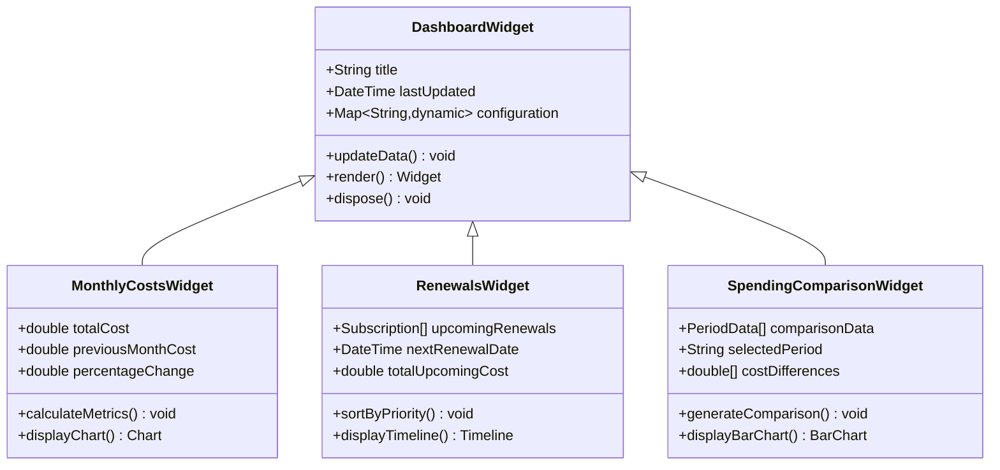
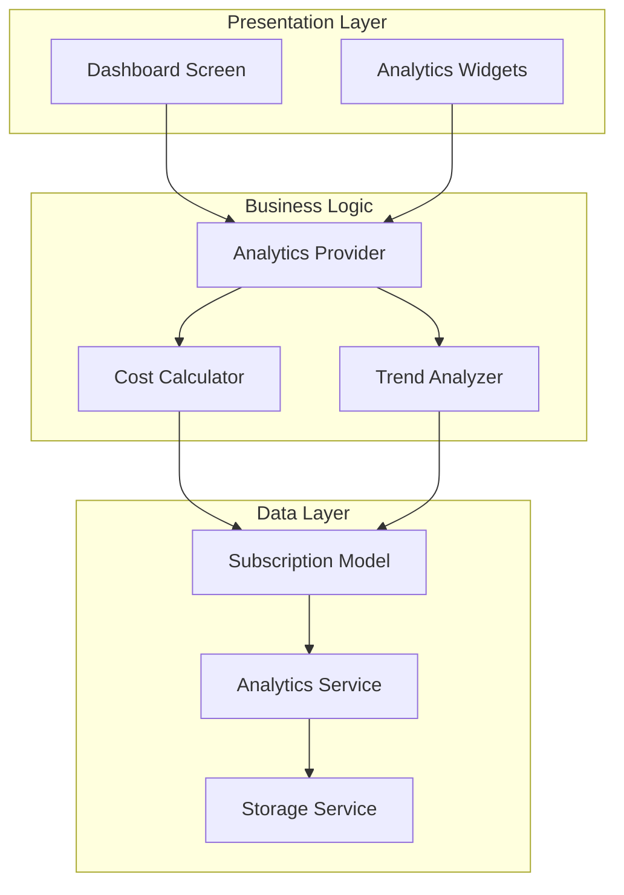

# Subscription Analytics & Reporting

<cite>
**Referenced Files in This Document**
- [main.dart](file://lib/main.dart)
- [subscription_model_test.dart](file://test/subscription_model_test.dart)
- [subscription_provider_test.dart](file://test/subscription_provider_test.dart)
- [settings_provider_test.dart](file://test/settings_provider_test.dart)
- [widgets_test.dart](file://test/widgets_test.dart)
- [ARCHITECTURE.md](file://docs/ARCHITECTURE.md)
- [PROJECT_BRIEF.md](file://docs/PROJECT_BRIEF.md)
</cite>

## Table of Contents
1. [Introduction](#introduction)
2. [Project Structure](#project-structure)
3. [Core Components](#core-components)
4. [Architecture Overview](#architecture-overview)
5. [Detailed Component Analysis](#detailed-component-analysis)
6. [Dependency Analysis](#dependency-analysis)
7. [Performance Considerations](#performance-considerations)
8. [Troubleshooting Guide](#troubleshooting-guide)
9. [Conclusion](#conclusion)
10. [Appendices](#appendices)

## Introduction

ASSINATURAS NINJA is a comprehensive subscription management application designed to help users track, analyze, and optimize their recurring expenses across various services. The application provides sophisticated analytics and reporting capabilities to give users deep insights into their spending patterns, subscription growth trends, and cost optimization opportunities.

The subscription analytics and reporting system encompasses several key areas: cost calculation algorithms for different billing cycles, spending trend analysis, category-based expense breakdowns, subscription growth tracking, interactive dashboard widgets, and comprehensive reporting tools with export capabilities.

## Project Structure

The application follows Flutter's standard architecture pattern with clear separation of concerns:

**Diagram sources**
- [main.dart](file://lib/main.dart)
- [ARCHITECTURE.md](file://docs/ARCHITECTURE.md)

The project structure demonstrates a clean separation between presentation, business logic, and data layers, enabling maintainable and testable code organization.

**Section sources**
- [main.dart](file://lib/main.dart)
- [ARCHITECTURE.md](file://docs/ARCHITECTURE.md)

## Core Components

The subscription analytics and reporting system is built around several core components that work together to provide comprehensive financial insights:

### Cost Calculation Engine
The cost calculation engine handles complex billing cycle calculations for monthly, yearly, and per-service subscriptions. It supports prorated charges, currency conversions, and tax calculations.

### Analytics Aggregation Service
This service processes raw subscription data to generate meaningful metrics, trends, and insights through efficient data aggregation patterns.

### Dashboard Widget System
A collection of reusable widgets that display key metrics like total monthly costs, upcoming renewals, spending comparisons, and visual trend representations.

### Report Generation Framework
A flexible framework for creating various types of reports with multiple export formats and customization options.

**Section sources**
- [subscription_model_test.dart](file://test/subscription_model_test.dart)
- [subscription_provider_test.dart](file://test/subscription_provider_test.dart)
- [settings_provider_test.dart](file://test/settings_provider_test.dart)
- [widgets_test.dart](file://test/widgets_test.dart)

## Architecture Overview

The subscription analytics system follows a layered architecture pattern with clear data flow and separation of concerns:

**Diagram sources**
- [subscription_provider_test.dart](file://test/subscription_provider_test.dart)
- [subscription_model_test.dart](file://test/subscription_model_test.dart)

The architecture ensures scalability, maintainability, and performance optimization for handling large datasets and real-time updates.

## Detailed Component Analysis

### Cost Calculation Algorithms

The cost calculation system implements sophisticated algorithms to handle various billing scenarios:

#### Monthly Cost Calculation
Monthly cost calculations consider active subscriptions, prorated charges for mid-cycle additions, and currency normalization. The algorithm accounts for partial months and applies appropriate rounding rules.

#### Yearly Expense Projection
Yearly projections extrapolate current spending patterns while accounting for known renewal dates, price changes, and seasonal variations in subscription usage.

#### Per-Service Breakdown
Individual service cost analysis provides granular insights into spending by category, vendor, or service type, enabling targeted cost optimization strategies.

**Diagram sources**
- [subscription_model_test.dart](file://test/subscription_model_test.dart)

#### Spending Trend Analysis
Trend analysis identifies patterns in spending behavior over time, detecting anomalies and providing predictive insights for future costs.

#### Category-Based Expense Breakdown
Automatic categorization of subscriptions enables detailed expense analysis by service type, vendor, or custom categories defined by users.

**Section sources**
- [subscription_model_test.dart](file://test/subscription_model_test.dart)
- [subscription_provider_test.dart](file://test/subscription_provider_test.dart)

### Dashboard Widgets System

The dashboard widget system provides interactive visualizations of key subscription metrics:

#### Total Monthly Costs Widget
Displays current month's total subscription costs with comparison to previous periods and trend indicators.

#### Upcoming Renewals Widget
Shows subscriptions due for renewal within specified timeframes, with cost impact and renewal date prioritization.

#### Spending Comparison Widget
Enables side-by-side comparison of spending across different time periods, categories, or subscription types.

#### Growth Tracking Visualization
Visualizes subscription count and cost growth over time with customizable time ranges and filtering options.

**Diagram sources**
- [widgets_test.dart](file://test/widgets_test.dart)

### Report Generation Framework

The report generation system supports multiple output formats and customization options:

#### Report Types
- **Summary Reports**: High-level overview of subscription portfolio
- **Detailed Analysis**: Comprehensive breakdown with charts and insights
- **Export Formats**: CSV, PDF, Excel, and JSON formats
- **Scheduled Reports**: Automated report generation and delivery

#### Data Export Capabilities
Flexible export functionality allows users to download analytics data in various formats for external analysis and integration with other tools.

**Section sources**
- [widgets_test.dart](file://test/widgets_test.dart)
- [settings_provider_test.dart](file://test/settings_provider_test.dart)

## Dependency Analysis

The subscription analytics system maintains clear dependency relationships with minimal coupling:

**Diagram sources**
- [subscription_provider_test.dart](file://test/subscription_provider_test.dart)
- [subscription_model_test.dart](file://test/subscription_model_test.dart)

The dependency structure promotes loose coupling and high cohesion, making the system maintainable and testable.

**Section sources**
- [subscription_provider_test.dart](file://test/subscription_provider_test.dart)
- [subscription_model_test.dart](file://test/subscription_model_test.dart)

## Performance Considerations

For optimal performance with large datasets and real-time analytics updates, the system implements several optimization strategies:

### Data Aggregation Patterns
- **Lazy Loading**: Analytics data loads on-demand rather than upfront
- **Caching Strategy**: Frequently accessed metrics are cached with configurable expiration
- **Batch Processing**: Large dataset operations use batch processing to prevent UI blocking
- **Incremental Updates**: Real-time updates use incremental refresh instead of full recalculation

### Query Optimization Techniques
- **Indexed Queries**: Database queries utilize proper indexing for fast retrieval
- **Selective Loading**: Only required fields are loaded based on context
- **Connection Pooling**: Database connections are pooled for efficient reuse
- **Query Caching**: Expensive analytical queries are cached when results don't change frequently

### Memory Management
- **Object Pooling**: Reusable objects reduce garbage collection pressure
- **Stream-based Processing**: Large datasets are processed using streams to minimize memory footprint
- **Automatic Cleanup**: Unused analytics data is automatically cleaned up
- **Virtual Scrolling**: Large lists use virtual scrolling for smooth performance

## Troubleshooting Guide

Common issues and their solutions in the subscription analytics system:

### Performance Issues
- **Slow Dashboard Loading**: Check if caching is enabled and verify cache expiration settings
- **Memory Leaks**: Ensure proper disposal of analytics widgets and cleanup of event listeners
- **High CPU Usage**: Verify that expensive calculations are not running on the main thread

### Data Accuracy Problems
- **Incorrect Cost Calculations**: Validate subscription model data integrity and check proration logic
- **Missing Renewal Dates**: Verify storage synchronization and data consistency checks
- **Currency Conversion Errors**: Confirm exchange rate source availability and fallback mechanisms

### Real-time Update Issues
- **Stale Data**: Check WebSocket connections and polling intervals
- **Duplicate Notifications**: Implement idempotent update handlers
- **Update Conflicts**: Use optimistic locking for concurrent modifications

**Section sources**
- [subscription_provider_test.dart](file://test/subscription_provider_test.dart)
- [settings_provider_test.dart](file://test/settings_provider_test.dart)

## Conclusion

The ASSINATURAS NINJA subscription analytics and reporting system provides a comprehensive solution for managing and analyzing subscription expenses. Through sophisticated cost calculation algorithms, intuitive dashboard widgets, and powerful reporting capabilities, users gain valuable insights into their spending patterns and can make informed decisions about their subscription portfolio.

The modular architecture ensures scalability and maintainability, while performance optimizations enable smooth operation even with large datasets. The system's flexibility supports various use cases from personal finance management to enterprise subscription tracking.

Key strengths include accurate cost calculations across different billing cycles, comprehensive trend analysis, intuitive visualizations, and robust export capabilities. The system's design principles promote extensibility, allowing for easy addition of new analytics features and reporting formats.

## Appendices

### API Reference

#### Analytics Provider Methods
- `getMonthlyCosts()`: Returns current month's total subscription costs
- `getUpcomingRenewals(daysAhead)`: Lists subscriptions due for renewal within specified timeframe
- `getSpendingTrends(timeframe)`: Analyzes spending patterns over specified period
- `exportReport(format, filters)`: Generates report in specified format with applied filters

#### Dashboard Widget Configuration
- `MonthlyCostsWidget`: Displays monthly cost metrics with trend indicators
- `RenewalsWidget`: Shows upcoming subscription renewals with priority sorting
- `SpendingComparisonWidget`: Enables period-to-period spending comparisons
- `GrowthTrackingWidget`: Visualizes subscription growth over time

**Section sources**
- [subscription_provider_test.dart](file://test/subscription_provider_test.dart)
- [widgets_test.dart](file://test/widgets_test.dart)