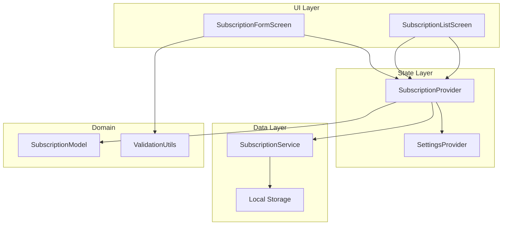
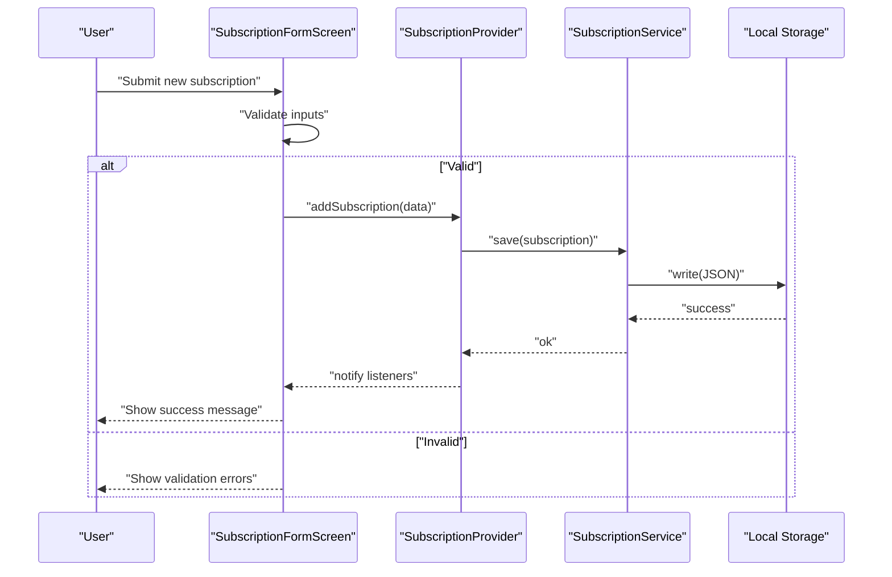
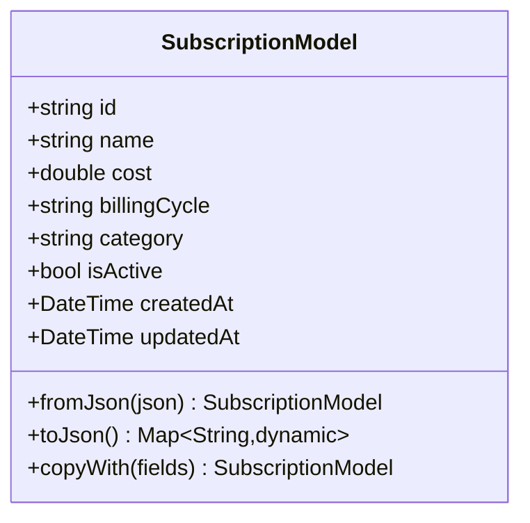
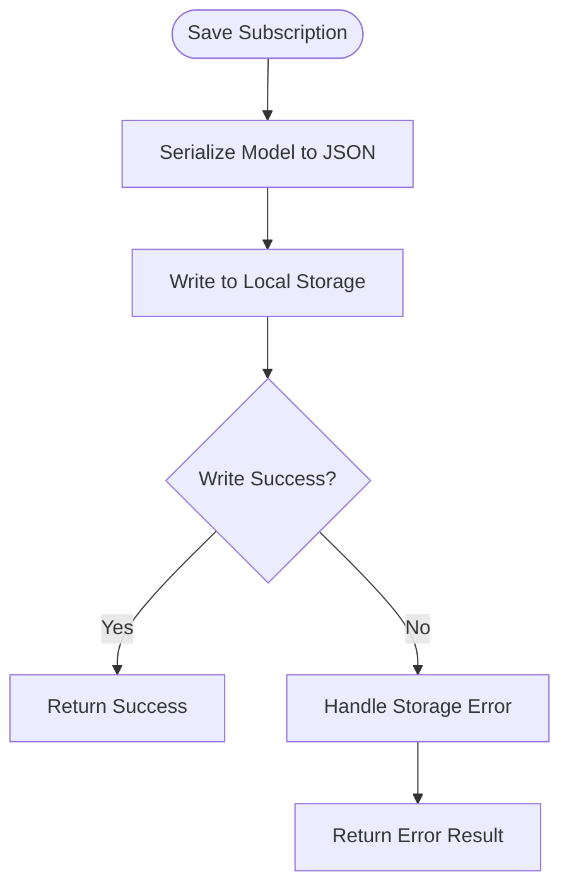
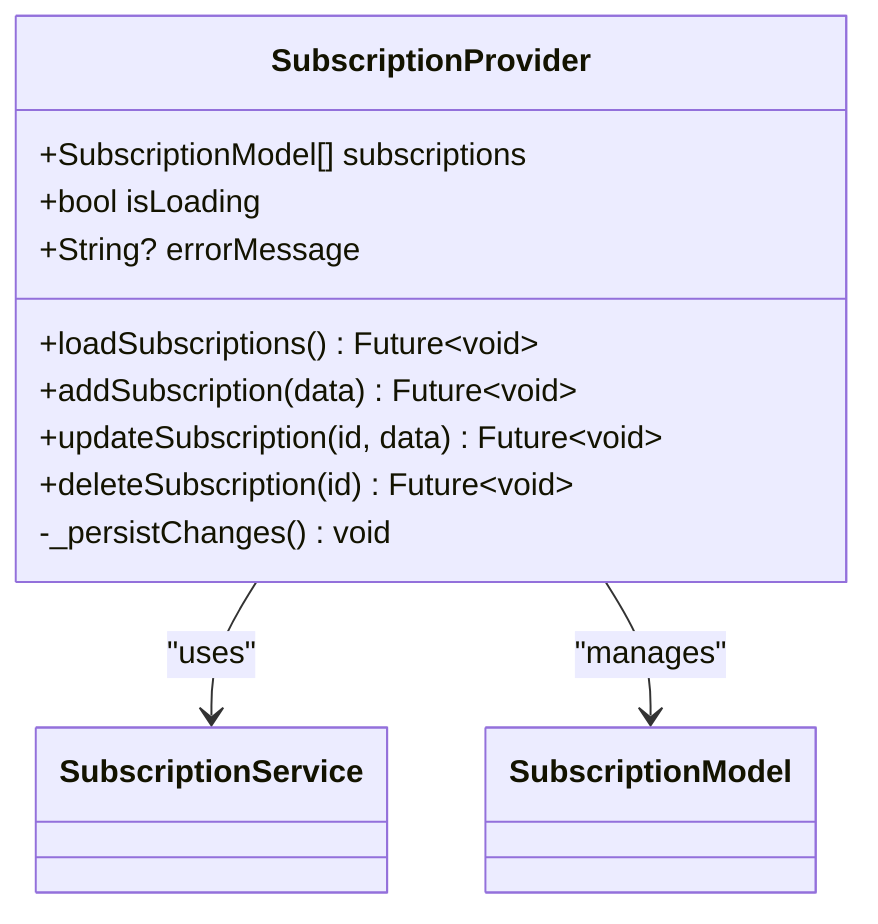
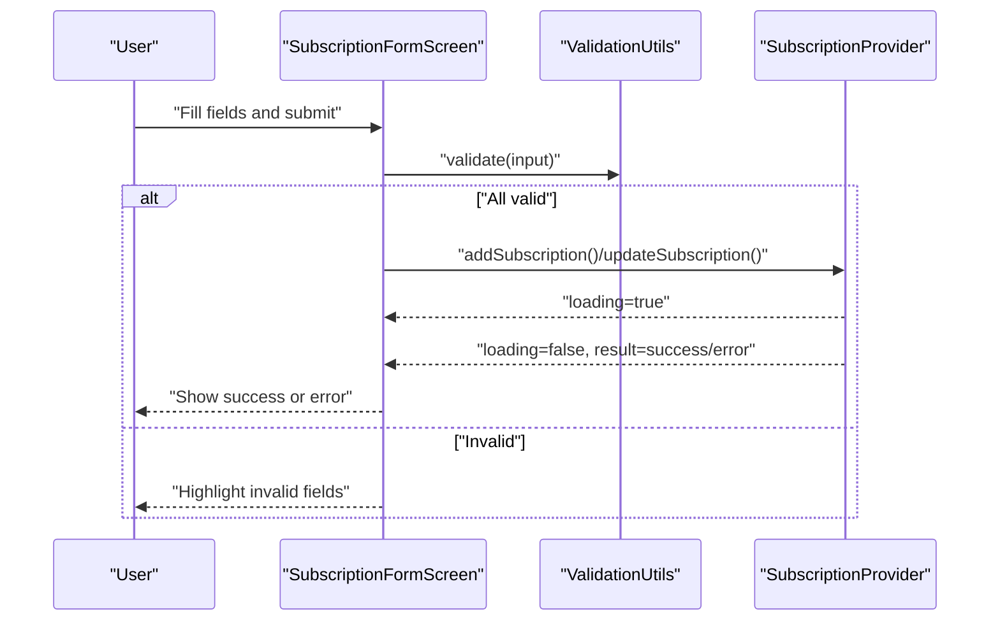
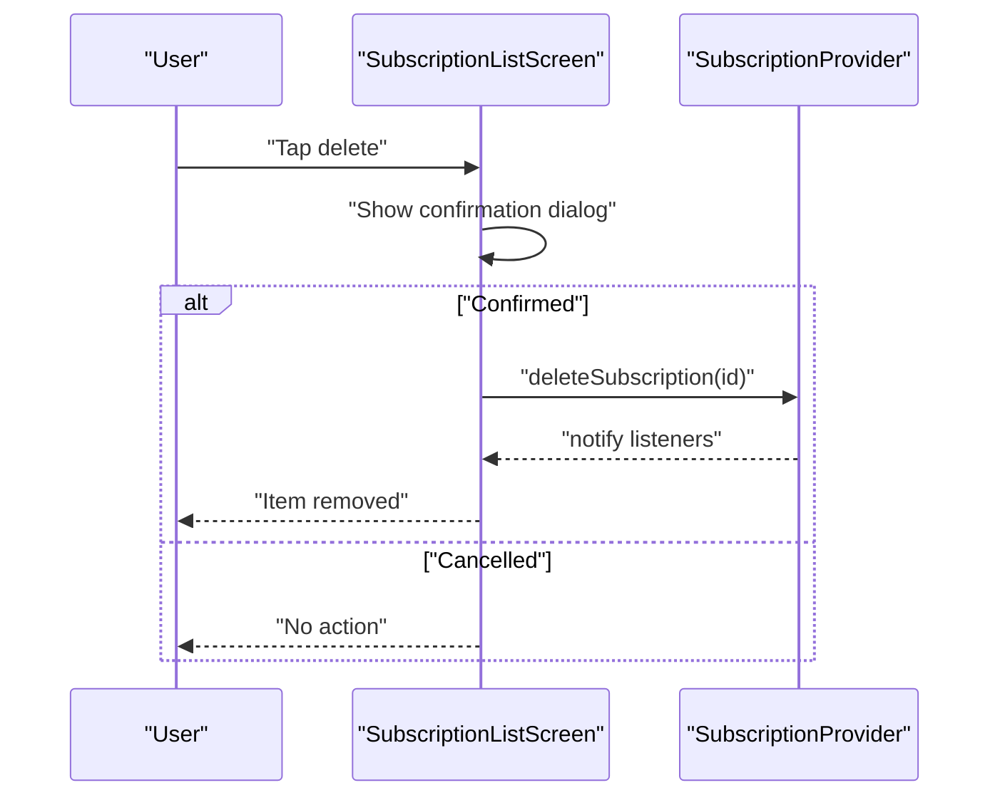
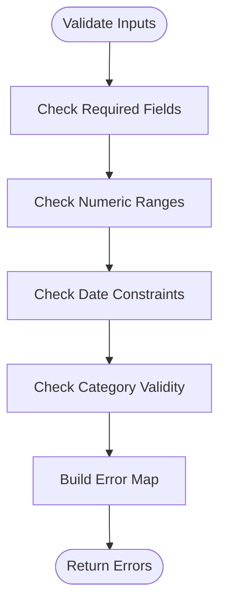
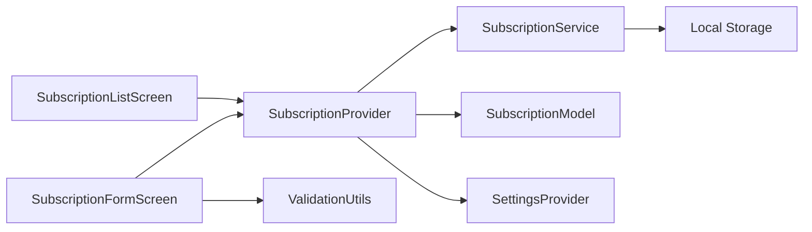

# Subscription CRUD Operations

<cite>
**Referenced Files in This Document**
- [main.dart](file://lib/main.dart)
- [subscription_provider.dart](file://lib/providers/subscription_provider.dart)
- [subscription_model.dart](file://lib/models/subscription_model.dart)
- [subscription_service.dart](file://lib/services/subscription_service.dart)
- [subscription_form_screen.dart](file://lib/screens/subscription_form_screen.dart)
- [subscription_list_screen.dart](file://lib/screens/subscription_list_screen.dart)
- [validation_utils.dart](file://lib/utils/validation_utils.dart)
- [settings_provider.dart](file://lib/providers/settings_provider.dart)
</cite>

## Table of Contents
1. [Introduction](#introduction)
2. [Project Structure](#project-structure)
3. [Core Components](#core-components)
4. [Architecture Overview](#architecture-overview)
5. [Detailed Component Analysis](#detailed-component-analysis)
6. [Dependency Analysis](#dependency-analysis)
7. [Performance Considerations](#performance-considerations)
8. [Troubleshooting Guide](#troubleshooting-guide)
9. [Conclusion](#conclusion)

## Introduction
This document explains the complete implementation of subscription Create, Read, Update, and Delete (CRUD) operations in ASSINATURAS NINJA. It covers:
- Adding new subscriptions with robust form validation
- Retrieving and displaying subscription data from local storage
- Updating existing subscription details
- Deleting subscriptions with confirmation workflows
- Provider-based state management for cross-screen synchronization
- Error handling strategies for network failures, data corruption, and input validation errors
- Performance considerations for large lists and efficient updates

The goal is to help developers understand how the app manages subscription data end-to-end and how to extend or maintain these features safely.

## Project Structure
Subscription-related functionality is organized across models, providers, services, screens, and utilities:
- Models define the subscription data structure and serialization helpers
- Providers manage application state and synchronize UI with data sources
- Services encapsulate persistence and I/O logic (local storage)
- Screens implement user-facing forms and lists
- Utilities provide reusable validation rules and helpers

**Diagram sources**
- [subscription_form_screen.dart](file://lib/screens/subscription_form_screen.dart)
- [subscription_list_screen.dart](file://lib/screens/subscription_list_screen.dart)
- [subscription_provider.dart](file://lib/providers/subscription_provider.dart)
- [subscription_service.dart](file://lib/services/subscription_service.dart)
- [subscription_model.dart](file://lib/models/subscription_model.dart)
- [validation_utils.dart](file://lib/utils/validation_utils.dart)
- [settings_provider.dart](file://lib/providers/settings_provider.dart)

**Section sources**
- [main.dart](file://lib/main.dart)
- [subscription_provider.dart](file://lib/providers/subscription_provider.dart)
- [subscription_service.dart](file://lib/services/subscription_service.dart)
- [subscription_model.dart](file://lib/models/subscription_model.dart)
- [subscription_form_screen.dart](file://lib/screens/subscription_form_screen.dart)
- [subscription_list_screen.dart](file://lib/screens/subscription_list_screen.dart)
- [validation_utils.dart](file://lib/utils/validation_utils.dart)
- [settings_provider.dart](file://lib/providers/settings_provider.dart)

## Core Components
- SubscriptionModel: Represents a subscription entity with fields such as name, cost, billing cycle, category, and status. Includes factory constructors for JSON parsing and methods for immutable updates.
- SubscriptionService: Encapsulates persistence operations against local storage. Provides methods to load, save, add, update, and delete subscriptions. Handles serialization/deserialization and error propagation.
- SubscriptionProvider: A ChangeNotifier-based provider that holds the list of subscriptions and exposes methods to create, read, update, and delete. It coordinates loading from service, updating state, and notifying listeners.
- SubscriptionFormScreen: A screen that collects user input, validates it using ValidationUtils, and calls SubscriptionProvider to persist changes. Manages loading states and shows success/error feedback.
- SubscriptionListScreen: Displays all subscriptions, supports editing and deletion flows, and reacts to provider state changes.
- ValidationUtils: Centralized validation rules for subscription inputs (e.g., required fields, numeric ranges, date formats).
- SettingsProvider: Optional settings that influence behavior (e.g., currency, locale), consumed by providers and screens.

Key responsibilities:
- State synchronization across screens via Provider
- Input validation before persistence
- Robust error handling and user feedback
- Efficient list rendering and updates

**Section sources**
- [subscription_model.dart](file://lib/models/subscription_model.dart)
- [subscription_service.dart](file://lib/services/subscription_service.dart)
- [subscription_provider.dart](file://lib/providers/subscription_provider.dart)
- [subscription_form_screen.dart](file://lib/screens/subscription_form_screen.dart)
- [subscription_list_screen.dart](file://lib/screens/subscription_list_screen.dart)
- [validation_utils.dart](file://lib/utils/validation_utils.dart)
- [settings_provider.dart](file://lib/providers/settings_provider.dart)

## Architecture Overview
The app follows a layered architecture with clear separation of concerns:
- UI layer (screens) interacts with providers
- Providers orchestrate business logic and state updates
- Services handle data access and I/O
- Models represent domain entities
- Utilities provide shared logic like validation

**Diagram sources**
- [subscription_form_screen.dart](file://lib/screens/subscription_form_screen.dart)
- [subscription_provider.dart](file://lib/providers/subscription_provider.dart)
- [subscription_service.dart](file://lib/services/subscription_service.dart)

## Detailed Component Analysis

### Subscription Model
- Purpose: Immutable representation of a subscription with JSON serialization support.
- Key behaviors:
  - Factory constructor to parse JSON into model instances
  - Method to convert model back to JSON for persistence
  - Helper to create updated copies without mutating existing instances
- Complexity:
  - Parsing and serialization are O(n) over fields; typically small constant size
  - Copy/update operations allocate new instances, ensuring immutability

**Diagram sources**
- [subscription_model.dart](file://lib/models/subscription_model.dart)

**Section sources**
- [subscription_model.dart](file://lib/models/subscription_model.dart)

### Subscription Service
- Purpose: Encapsulates all persistence operations for subscriptions.
- Responsibilities:
  - Load all subscriptions from local storage
  - Save a single subscription (create/update)
  - Delete a subscription by ID
  - Handle serialization/deserialization and propagate errors
- Error handling:
  - Wraps storage exceptions and returns typed results or throws domain-specific errors
  - Ensures consistent error messages for UI consumption

**Diagram sources**
- [subscription_service.dart](file://lib/services/subscription_service.dart)

**Section sources**
- [subscription_service.dart](file://lib/services/subscription_service.dart)

### Subscription Provider
- Purpose: Central state holder for subscriptions across the app.
- Responsibilities:
  - Maintain list of subscriptions and loading/error states
  - Expose methods: loadSubscriptions(), addSubscription(), updateSubscription(), deleteSubscription()
  - Notify listeners on state changes
  - Coordinate with SubscriptionService for persistence
- Patterns:
  - ChangeNotifier-based provider for reactive UI updates
  - Atomic updates to avoid partial state mutations
  - Debounced or batched updates where appropriate

**Diagram sources**
- [subscription_provider.dart](file://lib/providers/subscription_provider.dart)
- [subscription_service.dart](file://lib/services/subscription_service.dart)
- [subscription_model.dart](file://lib/models/subscription_model.dart)

**Section sources**
- [subscription_provider.dart](file://lib/providers/subscription_provider.dart)

### Subscription Form Screen
- Purpose: Collects user input for creating or editing subscriptions.
- Responsibilities:
  - Bind form fields to controllers
  - Validate inputs using ValidationUtils
  - Show loading indicators during persistence
  - Display success or error feedback based on provider outcomes
- UX patterns:
  - Inline validation messages
  - Disabled submit while loading
  - Confirmation dialogs for destructive actions when editing

**Diagram sources**
- [subscription_form_screen.dart](file://lib/screens/subscription_form_screen.dart)
- [validation_utils.dart](file://lib/utils/validation_utils.dart)
- [subscription_provider.dart](file://lib/providers/subscription_provider.dart)

**Section sources**
- [subscription_form_screen.dart](file://lib/screens/subscription_form_screen.dart)
- [validation_utils.dart](file://lib/utils/validation_utils.dart)

### Subscription List Screen
- Purpose: Displays all subscriptions and provides edit/delete actions.
- Responsibilities:
  - Listen to provider state changes
  - Render list efficiently
  - Trigger edit flow by navigating to form with pre-filled data
  - Confirm deletion before removing items
- Performance:
  - Uses sliver/list widgets for smooth scrolling
  - Avoids unnecessary rebuilds by scoping provider consumers

**Diagram sources**
- [subscription_list_screen.dart](file://lib/screens/subscription_list_screen.dart)
- [subscription_provider.dart](file://lib/providers/subscription_provider.dart)

**Section sources**
- [subscription_list_screen.dart](file://lib/screens/subscription_list_screen.dart)

### Validation Utils
- Purpose: Centralized validation rules for subscription inputs.
- Responsibilities:
  - Required field checks
  - Numeric range validations (e.g., cost > 0)
  - Date format and future/past constraints
  - Category whitelist/blacklist checks
- Output:
  - Returns structured validation errors for UI display

**Diagram sources**
- [validation_utils.dart](file://lib/utils/validation_utils.dart)

**Section sources**
- [validation_utils.dart](file://lib/utils/validation_utils.dart)

### Settings Provider
- Purpose: Holds app-wide settings influencing subscription behavior (e.g., currency, locale).
- Responsibilities:
  - Provide current settings to providers and screens
  - Persist settings changes
  - Influence formatting and validation thresholds

**Section sources**
- [settings_provider.dart](file://lib/providers/settings_provider.dart)

## Dependency Analysis
The following diagram illustrates key dependencies between components involved in subscription CRUD:

**Diagram sources**
- [subscription_form_screen.dart](file://lib/screens/subscription_form_screen.dart)
- [subscription_list_screen.dart](file://lib/screens/subscription_list_screen.dart)
- [subscription_provider.dart](file://lib/providers/subscription_provider.dart)
- [subscription_service.dart](file://lib/services/subscription_service.dart)
- [subscription_model.dart](file://lib/models/subscription_model.dart)
- [validation_utils.dart](file://lib/utils/validation_utils.dart)
- [settings_provider.dart](file://lib/providers/settings_provider.dart)

**Section sources**
- [subscription_provider.dart](file://lib/providers/subscription_provider.dart)
- [subscription_service.dart](file://lib/services/subscription_service.dart)
- [subscription_model.dart](file://lib/models/subscription_model.dart)
- [subscription_form_screen.dart](file://lib/screens/subscription_form_screen.dart)
- [subscription_list_screen.dart](file://lib/screens/subscription_list_screen.dart)
- [validation_utils.dart](file://lib/utils/validation_utils.dart)
- [settings_provider.dart](file://lib/providers/settings_provider.dart)

## Performance Considerations
- Large lists:
  - Use efficient list widgets and avoid rebuilding entire trees
  - Keep provider state minimal and only expose necessary fields
  - Consider pagination or virtualization if the dataset grows significantly
- Efficient updates:
  - Prefer immutable updates to avoid deep comparisons
  - Batch multiple changes when possible to reduce notifications
- I/O optimization:
  - Coalesce writes to local storage
  - Cache frequently accessed data in memory within the provider
- UI responsiveness:
  - Offload heavy computations off the main thread
  - Show loading states during long-running operations

[No sources needed since this section provides general guidance]

## Troubleshooting Guide
Common issues and strategies:
- Network failures:
  - Wrap I/O calls in try/catch blocks and return explicit error types
  - Surface user-friendly messages and allow retry
- Data corruption:
  - Validate persisted JSON structures before deserialization
  - Fallback to empty lists or last known good state on parse errors
- Input validation errors:
  - Centralize rules in ValidationUtils
  - Provide inline feedback and prevent submission until valid
- State inconsistencies:
  - Ensure atomic updates in providers
  - Reconcile state after failed operations by reloading from source

**Section sources**
- [subscription_service.dart](file://lib/services/subscription_service.dart)
- [subscription_provider.dart](file://lib/providers/subscription_provider.dart)
- [validation_utils.dart](file://lib/utils/validation_utils.dart)

## Conclusion
ASSINATURAS NINJA implements subscription CRUD through a clean separation of concerns:
- Models define immutable data structures
- Services encapsulate persistence logic
- Providers manage reactive state and coordinate operations
- Screens focus on user interaction and feedback
- Utilities centralize validation and shared logic

This architecture ensures reliable data synchronization, robust error handling, and scalable performance for growing datasets.

[No sources needed since this section summarizes without analyzing specific files]