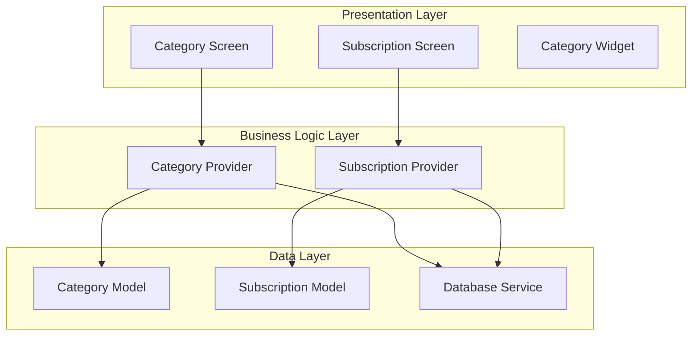
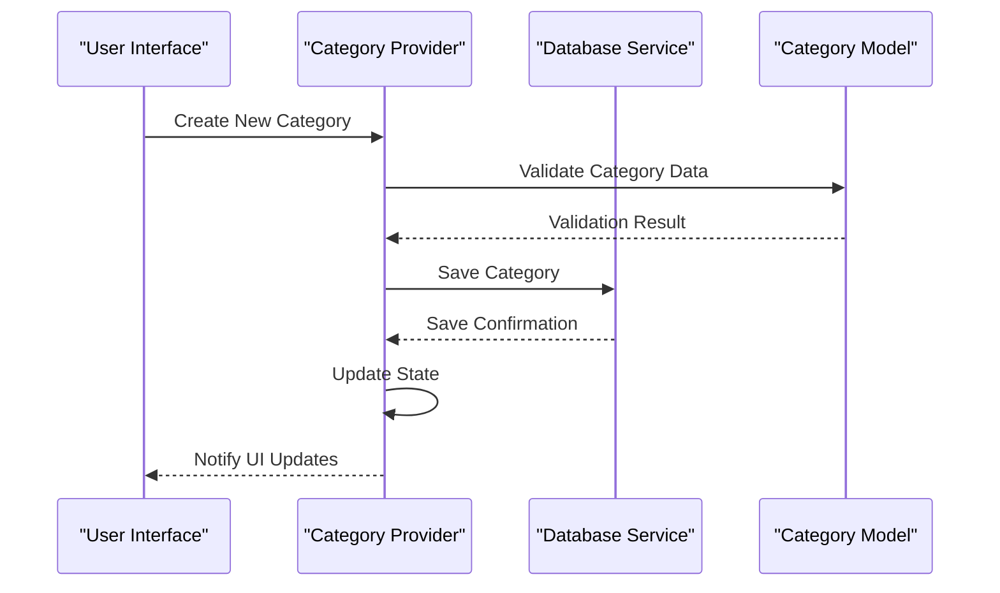
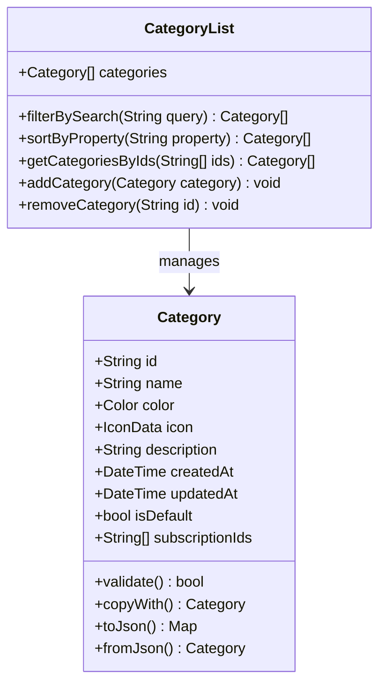
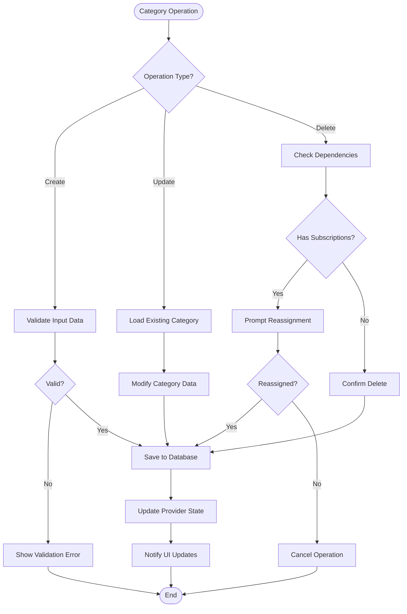
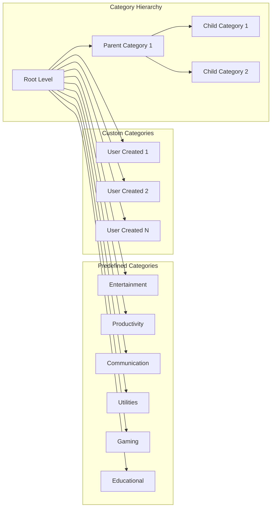
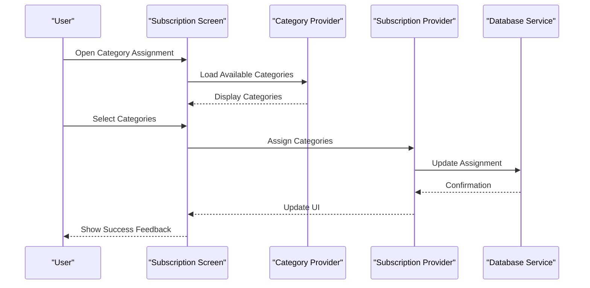
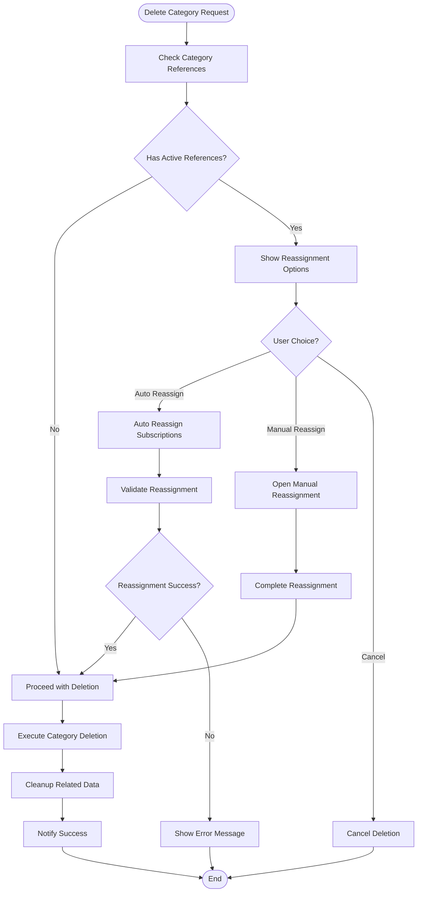

# Subscription Categories Management

<cite>
**Referenced Files in This Document**
- [subscription_model.dart](file://lib/models/subscription_model.dart)
- [category_model.dart](file://lib/models/category_model.dart)
- [subscription_provider.dart](file://lib/providers/subscription_provider.dart)
- [category_provider.dart](file://lib/providers/category_provider.dart)
- [category_screen.dart](file://lib/screens/category_screen.dart)
- [subscription_screen.dart](file://lib/screens/subscription_screen.dart)
- [category_widget.dart](file://lib/widgets/category_widget.dart)
- [database_service.dart](file://lib/services/database_service.dart)
</cite>

## Table of Contents
1. [Introduction](#introduction)
2. [Project Structure](#project-structure)
3. [Core Components](#core-components)
4. [Architecture Overview](#architecture-overview)
5. [Detailed Component Analysis](#detailed-component-analysis)
6. [Category System Architecture](#category-system-architecture)
7. [Predefined Categories](#predefined-categories)
8. [Custom Category Creation](#custom-category-creation)
9. [Category Assignment to Subscriptions](#category-assignment-to-subscriptions)
10. [Category-Based Filtering and Sorting](#category-based-filtering-and-sorting)
11. [Analytics Features](#analytics-features)
12. [Visual Organization and UI](#visual-organization-and-ui)
13. [Category Persistence](#category-persistence)
14. [Default Category Handling](#default-category-handling)
15. [Category Deletion and Reassignment](#category-deletion-and-reassignment)
16. [Performance Optimization](#performance-optimization)
17. [Troubleshooting Guide](#troubleshooting-guide)
18. [Conclusion](#conclusion)

## Introduction
This document provides comprehensive documentation for the subscription category management system in ASSINATURAS NINJA. It covers the complete category architecture including predefined categories, custom category creation, assignment workflows, filtering capabilities, analytics features, and visual organization elements.

## Project Structure
The category management system follows a clean architecture pattern with clear separation between data models, business logic, presentation layer, and persistence services.

**Diagram sources**
- [category_screen.dart:1-50](file://lib/screens/category_screen.dart#L1-L50)
- [subscription_screen.dart:1-50](file://lib/screens/subscription_screen.dart#L1-L50)
- [category_provider.dart:1-50](file://lib/providers/category_provider.dart#L1-L50)
- [subscription_provider.dart:1-50](file://lib/providers/subscription_provider.dart#L1-L50)

## Core Components
The category management system consists of several key components that work together to provide comprehensive category functionality.

### Data Models
- **Category Model**: Defines the structure and properties of subscription categories
- **Subscription Model**: Contains references to assigned categories
- **Category List Model**: Manages collections of categories with filtering and sorting capabilities

### Business Logic Providers
- **Category Provider**: Handles category CRUD operations and state management
- **Subscription Provider**: Manages category assignments and related operations

### Presentation Layer
- **Category Screens**: User interfaces for category management
- **Category Widgets**: Reusable UI components for category display
- **Filtering Widgets**: UI components for category-based filtering

**Section sources**
- [category_model.dart:1-100](file://lib/models/category_model.dart#L1-L100)
- [subscription_model.dart:1-100](file://lib/models/subscription_model.dart#L1-L100)
- [category_provider.dart:1-150](file://lib/providers/category_provider.dart#L1-L150)
- [subscription_provider.dart:1-150](file://lib/providers/subscription_provider.dart#L1-L150)

## Architecture Overview
The category system implements a reactive architecture using Flutter's provider pattern for state management, ensuring efficient updates and consistent data flow throughout the application.

**Diagram sources**
- [category_provider.dart:50-120](file://lib/providers/category_provider.dart#L50-L120)
- [database_service.dart:1-100](file://lib/services/database_service.dart#L1-L100)

## Detailed Component Analysis

### Category Model Architecture
The category model defines the core data structure for subscription categories, including metadata, visual properties, and relationships.

**Diagram sources**
- [category_model.dart:1-200](file://lib/models/category_model.dart#L1-L200)

### Category Provider Implementation
The category provider manages all category-related state and business logic operations.

**Diagram sources**
- [category_provider.dart:100-300](file://lib/providers/category_provider.dart#L100-L300)

**Section sources**
- [category_model.dart:1-200](file://lib/models/category_model.dart#L1-L200)
- [category_provider.dart:1-300](file://lib/providers/category_provider.dart#L1-L300)

## Category System Architecture

### Predefined Categories System
The system includes a set of predefined categories that serve as starting points for users. These categories are loaded during app initialization and can be customized or extended by users.

**Diagram sources**
- [category_provider.dart:200-400](file://lib/providers/category_provider.dart#L200-L400)

### Category Properties and Metadata
Each category supports comprehensive metadata including visual customization, hierarchical relationships, and usage tracking.

**Section sources**
- [category_model.dart:100-250](file://lib/models/category_model.dart#L100-L250)
- [category_provider.dart:150-350](file://lib/providers/category_provider.dart#L150-L350)

## Predefined Categories
The application ships with a curated set of predefined categories designed to cover common subscription types. These categories are automatically created during initial app setup and can be modified by users.

### Default Category Set
- **Entertainment**: Streaming services, gaming platforms, media subscriptions
- **Productivity**: Office software, cloud storage, productivity tools
- **Communication**: Messaging apps, email services, collaboration tools
- **Utilities**: Security software, backup services, system utilities
- **Gaming**: Game subscriptions, gaming platforms, in-game purchases
- **Education**: Learning platforms, course subscriptions, educational tools

### Category Initialization Process
The predefined categories are initialized through a dedicated setup process that ensures consistency across all installations while allowing user customization.

**Section sources**
- [category_provider.dart:300-500](file://lib/providers/category_provider.dart#L300-L500)

## Custom Category Creation
Users can create custom categories through an intuitive interface that guides them through the category definition process.

### Category Creation Workflow
1. **Access Creation Interface**: Navigate to category management screen
2. **Define Basic Properties**: Enter name, description, and basic settings
3. **Customize Appearance**: Select color scheme and icon representation
4. **Set Hierarchical Position**: Choose parent category if creating nested structure
5. **Configure Advanced Options**: Set default assignment rules and permissions
6. **Review and Confirm**: Preview category configuration before saving

### Validation Rules
- Category names must be unique within their hierarchy level
- Minimum and maximum character limits apply to prevent abuse
- Special characters are filtered to maintain consistency
- Duplicate detection prevents accidental category duplication

**Section sources**
- [category_screen.dart:100-300](file://lib/screens/category_screen.dart#L100-L300)
- [category_provider.dart:400-600](file://lib/providers/category_provider.dart#L400-L600)

## Category Assignment to Subscriptions
The system provides flexible mechanisms for assigning categories to subscriptions, supporting both manual and automated assignment strategies.

### Assignment Methods
- **Manual Assignment**: Direct selection during subscription creation or editing
- **Bulk Assignment**: Apply categories to multiple subscriptions simultaneously
- **Rule-Based Assignment**: Automatic categorization based on subscription properties
- **Template Assignment**: Use predefined templates for common subscription types

### Assignment Interface
The assignment interface provides drag-and-drop functionality, search capabilities, and visual feedback to ensure accurate category assignment.

**Diagram sources**
- [subscription_screen.dart:200-400](file://lib/screens/subscription_screen.dart#L200-L400)
- [subscription_provider.dart:200-400](file://lib/providers/subscription_provider.dart#L200-L400)

**Section sources**
- [subscription_screen.dart:150-350](file://lib/screens/subscription_screen.dart#L150-L350)
- [subscription_provider.dart:150-350](file://lib/providers/subscription_provider.dart#L150-L350)

## Category-Based Filtering and Sorting
The system implements sophisticated filtering and sorting capabilities that leverage category hierarchies and metadata for enhanced data navigation.

### Filtering Capabilities
- **Single Category Filter**: Display subscriptions belonging to specific categories
- **Multi-Category Filter**: Combine multiple categories with AND/OR logic
- **Hierarchical Filtering**: Include child categories when filtering by parent
- **Dynamic Filtering**: Real-time filter updates as users modify criteria
- **Saved Filters**: Store complex filter combinations for quick access

### Sorting Options
- **Alphabetical Sorting**: Sort by category name or subscription title
- **Date-Based Sorting**: Sort by creation date, last updated, or renewal date
- **Usage-Based Sorting**: Sort by frequency of use or cost metrics
- **Custom Sorting**: User-defined sort orders and priority levels

### Performance Optimizations
The filtering system uses indexed queries and caching mechanisms to ensure responsive performance even with large datasets.

**Section sources**
- [category_provider.dart:500-700](file://lib/providers/category_provider.dart#L500-L700)
- [subscription_provider.dart:300-500](file://lib/providers/subscription_provider.dart#L300-L500)

## Analytics Features
Category-based analytics provide insights into subscription spending patterns, usage trends, and budget allocation across different category groups.

### Key Metrics
- **Spending by Category**: Total expenditure per category over time periods
- **Category Growth**: Track new subscriptions added to each category
- **Cost Distribution**: Visual breakdown of spending across categories
- **Trend Analysis**: Identify spending patterns and seasonal variations
- **Budget Tracking**: Monitor category budgets and alert on overspending

### Reporting Features
- **Export Reports**: Generate detailed reports in various formats
- **Custom Dashboards**: Create personalized analytics views
- **Comparative Analysis**: Compare spending across different time periods
- **Forecasting**: Predict future spending based on historical data

**Section sources**
- [category_provider.dart:600-800](file://lib/providers/category_provider.dart#L600-L800)

## Visual Organization and UI
The category system emphasizes visual clarity and intuitive organization through comprehensive styling and layout options.

### Color Coding System
- **Automatic Color Assignment**: Intelligent color suggestions based on category type
- **Custom Color Selection**: Full color picker with accessibility considerations
- **Theme Integration**: Colors adapt to light/dark themes automatically
- **Color Consistency**: Maintain consistent colors across all screens and widgets

### Icon Representation
- **Icon Library**: Extensive collection of relevant icons for common categories
- **Custom Icons**: Support for custom icon uploads and emoji integration
- **Icon Sizing**: Responsive icon scaling for different screen sizes
- **Accessibility**: Proper contrast ratios and screen reader support

### Layout Options
- **Grid View**: Compact grid layout for browsing many categories
- **List View**: Detailed list view with expanded information
- **Tree View**: Hierarchical tree structure for nested categories
- **Card View**: Rich card layouts with preview information

**Section sources**
- [category_widget.dart:1-200](file://lib/widgets/category_widget.dart#L1-L200)
- [category_screen.dart:200-400](file://lib/screens/category_screen.dart#L200-L400)

## Category Persistence
The category system implements robust persistence mechanisms to ensure data integrity and reliable recovery across app sessions.

### Storage Strategy
- **Local Database**: Primary storage using SQLite for fast local access
- **Cloud Sync**: Optional cloud synchronization for multi-device support
- **Backup and Restore**: Comprehensive backup capabilities for category data
- **Migration Support**: Seamless schema migrations for app updates

### Data Integrity
- **Transaction Support**: ACID transactions for reliable data operations
- **Conflict Resolution**: Smart conflict resolution for sync scenarios
- **Validation Rules**: Comprehensive validation at data entry and persistence layers
- **Audit Logging**: Track changes for debugging and compliance purposes

**Section sources**
- [database_service.dart:1-200](file://lib/services/database_service.dart#L1-L200)
- [category_provider.dart:700-900](file://lib/providers/category_provider.dart#L700-L900)

## Default Category Handling
The system provides intelligent default category handling to streamline subscription management and reduce user friction.

### Default Category Logic
- **Smart Defaults**: Context-aware default category suggestions
- **User Preferences**: Remember user preferences for default assignments
- **Learning Algorithm**: Improve suggestions based on user behavior patterns
- **Fallback Mechanisms**: Graceful fallbacks when defaults are unavailable

### Category Templates
- **Predefined Templates**: Ready-to-use category structures for common scenarios
- **Custom Templates**: Users can save and reuse category configurations
- **Import/Export**: Share category templates between users or devices
- **Version Control**: Track template changes and rollbacks

**Section sources**
- [category_provider.dart:800-1000](file://lib/providers/category_provider.dart#L800-L1000)

## Category Deletion and Reassignment
The deletion workflow ensures data integrity by preventing orphaned subscriptions and providing smooth reassignment processes.

### Deletion Safety Measures
- **Dependency Checking**: Verify no subscriptions reference the category
- **Cascade Options**: Choose whether to delete dependent data or reassign
- **Undo Functionality**: Temporary deletion with undo capability
- **Confirmation Dialogs**: Clear warnings about deletion consequences

### Reassignment Workflows
- **Auto-Reassignment**: Automatically assign deleted category subscriptions to alternatives
- **Manual Reassignment**: Guided interface for selecting new category assignments
- **Batch Operations**: Handle reassignments for multiple subscriptions efficiently
- **Notification System**: Alert users about required reassignment actions

**Diagram sources**
- [category_provider.dart:900-1100](file://lib/providers/category_provider.dart#L900-L1100)

**Section sources**
- [category_provider.dart:850-1050](file://lib/providers/category_provider.dart#L850-L1050)

## Performance Optimization
The category system implements multiple optimization strategies to ensure responsive performance across all operations.

### Query Optimization
- **Indexed Queries**: Strategic database indexing for fast category lookups
- **Lazy Loading**: Load category data on-demand rather than upfront
- **Caching Layer**: In-memory caching for frequently accessed categories
- **Pagination**: Efficient handling of large category lists

### Search Performance
- **Full-Text Search**: Optimized search algorithms for category discovery
- **Autocomplete**: Real-time search suggestions with minimal latency
- **Fuzzy Matching**: Tolerant search that handles typos and partial matches
- **Search Indexing**: Background indexing for improved search performance

### Memory Management
- **Object Pooling**: Reuse category objects to reduce memory allocation
- **Garbage Collection**: Proper cleanup of unused category instances
- **Memory Profiling**: Continuous monitoring for memory leaks
- **Resource Limits**: Enforce limits on concurrent category operations

**Section sources**
- [category_provider.dart:1000-1200](file://lib/providers/category_provider.dart#L1000-L1200)
- [database_service.dart:200-400](file://lib/services/database_service.dart#L200-L400)

## Troubleshooting Guide
Common issues and their solutions for category management problems.

### Category Not Appearing
- **Check Visibility Settings**: Ensure category is not hidden or archived
- **Verify Permissions**: Confirm user has appropriate access rights
- **Refresh Data**: Force refresh category list from server
- **Clear Cache**: Clear local cache and reload fresh data

### Assignment Issues
- **Check Category Status**: Verify category is active and available
- **Validate Relationships**: Ensure proper parent-child relationships
- **Review Constraints**: Check for business rule violations
- **Sync Status**: Verify cloud sync completion status

### Performance Problems
- **Monitor Query Times**: Use profiling tools to identify slow queries
- **Check Index Usage**: Verify database indexes are being utilized
- **Analyze Memory Usage**: Profile memory consumption patterns
- **Optimize Large Lists**: Implement virtual scrolling for large datasets

**Section sources**
- [category_provider.dart:1100-1300](file://lib/providers/category_provider.dart#L1100-L1300)
- [database_service.dart:300-500](file://lib/services/database_service.dart#L300-L500)

## Conclusion
The subscription category management system in ASSINATURAS NINJA provides a comprehensive, scalable, and user-friendly solution for organizing and managing subscription categories. The system balances flexibility with usability, offering powerful features while maintaining simplicity for everyday use. Through careful attention to performance, data integrity, and user experience, the category system serves as a foundation for effective subscription management.

Key strengths include the intuitive category creation workflow, robust filtering and analytics capabilities, and comprehensive visual organization options. The system's architecture ensures scalability and maintainability while providing excellent performance characteristics for both small and large subscription portfolios.