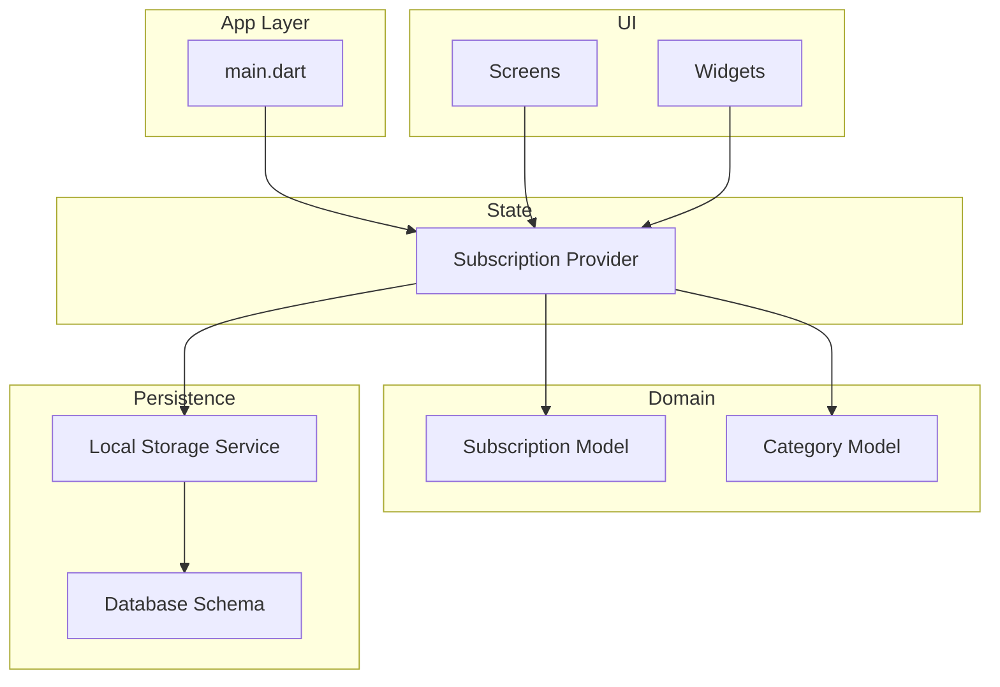
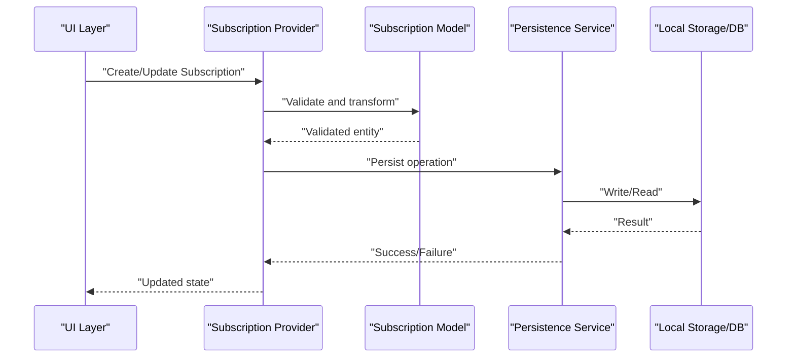
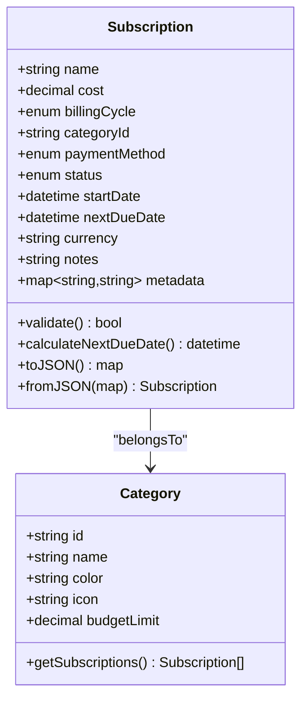
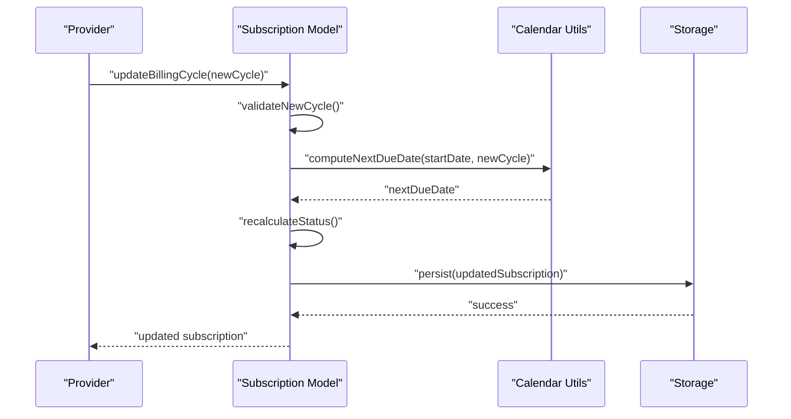
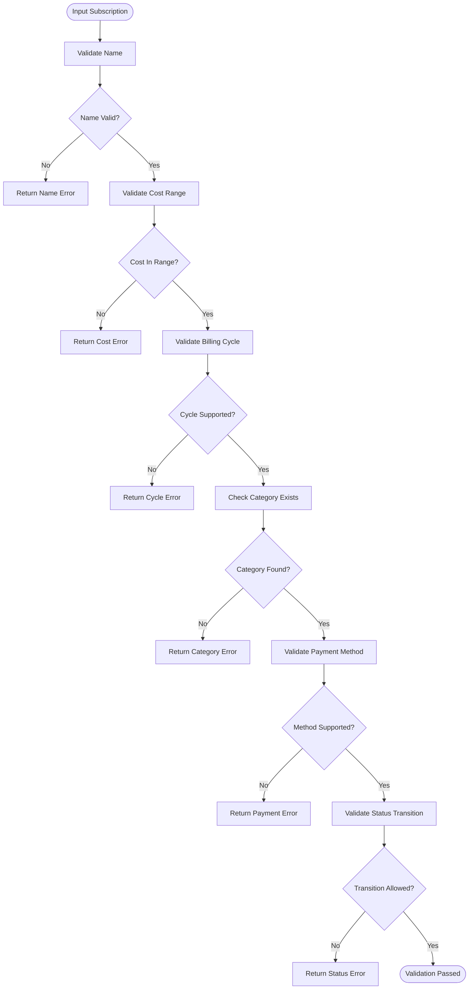
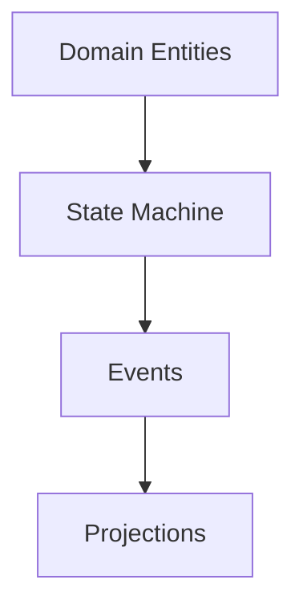
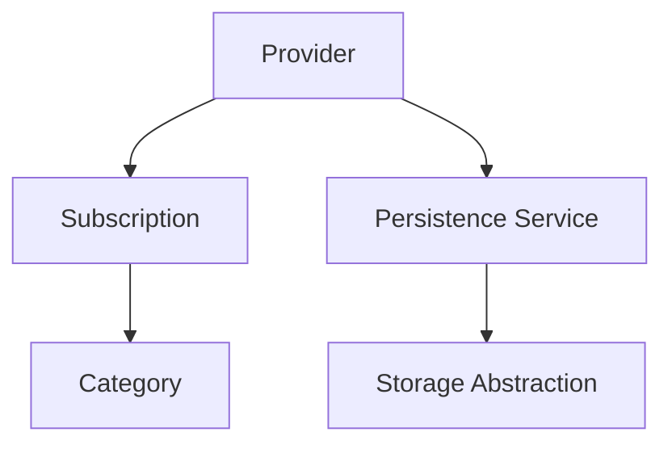

# Subscription Data Model

<cite>
**Referenced Files in This Document**
- [main.dart](file://lib/main.dart)
- [subscription_model_test.dart](file://test/subscription_model_test.dart)
- [subscription_provider_test.dart](file://test/subscription_provider_test.dart)
- [PROJECT_BRIEF.md](file://docs/PROJECT_BRIEF.md)
- [ARCHITECTURE.md](file://docs/ARCHITECTURE.md)
- [VALIDATION.md](file://docs/VALIDATION.md)
</cite>

## Table of Contents
1. [Introduction](#introduction)
2. [Project Structure](#project-structure)
3. [Core Components](#core-components)
4. [Architecture Overview](#architecture-overview)
5. [Detailed Component Analysis](#detailed-component-analysis)
6. [Dependency Analysis](#dependency-analysis)
7. [Performance Considerations](#performance-considerations)
8. [Troubleshooting Guide](#troubleshooting-guide)
9. [Conclusion](#conclusion)
10. [Appendices](#appendices)

## Introduction
This document describes the subscription data model used in ASSINATURAS NINJA. It focuses on the entity fields (name, cost, billing cycle, category, payment method, status), their types, validation rules, business constraints, relationships to categories, recurring payment logic, date calculations for billing cycles, instantiation and serialization/deserialization patterns, migration strategies, and persistence considerations using local storage and database schema design.

## Project Structure
The application is a Flutter app organized into standard layers: models, providers, services, screens, utils, and widgets. The subscription domain spans across these layers:
- Models define the subscription entity and related enums.
- Providers manage state and orchestrate operations.
- Services handle persistence and background tasks.
- Screens and widgets present and edit subscription data.
- Tests validate behavior and edge cases.

[No sources needed since this diagram shows conceptual workflow, not actual code structure]

## Core Components
The subscription data model centers around a Subscription entity with the following core fields:
- Name: Human-readable label for the subscription.
- Cost: Numeric amount representing the price per billing cycle.
- Billing Cycle: Frequency or interval defining when charges occur (e.g., monthly, yearly).
- Category: A reference to a Category entity grouping similar subscriptions.
- Payment Method: How the subscription is paid (e.g., credit card, bank transfer).
- Status: Lifecycle state of the subscription (e.g., active, paused, canceled).

Additional common fields typically included for robust tracking:
- Start Date: When the subscription began.
- Next Due Date: Calculated next billing date.
- Currency: ISO currency code for cost representation.
- Notes: Optional free-form text.
- Metadata: Optional key-value pairs for extensibility.

Data types and constraints:
- Name: String; required; non-empty; trimmed; length bounded.
- Cost: Decimal/numeric; required; greater than zero; within allowed range; formatted consistently.
- Billing Cycle: Enum or structured interval; required; valid frequency options only.
- Category: Reference/ID to a Category; required; must exist.
- Payment Method: Enum; required; from supported methods list.
- Status: Enum; required; transitions follow defined rules.
- Dates: ISO 8601 strings or DateTime objects; validated for correctness and ordering.

Validation rules:
- Cost ranges enforced via minimum and maximum thresholds.
- Billing frequency restricted to predefined options.
- Required fields enforced at creation and update.
- Status transitions validated against allowed states.

Relationships:
- Many-to-one relationship between Subscription and Category.
- Category may include metadata such as color, icon, and budget limits.

Recurring payment logic:
- Next due date computed from start date and billing cycle.
- Grace periods and retry policies applied before marking overdue.
- Proration and partial-cycle handling considered for mid-cycle changes.

Date calculations:
- Monthly cycles adjust for varying month lengths.
- Yearly cycles preserve day-of-month where possible.
- Leap year handling ensures correct anniversary dates.

Examples of instantiation:
- Create a new subscription with required fields and defaults for optional ones.
- Clone an existing subscription with modified parameters.

Serialization/deserialization:
- Convert to/from JSON for storage and network transport.
- Handle versioning and backward compatibility during deserialization.

Migration strategies:
- Versioned schema with up/down migrations.
- Default values for new fields.
- Data transformation scripts for legacy formats.

Persistence patterns:
- Local storage via secure storage or encrypted preferences for sensitive data.
- Database schema designed for efficient queries and updates.

**Section sources**
- [PROJECT_BRIEF.md](file://docs/PROJECT_BRIEF.md)
- [ARCHITECTURE.md](file://docs/ARCHITECTURE.md)
- [VALIDATION.md](file://docs/VALIDATION.md)

## Architecture Overview
The subscription system follows a layered architecture:
- UI layer interacts with providers.
- Providers coordinate business logic and state.
- Services encapsulate persistence and scheduling.
- Models represent domain entities and enforce invariants.

[No sources needed since this diagram shows conceptual workflow, not actual code structure]

## Detailed Component Analysis

### Subscription Entity Fields
- Name: String; required; trimmed; unique within user scope.
- Cost: Decimal; required; positive; within configured min/max; currency-aware formatting.
- Billing Cycle: Enum or structured interval; required; supports monthly/yearly/weekly/custom intervals.
- Category: Reference ID; required; foreign key to Category; cascading delete handled.
- Payment Method: Enum; required; from supported set; audit trail for changes.
- Status: Enum; required; lifecycle transitions enforced (active -> paused -> canceled).
- Start Date: DateTime; required; cannot be in future unless scheduled.
- Next Due Date: DateTime; derived; recalculated on changes.
- Currency: String; ISO code; default from app settings.
- Notes: String; optional; sanitized.
- Metadata: Map; optional; typed keys; validated.

Validation rules:
- Cost ranges enforced via configuration; negative or zero rejected.
- Billing frequency options limited to predefined set; custom intervals validated for feasibility.
- Required fields checked at boundaries; descriptive errors returned.
- Status transitions validated; invalid transitions blocked.

Business constraints:
- Only one active subscription per merchant/service combination if enforced.
- Overdue detection triggers notifications and escalation.
- Budget caps per category enforced at update time.

Relationships:
- Subscription belongs to Category; Category contains many Subscriptions.
- Category provides grouping, reporting, and budget controls.

Recurring payment logic:
- Next due date calculation uses calendar-aware arithmetic.
- Grace period allows late payments without immediate cancellation.
- Retry policy manages failed payments and retries.

Date calculations:
- Monthly: Add months while preserving day-of-month; fallback to last day of month if needed.
- Yearly: Add years; leap year adjustments applied.
- Weekly: Add weeks; consistent weekday preservation.

Examples of instantiation:
- Instantiate with minimal required fields and defaults.
- Instantiate with full details including schedule and metadata.

Serialization/deserialization:
- JSON schema includes version field for migrations.
- Backward-compatible parsing ignores unknown fields.
- Forward-compatible handling adds missing fields with defaults.

Migration strategies:
- Increment schema version on changes.
- Provide migration functions to transform old records.
- Rollback support for critical fixes.

Persistence patterns:
- Use secure local storage for tokens and sensitive info.
- Database schema optimized for queries by category, status, and due dates.
- Indexes on frequently queried fields.

**Section sources**
- [subscription_model_test.dart](file://test/subscription_model_test.dart)
- [subscription_provider_test.dart](file://test/subscription_provider_test.dart)
- [VALIDATION.md](file://docs/VALIDATION.md)

#### Class Diagram

[No sources needed since this diagram shows conceptual structure, not specific source files]

#### Sequence Diagram: Recurring Billing Calculation

[No sources needed since this diagram shows conceptual workflow, not actual code structure]

#### Flowchart: Validation Rules

[No sources needed since this diagram shows conceptual workflow, not actual code structure]

### Conceptual Overview
This section summarizes general concepts applicable to subscription modeling:
- Domain-driven design principles ensure clear separation of concerns.
- Immutability and value objects improve reliability.
- Event sourcing can capture lifecycle changes for auditing.
- CQRS separates read and write paths for performance.

[No sources needed since this diagram shows conceptual workflow, not actual code structure]

## Dependency Analysis
Key dependencies:
- Subscription depends on Category for grouping and reporting.
- Provider depends on Model for validation and computation.
- Persistence service depends on storage abstraction for flexibility.
- UI depends on Provider for reactive state updates.

[No sources needed since this diagram shows conceptual workflow, not actual code structure]

## Performance Considerations
- Cache category lookups to reduce repeated queries.
- Defer heavy computations until necessary.
- Batch updates to minimize storage writes.
- Use indexes on frequently filtered fields (status, category, nextDueDate).
- Avoid unnecessary re-serialization; use immutable structures.

[No sources needed since this section provides general guidance]

## Troubleshooting Guide
Common issues and resolutions:
- Invalid cost range: Ensure configuration bounds are set correctly and input is normalized.
- Unsupported billing cycle: Validate against enum set; provide user-friendly error messages.
- Missing category: Check foreign key integrity; handle orphaned references gracefully.
- Status transition errors: Review state machine rules; log attempted transitions.
- Date calculation anomalies: Verify calendar utilities handle edge cases like month-end and leap years.

**Section sources**
- [subscription_model_test.dart](file://test/subscription_model_test.dart)
- [subscription_provider_test.dart](file://test/subscription_provider_test.dart)
- [VALIDATION.md](file://docs/VALIDATION.md)

## Conclusion
The subscription data model in ASSINATURAS NINJA emphasizes clarity, validation, and maintainability. By enforcing strict types, validation rules, and business constraints, the system ensures reliable recurring billing and reporting. Relationships to categories enable effective organization and budgeting. Robust serialization, migration strategies, and persistence patterns support long-term evolution and data integrity.

[No sources needed since this section summarizes without analyzing specific files]

## Appendices

### Field Reference Table
- Name: String; required; trimmed; unique per user.
- Cost: Decimal; required; positive; within configured range.
- Billing Cycle: Enum; required; supported frequencies only.
- Category: Reference ID; required; exists in catalog.
- Payment Method: Enum; required; supported methods only.
- Status: Enum; required; transitions validated.
- Start Date: DateTime; required; not in future unless scheduled.
- Next Due Date: DateTime; derived; recalculated on changes.
- Currency: String; ISO code; default from settings.
- Notes: String; optional; sanitized.
- Metadata: Map; optional; typed keys; validated.

### Validation Rules Summary
- Cost ranges enforced via configuration.
- Billing frequency restricted to predefined options.
- Required fields enforced at boundaries.
- Status transitions validated against allowed states.

### Serialization/Deserialization Patterns
- JSON schema includes version field.
- Backward-compatible parsing ignores unknown fields.
- Forward-compatible handling adds missing fields with defaults.

### Migration Strategies
- Increment schema version on changes.
- Provide migration functions to transform old records.
- Rollback support for critical fixes.

### Persistence Patterns
- Secure local storage for sensitive data.
- Database schema optimized for queries and updates.
- Indexes on frequently queried fields.

[No sources needed since this section provides general guidance]