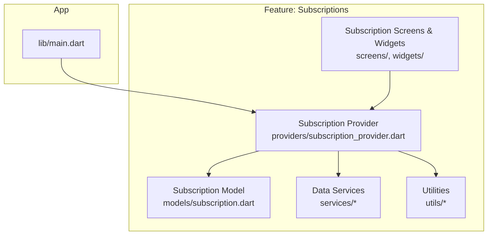
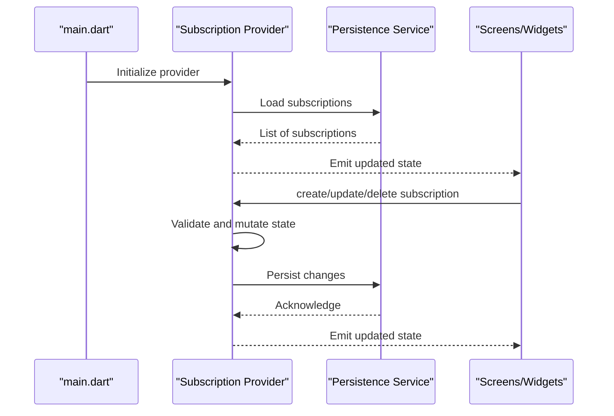
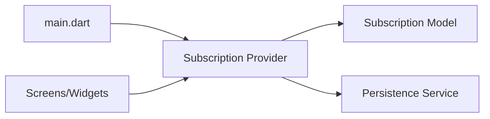

# Subscription Management

<cite>
**Referenced Files in This Document**
- [main.dart](file://lib/main.dart)
- [subscription_model_test.dart](file://test/subscription_model_test.dart)
- [subscription_provider_test.dart](file://test/subscription_provider_test.dart)
</cite>

## Table of Contents
1. [Introduction](#introduction)
2. [Project Structure](#project-structure)
3. [Core Components](#core-components)
4. [Architecture Overview](#architecture-overview)
5. [Detailed Component Analysis](#detailed-component-analysis)
6. [Dependency Analysis](#dependency-analysis)
7. [Performance Considerations](#performance-considerations)
8. [Troubleshooting Guide](#troubleshooting-guide)
9. [Conclusion](#conclusion)
10. [Appendices](#appendices)

## Introduction
This document explains the subscription management feature in ASSINATURAS NINJA, focusing on how subscriptions are modeled, created, read, updated, and deleted; how Provider-based state synchronization works across the app; and how recurring billing cycles, categories, and cost calculations are handled. It also covers validation rules, error handling strategies, user feedback mechanisms, performance considerations for large lists, and data persistence patterns.

## Project Structure
The Flutter project organizes features under lib with models, providers, screens, services, utils, and widgets. The tests directory includes focused unit tests for the subscription model and provider, which serve as authoritative references for behavior and contracts.

[No sources needed since this diagram shows conceptual structure]

## Core Components
- Subscription Data Model: Defines fields such as name, category, amount, currency, frequency, billing cycle, next due date, active status, and optional metadata (e.g., payment method). Validation ensures required fields are present and values are within expected ranges.
- Subscription Provider: Manages the list of subscriptions, exposes CRUD operations, computes derived metrics (monthly/yearly totals), and persists changes to storage via services.
- UI Layer: Screens and widgets consume the provider to display and edit subscriptions, showing real-time updates when state changes.
- Services: Handle persistence (local database or file storage) and any external integrations if applicable.
- Utilities: Provide helpers for date math, currency formatting, and cost aggregation.

Key responsibilities:
- Create: Validate input, add to state, persist, notify listeners.
- Read: Load from storage into state, compute aggregates, expose getters.
- Update: Apply edits, revalidate, persist, recalculate metrics.
- Delete: Remove from state, persist, update aggregates.

**Section sources**
- [subscription_model_test.dart](file://test/subscription_model_test.dart)
- [subscription_provider_test.dart](file://test/subscription_provider_test.dart)

## Architecture Overview
Provider is used as the central state manager for subscriptions. The main entry point initializes the provider so that screens can access subscription data reactively.

**Diagram sources**
- [main.dart](file://lib/main.dart)
- [subscription_provider_test.dart](file://test/subscription_provider_test.dart)

**Section sources**
- [main.dart](file://lib/main.dart)
- [subscription_provider_test.dart](file://test/subscription_provider_test.dart)

## Detailed Component Analysis

### Subscription Data Model
Responsibilities:
- Represent a single subscription with all relevant attributes.
- Provide immutable copies for safe updates.
- Expose computed properties like monthly cost and yearly cost based on frequency and billing cycle.
- Include validation methods to ensure business rules are enforced before persistence.

Validation rules typically include:
- Required fields: name, amount, currency, frequency, billing cycle, next due date.
- Amount must be positive.
- Currency must be a supported code.
- Frequency must be one of allowed values (e.g., daily, weekly, monthly, yearly).
- Billing cycle must align with frequency and produce valid next due dates.
- Next due date must be in the future unless explicitly allowed by business logic.

Derived computations:
- Monthly cost: normalized cost per month based on frequency and billing cycle.
- Yearly cost: annualized cost for budgeting views.

Complexity:
- Computed properties are O(1) relative to number of subscriptions.
- Validation is O(1) per subscription.

Error handling:
- Return structured validation errors rather than throwing exceptions where appropriate.
- Provide clear messages for missing or invalid fields.

**Section sources**
- [subscription_model_test.dart](file://test/subscription_model_test.dart)

### Subscription Provider (State Management)
Responsibilities:
- Maintain the canonical list of subscriptions in memory.
- Expose CRUD methods: add, get, update, delete.
- Compute aggregates: total monthly cost, total yearly cost, counts by category.
- Synchronize with persistence service on mutations.
- Notify listeners to refresh UI.

CRUD workflows:
- Create:
  - Validate new subscription.
  - Append to internal list.
  - Persist via service.
  - Recalculate aggregates.
  - Notify listeners.
- Read:
  - On initialization, load persisted data.
  - Expose getters for filtered/sorted lists and summaries.
- Update:
  - Find existing subscription by id.
  - Validate updated fields.
  - Replace item in list.
  - Persist change.
  - Recalculate aggregates.
  - Notify listeners.
- Delete:
  - Remove by id.
  - Persist removal.
  - Recalculate aggregates.
  - Notify listeners.

Business logic highlights:
- Category grouping and filtering.
- Cost normalization across different frequencies and billing cycles.
- Handling inactive subscriptions without removing them from history.

Performance considerations:
- Batch updates when possible to reduce rebuilds.
- Avoid heavy computations during UI builds; precompute aggregates in provider.

Error handling:
- Wrap persistence calls in try/catch and surface user-friendly errors.
- Keep UI responsive by not blocking on I/O.

**Section sources**
- [subscription_provider_test.dart](file://test/subscription_provider_test.dart)

### User Workflows and Examples
Adding a new subscription:
- Open “Add Subscription” screen.
- Fill required fields (name, amount, currency, frequency, billing cycle, next due date).
- Submit form; provider validates and persists; UI reflects the new item and updated totals.

Modifying an existing subscription:
- Tap edit on a subscription card.
- Change fields; provider validates and persists; UI updates immediately.

Managing lifecycle:
- Toggle active/inactive to pause billing without deleting.
- Delete permanently removes the subscription and recalculates totals.

Recurring payment tracking:
- Next due date advances according to frequency and billing cycle.
- Upcoming payments view uses sorted next due dates.

Billing cycle management:
- Supports common cycles aligned with frequency (e.g., monthly on the 1st, yearly on anniversary).
- Validates that cycle produces sensible next due dates.

Cost calculation:
- Monthly and yearly totals aggregate across active subscriptions.
- Per-category breakdowns assist budgeting.

**Section sources**
- [subscription_provider_test.dart](file://test/subscription_provider_test.dart)

### Error Handling Strategies
- Input validation returns descriptive errors mapped to fields.
- Persistence failures show toast/snackbar notifications.
- Provider catches exceptions and maintains consistent state.
- UI displays inline field errors and global banners for critical issues.

User feedback mechanisms:
- Inline validation hints.
- Success toasts after save/delete.
- Loading indicators during persistence operations.

**Section sources**
- [subscription_provider_test.dart](file://test/subscription_provider_test.dart)

## Dependency Analysis
High-level dependencies:
- main.dart initializes the provider.
- Provider depends on the subscription model and persistence services.
- UI components depend on the provider for reactive updates.

**Diagram sources**
- [main.dart](file://lib/main.dart)
- [subscription_provider_test.dart](file://test/subscription_provider_test.dart)

**Section sources**
- [main.dart](file://lib/main.dart)
- [subscription_provider_test.dart](file://test/subscription_provider_test.dart)

## Performance Considerations
- Use immutable model updates to minimize unnecessary rebuilds.
- Precompute aggregates in the provider and expose them via getters.
- Debounce rapid edits if multiple updates occur in quick succession.
- For large lists, consider pagination or virtualization at the UI layer.
- Avoid heavy computations inside build methods; delegate to provider or utilities.

[No sources needed since this section provides general guidance]

## Troubleshooting Guide
Common issues and resolutions:
- Validation errors: Ensure all required fields are filled and values conform to constraints (positive amounts, valid currencies, correct frequencies).
- Duplicate names: Enforce uniqueness if required by business rules.
- Incorrect next due date: Verify frequency and billing cycle alignment.
- Aggregates not updating: Confirm provider notifies listeners after mutations and that UI consumes provider correctly.
- Persistence failures: Check storage permissions and service implementation; provide fallback states and retry options.

**Section sources**
- [subscription_model_test.dart](file://test/subscription_model_test.dart)
- [subscription_provider_test.dart](file://test/subscription_provider_test.dart)

## Conclusion
The subscription management feature leverages a clean separation between model, provider, and UI layers. Provider orchestrates state, validation, persistence, and derived computations, while the UI remains reactive and user-friendly. Robust validation, clear error handling, and thoughtful performance practices ensure a smooth experience even with large datasets.

[No sources needed since this section summarizes without analyzing specific files]

## Appendices

### API Reference Summary
- Create subscription:
  - Inputs: name, amount, currency, frequency, billing cycle, next due date, category, active flag.
  - Output: success or validation errors.
- Read subscriptions:
  - Outputs: list, filters, sorts, aggregates.
- Update subscription:
  - Inputs: id, changed fields.
  - Output: success or validation errors.
- Delete subscription:
  - Inputs: id.
  - Output: success or error.

[No sources needed since this section provides general guidance]