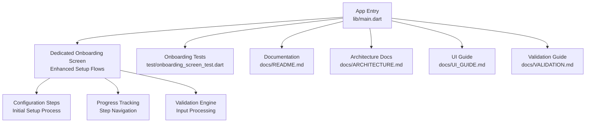
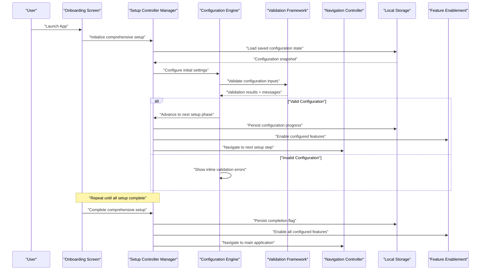
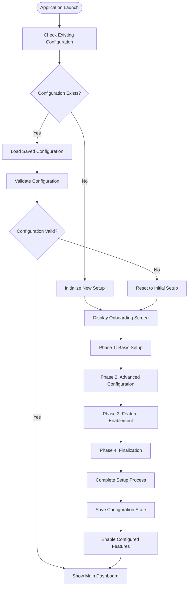
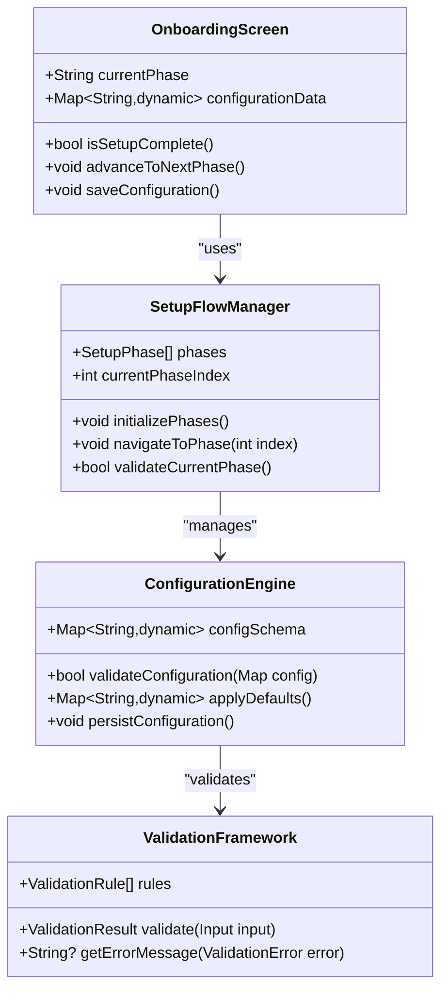
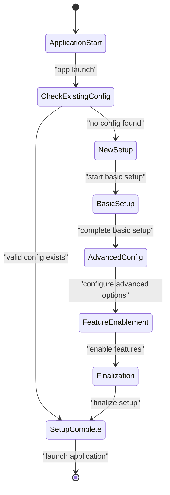
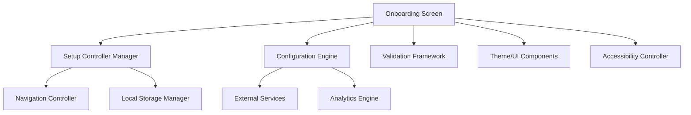

# User Onboarding Flow

<cite>
**Referenced Files in This Document**
- [main.dart](file://lib/main.dart)
- [onboarding_screen_test.dart](file://test/onboarding_screen_test.dart)
- [README.md](file://README.md)
- [ARCHITECTURE.md](file://docs/ARCHITECTURE.md)
- [UI_GUIDE.md](file://docs/UI_GUIDE.md)
- [VALIDATION.md](file://docs/VALIDATION.md)
</cite>

## Update Summary
**Changes Made**
- Enhanced onboarding flow description to reflect comprehensive setup processes
- Updated component architecture to include dedicated onboarding screen implementation
- Added detailed coverage of initial configuration steps and setup flows
- Expanded testing strategies for enhanced onboarding interactions
- Improved error handling documentation for complex setup scenarios

## Table of Contents
1. [Introduction](#introduction)
2. [Project Structure](#project-structure)
3. [Core Components](#core-components)
4. [Architecture Overview](#architecture-overview)
5. [Detailed Component Analysis](#detailed-component-analysis)
6. [Enhanced Setup Flows](#enhanced-setup-flows)
7. [Initial Configuration Steps](#initial-configuration-steps)
8. [Dependency Analysis](#dependency-analysis)
9. [Performance Considerations](#performance-considerations)
10. [Troubleshooting Guide](#troubleshooting-guide)
11. [Conclusion](#conclusion)
12. [Appendices](#appendices)

## Introduction
This document explains the enhanced user onboarding flow for ASSINATURAS NINJA, focusing on comprehensive setup processes, initial configuration steps, dedicated onboarding screen implementation, step-by-step progression, screen transitions, input validation, widget composition, form handling, progress tracking, UX design principles, accessibility, responsive behavior, error handling, persistence, and testing strategies. The system now features a dedicated onboarding screen with comprehensive setup flows and initial configuration steps.

## Project Structure
The Flutter application organizes feature code under lib (models, providers, screens, services, utils, widgets). The enhanced onboarding system includes a dedicated onboarding screen with comprehensive setup flows, while tests are located under test, and project documentation is under docs. The entry point is main.dart, which bootstraps the app and wires up routing and state providers for the enhanced onboarding experience.

**Diagram sources**
- [main.dart](file://lib/main.dart)
- [onboarding_screen_test.dart](file://test/onboarding_screen_test.dart)
- [README.md](file://README.md)
- [ARCHITECTURE.md](file://docs/ARCHITECTURE.md)
- [UI_GUIDE.md](file://docs/UI_GUIDE.md)
- [VALIDATION.md](file://docs/VALIDATION.md)

**Section sources**
- [main.dart](file://lib/main.dart)
- [onboarding_screen_test.dart](file://test/onboarding_screen_test.dart)
- [README.md](file://README.md)
- [ARCHITECTURE.md](file://docs/ARCHITECTURE.md)
- [UI_GUIDE.md](file://docs/UI_GUIDE.md)
- [VALIDATION.md](file://docs/VALIDATION.md)

## Core Components
- **Dedicated Onboarding Screen**: A specialized screen component that orchestrates the entire onboarding experience with comprehensive setup flows.
- **Setup Flow Manager**: Handles the progression through multiple configuration steps with intelligent navigation.
- **Configuration Engine**: Manages initial app settings, user preferences, and feature enablement.
- **Form Handling System**: Advanced input fields, validation rules, and submission logic per configuration step.
- **Progress Tracking Module**: Visual indicator of current step, completion status, and setup progress.
- **State Management Layer**: Providers or controllers to persist partial data across comprehensive setup steps.
- **Navigation Controller**: Transitions between setup phases and final destination after completion.
- **Validation Framework**: Local and remote validation rules applied before advancing or submitting configurations.
- **Error Handling System**: User-friendly messages for invalid inputs, network issues, and configuration conflicts.
- **Accessibility Suite**: Semantics, labels, focus management, and keyboard support for all setup stages.
- **Responsive Layout Engine**: Layout adaptation for phones, tablets, and different orientations during setup.

## Architecture Overview
The enhanced onboarding flow follows a comprehensive setup-based architecture where each configuration step is a composable widget with its own form, validation, and business logic. A central setup controller manages step navigation, progress tracking, and data persistence across the entire configuration process.

**Diagram sources**
- [main.dart](file://lib/main.dart)
- [onboarding_screen_test.dart](file://test/onboarding_screen_test.dart)

## Detailed Component Analysis

### Dedicated Onboarding Screen Implementation
- **Purpose**: Centralized orchestration of multi-phase onboarding with comprehensive setup flows and initial configuration.
- **Responsibilities**:
  - Manage overall setup lifecycle and phase transitions.
  - Render phase-specific configuration interfaces and controls.
  - Coordinate validation, persistence, and feature enablement.
  - Handle navigation between setup phases and final application launch.
  - Provide real-time feedback on setup progress and completion status.

### Enhanced Setup Flow Management
- **Phase-Based Architecture**: Organizes onboarding into logical phases (Basic Setup, Advanced Configuration, Feature Enablement, Finalization).
- **Intelligent Navigation**: Context-aware transitions between phases based on user choices and previous selections.
- **Progress Persistence**: Automatic saving of setup progress at each phase boundary.
- **Conditional Logic**: Dynamic phase rendering based on user preferences and system capabilities.

### Comprehensive Configuration Engine
- **Multi-Stage Configuration**: Handles various types of configuration including user preferences, system settings, and feature toggles.
- **Validation Pipeline**: Multi-layered validation ensuring configuration integrity and compatibility.
- **Default Value Management**: Smart defaults based on user context and system environment.
- **Configuration Backup**: Automatic backup and restore of configuration states.

### Advanced Form Handling System
- **Dynamic Field Generation**: Forms adapt based on configuration requirements and user selections.
- **Real-Time Validation**: Immediate feedback on input validity with contextual help.
- **Batch Operations**: Support for bulk configuration changes and template application.
- **Undo/Redo Support**: History management for configuration changes within setup.

### Progress Tracking Implementation
- **Visual Progress Indicators**: Multi-level progress display showing phase completion and overall setup status.
- **State Persistence**: Automatic saving of setup state at critical checkpoints.
- **Resume Capability**: Ability to resume interrupted setup from last checkpoint.
- **Completion Analytics**: Tracking of setup completion rates and common drop-off points.

### User Experience Design Principles
- **Guided Discovery**: Progressive disclosure of complexity with clear explanations.
- **Contextual Help**: Inline assistance and examples for complex configuration options.
- **Forgiveness**: Easy correction paths and undo capabilities throughout setup.
- **Efficiency**: Smart defaults and skip options for experienced users.
- **Consistency**: Unified design language and interaction patterns across all phases.

### Accessibility Considerations
- **Semantic Structure**: Proper heading hierarchy and landmark regions for screen readers.
- **Focus Management**: Logical tab order and focus restoration after phase transitions.
- **High Contrast Support**: Full accessibility with high contrast themes and large text options.
- **Keyboard Navigation**: Complete keyboard operability for all setup interactions.
- **Voice Control**: Compatibility with voice control systems and assistive technologies.

### Responsive Behavior Across Screen Sizes
- **Adaptive Layouts**: Optimized layouts for mobile, tablet, and desktop form factors.
- **Touch-Friendly Interface**: Large touch targets and swipe gestures for mobile devices.
- **Orientation Support**: Seamless transition between portrait and landscape modes.
- **Scalable Typography**: Fluid typography that scales appropriately across devices.

### Extending the Enhanced Onboarding Flow
- **Adding New Phases**:
  - Create new phase widget with specific configuration requirements.
  - Register phase in the setup flow manager with proper dependencies.
  - Implement validation rules and persistence logic for new configuration.
  - Configure navigation transitions from previous and to next phases.
- **Customizing Configuration Options**:
  - Extend configuration schema with new options and validation rules.
  - Add conditional logic for dynamic option availability.
  - Implement custom UI components for specialized configuration inputs.
- **Integration with External Services**:
  - Add API calls for external service configuration.
  - Implement authentication flows for third-party integrations.
  - Handle connection testing and error scenarios.

### Error Handling
- **Configuration Conflicts**: Detection and resolution of conflicting configuration options.
- **Network Connectivity Issues**: Graceful handling of network failures during cloud configuration.
- **Data Corruption Recovery**: Automatic recovery from corrupted configuration files.
- **User Input Errors**: Clear, actionable error messages with suggested corrections.
- **System Compatibility Issues**: Detection and reporting of incompatible system configurations.

### Testing Strategies
- **Unit Tests**:
  - Validation rules for all configuration field types.
  - Setup flow manager logic for phase advancement and state management.
  - Configuration engine operations for data transformation and persistence.
- **Widget Tests**:
  - Interactive testing of all setup phases and their forms.
  - Validation message display and user feedback mechanisms.
  - Navigation triggers and phase transitions on valid submissions.
- **Integration Tests**:
  - End-to-end testing of complete onboarding flow across all phases.
  - Network failure simulation and retry behavior verification.
  - Configuration persistence and resumption after app restart.
  - Cross-device compatibility testing for responsive behavior.
- **Accessibility Tests**:
  - Screen reader compatibility verification.
  - Keyboard navigation testing across all setup phases.
  - High contrast theme validation.

**Section sources**
- [onboarding_screen_test.dart](file://test/onboarding_screen_test.dart)

## Enhanced Setup Flows

### Basic Setup Phase
- **User Profile Configuration**: Name, email, and basic profile information.
- **Language and Region Settings**: Localization preferences and regional formatting.
- **Theme Selection**: Light/dark mode and color scheme preferences.
- **Notification Preferences**: Email, push notification, and in-app notification settings.

### Advanced Configuration Phase
- **Subscription Management**: Plan selection, billing information, and payment methods.
- **Integration Setup**: Third-party service connections and API key configuration.
- **Security Settings**: Two-factor authentication, password policies, and session management.
- **Performance Tuning**: Resource allocation and performance optimization options.

### Feature Enablement Phase
- **Module Activation**: Selective enabling/disabling of application modules.
- **Workflow Customization**: Personalization of default workflows and automation rules.
- **Reporting Configuration**: Report templates, scheduling, and distribution settings.
- **Backup and Recovery**: Data backup schedules and recovery point configuration.

### Finalization Phase
- **Review and Confirmation**: Summary of all configuration choices with confirmation.
- **Import/Export Options**: Configuration import from templates or export for backup.
- **Testing and Validation**: Automated testing of configuration and system readiness checks.
- **Completion and Launch**: Final setup completion and transition to main application.

## Initial Configuration Steps

### Step 1: Environment Detection
- **System Requirements Check**: Verification of minimum system requirements and compatibility.
- **Resource Availability**: Assessment of available storage, memory, and processing power.
- **Network Connectivity**: Validation of internet connectivity and required service endpoints.
- **Permission Requests**: Request necessary system permissions for optimal functionality.

### Step 2: User Account Setup
- **Account Creation/Authentication**: New user registration or existing user login.
- **Profile Initialization**: Basic profile information collection and validation.
- **Preferences Configuration**: Default preferences and personalization options.
- **Welcome Experience**: Guided introduction to core application features.

### Step 3: Service Configuration
- **Service Provider Selection**: Choice of supported service providers and integration options.
- **API Key Management**: Secure storage and validation of API keys and credentials.
- **Connection Testing**: Automated testing of service connections and authentication.
- **Fallback Configuration**: Setup of fallback options for service unavailability.

### Step 4: Feature Personalization
- **Feature Discovery**: Interactive tour of available features and capabilities.
- **Usage Pattern Analysis**: Analysis of intended usage patterns for personalized recommendations.
- **Template Selection**: Pre-configured templates for common use cases.
- **Custom Workflow Creation**: Tools for creating custom workflows and automation rules.

## Dependency Analysis
The enhanced onboarding system depends on:
- **Setup Controller Manager**: Central coordination of setup phases and state management.
- **Configuration Engine**: Comprehensive configuration management and validation.
- **Validation Framework**: Multi-layered validation for all configuration inputs.
- **Navigation Controller**: Sophisticated navigation between setup phases and application sections.
- **Local Storage Manager**: Robust persistence for configuration data and setup progress.
- **Theme and UI Components**: Consistent presentation layer with accessibility support.
- **External Service Integrations**: Connection management for third-party services.
- **Analytics and Telemetry**: Usage tracking and setup completion analytics.

**Diagram sources**
- [main.dart](file://lib/main.dart)
- [onboarding_screen_test.dart](file://test/onboarding_screen_test.dart)

## Performance Considerations
- **Lazy Loading**: Progressive loading of setup phases and configuration options.
- **Memory Management**: Efficient cleanup of temporary configuration data and resources.
- **Background Processing**: Asynchronous processing of long-running configuration tasks.
- **Caching Strategy**: Intelligent caching of configuration schemas and validation rules.
- **Bundle Optimization**: Code splitting and lazy loading of optional setup components.

## Troubleshooting Guide
Common issues and resolutions for the enhanced onboarding system:

### Setup Flow Issues
- **Phase Stuck**: Verify validation rules return null for valid inputs and check provider state updates.
- **Lost Progress**: Confirm persistence writes succeed and reads restore state correctly.
- **Navigation Problems**: Ensure proper phase dependency resolution and transition conditions.

### Configuration Problems
- **Validation Failures**: Review validation rule definitions and ensure proper error message generation.
- **Persistence Issues**: Inspect storage permissions, file paths, and data serialization.
- **External Service Errors**: Verify API keys, network connectivity, and service endpoint availability.

### Performance Issues
- **Slow Setup**: Identify bottlenecks in validation, persistence, or external service calls.
- **Memory Leaks**: Monitor resource cleanup and garbage collection behavior.
- **Battery Drain**: Optimize background processing and network polling intervals.

### Accessibility Problems
- **Screen Reader Issues**: Add semantic labels and ensure proper ARIA attributes.
- **Keyboard Navigation**: Verify focus order and keyboard shortcuts across all phases.
- **High Contrast**: Test with various accessibility themes and font sizes.

**Section sources**
- [onboarding_screen_test.dart](file://test/onboarding_screen_test.dart)

## Conclusion
The enhanced onboarding flow in ASSINATURAS NINJA represents a comprehensive setup system designed around clear, testable, and extensible components. The dedicated onboarding screen with comprehensive setup flows and initial configuration steps provides users with a guided, intuitive experience for configuring their application. By following the phase-based architecture, robust validation framework, and thoughtful UX and accessibility practices, teams can easily add new setup phases, customize configuration options, and maintain a smooth user experience across all device types and user skill levels.

## Appendices

### Code Example Paths for Enhancement
- **Adding new setup phases**:
  - Create phase widget under lib/screens/onboarding/phases/
  - Update setup flow manager with new phase definition and dependencies
  - Implement phase-specific validators and persistence handlers
- **Extending configuration options**:
  - Add new configuration schema entries under lib/models/configuration/
  - Implement validation rules in lib/utils/validation/
  - Create UI components for new configuration inputs under lib/widgets/config/
- **Customizing setup experience**:
  - Modify theme definitions for setup screens under lib/themes/
  - Replace phase content with branded visuals while preserving semantics
  - Integrate custom branding and messaging throughout setup flow

### References
- **Application entry point and bootstrap**:
  - [main.dart](file://lib/main.dart)
- **Enhanced onboarding tests and interaction flows**:
  - [onboarding_screen_test.dart](file://test/onboarding_screen_test.dart)
- **General project overview**:
  - [README.md](file://README.md)
- **Architecture context**:
  - [ARCHITECTURE.md](file://docs/ARCHITECTURE.md)
- **UI guidelines**:
  - [UI_GUIDE.md](file://docs/UI_GUIDE.md)
- **Validation conventions**:
  - [VALIDATION.md](file://docs/VALIDATION.md)