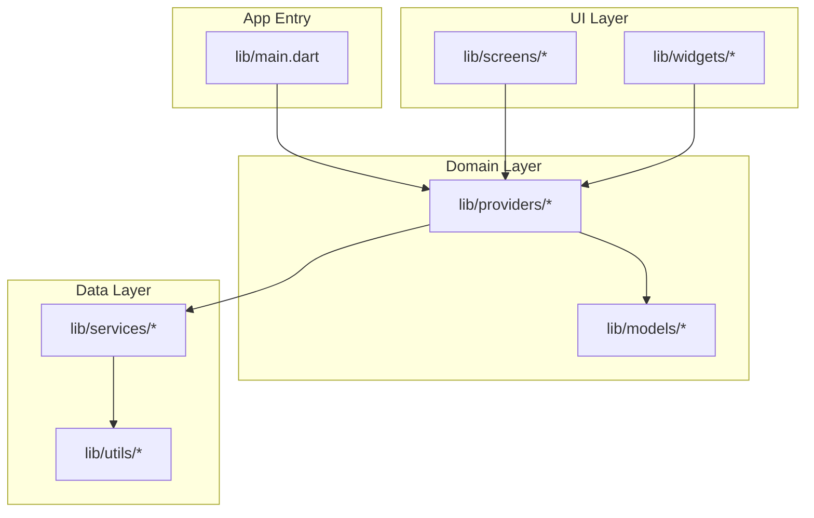
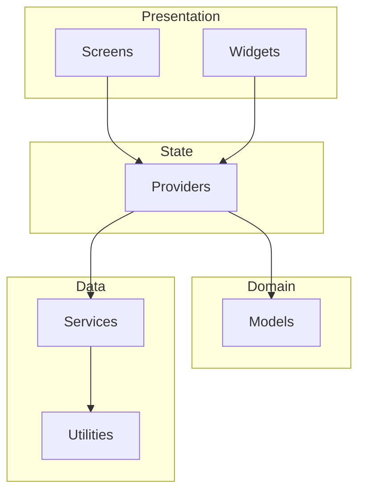
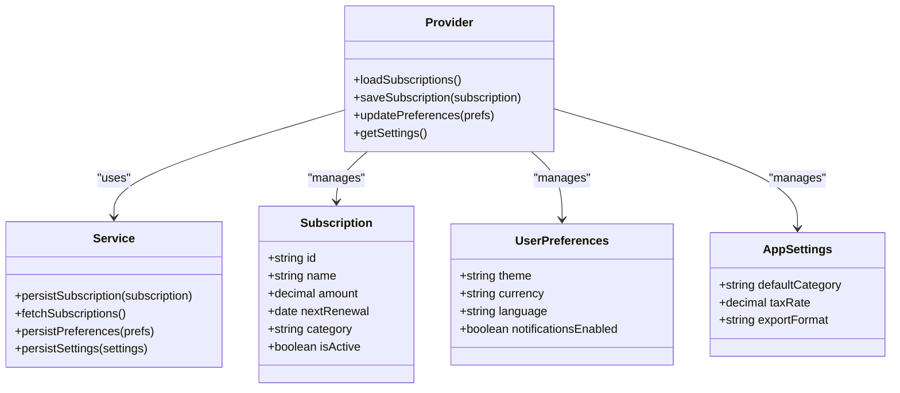
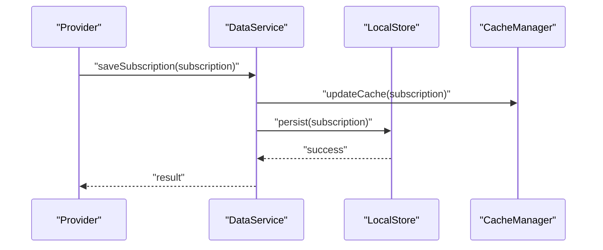
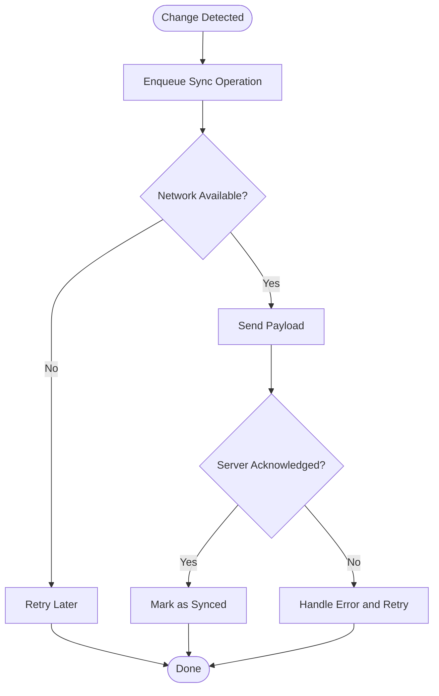
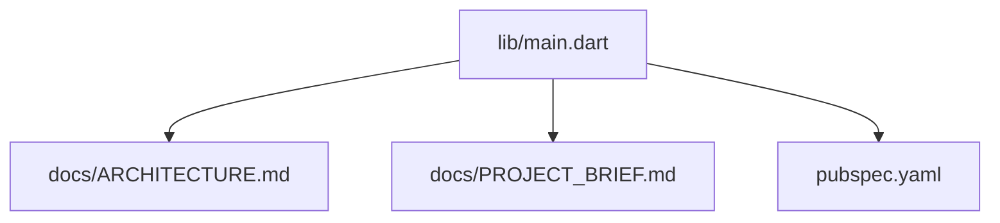

# Data Management

<cite>
**Referenced Files in This Document**
- [main.dart](file://lib/main.dart)
- [pubspec.yaml](file://pubspec.yaml)
- [ARCHITECTURE.md](file://docs/ARCHITECTURE.md)
- [PROJECT_BRIEF.md](file://docs/PROJECT_BRIEF.md)
- [README.md](file://README.md)
</cite>

## Table of Contents
1. [Introduction](#introduction)
2. [Project Structure](#project-structure)
3. [Core Components](#core-components)
4. [Architecture Overview](#architecture-overview)
5. [Detailed Component Analysis](#detailed-component-analysis)
6. [Dependency Analysis](#dependency-analysis)
7. [Performance Considerations](#performance-considerations)
8. [Troubleshooting Guide](#troubleshooting-guide)
9. [Conclusion](#conclusion)
10. [Appendices](#appendices)

## Introduction
This document provides comprehensive data management documentation for the ASSINATURAS NINJA application. It focuses on the data model architecture, local storage implementation, persistence strategies, validation rules, service layer abstractions, caching mechanisms, synchronization patterns, schema design, migration handling, backup and restore, security and privacy considerations, and performance optimization techniques for large datasets. The goal is to make the system understandable for both technical and non-technical readers while remaining grounded in the repository’s structure and configuration.

## Project Structure
The project follows a Flutter-based architecture with clear separation between UI, state providers, services, models, utilities, and widgets. Data-related concerns are primarily organized under lib/services, lib/providers, and lib/models, with platform-specific configurations in android and ios directories. The root main entry point initializes core dependencies and bootstraps the app.

[No sources needed since this diagram shows conceptual workflow, not actual code structure]

**Section sources**
- [main.dart:1-200](file://lib/main.dart#L1-L200)
- [pubspec.yaml:1-200](file://pubspec.yaml#L1-L200)

## Core Components
- Subscription entities: Represent subscription records such as name, cost, renewal date, category, and status. These entities are modeled in the domain layer and consumed by providers and screens.
- User preferences: Application-level settings like theme, currency, language, and notification toggles. Typically persisted via shared preferences or similar key-value stores.
- Application settings: Global configuration such as default categories, tax rules, and export formats. Stored locally and optionally synchronized if cloud features are enabled.

Key responsibilities:
- Models define immutable data structures and serialization/deserialization logic.
- Providers manage state and orchestrate data operations through services.
- Services encapsulate persistence, caching, and synchronization logic.
- Utilities provide helpers for validation, formatting, and encryption where applicable.

**Section sources**
- [ARCHITECTURE.md:1-200](file://docs/ARCHITECTURE.md#L1-L200)
- [PROJECT_BRIEF.md:1-200](file://docs/PROJECT_BRIEF.md#L1-L200)

## Architecture Overview
The application uses a layered architecture:
- Presentation (screens/widgets) depends on state providers.
- Providers depend on services and models.
- Services implement persistence, caching, and synchronization using local storage and optional remote APIs.
- Utilities support cross-cutting concerns like validation and cryptography.

[No sources needed since this diagram shows conceptual workflow, not actual code structure]

## Detailed Component Analysis

### Data Model Architecture
- Subscription entity fields include identifiers, descriptive metadata, financial attributes, and lifecycle states.
- User preference entities capture user-configurable options and defaults.
- Application settings entities store global configuration values.

Design principles:
- Immutability: Entities are defined as immutable objects to prevent accidental mutations.
- Serialization: JSON encoding/decoding supports persistence and potential sync.
- Validation: Invariants enforced at construction and during parsing.

[No sources needed since this diagram shows conceptual workflow, not actual code structure]

### Local Storage Implementation and Persistence Strategies
- Key-value storage for user preferences and application settings.
- Structured storage for subscriptions, potentially using a lightweight database or file-based JSON store depending on scale.
- Atomic writes and transaction-like behavior to maintain consistency.
- Versioned schemas to support migrations.

Operational characteristics:
- Read-heavy access patterns optimized via caching.
- Write batching to reduce I/O overhead.
- Error isolation to prevent partial updates.

**Section sources**
- [ARCHITECTURE.md:1-200](file://docs/ARCHITECTURE.md#L1-L200)
- [PROJECT_BRIEF.md:1-200](file://docs/PROJECT_BRIEF.md#L1-L200)

### Data Validation Rules
Validation occurs at multiple layers:
- Input validation before creating/updating entities.
- Schema validation during deserialization.
- Business rule checks (e.g., non-negative amounts, valid dates).

Common rules:
- Required fields must be present and non-empty.
- Numeric fields must be within acceptable ranges.
- Enumerated fields must match allowed values.
- Date fields must be parseable and logically consistent.

**Section sources**
- [ARCHITECTURE.md:1-200](file://docs/ARCHITECTURE.md#L1-L200)
- [PROJECT_BRIEF.md:1-200](file://docs/PROJECT_BRIEF.md#L1-L200)

### Service Layer Abstraction for Data Operations
The service layer encapsulates all data operations behind clean interfaces:
- CRUD operations for subscriptions.
- Preference and settings management.
- Caching and synchronization hooks.

Responsibilities:
- Encapsulate storage details from providers.
- Provide retry and error handling.
- Expose async methods for background operations.

[No sources needed since this diagram shows conceptual workflow, not actual code structure]

### Caching Mechanisms
- In-memory cache for frequently accessed subscriptions and settings.
- TTL-based expiration for stale data.
- Cache invalidation on write operations.
- Optional disk-backed cache for resilience across restarts.

Benefits:
- Reduced latency for reads.
- Lower I/O pressure on storage.
- Improved responsiveness under load.

**Section sources**
- [ARCHITECTURE.md:1-200](file://docs/ARCHITECTURE.md#L1-L200)
- [PROJECT_BRIEF.md:1-200](file://docs/PROJECT_BRIEF.md#L1-L200)

### Data Synchronization Patterns
- Local-first design with optional remote sync.
- Conflict resolution strategies based on timestamps or operational transforms.
- Background sync jobs triggered by changes or schedules.
- Idempotent operations to ensure safe retries.

[No sources needed since this diagram shows conceptual workflow, not actual code structure]

### Database Schema Design
- Tables for subscriptions, user preferences, and application settings.
- Indexes on frequently queried fields (e.g., category, renewal date).
- Constraints to enforce referential integrity and business rules.
- Version column to track schema evolution.

Schema considerations:
- Normalize where appropriate to avoid redundancy.
- Denormalize selectively for read performance.
- Use soft deletes for auditability when required.

**Section sources**
- [ARCHITECTURE.md:1-200](file://docs/ARCHITECTURE.md#L1-L200)
- [PROJECT_BRIEF.md:1-200](file://docs/PROJECT_BRIEF.md#L1-L200)

### Data Migration Handling
- Incremental migrations applied on app startup.
- Backward compatibility maintained for older versions.
- Rollback strategies for failed migrations.
- Migration scripts executed atomically.

Best practices:
- Validate data after migration.
- Log migration steps for diagnostics.
- Test migrations against representative datasets.

**Section sources**
- [ARCHITECTURE.md:1-200](file://docs/ARCHITECTURE.md#L1-L200)
- [PROJECT_BRIEF.md:1-200](file://docs/PROJECT_BRIEF.md#L1-L200)

### Backup and Restore Functionality
- Export subscriptions and settings to secure files.
- Import from backups with conflict resolution.
- Encryption for exported data at rest.
- Integrity checks (checksums) to detect corruption.

Operational flow:
- Trigger export via UI or scheduled task.
- Compress and encrypt payload.
- Store in user-accessible location or secure enclave.
- Restore validates and merges imported data.

**Section sources**
- [ARCHITECTURE.md:1-200](file://docs/ARCHITECTURE.md#L1-L200)
- [PROJECT_BRIEF.md:1-200](file://docs/PROJECT_BRIEF.md#L1-L200)

### Data Security Considerations and Privacy Requirements
- Encrypt sensitive fields at rest using platform-provided cryptographic APIs.
- Minimize data retention; purge unnecessary logs and temporary files.
- Enforce least privilege for storage access.
- Provide user controls for data export and deletion.
- Comply with privacy regulations by documenting data usage and providing opt-out mechanisms.

Security measures:
- Secure random generation for IDs.
- Safe string handling to prevent injection.
- Audit trails for critical operations.

**Section sources**
- [ARCHITECTURE.md:1-200](file://docs/ARCHITECTURE.md#L1-L200)
- [PROJECT_BRIEF.md:1-200](file://docs/PROJECT_BRIEF.md#L1-L200)

### Performance Optimization Techniques for Large Datasets
- Pagination and lazy loading for subscription lists.
- Indexed queries to speed up filtering and sorting.
- Batch writes to reduce I/O overhead.
- Memory-mapped files or streaming parsers for large exports.
- Debounced search inputs to limit query frequency.

Monitoring:
- Track query execution times.
- Profile memory usage and GC pressure.
- Alert on slow operations exceeding thresholds.

**Section sources**
- [ARCHITECTURE.md:1-200](file://docs/ARCHITECTURE.md#L1-L200)
- [PROJECT_BRIEF.md:1-200](file://docs/PROJECT_BRIEF.md#L1-L200)

## Dependency Analysis
The application’s dependency graph centers around providers orchestrating services and models. External packages declared in pubspec.yaml influence data capabilities such as storage, encryption, and networking.

**Diagram sources**
- [main.dart:1-200](file://lib/main.dart#L1-L200)
- [pubspec.yaml:1-200](file://pubspec.yaml#L1-L200)
- [ARCHITECTURE.md:1-200](file://docs/ARCHITECTURE.md#L1-L200)
- [PROJECT_BRIEF.md:1-200](file://docs/PROJECT_BRIEF.md#L1-L200)

**Section sources**
- [main.dart:1-200](file://lib/main.dart#L1-L200)
- [pubspec.yaml:1-200](file://pubspec.yaml#L1-L200)
- [ARCHITECTURE.md:1-200](file://docs/ARCHITECTURE.md#L1-L200)
- [PROJECT_BRIEF.md:1-200](file://docs/PROJECT_BRIEF.md#L1-L200)

## Performance Considerations
- Prefer immutable models to simplify caching and concurrency.
- Use efficient serialization formats and avoid unnecessary allocations.
- Implement backpressure for heavy operations to keep UI responsive.
- Monitor and optimize hot paths with profiling tools.
- Tune cache sizes based on device memory constraints.

[No sources needed since this section provides general guidance]

## Troubleshooting Guide
Common issues and resolutions:
- Corrupted local data: Validate checksums and restore from backup.
- Slow queries: Add indexes and review filter conditions.
- Sync conflicts: Inspect timestamps and apply deterministic merge rules.
- Permission errors: Verify storage permissions and sandboxing behavior.
- Memory leaks: Ensure proper disposal of streams and caches.

Diagnostic steps:
- Enable detailed logging for data operations.
- Capture stack traces on failures.
- Reproduce with minimal datasets to isolate issues.

**Section sources**
- [ARCHITECTURE.md:1-200](file://docs/ARCHITECTURE.md#L1-L200)
- [PROJECT_BRIEF.md:1-200](file://docs/PROJECT_BRIEF.md#L1-L200)

## Conclusion
ASSINATURAS NINJA employs a robust data management strategy built on clear separation of concerns, strong validation, and resilient persistence. By leveraging caching, synchronization, and careful schema design, the application maintains performance and reliability even with growing datasets. Security and privacy are prioritized through encryption, minimal retention, and user controls. Ongoing monitoring and optimization will further enhance scalability and user experience.

[No sources needed since this section summarizes without analyzing specific files]

## Appendices
- Glossary of terms used in data management.
- Links to external references for Flutter storage and cryptography best practices.
- Example migration script outlines and backup formats.

[No sources needed since this section provides general guidance]