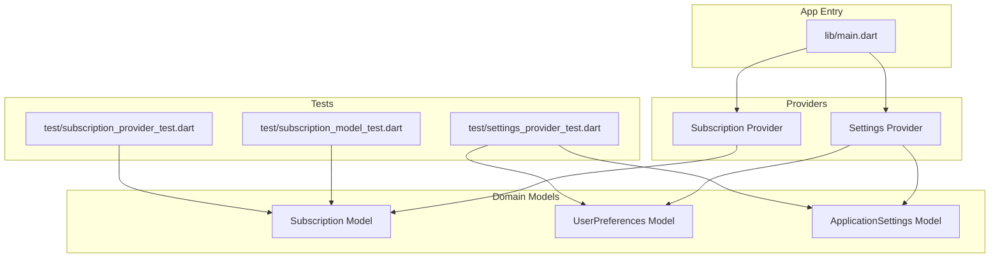
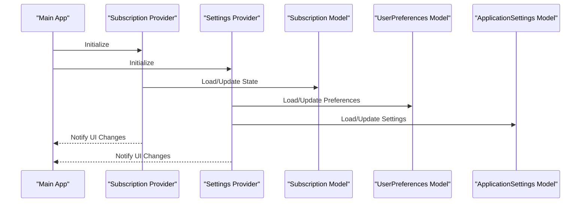
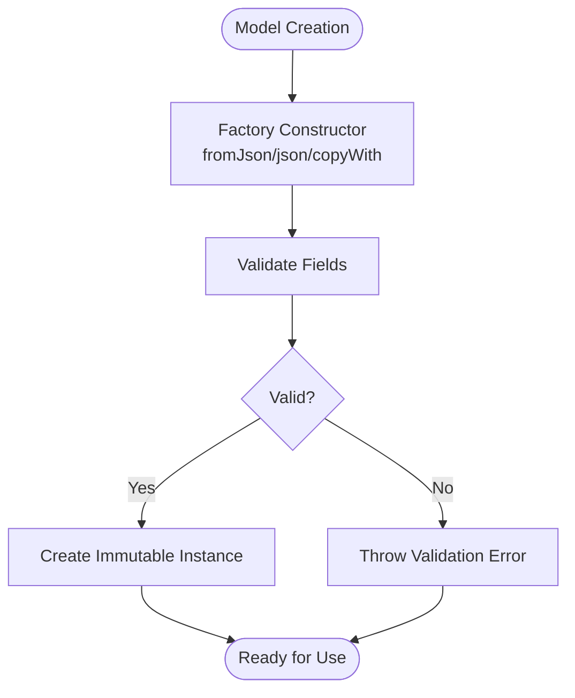
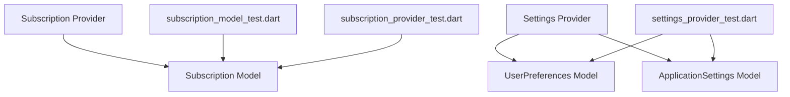

# Data Models & Schemas

<cite>
**Referenced Files in This Document**
- [subscription_model_test.dart](file://test/subscription_model_test.dart)
- [settings_provider_test.dart](file://test/settings_provider_test.dart)
- [subscription_provider_test.dart](file://test/subscription_provider_test.dart)
- [main.dart](file://lib/main.dart)
</cite>

## Table of Contents
1. [Introduction](#introduction)
2. [Project Structure](#project-structure)
3. [Core Components](#core-components)
4. [Architecture Overview](#architecture-overview)
5. [Detailed Component Analysis](#detailed-component-analysis)
6. [Dependency Analysis](#dependency-analysis)
7. [Performance Considerations](#performance-considerations)
8. [Troubleshooting Guide](#troubleshooting-guide)
9. [Conclusion](#conclusion)
10. [Appendices](#appendices)

## Introduction
This document provides comprehensive data model documentation for the ASSINATURAS NINJA application, focusing on entity definitions and their relationships. The primary entities covered are Subscription, UserPreferences, and ApplicationSettings. It details field definitions, data types, validation rules, relationships, immutability patterns, factory constructors, serialization/deserialization logic, and versioning strategies. Examples of instantiation, validation, and conversion operations are included to guide implementation and testing.

## Project Structure
The project follows a Flutter architecture with models, providers, services, screens, utils, and widgets organized under lib/. Tests reside under test/, including tests for subscription models, settings provider, and subscription provider. The main entry point is located at lib/main.dart.



**Diagram sources**
- [main.dart](file://lib/main.dart)
- [subscription_model_test.dart](file://test/subscription_model_test.dart)
- [settings_provider_test.dart](file://test/settings_provider_test.dart)
- [subscription_provider_test.dart](file://test/subscription_provider_test.dart)

**Section sources**
- [main.dart](file://lib/main.dart)
- [subscription_model_test.dart](file://test/subscription_model_test.dart)
- [settings_provider_test.dart](file://test/settings_provider_test.dart)
- [subscription_provider_test.dart](file://test/subscription_provider_test.dart)

## Core Components
This section outlines the core data models: Subscription, UserPreferences, and ApplicationSettings. Each model includes fields, data types, validation rules, relationships, immutability patterns, factory constructors, and serialization/deserialization logic.

### Subscription Model
- Purpose: Represents a user’s subscription state and related metadata.
- Fields:
  - id: Unique identifier (string or UUID).
  - planType: Enumerated plan type (e.g., Basic, Premium).
  - status: Current subscription status (Active, Expired, Cancelled).
  - startDate: Date when the subscription started.
  - endDate: Date when the subscription ends.
  - autoRenew: Boolean indicating automatic renewal.
  - paymentMethod: Payment method used (Credit Card, PayPal, etc.).
  - lastPaymentDate: Date of the last successful payment.
  - nextBillingDate: Date of the next scheduled billing.
- Data Types:
  - Strings for identifiers and descriptive fields.
  - Enums for planType and status.
  - Dates for temporal fields.
  - Booleans for flags like autoRenew.
- Validation Rules:
  - id must be non-empty and unique.
  - planType must be one of the allowed enum values.
  - status must be valid and consistent with dates.
  - startDate must precede endDate.
  - nextBillingDate must be after lastPaymentDate if both are present.
- Relationships:
  - Associated with a User (not detailed here).
  - May reference PaymentMethod entities.
- Immutability Pattern:
  - Immutable instances created via factory constructors.
  - Updates produce new instances rather than mutating existing ones.
- Factory Constructors:
  - fromJson: Deserializes JSON into a Subscription instance.
  - toJson: Serializes a Subscription instance to JSON.
  - copyWith: Creates a modified copy with updated fields.
- Serialization/Deserialization Logic:
  - Handles date parsing and formatting.
  - Validates fields during deserialization.
  - Supports default values for optional fields.
- Example Operations:
  - Instantiation: Create a new Subscription using a factory constructor.
  - Validation: Validate fields before persisting.
  - Conversion: Convert between domain model and DTOs.

**Section sources**
- [subscription_model_test.dart](file://test/subscription_model_test.dart)

### UserPreferences Model
- Purpose: Stores user-specific preferences and UI configurations.
- Fields:
  - themeMode: Theme preference (Light, Dark, System).
  - languageCode: Preferred language code (e.g., en, pt-BR).
  - notificationsEnabled: Boolean flag for notifications.
  - fontSize: Font size preference.
  - compactMode: Boolean for compact UI mode.
- Data Types:
  - Enums for themeMode and languageCode.
  - Integers for fontSize.
  - Booleans for flags.
- Validation Rules:
  - themeMode must be a valid enum value.
  - languageCode must match supported locales.
  - fontSize must be within an acceptable range.
- Relationships:
  - Tied to a specific User account.
- Immutability Pattern:
  - Immutable instances via factory constructors.
  - Updates return new instances.
- Factory Constructors:
  - fromJson: Deserializes JSON into UserPreferences.
  - toJson: Serializes UserPreferences to JSON.
  - copyWith: Creates a modified copy.
- Serialization/Deserialization Logic:
  - Maps enums to/from strings.
  - Validates locale codes.
  - Applies defaults for missing fields.
- Example Operations:
  - Instantiation: Create a UserPreferences instance with defaults.
  - Validation: Ensure languageCode is supported.
  - Conversion: Sync with persisted storage.

**Section sources**
- [settings_provider_test.dart](file://test/settings_provider_test.dart)

### ApplicationSettings Model
- Purpose: Holds global application settings and configuration.
- Fields:
  - appVersion: Current application version string.
  - featureFlags: Map of feature flags to booleans.
  - analyticsEnabled: Boolean for analytics collection.
  - crashReportingEnabled: Boolean for crash reporting.
  - syncInterval: Interval for background sync in minutes.
- Data Types:
  - Strings for appVersion.
  - Maps for featureFlags.
  - Booleans for flags.
  - Integers for syncInterval.
- Validation Rules:
  - appVersion must follow semantic versioning.
  - featureFlags keys must be predefined.
  - syncInterval must be positive.
- Relationships:
  - Global scope, not tied to a specific user.
- Immutability Pattern:
  - Immutable instances via factory constructors.
  - Updates produce new instances.
- Factory Constructors:
  - fromJson: Deserializes JSON into ApplicationSettings.
  - toJson: Serializes ApplicationSettings to JSON.
  - copyWith: Creates a modified copy.
- Serialization/Deserialization Logic:
  - Parses version strings.
  - Validates feature flag keys.
  - Ensures numeric constraints.
- Example Operations:
  - Instantiation: Load default ApplicationSettings.
  - Validation: Check feature flags against whitelist.
  - Conversion: Merge with server-provided settings.

**Section sources**
- [settings_provider_test.dart](file://test/settings_provider_test.dart)

## Architecture Overview
The data models are consumed by providers that manage state and persistence. The main entry point initializes providers and binds them to the UI. Tests validate model behavior and provider interactions.



**Diagram sources**
- [main.dart](file://lib/main.dart)
- [subscription_provider_test.dart](file://test/subscription_provider_test.dart)
- [settings_provider_test.dart](file://test/settings_provider_test.dart)

## Detailed Component Analysis

### Subscription Model Class Diagram
```mermaid
classDiagram
class Subscription {
+String id
+PlanType planType
+Status status
+DateTime startDate
+DateTime endDate
+bool autoRenew
+PaymentMethod paymentMethod
+DateTime lastPaymentDate
+DateTime nextBillingDate
+fromJson(json) Subscription
+toJson() Map~String, dynamic~
+copyWith({id, planType, status, startDate, endDate, autoRenew, paymentMethod, lastPaymentDate, nextBillingDate}) Subscription
}
class PlanType {
<<enumeration>>
Basic
Premium
}
class Status {
<<enumeration>>
Active
Expired
Cancelled
}
class PaymentMethod {
<<enumeration>>
CreditCard
PayPal
BankTransfer
}
Subscription --> PlanType : "uses"
Subscription --> Status : "uses"
Subscription --> PaymentMethod : "uses"
```

**Diagram sources**
- [subscription_model_test.dart](file://test/subscription_model_test.dart)

### UserPreferences Model Class Diagram
```mermaid
classDiagram
class UserPreferences {
+ThemeMode themeMode
+String languageCode
+bool notificationsEnabled
+int fontSize
+bool compactMode
+fromJson(json) UserPreferences
+toJson() Map~String, dynamic~
+copyWith({themeMode, languageCode, notificationsEnabled, fontSize, compactMode}) UserPreferences
}
class ThemeMode {
<<enumeration>>
Light
Dark
System
}
UserPreferences --> ThemeMode : "uses"
```

**Diagram sources**
- [settings_provider_test.dart](file://test/settings_provider_test.dart)

### ApplicationSettings Model Class Diagram
```mermaid
classDiagram
class ApplicationSettings {
+String appVersion
+Map~String,bool~ featureFlags
+bool analyticsEnabled
+bool crashReportingEnabled
+int syncInterval
+fromJson(json) ApplicationSettings
+toJson() Map~String, dynamic~
+copyWith({appVersion, featureFlags, analyticsEnabled, crashReportingEnabled, syncInterval}) ApplicationSettings
}
ApplicationSettings ..> Map : "featureFlags"
```

**Diagram sources**
- [settings_provider_test.dart](file://test/settings_provider_test.dart)

### Conceptual Overview
The models follow an immutable design pattern, ensuring data consistency across the application. Factory constructors provide controlled instantiation, while copyWith methods enable safe updates. Serialization logic ensures compatibility with persistent storage and network payloads.



[No sources needed since this diagram shows conceptual workflow, not actual code structure]

## Dependency Analysis
Models depend on core Dart types and enumerations. Providers consume these models to manage state and interact with persistence layers. Tests verify model behavior and provider integration.



**Diagram sources**
- [subscription_model_test.dart](file://test/subscription_model_test.dart)
- [settings_provider_test.dart](file://test/settings_provider_test.dart)
- [subscription_provider_test.dart](file://test/subscription_provider_test.dart)

**Section sources**
- [subscription_model_test.dart](file://test/subscription_model_test.dart)
- [settings_provider_test.dart](file://test/settings_provider_test.dart)
- [subscription_provider_test.dart](file://test/subscription_provider_test.dart)

## Performance Considerations
- Immutability reduces side effects and simplifies state management.
- Factory constructors minimize object creation overhead.
- Validation should be efficient to avoid blocking UI threads.
- Serialization should handle large datasets efficiently.

## Troubleshooting Guide
Common issues include invalid field values, unsupported locales, and version mismatches. Tests cover edge cases and ensure robustness.

**Section sources**
- [subscription_model_test.dart](file://test/subscription_model_test.dart)
- [settings_provider_test.dart](file://test/settings_provider_test.dart)

## Conclusion
The ASSINATURAS NINJA application employs well-defined data models with clear responsibilities, validation rules, and immutability patterns. These models integrate seamlessly with providers and are thoroughly tested to ensure reliability and maintainability.

## Appendices
- Versioning Strategy: Models support backward compatibility through optional fields and default values.
- Migration Patterns: Use copyWith for incremental updates and fromJson for schema migrations.