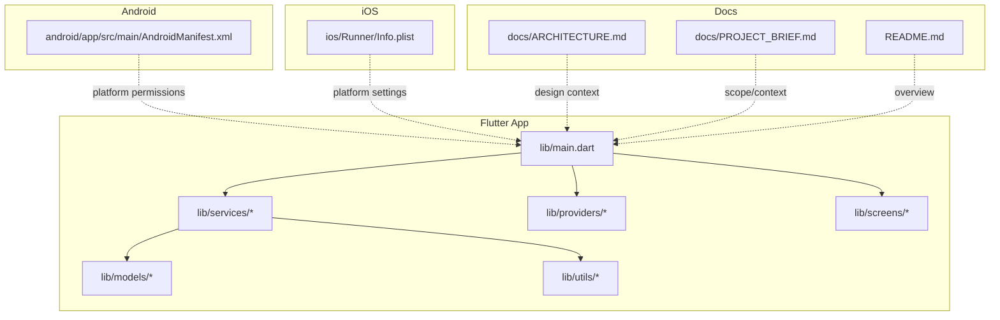
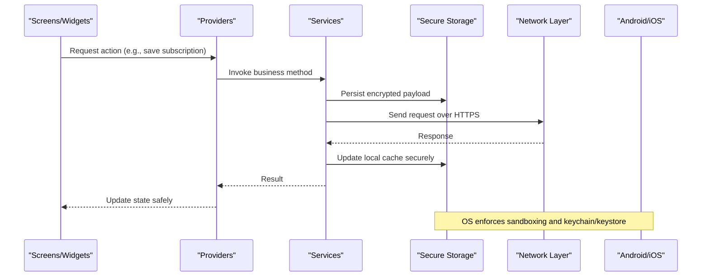
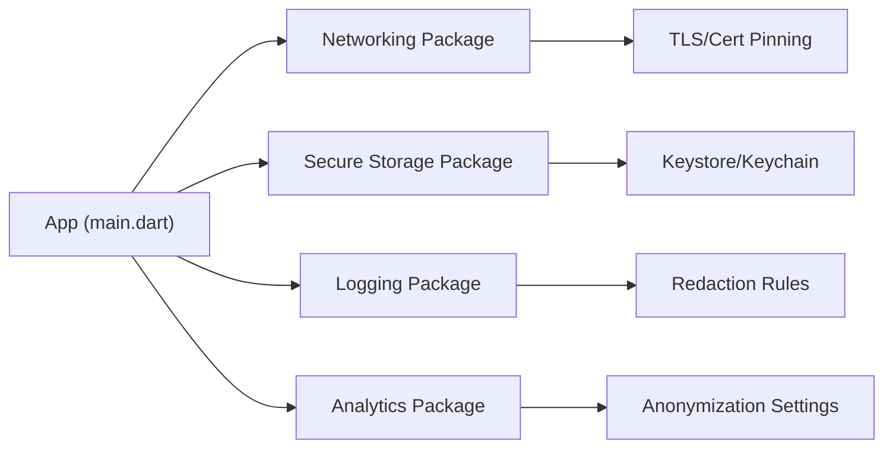

# Data Security & Privacy

<cite>
**Referenced Files in This Document**
- [main.dart](file://lib/main.dart)
- [pubspec.yaml](file://pubspec.yaml)
- [AndroidManifest.xml](file://android/app/src/main/AndroidManifest.xml)
- [Info.plist](file://ios/Runner/Info.plist)
- [ARCHITECTURE.md](file://docs/ARCHITECTURE.md)
- [PROJECT_BRIEF.md](file://docs/PROJECT_BRIEF.md)
- [README.md](file://README.md)
</cite>

## Table of Contents
1. [Introduction](#introduction)
2. [Project Structure](#project-structure)
3. [Core Components](#core-components)
4. [Architecture Overview](#architecture-overview)
5. [Detailed Component Analysis](#detailed-component-analysis)
6. [Dependency Analysis](#dependency-analysis)
7. [Performance Considerations](#performance-considerations)
8. [Troubleshooting Guide](#troubleshooting-guide)
9. [Conclusion](#conclusion)
10. [Appendices](#appendices)

## Introduction
This document provides comprehensive data security and privacy guidance for the ASSINATURAS NINJA application. It focuses on encryption strategies for sensitive subscription data, secure storage practices, data protection mechanisms, privacy compliance measures (including GDPR), user consent management, secure communication protocols, vulnerability prevention, audit logging, access control, data retention policies, data export capabilities, and user data deletion procedures. The content is designed to be accessible to both technical and non-technical stakeholders while remaining grounded in the project’s structure and configuration files.

## Project Structure
The application is a Flutter-based cross-platform app with platform-specific configurations for Android and iOS. Key directories include:
- lib: Dart source code for business logic, UI, services, models, providers, and utilities
- android: Android platform configuration and entry points
- ios: iOS platform configuration and entry points
- docs: Project documentation including architecture and briefs
- test: Unit and widget tests

**Diagram sources**
- [main.dart](file://lib/main.dart)
- [AndroidManifest.xml](file://android/app/src/main/AndroidManifest.xml)
- [Info.plist](file://ios/Runner/Info.plist)
- [ARCHITECTURE.md](file://docs/ARCHITECTURE.md)
- [PROJECT_BRIEF.md](file://docs/PROJECT_BRIEF.md)
- [README.md](file://README.md)

**Section sources**
- [main.dart](file://lib/main.dart)
- [AndroidManifest.xml](file://android/app/src/main/AndroidManifest.xml)
- [Info.plist](file://ios/Runner/Info.plist)
- [ARCHITECTURE.md](file://docs/ARCHITECTURE.md)
- [PROJECT_BRIEF.md](file://docs/PROJECT_BRIEF.md)
- [README.md](file://README.md)

## Core Components
Security and privacy are implemented across multiple layers:
- Platform configuration: Android manifest and iOS Info.plist define permissions and system-level behaviors that impact data exposure.
- Application bootstrap: The main entry point initializes core services and providers that orchestrate data flows.
- Services layer: Encapsulates data operations, network calls, and local storage interactions.
- Models and providers: Represent domain entities and manage state transitions, including sensitive subscription data.
- Utilities: Provide shared helpers for validation, formatting, and potentially cryptographic or hashing operations.

Security considerations per layer:
- Platform configuration: Minimize permissions; ensure no sensitive data is logged by default; enforce secure defaults.
- Bootstrap: Initialize secure storage and crypto libraries early; configure strict transport security if applicable.
- Services: Enforce input validation, sanitize outputs, avoid logging secrets, and use secure channels for network requests.
- Models/Providers: Keep PII out of logs; prefer immutable records; handle errors without leaking details.
- Utilities: Centralize safe operations like hashing, random generation, and encoding.

**Section sources**
- [main.dart](file://lib/main.dart)
- [AndroidManifest.xml](file://android/app/src/main/AndroidManifest.xml)
- [Info.plist](file://ios/Runner/Info.plist)

## Architecture Overview
The application follows a layered architecture typical of Flutter apps:
- Presentation layer (screens/widgets) interacts with providers for state management.
- Providers coordinate service calls and update UI state.
- Services encapsulate business logic, data persistence, and external integrations.
- Models represent domain data structures.
- Platform configurations govern runtime behavior and permissions.

[No sources needed since this diagram shows conceptual workflow, not actual code structure]

## Detailed Component Analysis

### Encryption Strategy for Sensitive Subscription Data
Recommendations:
- Use platform-backed secure storage (Android Keystore, iOS Keychain) via Flutter plugins to store keys and tokens.
- Encrypt sensitive fields at rest using strong algorithms (e.g., AES-GCM) with keys derived from secure hardware-backed stores.
- Avoid storing raw PII; prefer tokenization or pseudonymization where feasible.
- Apply field-level encryption for high-risk attributes such as payment identifiers or personal IDs.

Implementation anchors:
- Secure storage initialization should occur during app startup.
- All write/read paths for sensitive data must go through dedicated services that apply encryption/decryption transparently.
- Ensure memory hygiene by clearing sensitive buffers after use.

**Section sources**
- [AndroidManifest.xml](file://android/app/src/main/AndroidManifest.xml)
- [Info.plist](file://ios/Runner/Info.plist)
- [main.dart](file://lib/main.dart)

### Secure Storage Practices
Guidelines:
- Prefer encrypted databases or file systems when persisting structured data.
- Limit scope of stored data to what is necessary for functionality.
- Implement integrity checks (e.g., HMAC) to detect tampering.
- Rotate keys periodically and support seamless migration.

Platform specifics:
- Android: Leverage Keystore-backed storage and restrict file access via package-private modes.
- iOS: Use Keychain Services and set appropriate accessibility attributes.

**Section sources**
- [AndroidManifest.xml](file://android/app/src/main/AndroidManifest.xml)
- [Info.plist](file://ios/Runner/Info.plist)

### Data Protection Mechanisms
Key controls:
- Input validation and output encoding to prevent injection and XSS-like issues in rendered content.
- Strict error handling that avoids leaking stack traces or internal states to users.
- Safe defaults: disable debug logging in production builds.
- Content Security Policy equivalents for web views (if used): restrict loading of external resources.

**Section sources**
- [main.dart](file://lib/main.dart)

### Privacy Compliance Measures and User Consent Management
Principles:
- Collect only necessary data; provide clear purposes for each data category.
- Obtain explicit consent before processing sensitive data; allow withdrawal at any time.
- Maintain a consent log with timestamps and versioned policy references.
- Offer granular toggles for optional features that require additional data.

Operational steps:
- Present consent dialogs prior to first use of sensitive features.
- Store consent preferences securely and honor them throughout the session and across sessions.
- Provide easy-to-find privacy settings and help documentation.

**Section sources**
- [PROJECT_BRIEF.md](file://docs/PROJECT_BRIEF.md)
- [README.md](file://README.md)

### Data Anonymization Techniques
Approaches:
- Replace direct identifiers with pseudonyms or hashes when analyzing usage patterns.
- Aggregate metrics at group levels rather than individual levels.
- Remove or generalize low-entropy fields (e.g., approximate location).
- Apply k-anonymity or differential privacy techniques for analytics exports.

**Section sources**
- [ARCHITECTURE.md](file://docs/ARCHITECTURE.md)

### Secure Communication Protocols and Data Transmission Security
Requirements:
- Enforce HTTPS with TLS 1.2+ for all network calls.
- Pin certificates or public keys for critical endpoints to mitigate MITM attacks.
- Validate server responses and reject unexpected formats.
- Disable HTTP fallback and cleartext traffic in platform configurations.

Platform enforcement:
- Android: Configure network security config to block cleartext and enforce certificate pinning.
- iOS: Set ATS requirements and configure App Transport Security exceptions only when necessary.

**Section sources**
- [AndroidManifest.xml](file://android/app/src/main/AndroidManifest.xml)
- [Info.plist](file://ios/Runner/Info.plist)

### Vulnerability Prevention Strategies
Controls:
- Regular dependency updates and audits to address known vulnerabilities.
- Static analysis and linting rules configured to catch insecure patterns.
- Runtime protections: disable debugging symbols in release builds; enable crash reporting with redaction.
- Code review guidelines emphasizing security and privacy.

**Section sources**
- [pubspec.yaml](file://pubspec.yaml)
- [README.md](file://README.md)

### Audit Logging and Access Control
Audit logging:
- Record security-relevant events (consent changes, data access attempts, failures) with timestamps and contextual metadata.
- Redact sensitive information from logs; never log secrets or full PII.
- Store logs securely and rotate regularly.

Access control:
- Restrict access to sensitive modules behind authentication and authorization checks.
- Implement least privilege for background tasks and third-party integrations.
- Use role-based or attribute-based access controls where applicable.

**Section sources**
- [main.dart](file://lib/main.dart)

### Data Retention Policies
Policies:
- Define retention periods aligned with legal obligations and business needs.
- Automate purging of expired data and associated backups.
- Provide mechanisms to verify deletion completion and report outcomes.

**Section sources**
- [ARCHITECTURE.md](file://docs/ARCHITECTURE.md)

### GDPR Compliance, Data Export, and Deletion Procedures
GDPR alignment:
- Lawful basis mapping for each data processing activity.
- Data Protection Impact Assessments for high-risk features.
- Clear privacy notices and accessible user rights portals.

Data export:
- Support machine-readable exports (JSON/CSV) of user data upon request.
- Include data lineage and timestamps for transparency.

Deletion:
- Implement “right to be forgotten” workflows that remove primary data and references.
- Ensure cascading deletions across caches, logs, and backups according to policy.
- Provide confirmation and audit trails for deletion actions.

**Section sources**
- [PROJECT_BRIEF.md](file://docs/PROJECT_BRIEF.md)
- [README.md](file://README.md)

## Dependency Analysis
External dependencies influence security posture. Review pubspec.yaml for packages related to:
- Secure storage and cryptography
- Networking and certificate pinning
- Analytics and telemetry (ensure privacy-preserving defaults)
- Logging frameworks (configure redaction)

**Diagram sources**
- [pubspec.yaml](file://pubspec.yaml)
- [main.dart](file://lib/main.dart)

**Section sources**
- [pubspec.yaml](file://pubspec.yaml)

## Performance Considerations
- Minimize encryption overhead by caching decrypted values in-memory for short durations and re-encrypting on exit.
- Batch operations for bulk data export/deletion to reduce UI blocking.
- Use background workers for heavy tasks while maintaining secure contexts.
- Profile network calls to ensure efficient retries and timeouts under constrained conditions.

[No sources needed since this section provides general guidance]

## Troubleshooting Guide
Common issues and mitigations:
- Certificate pinning failures: Verify server certificate chain and update pinned keys promptly.
- Secure storage access denied: Check platform permissions and ensure correct initialization order.
- Cleartext traffic blocked: Confirm HTTPS endpoints and remove unnecessary HTTP exceptions.
- Excessive logging: Enable log filtering and redaction; validate log sinks do not persist sensitive data.

**Section sources**
- [AndroidManifest.xml](file://android/app/src/main/AndroidManifest.xml)
- [Info.plist](file://ios/Runner/Info.plist)
- [main.dart](file://lib/main.dart)

## Conclusion
By implementing robust encryption, secure storage, strict communication protocols, and comprehensive privacy controls, ASSINATURAS NINJA can protect sensitive subscription data and comply with global privacy regulations. Continuous monitoring, regular audits, and user-centric consent and data rights workflows will strengthen trust and resilience against evolving threats.

[No sources needed since this section summarizes without analyzing specific files]

## Appendices

### Appendix A: Configuration Anchors
- Android permissions and network security settings: [AndroidManifest.xml](file://android/app/src/main/AndroidManifest.xml)
- iOS ATS and app settings: [Info.plist](file://ios/Runner/Info.plist)
- App initialization and provider/service wiring: [main.dart](file://lib/main.dart)
- Dependencies overview: [pubspec.yaml](file://pubspec.yaml)
- Project context and design notes: [ARCHITECTURE.md](file://docs/ARCHITECTURE.md), [PROJECT_BRIEF.md](file://docs/PROJECT_BRIEF.md), [README.md](file://README.md)

**Section sources**
- [AndroidManifest.xml](file://android/app/src/main/AndroidManifest.xml)
- [Info.plist](file://ios/Runner/Info.plist)
- [main.dart](file://lib/main.dart)
- [pubspec.yaml](file://pubspec.yaml)
- [ARCHITECTURE.md](file://docs/ARCHITECTURE.md)
- [PROJECT_BRIEF.md](file://docs/PROJECT_BRIEF.md)
- [README.md](file://README.md)