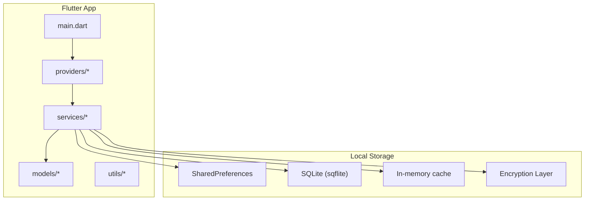
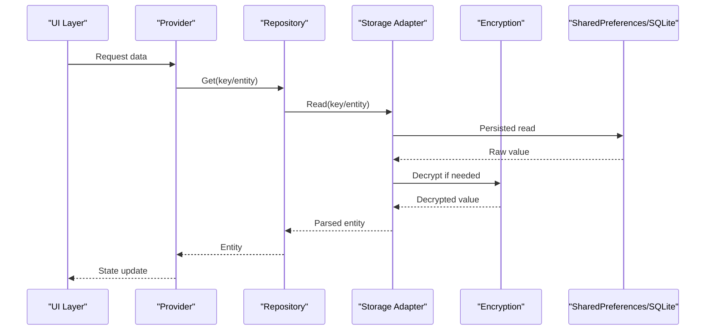
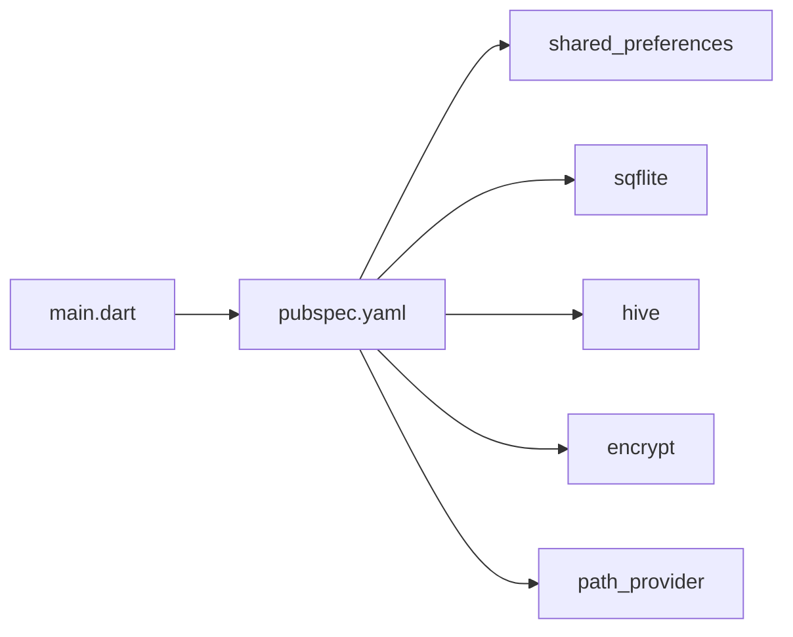

# Storage & Persistence

<cite>
**Referenced Files in This Document**
- [pubspec.yaml](file://pubspec.yaml)
- [main.dart](file://lib/main.dart)
- [ARCHITECTURE.md](file://docs/ARCHITECTURE.md)
- [PROJECT_BRIEF.md](file://docs/PROJECT_BRIEF.md)
</cite>

## Table of Contents
1. [Introduction](#introduction)
2. [Project Structure](#project-structure)
3. [Core Components](#core-components)
4. [Architecture Overview](#architecture-overview)
5. [Detailed Component Analysis](#detailed-component-analysis)
6. [Dependency Analysis](#dependency-analysis)
7. [Performance Considerations](#performance-considerations)
8. [Troubleshooting Guide](#troubleshooting-guide)
9. [Conclusion](#conclusion)
10. [Appendices](#appendices)

## Introduction
This document describes the storage and persistence strategy for the ASSINATURAS NINJA application. It focuses on local data persistence, caching strategies, memory management, performance optimization, backup and restore, migration handling, cleanup procedures, configuration options for storage providers, encryption considerations, synchronization patterns, storage limits, error handling, and recovery mechanisms for corrupted data. The goal is to provide a clear, actionable guide for implementing robust, efficient, and secure persistence in this Flutter-based app.

## Project Structure
The project follows a standard Flutter layout with Dart code under lib/, platform-specific directories for Android and iOS, and documentation under docs/. For storage and persistence:
- Dependencies are declared in pubspec.yaml (e.g., shared_preferences, sqflite, hive, encrypt).
- Application bootstrap is defined in main.dart, where initializations such as storage provider setup typically occur.
- Architectural guidance and project scope are described in docs/ARCHITECTURE.md and docs/PROJECT_BRIEF.md.

[No sources needed since this diagram shows conceptual structure]

**Section sources**
- [pubspec.yaml](file://pubspec.yaml)
- [main.dart](file://lib/main.dart)
- [ARCHITECTURE.md](file://docs/ARCHITECTURE.md)
- [PROJECT_BRIEF.md](file://docs/PROJECT_BRIEF.md)

## Core Components
This section outlines the primary components involved in storage and persistence:
- Configuration Provider: Centralizes storage provider selection and settings (e.g., SharedPreferences vs SQLite), enabling runtime or build-time switching.
- Data Access Layer: Abstracts storage operations behind interfaces, allowing multiple backends (key-value, relational, NoSQL).
- Caching Layer: Provides fast in-memory access to frequently used data with TTL and eviction policies.
- Encryption Module: Wraps sensitive fields using symmetric encryption before persisting.
- Backup and Restore Service: Exports and imports data across devices or sessions.
- Migration Manager: Handles schema evolution and data upgrades between versions.
- Cleanup Utility: Removes stale or temporary files and clears caches when thresholds are exceeded.

Implementation details should be added once specific files are available. Until then, use these guidelines to structure your implementation.

[No sources needed since this section provides general guidance]

## Architecture Overview
A layered architecture separates concerns:
- Presentation layer consumes state from providers.
- Providers coordinate services and repositories.
- Repositories implement storage abstractions.
- Storage adapters implement concrete backends (SharedPreferences, SQLite, Hive).
- Encryption wraps sensitive payloads.
- Backup/Restore and Migration operate at the repository level.

[No sources needed since this diagram shows conceptual workflow]

## Detailed Component Analysis

### Local Storage Implementation (SharedPreferences and Alternatives)
- Use SharedPreferences for simple key-value pairs (settings, flags, small config).
- Prefer SQLite for structured, queryable data (subscriptions, categories, logs).
- Consider Hive for high-performance NoSQL key-value storage if required.
- Provide an abstraction so that the rest of the app remains agnostic of the backend.

Key responsibilities:
- Initialize storage on app start.
- Ensure thread-safe reads/writes.
- Handle type conversions and validation.
- Surface consistent errors.

[No sources needed since this section provides general guidance]

### Data Caching Strategies
- In-memory cache for hot data with TTL and LRU eviction.
- Disk cache fallback for offline-first behavior.
- Cache invalidation triggers on write operations or explicit refresh.
- Debounce rapid writes to reduce I/O overhead.

[No sources needed since this section provides general guidance]

### Memory Management and Performance Optimization
- Avoid loading large datasets into memory; paginate or stream results.
- Serialize only necessary fields.
- Batch writes where possible.
- Use background tasks for heavy operations.
- Monitor memory usage and trim caches proactively.

[No sources needed since this section provides general guidance]

### Backup and Restore Functionality
- Export data to JSON or encrypted archives.
- Import and validate incoming data before applying changes.
- Support incremental backups and conflict resolution.
- Provide user-facing controls to trigger export/import.

[No sources needed since this section provides general guidance]

### Data Migration Handling
- Maintain versioned schemas.
- Implement migration scripts that transform old data to new structures.
- Run migrations atomically and roll back on failure.
- Log migration outcomes for diagnostics.

[No sources needed since this section provides general guidance]

### Storage Cleanup Procedures
- Remove expired entries based on TTL.
- Purge temporary files and unused assets.
- Enforce size quotas and evict least-recently-used items.
- Periodic maintenance jobs to keep storage healthy.

[No sources needed since this section provides general guidance]

### Configuration Options for Storage Providers
- Select backend per environment (dev/test/prod).
- Configure database paths, encryption keys, and cache sizes.
- Toggle features like compression or encryption at field-level.
- Centralize configuration via a provider or service.

[No sources needed since this section provides general guidance]

### Encryption Implementations
- Use strong symmetric encryption for sensitive fields.
- Manage keys securely (platform keystore or secure enclave).
- Apply encryption at the adapter layer to avoid leaking plaintext.
- Rotate keys with migration support.

[No sources needed since this section provides general guidance]

### Data Synchronization Patterns
- Offline-first design with local persistence.
- Conflict resolution strategies (last-write-wins, merge by timestamp).
- Background sync with retry and exponential backoff.
- Change tracking and delta uploads.

[No sources needed since this section provides general guidance]

### Storage Limits, Error Handling, and Recovery
- Detect storage full conditions and prompt users to free space.
- Gracefully handle IO errors, permission issues, and corruption.
- Implement checksums or hashes to detect corruption.
- Provide recovery routines: rebuild indexes, re-parse records, or reset corrupted segments.

[No sources needed since this section provides general guidance]

## Dependency Analysis
The following dependencies are relevant to storage and persistence:
- shared_preferences: Key-value storage for lightweight settings.
- sqflite: Relational database for structured data.
- hive: High-performance NoSQL storage option.
- encrypt: Symmetric encryption utilities.
- path_provider: Platform-agnostic file paths for backups and caches.

**Diagram sources**
- [pubspec.yaml](file://pubspec.yaml)
- [main.dart](file://lib/main.dart)

**Section sources**
- [pubspec.yaml](file://pubspec.yaml)
- [main.dart](file://lib/main.dart)

## Performance Considerations
- Prefer batched writes and transactions to minimize disk I/O.
- Use pagination and streaming for large datasets.
- Keep in-memory caches small and bounded.
- Compress large payloads selectively.
- Profile storage operations and optimize hot paths.

[No sources needed since this section provides general guidance]

## Troubleshooting Guide
Common issues and resolutions:
- Storage full: Check available space and purge caches; notify users.
- Permission denied: Verify storage permissions and request them appropriately.
- Corrupted data: Validate checksums, rebuild indexes, or rollback to last known good state.
- Slow queries: Add appropriate indexes and refine queries.
- Key rotation failures: Ensure migration handles old keys gracefully.

[No sources needed since this section provides general guidance]

## Conclusion
By adopting a layered storage architecture with clear abstractions, robust caching, encryption, migration, and recovery mechanisms, the ASSINATURAS NINJA app can deliver reliable, performant, and secure persistence. Implement the components outlined above according to your app’s data model and operational requirements, and continuously monitor performance and storage health.

[No sources needed since this section summarizes without analyzing specific files]

## Appendices

### Recommended File Organization
- lib/storage/providers/: Storage provider implementations (SharedPreferences, SQLite, Hive).
- lib/storage/repositories/: Repository layer abstracting storage operations.
- lib/storage/cache/: In-memory and disk cache utilities.
- lib/storage/crypto/: Encryption helpers and key management.
- lib/storage/migrations/: Schema versions and migration scripts.
- lib/storage/backup_restore/: Export/import logic.
- lib/storage/cleanup/: Maintenance and cleanup routines.

[No sources needed since this section provides general guidance]