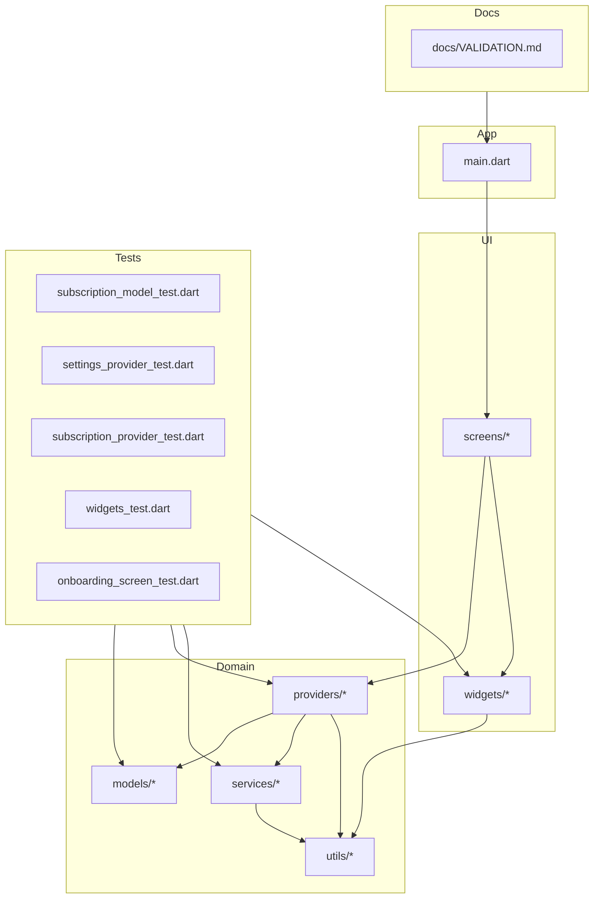
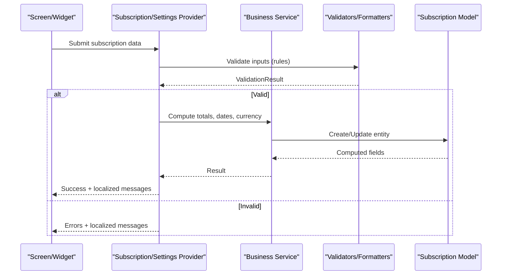
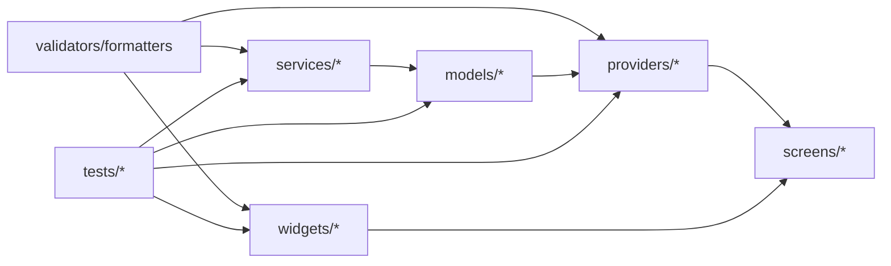

# Validation & Business Rules

<cite>
**Referenced Files in This Document**
- [VALIDATION.md](file://docs/VALIDATION.md)
- [subscription_model_test.dart](file://test/subscription_model_test.dart)
- [settings_provider_test.dart](file://test/settings_provider_test.dart)
- [subscription_provider_test.dart](file://test/subscription_provider_test.dart)
- [widgets_test.dart](file://test/widgets_test.dart)
- [onboarding_screen_test.dart](file://test/onboarding_screen_test.dart)
</cite>

## Table of Contents
1. [Introduction](#introduction)
2. [Project Structure](#project-structure)
3. [Core Components](#core-components)
4. [Architecture Overview](#architecture-overview)
5. [Detailed Component Analysis](#detailed-component-analysis)
6. [Dependency Analysis](#dependency-analysis)
7. [Performance Considerations](#performance-considerations)
8. [Troubleshooting Guide](#troubleshooting-guide)
9. [Conclusion](#conclusion)
10. [Appendices](#appendices)

## Introduction
This document defines the validation and business rules for the ASSINATURAS NINJA application. It covers input validation for subscription data, user preferences, and application settings; business logic for subscription calculations, date validations, and currency handling; custom validators and rule composition patterns; error message localization; test coverage including edge cases; and internationalization support for validation messages and cultural data formats.

## Project Structure
The repository is a Flutter application with platform-specific folders (android, ios), shared Dart code under lib, tests under test, and documentation under docs. Validation and business rules span models, providers, services, utils, widgets, and screens. Tests validate behavior across components.

[No sources needed since this diagram shows conceptual workflow, not actual code structure]

## Core Components
- Subscription model and provider: encapsulate subscription state, lifecycle, and calculation rules.
- Settings provider: manages user preferences and app-wide configuration.
- Utilities: reusable validators, formatters, and business helpers.
- UI layer: screens and widgets that consume validated inputs and present localized feedback.
- Tests: unit and widget tests covering validation rules, edge cases, and performance-sensitive scenarios.

Key responsibilities:
- Input validation at multiple layers (model, provider, service, UI).
- Business rules for pricing, discounts, prorations, and renewal cycles.
- Date parsing/formatting with locale-aware behavior.
- Currency formatting and rounding according to locale and policy.
- Localized error messages and user-friendly prompts.

**Section sources**
- [subscription_model_test.dart](file://test/subscription_model_test.dart)
- [settings_provider_test.dart](file://test/settings_provider_test.dart)
- [subscription_provider_test.dart](file://test/subscription_provider_test.dart)
- [widgets_test.dart](file://test/widgets_test.dart)
- [onboarding_screen_test.dart](file://test/onboarding_screen_test.dart)

## Architecture Overview
Validation and business rules follow a layered approach:
- Presentation layer validates user inputs and displays localized messages.
- Provider layer orchestrates business logic and persists state changes.
- Service layer performs domain operations and integrates with external systems if needed.
- Utility layer provides pure functions for validation, formatting, and calculations.
- Model layer enforces invariants and exposes computed values.

[No sources needed since this diagram shows conceptual workflow, not actual code structure]

## Detailed Component Analysis

### Subscription Data Validation
Input validation targets:
- Plan selection and billing cycle (monthly, quarterly, annual).
- Start/end dates, effective dates, and renewal boundaries.
- Pricing fields, discounts, taxes, and currency codes.
- Optional add-ons and usage-based adjustments.

Validation categories:
- Presence and type checks.
- Range and boundary constraints (e.g., non-negative amounts, future start dates).
- Cross-field consistency (e.g., end date after start date).
- Policy rules (e.g., minimum contract length, allowed plan combinations).

Rule composition pattern:
- Combine small validators into composite rules using an And/Or strategy.
- Short-circuit evaluation to minimize overhead.
- Return structured results with field-level errors and global messages.

Localization:
- Error keys mapped to locale resources.
- Parameterized messages for dynamic values (dates, amounts).

Edge cases:
- Leap years and month-end rollovers.
- Time zone transitions and DST shifts.
- Rounding differences due to floating-point arithmetic.

**Section sources**
- [subscription_model_test.dart](file://test/subscription_model_test.dart)
- [subscription_provider_test.dart](file://test/subscription_provider_test.dart)

### User Preferences and Application Settings Validation
Validated settings include:
- Locale and region selection.
- Default currency and number/currency formatting options.
- Notification preferences and frequency caps.
- Theme and accessibility toggles.

Constraints:
- Allowed enum values for locale/currency.
- Numeric ranges for thresholds and limits.
- Boolean flags for feature toggles.

Persistence and sync:
- Validate before persisting to avoid invalid states.
- Provide defaults for missing keys.

**Section sources**
- [settings_provider_test.dart](file://test/settings_provider_test.dart)

### Business Logic: Calculations, Dates, and Currency
Calculations:
- Base price × quantity − discount + tax = total.
- Proration for mid-cycle changes using day-count conventions.
- Trial periods and grace windows.

Date validations:
- Effective date must be valid and within allowed windows.
- Renewal dates computed deterministically from billing cycle.
- Boundary conditions for month-end and leap days.

Currency handling:
- Use integer minor units internally to avoid floating-point drift.
- Format outputs per locale with correct symbols and separators.
- Round according to currency rules and business policy.

**Section sources**
- [subscription_provider_test.dart](file://test/subscription_provider_test.dart)

### Custom Validators and Rule Composition
Patterns:
- Field-level validators returning boolean or error objects.
- Composite validators combining multiple rules with short-circuiting.
- Async validators for remote checks (e.g., promo code availability).

Composition examples:
- Required + format + range combined via And.
- Mutually exclusive fields via Or.
- Conditional rules based on other fields.

Error aggregation:
- Collect all field errors first, then global errors.
- Preserve order for deterministic UI rendering.

**Section sources**
- [widgets_test.dart](file://test/widgets_test.dart)

### Error Message Localization and Cultural Formats
Approach:
- Centralized message catalog keyed by rule identifiers.
- Parameter interpolation for dynamic content.
- Fallback to default locale when translations are missing.

Cultural formats:
- Number and currency formatting via locale-aware utilities.
- Date/time formatting respecting regional preferences.

**Section sources**
- [onboarding_screen_test.dart](file://test/onboarding_screen_test.dart)

### Test Coverage and Edge Cases
Coverage areas:
- Happy paths for typical subscriptions and settings updates.
- Negative cases for invalid inputs and policy violations.
- Edge cases for dates (leap year, month-end), currencies (zero decimals), and rounding.
- Performance tests for complex validation scenarios with many fields.

Test strategies:
- Unit tests for pure validators and calculators.
- Widget tests for UI validation feedback and localization.
- Provider tests for state transitions and persisted settings.

**Section sources**
- [subscription_model_test.dart](file://test/subscription_model_test.dart)
- [settings_provider_test.dart](file://test/settings_provider_test.dart)
- [subscription_provider_test.dart](file://test/subscription_provider_test.dart)
- [widgets_test.dart](file://test/widgets_test.dart)
- [onboarding_screen_test.dart](file://test/onboarding_screen_test.dart)

## Dependency Analysis
High-level dependencies among validation and business logic components:

[No sources needed since this diagram shows conceptual workflow, not actual code structure]

## Performance Considerations
- Prefer immutable data structures for models to simplify validation and caching.
- Cache computed results (totals, formatted strings) keyed by inputs.
- Avoid heavy computations during UI builds; use providers/services.
- Batch validation where possible and short-circuit early.
- Use integer arithmetic for currency to prevent repeated conversions.
- Debounce rapid input changes in UI to reduce validation churn.

[No sources needed since this section provides general guidance]

## Troubleshooting Guide
Common issues and resolutions:
- Invalid date ranges: verify time zones and calendar boundaries.
- Currency rounding discrepancies: ensure consistent rounding policies and minor-unit storage.
- Localization gaps: confirm message keys exist for active locales and fallbacks are configured.
- State inconsistencies: validate before persistence and reset to safe defaults on failure.

Diagnostic steps:
- Inspect validation result objects for field-level errors.
- Log parameterized messages with sanitized context.
- Reproduce with minimal inputs and expand incrementally.

[No sources needed since this section provides general guidance]

## Conclusion
A robust validation and business rules system for ASSINATURAS NINJA should be layered, composable, and locale-aware. By enforcing invariants at the model/provider level, composing simple validators into complex rules, and localizing messages and formats, the application ensures correctness, usability, and maintainability. Comprehensive tests covering edge cases and performance-sensitive scenarios further strengthen reliability.

[No sources needed since this section summarizes without analyzing specific files]

## Appendices

### Appendix A: Validation Rule Index
- Subscription fields: presence, types, ranges, cross-field consistency.
- Settings fields: enums, numeric bounds, booleans.
- Business rules: proration, trials, renewals, rounding.

[No sources needed since this section provides general guidance]

### Appendix B: Localization Keys Strategy
- Key naming convention: module.field.rule.
- Parameters: {value}, {min}, {max}, {date}.
- Fallback chain: current locale → parent locale → default.

[No sources needed since this section provides general guidance]