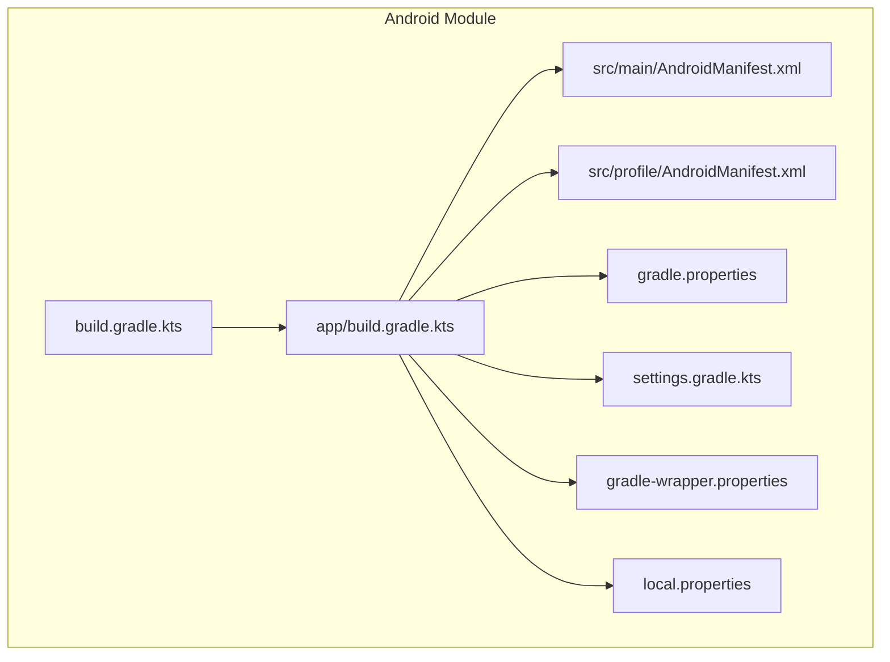
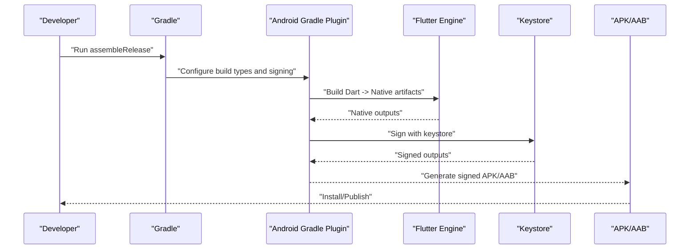
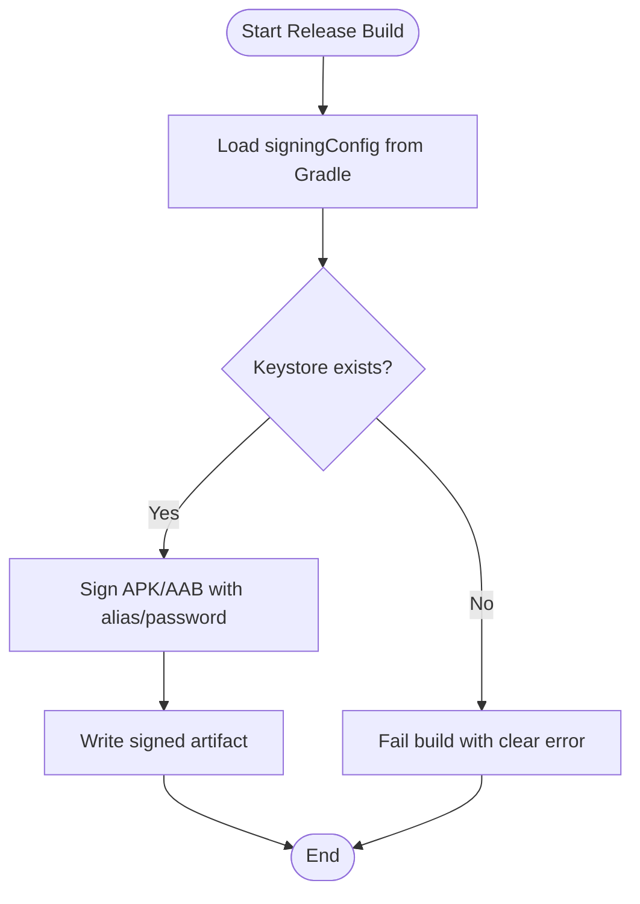
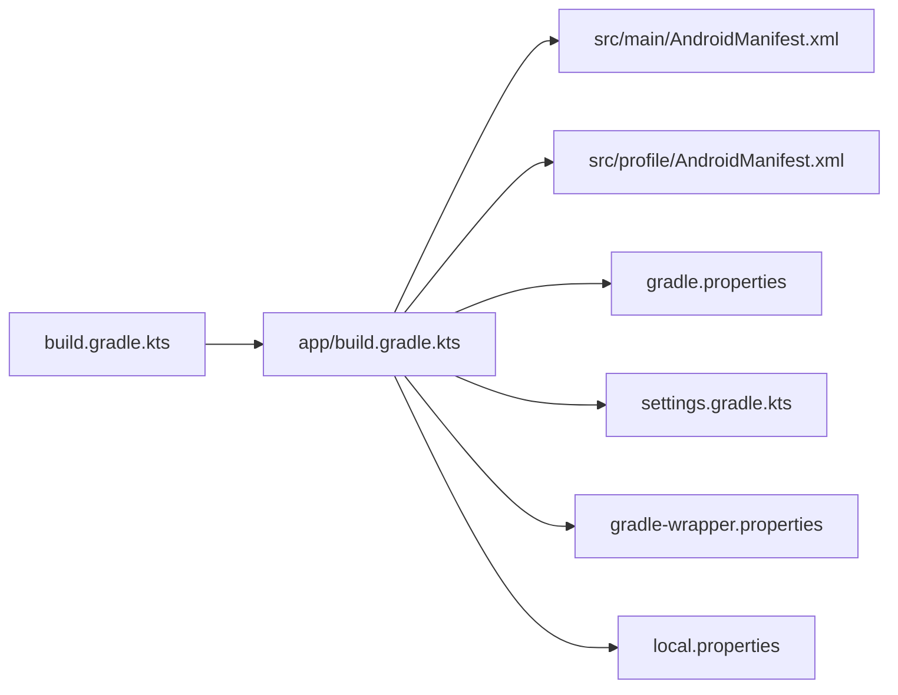

# Android Deployment

<cite>
**Referenced Files in This Document**
- [android/app/build.gradle.kts](file://android/app/build.gradle.kts)
- [android/build.gradle.kts](file://android/build.gradle.kts)
- [android/gradle.properties](file://android/gradle.properties)
- [android/settings.gradle.kts](file://android/settings.gradle.kts)
- [android/gradle/wrapper/gradle-wrapper.properties](file://android/gradle/wrapper/gradle-wrapper.properties)
- [android/app/src/main/AndroidManifest.xml](file://android/app/src/main/AndroidManifest.xml)
- [android/app/src/profile/AndroidManifest.xml](file://android/app/src/profile/AndroidManifest.xml)
- [android/local.properties](file://android/local.properties)
</cite>

## Table of Contents
1. [Introduction](#introduction)
2. [Project Structure](#project-structure)
3. [Core Components](#core-components)
4. [Architecture Overview](#architecture-overview)
5. [Detailed Component Analysis](#detailed-component-analysis)
6. [Dependency Analysis](#dependency-analysis)
7. [Performance Considerations](#performance-considerations)
8. [Troubleshooting Guide](#troubleshooting-guide)
9. [Conclusion](#conclusion)
10. [Appendices](#appendices)

## Introduction
This document provides comprehensive Android deployment guidance for the ASSINATURAS NINJA application, focusing on the Flutter Android module. It covers environment setup, Gradle configuration, app signing with keystore files, manifest and permissions, build variants (debug, profile, release), optimization techniques, Google Play Store publishing procedures (AAB generation, versioning, store listing preparation), and troubleshooting best practices for production builds.

## Project Structure
The Android portion of this Flutter project resides under android/. The key artifacts relevant to deployment are:
- App-level Gradle script: android/app/build.gradle.kts
- Project-level Gradle script: android/build.gradle.kts
- Gradle properties: android/gradle.properties
- Settings: android/settings.gradle.kts
- Gradle wrapper: android/gradle/wrapper/gradle-wrapper.properties
- Application manifest: android/app/src/main/AndroidManifest.xml
- Profile manifest overlay: android/app/src/profile/AndroidManifest.xml
- Local SDK path: android/local.properties

**Diagram sources**
- [android/app/build.gradle.kts](file://android/app/build.gradle.kts)
- [android/build.gradle.kts](file://android/build.gradle.kts)
- [android/gradle.properties](file://android/gradle.properties)
- [android/settings.gradle.kts](file://android/settings.gradle.kts)
- [android/gradle/wrapper/gradle-wrapper.properties](file://android/gradle/wrapper/gradle-wrapper.properties)
- [android/app/src/main/AndroidManifest.xml](file://android/app/src/main/AndroidManifest.xml)
- [android/app/src/profile/AndroidManifest.xml](file://android/app/src/profile/AndroidManifest.xml)
- [android/local.properties](file://android/local.properties)

**Section sources**
- [android/app/build.gradle.kts](file://android/app/build.gradle.kts)
- [android/build.gradle.kts](file://android/build.gradle.kts)
- [android/gradle.properties](file://android/gradle.properties)
- [android/settings.gradle.kts](file://android/settings.gradle.kts)
- [android/gradle/wrapper/gradle-wrapper.properties](file://android/gradle/wrapper/gradle-wrapper.properties)
- [android/app/src/main/AndroidManifest.xml](file://android/app/src/main/AndroidManifest.xml)
- [android/app/src/profile/AndroidManifest.xml](file://android/app/src/profile/AndroidManifest.xml)
- [android/local.properties](file://android/local.properties)

## Core Components
- Build scripts
  - App-level Gradle script defines application ID, compileSdk/targetSdk/minSdk, signing config, build types, and packaging options.
  - Project-level Gradle script centralizes Kotlin/AGP versions and repositories.
- Manifests
  - Main manifest declares app metadata, permissions, and entry points.
  - Profile manifest overlays debug-only flags or components.
- Gradle properties
  - Global JVM and Gradle settings such as memory, parallelism, and AndroidX/R8 flags.
- Wrapper and settings
  - Wrapper pins Gradle distribution; settings controls plugin management and includes.
- Local properties
  - Points to Android SDK location for local development.

**Section sources**
- [android/app/build.gradle.kts](file://android/app/build.gradle.kts)
- [android/build.gradle.kts](file://android/build.gradle.kts)
- [android/gradle.properties](file://android/gradle.properties)
- [android/settings.gradle.kts](file://android/settings.gradle.kts)
- [android/gradle/wrapper/gradle-wrapper.properties](file://android/gradle/wrapper/gradle-wrapper.properties)
- [android/app/src/main/AndroidManifest.xml](file://android/app/src/main/AndroidManifest.xml)
- [android/app/src/profile/AndroidManifest.xml](file://android/app/src/profile/AndroidManifest.xml)
- [android/local.properties](file://android/local.properties)

## Architecture Overview
The Android build pipeline integrates Flutter’s Dart code into an Android APK/AAB via AGP and Gradle. Signing is applied at build time using a keystore defined in the app-level Gradle script. The final artifact is produced by the assembleRelease task and can be optimized with R8/ProGuard and resource shrinking.

**Diagram sources**
- [android/app/build.gradle.kts](file://android/app/build.gradle.kts)
- [android/build.gradle.kts](file://android/build.gradle.kts)

## Detailed Component Analysis

### Gradle Configuration (App-Level)
Key responsibilities:
- Define applicationId, compileSdk, targetSdk, minSdk.
- Configure buildTypes (debug, profile, release).
- Set up signingConfigs and signingConfig for release.
- Enable R8/shrinking and resource shrinking for release.
- Manage dependencies and packagingOptions.

Recommended actions:
- Ensure signingConfigs references a secure keystore file path and credentials.
- Use buildType-specific configurations to enable optimizations only for release.
- Pin compileSdk/targetSdk to supported versions and align with Flutter requirements.

**Section sources**
- [android/app/build.gradle.kts](file://android/app/build.gradle.kts)

### Gradle Configuration (Project-Level)
Centralizes:
- Kotlin and AGP versions.
- Repositories (Google, Maven Central).
- Dependency resolution strategies.

Best practices:
- Keep versions aligned with Flutter toolchain.
- Avoid mixing incompatible AGP/Kotlin versions.

**Section sources**
- [android/build.gradle.kts](file://android/build.gradle.kts)

### Gradle Properties
Controls:
- JVM arguments (memory, GC).
- Gradle daemon and parallelism.
- AndroidX and R8 flags.

Optimization tips:
- Increase heap size for large projects.
- Enable parallel builds and configure worker threads.
- Enable R8 full mode for release.

**Section sources**
- [android/gradle.properties](file://android/gradle.properties)

### Settings and Wrapper
- settings.gradle.kts manages plugins and included modules.
- gradle-wrapper.properties pins the Gradle distribution used by the project.

Recommendations:
- Use the latest stable Gradle wrapper compatible with your AGP version.
- Keep settings minimal and explicit.

**Section sources**
- [android/settings.gradle.kts](file://android/settings.gradle.kts)
- [android/gradle/wrapper/gradle-wrapper.properties](file://android/gradle/wrapper/gradle-wrapper.properties)

### Manifest and Permissions
Main manifest responsibilities:
- Declare application metadata (label, icon, theme).
- Define permissions required by features.
- Register activities/services/receivers as needed.

Profile manifest overlay:
- Can override or add debug-only components or flags.

Guidelines:
- Request only necessary permissions.
- Validate permission declarations against feature usage.
- Keep profile manifest minimal and scoped to debugging.

**Section sources**
- [android/app/src/main/AndroidManifest.xml](file://android/app/src/main/AndroidManifest.xml)
- [android/app/src/profile/AndroidManifest.xml](file://android/app/src/profile/AndroidManifest.xml)

### Local Properties
- local.properties typically contains sdk.dir pointing to the Android SDK installation.

Ensure:
- Correct SDK path for your environment.
- No sensitive data committed to version control.

**Section sources**
- [android/local.properties](file://android/local.properties)

### App Signing with Keystore
Signing flow overview:
- Define a signingConfig referencing a .jks or .keystore file.
- Apply signingConfig to the release buildType.
- Provide alias, password, and keyPassword securely.
- Generate signed artifacts via assembleRelease.

Security recommendations:
- Store keystores outside source control.
- Use environment variables or secret managers for passwords.
- Restrict access to signing keys.

**Diagram sources**
- [android/app/build.gradle.kts](file://android/app/build.gradle.kts)

**Section sources**
- [android/app/build.gradle.kts](file://android/app/build.gradle.kts)

### Build Variants
- debug: Unoptimized, fast iteration, no signing required for local installs.
- profile: Performance profiling enabled, still unsigned or debug-signed.
- release: Optimized, shrink resources, R8 enabled, signed with keystore.

Usage:
- flutter build apk --release
- flutter build appbundle --release
- Or use Gradle tasks directly: ./gradlew assembleRelease

**Section sources**
- [android/app/build.gradle.kts](file://android/app/build.gradle.kts)

### Google Play Store Publishing Procedures
Preparation:
- Create a keystore and keep it safe.
- Update app metadata (applicationId, versionName, versionCode).
- Prepare store assets (icons, screenshots, descriptions).

Generation:
- Build AAB for Play Store: flutter build appbundle --release
- Verify signatures and alignment.

Upload:
- Use Google Play Console to upload the generated AAB.
- Complete store listing and rollout steps.

Version management:
- Increment versionCode for each release.
- Use semantic versioning for versionName.

**Section sources**
- [android/app/build.gradle.kts](file://android/app/build.gradle.kts)

## Dependency Analysis
High-level relationships among Android build artifacts:

**Diagram sources**
- [android/app/build.gradle.kts](file://android/app/build.gradle.kts)
- [android/build.gradle.kts](file://android/build.gradle.kts)
- [android/gradle.properties](file://android/gradle.properties)
- [android/settings.gradle.kts](file://android/settings.gradle.kts)
- [android/gradle/wrapper/gradle-wrapper.properties](file://android/gradle/wrapper/gradle-wrapper.properties)
- [android/app/src/main/AndroidManifest.xml](file://android/app/src/main/AndroidManifest.xml)
- [android/app/src/profile/AndroidManifest.xml](file://android/app/src/profile/AndroidManifest.xml)
- [android/local.properties](file://android/local.properties)

**Section sources**
- [android/app/build.gradle.kts](file://android/app/build.gradle.kts)
- [android/build.gradle.kts](file://android/build.gradle.kts)
- [android/gradle.properties](file://android/gradle.properties)
- [android/settings.gradle.kts](file://android/settings.gradle.kts)
- [android/gradle/wrapper/gradle-wrapper.properties](file://android/gradle/wrapper/gradle-wrapper.properties)
- [android/app/src/main/AndroidManifest.xml](file://android/app/src/main/AndroidManifest.xml)
- [android/app/src/profile/AndroidManifest.xml](file://android/app/src/profile/AndroidManifest.xml)
- [android/local.properties](file://android/local.properties)

## Performance Considerations
- Enable R8 full mode and resource shrinking for release builds.
- Remove unused resources and libraries.
- Minimize native library sizes and avoid unnecessary architectures.
- Use ProGuard rules selectively to preserve critical classes.
- Monitor build times with Gradle profiler and optimize JVM heap and parallelism.
- Prefer AAB over APK for smaller user downloads and dynamic delivery.

[No sources needed since this section provides general guidance]

## Troubleshooting Guide
Common issues and resolutions:
- Missing or invalid keystore:
  - Verify keystore path and file existence.
  - Confirm alias and passwords match the keystore.
- Version conflicts:
  - Align compileSdk/targetSdk/minSdk with Flutter requirements.
  - Ensure consistent AGP and Kotlin versions across project-level and app-level scripts.
- Permission errors:
  - Review declared permissions and runtime checks.
  - Validate that profile manifest does not introduce conflicting components.
- Build performance:
  - Increase Gradle JVM heap and enable parallel workers.
  - Clean and rebuild when switching branches or updating dependencies.
- Local SDK path:
  - Ensure local.properties points to a valid Android SDK directory.

**Section sources**
- [android/app/build.gradle.kts](file://android/app/build.gradle.kts)
- [android/build.gradle.kts](file://android/build.gradle.kts)
- [android/gradle.properties](file://android/gradle.properties)
- [android/app/src/main/AndroidManifest.xml](file://android/app/src/main/AndroidManifest.xml)
- [android/app/src/profile/AndroidManifest.xml](file://android/app/src/profile/AndroidManifest.xml)
- [android/local.properties](file://android/local.properties)

## Conclusion
By configuring Gradle correctly, securing signing credentials, optimizing release builds, and following Play Store publishing procedures, you can reliably produce high-quality releases for ASSINATURAS NINJA. Maintain strict separation of secrets, validate manifests and permissions, and leverage AAB with R8/resource shrinking for optimal performance and distribution.

[No sources needed since this section summarizes without analyzing specific files]

## Appendices

### Environment Setup Checklist
- Install Android Studio and command-line tools.
- Accept Android licenses and install required SDK platforms.
- Ensure local.properties has correct sdk.dir.
- Pin Gradle wrapper to a stable version.

**Section sources**
- [android/local.properties](file://android/local.properties)
- [android/gradle/wrapper/gradle-wrapper.properties](file://android/gradle/wrapper/gradle-wrapper.properties)

### Build Commands Reference
- Debug APK: flutter build apk
- Release APK: flutter build apk --release
- Release AAB: flutter build appbundle --release
- Direct Gradle: ./gradlew assembleRelease

[No sources needed since this section provides general guidance]