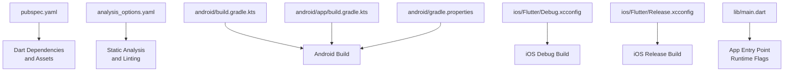
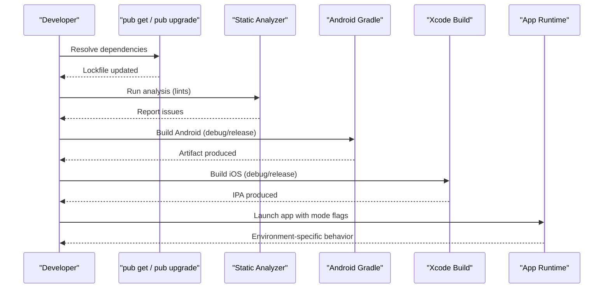
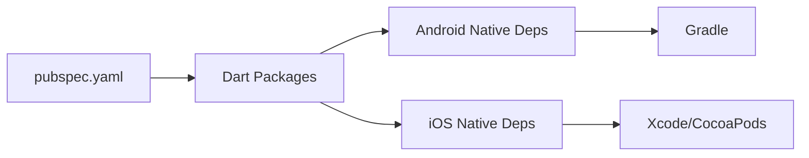

# Build Configuration

<cite>
**Referenced Files in This Document**
- [pubspec.yaml](file://pubspec.yaml)
- [analysis_options.yaml](file://analysis_options.yaml)
- [android/build.gradle.kts](file://android/build.gradle.kts)
- [android/app/build.gradle.kts](file://android/app/build.gradle.kts)
- [android/gradle.properties](file://android/gradle.properties)
- [ios/Flutter/Debug.xcconfig](file://ios/Flutter/Debug.xcconfig)
- [ios/Flutter/Release.xcconfig](file://ios/Flutter/Release.xcconfig)
- [lib/main.dart](file://lib/main.dart)
</cite>

## Table of Contents
1. [Introduction](#introduction)
2. [Project Structure](#project-structure)
3. [Core Components](#core-components)
4. [Architecture Overview](#architecture-overview)
5. [Detailed Component Analysis](#detailed-component-analysis)
6. [Dependency Analysis](#dependency-analysis)
7. [Performance Considerations](#performance-considerations)
8. [Troubleshooting Guide](#troubleshooting-guide)
9. [Conclusion](#conclusion)
10. [Appendices](#appendices)

## Introduction
This document explains the build configuration for the ASSINATURAS NINJA Flutter application. It covers dependency management and versioning, asset organization, Flutter build flags, environment-specific configurations, optimization settings, analysis options and linting rules, caching strategies, dependency resolution, performance tuning, multi-environment setup, feature flags, and conditional compilation techniques. The goal is to provide a clear, actionable guide for developers and CI systems to build, test, and ship the app consistently across platforms.

## Project Structure
The project follows standard Flutter conventions with platform-specific build files under android/ and ios/, Dart source code under lib/, assets at the repository root, and analysis options at the root level. Key build-related files include:
- pubspec.yaml: Declares dependencies, assets, and Flutter configuration.
- analysis_options.yaml: Configures static analysis and linting.
- android/build.gradle.kts and android/app/build.gradle.kts: Gradle build scripts for Android.
- android/gradle.properties: Gradle daemon and JVM settings.
- ios/Flutter/Debug.xcconfig and Release.xcconfig: Xcode build configurations for iOS.
- lib/main.dart: Application entry point where runtime flags can be applied.

**Diagram sources**
- [pubspec.yaml](file://pubspec.yaml)
- [analysis_options.yaml](file://analysis_options.yaml)
- [android/build.gradle.kts](file://android/build.gradle.kts)
- [android/app/build.gradle.kts](file://android/app/build.gradle.kts)
- [android/gradle.properties](file://android/gradle.properties)
- [ios/Flutter/Debug.xcconfig](file://ios/Flutter/Debug.xcconfig)
- [ios/Flutter/Release.xcconfig](file://ios/Flutter/Release.xcconfig)
- [lib/main.dart](file://lib/main.dart)

**Section sources**
- [pubspec.yaml](file://pubspec.yaml)
- [analysis_options.yaml](file://analysis_options.yaml)
- [android/build.gradle.kts](file://android/build.gradle.kts)
- [android/app/build.gradle.kts](file://android/app/build.gradle.kts)
- [android/gradle.properties](file://android/gradle.properties)
- [ios/Flutter/Debug.xcconfig](file://ios/Flutter/Debug.xcconfig)
- [ios/Flutter/Release.xcconfig](file://ios/Flutter/Release.xcconfig)
- [lib/main.dart](file://lib/main.dart)

## Core Components
- Dependency Management and Versioning (pubspec.yaml): Centralizes third-party packages, plugin versions, and Flutter SDK constraints. Use caret or exact versions depending on stability needs. Keep Flutter SDK upper bound conservative to avoid breaking changes.
- Asset Organization (pubspec.yaml): Declare assets explicitly to ensure inclusion in builds and enable tree-shaking of unused resources. Organize assets by domain (e.g., branding) for clarity.
- Static Analysis and Linting (analysis_options.yaml): Configure analyzer rules, lints, and severity levels to enforce code quality and consistency across the team.
- Android Build Scripts (Gradle): Define compileSdk, targetSdk, minSdk, signing configs, and build variants. Tune Gradle properties for faster builds.
- iOS Build Configurations (xcconfig): Separate debug and release settings for preprocessor definitions, optimization flags, and bundle identifiers.
- App Entry Point (lib/main.dart): Apply runtime flags and environment-specific behavior based on build mode or injected constants.

**Section sources**
- [pubspec.yaml](file://pubspec.yaml)
- [analysis_options.yaml](file://analysis_options.yaml)
- [android/build.gradle.kts](file://android/build.gradle.kts)
- [android/app/build.gradle.kts](file://android/app/build.gradle.kts)
- [android/gradle.properties](file://android/gradle.properties)
- [ios/Flutter/Debug.xcconfig](file://ios/Flutter/Debug.xcconfig)
- [ios/Flutter/Release.xcconfig](file://ios/Flutter/Release.xcconfig)
- [lib/main.dart](file://lib/main.dart)

## Architecture Overview
Build-time and run-time configuration layers interact as follows:
- pubspec.yaml drives Dart package resolution and asset bundling.
- analysis_options.yaml influences static analysis during development and CI.
- Android Gradle builds produce APK/AAB artifacts with variant-specific optimizations.
- iOS xcconfig files control compiler/linker flags per build mode.
- lib/main.dart applies runtime decisions based on build mode or injected constants.

[No sources needed since this diagram shows conceptual workflow, not actual code structure]

## Detailed Component Analysis

### pubspec.yaml: Dependencies, Versioning, and Assets
- Dependencies:
  - Pin critical packages to stable versions; prefer semantic version ranges that balance safety and updates.
  - Group dependencies by purpose (UI, networking, state management, testing).
- Flutter SDK Constraints:
  - Set a minimum supported Flutter version and an upper bound to prevent unexpected breakage.
- Assets:
  - List all assets explicitly to avoid missing resources at runtime.
  - Organize assets into directories (e.g., branding) and reference them with relative paths.
- Versioning Strategy:
  - Use semantic versioning for internal releases.
  - Maintain a changelog and tag commits for reproducible builds.

Best practices:
- Avoid wildcard versions for production-critical packages.
- Regularly run pub outdated and review security advisories.
- Keep lockfile committed to ensure deterministic builds.

**Section sources**
- [pubspec.yaml](file://pubspec.yaml)

### analysis_options.yaml: Linting and Code Quality
- Rules:
  - Enable recommended lints and customize severity for your team’s standards.
  - Add project-specific rules for architecture, naming, and error handling.
- Exclusions:
  - Exclude generated files and third-party code from analysis.
- Integration:
  - Run analysis in CI to block merges on violations.

Tips:
- Start with strong defaults and relax only when justified.
- Use consistent formatting via dart format and integrate it into editor and CI.

**Section sources**
- [analysis_options.yaml](file://analysis_options.yaml)

### Android Build Configuration (Gradle)
- android/build.gradle.kts:
  - Define global Gradle settings and plugin versions.
  - Configure repositories and shared properties.
- android/app/build.gradle.kts:
  - Specify compileSdk, targetSdk, minSdk.
  - Configure applicationId, versionCode, versionName.
  - Define buildTypes (debug, release) and signingConfigs for release artifacts.
  - Manage resource processing and manifest placeholders if needed.
- android/gradle.properties:
  - Tune Gradle daemon memory, parallelism, and Kotlin/JVM settings.
  - Enable incremental compilation and configure caching.

Optimization tips:
- Increase Gradle heap size for large projects.
- Use --parallel and --configure-on-demand where applicable.
- Sign release builds securely using keystore references.

**Section sources**
- [android/build.gradle.kts](file://android/build.gradle.kts)
- [android/app/build.gradle.kts](file://android/app/build.gradle.kts)
- [android/gradle.properties](file://android/gradle.properties)

### iOS Build Configuration (xcconfig)
- ios/Flutter/Debug.xcconfig:
  - Debug-specific compiler flags, symbols, and logging verbosity.
- ios/Flutter/Release.xcconfig:
  - Optimization flags, dead code stripping, and symbol hiding.
- General:
  - Ensure correct deployment target and architectures.
  - Manage entitlements and Info.plist variables via xcconfig.

Security and performance:
- Disable verbose logging in release.
- Enable link-time optimization and strip symbols.

**Section sources**
- [ios/Flutter/Debug.xcconfig](file://ios/Flutter/Debug.xcconfig)
- [ios/Flutter/Release.xcconfig](file://ios/Flutter/Release.xcconfig)

### App Entry Point and Runtime Flags (lib/main.dart)
- Apply environment-specific behavior based on build mode or injected constants.
- Use conditional imports or build-time constants to toggle features.
- Initialize services differently for debug vs. release (e.g., logging, analytics endpoints).

Example patterns:
- Check build mode to enable detailed logs or mock backends.
- Inject base URLs or API keys via environment variables resolved at build time.

**Section sources**
- [lib/main.dart](file://lib/main.dart)

## Dependency Analysis
- Dart dependencies are resolved by pub and locked in pubspec.lock.
- Platform-specific native dependencies are managed by their respective build systems (Gradle for Android, CocoaPods/Xcode for iOS).
- Circular dependencies should be avoided; use providers/services to decouple modules.

**Diagram sources**
- [pubspec.yaml](file://pubspec.yaml)
- [android/build.gradle.kts](file://android/build.gradle.kts)
- [android/app/build.gradle.kts](file://android/app/build.gradle.kts)
- [ios/Flutter/Debug.xcconfig](file://ios/Flutter/Debug.xcconfig)
- [ios/Flutter/Release.xcconfig](file://ios/Flutter/Release.xcconfig)

**Section sources**
- [pubspec.yaml](file://pubspec.yaml)
- [android/build.gradle.kts](file://android/build.gradle.kts)
- [android/app/build.gradle.kts](file://android/app/build.gradle.kts)
- [ios/Flutter/Debug.xcconfig](file://ios/Flutter/Debug.xcconfig)
- [ios/Flutter/Release.xcconfig](file://ios/Flutter/Release.xcconfig)

## Performance Considerations
- Faster pub operations:
  - Use pub cache effectively; keep a clean cache only when necessary.
  - Prefer exact versions for critical packages to reduce resolution time.
- Faster Flutter builds:
  - Use --dart-define for injecting configuration without recompiling Dart code.
  - Leverage build modes: debug for fast iteration, profile for performance analysis, release for optimized artifacts.
- Android:
  - Enable R8/ProGuard shrinking and obfuscation in release.
  - Configure Gradle properties for parallel execution and increased heap.
- iOS:
  - Enable link-time optimization and strip symbols in release.
  - Use appropriate deployment targets to reduce binary size.
- Asset optimization:
  - Compress images and remove unused assets.
  - Use vector formats where possible.

[No sources needed since this section provides general guidance]

## Troubleshooting Guide
- Dependency conflicts:
  - Run pub deps to inspect the dependency graph.
  - Use pub upgrade --major-versions cautiously and review breaking changes.
- Build failures:
  - Clear caches: flutter clean, then rebuild.
  - For Android, invalidate Gradle caches and re-sync.
  - For iOS, clean DerivedData and rebuild.
- Linting errors:
  - Address analyzer warnings and errors before merging.
  - Adjust analysis_options.yaml only with justification.
- Environment misconfiguration:
  - Verify --dart-define values and platform-specific config files.
  - Ensure secrets are not hardcoded; use secure injection mechanisms.

**Section sources**
- [analysis_options.yaml](file://analysis_options.yaml)
- [android/gradle.properties](file://android/gradle.properties)
- [ios/Flutter/Debug.xcconfig](file://ios/Flutter/Debug.xcconfig)
- [ios/Flutter/Release.xcconfig](file://ios/Flutter/Release.xcconfig)

## Conclusion
A robust build configuration balances reproducibility, speed, and quality. By centralizing dependencies and assets in pubspec.yaml, enforcing code quality with analysis_options.yaml, and tailoring platform builds through Gradle and xcconfig, the ASSINATURAS NINJA app can be built efficiently across environments. Adopting caching strategies, careful versioning, and environment-specific configurations ensures reliable CI pipelines and high-performance releases.

[No sources needed since this section summarizes without analyzing specific files]

## Appendices

### Build Commands and Flags
- Development:
  - flutter pub get
  - flutter analyze
  - flutter run (debug)
- Profiling:
  - flutter run --profile
- Release:
  - flutter build apk --release
  - flutter build appbundle --release
  - flutter build ios --release
- Injecting configuration:
  - flutter run --dart-define=ENVIRONMENT=staging
  - flutter build ... --dart-define=API_BASE_URL=https://api.staging.example.com

[No sources needed since this section provides general guidance]

### Multi-Environment Setup and Feature Flags
- Use --dart-define to inject environment variables at build time.
- Read constants in Dart code to branch logic (e.g., API endpoints, feature toggles).
- Maintain separate xcconfig and Gradle build types for each environment.
- Consider feature flags controlled by build-time constants for conditional compilation.

[No sources needed since this section provides general guidance]