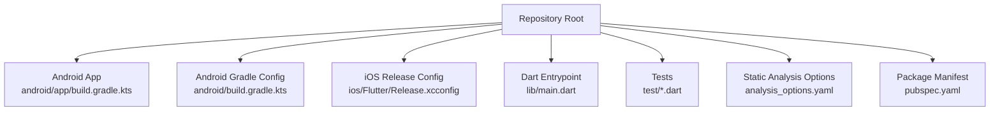
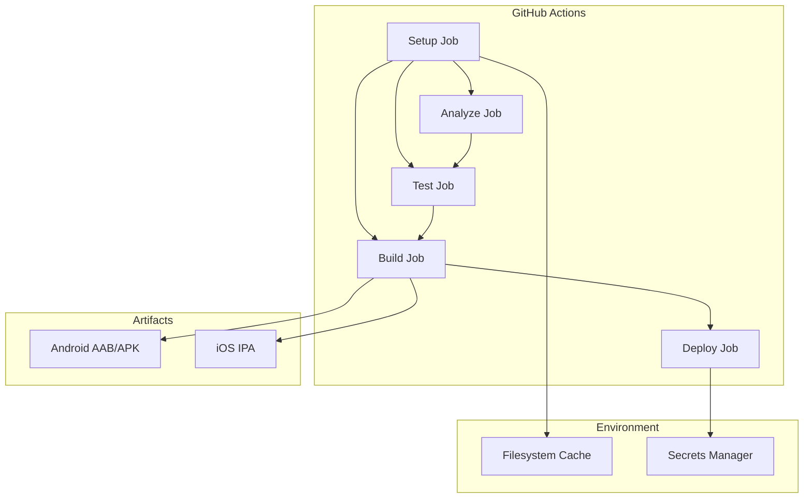
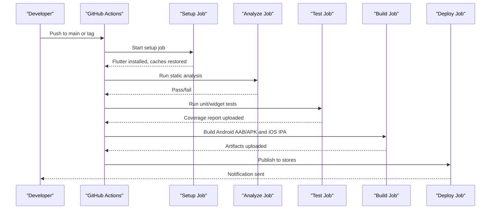
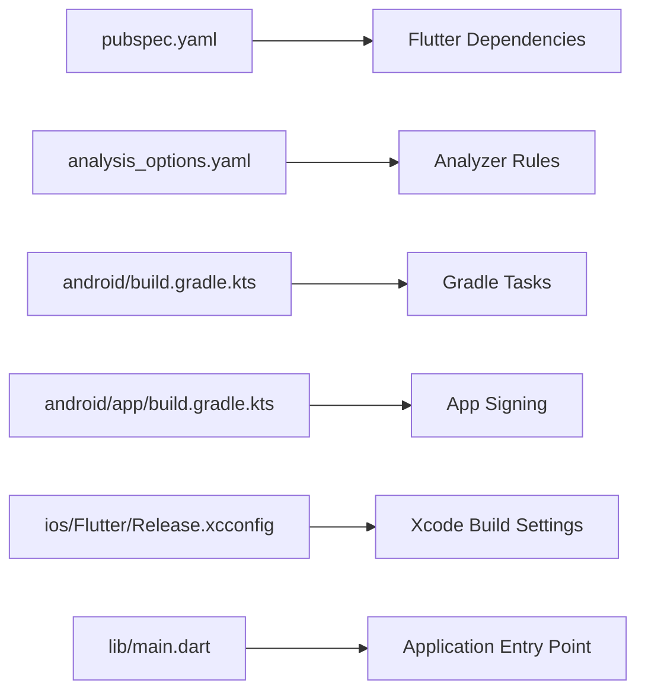

# CI/CD Pipeline

<cite>
**Referenced Files in This Document**
- [pubspec.yaml](file://pubspec.yaml)
- [analysis_options.yaml](file://analysis_options.yaml)
- [android/build.gradle.kts](file://android/build.gradle.kts)
- [android/app/build.gradle.kts](file://android/app/build.gradle.kts)
- [android/gradle.properties](file://android/gradle.properties)
- [ios/Flutter/Release.xcconfig](file://ios/Flutter/Release.xcconfig)
- [lib/main.dart](file://lib/main.dart)
- [test/onboarding_screen_test.dart](file://test/onboarding_screen_test.dart)
- [test/settings_provider_test.dart](file://test/settings_provider_test.dart)
- [test/subscription_model_test.dart](file://test/subscription_model_test.dart)
- [test/subscription_provider_test.dart](file://test/subscription_provider_test.dart)
- [test/widgets_test.dart](file://test/widgets_test.dart)
</cite>

## Table of Contents
1. [Introduction](#introduction)
2. [Project Structure](#project-structure)
3. [Core Components](#core-components)
4. [Architecture Overview](#architecture-overview)
5. [Detailed Component Analysis](#detailed-component-analysis)
6. [Dependency Analysis](#dependency-analysis)
7. [Performance Considerations](#performance-considerations)
8. [Troubleshooting Guide](#troubleshooting-guide)
9. [Conclusion](#conclusion)
10. [Appendices](#appendices)

## Introduction
This document defines the end-to-end CI/CD pipeline for automated building, testing, and deployment of the ASSINATURAS NINJA Flutter application across Android and iOS. It covers:
- GitHub Actions workflows for multi-platform builds
- Automated unit and widget tests
- Static analysis and code quality checks
- Artifact generation (APK/AAB/IPA)
- Versioning strategies and changelog automation
- Deployment to app stores with secure secrets management
- Cache optimization and parallel execution
- Troubleshooting guidance and best practices

The goal is to provide a repeatable, secure, and fast pipeline that ensures high-quality releases for both Android and iOS.

## Project Structure
The repository is a standard Flutter project with platform-specific directories for Android and iOS, shared Dart code under lib, and tests under test. The following diagram shows the key areas relevant to CI/CD:

**Diagram sources**
- [android/app/build.gradle.kts](file://android/app/build.gradle.kts)
- [android/build.gradle.kts](file://android/build.gradle.kts)
- [ios/Flutter/Release.xcconfig](file://ios/Flutter/Release.xcconfig)
- [lib/main.dart](file://lib/main.dart)
- [analysis_options.yaml](file://analysis_options.yaml)
- [pubspec.yaml](file://pubspec.yaml)

**Section sources**
- [pubspec.yaml](file://pubspec.yaml)
- [analysis_options.yaml](file://analysis_options.yaml)
- [android/build.gradle.kts](file://android/build.gradle.kts)
- [android/app/build.gradle.kts](file://android/app/build.gradle.kts)
- [ios/Flutter/Release.xcconfig](file://ios/Flutter/Release.xcconfig)
- [lib/main.dart](file://lib/main.dart)

## Core Components
This section outlines the essential elements required by the CI/CD pipeline:

- Flutter SDK and toolchain setup
  - Install Flutter SDK and cache dependencies
  - Run static analysis and tests before builds
- Android build
  - Build debug APK and release AAB/APK
  - Configure signing via environment variables or secret files
- iOS build
  - Build IPA using Xcode archive
  - Manage provisioning profiles and signing certificates securely
- Testing
  - Execute unit and widget tests on Linux runners
  - Optional integration tests on emulators/simulators
- Artifacts
  - Upload generated artifacts for inspection
  - Publish to app stores via official tools or third-party providers
- Secrets and environment variables
  - Store sensitive data in repository settings
  - Use encrypted files for keystore/provisioning profiles

Key configuration points:
- Package manifest and dependencies are defined in the package manifest file.
- Static analysis rules are configured in the analysis options file.
- Android build scripts define compile options and signing configurations.
- iOS release configuration includes build settings for distribution.

**Section sources**
- [pubspec.yaml](file://pubspec.yaml)
- [analysis_options.yaml](file://analysis_options.yaml)
- [android/build.gradle.kts](file://android/build.gradle.kts)
- [android/app/build.gradle.kts](file://android/app/build.gradle.kts)
- [ios/Flutter/Release.xcconfig](file://ios/Flutter/Release.xcconfig)

## Architecture Overview
The CI/CD architecture consists of multiple jobs orchestrated by GitHub Actions:
- Setup job installs Flutter, caches dependencies, and validates environment
- Analyze job runs static analysis and formatting checks
- Test job executes unit/widget tests in parallel
- Build job compiles Android and iOS artifacts
- Deploy job publishes artifacts and triggers store uploads

[No sources needed since this diagram shows conceptual workflow, not actual code structure]

## Detailed Component Analysis

### Workflow Orchestration
- Jobs and stages
  - Setup: install Flutter, configure Java, restore caches
  - Analyze: run analyzer and formatter checks
  - Test: execute tests in parallel across platforms
  - Build: generate Android AAB/APK and iOS IPA
  - Deploy: upload artifacts and publish to stores
- Triggers
  - Push to main branch triggers full pipeline
  - Pull requests trigger analyze and test only
  - Tags trigger versioned builds and deployments
- Parallelism
  - Split tests into groups for faster execution
  - Build Android and iOS in separate jobs

[No sources needed since this section provides general guidance]

### Static Analysis and Code Quality
- Analyzer configuration
  - Rules and severity levels are defined in the analysis options file
- Checks performed
  - Linting, unused imports, dead code detection
  - Custom rules if configured
- Integration
  - Fail the pipeline on warnings/errors as per policy
  - Generate reports for PR comments

**Section sources**
- [analysis_options.yaml](file://analysis_options.yaml)

### Testing Strategy
- Unit and widget tests
  - Located under the test directory
  - Executed on Linux runners without UI rendering overhead
- Test coverage
  - Collect coverage metrics and upload artifacts
- Flaky tests
  - Retry failed tests once; quarantine persistent flaky tests

**Section sources**
- [test/onboarding_screen_test.dart](file://test/onboarding_screen_test.dart)
- [test/settings_provider_test.dart](file://test/settings_provider_test.dart)
- [test/subscription_model_test.dart](file://test/subscription_model_test.dart)
- [test/subscription_provider_test.dart](file://test/subscription_provider_test.dart)
- [test/widgets_test.dart](file://test/widgets_test.dart)

### Android Build Pipeline
- Steps
  - Set up Java and Android SDK
  - Restore Gradle and Flutter caches
  - Build debug APK for quick validation
  - Build release AAB/APK with signing
- Signing
  - Keystore and passwords provided via secrets
  - Optionally use encrypted keystore file stored in repository settings
- Outputs
  - Upload APK/AAB as artifacts
  - Prepare for Play Store upload

**Section sources**
- [android/build.gradle.kts](file://android/build.gradle.kts)
- [android/app/build.gradle.kts](file://android/app/build.gradle.kts)
- [android/gradle.properties](file://android/gradle.properties)

### iOS Build Pipeline
- Steps
  - Set up macOS runner with Xcode
  - Restore CocoaPods and Flutter caches
  - Archive and export IPA
- Signing
  - Provisioning profiles and certificates managed via secrets
  - Keychain setup for code signing
- Outputs
  - Upload IPA as artifact
  - Prepare for App Store Connect upload

**Section sources**
- [ios/Flutter/Release.xcconfig](file://ios/Flutter/Release.xcconfig)

### Versioning and Changelog Automation
- Strategies
  - Semantic versioning based on Git tags
  - Increment minor/major versions automatically on merge to main
- Changelog
  - Generate changelog from commit messages and PR titles
  - Attach changelog to release notes
- Environment variables
  - VERSION, BUILD_NUMBER, CHANNEL used across jobs

[No sources needed since this section provides general guidance]

### Deployment Automation
- Android
  - Upload AAB to Google Play via Fastlane or Play Console API
  - Promote to internal/testing/tracks based on branch/tag
- iOS
  - Upload IPA to App Store Connect via Fastlane or xcrun altool
  - Distribute to TestFlight or production
- Notifications
  - Post status updates to Slack or email

[No sources needed since this section provides general guidance]

### Secrets and Environment Management
- Repository secrets
  - Keystore, passwords, provisioning profiles, API tokens
- Encrypted files
  - Store large binary assets like keystores securely
- Best practices
  - Rotate secrets regularly
  - Limit access to secrets at organization level
  - Avoid logging sensitive values

[No sources needed since this section provides general guidance]

### Cache Management and Parallel Execution
- Caches
  - Flutter pub cache, Gradle cache, CocoaPods cache
  - Path-based caching for OS-specific locations
- Parallelization
  - Group tests by feature or module
  - Run analyzer and tests concurrently where safe
- Optimization tips
  - Pin Flutter and SDK versions
  - Use prebuilt images when possible

[No sources needed since this section provides general guidance]

### End-to-End Flow
The following sequence illustrates a typical push-triggered pipeline:

[No sources needed since this diagram shows conceptual workflow, not actual code structure]

## Dependency Analysis
The CI/CD pipeline depends on several project-level configurations and manifests:

**Diagram sources**
- [pubspec.yaml](file://pubspec.yaml)
- [analysis_options.yaml](file://analysis_options.yaml)
- [android/build.gradle.kts](file://android/build.gradle.kts)
- [android/app/build.gradle.kts](file://android/app/build.gradle.kts)
- [ios/Flutter/Release.xcconfig](file://ios/Flutter/Release.xcconfig)
- [lib/main.dart](file://lib/main.dart)

**Section sources**
- [pubspec.yaml](file://pubspec.yaml)
- [analysis_options.yaml](file://analysis_options.yaml)
- [android/build.gradle.kts](file://android/build.gradle.kts)
- [android/app/build.gradle.kts](file://android/app/build.gradle.kts)
- [ios/Flutter/Release.xcconfig](file://ios/Flutter/Release.xcconfig)
- [lib/main.dart](file://lib/main.dart)

## Performance Considerations
- Cache aggressively
  - Flutter pub cache, Gradle wrapper, CocoaPods
- Parallelize safely
  - Separate jobs for analyze, test, build
  - Split tests into shards
- Minimize I/O
  - Use compact logs and avoid unnecessary downloads
- Reuse environments
  - Prefer prebuilt Docker images or GitHub-hosted runners with cached state
- Optimize signing
  - Pre-import certificates and profiles to reduce setup time

[No sources needed since this section provides general guidance]

## Troubleshooting Guide
Common issues and resolutions:
- Flutter installation failures
  - Verify network access and mirror URLs
  - Check runner image compatibility
- Gradle build errors
  - Ensure correct Java version and Android SDK paths
  - Validate signing configuration and keystore permissions
- iOS signing problems
  - Confirm provisioning profile matches bundle ID
  - Ensure keychain unlock and certificate trust
- Test timeouts
  - Increase timeout limits for slow tests
  - Isolate flaky tests and add retries
- Secret access denied
  - Review repository/org-level secret scopes
  - Ensure encrypted files are decrypted correctly

[No sources needed since this section provides general guidance]

## Conclusion
This CI/CD pipeline provides a robust foundation for building, testing, and deploying the ASSINATURAS NINJA application across Android and iOS. By leveraging caching, parallel execution, and secure secrets management, teams can achieve fast feedback loops and reliable releases. Adopting semantic versioning and automated changelogs further streamlines release management and improves transparency.

[No sources needed since this section summarizes without analyzing specific files]

## Appendices

### Environment Variables and Secrets Reference
- Flutter and SDK
  - FLUTTER_VERSION, JAVA_VERSION, ANDROID_SDK_VERSION
- Android
  - KEYSTORE_FILE, KEYSTORE_PASSWORD, KEY_ALIAS, KEY_PASSWORD
- iOS
  - PROVISIONING_PROFILE, CERTIFICATE_P12, CODE_SIGN_IDENTITY
- General
  - VERSION, BUILD_NUMBER, CHANNEL, DEPLOY_TARGET

[No sources needed since this section provides general guidance]

### Artifact Inventory
- Android
  - app-release.aab, app-debug.apk
- iOS
  - Runner.ipa
- Reports
  - Test coverage JSON, analyzer reports

[No sources needed since this section provides general guidance]