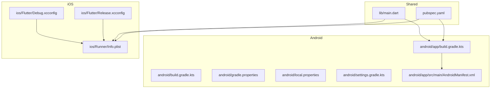
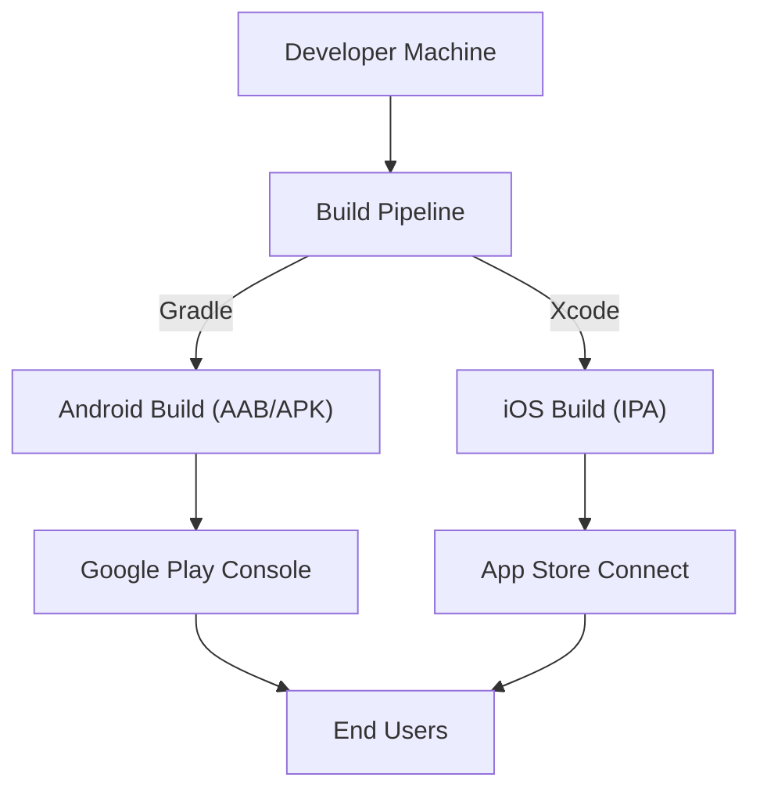
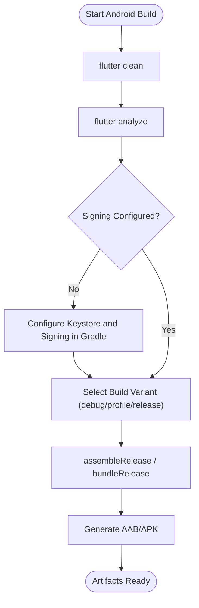
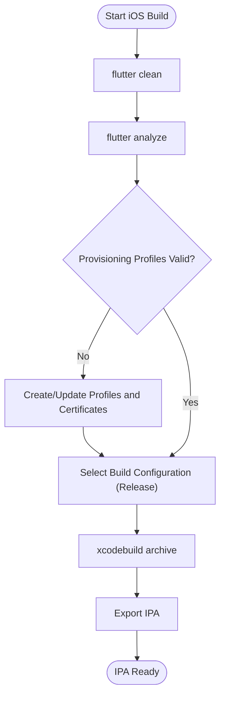
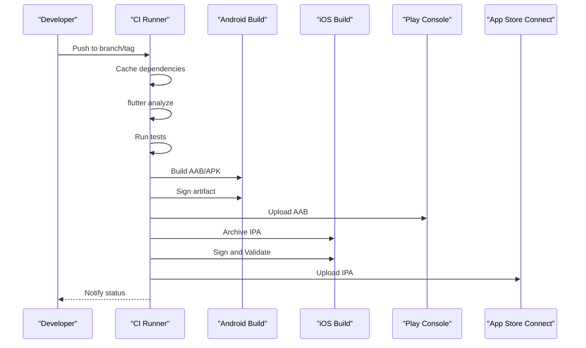
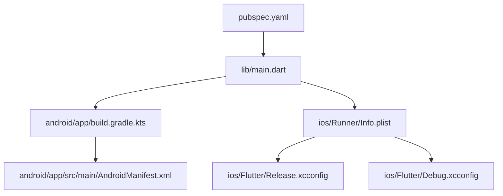

# Deployment & Distribution

<cite>
**Referenced Files in This Document**
- [pubspec.yaml](file://pubspec.yaml)
- [README.md](file://README.md)
- [android/app/build.gradle.kts](file://android/app/build.gradle.kts)
- [android/build.gradle.kts](file://android/build.gradle.kts)
- [android/gradle.properties](file://android/gradle.properties)
- [android/local.properties](file://android/local.properties)
- [android/settings.gradle.kts](file://android/settings.gradle.kts)
- [android/app/src/main/AndroidManifest.xml](file://android/app/src/main/AndroidManifest.xml)
- [ios/Runner/Info.plist](file://ios/Runner/Info.plist)
- [ios/Flutter/Release.xcconfig](file://ios/Flutter/Release.xcconfig)
- [ios/Flutter/Debug.xcconfig](file://ios/Flutter/Debug.xcconfig)
- [lib/main.dart](file://lib/main.dart)
</cite>

## Table of Contents
1. [Introduction](#introduction)
2. [Project Structure](#project-structure)
3. [Core Components](#core-components)
4. [Architecture Overview](#architecture-overview)
5. [Detailed Component Analysis](#detailed-component-analysis)
6. [Dependency Analysis](#dependency-analysis)
7. [Performance Considerations](#performance-considerations)
8. [Troubleshooting Guide](#troubleshooting-guide)
9. [Conclusion](#conclusion)
10. [Appendices](#appendices)

## Introduction
This document provides comprehensive deployment and distribution guidance for the ASSINATURAS NINJA Flutter application across Android and iOS. It covers environment setup, build configurations, signing, release builds, App Store submission procedures, Google Play publishing, CI/CD pipeline setup, automated testing integration, update distribution, and post-release monitoring. The content is tailored to the repository structure and configuration files present in this project.

## Project Structure
The project follows a standard Flutter layout with platform-specific directories for Android and iOS, shared Dart code under lib, tests under test, and documentation under docs. Key build and configuration files are located at:
- Android: android/app/build.gradle.kts, android/build.gradle.kts, android/gradle.properties, android/local.properties, android/settings.gradle.kts, android/app/src/main/AndroidManifest.xml
- iOS: ios/Runner/Info.plist, ios/Flutter/Release.xcconfig, ios/Flutter/Debug.xcconfig
- Shared: pubspec.yaml, lib/main.dart

**Diagram sources**
- [pubspec.yaml](file://pubspec.yaml)
- [lib/main.dart](file://lib/main.dart)
- [android/app/build.gradle.kts](file://android/app/build.gradle.kts)
- [android/build.gradle.kts](file://android/build.gradle.kts)
- [android/gradle.properties](file://android/gradle.properties)
- [android/local.properties](file://android/local.properties)
- [android/settings.gradle.kts](file://android/settings.gradle.kts)
- [android/app/src/main/AndroidManifest.xml](file://android/app/src/main/AndroidManifest.xml)
- [ios/Runner/Info.plist](file://ios/Runner/Info.plist)
- [ios/Flutter/Release.xcconfig](file://ios/Flutter/Release.xcconfig)
- [ios/Flutter/Debug.xcconfig](file://ios/Flutter/Debug.xcconfig)

**Section sources**
- [pubspec.yaml](file://pubspec.yaml)
- [README.md](file://README.md)

## Core Components
This section outlines the core components relevant to building and distributing the app on both platforms.

- Application entry point
  - The main entry point is defined in the shared Dart code. Ensure it initializes services and providers required by the app before running the UI.
  - Reference path: [lib/main.dart](file://lib/main.dart)

- Package and dependency management
  - Dependencies, assets, and version metadata are declared in the package manifest.
  - Reference path: [pubspec.yaml](file://pubspec.yaml)

- Android build configuration
  - App-level Gradle script defines compile options, dependencies, and signing settings.
  - Reference path: [android/app/build.gradle.kts](file://android/app/build.gradle.kts)
  - Project-level Gradle script manages repositories and plugin versions.
  - Reference path: [android/build.gradle.kts](file://android/build.gradle.kts)
  - Gradle properties define JVM and toolchain settings.
  - Reference path: [android/gradle.properties](file://android/gradle.properties)
  - Local SDK paths are configured here.
  - Reference path: [android/local.properties](file://android/local.properties)
  - Settings file includes the Flutter module and plugins.
  - Reference path: [android/settings.gradle.kts](file://android/settings.gradle.kts)
  - Android manifest declares permissions and app metadata.
  - Reference path: [android/app/src/main/AndroidManifest.xml](file://android/app/src/main/AndroidManifest.xml)

- iOS build configuration
  - Info.plist contains bundle identifiers, display name, and other runtime keys.
  - Reference path: [ios/Runner/Info.plist](file://ios/Runner/Info.plist)
  - Release and Debug xcconfig files control build settings for each configuration.
  - Reference path: [ios/Flutter/Release.xcconfig](file://ios/Flutter/Release.xcconfig)
  - Reference path: [ios/Flutter/Debug.xcconfig](file://ios/Flutter/Debug.xcconfig)

**Section sources**
- [lib/main.dart](file://lib/main.dart)
- [pubspec.yaml](file://pubspec.yaml)
- [android/app/build.gradle.kts](file://android/app/build.gradle.kts)
- [android/build.gradle.kts](file://android/build.gradle.kts)
- [android/gradle.properties](file://android/gradle.properties)
- [android/local.properties](file://android/local.properties)
- [android/settings.gradle.kts](file://android/settings.gradle.kts)
- [android/app/src/main/AndroidManifest.xml](file://android/app/src/main/AndroidManifest.xml)
- [ios/Runner/Info.plist](file://ios/Runner/Info.plist)
- [ios/Flutter/Release.xcconfig](file://ios/Flutter/Release.xcconfig)
- [ios/Flutter/Debug.xcconfig](file://ios/Flutter/Debug.xcconfig)

## Architecture Overview
The deployment architecture integrates Flutter’s shared codebase with platform-specific build systems and store submission workflows.

[No sources needed since this diagram shows conceptual workflow, not actual code structure]

## Detailed Component Analysis

### Environment Setup
- Prerequisites
  - Install Flutter SDK and ensure flutter doctor reports no issues.
  - For Android: install Android Studio, set up Android SDK, and configure local.properties if necessary.
  - For iOS: install Xcode, set up command-line tools, and ensure an Apple ID with appropriate roles.
- Verify installations
  - Run flutter doctor and resolve any reported issues before proceeding.

**Section sources**
- [android/local.properties](file://android/local.properties)
- [README.md](file://README.md)

### Android Build Process
- Clean and analyze
  - Use flutter clean and flutter analyze to ensure a clean state and catch issues early.
- Build variants
  - Debug and profile builds are supported via Flutter; release builds produce optimized artifacts.
- Signing configuration
  - Configure signing in the app-level Gradle script and provide keystore details securely.
  - Reference path: [android/app/build.gradle.kts](file://android/app/build.gradle.kts)
- Output artifacts
  - Generate AAB for Google Play or APK for internal testing.
- Manifest and permissions
  - Review and adjust permissions and metadata in the manifest as needed.
  - Reference path: [android/app/src/main/AndroidManifest.xml](file://android/app/src/main/AndroidManifest.xml)

**Diagram sources**
- [android/app/build.gradle.kts](file://android/app/build.gradle.kts)
- [android/app/src/main/AndroidManifest.xml](file://android/app/src/main/AndroidManifest.xml)

**Section sources**
- [android/app/build.gradle.kts](file://android/app/build.gradle.kts)
- [android/build.gradle.kts](file://android/build.gradle.kts)
- [android/gradle.properties](file://android/gradle.properties)
- [android/local.properties](file://android/local.properties)
- [android/settings.gradle.kts](file://android/settings.gradle.kts)
- [android/app/src/main/AndroidManifest.xml](file://android/app/src/main/AndroidManifest.xml)

### iOS Build Process
- Clean and analyze
  - Use flutter clean and flutter analyze to ensure a clean state and catch issues early.
- Signing and provisioning
  - Configure signing in Xcode workspace and ensure valid provisioning profiles and certificates.
  - Update Info.plist with correct bundle identifier and display name.
  - Reference path: [ios/Runner/Info.plist](file://ios/Runner/Info.plist)
- Build configurations
  - Use Release.xcconfig for production builds and Debug.xcconfig for development.
  - Reference path: [ios/Flutter/Release.xcconfig](file://ios/Flutter/Release.xcconfig)
  - Reference path: [ios/Flutter/Debug.xcconfig](file://ios/Flutter/Debug.xcconfig)
- Output artifacts
  - Archive and export IPA for TestFlight or App Store submission.

**Diagram sources**
- [ios/Runner/Info.plist](file://ios/Runner/Info.plist)
- [ios/Flutter/Release.xcconfig](file://ios/Flutter/Release.xcconfig)
- [ios/Flutter/Debug.xcconfig](file://ios/Flutter/Debug.xcconfig)

**Section sources**
- [ios/Runner/Info.plist](file://ios/Runner/Info.plist)
- [ios/Flutter/Release.xcconfig](file://ios/Flutter/Release.xcconfig)
- [ios/Flutter/Debug.xcconfig](file://ios/Flutter/Debug.xcconfig)

### App Store Submission (iOS)
- Prepare metadata
  - Ensure bundle identifier, display name, and privacy manifests are correctly set in Info.plist.
  - Reference path: [ios/Runner/Info.plist](file://ios/Runner/Info.plist)
- Certificates and provisioning
  - Create App Store Distribution certificate and provisioning profile in Apple Developer portal.
  - Configure signing in Xcode workspace and verify with flutter build ios --release.
- Build and archive
  - Use Xcode Organizer to archive and validate the app.
- Upload and submit
  - Submit the archived build to App Store Connect and complete the review process.

**Section sources**
- [ios/Runner/Info.plist](file://ios/Runner/Info.plist)
- [ios/Flutter/Release.xcconfig](file://ios/Flutter/Release.xcconfig)

### Google Play Store Publishing (Android)
- Prepare metadata
  - Review and finalize app metadata and permissions in AndroidManifest.xml.
  - Reference path: [android/app/src/main/AndroidManifest.xml](file://android/app/src/main/AndroidManifest.xml)
- App signing
  - Configure signing in the app-level Gradle script and use a secure keystore.
  - Reference path: [android/app/build.gradle.kts](file://android/app/build.gradle.kts)
- Build artifact
  - Generate AAB using assembleRelease or bundleRelease.
- Upload and publish
  - Upload the AAB to Google Play Console, complete store listing, and manage rollout.

**Section sources**
- [android/app/src/main/AndroidManifest.xml](file://android/app/src/main/AndroidManifest.xml)
- [android/app/build.gradle.kts](file://android/app/build.gradle.kts)

### CI/CD Pipeline Setup
- Recommended stages
  - Checkout code, cache dependencies, run static analysis, execute unit/widget/integration tests, build artifacts, sign releases, upload to stores or distribute internally.
- Secrets management
  - Store signing keys, API tokens, and credentials in CI secret stores.
- Artifact retention
  - Keep build outputs for debugging and rollback purposes.
- Example flows
  - Android: flutter build apk/bundle, sign with keystore, upload to Play Console.
  - iOS: flutter build ios, xcodebuild archive, upload to App Store Connect.

[No sources needed since this diagram shows conceptual workflow, not actual code structure]

### Automated Testing Integration
- Unit tests
  - Execute existing tests under test/ directory.
- Widget tests
  - Add widget tests for critical UI components.
- Integration tests
  - Use flutter drive or platform-native integration tests for end-to-end flows.
- Continuous checks
  - Integrate flutter analyze and test runs into CI to prevent regressions.

**Section sources**
- [README.md](file://README.md)

### Post-Release Monitoring and Crash Reporting
- Analytics and crash reporting
  - Integrate analytics and crash reporting libraries in the shared Dart layer.
- Logging strategy
  - Implement structured logging for key user journeys and error states.
- Feedback loops
  - Collect crash reports and user feedback to prioritize fixes and improvements.

[No sources needed since this section provides general guidance]

## Dependency Analysis
This section maps key build-time dependencies and their relationships.

**Diagram sources**
- [pubspec.yaml](file://pubspec.yaml)
- [lib/main.dart](file://lib/main.dart)
- [android/app/build.gradle.kts](file://android/app/build.gradle.kts)
- [android/app/src/main/AndroidManifest.xml](file://android/app/src/main/AndroidManifest.xml)
- [ios/Runner/Info.plist](file://ios/Runner/Info.plist)
- [ios/Flutter/Release.xcconfig](file://ios/Flutter/Release.xcconfig)
- [ios/Flutter/Debug.xcconfig](file://ios/Flutter/Debug.xcconfig)

**Section sources**
- [pubspec.yaml](file://pubspec.yaml)
- [lib/main.dart](file://lib/main.dart)
- [android/app/build.gradle.kts](file://android/app/build.gradle.kts)
- [android/app/src/main/AndroidManifest.xml](file://android/app/src/main/AndroidManifest.xml)
- [ios/Runner/Info.plist](file://ios/Runner/Info.plist)
- [ios/Flutter/Release.xcconfig](file://ios/Flutter/Release.xcconfig)
- [ios/Flutter/Debug.xcconfig](file://ios/Flutter/Debug.xcconfig)

## Performance Considerations
- Enable resource shrinking and minification for release builds on Android.
- Optimize asset sizes and remove unused images/icons.
- Profile memory and CPU usage during development to avoid performance regressions.
- Use split ABI or language resources where applicable to reduce APK size.

[No sources needed since this section provides general guidance]

## Troubleshooting Guide
- Common Android issues
  - Missing or misconfigured keystore: verify signing block in Gradle and keystore paths.
  - SDK mismatches: ensure local.properties points to the correct Android SDK location.
  - Manifest conflicts: check permissions and component declarations in AndroidManifest.xml.
- Common iOS issues
  - Invalid provisioning profiles: regenerate profiles and ensure matching bundle identifiers.
  - Code signing errors: confirm certificates and team selection in Xcode workspace.
  - Info.plist inconsistencies: verify bundle identifier, display name, and required keys.
- General steps
  - Run flutter clean and rebuild.
  - Inspect logs from gradlew and xcodebuild for detailed error messages.
  - Validate with flutter analyze and platform-specific linters.

**Section sources**
- [android/local.properties](file://android/local.properties)
- [android/app/build.gradle.kts](file://android/app/build.gradle.kts)
- [android/app/src/main/AndroidManifest.xml](file://android/app/src/main/AndroidManifest.xml)
- [ios/Runner/Info.plist](file://ios/Runner/Info.plist)
- [ios/Flutter/Release.xcconfig](file://ios/Flutter/Release.xcconfig)
- [ios/Flutter/Debug.xcconfig](file://ios/Flutter/Debug.xcconfig)

## Conclusion
By following the environment setup, build processes, signing configurations, and store submission procedures outlined above, you can reliably produce release artifacts for Android and iOS, automate deployments through CI/CD, and maintain high-quality releases with robust monitoring and troubleshooting practices.

[No sources needed since this section summarizes without analyzing specific files]

## Appendices

### Version Management Strategy
- Increment version codes and names consistently across platforms.
- Align semantic versioning with changelog entries and release notes.
- Automate version bumps in CI based on tags or branches.

[No sources needed since this section provides general guidance]

### Store Listing Optimization
- Android
  - Provide concise descriptions, feature graphics, screenshots, and category tags.
  - Optimize keywords and enable targeted device filters.
- iOS
  - Craft compelling title, subtitle, description, and screenshots.
  - Select appropriate categories and keywords for discoverability.

[No sources needed since this section provides general guidance]