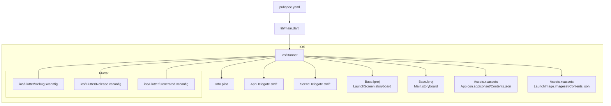
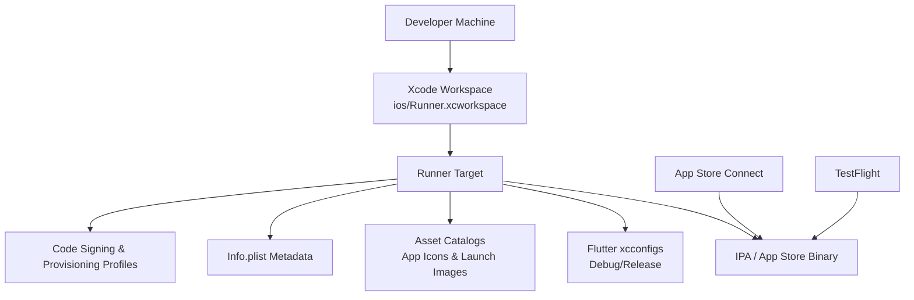
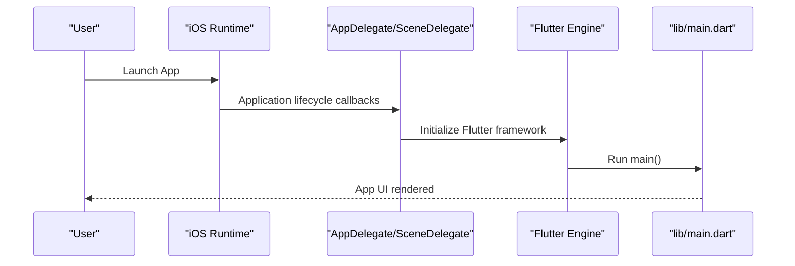
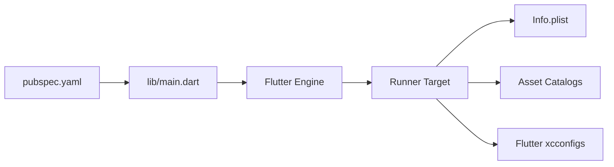

# iOS Deployment

<cite>
**Referenced Files in This Document**
- [ios/Runner/Info.plist](file://ios/Runner/Info.plist)
- [ios/Runner/AppDelegate.swift](file://ios/Runner/AppDelegate.swift)
- [ios/Runner/SceneDelegate.swift](file://ios/Runner/SceneDelegate.swift)
- [ios/Runner/Base.lproj/LaunchScreen.storyboard](file://ios/Runner/Base.lproj/LaunchScreen.storyboard)
- [ios/Runner/Base.lproj/Main.storyboard](file://ios/Runner/Base.lproj/Main.storyboard)
- [ios/Runner/Assets.xcassets/AppIcon.appiconset/Contents.json](file://ios/Runner/Assets.xcassets/AppIcon.appiconset/Contents.json)
- [ios/Runner/Assets.xcassets/LaunchImage.imageset/Contents.json](file://ios/Runner/Assets.xcassets/LaunchImage.imageset/Contents.json)
- [ios/Flutter/Debug.xcconfig](file://ios/Flutter/Debug.xcconfig)
- [ios/Flutter/Release.xcconfig](file://ios/Flutter/Release.xcconfig)
- [ios/Flutter/Generated.xcconfig](file://ios/Flutter/Generated.xcconfig)
- [ios/Runner.xcworkspace/xcshareddata/IDEWorkspaceChecks.plist](file://ios/Runner.xcworkspace/xcshareddata/IDEWorkspaceChecks.plist)
- [pubspec.yaml](file://pubspec.yaml)
- [lib/main.dart](file://lib/main.dart)
</cite>

## Table of Contents
1. [Introduction](#introduction)
2. [Project Structure](#project-structure)
3. [Core Components](#core-components)
4. [Architecture Overview](#architecture-overview)
5. [Detailed Component Analysis](#detailed-component-analysis)
6. [Dependency Analysis](#dependency-analysis)
7. [Performance Considerations](#performance-considerations)
8. [Troubleshooting Guide](#troubleshooting-guide)
9. [Conclusion](#conclusion)
10. [Appendices](#appendices)

## Introduction
This document provides a complete iOS deployment guide for the ASSINATURAS NINJA application, built with Flutter. It covers Xcode workspace configuration, provisioning profiles and code signing, App Store Connect integration, entitlements, TestFlight distribution, beta testing, App Store submission procedures, metadata preparation, screenshots optimization, app review compliance, common deployment challenges, debugging techniques, and performance profiling for production releases.

## Project Structure
The iOS project follows standard Flutter conventions:
- ios/Runner contains the native iOS app target, assets, storyboards, and Info.plist.
- ios/Flutter holds Flutter-generated build configurations and environment scripts.
- ios/Runner.xcworkspace is the Xcode workspace used to open and build the app.
- The Dart entry point is lib/main.dart, which initializes the Flutter engine and app.

**Diagram sources**
- [ios/Runner/Info.plist](file://ios/Runner/Info.plist)
- [ios/Runner/AppDelegate.swift](file://ios/Runner/AppDelegate.swift)
- [ios/Runner/SceneDelegate.swift](file://ios/Runner/SceneDelegate.swift)
- [ios/Runner/Base.lproj/LaunchScreen.storyboard](file://ios/Runner/Base.lproj/LaunchScreen.storyboard)
- [ios/Runner/Base.lproj/Main.storyboard](file://ios/Runner/Base.lproj/Main.storyboard)
- [ios/Runner/Assets.xcassets/AppIcon.appiconset/Contents.json](file://ios/Runner/Assets.xcassets/AppIcon.appiconset/Contents.json)
- [ios/Runner/Assets.xcassets/LaunchImage.imageset/Contents.json](file://ios/Runner/Assets.xcassets/LaunchImage.imageset/Contents.json)
- [ios/Flutter/Debug.xcconfig](file://ios/Flutter/Debug.xcconfig)
- [ios/Flutter/Release.xcconfig](file://ios/Flutter/Release.xcconfig)
- [ios/Flutter/Generated.xcconfig](file://ios/Flutter/Generated.xcconfig)
- [pubspec.yaml](file://pubspec.yaml)
- [lib/main.dart](file://lib/main.dart)

**Section sources**
- [ios/Runner/Info.plist](file://ios/Runner/Info.plist)
- [ios/Runner/AppDelegate.swift](file://ios/Runner/AppDelegate.swift)
- [ios/Runner/SceneDelegate.swift](file://ios/Runner/SceneDelegate.swift)
- [ios/Runner/Base.lproj/LaunchScreen.storyboard](file://ios/Runner/Base.lproj/LaunchScreen.storyboard)
- [ios/Runner/Base.lproj/Main.storyboard](file://ios/Runner/Base.lproj/Main.storyboard)
- [ios/Runner/Assets.xcassets/AppIcon.appiconset/Contents.json](file://ios/Runner/Assets.xcassets/AppIcon.appiconset/Contents.json)
- [ios/Runner/Assets.xcassets/LaunchImage.imageset/Contents.json](file://ios/Runner/Assets.xcassets/LaunchImage.imageset/Contents.json)
- [ios/Flutter/Debug.xcconfig](file://ios/Flutter/Debug.xcconfig)
- [ios/Flutter/Release.xcconfig](file://ios/Flutter/Release.xcconfig)
- [ios/Flutter/Generated.xcconfig](file://ios/Flutter/Generated.xcconfig)
- [pubspec.yaml](file://pubspec.yaml)
- [lib/main.dart](file://lib/main.dart)

## Core Components
- Xcode Workspace: Open ios/Runner.xcworkspace to configure targets, schemes, and signing settings.
- Target Configuration: Runner target manages build phases, capabilities, and code signing.
- Info.plist: Declares app metadata, permissions, and runtime behaviors.
- AppDelegate and SceneDelegate: Initialize Flutter and manage app lifecycle on iOS 13+.
- Assets: App icons and launch images are defined via asset catalogs.
- Flutter Configurations: Debug.xcconfig and Release.xcconfig control build variants; Generated.xcconfig is managed by Flutter tooling.

Key responsibilities:
- Code signing and provisioning profiles are configured per target and scheme.
- Entitlements are added through Xcode Capabilities or manually via .entitlements files.
- Build variants (Debug/Profile/Release) are selected via schemes.

**Section sources**
- [ios/Runner.xcworkspace/xcshareddata/IDEWorkspaceChecks.plist](file://ios/Runner.xcworkspace/xcshareddata/IDEWorkspaceChecks.plist)
- [ios/Runner/Info.plist](file://ios/Runner/Info.plist)
- [ios/Runner/AppDelegate.swift](file://ios/Runner/AppDelegate.swift)
- [ios/Runner/SceneDelegate.swift](file://ios/Runner/SceneDelegate.swift)
- [ios/Runner/Assets.xcassets/AppIcon.appiconset/Contents.json](file://ios/Runner/Assets.xcassets/AppIcon.appiconset/Contents.json)
- [ios/Runner/Assets.xcassets/LaunchImage.imageset/Contents.json](file://ios/Runner/Assets.xcassets/LaunchImage.imageset/Contents.json)
- [ios/Flutter/Debug.xcconfig](file://ios/Flutter/Debug.xcconfig)
- [ios/Flutter/Release.xcconfig](file://ios/Flutter/Release.xcconfig)
- [ios/Flutter/Generated.xcconfig](file://ios/Flutter/Generated.xcconfig)

## Architecture Overview
The iOS deployment architecture integrates Flutter’s generated build system with native iOS components:

**Diagram sources**
- [ios/Runner.xcworkspace/xcshareddata/IDEWorkspaceChecks.plist](file://ios/Runner.xcworkspace/xcshareddata/IDEWorkspaceChecks.plist)
- [ios/Runner/Info.plist](file://ios/Runner/Info.plist)
- [ios/Runner/Assets.xcassets/AppIcon.appiconset/Contents.json](file://ios/Runner/Assets.xcassets/AppIcon.appiconset/Contents.json)
- [ios/Runner/Assets.xcassets/LaunchImage.imageset/Contents.json](file://ios/Runner/Assets.xcassets/LaunchImage.imageset/Contents.json)
- [ios/Flutter/Debug.xcconfig](file://ios/Flutter/Debug.xcconfig)
- [ios/Flutter/Release.xcconfig](file://ios/Flutter/Release.xcconfig)

## Detailed Component Analysis

### Xcode Workspace and Target Setup
- Open the workspace file to access the Runner target.
- Configure General tab: Bundle Identifier, Version, Build Number, Team, and Signing settings.
- Set up Schemes for Debug, Profile, and Release builds.
- Ensure correct deployment target and architectures.

**Section sources**
- [ios/Runner.xcworkspace/xcshareddata/IDEWorkspaceChecks.plist](file://ios/Runner.xcworkspace/xcshareddata/IDEWorkspaceChecks.plist)

### Provisioning Profiles and Code Signing
- Create an App ID in Apple Developer Portal matching the Bundle Identifier.
- Generate a Distribution Certificate and ensure it is installed in your keychain.
- Create a Distribution Provisioning Profile linked to the App ID and certificate.
- In Xcode, select Automatic Signing or Manual Signing and attach the profile.
- Verify that both Build and Archive steps succeed with valid signing.

**Section sources**
- [ios/Runner/Info.plist](file://ios/Runner/Info.plist)

### App Store Connect Integration
- Create an app record in App Store Connect using the same Bundle Identifier.
- Link the app record to your Xcode project via Team selection.
- Prepare app metadata (name, description, keywords, category, support URL).
- Upload binaries via Xcode Organizer or command-line tools.

**Section sources**
- [ios/Runner/Info.plist](file://ios/Runner/Info.plist)

### Entitlements Configuration
- Add required entitlements via Xcode Capabilities (e.g., Push Notifications, Background Modes, App Groups).
- Alternatively, add a .entitlements file and reference it in the target settings.
- Ensure Info.plist keys align with entitlements (e.g., privacy usage descriptions).

**Section sources**
- [ios/Runner/Info.plist](file://ios/Runner/Info.plist)

### Assets and Launch Screens
- App Icon: Provide all required sizes in AppIcon.appiconset.
- Launch Image: Configure LaunchImage imageset and storyboard references.
- Update storyboards if customizing launch behavior.

**Section sources**
- [ios/Runner/Assets.xcassets/AppIcon.appiconset/Contents.json](file://ios/Runner/Assets.xcassets/AppIcon.appiconset/Contents.json)
- [ios/Runner/Assets.xcassets/LaunchImage.imageset/Contents.json](file://ios/Runner/Assets.xcassets/LaunchImage.imageset/Contents.json)
- [ios/Runner/Base.lproj/LaunchScreen.storyboard](file://ios/Runner/Base.lproj/LaunchScreen.storyboard)
- [ios/Runner/Base.lproj/Main.storyboard](file://ios/Runner/Base.lproj/Main.storyboard)

### Flutter Build Variants and xcconfigs
- Debug.xcconfig: Development-time flags and logging.
- Release.xcconfig: Optimization flags for production builds.
- Generated.xcconfig: Managed by Flutter tooling; do not edit directly.

**Section sources**
- [ios/Flutter/Debug.xcconfig](file://ios/Flutter/Debug.xcconfig)
- [ios/Flutter/Release.xcconfig](file://ios/Flutter/Release.xcconfig)
- [ios/Flutter/Generated.xcconfig](file://ios/Flutter/Generated.xcconfig)

### Application Lifecycle and Entry Point
- AppDelegate and SceneDelegate initialize Flutter and handle lifecycle events.
- Dart entry point lib/main.dart starts the Flutter app.
- pubspec.yaml defines dependencies and assets consumed at build time.

**Diagram sources**
- [ios/Runner/AppDelegate.swift](file://ios/Runner/AppDelegate.swift)
- [ios/Runner/SceneDelegate.swift](file://ios/Runner/SceneDelegate.swift)
- [lib/main.dart](file://lib/main.dart)

**Section sources**
- [ios/Runner/AppDelegate.swift](file://ios/Runner/AppDelegate.swift)
- [ios/Runner/SceneDelegate.swift](file://ios/Runner/SceneDelegate.swift)
- [lib/main.dart](file://lib/main.dart)
- [pubspec.yaml](file://pubspec.yaml)

## Dependency Analysis
The iOS build depends on:
- Flutter toolchain generating xcconfigs and bridging headers.
- Native iOS components (storyboards, assets, Info.plist).
- External plugins declared in pubspec.yaml, which may require additional iOS configuration.

**Diagram sources**
- [pubspec.yaml](file://pubspec.yaml)
- [lib/main.dart](file://lib/main.dart)
- [ios/Runner/Info.plist](file://ios/Runner/Info.plist)
- [ios/Runner/Assets.xcassets/AppIcon.appiconset/Contents.json](file://ios/Runner/Assets.xcassets/AppIcon.appiconset/Contents.json)
- [ios/Flutter/Debug.xcconfig](file://ios/Flutter/Debug.xcconfig)
- [ios/Flutter/Release.xcconfig](file://ios/Flutter/Release.xcconfig)

**Section sources**
- [pubspec.yaml](file://pubspec.yaml)
- [lib/main.dart](file://lib/main.dart)
- [ios/Runner/Info.plist](file://ios/Runner/Info.plist)
- [ios/Runner/Assets.xcassets/AppIcon.appiconset/Contents.json](file://ios/Runner/Assets.xcassets/AppIcon.appiconset/Contents.json)
- [ios/Flutter/Debug.xcconfig](file://ios/Flutter/Debug.xcconfig)
- [ios/Flutter/Release.xcconfig](file://ios/Flutter/Release.xcconfig)

## Performance Considerations
- Use Release builds for production to enable optimizations.
- Enable bitcode only if required by your workflow; otherwise disable to simplify builds.
- Profile memory and CPU using Xcode Instruments during development and pre-release testing.
- Monitor app size and strip unused symbols where appropriate.
- Validate network requests and background tasks to reduce battery impact.

[No sources needed since this section provides general guidance]

## Troubleshooting Guide
Common issues and resolutions:
- Code signing errors: Verify certificate validity, provisioning profile association, and team selection. Clean DerivedData and rebuild.
- Missing entitlements: Ensure required entitlements are enabled and Info.plist keys match requested capabilities.
- Asset not found: Confirm asset catalog entries and image sizes meet platform requirements.
- Build failures due to plugin changes: Re-run Flutter clean and regenerate iOS files after updating pubspec.yaml.

**Section sources**
- [ios/Runner/Info.plist](file://ios/Runner/Info.plist)
- [ios/Runner/Assets.xcassets/AppIcon.appiconset/Contents.json](file://ios/Runner/Assets.xcassets/AppIcon.appiconset/Contents.json)
- [ios/Runner/Assets.xcassets/LaunchImage.imageset/Contents.json](file://ios/Runner/Assets.xcassets/LaunchImage.imageset/Contents.json)

## Conclusion
By following this guide, you can confidently configure Xcode, manage certificates and provisioning profiles, integrate with App Store Connect, distribute via TestFlight, and submit to the App Store. Properly preparing metadata, screenshots, and entitlements ensures a smooth review process. Use debugging and profiling techniques to maintain high-quality production releases.

[No sources needed since this section summarizes without analyzing specific files]

## Appendices

### App Store Submission Checklist
- App Record created in App Store Connect with correct Bundle Identifier.
- All required metadata fields completed.
- Screenshots uploaded for all supported device sizes and orientations.
- Privacy Manifest and usage descriptions provided where applicable.
- Binary archived and uploaded successfully.
- Review notes and contact information filled out.

[No sources needed since this section provides general guidance]

### TestFlight Beta Testing
- Distribute internal testers via App Store Connect.
- Invite external testers and set up group-based access.
- Collect crash logs and analytics from App Store Connect and third-party services.

[No sources needed since this section provides general guidance]

### Metadata Preparation
- App name, subtitle, and description optimized for discoverability.
- Keywords aligned with user intent and category.
- Support URL and marketing URL updated.
- Age rating and content rights completed.

[No sources needed since this section provides general guidance]

### Screenshots Optimization
- Capture screenshots for all supported devices and orientations.
- Include localized text where necessary.
- Follow Apple’s screenshot guidelines for clarity and branding consistency.

[No sources needed since this section provides general guidance]

### App Review Guidelines Compliance
- Avoid prohibited content and ensure privacy compliance.
- Provide clear functionality and stable performance.
- Handle permissions gracefully and explain usage in-app.

[No sources needed since this section provides general guidance]