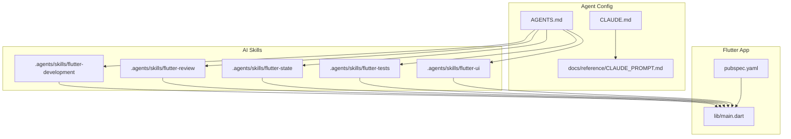
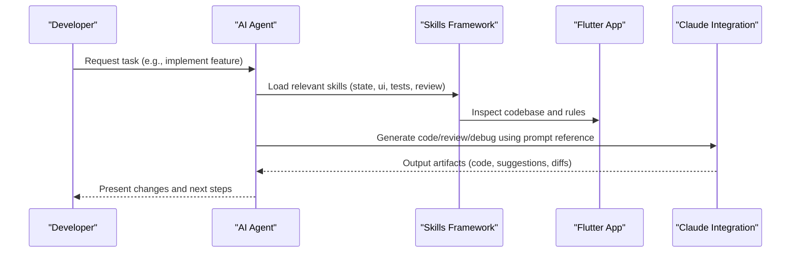
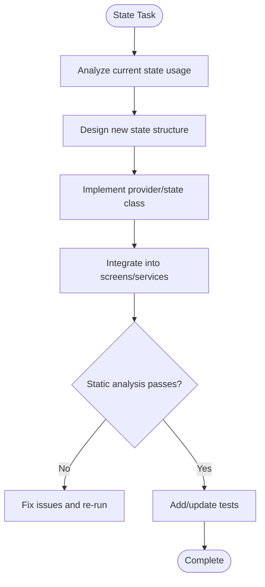
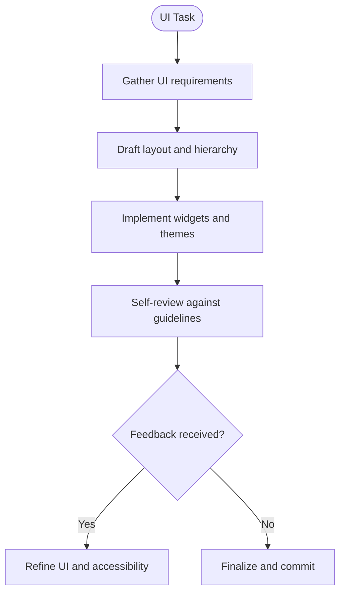
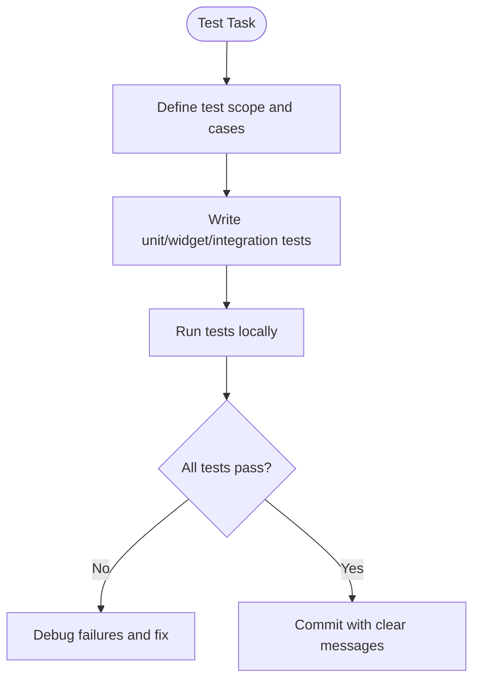
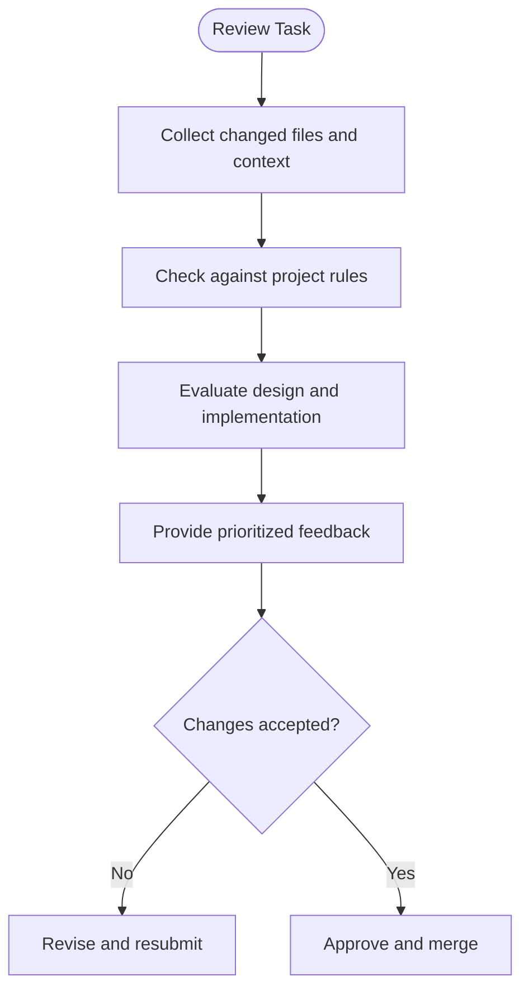
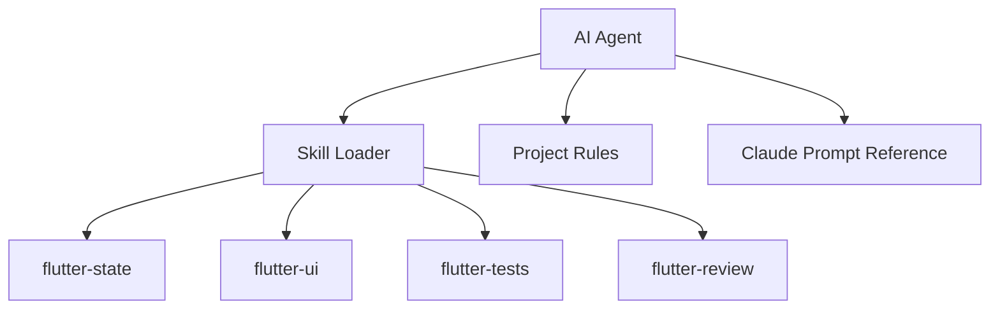
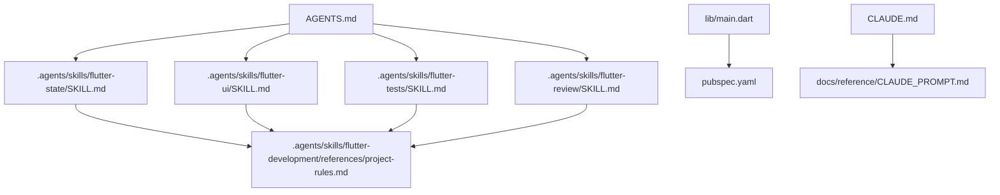

# AI-Assisted Development Setup

<cite>
**Referenced Files in This Document**
- [AGENTS.md](file://AGENTS.md)
- [CLAUDE.md](file://CLAUDE.md)
- [.agents/skills/flutter-development/SKILL.md](file://.agents/skills/flutter-development/SKILL.md)
- [.agents/skills/flutter-review/SKILL.md](file://.agents/skills/flutter-review/SKILL.md)
- [.agents/skills/flutter-state/SKILL.md](file://.agents/skills/flutter-state/SKILL.md)
- [.agents/skills/flutter-tests/SKILL.md](file://.agents/skills/flutter-tests/SKILL.md)
- [.agents/skills/flutter-ui/SKILL.md](file://.agents/skills/flutter-ui/SKILL.md)
- [.agents/skills/flutter-development/references/project-rules.md](file://.agents/skills/flutter-development/references/project-rules.md)
- [docs/reference/CLAUDE_PROMPT.md](file://docs/reference/CLAUDE_PROMPT.md)
- [pubspec.yaml](file://pubspec.yaml)
- [lib/main.dart](file://lib/main.dart)
</cite>

## Table of Contents
1. [Introduction](#introduction)
2. [Project Structure](#project-structure)
3. [Core Components](#core-components)
4. [Architecture Overview](#architecture-overview)
5. [Detailed Component Analysis](#detailed-component-analysis)
6. [Dependency Analysis](#dependency-analysis)
7. [Performance Considerations](#performance-considerations)
8. [Troubleshooting Guide](#troubleshooting-guide)
9. [Conclusion](#conclusion)
10. [Appendices](#appendices)

## Introduction
This document explains how to configure and use AI-assisted development tools for the ASSINATURAS NINJA project, focusing on:
- Skills framework setup under .agents/skills
- Agent configuration via AGENTS.md and CLAUDE.md
- Automated development assistance features
- Claude integration for code generation, review, and debugging
- Flutter-specific skills: state management, UI design, testing, and code review
- Setup instructions, usage examples, and best practices

The goal is to enable a consistent, repeatable workflow where an AI agent follows project rules and applies specialized skills to improve productivity and quality.

## Project Structure
The AI-assisted development setup centers around:
- A skills directory with Flutter-focused skill definitions
- Agent configuration files that define behavior and prompts
- A reference prompt for Claude interactions
- The Flutter application entry point and dependencies

**Diagram sources**
- [AGENTS.md](file://AGENTS.md)
- [CLAUDE.md](file://CLAUDE.md)
- [.agents/skills/flutter-development/SKILL.md](file://.agents/skills/flutter-development/SKILL.md)
- [.agents/skills/flutter-review/SKILL.md](file://.agents/skills/flutter-review/SKILL.md)
- [.agents/skills/flutter-state/SKILL.md](file://.agents/skills/flutter-state/SKILL.md)
- [.agents/skills/flutter-tests/SKILL.md](file://.agents/skills/flutter-tests/SKILL.md)
- [.agents/skills/flutter-ui/SKILL.md](file://.agents/skills/flutter-ui/SKILL.md)
- [docs/reference/CLAUDE_PROMPT.md](file://docs/reference/CLAUDE_PROMPT.md)
- [lib/main.dart](file://lib/main.dart)
- [pubspec.yaml](file://pubspec.yaml)

**Section sources**
- [AGENTS.md](file://AGENTS.md)
- [CLAUDE.md](file://CLAUDE.md)
- [.agents/skills/flutter-development/SKILL.md](file://.agents/skills/flutter-development/SKILL.md)
- [.agents/skills/flutter-review/SKILL.md](file://.agents/skills/flutter-review/SKILL.md)
- [.agents/skills/flutter-state/SKILL.md](file://.agents/skills/flutter-state/SKILL.md)
- [.agents/skills/flutter-tests/SKILL.md](file://.agents/skills/flutter-tests/SKILL.md)
- [.agents/skills/flutter-ui/SKILL.md](file://.agents/skills/flutter-ui/SKILL.md)
- [docs/reference/CLAUDE_PROMPT.md](file://docs/reference/CLAUDE_PROMPT.md)
- [lib/main.dart](file://lib/main.dart)
- [pubspec.yaml](file://pubspec.yaml)

## Core Components
- Skills Framework: Each Flutter capability is encapsulated as a skill with its own SKILL.md and optional references. These guide the agent’s behavior when performing tasks like state management, UI work, tests, or reviews.
- Agent Configuration: AGENTS.md defines how the agent loads and uses skills; CLAUDE.md configures Claude-specific behaviors and constraints.
- Reference Prompt: docs/reference/CLAUDE_PROMPT.md provides a standardized prompt template for Claude interactions.
- Application Context: lib/main.dart and pubspec.yaml provide the runtime context (entrypoint and dependencies) that skills should respect.

Key responsibilities:
- Skill authors define intent, inputs, outputs, and constraints for each domain.
- Agent configuration orchestrates which skills are active and how they interact with the codebase.
- Claude prompt reference ensures consistent tone, structure, and safety across generations.

**Section sources**
- [AGENTS.md](file://AGENTS.md)
- [CLAUDE.md](file://CLAUDE.md)
- [.agents/skills/flutter-development/SKILL.md](file://.agents/skills/flutter-development/SKILL.md)
- [.agents/skills/flutter-review/SKILL.md](file://.agents/skills/flutter-review/SKILL.md)
- [.agents/skills/flutter-state/SKILL.md](file://.agents/skills/flutter-state/SKILL.md)
- [.agents/skills/flutter-tests/SKILL.md](file://.agents/skills/flutter-tests/SKILL.md)
- [.agents/skills/flutter-ui/SKILL.md](file://.agents/skills/flutter-ui/SKILL.md)
- [docs/reference/CLAUDE_PROMPT.md](file://docs/reference/CLAUDE_PROMPT.md)
- [lib/main.dart](file://lib/main.dart)
- [pubspec.yaml](file://pubspec.yaml)

## Architecture Overview
The AI-assisted development architecture connects the agent, skills, and the Flutter app:

**Diagram sources**
- [AGENTS.md](file://AGENTS.md)
- [CLAUDE.md](file://CLAUDE.md)
- [.agents/skills/flutter-development/SKILL.md](file://.agents/skills/flutter-development/SKILL.md)
- [.agents/skills/flutter-review/SKILL.md](file://.agents/skills/flutter-review/SKILL.md)
- [.agents/skills/flutter-state/SKILL.md](file://.agents/skills/flutter-state/SKILL.md)
- [.agents/skills/flutter-tests/SKILL.md](file://.agents/skills/flutter-tests/SKILL.md)
- [.agents/skills/flutter-ui/SKILL.md](file://.agents/skills/flutter-ui/SKILL.md)
- [docs/reference/CLAUDE_PROMPT.md](file://docs/reference/CLAUDE_PROMPT.md)
- [lib/main.dart](file://lib/main.dart)

## Detailed Component Analysis

### Skills Framework Setup
- Purpose: Provide modular, reusable guidance for specific Flutter domains.
- Structure: Each skill has a SKILL.md describing scope, inputs, outputs, and constraints. Some include references (e.g., project rules).
- Usage: The agent selects appropriate skills based on the requested task.

Recommended workflow:
- Identify the domain (state, UI, tests, review).
- Ensure the corresponding SKILL.md is present and up-to-date.
- Invoke the agent with a clear request referencing the skill name and desired outcome.

Best practices:
- Keep SKILL.md concise and actionable.
- Use references for shared rules to avoid duplication.
- Version control all skill changes alongside code.

**Section sources**
- [.agents/skills/flutter-development/SKILL.md](file://.agents/skills/flutter-development/SKILL.md)
- [.agents/skills/flutter-review/SKILL.md](file://.agents/skills/flutter-review/SKILL.md)
- [.agents/skills/flutter-state/SKILL.md](file://.agents/skills/flutter-state/SKILL.md)
- [.agents/skills/flutter-tests/SKILL.md](file://.agents/skills/flutter-tests/SKILL.md)
- [.agents/skills/flutter-ui/SKILL.md](file://.agents/skills/flutter-ui/SKILL.md)
- [.agents/skills/flutter-development/references/project-rules.md](file://.agents/skills/flutter-development/references/project-rules.md)

### Agent Configuration
- AGENTS.md: Defines how the agent discovers and applies skills, and sets global behavior.
- CLAUDE.md: Configures Claude-specific settings such as tone, safety, and output format.

Setup checklist:
- Confirm AGENTS.md points to the correct skills directory.
- Validate CLAUDE.md includes required environment variables and constraints.
- Test a simple task to ensure the agent loads skills and respects configuration.

Operational tips:
- Centralize common constraints in CLAUDE.md to maintain consistency.
- Use explicit skill names in requests to reduce ambiguity.
- Maintain separate environments for dev/staging if needed.

**Section sources**
- [AGENTS.md](file://AGENTS.md)
- [CLAUDE.md](file://CLAUDE.md)

### Claude Integration for Code Generation, Review, and Debugging
- Reference Prompt: docs/reference/CLAUDE_PROMPT.md standardizes how to ask Claude for help.
- Typical flows:
  - Code generation: Provide context (files, requirements), specify target skill, and request implementation.
  - Code review: Ask for structured feedback aligned with project rules and skill constraints.
  - Debugging: Share error logs, stack traces, and minimal reproduction steps; request root cause analysis and fixes.

Usage examples:
- For generation: “Implement X using flutter-state skill, following project rules.”
- For review: “Review PR diff against flutter-review skill and list improvements.”
- For debugging: “Analyze crash log and propose targeted fixes respecting flutter-development rules.”

Safety and quality:
- Always validate generated code with static analysis and tests.
- Prefer incremental changes with clear commit messages.
- Use the reference prompt to keep outputs consistent and actionable.

**Section sources**
- [docs/reference/CLAUDE_PROMPT.md](file://docs/reference/CLAUDE_PROMPT.md)
- [CLAUDE.md](file://CLAUDE.md)
- [.agents/skills/flutter-development/SKILL.md](file://.agents/skills/flutter-development/SKILL.md)

### Flutter Development Skills

#### State Management Skill
- Scope: Define providers, streams, or state containers consistently.
- Inputs: Feature description, existing state patterns, data flow requirements.
- Outputs: Updated provider/state classes, wiring in main or screens, tests if applicable.
- Constraints: Follow project rules and dependency declarations.

**Diagram sources**
- [.agents/skills/flutter-state/SKILL.md](file://.agents/skills/flutter-state/SKILL.md)
- [.agents/skills/flutter-development/references/project-rules.md](file://.agents/skills/flutter-development/references/project-rules.md)
- [pubspec.yaml](file://pubspec.yaml)

**Section sources**
- [.agents/skills/flutter-state/SKILL.md](file://.agents/skills/flutter-state/SKILL.md)
- [.agents/skills/flutter-development/references/project-rules.md](file://.agents/skills/flutter-development/references/project-rules.md)
- [pubspec.yaml](file://pubspec.yaml)

#### UI Design Skill
- Scope: Build responsive, accessible, and theme-consistent screens and widgets.
- Inputs: Mockups or descriptions, component library usage, theming rules.
- Outputs: Widget trees, layout components, animations if needed.
- Constraints: Adhere to project style guidelines and asset organization.

**Diagram sources**
- [.agents/skills/flutter-ui/SKILL.md](file://.agents/skills/flutter-ui/SKILL.md)
- [.agents/skills/flutter-development/references/project-rules.md](file://.agents/skills/flutter-development/references/project-rules.md)

**Section sources**
- [.agents/skills/flutter-ui/SKILL.md](file://.agents/skills/flutter-ui/SKILL.md)
- [.agents/skills/flutter-development/references/project-rules.md](file://.agents/skills/flutter-development/references/project-rules.md)

#### Testing Skill
- Scope: Unit, widget, and integration tests aligned with project standards.
- Inputs: Feature logic, UI components, services, and expected behaviors.
- Outputs: Test files, mocks, fixtures, and test utilities.
- Constraints: Follow naming conventions, coverage targets, and CI expectations.

**Diagram sources**
- [.agents/skills/flutter-tests/SKILL.md](file://.agents/skills/flutter-tests/SKILL.md)
- [.agents/skills/flutter-development/references/project-rules.md](file://.agents/skills/flutter-development/references/project-rules.md)

**Section sources**
- [.agents/skills/flutter-tests/SKILL.md](file://.agents/skills/flutter-tests/SKILL.md)
- [.agents/skills/flutter-development/references/project-rules.md](file://.agents/skills/flutter-development/references/project-rules.md)

#### Code Review Skill
- Scope: Structured review process focusing on correctness, readability, performance, and security.
- Inputs: Diff or file set, change rationale, related issues.
- Outputs: Review comments, suggested improvements, risk assessment.
- Constraints: Align with project rules and team standards.

**Diagram sources**
- [.agents/skills/flutter-review/SKILL.md](file://.agents/skills/flutter-review/SKILL.md)
- [.agents/skills/flutter-development/references/project-rules.md](file://.agents/skills/flutter-development/references/project-rules.md)

**Section sources**
- [.agents/skills/flutter-review/SKILL.md](file://.agents/skills/flutter-review/SKILL.md)
- [.agents/skills/flutter-development/references/project-rules.md](file://.agents/skills/flutter-development/references/project-rules.md)

### Conceptual Overview
The skills framework acts as a plugin system for the agent, enabling domain-specific expertise without changing core agent logic. By centralizing rules and prompts, teams can evolve standards while maintaining consistent AI behavior.

[No sources needed since this diagram shows conceptual workflow, not actual code structure]

## Dependency Analysis
The skills depend on the Flutter application context and shared rules:
- Skills reference project rules for consistency.
- The agent reads configuration from AGENTS.md and CLAUDE.md.
- The Flutter app’s entrypoint and dependencies inform what can be implemented or tested.

**Diagram sources**
- [.agents/skills/flutter-development/references/project-rules.md](file://.agents/skills/flutter-development/references/project-rules.md)
- [.agents/skills/flutter-state/SKILL.md](file://.agents/skills/flutter-state/SKILL.md)
- [.agents/skills/flutter-ui/SKILL.md](file://.agents/skills/flutter-ui/SKILL.md)
- [.agents/skills/flutter-tests/SKILL.md](file://.agents/skills/flutter-tests/SKILL.md)
- [.agents/skills/flutter-review/SKILL.md](file://.agents/skills/flutter-review/SKILL.md)
- [lib/main.dart](file://lib/main.dart)
- [pubspec.yaml](file://pubspec.yaml)
- [AGENTS.md](file://AGENTS.md)
- [CLAUDE.md](file://CLAUDE.md)
- [docs/reference/CLAUDE_PROMPT.md](file://docs/reference/CLAUDE_PROMPT.md)

**Section sources**
- [.agents/skills/flutter-development/references/project-rules.md](file://.agents/skills/flutter-development/references/project-rules.md)
- [.agents/skills/flutter-state/SKILL.md](file://.agents/skills/flutter-state/SKILL.md)
- [.agents/skills/flutter-ui/SKILL.md](file://.agents/skills/flutter-ui/SKILL.md)
- [.agents/skills/flutter-tests/SKILL.md](file://.agents/skills/flutter-tests/SKILL.md)
- [.agents/skills/flutter-review/SKILL.md](file://.agents/skills/flutter-review/SKILL.md)
- [lib/main.dart](file://lib/main.dart)
- [pubspec.yaml](file://pubspec.yaml)
- [AGENTS.md](file://AGENTS.md)
- [CLAUDE.md](file://CLAUDE.md)
- [docs/reference/CLAUDE_PROMPT.md](file://docs/reference/CLAUDE_PROMPT.md)

## Performance Considerations
- Keep prompts focused and scoped to reduce token usage and latency.
- Prefer incremental changes and small diffs for faster reviews and merges.
- Cache repeated context (e.g., project rules) to minimize redundant processing.
- Run static analysis and tests locally before requesting AI review to reduce back-and-forth.

[No sources needed since this section provides general guidance]

## Troubleshooting Guide
Common issues and resolutions:
- Agent does not load skills:
  - Verify AGENTS.md paths and skill directory structure.
  - Ensure CLAUDE.md contains valid configuration and credentials.
- Inconsistent outputs:
  - Confirm docs/reference/CLAUDE_PROMPT.md is referenced and unchanged.
  - Re-check project rules for conflicting constraints.
- Flutter build or analysis errors after AI changes:
  - Run static analysis and tests locally.
  - Narrow down affected files and revert partial changes if necessary.
- Permission or environment problems:
  - Validate environment variables and toolchain versions.
  - Ensure platform-specific configurations (Android/iOS) are intact.

**Section sources**
- [AGENTS.md](file://AGENTS.md)
- [CLAUDE.md](file://CLAUDE.md)
- [docs/reference/CLAUDE_PROMPT.md](file://docs/reference/CLAUDE_PROMPT.md)
- [.agents/skills/flutter-development/references/project-rules.md](file://.agents/skills/flutter-development/references/project-rules.md)

## Conclusion
By organizing Flutter expertise into discrete skills and centralizing agent configuration, ASSINATURAS NINJA enables reliable, scalable AI-assisted development. Following the setup instructions, leveraging the reference prompt, and adhering to project rules will streamline code generation, review, and debugging workflows while maintaining high quality and consistency.

[No sources needed since this section summarizes without analyzing specific files]

## Appendices

### Quick Start Checklist
- Ensure AGENTS.md and CLAUDE.md are configured correctly.
- Verify skills exist under .agents/skills and follow the SKILL.md format.
- Use docs/reference/CLAUDE_PROMPT.md as the base for Claude requests.
- Apply one skill per task to keep outputs focused.
- Validate changes with static analysis and tests before committing.

**Section sources**
- [AGENTS.md](file://AGENTS.md)
- [CLAUDE.md](file://CLAUDE.md)
- [.agents/skills/flutter-development/SKILL.md](file://.agents/skills/flutter-development/SKILL.md)
- [.agents/skills/flutter-review/SKILL.md](file://.agents/skills/flutter-review/SKILL.md)
- [.agents/skills/flutter-state/SKILL.md](file://.agents/skills/flutter-state/SKILL.md)
- [.agents/skills/flutter-tests/SKILL.md](file://.agents/skills/flutter-tests/SKILL.md)
- [.agents/skills/flutter-ui/SKILL.md](file://.agents/skills/flutter-ui/SKILL.md)
- [docs/reference/CLAUDE_PROMPT.md](file://docs/reference/CLAUDE_PROMPT.md)