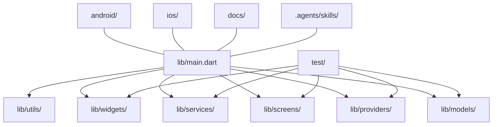
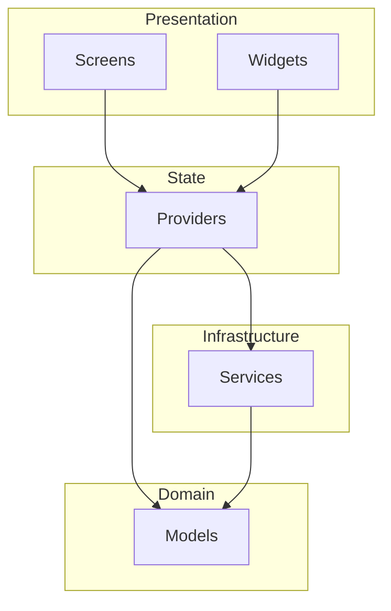
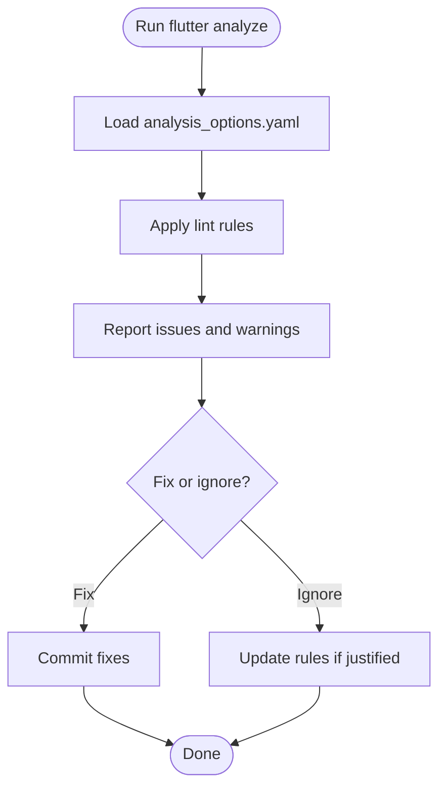
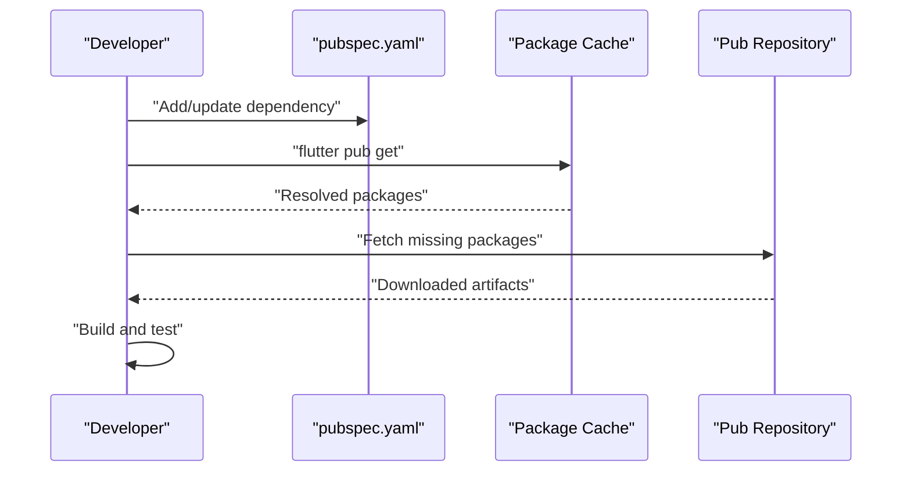
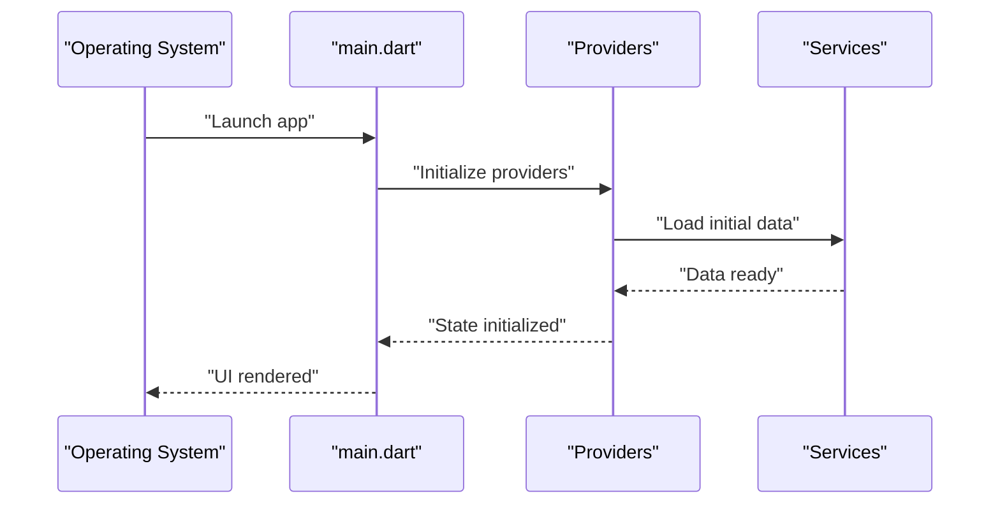
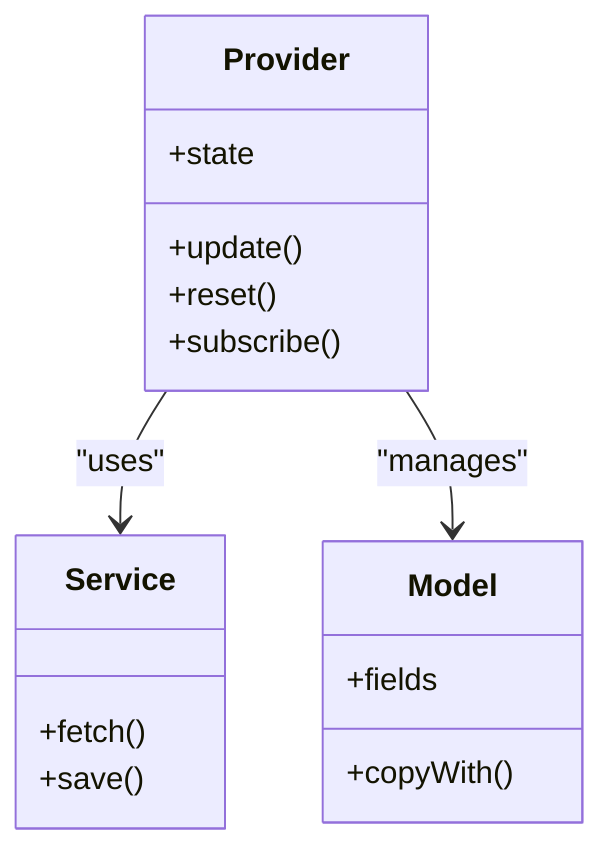
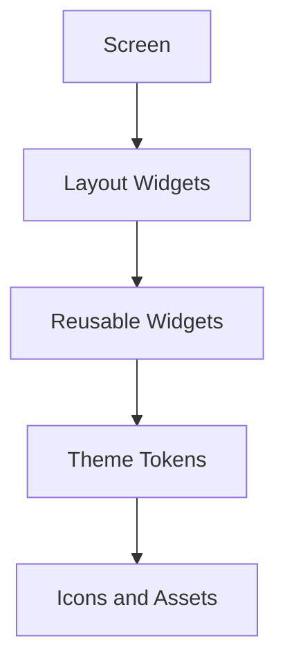
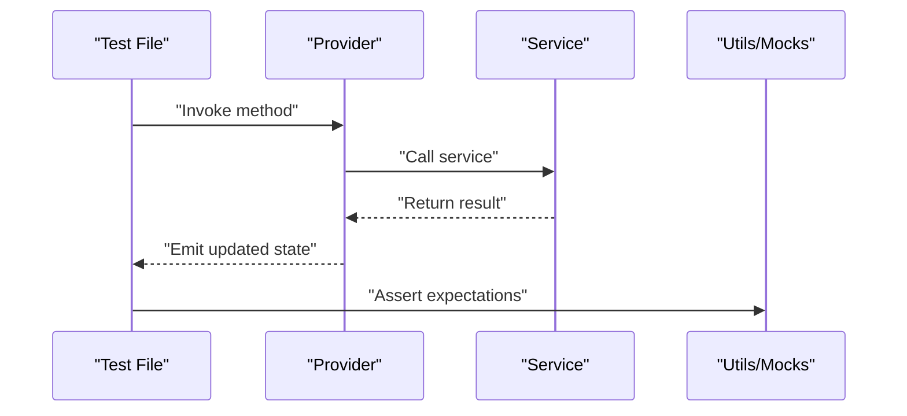
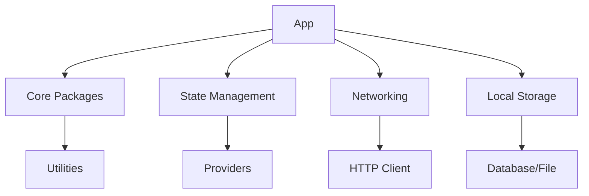

# Coding Standards & Conventions

<cite>
**Referenced Files in This Document**
- [analysis_options.yaml](file://analysis_options.yaml)
- [pubspec.yaml](file://pubspec.yaml)
- [lib/main.dart](file://lib/main.dart)
- [AGENTS.md](file://AGENTS.md)
- [CLAUDE.md](file://CLAUDE.md)
- [README.md](file://README.md)
- [docs/ARCHITECTURE.md](file://docs/ARCHITECTURE.md)
- [docs/UI_GUIDE.md](file://docs/UI_GUIDE.md)
- [.agents/skills/flutter-development/references/project-rules.md](file://.agents/skills/flutter-development/references/project-rules.md)
</cite>

## Table of Contents
1. [Introduction](#introduction)
2. [Project Structure](#project-structure)
3. [Core Components](#core-components)
4. [Architecture Overview](#architecture-overview)
5. [Detailed Component Analysis](#detailed-component-analysis)
6. [Dependency Analysis](#dependency-analysis)
7. [Performance Considerations](#performance-considerations)
8. [Troubleshooting Guide](#troubleshooting-guide)
9. [Conclusion](#conclusion)
10. [Appendices](#appendices)

## Introduction
This document defines the coding standards and conventions for the ASSINATURAS NINJA Flutter project. It covers Dart language best practices, naming conventions, Flutter-specific patterns (widget composition, state management, UI structure), formatting rules, import organization, documentation standards, and static analysis configuration. The goal is to ensure consistency, readability, maintainability, and high-quality code across the team.

## Project Structure
The project follows a feature-oriented layout with clear separation of concerns:
- lib/: Core application code
  - models/: Data models and domain entities
  - providers/: State management providers
  - screens/: Top-level screens/pages
  - services/: Business logic and external integrations
  - utils/: Shared utilities and helpers
  - widgets/: Reusable UI components
  - main.dart: Application entry point
- test/: Unit and widget tests aligned with source structure
- android/, ios/: Platform-specific configurations
- docs/: Architecture, UI guide, and project briefs
- .agents/skills/: Agent skills and references used by development workflows

[No sources needed since this diagram shows conceptual workflow, not actual code structure]

**Section sources**
- [README.md](file://README.md)
- [docs/ARCHITECTURE.md](file://docs/ARCHITECTURE.md)

## Core Components
This section outlines the foundational standards applied throughout the codebase.

### Dart Language Best Practices
- Use strong mode and enable sound null safety.
- Prefer const constructors and final variables where possible.
- Avoid unnecessary allocations; prefer immutable data structures.
- Use explicit types for public APIs and return values when they improve clarity.
- Keep functions small and focused; extract complex logic into named helper functions.
- Use async/await consistently; avoid mixing callbacks and futures unnecessarily.
- Prefer early returns and guard clauses to reduce nesting.

### Naming Conventions
- Classes and mixins: PascalCase (e.g., SubscriptionProvider).
- Files: snake_case with descriptive names (e.g., subscription_provider.dart).
- Variables and methods: camelCase (e.g., fetchSubscriptions).
- Constants: UPPER_SNAKE_CASE for top-level constants (e.g., MAX_RETRIES).
- Private identifiers: prefix with underscore (e.g., _internalState).
- Enums: PascalCase for enum type and CamelCase for members (e.g., Status.active).
- Providers: Name after their responsibility (e.g., SettingsProvider).
- Widgets: PascalCase and noun-like names (e.g., SubscriptionCard).

### Flutter-Specific Patterns
- Widget Composition:
  - Favor small, composable widgets over large monolithic ones.
  - Extract reusable UI into dedicated files under lib/widgets/.
  - Use StatelessWidget for pure presentational components.
  - Use StatefulWidget only when local state is required; otherwise prefer provider-based state.
- State Management:
  - Centralize shared state in providers under lib/providers/.
  - Expose minimal API surface per provider; encapsulate business logic in services.
  - Use immutable updates; create new instances rather than mutating existing state.
- UI Component Structure:
  - Separate presentation from logic; keep UI thin and logic in services/providers.
  - Use theme-aware colors and typography; avoid hard-coded literals.
  - Organize screen layouts using consistent row/column/grid patterns.

### Code Formatting Rules
- Follow standard Dart formatting (80-character line length unless overridden).
- Use consistent indentation (2 spaces).
- Group imports logically: dart.*, package.*, relative imports.
- Sort imports alphabetically within groups.
- Place one blank line between logical sections (imports, fields, methods).
- Prefer trailing commas in multi-line function calls and collections.

### Import Organization
- Order:
  1. dart:* imports
  2. package:* imports
  3. Relative imports
- Within each group, sort alphabetically.
- Avoid wildcard imports; specify exact paths.
- Keep imports close to usage; do not hoist unused imports.

### Documentation Standards
- Add concise doc comments for public APIs (classes, methods, fields).
- Include purpose, parameters, return values, and exceptions where applicable.
- Maintain README and architecture docs up-to-date.
- Use inline comments sparingly; prefer self-documenting code.

**Section sources**
- [analysis_options.yaml](file://analysis_options.yaml)
- [pubspec.yaml](file://pubspec.yaml)
- [lib/main.dart](file://lib/main.dart)
- [AGENTS.md](file://AGENTS.md)
- [CLAUDE.md](file://CLAUDE.md)
- [docs/ARCHITECTURE.md](file://docs/ARCHITECTURE.md)
- [docs/UI_GUIDE.md](file://docs/UI_GUIDE.md)
- [.agents/skills/flutter-development/references/project-rules.md](file://.agents/skills/flutter-development/references/project-rules.md)

## Architecture Overview
The application separates concerns into layers:
- Presentation layer: Screens and widgets
- State layer: Providers managing app state
- Domain layer: Models representing core entities
- Infrastructure layer: Services handling external dependencies

[No sources needed since this diagram shows conceptual workflow, not actual code structure]

**Section sources**
- [docs/ARCHITECTURE.md](file://docs/ARCHITECTURE.md)

## Detailed Component Analysis

### Static Analysis and Linting Configuration
- analysis_options.yaml configures lint rules and analyzer settings.
- Enforce strictness via recommended lints and project-specific overrides.
- Ensure consistent style checks across the repository.

**Diagram sources**
- [analysis_options.yaml](file://analysis_options.yaml)

**Section sources**
- [analysis_options.yaml](file://analysis_options.yaml)

### Dependency Management and Package Usage
- pubspec.yaml declares dependencies and dev_dependencies.
- Pin versions for stability; use ^ for compatible updates.
- Keep third-party packages minimal and well-maintained.
- Regularly run flutter pub upgrade and review changelogs.

**Diagram sources**
- [pubspec.yaml](file://pubspec.yaml)

**Section sources**
- [pubspec.yaml](file://pubspec.yaml)

### Entry Point and App Initialization
- lib/main.dart initializes the app, sets up providers, and configures global settings.
- Ensure minimal bootstrap logic; delegate setup to services and providers.
- Configure error boundaries and logging at startup.

**Diagram sources**
- [lib/main.dart](file://lib/main.dart)

**Section sources**
- [lib/main.dart](file://lib/main.dart)

### State Management Conventions
- Providers encapsulate state and expose reactive APIs.
- Use immutable updates; avoid direct mutation.
- Keep providers focused on single responsibilities.
- Test providers independently from UI.

**Diagram sources**
- [lib/providers/](file://lib/providers/)
- [lib/services/](file://lib/services/)
- [lib/models/](file://lib/models/)

**Section sources**
- [lib/providers/](file://lib/providers/)
- [lib/services/](file://lib/services/)
- [lib/models/](file://lib/models/)

### UI Component Structure
- Widgets should be small and composable.
- Use theme tokens for colors, typography, and spacing.
- Separate presentation logic from business logic.
- Prefer StatelessWidget when no local state is needed.

**Diagram sources**
- [docs/UI_GUIDE.md](file://docs/UI_GUIDE.md)

**Section sources**
- [docs/UI_GUIDE.md](file://docs/UI_GUIDE.md)

### Testing Guidelines
- Align test files with source structure under test/.
- Write unit tests for providers and services; widget tests for critical UI flows.
- Mock external dependencies; assert state changes and side effects.
- Keep tests deterministic and fast.

**Diagram sources**
- [test/](file://test/)

**Section sources**
- [test/](file://test/)

## Dependency Analysis
External dependencies are declared in pubspec.yaml. Keep them minimal and version-pinned for stability. Analyze the dependency graph to identify transitive dependencies and potential conflicts.

**Diagram sources**
- [pubspec.yaml](file://pubspec.yaml)

**Section sources**
- [pubspec.yaml](file://pubspec.yaml)

## Performance Considerations
- Minimize rebuilds by using const widgets and efficient state updates.
- Avoid heavy computations on the UI thread; offload to isolates or background tasks.
- Use lazy loading for large lists and images.
- Profile memory usage and CPU hotspots regularly.
- Keep provider state lean; derive expensive values lazily.

[No sources needed since this section provides general guidance]

## Troubleshooting Guide
- Static Analysis Issues:
  - Run flutter analyze and address reported issues.
  - Review analysis_options.yaml for custom rules that may need adjustment.
- Lint Violations:
  - Use IDE integration to auto-format and fix common issues.
  - Update rules only with justification and team consensus.
- Build Failures:
  - Clean build artifacts and re-run pub get.
  - Check platform-specific configurations in android/ and ios/.
- Runtime Errors:
  - Enable detailed logging in debug builds.
  - Wrap critical operations with try/catch and report errors centrally.

**Section sources**
- [analysis_options.yaml](file://analysis_options.yaml)
- [AGENTS.md](file://AGENTS.md)
- [CLAUDE.md](file://CLAUDE.md)

## Conclusion
Adhering to these coding standards ensures consistency, quality, and scalability across the ASSINATURAS NINJA project. By following the naming conventions, Flutter patterns, formatting rules, and static analysis guidelines, the team can deliver robust features efficiently while maintaining a clean and understandable codebase.

[No sources needed since this section summarizes without analyzing specific files]

## Appendices

### Correct vs Incorrect Patterns
- Correct:
  - Small, focused widgets with clear responsibilities.
  - Immutable state updates in providers.
  - Explicit types for public APIs.
  - Consistent import ordering and grouping.
- Incorrect:
  - Monolithic widgets containing business logic.
  - Direct mutation of shared state.
  - Wildcard imports and unsorted imports.
  - Hard-coded theme values instead of tokens.

[No sources needed since this section provides general guidance]

### References and Additional Reading
- Project rules and agent skills for Flutter development and review.
- Architecture and UI guides for deeper context.

**Section sources**
- [.agents/skills/flutter-development/references/project-rules.md](file://.agents/skills/flutter-development/references/project-rules.md)
- [docs/ARCHITECTURE.md](file://docs/ARCHITECTURE.md)
- [docs/UI_GUIDE.md](file://docs/UI_GUIDE.md)
- [AGENTS.md](file://AGENTS.md)
- [CLAUDE.md](file://CLAUDE.md)
- [README.md](file://README.md)