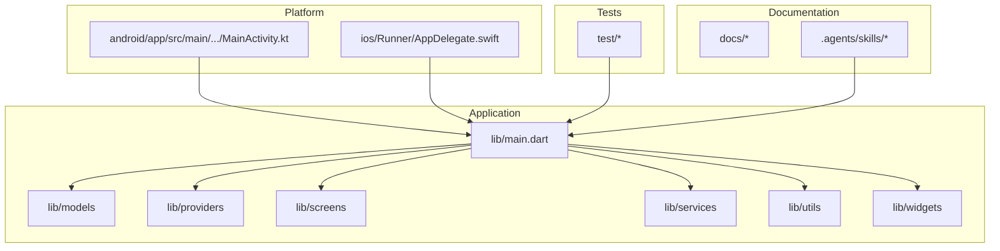
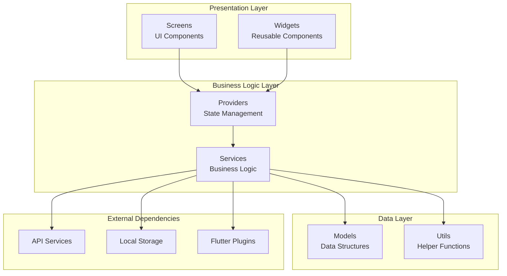
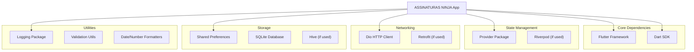
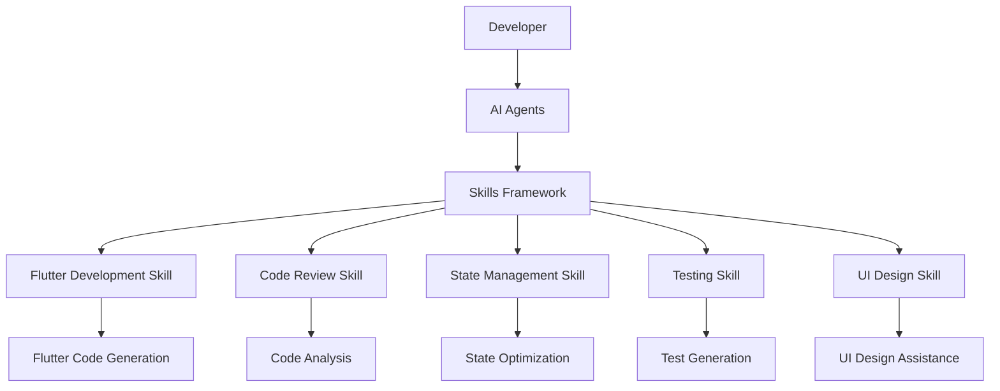

# Development Guidelines

<cite>
**Referenced Files in This Document**
- [README.md](file://README.md)
- [AGENTS.md](file://AGENTS.md)
- [CLAUDE.md](file://CLAUDE.md)
- [analysis_options.yaml](file://analysis_options.yaml)
- [pubspec.yaml](file://pubspec.yaml)
- [lib/main.dart](file://lib/main.dart)
- [.agents/skills/flutter-development/SKILL.md](file://.agents/skills/flutter-development/SKILL.md)
- [.agents/skills/flutter-development/references/project-rules.md](file://.agents/skills/flutter-development/references/project-rules.md)
- [.agents/skills/flutter-review/SKILL.md](file://.agents/skills/flutter-review/SKILL.md)
- [.agents/skills/flutter-state/SKILL.md](file://.agents/skills/flutter-state/SKILL.md)
- [.agents/skills/flutter-tests/SKILL.md](file://.agents/skills/flutter-tests/SKILL.md)
- [.agents/skills/flutter-ui/SKILL.md](file://.agents/skills/flutter-ui/SKILL.md)
- [docs/ARCHITECTURE.md](file://docs/ARCHITECTURE.md)
- [docs/PROJECT_BRIEF.md](file://docs/PROJECT_BRIEF.md)
- [docs/UI_GUIDE.md](file://docs/UI_GUIDE.md)
- [docs/TASKS.md](file://docs/TASKS.md)
- [docs/VALIDATION.md](file://docs/VALIDATION.md)
- [android/app/src/main/kotlin/br/com/assinaturasninja/assinaturas_ninja/MainActivity.kt](file://android/app/src/main/kotlin/br/com/assinaturasninja/assinaturas_ninja/MainActivity.kt)
- [ios/Runner/AppDelegate.swift](file://ios/Runner/AppDelegate.swift)
</cite>

## Table of Contents
1. [Introduction](#introduction)
2. [Project Structure](#project-structure)
3. [Core Components](#core-components)
4. [Architecture Overview](#architecture-overview)
5. [Detailed Component Analysis](#detailed-component-analysis)
6. [Dependency Analysis](#dependency-analysis)
7. [Performance Considerations](#performance-considerations)
8. [Troubleshooting Guide](#troubleshooting-guide)
9. [Conclusion](#conclusion)
10. [Appendices](#appendices)

## Introduction
This document provides comprehensive development guidelines for contributing to the ASSINATURAS NINJA project. It covers code style conventions, naming standards, Dart/Flutter best practices, project structure and file organization patterns, component architecture guidelines, Git workflow procedures, branching strategies, commit message conventions, pull request processes, code review guidelines, quality assurance checks, performance optimization standards, and AI agent configuration details using the skills framework.

The goal is to ensure consistent, high-quality contributions across the team while leveraging automated tools and AI-assisted workflows for productivity and reliability.

## Project Structure
The project follows a standard Flutter application layout with clear separation of concerns:
- lib: Core application logic, including models, providers, screens, services, utils, and widgets
- android and ios: Native platform configurations and entry points
- test: Unit and widget tests
- assets: Static resources such as branding materials
- docs: Documentation including architecture, UI guide, tasks, and validation references
- .agents/skills: AI agent skill definitions for development assistance

**Diagram sources**
- [lib/main.dart](file://lib/main.dart)
- [android/app/src/main/kotlin/br/com/assinaturasninja/assinaturas_ninja/MainActivity.kt](file://android/app/src/main/kotlin/br/com/assinaturasninja/assinaturas_ninja/MainActivity.kt)
- [ios/Runner/AppDelegate.swift](file://ios/Runner/AppDelegate.swift)

**Section sources**
- [README.md](file://README.md)
- [docs/ARCHITECTURE.md](file://docs/ARCHITECTURE.md)
- [docs/PROJECT_BRIEF.md](file://docs/PROJECT_BRIEF.md)

## Core Components
The core components follow Flutter best practices with clear separation between business logic, state management, and presentation layers:

### State Management
- Providers are used for reactive state management
- Business logic is separated from UI components
- State changes are handled through immutable data structures

### Architecture Patterns
- Feature-based organization within lib directory
- Clear separation between models, services, and UI components
- Dependency injection through provider pattern

### Testing Strategy
- Comprehensive test coverage for critical functionality
- Widget testing for UI components
- Provider testing for state management logic

**Section sources**
- [lib/main.dart](file://lib/main.dart)
- [docs/ARCHITECTURE.md](file://docs/ARCHITECTURE.md)

## Architecture Overview
The application follows a layered architecture pattern with clear separation of concerns:

**Diagram sources**
- [lib/main.dart](file://lib/main.dart)
- [docs/ARCHITECTURE.md](file://docs/ARCHITECTURE.md)

## Detailed Component Analysis

### Code Style Conventions
Follow these Dart/Flutter coding standards:
- Use camelCase for variables, methods, and functions
- Use PascalCase for classes, enums, and type names
- Use snake_case for file and directory names
- Follow effective_dart guidelines
- Maintain consistent indentation (2 spaces)
- Use meaningful variable and function names

### Naming Standards
- Models should represent domain entities clearly
- Providers should indicate their purpose (e.g., SubscriptionProvider)
- Services should use verb-noun combinations (e.g., ApiService)
- Widgets should be descriptive of their function
- Constants should be in UPPER_SNAKE_CASE

### File Organization Patterns
- Group related functionality together
- Use feature-based folder structure
- Keep files focused on single responsibilities
- Maintain consistent import ordering
- Separate UI logic from business logic

**Section sources**
- [analysis_options.yaml](file://analysis_options.yaml)
- [pubspec.yaml](file://pubspec.yaml)

### Component Architecture Guidelines
- Implement clean architecture principles
- Use dependency injection for loose coupling
- Follow SOLID principles in component design
- Ensure proper error handling and logging
- Maintain testability in all components

**Section sources**
- [docs/ARCHITECTURE.md](file://docs/ARCHITECTURE.md)
- [docs/UI_GUIDE.md](file://docs/UI_GUIDE.md)

## Dependency Analysis
The project uses a well-structured dependency management approach:

**Diagram sources**
- [pubspec.yaml](file://pubspec.yaml)

**Section sources**
- [pubspec.yaml](file://pubspec.yaml)

## Performance Considerations
Optimize your Flutter application with these performance best practices:

### Memory Management
- Avoid memory leaks by properly disposing resources
- Use const constructors where possible
- Implement efficient list rendering with ListView.builder
- Clean up subscriptions and timers

### UI Performance
- Minimize rebuilds using const widgets
- Implement proper key usage in lists
- Use RepaintBoundary for complex animations
- Optimize image loading and caching

### Network Optimization
- Implement proper caching strategies
- Use pagination for large datasets
- Implement retry mechanisms for failed requests
- Monitor network performance metrics

### Build Optimization
- Enable tree shaking and minification
- Use appropriate asset compression
- Implement lazy loading for heavy features
- Profile regularly with Flutter DevTools

## Troubleshooting Guide
Common issues and their solutions:

### Build Issues
- Clean build artifacts when encountering compilation errors
- Update dependencies if version conflicts occur
- Check platform-specific configurations for Android/iOS builds

### Runtime Errors
- Implement comprehensive error logging
- Use try-catch blocks for external API calls
- Handle null safety properly throughout the codebase
- Monitor memory usage during development

### Performance Issues
- Use Flutter DevTools for profiling
- Identify bottlenecks in widget rebuilds
- Monitor network request performance
- Analyze memory allocation patterns

**Section sources**
- [docs/VALIDATION.md](file://docs/VALIDATION.md)
- [docs/TASKS.md](file://docs/TASKS.md)

## Conclusion
These development guidelines provide a comprehensive framework for contributing to the ASSINATURAS NINJA project. By following these standards and best practices, contributors can maintain code quality, improve collaboration efficiency, and deliver high-performance Flutter applications. The combination of established coding conventions, architectural patterns, and AI-assisted development tools ensures consistent and reliable software delivery.

## Appendices

### Git Workflow Procedures

#### Branching Strategy
- main: Production-ready code
- develop: Integration branch for features
- feature/*: Individual feature branches
- bugfix/*: Bug fix branches
- hotfix/*: Emergency production fixes

#### Commit Message Conventions
Use conventional commits format:
- feat: New features
- fix: Bug fixes
- docs: Documentation updates
- style: Code style changes
- refactor: Code refactoring
- test: Test additions/modifications
- chore: Maintenance tasks

#### Pull Request Process
1. Create feature branch from develop
2. Implement changes with proper testing
3. Run all quality checks locally
4. Submit PR with detailed description
5. Address review feedback
6. Merge after approval and CI pass

### Code Review Guidelines
- Review for functionality and correctness
- Check code style and conventions
- Verify test coverage
- Assess performance implications
- Ensure security considerations
- Validate documentation updates

### Quality Assurance Checks
- Static analysis with Dart analyzer
- Unit and widget test execution
- Code formatting verification
- Security vulnerability scanning
- Performance benchmarking
- Cross-platform compatibility testing

### AI Agent Configuration Details

#### Skills Framework Setup
The project includes AI agent skills for enhanced development assistance:

**Diagram sources**
- [.agents/skills/flutter-development/SKILL.md](file://.agents/skills/flutter-development/SKILL.md)
- [.agents/skills/flutter-review/SKILL.md](file://.agents/skills/flutter-review/SKILL.md)
- [.agents/skills/flutter-state/SKILL.md](file://.agents/skills/flutter-state/SKILL.md)
- [.agents/skills/flutter-tests/SKILL.md](file://.agents/skills/flutter-tests/SKILL.md)
- [.agents/skills/flutter-ui/SKILL.md](file://.agents/skills/flutter-ui/SKILL.md)

#### Automated Development Assistance
Configure AI agents for:
- Code generation based on specifications
- Automated testing suite creation
- Performance optimization suggestions
- Security vulnerability detection
- Documentation generation
- Code review automation

**Section sources**
- [AGENTS.md](file://AGENTS.md)
- [CLAUDE.md](file://CLAUDE.md)
- [.agents/skills/flutter-development/SKILL.md](file://.agents/skills/flutter-development/SKILL.md)
- [.agents/skills/flutter-development/references/project-rules.md](file://.agents/skills/flutter-development/references/project-rules.md)
- [.agents/skills/flutter-review/SKILL.md](file://.agents/skills/flutter-review/SKILL.md)
- [.agents/skills/flutter-state/SKILL.md](file://.agents/skills/flutter-state/SKILL.md)
- [.agents/skills/flutter-tests/SKILL.md](file://.agents/skills/flutter-tests/SKILL.md)
- [.agents/skills/flutter-ui/SKILL.md](file://.agents/skills/flutter-ui/SKILL.md)