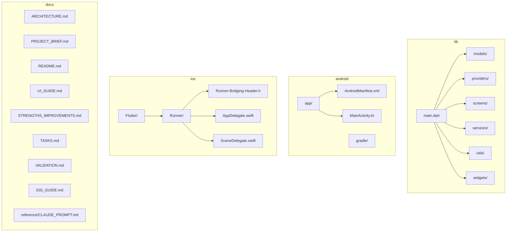
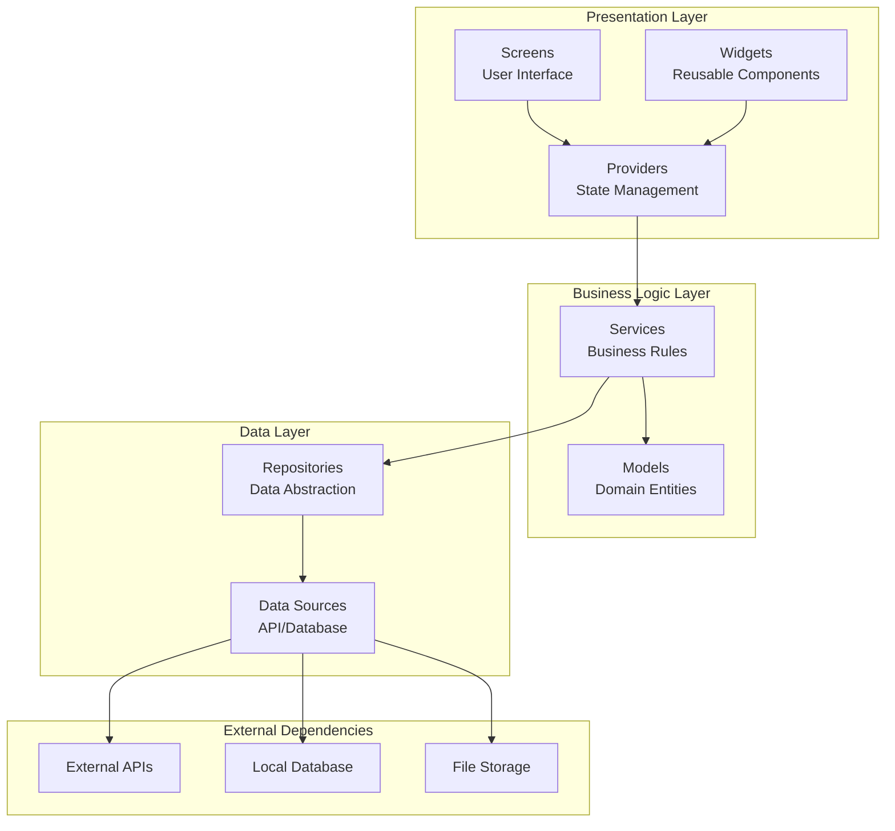
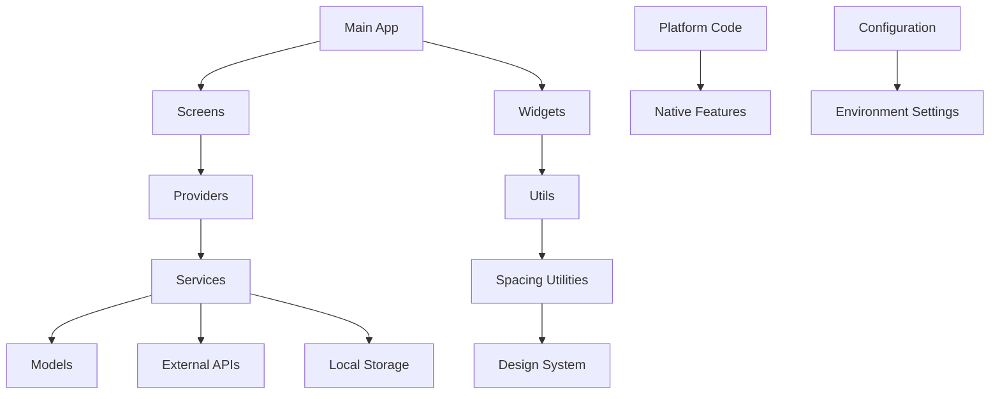

# Project Structure & Organization

<cite>
**Referenced Files in This Document**
- [main.dart](file://lib/main.dart)
- [pubspec.yaml](file://pubspec.yaml)
- [ARCHITECTURE.md](file://docs/ARCHITECTURE.md)
- [PROJECT_BRIEF.md](file://docs/PROJECT_BRIEF.md)
- [README.md](file://docs/README.md)
- [UI_GUIDE.md](file://docs/UI_GUIDE.md)
- [STRENGTHS_IMPROVEMENTS.md](file://docs/STRENGTHS_IMPROVEMENTS.md)
- [TASKS.md](file://docs/TASKS.md)
- [VALIDATION.md](file://docs/VALIDATION.md)
- [IOS_GUIDE.md](file://docs/IOS_GUIDE.md)
- [CLAUDE_PROMPT.md](file://docs/reference/CLAUDE_PROMPT.md)
- [MainActivity.kt](file://android/app/src/main/kotlin/br/com/assinaturasninja/assinaturas_ninja/MainActivity.kt)
- [AndroidManifest.xml](file://android/app/src/main/AndroidManifest.xml)
- [build.gradle.kts](file://android/build.gradle.kts)
- [settings.gradle.kts](file://android/settings.gradle.kts)
- [AppFrameworkInfo.plist](file://ios/Flutter/AppFrameworkInfo.plist)
- [Runner-Bridging-Header.h](file://ios/Runner/Runner-Bridging-Header.h)
- [AppDelegate.swift](file://ios/Runner/AppDelegate.swift)
- [SceneDelegate.swift](file://ios/Runner/SceneDelegate.swift)
</cite>

## Update Summary
**Changes Made**
- Updated project structure documentation to reflect enhanced organization with centralized spacing utilities
- Added new section on spacing utilities and design system consistency
- Enhanced directory layout patterns to include utility organization guidelines
- Updated component creation guidelines to incorporate spacing standards

## Table of Contents
1. [Introduction](#introduction)
2. [Project Structure](#project-structure)
3. [Core Components](#core-components)
4. [Architecture Overview](#architecture-overview)
5. [Detailed Component Analysis](#detailed-component-analysis)
6. [Dependency Analysis](#dependency-analysis)
7. [Performance Considerations](#performance-considerations)
8. [Troubleshooting Guide](#troubleshooting-guide)
9. [Conclusion](#conclusion)
10. [Appendices](#appendices)

## Introduction
This document explains the project structure and organization conventions for ASSINATURAS NINJA, focusing on Clean Architecture principles and MVVM implementation patterns. It provides guidelines for organizing models, providers, screens, services, widgets, and utilities, along with naming conventions and best practices to maintain consistency across the codebase. The goal is to help developers create new components efficiently while preserving architectural integrity and separation of concerns.

## Project Structure
The Flutter application follows a feature-oriented directory layout under lib/, with clear separation between presentation (screens, widgets), state management (providers), data access (services), domain models (models), and shared utilities (utils). Platform-specific configurations are maintained in android/ and ios/. Documentation and references reside under docs/.



**Diagram sources**
- [main.dart:1-50](file://lib/main.dart#L1-L50)
- [AndroidManifest.xml:1-50](file://android/app/src/main/AndroidManifest.xml#L1-L50)
- [MainActivity.kt:1-30](file://android/app/src/main/kotlin/br/com/assinaturasninja/assinaturas_ninja/MainActivity.kt#L1-L30)
- [AppFrameworkInfo.plist:1-20](file://ios/Flutter/AppFrameworkInfo.plist#L1-L20)
- [Runner-Bridging-Header.h:1-10](file://ios/Runner/Runner-Bridging-Header.h#L1-L10)
- [AppDelegate.swift:1-20](file://ios/Runner/AppDelegate.swift#L1-L20)
- [SceneDelegate.swift:1-20](file://ios/Runner/SceneDelegate.swift#L1-L20)

**Section sources**
- [main.dart:1-100](file://lib/main.dart#L1-L100)
- [pubspec.yaml:1-50](file://pubspec.yaml#L1-L50)
- [ARCHITECTURE.md:1-100](file://docs/ARCHITECTURE.md#L1-L100)
- [PROJECT_BRIEF.md:1-50](file://docs/PROJECT_BRIEF.md#L1-L50)

## Core Components
The application implements Clean Architecture with clear separation of concerns:

### Models Layer
Domain entities and data structures that represent business concepts. These should be platform-agnostic and contain minimal logic.

### Providers Layer
State management using Provider pattern. Handles business logic coordination and exposes reactive state to the UI layer.

### Screens Layer
Presentation layer containing UI screens that consume provider state and render user interfaces.

### Services Layer
Data access layer handling external dependencies like APIs, databases, or file systems.

### Widgets Layer
Reusable UI components that promote code reuse and consistency across the application.

### Utils Layer
Shared utilities, helpers, constants, and common functionality used throughout the application. **Updated** Enhanced with centralized spacing utilities for consistent design system implementation.

**Section sources**
- [ARCHITECTURE.md:50-150](file://docs/ARCHITECTURE.md#L50-L150)
- [UI_GUIDE.md:1-100](file://docs/UI_GUIDE.md#L1-L100)

## Architecture Overview
The application follows Clean Architecture principles with MVVM implementation:



**Diagram sources**
- [ARCHITECTURE.md:100-200](file://docs/ARCHITECTURE.md#L100-L200)
- [PROJECT_BRIEF.md:50-150](file://docs/PROJECT_BRIEF.md#L50-L150)

## Detailed Component Analysis

### Directory Layout Patterns
The project follows consistent naming and organization conventions:

#### Models Organization
- Place domain entities in `lib/models/`
- Use descriptive class names following PascalCase
- Keep models immutable where possible
- Separate request/response models from domain models

#### Providers Implementation
- State management classes go in `lib/providers/`
- Follow single responsibility principle
- Use ChangeNotifier or Riverpod for state management
- Handle error states and loading indicators

#### Screen Structure
- User interface files in `lib/screens/`
- One screen per file with descriptive naming
- Separate business logic into providers
- Keep UI code clean and focused on presentation

#### Service Layer
- External dependencies handled in `lib/services/`
- Implement repository pattern for data abstraction
- Handle network requests and data transformation
- Manage caching and offline capabilities

#### Widget Reusability
- Shared components in `lib/widgets/`
- Create small, focused widgets
- Use composition over inheritance
- Maintain consistent styling and behavior

#### Utility Functions
- Common functionality in `lib/utils/`
- Organize by feature or purpose
- Keep functions pure and testable
- Document complex algorithms
- **Updated** Include centralized spacing utilities for consistent design system implementation

**Section sources**
- [UI_GUIDE.md:50-150](file://docs/UI_GUIDE.md#L50-L150)
- [STRENGTHS_IMPROVEMENTS.md:1-100](file://docs/STRENGTHS_IMPROVEMENTS.md#L1-L100)

### Spacing Utilities and Design System
**New** The project now includes centralized spacing utilities to ensure consistent spacing throughout the application:

#### Centralized Spacing Management
- All spacing values are defined in a single location for consistency
- Standard spacing units follow a mathematical scale (4px base)
- Spacing constants are exported for easy import across the app
- Supports both horizontal and vertical spacing patterns

#### Spacing Implementation Guidelines
- Import spacing utilities from the centralized location
- Use predefined spacing constants rather than hardcoded values
- Maintain consistency with the established spacing scale
- Document any custom spacing needs that require extension

#### Benefits of Centralized Spacing
- Ensures visual consistency across all screens and widgets
- Simplifies theme updates and design system changes
- Reduces maintenance overhead for spacing-related modifications
- Improves developer experience with predictable spacing patterns

**Section sources**
- [UI_GUIDE.md:100-200](file://docs/UI_GUIDE.md#L100-L200)

### Component Creation Guidelines

#### Creating New Models
1. Define clear data structures with proper typing
2. Implement equality methods for performance
3. Add serialization/deserialization support
4. Include validation logic when necessary

#### Building Providers
1. Extend ChangeNotifier or use appropriate state management
2. Handle loading, error, and success states
3. Implement proper error handling and logging
4. Test state transitions thoroughly

#### Developing Screens
1. Focus on UI presentation only
2. Consume provider state reactively
3. Implement proper navigation patterns
4. Handle different screen states appropriately
5. **Updated** Use centralized spacing utilities for consistent layout

#### Implementing Services
1. Abstract external dependencies behind interfaces
2. Handle network failures gracefully
3. Implement retry mechanisms when needed
4. Cache responses for better performance

#### Creating Widgets
1. Keep widgets small and focused
2. Accept configuration through constructor parameters
3. Use const constructors when possible
4. Test widget behavior independently
5. **Updated** Utilize standardized spacing constants for consistent design

#### Writing Utilities
1. Create reusable helper functions
2. Document function purposes and parameters
3. Write unit tests for complex logic
4. Organize related utilities together
5. **Updated** Include spacing utilities in the centralized location

**Section sources**
- [TASKS.md:1-100](file://docs/TASKS.md#L1-L100)
- [VALIDATION.md:1-50](file://docs/VALIDATION.md#L1-L50)

### Naming Conventions

#### File Naming
- Use snake_case for Dart files
- Use PascalCase for class names
- Use camelCase for variables and methods
- Group related files in feature-based directories

#### Class Organization
- One public class per file
- Private classes prefixed with underscore
- Interfaces defined separately when needed
- Extension methods organized logically

#### Variable and Method Naming
- Descriptive names that explain purpose
- Boolean variables use is/has prefixes
- Async methods use async suffix
- Constants use UPPER_SNAKE_CASE

**Section sources**
- [UI_GUIDE.md:100-200](file://docs/UI_GUIDE.md#L100-L200)
- [CLAUDE_PROMPT.md:1-50](file://docs/reference/CLAUDE_PROMPT.md#L1-L50)

## Dependency Analysis
The application maintains clear dependency boundaries following Clean Architecture principles:



**Diagram sources**
- [main.dart:50-150](file://lib/main.dart#L50-L150)
- [pubspec.yaml:50-150](file://pubspec.yaml#L50-L150)

**Section sources**
- [pubspec.yaml:1-100](file://pubspec.yaml#L1-L100)
- [build.gradle.kts:1-50](file://android/build.gradle.kts#L1-L50)
- [settings.gradle.kts:1-30](file://android/settings.gradle.kts#L1-L30)

## Performance Considerations
- Use const constructors for widgets when possible
- Implement proper state management to avoid unnecessary rebuilds
- Optimize image loading and caching strategies
- Use lazy loading for large datasets
- Implement proper memory management for long-running operations
- Profile application performance regularly using Flutter DevTools
- **Updated** Leverage centralized spacing utilities to minimize redundant calculations

## Troubleshooting Guide
Common issues and their solutions:

### Build Issues
- Verify platform-specific configurations in Android and iOS directories
- Check dependency versions in pubspec.yaml
- Ensure proper native code integration

### State Management Problems
- Verify provider scope and lifecycle
- Check for proper error handling in state updates
- Validate reactive state changes

### Navigation Issues
- Ensure proper route definitions
- Check parameter passing between screens
- Verify deep linking configuration

### Performance Bottlenecks
- Identify expensive widget rebuilds
- Optimize list rendering with proper keys
- Implement pagination for large datasets

### Spacing Consistency Issues
- **New** Verify spacing utilities are imported from the centralized location
- Check for hardcoded spacing values that should use constants
- Ensure spacing scale consistency across components

**Section sources**
- [STRENGTHS_IMPROVEMENTS.md:50-150](file://docs/STRENGTHS_IMPROVEMENTS.md#L50-L150)
- [IOS_GUIDE.md:1-100](file://docs/IOS_GUIDE.md#L1-L100)

## Conclusion
ASSINATURAS NINJA follows Clean Architecture principles with MVVM implementation, providing a scalable and maintainable codebase structure. The clear separation of concerns, consistent naming conventions, and well-defined component responsibilities make it easy for developers to understand, extend, and maintain the application. The recent enhancement with centralized spacing utilities further improves design system consistency and maintainability. Following the established patterns ensures code quality, testability, and long-term project sustainability.

## Appendices

### Quick Reference: Directory Structure
```
lib/
├── main.dart                    # Application entry point
├── models/                      # Domain entities and data structures
├── providers/                   # State management classes
├── screens/                     # User interface screens
├── services/                    # Business logic and data access
├── utils/                       # Shared utilities and helpers
│   └── app_spacing.dart         # Centralized spacing utilities
└── widgets/                     # Reusable UI components
```

### Platform-Specific Configuration
- Android: Configuration in android/app/src/main/
- iOS: Configuration in ios/Runner/
- Cross-platform: Flutter-specific settings in pubspec.yaml

### Spacing Utilities Reference
**New** Centralized spacing constants and utilities are available for consistent design implementation:

- Import spacing utilities from the centralized location
- Use predefined spacing scales (xs, sm, md, lg, xl)
- Apply consistent horizontal and vertical spacing patterns
- Extend spacing scale as needed for new requirements

**Section sources**
- [README.md:1-100](file://docs/README.md#L1-L100)
- [ARCHITECTURE.md:150-250](file://docs/ARCHITECTURE.md#L150-L250)