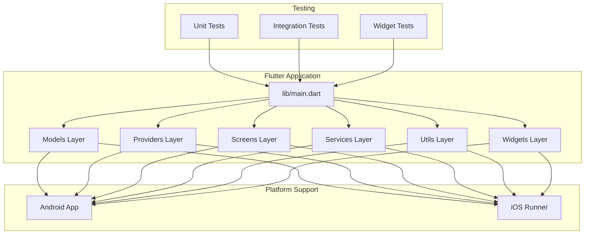
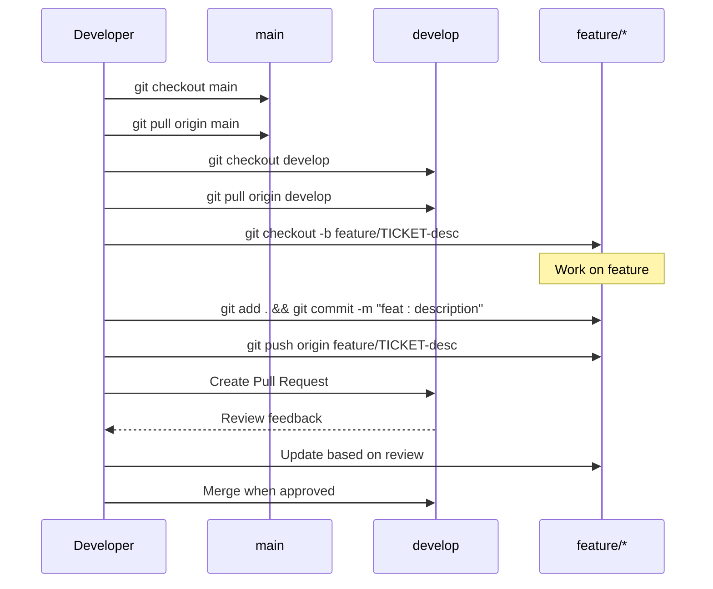
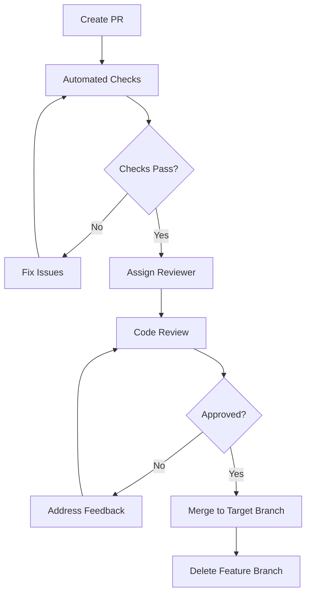
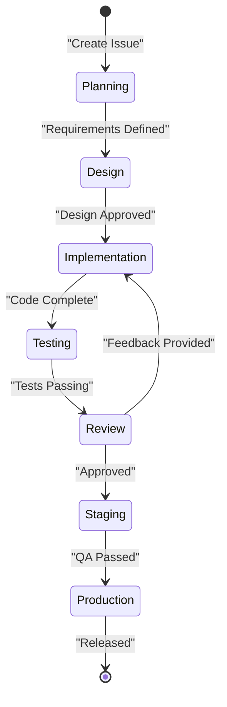
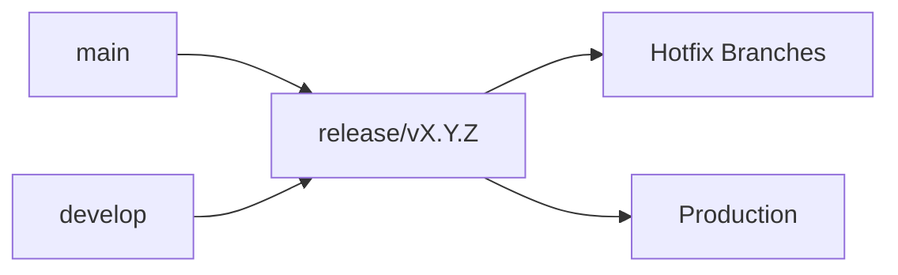
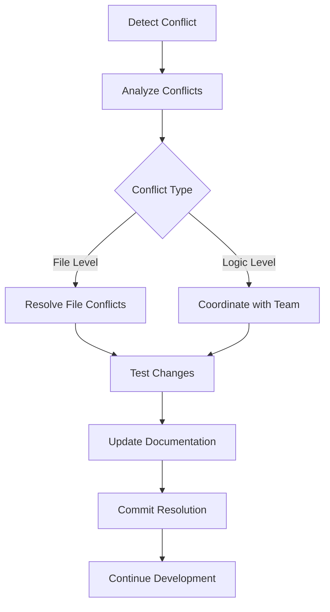

# Version Control & Collaboration

<cite>
**Referenced Files in This Document**
- [README.md](file://README.md)
- [AGENTS.md](file://AGENTS.md)
- [CLAUDE.md](file://CLAUDE.md)
- [PROJECT_BRIEF.md](file://docs/PROJECT_BRIEF.md)
- [TASKS.md](file://docs/TASKS.md)
- [ARCHITECTURE.md](file://docs/ARCHITECTURE.md)
- [pubspec.yaml](file://pubspec.yaml)
- [.gitignore](file://.gitignore)
</cite>

## Table of Contents
1. [Introduction](#introduction)
2. [Project Overview](#project-overview)
3. [Git Branching Strategy](#git-branching-strategy)
4. [Commit Message Conventions](#commit-message-conventions)
5. [Pull Request Workflow](#pull-request-workflow)
6. [Code Review Process](#code-review-process)
7. [Issue Tracking Guidelines](#issue-tracking-guidelines)
8. [Feature Development Lifecycle](#feature-development-lifecycle)
9. [Release Management](#release-management)
10. [Merge Conflict Resolution](#merge-conflict-resolution)
11. [Branch Hygiene](#branch-hygiene)
12. [Team Coordination](#team-coordination)
13. [Quality Gates](#quality-gates)
14. [Development Environment Setup](#development-environment-setup)
15. [Troubleshooting Guide](#troubleshooting-guide)
16. [Conclusion](#conclusion)

## Introduction

This document establishes comprehensive version control procedures and collaboration guidelines for the ASSINATURAS NINJA Flutter application project. The guidelines are designed to ensure consistent development practices, maintain code quality, and facilitate effective team collaboration across the mobile application development lifecycle.

The ASSINATURAS NINJA project is a Flutter-based subscription management application that requires structured development workflows to maintain code integrity, enable efficient feature development, and ensure smooth releases to both Android and iOS platforms.

## Project Overview

ASSINATURAS NINJA is a cross-platform mobile application built with Flutter, supporting both Android and iOS platforms. The project follows modern Flutter architecture patterns with clear separation of concerns across models, providers, screens, services, utilities, and widgets.

Key project characteristics:
- **Framework**: Flutter (Dart)
- **Platforms**: Android and iOS
- **Architecture**: Provider-based state management
- **Testing**: Comprehensive test coverage structure
- **Documentation**: Structured documentation system



**Diagram sources**
- [README.md](file://README.md)
- [ARCHITECTURE.md](file://docs/ARCHITECTURE.md)

**Section sources**
- [README.md](file://README.md)
- [PROJECT_BRIEF.md](file://docs/PROJECT_BRIEF.md)
- [ARCHITECTURE.md](file://docs/ARCHITECTURE.md)

## Git Branching Strategy

### Branch Naming Convention

All branches must follow the standardized naming convention to ensure clarity and automation compatibility:

| Branch Type | Pattern | Example | Description |
|-------------|---------|---------|-------------|
| Feature | `feature/[ticket-id]-[short-description]` | `feature/SUB-123-user-authentication` | New features or enhancements |
| Bug Fix | `bugfix/[ticket-id]-[short-description]` | `bugfix/SUB-456-login-crash-fix` | Bug fixes and corrections |
| Hotfix | `hotfix/[ticket-id]-[short-description]` | `hotfix/SUB-789-payment-error` | Critical production fixes |
| Release | `release/v[major].[minor].[patch]` | `release/v1.2.3` | Pre-release preparation |
| Documentation | `docs/[short-description]` | `docs/update-api-documentation` | Documentation improvements |
| Refactor | `refactor/[short-description]` | `refactor/state-management-upgrade` | Code refactoring without behavior changes |

### Branch Protection Rules

**Main Branch (`main`)**:
- Protected branch requiring pull request approval
- All changes must go through pull requests
- No direct commits allowed
- Must pass all CI checks before merge

**Development Branch (`develop`)**:
- Integration branch for feature testing
- Weekly release candidates merged here
- Requires at least one reviewer approval

### Branch Creation Workflow



**Diagram sources**
- [.gitignore](file://.gitignore)

**Section sources**
- [TASKS.md](file://docs/TASKS.md)

## Commit Message Conventions

### Commit Message Format

All commits must follow the Conventional Commits specification:

```
type(scope): description

[optional body]

[optional footer(s)]
```

### Commit Types

| Type | Description | Examples |
|------|-------------|----------|
| `feat` | A new feature | `feat(auth): add user authentication` |
| `fix` | A bug fix | `fix(payment): resolve payment timeout` |
| `docs` | Documentation only changes | `docs(readme): update installation guide` |
| `style` | Changes that do not affect meaning | `style(ui): format button components` |
| `refactor` | Code change that neither fixes nor adds feature | `refactor(state): migrate to provider v7` |
| `test` | Adding missing tests or correcting existing tests | `test(auth): add login validation tests` |
| `chore` | Changes to build process or auxiliary tools | `chore(deps): update flutter dependencies` |
| `perf` | A code change that improves performance | `perf(api): optimize data fetching` |
| `ci` | Changes to CI configuration files | `ci(github): add automated testing` |
| `build` | Changes that affect the build system | `build(android): update gradle version` |
| `revert` | Reverts a previous commit | `revert: undo payment changes` |

### Scope Guidelines

Scopes should reference specific areas of the application:
- `auth`: Authentication and authorization
- `payment`: Payment processing
- `subscription`: Subscription management
- `ui`: User interface components
- `api`: API integration
- `state`: State management
- `model`: Data models
- `service`: Business logic services
- `util`: Utility functions
- `config`: Configuration files

### Commit Examples

**Good Commits**:
- `feat(auth): implement biometric login`
- `fix(subscription): resolve renewal calculation error`
- `docs(api): update endpoint documentation`
- `refactor(state): migrate to Riverpod`
- `test(payment): add transaction validation tests`

**Bad Commits**:
- `update code`
- `fix stuff`
- `changes`
- `WIP`

**Section sources**
- [AGENTS.md](file://AGENTS.md)
- [CLAUDE.md](file://CLAUDE.md)

## Pull Request Workflow

### Pull Request Requirements

All code changes must go through pull requests with the following requirements:

**Mandatory Checks**:
- ✅ At least one reviewer approval
- ✅ All CI pipeline checks passing
- ✅ Unit tests passing (minimum 80% coverage)
- ✅ Code style and linting rules enforced
- ✅ No merge conflicts
- ✅ Updated documentation if needed

**PR Template Structure**:

```markdown
## Description
Brief description of changes

## Type of Change
- [ ] Bug fix
- [ ] New feature
- [ ] Breaking change
- [ ] Documentation update

## Testing
- [ ] Unit tests added/updated
- [ ] Manual testing completed
- [ ] Cross-platform testing verified

## Checklist
- [ ] Code follows style guidelines
- [ ] Self-review completed
- [ ] Documentation updated
- [ ] No breaking changes introduced
```

### Pull Request Review Process



**Diagram sources**
- [pubspec.yaml](file://pubspec.yaml)

**Section sources**
- [TASKS.md](file://docs/TASKS.md)

## Code Review Process

### Review Guidelines

**Reviewer Responsibilities**:
- Verify code quality and adherence to standards
- Check for potential bugs and security issues
- Ensure proper error handling
- Validate test coverage
- Confirm documentation updates
- Assess performance implications

**Author Responsibilities**:
- Address all review comments
- Keep PRs focused and manageable
- Provide clear descriptions of changes
- Respond to feedback promptly

### Review Checklist

**Code Quality**:
- [ ] Follows Dart/Flutter best practices
- [ ] Proper error handling implemented
- [ ] Memory leaks avoided
- [ ] Performance considerations addressed
- [ ] Security vulnerabilities checked

**Functionality**:
- [ ] Feature works as expected
- [ ] Edge cases handled
- [ ] Backward compatibility maintained
- [ ] Platform-specific considerations addressed

**Testing**:
- [ ] Unit tests cover critical paths
- [ ] Integration tests for complex flows
- [ ] UI tests for key user interactions
- [ ] Test coverage meets minimum requirements

**Documentation**:
- [ ] Code comments explain complex logic
- [ ] README updated if needed
- [ ] API documentation current
- [ ] Migration guides provided for breaking changes

**Section sources**
- [AGENTS.md](file://AGENTS.md)
- [CLAUDE.md](file://CLAUDE.md)

## Issue Tracking Guidelines

### Issue Categories

| Category | Prefix | Description | Priority |
|----------|--------|-------------|----------|
| Bug | `BUG` | Software defects or unexpected behavior | High |
| Feature | `FEAT` | New functionality or enhancements | Medium |
| Improvement | `IMPROV` | Code quality or performance improvements | Low |
| Documentation | `DOC` | Documentation updates or corrections | Low |
| Task | `TASK` | General tasks or maintenance items | Variable |

### Issue Template

```markdown
## Problem Description
Clear description of the issue or feature request

## Steps to Reproduce (for bugs)
1. Step one
2. Step two
3. Step three

## Expected Behavior
What should happen

## Actual Behavior
What actually happens

## Environment
- Flutter Version: 
- Platform: Android/iOS
- Device: 

## Additional Context
Screenshots, logs, or other relevant information
```

### Priority Levels

- **P0 (Critical)**: System down, data loss, security vulnerability
- **P1 (High)**: Major feature broken, significant usability impact
- **P2 (Medium)**: Minor feature issues, moderate impact
- **P3 (Low)**: Cosmetic issues, minor improvements

**Section sources**
- [PROJECT_BRIEF.md](file://docs/PROJECT_BRIEF.md)
- [TASKS.md](file://docs/TASKS.md)

## Feature Development Lifecycle

### Development Phases



**Diagram sources**
- [ARCHITECTURE.md](file://docs/ARCHITECTURE.md)

### Phase Details

**1. Planning Phase**:
- Create detailed issue with requirements
- Define acceptance criteria
- Estimate effort and complexity
- Identify dependencies and risks

**2. Design Phase**:
- Technical design document
- UI/UX mockups (if applicable)
- API contract definition
- Database schema changes

**3. Implementation Phase**:
- Feature branch creation
- Incremental development
- Regular commits with descriptive messages
- Continuous testing

**4. Testing Phase**:
- Unit test implementation
- Integration testing
- UI/UX validation
- Performance testing

**5. Review Phase**:
- Code review process
- QA testing
- Security review
- Documentation review

**6. Deployment Phase**:
- Staging deployment
- Production rollout
- Monitoring and validation
- Post-release verification

**Section sources**
- [ARCHITECTURE.md](file://docs/ARCHITECTURE.md)
- [TASKS.md](file://docs/TASKS.md)

## Release Management

### Version Numbering

Follow Semantic Versioning (SemVer) for all releases:

- **Major**: Incompatible API changes
- **Minor**: Backward-compatible functionality additions
- **Patch**: Backward-compatible bug fixes

### Release Branches



**Diagram sources**
- [.gitignore](file://.gitignore)

### Release Checklist

**Pre-Release**:
- [ ] All features tested and documented
- [ ] Breaking changes documented
- [ ] Migration guides prepared
- [ ] Changelog updated
- [ ] Version numbers synchronized

**Release Process**:
1. Create release branch from `develop`
2. Update version numbers in all files
3. Run full test suite
4. Generate build artifacts
5. Perform final QA testing
6. Merge to `main` and tag release
7. Deploy to app stores

**Post-Release**:
- Monitor error rates and performance
- Address critical issues immediately
- Update documentation
- Notify stakeholders

**Section sources**
- [pubspec.yaml](file://pubspec.yaml)
- [PROJECT_BRIEF.md](file://docs/PROJECT_BRIEF.md)

## Merge Conflict Resolution

### Prevention Strategies

**Regular Synchronization**:
- Frequently sync with target branch
- Small, frequent commits reduce conflict risk
- Clear communication about overlapping work

**Conflict Avoidance**:
- Coordinate with team members on shared files
- Use feature flags for experimental changes
- Modularize code to minimize overlap

### Resolution Process



### Best Practices

- Never auto-resolve conflicts without understanding changes
- Communicate with original authors when resolving logic conflicts
- Test thoroughly after conflict resolution
- Document any architectural decisions made during resolution

**Section sources**
- [AGENTS.md](file://AGENTS.md)

## Branch Hygiene

### Branch Maintenance

**Cleanup Schedule**:
- Delete merged branches weekly
- Archive old feature branches (>30 days)
- Clean up stale hotfix branches
- Regular audit of active branches

**Branch Policies**:
- Maximum branch age: 30 days
- Require regular updates from target branch
- Automatic cleanup of abandoned branches
- Mandatory branch naming compliance

### Repository Health

**Regular Maintenance Tasks**:
- Update dependencies monthly
- Clean up unused assets and files
- Optimize repository size
- Review and update `.gitignore`

**Monitoring**:
- Track branch count and age
- Monitor commit frequency and patterns
- Analyze merge conflict frequency
- Review code review turnaround times

**Section sources**
- [.gitignore](file://.gitignore)

## Team Coordination

### Communication Protocols

**Standup Updates**:
- What was accomplished yesterday
- What will be worked on today
- Any blockers or dependencies

**Weekly Sync**:
- Progress review on active features
- Upcoming release planning
- Technical debt discussion
- Knowledge sharing sessions

### Role Definitions

**Developer**:
- Implement features and fixes
- Write and maintain tests
- Participate in code reviews
- Document changes

**Code Reviewer**:
- Provide constructive feedback
- Ensure code quality standards
- Validate test coverage
- Approve or request changes

**Tech Lead**:
- Architectural decisions
- Code review approvals
- Technical guidance
- Release coordination

**Product Owner**:
- Requirement prioritization
- Acceptance criteria definition
- Stakeholder communication
- Release planning

### Collaboration Tools

**Version Control**: GitHub/GitLab
**Communication**: Slack/Teams
**Documentation**: Wiki/Confluence
**Project Management**: Jira/Trello
**Design**: Figma/Sketch

**Section sources**
- [AGENTS.md](file://AGENTS.md)
- [CLAUDE.md](file://CLAUDE.md)

## Quality Gates

### Automated Quality Checks

**Static Analysis**:
- Dart analyzer rules enforcement
- Code coverage minimum thresholds
- Security scanning
- Dependency vulnerability checks

**Testing Requirements**:
- Unit test coverage: ≥80%
- Integration test coverage: ≥60%
- UI test coverage: ≥40%
- All tests must pass before merge

**Performance Gates**:
- App startup time limits
- Memory usage thresholds
- Network request optimization
- Image asset optimization

### Manual Quality Gates

**Code Review**:
- Minimum one reviewer approval
- Architecture review for major changes
- Security review for sensitive changes
- UX review for interface changes

**Testing Gates**:
- Manual testing on target devices
- Cross-platform compatibility verification
- Performance regression testing
- Accessibility compliance check

**Documentation Gates**:
- API documentation updates
- User guide modifications
- Migration guides for breaking changes
- Release notes preparation

**Section sources**
- [AGENTS.md](file://AGENTS.md)
- [CLAUDE.md](file://CLAUDE.md)

## Development Environment Setup

### Prerequisites

**Required Software**:
- Flutter SDK (latest stable version)
- Dart SDK (bundled with Flutter)
- Android Studio / VS Code
- Xcode (for iOS development)
- Git

**Environment Variables**:
```bash
export FLUTTER_HOME=/path/to/flutter
export PATH="$FLUTTER_HOME/bin:$PATH"
export ANDROID_HOME=$HOME/Android/Sdk
export PATH="$ANDROID_HOME/cmdline-tools/latest/bin:$PATH"
```

### Project Setup

**Initial Setup**:
```bash
git clone <repository-url>
cd assinaturas-ninja
flutter pub get
flutter doctor
flutter run
```

**Configuration Files**:
- `pubspec.yaml`: Dependencies and metadata
- `analysis_options.yaml`: Code analysis rules
- `.gitignore`: Ignored files and directories

### IDE Configuration

**VS Code Extensions**:
- Dart
- Flutter
- Prettier
- Error Lens
- GitLens

**Android Studio Plugins**:
- Flutter
- Dart
- Key Promoter X
- Rainbow Brackets

**Section sources**
- [pubspec.yaml](file://pubspec.yaml)
- [analysis_options.yaml](file://analysis_options.yaml)
- [.gitignore](file://.gitignore)

## Troubleshooting Guide

### Common Issues

**Flutter Setup Problems**:
- Flutter doctor shows errors
- Android/iOS platform detection fails
- Emulator/simulator connectivity issues

**Build Issues**:
- Gradle build failures (Android)
- CocoaPods dependency problems (iOS)
- Missing certificates or provisioning profiles

**Development Issues**:
- Hot reload not working
- Memory leaks during development
- Performance profiling challenges

### Resolution Steps

**Systematic Approach**:
1. Check Flutter doctor output
2. Clean build artifacts
3. Update dependencies
4. Restart development environment
5. Check system requirements

**Logging and Debugging**:
- Enable verbose logging
- Use Flutter devtools
- Check device logs
- Profile memory and CPU usage

**Escalation Procedures**:
- Document the issue and steps taken
- Search existing issues and solutions
- Consult team documentation
- Escalate to tech lead if unresolved

**Section sources**
- [AGENTS.md](file://AGENTS.md)
- [CLAUDE.md](file://CLAUDE.md)

## Conclusion

These version control and collaboration guidelines establish a solid foundation for effective development practices in the ASSINATURAS NINJA project. By following these procedures, the team can maintain code quality, facilitate smooth collaboration, and deliver reliable software updates consistently.

Key benefits of implementing these guidelines:
- **Consistency**: Standardized processes across the team
- **Quality**: Automated and manual quality gates
- **Efficiency**: Streamlined development workflow
- **Reliability**: Predictable release cycles
- **Collaboration**: Clear communication and responsibility definitions

Regular review and adaptation of these guidelines ensures they remain relevant and effective as the project evolves and the team grows.