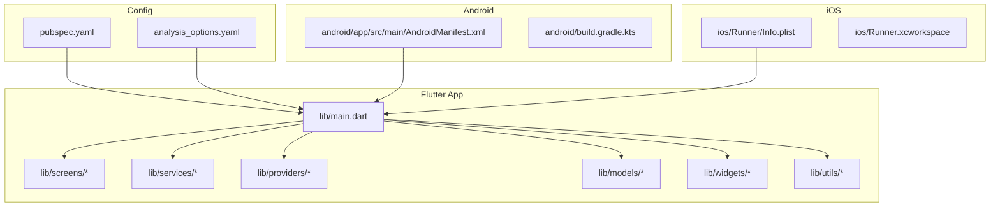
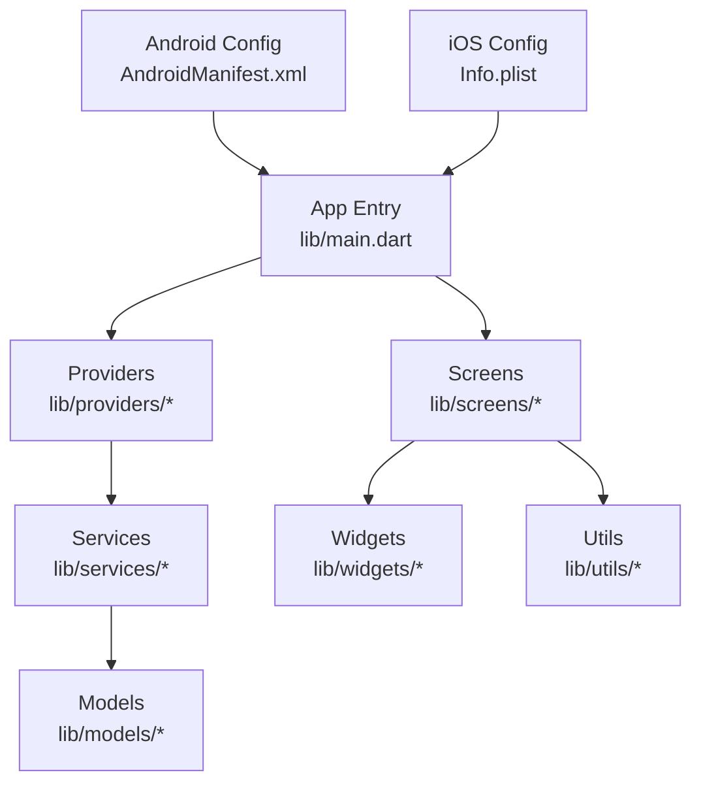
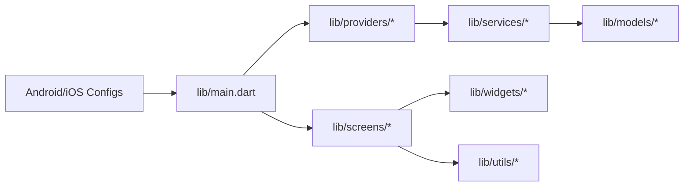

# Getting Started

<cite>
**Referenced Files in This Document**
- [README.md](file://README.md)
- [pubspec.yaml](file://pubspec.yaml)
- [lib/main.dart](file://lib/main.dart)
- [android/app/src/main/AndroidManifest.xml](file://android/app/src/main/AndroidManifest.xml)
- [ios/Runner/Info.plist](file://ios/Runner/Info.plist)
- [docs/IOS_GUIDE.md](file://docs/IOS_GUIDE.md)
- [analysis_options.yaml](file://analysis_options.yaml)
</cite>

## Table of Contents
1. [Introduction](#introduction)
2. [Project Structure](#project-structure)
3. [Core Components](#core-components)
4. [Architecture Overview](#architecture-overview)
5. [Detailed Component Analysis](#detailed-component-analysis)
6. [Dependency Analysis](#dependency-analysis)
7. [Performance Considerations](#performance-considerations)
8. [Troubleshooting Guide](#troubleshooting-guide)
9. [Conclusion](#conclusion)
10. [Appendices](#appendices)

## Introduction
ASSINATURAS NINJA is a Flutter-based mobile application focused on subscription management. It helps users track, organize, and manage their subscriptions with a clean, modern interface. The app targets both Android and iOS platforms using a single codebase.

This guide will help you set up your development environment, install dependencies, build, and run the app on Android and iOS. It also includes an overview of the project structure, common development tasks (debugging, logs), and basic troubleshooting tips for first-time contributors.

## Project Structure
The repository follows standard Flutter conventions:
- lib: Dart source code for the app (screens, services, providers, models, widgets, utilities)
- android: Android platform configuration and Gradle build files
- ios: iOS platform configuration and Xcode workspace
- test: Unit and widget tests
- docs: Documentation including architecture, UI guide, and platform-specific guides
- assets: Static resources such as branding assets
- pubspec.yaml: Flutter package manifest and dependency declarations
- analysis_options.yaml: Static analysis rules

**Diagram sources**
- [lib/main.dart](file://lib/main.dart)
- [pubspec.yaml](file://pubspec.yaml)
- [android/app/src/main/AndroidManifest.xml](file://android/app/src/main/AndroidManifest.xml)
- [ios/Runner/Info.plist](file://ios/Runner/Info.plist)
- [analysis_options.yaml](file://analysis_options.yaml)

**Section sources**
- [README.md](file://README.md)
- [pubspec.yaml](file://pubspec.yaml)
- [lib/main.dart](file://lib/main.dart)
- [android/app/src/main/AndroidManifest.xml](file://android/app/src/main/AndroidManifest.xml)
- [ios/Runner/Info.plist](file://ios/Runner/Info.plist)
- [analysis_options.yaml](file://analysis_options.yaml)

## Core Components
At runtime, the Flutter app initializes from the main entry point and wires together core modules such as screens, services, providers, models, and reusable widgets. The top-level file configures the app theme, routes, and global state providers. Platform-specific configurations are handled by Android’s manifest and iOS’s Info.plist.

Key responsibilities:
- Entry point initialization and app bootstrap
- Dependency injection via providers
- Data access through services
- UI composition across screens and widgets
- Cross-platform configuration via platform manifests

**Section sources**
- [lib/main.dart](file://lib/main.dart)
- [android/app/src/main/AndroidManifest.xml](file://android/app/src/main/AndroidManifest.xml)
- [ios/Runner/Info.plist](file://ios/Runner/Info.plist)

## Architecture Overview
The app follows a layered approach:
- Presentation layer: Screens and widgets render UI and handle user interactions
- State layer: Providers manage reactive state and business logic
- Data layer: Services encapsulate data access and external integrations
- Domain layer: Models represent core entities and validation rules
- Infrastructure: Platform configurations and shared utilities

**Diagram sources**
- [lib/main.dart](file://lib/main.dart)
- [android/app/src/main/AndroidManifest.xml](file://android/app/src/main/AndroidManifest.xml)
- [ios/Runner/Info.plist](file://ios/Runner/Info.plist)

## Detailed Component Analysis

### Entry Point and Initialization
The application bootstraps from the main entry file, which typically sets up the app theme, routes, and global providers. Ensure that any required plugins or services are registered before running the app.

Common tasks:
- Verify provider setup and initialization order
- Confirm platform permissions are declared where needed
- Check that assets and fonts are referenced correctly

**Section sources**
- [lib/main.dart](file://lib/main.dart)

### Android Configuration
Android settings are defined in the manifest and Gradle files. For most development runs, default values are sufficient. If you need to adjust permissions or app metadata, update the manifest accordingly.

Typical considerations:
- Package name and versioning
- Permissions for network, storage, etc.
- MinSdkVersion and compileSdkVersion compatibility

**Section sources**
- [android/app/src/main/AndroidManifest.xml](file://android/app/src/main/AndroidManifest.xml)

### iOS Configuration
iOS settings are managed via Info.plist and the Xcode workspace. Ensure signing and deployment target settings match your development machine and device capabilities.

Typical considerations:
- Bundle identifier and versioning
- Privacy permissions (e.g., network usage)
- Deployment target and signing configuration

For detailed steps, consult the iOS guide included in the documentation folder.

**Section sources**
- [ios/Runner/Info.plist](file://ios/Runner/Info.plist)
- [docs/IOS_GUIDE.md](file://docs/IOS_GUIDE.md)

### Dependencies and Package Management
Dependencies are declared in the package manifest. After cloning the repo, fetch all packages before building.

Recommended workflow:
- Install Flutter SDK and ensure it is on PATH
- Run dependency installation command
- Optionally analyze code quality using static analysis rules

**Section sources**
- [pubspec.yaml](file://pubspec.yaml)
- [analysis_options.yaml](file://analysis_options.yaml)

## Dependency Analysis
The following diagram shows how the main entry depends on core layers and platform configurations.

**Diagram sources**
- [lib/main.dart](file://lib/main.dart)
- [android/app/src/main/AndroidManifest.xml](file://android/app/src/main/AndroidManifest.xml)
- [ios/Runner/Info.plist](file://ios/Runner/Info.plist)

**Section sources**
- [pubspec.yaml](file://pubspec.yaml)
- [lib/main.dart](file://lib/main.dart)

## Performance Considerations
- Keep provider state minimal and avoid unnecessary rebuilds by using selective listeners
- Prefer lazy loading for heavy screens or large datasets
- Use efficient image formats and cache assets appropriately
- Profile CPU and memory usage during development to identify bottlenecks

[No sources needed since this section provides general guidance]

## Troubleshooting Guide

### Common Setup Issues
- Flutter not found or outdated: Ensure Flutter SDK is installed and updated; verify PATH configuration
- Missing dependencies: Re-run dependency installation after pulling changes
- Android build issues: Validate Gradle wrapper and Java/Kotlin versions; sync Gradle project
- iOS build issues: Confirm CocoaPods installation and Xcode toolchain; review signing settings

### Running the App
- Start the app in debug mode on a connected device or emulator/simulator
- Use hot reload to iterate quickly on UI changes
- Attach a debugger if deeper inspection is needed

### Accessing Logs
- Use the framework logging API to print diagnostic messages
- Filter logs by tag or severity when debugging complex flows
- On iOS, use Xcode console; on Android, use Android Studio Logcat

### Basic Checks
- Verify platform permissions are declared if features require them
- Ensure assets and fonts are referenced consistently
- Confirm that local.properties (Android) and iOS workspace are configured for your machine

**Section sources**
- [docs/IOS_GUIDE.md](file://docs/IOS_GUIDE.md)
- [android/app/src/main/AndroidManifest.xml](file://android/app/src/main/AndroidManifest.xml)
- [ios/Runner/Info.plist](file://ios/Runner/Info.plist)

## Conclusion
You should now be able to set up the ASSINATURAS NINJA project, install dependencies, and run the app on Android and iOS. Use the provided structure and guidelines to navigate the codebase, implement new features, and troubleshoot common issues. Refer to the documentation folder for deeper insights into architecture, UI patterns, and platform specifics.

[No sources needed since this section summarizes without analyzing specific files]

## Appendices

### Installation Requirements
- Flutter SDK (latest stable recommended)
- Android Studio with Android SDK and emulators
- Xcode and iOS Simulator (for macOS)
- Git for version control

### Step-by-Step Build and Run
- Clone the repository
- Install dependencies
- Connect a device or start an emulator/simulator
- Run the app in debug mode
- Use hot reload and attach a debugger as needed

**Section sources**
- [README.md](file://README.md)
- [pubspec.yaml](file://pubspec.yaml)
- [docs/IOS_GUIDE.md](file://docs/IOS_GUIDE.md)