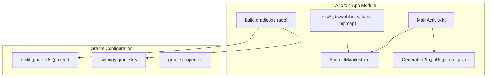
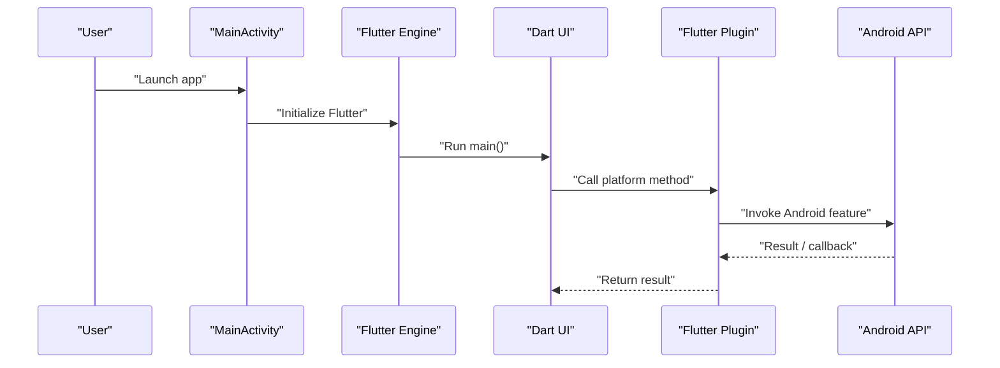
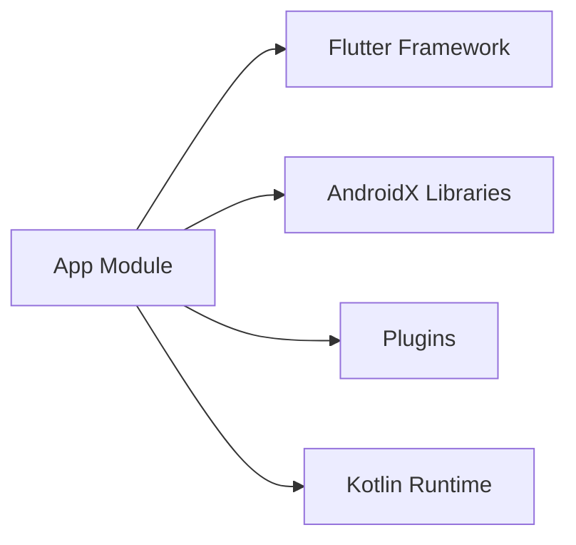

# Android Integration

<cite>
**Referenced Files in This Document**
- [MainActivity.kt](file://android/app/src/main/kotlin/br/com/assinaturasninja/assinaturas_ninja/MainActivity.kt)
- [build.gradle.kts (app)](file://android/app/build.gradle.kts)
- [AndroidManifest.xml](file://android/app/src/main/AndroidManifest.xml)
- [build.gradle.kts (project)](file://android/build.gradle.kts)
- [settings.gradle.kts](file://android/settings.gradle.kts)
- [GeneratedPluginRegistrant.java](file://android/app/src/main/java/io/flutter/plugins/GeneratedPluginRegistrant.java)
- [launch_background.xml](file://android/app/src/main/res/drawable/launch_background.xml)
- [colors.xml](file://android/app/src/main/res/values/colors.xml)
- [styles.xml](file://android/app/src/main/res/values/styles.xml)
</cite>

## Table of Contents
1. [Introduction](#introduction)
2. [Project Structure](#project-structure)
3. [Core Components](#core-components)
4. [Architecture Overview](#architecture-overview)
5. [Detailed Component Analysis](#detailed-component-analysis)
6. [Dependency Analysis](#dependency-analysis)
7. [Performance Considerations](#performance-considerations)
8. [Troubleshooting Guide](#troubleshooting-guide)
9. [Conclusion](#conclusion)

## Introduction
This document explains how the ASSINATURAS NINJA Flutter application integrates with the Android platform. It covers the native entry point, Kotlin configuration, build settings, manifest declarations, plugin registration, and best practices for extending Android-specific functionality through plugins. It also includes guidance for debugging, profiling, and troubleshooting Android deployments.

## Project Structure
The Android module follows standard Flutter conventions:
- Application source code under android/app/src/main
- Build scripts at the app and project level
- Resources for launch screen, colors, and styles
- Generated plugin registrant for automatic plugin initialization

**Diagram sources**
- [MainActivity.kt](file://android/app/src/main/kotlin/br/com/assinaturasninja/assinaturas_ninja/MainActivity.kt)
- [AndroidManifest.xml](file://android/app/src/main/AndroidManifest.xml)
- [build.gradle.kts (app)](file://android/app/build.gradle.kts)
- [build.gradle.kts (project)](file://android/build.gradle.kts)
- [settings.gradle.kts](file://android/settings.gradle.kts)
- [GeneratedPluginRegistrant.java](file://android/app/src/main/java/io/flutter/plugins/GeneratedPluginRegistrant.java)

**Section sources**
- [MainActivity.kt](file://android/app/src/main/kotlin/br/com/assinaturasninja/assinaturas_ninja/MainActivity.kt)
- [AndroidManifest.xml](file://android/app/src/main/AndroidManifest.xml)
- [build.gradle.kts (app)](file://android/app/build.gradle.kts)
- [build.gradle.kts (project)](file://android/build.gradle.kts)
- [settings.gradle.kts](file://android/settings.gradle.kts)
- [GeneratedPluginRegistrant.java](file://android/app/src/main/java/io/flutter/plugins/GeneratedPluginRegistrant.java)

## Core Components
- MainActivity: The Android Activity that hosts the Flutter engine and can be extended for platform-specific behavior.
- AndroidManifest.xml: Declares permissions, activities, services, receivers, and other components required by the app and plugins.
- Gradle build files: Configure dependencies, compile options, signing, and optimization for debug/profile/release builds.
- GeneratedPluginRegistrant: Automatically registers Flutter plugins during startup.
- Resources: Launch background, theme colors, and styles used by the Android UI layer.

Key responsibilities:
- Initialize Flutter and host the Dart UI
- Provide hooks for Android lifecycle events
- Register plugins and native capabilities
- Apply build-time configurations for performance and packaging

**Section sources**
- [MainActivity.kt](file://android/app/src/main/kotlin/br/com/assinaturasninja/assinaturas_ninja/MainActivity.kt)
- [AndroidManifest.xml](file://android/app/src/main/AndroidManifest.xml)
- [build.gradle.kts (app)](file://android/app/build.gradle.kts)
- [build.gradle.kts (project)](file://android/build.gradle.kts)
- [settings.gradle.kts](file://android/settings.gradle.kts)
- [GeneratedPluginRegistrant.java](file://android/app/src/main/java/io/flutter/plugins/GeneratedPluginRegistrant.java)
- [launch_background.xml](file://android/app/src/main/res/drawable/launch_background.xml)
- [colors.xml](file://android/app/src/main/res/values/colors.xml)
- [styles.xml](file://android/app/src/main/res/values/styles.xml)

## Architecture Overview
Flutter’s Android architecture centers on an Activity hosting the Flutter engine. Plugins bridge Dart and Android APIs via MethodChannel or PlatformChannel. The generated registrant wires plugins automatically.

**Diagram sources**
- [MainActivity.kt](file://android/app/src/main/kotlin/br/com/assinaturasninja/assinaturas_ninja/MainActivity.kt)
- [GeneratedPluginRegistrant.java](file://android/app/src/main/java/io/flutter/plugins/GeneratedPluginRegistrant.java)

## Detailed Component Analysis

### MainActivity Implementation
Purpose:
- Hosts the Flutter view and lifecycle
- Optional overrides for deep linking, window insets, and custom initialization
- Entry point for adding Android-specific logic before Flutter starts

Common extension points:
- Override lifecycle callbacks to integrate Android features
- Configure system UI insets and navigation bar handling
- Initialize third-party SDKs before Flutter renders

Best practices:
- Keep initialization lightweight; defer heavy work to background threads
- Avoid blocking the main thread during onCreate/onResume
- Use platform channels for controlled communication with Dart

**Section sources**
- [MainActivity.kt](file://android/app/src/main/kotlin/br/com/assinaturasninja/assinaturas_ninja/MainActivity.kt)

### Kotlin Configuration
Kotlin is configured at the project and app levels:
- Compile options (language version, JVM target)
- Dependency versions managed centrally
- AndroidX and core libraries aligned with Flutter tooling

Recommendations:
- Align Kotlin and AGP versions with Flutter’s expectations
- Enable consistent language features across modules
- Centralize dependency versions to avoid conflicts

**Section sources**
- [build.gradle.kts (project)](file://android/build.gradle.kts)
- [build.gradle.kts (app)](file://android/app/build.gradle.kts)

### Build Configuration (Gradle)
App-level build script typically configures:
- Application ID, version, and minSdk/targetSdk
- Dependencies for AndroidX and plugins
- SigningConfigs and buildTypes (debug, profile, release)
- Resource processing and packaging options

Project-level build script typically configures:
- Repositories and plugin classpaths
- Shared Kotlin and AndroidX versions
- Aggregated tasks and global settings

Optimization tips:
- Use resource shrinking and R8 for release builds
- Enable incremental compilation and parallel builds
- Pin dependency versions to ensure reproducible builds

**Section sources**
- [build.gradle.kts (app)](file://android/app/build.gradle.kts)
- [build.gradle.kts (project)](file://android/build.gradle.kts)
- [settings.gradle.kts](file://android/settings.gradle.kts)

### AndroidManifest.xml
The manifest declares:
- Permissions required by the app and plugins
- Activities, services, broadcast receivers, and content providers
- Intent filters for deep links and actions
- Application-level metadata and icons

Guidelines:
- Declare only needed permissions to minimize attack surface
- Ensure activity aliases and intent filters match Flutter routing
- Validate all component names and categories

**Section sources**
- [AndroidManifest.xml](file://android/app/src/main/AndroidManifest.xml)

### Native Code Integration Patterns
Integration approaches:
- Flutter plugins: Define Dart interfaces and implement Android side with MethodChannel
- Direct calls from MainActivity: For app-specific integrations not packaged as plugins
- Background execution: Services and WorkManager for long-running tasks

Patterns:
- Use MethodChannel for synchronous calls
- Use EventChannel for streaming data
- Serialize data carefully; prefer JSON or protobuf for complex payloads

Security considerations:
- Validate inputs from Dart before calling sensitive Android APIs
- Avoid exposing internal state over channels unnecessarily

**Section sources**
- [MainActivity.kt](file://android/app/src/main/kotlin/br/com/assinaturasninja/assinaturas_ninja/MainActivity.kt)
- [GeneratedPluginRegistrant.java](file://android/app/src/main/java/io/flutter/plugins/GeneratedPluginRegistrant.java)

### Plugin Development for Android
Steps:
- Create a new Android module or add to existing app module
- Implement MethodChannel handlers in Kotlin
- Expose methods annotated for Flutter invocation
- Register the plugin so it initializes automatically

Testing:
- Unit test channel handlers with mock contexts
- Instrumented tests for UI interactions
- Verify error paths and permission flows

**Section sources**
- [GeneratedPluginRegistrant.java](file://android/app/src/main/java/io/flutter/plugins/GeneratedPluginRegistrant.java)

### Accessing Android-Specific APIs Through Flutter Plugins
Recommended flow:
- Define Dart API
- Implement Android handler
- Handle threading and lifecycle
- Return results or stream events back to Dart

Error handling:
- Map Android exceptions to clear Dart errors
- Provide fallbacks when features are unavailable

**Section sources**
- [MainActivity.kt](file://android/app/src/main/kotlin/br/com/assinaturasninja/assinaturas_ninja/MainActivity.kt)
- [GeneratedPluginRegistrant.java](file://android/app/src/main/java/io/flutter/plugins/GeneratedPluginRegistrant.java)

### Resources and Theming
- Launch background drawable controls the splash appearance
- Colors and styles define default themes and night mode support
- Mipmap resources provide app icons for various densities

Tips:
- Keep launch assets small to reduce cold start time
- Use vector drawables where possible
- Test dark mode thoroughly

**Section sources**
- [launch_background.xml](file://android/app/src/main/res/drawable/launch_background.xml)
- [colors.xml](file://android/app/src/main/res/values/colors.xml)
- [styles.xml](file://android/app/src/main/res/values/styles.xml)

## Dependency Analysis
The Android module depends on:
- Flutter engine and framework
- AndroidX libraries
- Third-party plugins declared in app build script
- Kotlin runtime and coroutines (if used)

**Diagram sources**
- [build.gradle.kts (app)](file://android/app/build.gradle.kts)
- [build.gradle.kts (project)](file://android/build.gradle.kts)
- [settings.gradle.kts](file://android/settings.gradle.kts)

**Section sources**
- [build.gradle.kts (app)](file://android/app/build.gradle.kts)
- [build.gradle.kts (project)](file://android/build.gradle.kts)
- [settings.gradle.kts](file://android/settings.gradle.kts)

## Performance Considerations
- ProGuard/R8: Enable for release builds to shrink and optimize code
- Resource optimization: Remove unused resources and compress images
- Startup time: Minimize work in onCreate; defer heavy initialization
- Threading: Offload network and disk I/O to background threads
- Memory: Avoid large bitmaps; use image caching libraries
- Network: Use connection pooling and efficient serialization

[No sources needed since this section provides general guidance]

## Troubleshooting Guide
Common issues and resolutions:
- Build failures: Align Kotlin and AGP versions; clean and rebuild
- Missing permissions: Add required permissions to manifest; request at runtime if applicable
- Crash on startup: Check logs with logcat; validate plugin registrations
- Slow cold start: Profile with Android Studio Profiler; reduce initialization work
- Resource conflicts: Resolve duplicate resources and library version mismatches

Debugging techniques:
- Use logcat filters for your package name
- Attach debugger to running process
- Inspect plugin registration order if features fail to initialize
- Validate manifest entries and intent filters

Profiling:
- CPU, memory, and network profiling via Android Studio
- Trace startup sequence to identify bottlenecks
- Monitor background task scheduling and battery impact

**Section sources**
- [AndroidManifest.xml](file://android/app/src/main/AndroidManifest.xml)
- [MainActivity.kt](file://android/app/src/main/kotlin/br/com/assinaturasninja/assinaturas_ninja/MainActivity.kt)
- [build.gradle.kts (app)](file://android/app/build.gradle.kts)

## Conclusion
The ASSINATURAS NINJA Android integration follows Flutter best practices: a minimal MainActivity, centralized Gradle configuration, explicit manifest declarations, and automatic plugin registration. Extend functionality by developing well-scoped plugins, keep initialization lean, and leverage Android Studio tools for debugging and performance tuning.

[No sources needed since this section summarizes without analyzing specific files]