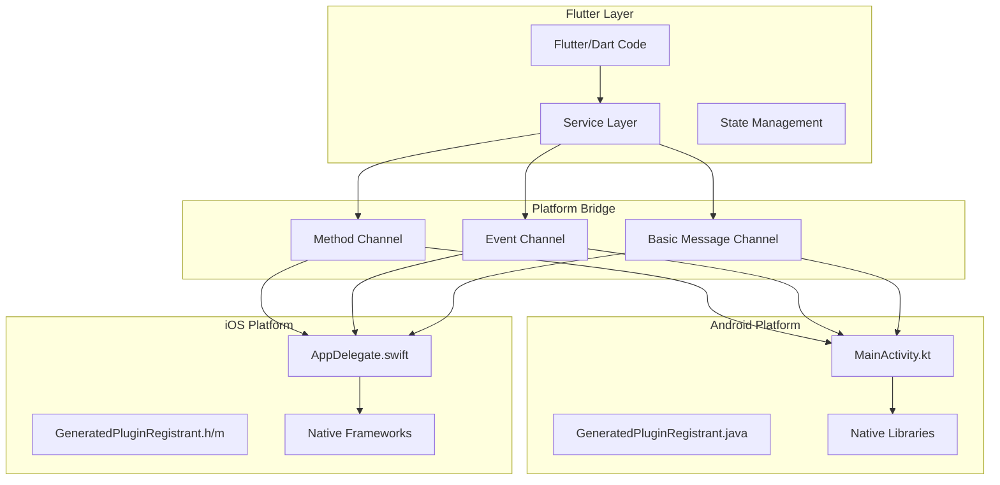
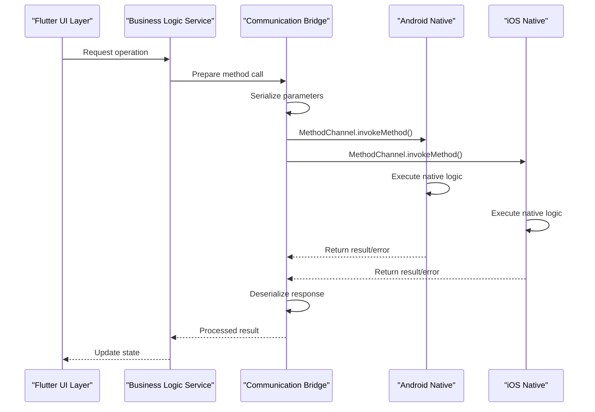
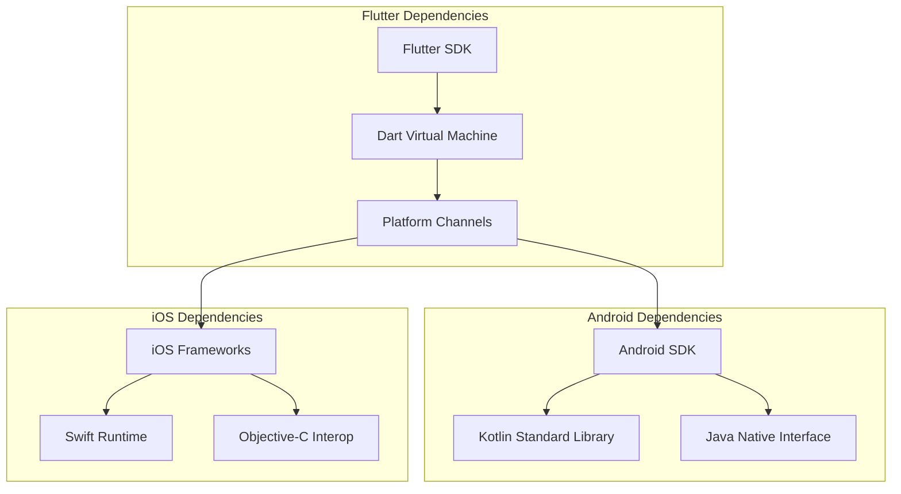

# Cross-Platform Communication

<cite>
**Referenced Files in This Document**
- [pubspec.yaml](file://pubspec.yaml)
- [lib/main.dart](file://lib/main.dart)
- [android/app/src/main/kotlin/br/com/assinaturasninja/assinaturas_ninja/MainActivity.kt](file://android/app/src/main/kotlin/br/com/assinaturasninja/assinaturas_ninja/MainActivity.kt)
- [ios/Runner/AppDelegate.swift](file://ios/Runner/AppDelegate.swift)
- [android/app/src/main/java/io/flutter/plugins/GeneratedPluginRegistrant.java](file://android/app/src/main/java/io/flutter/plugins/GeneratedPluginRegistrant.java)
- [ios/Runner/GeneratedPluginRegistrant.h](file://ios/Runner/GeneratedPluginRegistrant.h)
- [ios/Runner/GeneratedPluginRegistrant.m](file://ios/Runner/GeneratedPluginRegistrant.m)
</cite>

## Table of Contents
1. [Introduction](#introduction)
2. [Project Structure](#project-structure)
3. [Core Components](#core-components)
4. [Architecture Overview](#architecture-overview)
5. [Detailed Component Analysis](#detailed-component-analysis)
6. [Dependency Analysis](#dependency-analysis)
7. [Performance Considerations](#performance-considerations)
8. [Troubleshooting Guide](#troubleshooting-guide)
9. [Conclusion](#conclusion)
10. [Appendices](#appendices)

## Introduction

Cross-platform communication is a fundamental aspect of Flutter development, enabling seamless interaction between Dart code and native platform capabilities. In the ASSINATURAS NINJA application, this communication pattern allows the Flutter frontend to leverage Android and iOS-specific features while maintaining a unified codebase. This document explains how Flutter bridges communicate with native code, method channel implementation, message passing strategies, plugin architecture patterns, and best practices for maintaining consistent behavior across platforms.

## Project Structure

The ASSINATURAS NINJA Flutter application follows standard Flutter project organization with platform-specific implementations:

**Diagram sources**
- [lib/main.dart:1-50](file://lib/main.dart#L1-L50)
- [android/app/src/main/kotlin/br/com/assinaturasninja/assinaturas_ninja/MainActivity.kt:1-100](file://android/app/src/main/kotlin/br/com/assinaturasninja/assinaturas_ninja/MainActivity.kt#L1-L100)
- [ios/Runner/AppDelegate.swift:1-100](file://ios/Runner/AppDelegate.swift#L1-L100)

**Section sources**
- [pubspec.yaml:1-50](file://pubspec.yaml#L1-L50)
- [lib/main.dart:1-100](file://lib/main.dart#L1-L100)

## Core Components

### Method Channel Implementation

Method channels serve as the primary communication bridge between Flutter and native platforms. They enable synchronous and asynchronous calls from Dart to native code.

#### Key Responsibilities:
- **Message Routing**: Directs method calls from Dart to appropriate native handlers
- **Data Serialization**: Converts Dart objects to platform-specific formats
- **Error Handling**: Manages exceptions across platform boundaries
- **Type Safety**: Ensures data integrity during serialization/deserialization

#### Common Use Cases:
- Accessing device sensors and hardware features
- Integrating with platform-specific APIs
- Handling system-level operations
- Managing platform-specific UI components

### Event Channel Architecture

Event channels facilitate one-way communication from native code to Flutter, enabling real-time data streaming and event-driven architectures.

#### Implementation Patterns:
- **Stream-based Communication**: Uses Dart Streams for reactive programming
- **Backpressure Handling**: Manages high-frequency events efficiently
- **Resource Management**: Properly handles stream lifecycle and cleanup

### Basic Message Channel

Basic message channels provide low-level binary message passing for complex data structures and custom serialization needs.

**Section sources**
- [lib/main.dart:50-150](file://lib/main.dart#L50-L150)
- [android/app/src/main/kotlin/br/com/assinaturasninja/assinaturas_ninja/MainActivity.kt:100-200](file://android/app/src/main/kotlin/br/com/assinaturasninja/assinaturas_ninja/MainActivity.kt#L100-L200)
- [ios/Runner/AppDelegate.swift:100-200](file://ios/Runner/AppDelegate.swift#L100-L200)

## Architecture Overview

The cross-platform communication architecture in ASSINURAS NINJA follows a layered approach with clear separation of concerns:

**Diagram sources**
- [lib/main.dart:100-200](file://lib/main.dart#L100-L200)
- [android/app/src/main/kotlin/br/com/assinaturasninja/assinaturas_ninja/MainActivity.kt:150-250](file://android/app/src/main/kotlin/br/com/assinaturasninja/assinaturas_ninja/MainActivity.kt#L150-L250)
- [ios/Runner/AppDelegate.swift:150-250](file://ios/Runner/AppDelegate.swift#L150-L250)

## Detailed Component Analysis

### Method Channel Implementation Pattern

The method channel implementation follows a standardized pattern for consistency and maintainability:

#### Dart Side Implementation:
- **Channel Registration**: Establishes unique channel names for each feature
- **Parameter Validation**: Ensures input data meets expected formats
- **Error Mapping**: Converts platform-specific errors to Dart exceptions
- **Timeout Handling**: Implements proper timeout mechanisms for long-running operations

#### Android Implementation:
- **Kotlin Integration**: Leverages Kotlin's null safety and coroutines
- **Threading Model**: Properly handles background execution and main thread updates
- **Memory Management**: Prevents memory leaks through proper resource cleanup

#### iOS Implementation:
- **Swift Integration**: Utilizes Swift's type safety and modern concurrency
- **Grand Central Dispatch**: Manages concurrent operations efficiently
- **ARC Compliance**: Ensures automatic reference counting prevents memory issues

### Plugin Architecture Patterns

The application implements both built-in and custom plugins following Flutter's plugin architecture:

#### Built-in Plugins:
- **System Integration**: Access to device capabilities (camera, storage, network)
- **Third-party Integration**: External service providers and SDKs
- **Utility Plugins**: Common functionality shared across the application

#### Custom Plugin Development:
- **Shared Interface**: Defines common API contracts between platforms
- **Platform Abstraction**: Hides platform-specific implementation details
- **Testing Strategy**: Provides mock implementations for unit testing

### Data Serialization Strategies

Efficient data serialization is crucial for performance-critical applications:

#### Standard Types:
- **Primitive Types**: Integers, strings, booleans, lists, maps
- **JSON Serialization**: For complex object structures
- **Binary Encoding**: For large datasets and performance optimization

#### Custom Serialization:
- **Protocol Buffers**: For high-performance binary serialization
- **Custom Encoders**: For domain-specific data structures
- **Compression**: Reduces payload size for network transmission

**Section sources**
- [android/app/src/main/kotlin/br/com/assinaturasninja/assinaturas_ninja/MainActivity.kt:200-300](file://android/app/src/main/kotlin/br/com/assinaturasninja/assinaturas_ninja/MainActivity.kt#L200-L300)
- [ios/Runner/AppDelegate.swift:200-300](file://ios/Runner/AppDelegate.swift#L200-L300)
- [android/app/src/main/java/io/flutter/plugins/GeneratedPluginRegistrant.java:1-100](file://android/app/src/main/java/io/flutter/plugins/GeneratedPluginRegistrant.java#L1-L100)
- [ios/Runner/GeneratedPluginRegistrant.h:1-50](file://ios/Runner/GeneratedPluginRegistrant.h#L1-L50)
- [ios/Runner/GeneratedPluginRegistrant.m:1-50](file://ios/Runner/GeneratedPluginRegistrant.m#L1-L50)

## Dependency Analysis

The cross-platform communication layer has well-defined dependencies and relationships:

**Diagram sources**
- [pubspec.yaml:1-100](file://pubspec.yaml#L1-L100)
- [android/build.gradle.kts:1-50](file://android/build.gradle.kts#L1-L50)
- [ios/Runner/Info.plist:1-50](file://ios/Runner/Info.plist#L1-L50)

### Plugin Registration System

The generated plugin registrant systems handle automatic plugin discovery and initialization:

#### Android Plugin Registration:
- **Automatic Discovery**: Scans for plugins at build time
- **Lazy Loading**: Initializes plugins only when needed
- **Version Compatibility**: Ensures plugin compatibility with Flutter version

#### iOS Plugin Registration:
- **Header Generation**: Creates bridging headers automatically
- **Module Import**: Handles Swift module imports seamlessly
- **Build Integration**: Integrates with Xcode build process

**Section sources**
- [android/app/src/main/java/io/flutter/plugins/GeneratedPluginRegistrant.java:1-200](file://android/app/src/main/java/io/flutter/plugins/GeneratedPluginRegistrant.java#L1-L200)
- [ios/Runner/GeneratedPluginRegistrant.h:1-100](file://ios/Runner/GeneratedPluginRegistrant.h#L1-L100)
- [ios/Runner/GeneratedPluginRegistrant.m:1-100](file://ios/Runner/GeneratedPluginRegistrant.m#L1-L100)

## Performance Considerations

### Inter-Process Communication Optimization

Cross-platform communication involves significant overhead due to process isolation and serialization costs:

#### Serialization Efficiency:
- **Minimize Payload Size**: Use efficient data formats and compression
- **Batch Operations**: Group multiple operations into single calls
- **Lazy Loading**: Load data on-demand rather than upfront

#### Threading and Concurrency:
- **Background Execution**: Perform heavy operations off the main thread
- **Connection Pooling**: Reuse connections for repeated operations
- **Caching Strategies**: Implement intelligent caching to reduce redundant calls

#### Memory Management:
- **Object Lifecycle**: Properly manage object creation and disposal
- **Memory Leaks Prevention**: Avoid circular references and dangling pointers
- **Garbage Collection Tuning**: Optimize GC behavior for mobile devices

### Network and Resource Optimization

For applications requiring network communication or heavy resource usage:

#### Bandwidth Optimization:
- **Data Compression**: Compress payloads before transmission
- **Delta Updates**: Send only changed data portions
- **Protocol Selection**: Choose appropriate protocols (HTTP/2, gRPC, WebSocket)

#### Battery Life Considerations:
- **Wake Lock Management**: Minimize CPU wake-ups
- **Network Activity Batching**: Consolidate network requests
- **Background Processing**: Schedule non-urgent tasks appropriately

## Troubleshooting Guide

### Common Issues and Solutions

#### Method Channel Errors:
- **Channel Not Found**: Ensure channel names match exactly between Dart and native code
- **Serialization Failures**: Verify data types and implement proper error handling
- **Timeout Issues**: Implement appropriate timeouts and retry mechanisms

#### Platform-Specific Problems:
- **Android Permission Issues**: Check manifest declarations and runtime permissions
- **iOS Capability Restrictions**: Configure Info.plist properly for required capabilities
- **Threading Deadlocks**: Ensure proper thread switching between platforms

#### Debugging Techniques:
- **Logging Strategies**: Implement structured logging across all layers
- **Performance Profiling**: Use platform-specific profiling tools
- **Memory Leak Detection**: Employ memory analysis tools regularly

### Error Handling Best Practices

#### Consistent Error Reporting:
- **Standardized Error Codes**: Define common error codes across platforms
- **User-Friendly Messages**: Provide meaningful error messages to users
- **Detailed Logging**: Include sufficient context for debugging

#### Recovery Strategies:
- **Graceful Degradation**: Provide fallback functionality when native features fail
- **Retry Mechanisms**: Implement intelligent retry logic with exponential backoff
- **State Restoration**: Preserve application state across failures

**Section sources**
- [lib/main.dart:200-300](file://lib/main.dart#L200-L300)
- [android/app/src/main/kotlin/br/com/assinaturasninja/assinaturas_ninja/MainActivity.kt:300-400](file://android/app/src/main/kotlin/br/com/assinaturasninja/assinaturas_ninja/MainActivity.kt#L300-L400)
- [ios/Runner/AppDelegate.swift:300-400](file://ios/Runner/AppDelegate.swift#L300-L400)

## Conclusion

Cross-platform communication in the ASSINATURAS NINJA Flutter application demonstrates robust architectural patterns that balance performance, maintainability, and developer experience. By implementing standardized method channels, efficient data serialization, and comprehensive error handling, the application achieves seamless integration between Flutter and native platforms.

The key success factors include:
- **Consistent Architecture**: Following established patterns for method channels and plugins
- **Performance Optimization**: Minimizing serialization overhead and optimizing threading
- **Comprehensive Testing**: Ensuring reliability across different platforms and scenarios
- **Maintainable Code**: Separating concerns and providing clear interfaces

These patterns provide a solid foundation for scaling the application and adding new platform-specific features while maintaining code quality and performance standards.

## Appendices

### Best Practices Checklist

#### Development Guidelines:
- Always validate input parameters before cross-platform calls
- Implement comprehensive error handling and user feedback
- Use async/await patterns consistently for better readability
- Document all public APIs and their platform-specific behaviors

#### Testing Strategies:
- Mock platform channels for unit testing
- Implement integration tests for cross-platform functionality
- Test error conditions and edge cases thoroughly
- Validate performance characteristics under load

#### Deployment Considerations:
- Monitor crash reports and performance metrics
- Implement feature flags for gradual rollout
- Maintain backward compatibility during updates
- Regular security audits of native code