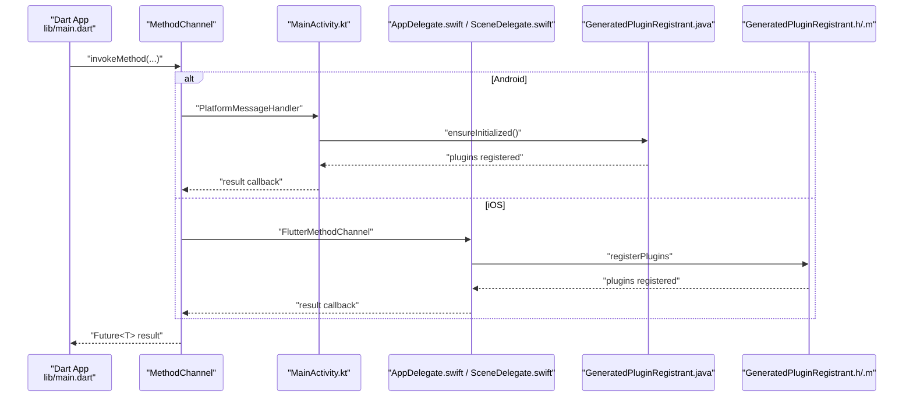
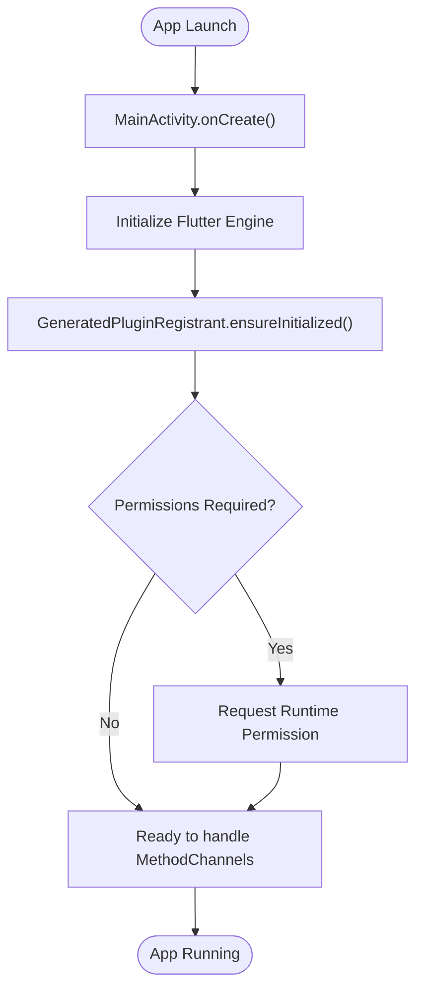
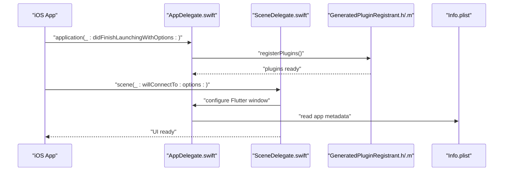
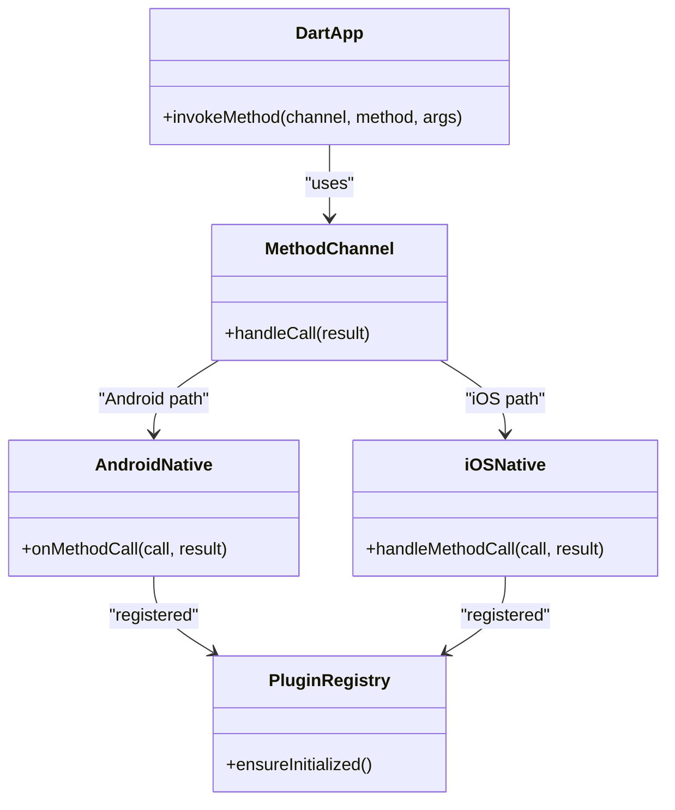
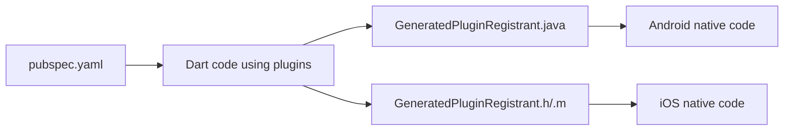

# Platform Integration

<cite>
**Referenced Files in This Document**
- [MainActivity.kt](file://android/app/src/main/kotlin/br/com/assinaturasninja/assinaturas_ninja/MainActivity.kt)
- [AndroidManifest.xml](file://android/app/src/main/AndroidManifest.xml)
- [build.gradle.kts (app)](file://android/app/build.gradle.kts)
- [build.gradle.kts (project)](file://android/build.gradle.kts)
- [gradle.properties](file://android/gradle.properties)
- [settings.gradle.kts](file://android/settings.gradle.kts)
- [GeneratedPluginRegistrant.java](file://android/app/src/main/java/io/flutter/plugins/GeneratedPluginRegistrant.java)
- [launch_background.xml](file://android/app/src/main/res/drawable/launch_background.xml)
- [colors.xml](file://android/app/src/main/res/values/colors.xml)
- [styles.xml](file://android/app/src/main/res/values/styles.xml)
- [AppDelegate.swift](file://ios/Runner/AppDelegate.swift)
- [SceneDelegate.swift](file://ios/Runner/SceneDelegate.swift)
- [Info.plist](file://ios/Runner/Info.plist)
- [GeneratedPluginRegistrant.h](file://ios/Runner/GeneratedPluginRegistrant.h)
- [GeneratedPluginRegistrant.m](file://ios/Runner/GeneratedPluginRegistrant.m)
- [AppFrameworkInfo.plist](file://ios/Flutter/AppFrameworkInfo.plist)
- [Debug.xcconfig](file://ios/Flutter/Debug.xcconfig)
- [Release.xcconfig](file://ios/Flutter/Release.xcconfig)
- [Main.storyboard](file://ios/Runner/Base.lproj/Main.storyboard)
- [LaunchScreen.storyboard](file://ios/Runner/Base.lproj/LaunchScreen.storyboard)
- [Contents.json (AppIcon)](file://ios/Runner/Assets.xcassets/AppIcon.appiconset/Contents.json)
- [Contents.json (LaunchImage)](file://ios/Runner/Assets.xcassets/LaunchImage.imageset/Contents.json)
- [main.dart](file://lib/main.dart)
- [pubspec.yaml](file://pubspec.yaml)
</cite>

## Table of Contents
1. Introduction
2. Project Structure
3. Core Components
4. Architecture Overview
5. Detailed Component Analysis
6. Dependency Analysis
7. Performance Considerations
8. Troubleshooting Guide
9. Conclusion

## Introduction
This document explains platform-specific integrations for the ASSINATURAS NINJA Flutter application across Android and iOS. It covers native entry points, permissions, plugin registration, build configuration, assets management, and deployment considerations. It also describes cross-platform communication patterns via Flutter’s method channel architecture and how plugins bridge Dart to native code on each platform.

## Project Structure
The repository follows standard Flutter project layout with platform folders android and ios containing native configurations and entry points. The Dart entry point is lib/main.dart, and dependencies are declared in pubspec.yaml.

```mermaid
graph TB
subgraph "Dart Layer"
main_dart["lib/main.dart"]
pubspec["pubspec.yaml"]
end
subgraph "Android"
manifest["AndroidManifest.xml"]
app_build["app/build.gradle.kts"]
proj_build["build.gradle.kts"]
gradle_props["gradle.properties"]
settings_gradle["settings.gradle.kts"]
generated_plugin_reg_android["GeneratedPluginRegistrant.java"]
activity["MainActivity.kt"]
res_drawable["res/drawable/launch_background.xml"]
res_values_colors["res/values/colors.xml"]
res_values_styles["res/values/styles.xml"]
end
subgraph "iOS"
info_plist["Info.plist"]
app_delegate["AppDelegate.swift"]
scene_delegate["SceneDelegate.swift"]
generated_plugin_reg_ios_h["GeneratedPluginRegistrant.h"]
generated_plugin_reg_ios_m["GeneratedPluginRegistrant.m"]
flutter_app_framework_info["Flutter/AppFrameworkInfo.plist"]
debug_xcconfig["Flutter/Debug.xcconfig"]
release_xcconfig["Flutter/Release.xcconfig"]
storyboard_main["Base.lproj/Main.storyboard"]
storyboard_launch["Base.lproj/LaunchScreen.storyboard"]
app_icon["Assets.xcassets/AppIcon.appiconset/Contents.json"]
launch_image["Assets.xcassets/LaunchImage.imageset/Contents.json"]
end
main_dart --> pubspec
main_dart --> activity
main_dart --> app_delegate
main_dart --> scene_delegate
activity --> manifest
activity --> generated_plugin_reg_android
app_delegate --> info_plist
app_delegate --> generated_plugin_reg_ios_h
app_delegate --> generated_plugin_reg_ios_m
scene_delegate --> storyboard_main
app_icon --> storyboard_launch
```

**Diagram sources**
- [MainActivity.kt](file://android/app/src/main/kotlin/br/com/assinaturasninja/assinaturas_ninja/MainActivity.kt)
- [AndroidManifest.xml](file://android/app/src/main/AndroidManifest.xml)
- [build.gradle.kts (app)](file://android/app/build.gradle.kts)
- [build.gradle.kts (project)](file://android/build.gradle.kts)
- [gradle.properties](file://android/gradle.properties)
- [settings.gradle.kts](file://android/settings.gradle.kts)
- [GeneratedPluginRegistrant.java](file://android/app/src/main/java/io/flutter/plugins/GeneratedPluginRegistrant.java)
- [launch_background.xml](file://android/app/src/main/res/drawable/launch_background.xml)
- [colors.xml](file://android/app/src/main/res/values/colors.xml)
- [styles.xml](file://android/app/src/main/res/values/styles.xml)
- [AppDelegate.swift](file://ios/Runner/AppDelegate.swift)
- [SceneDelegate.swift](file://ios/Runner/SceneDelegate.swift)
- [Info.plist](file://ios/Runner/Info.plist)
- [GeneratedPluginRegistrant.h](file://ios/Runner/GeneratedPluginRegistrant.h)
- [GeneratedPluginRegistrant.m](file://ios/Runner/GeneratedPluginRegistrant.m)
- [AppFrameworkInfo.plist](file://ios/Flutter/AppFrameworkInfo.plist)
- [Debug.xcconfig](file://ios/Flutter/Debug.xcconfig)
- [Release.xcconfig](file://ios/Flutter/Release.xcconfig)
- [Main.storyboard](file://ios/Runner/Base.lproj/Main.storyboard)
- [LaunchScreen.storyboard](file://ios/Runner/Base.lproj/LaunchScreen.storyboard)
- [Contents.json (AppIcon)](file://ios/Runner/Assets.xcassets/AppIcon.appiconset/Contents.json)
- [Contents.json (LaunchImage)](file://ios/Runner/Assets.xcassets/LaunchImage.imageset/Contents.json)
- [main.dart](file://lib/main.dart)
- [pubspec.yaml](file://pubspec.yaml)

**Section sources**
- [main.dart](file://lib/main.dart)
- [pubspec.yaml](file://pubspec.yaml)
- [MainActivity.kt](file://android/app/src/main/kotlin/br/com/assinaturasninja/assinaturas_ninja/MainActivity.kt)
- [AndroidManifest.xml](file://android/app/src/main/AndroidManifest.xml)
- [build.gradle.kts (app)](file://android/app/build.gradle.kts)
- [build.gradle.kts (project)](file://android/build.gradle.kts)
- [gradle.properties](file://android/gradle.properties)
- [settings.gradle.kts](file://android/settings.gradle.kts)
- [GeneratedPluginRegistrant.java](file://android/app/src/main/java/io/flutter/plugins/GeneratedPluginRegistrant.java)
- [launch_background.xml](file://android/app/src/main/res/drawable/launch_background.xml)
- [colors.xml](file://android/app/src/main/res/values/colors.xml)
- [styles.xml](file://android/app/src/main/res/values/styles.xml)
- [AppDelegate.swift](file://ios/Runner/AppDelegate.swift)
- [SceneDelegate.swift](file://ios/Runner/SceneDelegate.swift)
- [Info.plist](file://ios/Runner/Info.plist)
- [GeneratedPluginRegistrant.h](file://ios/Runner/GeneratedPluginRegistrant.h)
- [GeneratedPluginRegistrant.m](file://ios/Runner/GeneratedPluginRegistrant.m)
- [AppFrameworkInfo.plist](file://ios/Flutter/AppFrameworkInfo.plist)
- [Debug.xcconfig](file://ios/Flutter/Debug.xcconfig)
- [Release.xcconfig](file://ios/Flutter/Release.xcconfig)
- [Main.storyboard](file://ios/Runner/Base.lproj/Main.storyboard)
- [LaunchScreen.storyboard](file://ios/Runner/Base.lproj/LaunchScreen.storyboard)
- [Contents.json (AppIcon)](file://ios/Runner/Assets.xcassets/AppIcon.appiconset/Contents.json)
- [Contents.json (LaunchImage)](file://ios/Runner/Assets.xcassets/LaunchImage.imageset/Contents.json)

## Core Components
- Android entry point: MainActivity initializes FlutterEngine and registers plugins.
- iOS entry points: AppDelegate and SceneDelegate initialize Flutter and register plugins.
- Plugin registration: GeneratedPluginRegistrant wires Dart plugins to native implementations.
- Build configuration: Gradle (Android) and Xcode configs (iOS) define versions, flags, and packaging.
- Assets: Platform-specific resources for launch screens, icons, and colors.

Key responsibilities:
- Initialize Flutter runtime and ensure plugins are available.
- Declare required system capabilities and permissions.
- Configure build variants and signing for distribution.
- Manage platform assets and UI theming.

**Section sources**
- [MainActivity.kt](file://android/app/src/main/kotlin/br/com/assinaturasninja/assinaturas_ninja/MainActivity.kt)
- [AppDelegate.swift](file://ios/Runner/AppDelegate.swift)
- [SceneDelegate.swift](file://ios/Runner/SceneDelegate.swift)
- [GeneratedPluginRegistrant.java](file://android/app/src/main/java/io/flutter/plugins/GeneratedPluginRegistrant.java)
- [GeneratedPluginRegistrant.h](file://ios/Runner/GeneratedPluginRegistrant.h)
- [GeneratedPluginRegistrant.m](file://ios/Runner/GeneratedPluginRegistrant.m)
- [build.gradle.kts (app)](file://android/app/build.gradle.kts)
- [build.gradle.kts (project)](file://android/build.gradle.kts)
- [gradle.properties](file://android/gradle.properties)
- [settings.gradle.kts](file://android/settings.gradle.kts)
- [Info.plist](file://ios/Runner/Info.plist)
- [AppFrameworkInfo.plist](file://ios/Flutter/AppFrameworkInfo.plist)
- [Debug.xcconfig](file://ios/Flutter/Debug.xcconfig)
- [Release.xcconfig](file://ios/Flutter/Release.xcconfig)
- [launch_background.xml](file://android/app/src/main/res/drawable/launch_background.xml)
- [colors.xml](file://android/app/src/main/res/values/colors.xml)
- [styles.xml](file://android/app/src/main/res/values/styles.xml)
- [Contents.json (AppIcon)](file://ios/Runner/Assets.xcassets/AppIcon.appiconset/Contents.json)
- [Contents.json (LaunchImage)](file://ios/Runner/Assets.xcassets/LaunchImage.imageset/Contents.json)

## Architecture Overview
Cross-platform communication flows through Flutter’s MethodChannel mechanism. Plugins expose Dart APIs that call into native code via channels. The generated registrants wire these channels at startup.

**Diagram sources**
- [MainActivity.kt](file://android/app/src/main/kotlin/br/com/assinaturasninja/assinaturas_ninja/MainActivity.kt)
- [AppDelegate.swift](file://ios/Runner/AppDelegate.swift)
- [SceneDelegate.swift](file://ios/Runner/SceneDelegate.swift)
- [GeneratedPluginRegistrant.java](file://android/app/src/main/java/io/flutter/plugins/GeneratedPluginRegistrant.java)
- [GeneratedPluginRegistrant.h](file://ios/Runner/GeneratedPluginRegistrant.h)
- [GeneratedPluginRegistrant.m](file://ios/Runner/GeneratedPluginRegistrant.m)
- [main.dart](file://lib/main.dart)

## Detailed Component Analysis

### Android Integration
- Entry point: MainActivity extends FlutterActivity and configures the Flutter engine lifecycle.
- Plugin registration: GeneratedPluginRegistrant registers all enabled plugins during initialization.
- Permissions: Declared in AndroidManifest.xml; request at runtime where applicable.
- Build configuration: app/build.gradle.kts defines compileSdk, targetSdk, minSdk, versioning, and dependencies; project-level build.gradle.kts centralizes Kotlin/AGP versions; gradle.properties sets JVM options; settings.gradle.kts includes modules.
- Resources: Launch background drawable, colors, and styles define initial UI appearance.

**Diagram sources**
- [MainActivity.kt](file://android/app/src/main/kotlin/br/com/assinaturasninja/assinaturas_ninja/MainActivity.kt)
- [GeneratedPluginRegistrant.java](file://android/app/src/main/java/io/flutter/plugins/GeneratedPluginRegistrant.java)
- [AndroidManifest.xml](file://android/app/src/main/AndroidManifest.xml)
- [build.gradle.kts (app)](file://android/app/build.gradle.kts)
- [build.gradle.kts (project)](file://android/build.gradle.kts)
- [gradle.properties](file://android/gradle.properties)
- [settings.gradle.kts](file://android/settings.gradle.kts)
- [launch_background.xml](file://android/app/src/main/res/drawable/launch_background.xml)
- [colors.xml](file://android/app/src/main/res/values/colors.xml)
- [styles.xml](file://android/app/src/main/res/values/styles.xml)

**Section sources**
- [MainActivity.kt](file://android/app/src/main/kotlin/br/com/assinaturasninja/assinaturas_ninja/MainActivity.kt)
- [GeneratedPluginRegistrant.java](file://android/app/src/main/java/io/flutter/plugins/GeneratedPluginRegistrant.java)
- [AndroidManifest.xml](file://android/app/src/main/AndroidManifest.xml)
- [build.gradle.kts (app)](file://android/app/build.gradle.kts)
- [build.gradle.kts (project)](file://android/build.gradle.kts)
- [gradle.properties](file://android/gradle.properties)
- [settings.gradle.kts](file://android/settings.gradle.kts)
- [launch_background.xml](file://android/app/src/main/res/drawable/launch_background.xml)
- [colors.xml](file://android/app/src/main/res/values/colors.xml)
- [styles.xml](file://android/app/src/main/res/values/styles.xml)

### iOS Integration
- Entry points: AppDelegate handles legacy lifecycle; SceneDelegate manages scenes for modern iOS apps. Both initialize Flutter and register plugins.
- Plugin registration: GeneratedPluginRegistrant.h/.m provide Swift/Object-C integration for plugins.
- Capabilities and Info: Info.plist declares app metadata and usage descriptions; AppFrameworkInfo.plist configures Flutter framework behavior.
- Build configuration: Debug.xcconfig and Release.xcconfig set build settings and flags.
- Assets: App icon and launch image assets referenced by storyboards and asset catalogs.

**Diagram sources**
- [AppDelegate.swift](file://ios/Runner/AppDelegate.swift)
- [SceneDelegate.swift](file://ios/Runner/SceneDelegate.swift)
- [GeneratedPluginRegistrant.h](file://ios/Runner/GeneratedPluginRegistrant.h)
- [GeneratedPluginRegistrant.m](file://ios/Runner/GeneratedPluginRegistrant.m)
- [Info.plist](file://ios/Runner/Info.plist)
- [AppFrameworkInfo.plist](file://ios/Flutter/AppFrameworkInfo.plist)
- [Debug.xcconfig](file://ios/Flutter/Debug.xcconfig)
- [Release.xcconfig](file://ios/Flutter/Release.xcconfig)
- [Main.storyboard](file://ios/Runner/Base.lproj/Main.storyboard)
- [LaunchScreen.storyboard](file://ios/Runner/Base.lproj/LaunchScreen.storyboard)
- [Contents.json (AppIcon)](file://ios/Runner/Assets.xcassets/AppIcon.appiconset/Contents.json)
- [Contents.json (LaunchImage)](file://ios/Runner/Assets.xcassets/LaunchImage.imageset/Contents.json)

**Section sources**
- [AppDelegate.swift](file://ios/Runner/AppDelegate.swift)
- [SceneDelegate.swift](file://ios/Runner/SceneDelegate.swift)
- [GeneratedPluginRegistrant.h](file://ios/Runner/GeneratedPluginRegistrant.h)
- [GeneratedPluginRegistrant.m](file://ios/Runner/GeneratedPluginRegistrant.m)
- [Info.plist](file://ios/Runner/Info.plist)
- [AppFrameworkInfo.plist](file://ios/Flutter/AppFrameworkInfo.plist)
- [Debug.xcconfig](file://ios/Flutter/Debug.xcconfig)
- [Release.xcconfig](file://ios/Flutter/Release.xcconfig)
- [Main.storyboard](file://ios/Runner/Base.lproj/Main.storyboard)
- [LaunchScreen.storyboard](file://ios/Runner/Base.lproj/LaunchScreen.storyboard)
- [Contents.json (AppIcon)](file://ios/Runner/Assets.xcassets/AppIcon.appiconset/Contents.json)
- [Contents.json (LaunchImage)](file://ios/Runner/Assets.xcassets/LaunchImage.imageset/Contents.json)

### Cross-Platform Communication and Plugin Architecture
- Dart side uses MethodChannel to invoke platform-specific functionality.
- Android side receives calls via a MessageHandler in the Activity or plugin implementation.
- iOS side routes calls through FlutterMethodChannel in AppDelegate/SceneDelegate or plugin implementation.
- GeneratedPluginRegistrant ensures all third-party plugins are initialized before first use.

**Diagram sources**
- [MainActivity.kt](file://android/app/src/main/kotlin/br/com/assinaturasninja/assinaturas_ninja/MainActivity.kt)
- [AppDelegate.swift](file://ios/Runner/AppDelegate.swift)
- [SceneDelegate.swift](file://ios/Runner/SceneDelegate.swift)
- [GeneratedPluginRegistrant.java](file://android/app/src/main/java/io/flutter/plugins/GeneratedPluginRegistrant.java)
- [GeneratedPluginRegistrant.h](file://ios/Runner/GeneratedPluginRegistrant.h)
- [GeneratedPluginRegistrant.m](file://ios/Runner/GeneratedPluginRegistrant.m)
- [main.dart](file://lib/main.dart)

**Section sources**
- [main.dart](file://lib/main.dart)
- [MainActivity.kt](file://android/app/src/main/kotlin/br/com/assinaturasninja/assinaturas_ninja/MainActivity.kt)
- [AppDelegate.swift](file://ios/Runner/AppDelegate.swift)
- [SceneDelegate.swift](file://ios/Runner/SceneDelegate.swift)
- [GeneratedPluginRegistrant.java](file://android/app/src/main/java/io/flutter/plugins/GeneratedPluginRegistrant.java)
- [GeneratedPluginRegistrant.h](file://ios/Runner/GeneratedPluginRegistrant.h)
- [GeneratedPluginRegistrant.m](file://ios/Runner/GeneratedPluginRegistrant.m)

### Build Configuration Details
- Android
  - app/build.gradle.kts: compileSdk, targetSdk, minSdk, versionCode/versionName, dependencies, and packaging options.
  - build.gradle.kts (project): Kotlin and AGP versions, repositories, and shared tasks.
  - gradle.properties: JVM arguments and Gradle daemon settings.
  - settings.gradle.kts: module inclusion and dependency resolution.
- iOS
  - Debug.xcconfig and Release.xcconfig: build settings, codesigning, and optimization flags.
  - AppFrameworkInfo.plist: Flutter framework metadata.
  - Info.plist: app metadata, entitlements, and usage descriptions.

Best practices:
- Keep SDK versions aligned with plugin requirements.
- Centralize common versions in project-level files.
- Use separate xcconfig files for environment-specific settings.

**Section sources**
- [build.gradle.kts (app)](file://android/app/build.gradle.kts)
- [build.gradle.kts (project)](file://android/build.gradle.kts)
- [gradle.properties](file://android/gradle.properties)
- [settings.gradle.kts](file://android/settings.gradle.kts)
- [Debug.xcconfig](file://ios/Flutter/Debug.xcconfig)
- [Release.xcconfig](file://ios/Flutter/Release.xcconfig)
- [AppFrameworkInfo.plist](file://ios/Flutter/AppFrameworkInfo.plist)
- [Info.plist](file://ios/Runner/Info.plist)

### Platform-Specific Assets Management
- Android
  - Launch background: res/drawable/launch_background.xml.
  - Colors and themes: res/values/colors.xml and res/values/styles.xml.
- iOS
  - App icon: Assets.xcassets/AppIcon.appiconset/Contents.json.
  - Launch image: Assets.xcassets/LaunchImage.imageset/Contents.json.
  - Storyboards: Main.storyboard and LaunchScreen.storyboard reference assets.

Guidelines:
- Provide multiple densities for Android mipmap resources.
- Ensure iOS assets match required resolutions and naming conventions.
- Update Info.plist and Android styles when changing splash behavior.

**Section sources**
- [launch_background.xml](file://android/app/src/main/res/drawable/launch_background.xml)
- [colors.xml](file://android/app/src/main/res/values/colors.xml)
- [styles.xml](file://android/app/src/main/res/values/styles.xml)
- [Contents.json (AppIcon)](file://ios/Runner/Assets.xcassets/AppIcon.appiconset/Contents.json)
- [Contents.json (LaunchImage)](file://ios/Runner/Assets.xcassets/LaunchImage.imageset/Contents.json)
- [Main.storyboard](file://ios/Runner/Base.lproj/Main.storyboard)
- [LaunchScreen.storyboard](file://ios/Runner/Base.lproj/LaunchScreen.storyboard)

### Deployment Considerations
- Android
  - Configure signing in app/build.gradle.kts for release builds.
  - Verify minSdk/targetSdk compatibility with plugins.
  - Test permission flows on devices running Android 10+ and 11+.
- iOS
  - Set up provisioning profiles and signing in Xcode workspace.
  - Validate Info.plist usage descriptions for privacy-sensitive features.
  - Archive and distribute via Xcode or CI/CD pipelines.

[No sources needed since this section provides general guidance]

## Dependency Analysis
Flutter plugins are wired at runtime via generated registrants. Changes in pubspec.yaml trigger regeneration of plugin registrations on both platforms.

**Diagram sources**
- [pubspec.yaml](file://pubspec.yaml)
- [GeneratedPluginRegistrant.java](file://android/app/src/main/java/io/flutter/plugins/GeneratedPluginRegistrant.java)
- [GeneratedPluginRegistrant.h](file://ios/Runner/GeneratedPluginRegistrant.h)
- [GeneratedPluginRegistrant.m](file://ios/Runner/GeneratedPluginRegistrant.m)

**Section sources**
- [pubspec.yaml](file://pubspec.yaml)
- [GeneratedPluginRegistrant.java](file://android/app/src/main/java/io/flutter/plugins/GeneratedPluginRegistrant.java)
- [GeneratedPluginRegistrant.h](file://ios/Runner/GeneratedPluginRegistrant.h)
- [GeneratedPluginRegistrant.m](file://ios/Runner/GeneratedPluginRegistrant.m)

## Performance Considerations
- Minimize heavy work on the main thread; offload to background isolates or native threads.
- Avoid excessive MethodChannel calls; batch operations where possible.
- Use platform-native caching and lazy loading for large assets.
- Profile memory and CPU on both platforms using platform tools (Android Studio Profiler, Xcode Instruments).

[No sources needed since this section provides general guidance]

## Troubleshooting Guide
Common issues and checks:
- Missing permissions: Ensure AndroidManifest.xml and Info.plist declare required capabilities and usage descriptions.
- Plugin not found: Confirm GeneratedPluginRegistrant is present and up-to-date after updating pubspec.yaml.
- Build failures: Align Kotlin/AGP versions in project-level build.gradle.kts; verify Gradle properties and xcconfig settings.
- Splash/asset problems: Validate drawables and asset catalog entries; confirm references in storyboards and styles.

**Section sources**
- [AndroidManifest.xml](file://android/app/src/main/AndroidManifest.xml)
- [Info.plist](file://ios/Runner/Info.plist)
- [GeneratedPluginRegistrant.java](file://android/app/src/main/java/io/flutter/plugins/GeneratedPluginRegistrant.java)
- [GeneratedPluginRegistrant.h](file://ios/Runner/GeneratedPluginRegistrant.h)
- [GeneratedPluginRegistrant.m](file://ios/Runner/GeneratedPluginRegistrant.m)
- [build.gradle.kts (project)](file://android/build.gradle.kts)
- [gradle.properties](file://android/gradle.properties)
- [Debug.xcconfig](file://ios/Flutter/Debug.xcconfig)
- [Release.xcconfig](file://ios/Flutter/Release.xcconfig)
- [launch_background.xml](file://android/app/src/main/res/drawable/launch_background.xml)
- [styles.xml](file://android/app/src/main/res/values/styles.xml)
- [Contents.json (AppIcon)](file://ios/Runner/Assets.xcassets/AppIcon.appiconset/Contents.json)
- [Contents.json (LaunchImage)](file://ios/Runner/Assets.xcassets/LaunchImage.imageset/Contents.json)

## Conclusion
The ASSINATURAS NINJA app integrates with Android and iOS through standard Flutter patterns: native entry points initialize Flutter and register plugins, while Dart communicates via MethodChannel. Proper build configuration, permissions, and assets management ensure reliable operation across platforms. Following the guidelines here will streamline development, debugging, and deployment for both Android and iOS.