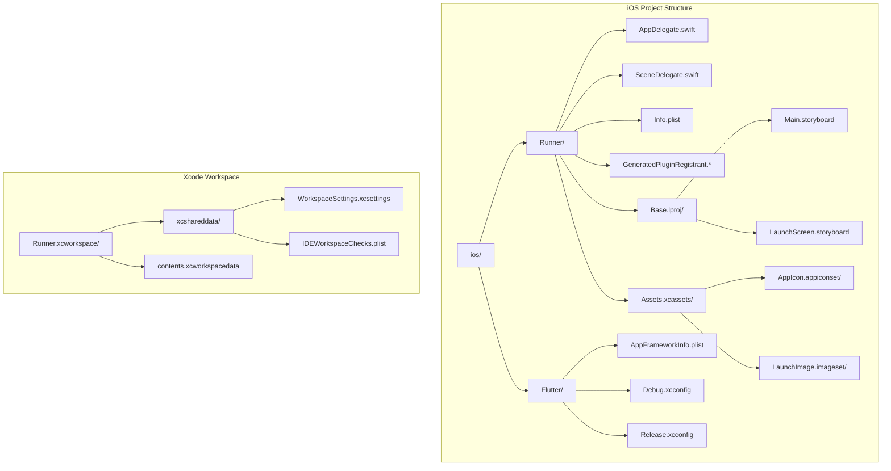
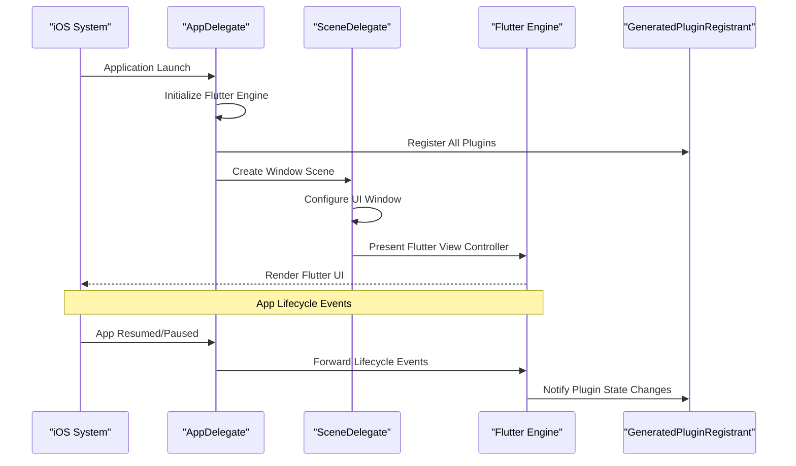
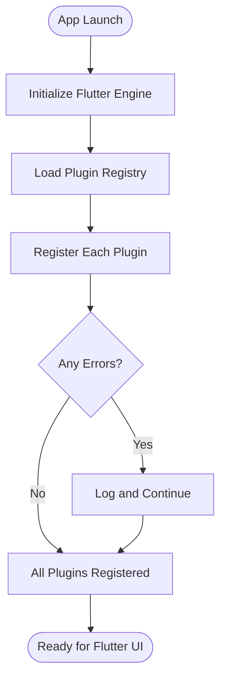
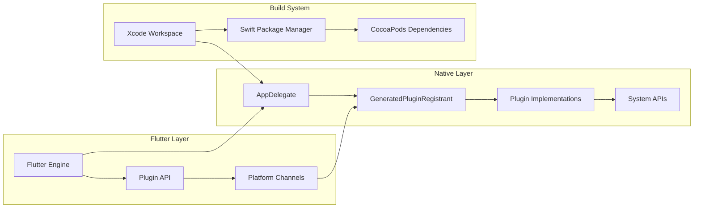

# iOS Integration

<cite>
**Referenced Files in This Document**
- [AppDelegate.swift](file://ios/Runner/AppDelegate.swift)
- [SceneDelegate.swift](file://ios/Runner/SceneDelegate.swift)
- [Info.plist](file://ios/Runner/Info.plist)
- [GeneratedPluginRegistrant.h](file://ios/Runner/GeneratedPluginRegistrant.h)
- [GeneratedPluginRegistrant.m](file://ios/Runner/GeneratedPluginRegistrant.m)
- [AppFrameworkInfo.plist](file://ios/Flutter/AppFrameworkInfo.plist)
- [Debug.xcconfig](file://ios/Flutter/Debug.xcconfig)
- [Release.xcconfig](file://ios/Flutter/Release.xcconfig)
- [Main.storyboard](file://ios/Runner/Base.lproj/Main.storyboard)
- [LaunchScreen.storyboard](file://ios/Runner/Base.lproj/LaunchScreen.storyboard)
- [Contents.json](file://ios/Runner/Assets.xcassets/AppIcon.appiconset/Contents.json)
- [WorkspaceSettings.xcsettings](file://ios/Runner.xcworkspace/xcshareddata/WorkspaceSettings.xcsettings)
- [contents.xcworkspacedata](file://ios/Runner.xcworkspace/contents.xcworkspacedata)
</cite>

## Table of Contents
1. [Introduction](#introduction)
2. [Project Structure](#project-structure)
3. [Core Components](#core-components)
4. [Architecture Overview](#architecture-overview)
5. [Detailed Component Analysis](#detailed-component-analysis)
6. [Dependency Analysis](#dependency-analysis)
7. [Performance Considerations](#performance-considerations)
8. [Troubleshooting Guide](#troubleshooting-guide)
9. [Conclusion](#conclusion)
10. [Appendices](#appendices)

## Introduction

This document provides comprehensive guidance for iOS platform integration in the ASSINATURAS NINJA Flutter application. It covers native iOS configuration, app lifecycle management, permissions setup, Xcode workspace configuration, Swift Package Manager integration, and deployment requirements. The guide is designed for developers integrating Flutter with iOS-specific features while maintaining compatibility with modern iOS versions (iOS 13+).

## Project Structure

The iOS integration follows Flutter's standard iOS project structure with custom configurations for the ASSINATURAS NINJA application:

**Diagram sources**
- [AppDelegate.swift](file://ios/Runner/AppDelegate.swift)
- [SceneDelegate.swift](file://ios/Runner/SceneDelegate.swift)
- [Info.plist](file://ios/Runner/Info.plist)
- [AppFrameworkInfo.plist](file://ios/Flutter/AppFrameworkInfo.plist)
- [WorkspaceSettings.xcsettings](file://ios/Runner.xcworkspace/xcshareddata/WorkspaceSettings.xcsettings)

**Section sources**
- [AppDelegate.swift](file://ios/Runner/AppDelegate.swift)
- [SceneDelegate.swift](file://ios/Runner/SceneDelegate.swift)
- [Info.plist](file://ios/Runner/Info.plist)

## Core Components

### AppDelegate Configuration

The AppDelegate serves as the primary entry point for iOS applications and handles critical initialization tasks:

- **Flutter Engine Initialization**: Configures the Flutter engine and sets up the default window
- **Plugin Registration**: Automatically registers all Flutter plugins through GeneratedPluginRegistrant
- **Lifecycle Management**: Handles app lifecycle events like launch, resume, and termination
- **URL Scheme Handling**: Manages deep linking and URL scheme routing
- **Background Tasks**: Coordinates background processing with Flutter's background execution model

### SceneDelegate Setup

For iOS 13+ applications, SceneDelegate manages the app's user interface lifecycle:

- **Window Management**: Creates and configures UIWindowScene instances
- **Scene Lifecycle**: Handles scene creation, connection, and disconnection events
- **Flutter View Controller Integration**: Ensures proper Flutter view controller presentation
- **Multi-Screen Support**: Manages multiple scenes for iPad and external displays

### Info.plist Configuration

The Info.plist file contains essential app metadata and permission declarations:

- **App Metadata**: Bundle identifier, version information, display name
- **Permissions**: Camera, microphone, location, photo library access declarations
- **Capabilities**: Push notifications, background modes, app groups
- **URL Schemes**: Deep linking configuration for external app communication
- **Privacy Descriptions**: Human-readable explanations for permission requests

**Section sources**
- [AppDelegate.swift](file://ios/Runner/AppDelegate.swift)
- [SceneDelegate.swift](file://ios/Runner/SceneDelegate.swift)
- [Info.plist](file://ios/Runner/Info.plist)

## Architecture Overview

The iOS architecture follows Flutter's hybrid approach, combining native iOS components with Flutter's rendering engine:

**Diagram sources**
- [AppDelegate.swift](file://ios/Runner/AppDelegate.swift)
- [SceneDelegate.swift](file://ios/Runner/SceneDelegate.swift)
- [GeneratedPluginRegistrant.m](file://ios/Runner/GeneratedPluginRegistrant.m)

## Detailed Component Analysis

### AppDelegate Implementation

The AppDelegate manages core application initialization and plugin registration:

#### Key Responsibilities
- **Engine Configuration**: Sets up Flutter engine with optimal performance settings
- **Plugin Bootstrapping**: Initializes all registered Flutter plugins automatically
- **Lifecycle Coordination**: Bridges iOS app lifecycle events to Flutter framework
- **Error Handling**: Implements robust error handling for plugin initialization failures

#### Plugin Registration Flow

**Diagram sources**
- [AppDelegate.swift](file://ios/Runner/AppDelegate.swift)
- [GeneratedPluginRegistrant.m](file://ios/Runner/GeneratedPluginRegistrant.m)

### SceneDelegate Configuration

SceneDelegate handles modern iOS scene-based architecture:

#### Window Management
- **Dynamic Window Creation**: Creates UIWindowScene instances for each connected screen
- **Scene Lifecycle Events**: Responds to scene activation, deactivation, and destruction
- **Flutter Integration**: Properly presents FlutterViewController within iOS window hierarchy

#### Multi-Scene Support
- **iPad Optimization**: Supports split-screen and slide-over multitasking
- **External Display Support**: Manages content on Apple TV and external monitors
- **Scene Persistence**: Maintains app state across scene transitions

**Section sources**
- [SceneDelegate.swift](file://ios/Runner/SceneDelegate.swift)

### Info.plist Permissions and Capabilities

#### Required Permissions
- **Camera Access**: For QR code scanning and image capture features
- **Photo Library**: For saving receipts and subscription documents
- **Location Services**: For regional subscription availability checks
- **Push Notifications**: For subscription renewal reminders and updates

#### App Capabilities
- **Background Modes**: Background fetch and processing for subscription sync
- **App Groups**: Shared data between app extensions and main application
- **Associated Domains**: Universal links for seamless web-to-app navigation

**Section sources**
- [Info.plist](file://ios/Runner/Info.plist)

### Xcode Workspace Configuration

#### Build Settings
- **Deployment Target**: iOS 13.0 minimum for broad device compatibility
- **Architecture Support**: arm64 for modern devices with universal binary support
- **Code Signing**: Automatic signing for development and distribution profiles
- **Swift Version**: Latest stable Swift compiler with Flutter compatibility

#### Framework Linking
- **Flutter Framework**: Core Flutter runtime and engine libraries
- **Plugin Frameworks**: Dynamic frameworks from third-party Flutter plugins
- **Native Libraries**: Static and dynamic libraries linked at build time

**Section sources**
- [WorkspaceSettings.xcsettings](file://ios/Runner.xcworkspace/xcshareddata/WorkspaceSettings.xcsettings)
- [contents.xcworkspacedata](file://ios/Runner.xcworkspace/contents.xcworkspacedata)

## Dependency Analysis

The iOS project maintains clear dependency boundaries between Flutter and native components:

**Diagram sources**
- [GeneratedPluginRegistrant.h](file://ios/Runner/GeneratedPluginRegistrant.h)
- [GeneratedPluginRegistrant.m](file://ios/Runner/GeneratedPluginRegistrant.m)

### Plugin Architecture
- **Automatic Registration**: GeneratedPluginRegistrant scans and registers all available plugins
- **Type Safety**: Strong typing ensures compile-time validation of plugin interfaces
- **Memory Management**: Automatic cleanup prevents memory leaks during plugin lifecycle

### External Dependencies
- **CocoaPods**: Manages native iOS dependencies and frameworks
- **Swift Package Manager**: Integrates modern Swift packages with Flutter projects
- **System Frameworks**: Links against iOS system libraries for native functionality

**Section sources**
- [GeneratedPluginRegistrant.h](file://ios/Runner/GeneratedPluginRegistrant.h)
- [GeneratedPluginRegistrant.m](file://ios/Runner/GeneratedPluginRegistrant.m)

## Performance Considerations

### Memory Management
- **Plugin Cleanup**: Ensure plugins properly implement deallocation methods
- **Image Optimization**: Use appropriate image formats and compression for subscription receipts
- **Background Processing**: Leverage iOS background task APIs efficiently

### Build Optimization
- **Bitcode Generation**: Enable for App Store optimization and future-proofing
- **Thinning**: Remove unused architectures for smaller app size
- **Incremental Builds**: Configure Xcode for faster development cycles

### Runtime Performance
- **Plugin Efficiency**: Monitor plugin performance impact on app startup
- **Network Requests**: Implement caching strategies for subscription data
- **UI Responsiveness**: Avoid blocking the main thread during heavy operations

## Troubleshooting Guide

### Common Issues and Solutions

#### Plugin Registration Failures
- **Symptoms**: App crashes on launch with plugin-related errors
- **Solution**: Verify plugin compatibility and rebuild generated files
- **Debugging**: Check console logs for specific plugin initialization failures

#### Permission Denied Errors
- **Symptoms**: Feature requests fail with permission denied messages
- **Solution**: Ensure Info.plist contains proper permission descriptions
- **Testing**: Test permission prompts on actual devices, not simulators

#### Build Configuration Problems
- **Symptoms**: Compilation errors or missing framework references
- **Solution**: Clean build folder and regenerate Flutter artifacts
- **Verification**: Check target deployment settings and architecture configurations

### Debugging Techniques

#### Xcode Instruments
- **Time Profiler**: Identify performance bottlenecks in native code
- **Memory Graph**: Detect memory leaks in plugin implementations
- **Allocations**: Monitor memory usage patterns during app operation

#### Console Logging
- **Verbose Logging**: Enable detailed logging for plugin interactions
- **Error Tracking**: Implement structured error reporting for production issues
- **Performance Metrics**: Track key performance indicators for subscription workflows

**Section sources**
- [AppDelegate.swift](file://ios/Runner/AppDelegate.swift)
- [SceneDelegate.swift](file://ios/Runner/SceneDelegate.swift)

## Conclusion

The ASSINATURAS NINJA Flutter application implements a robust iOS integration following Flutter best practices and iOS platform guidelines. The architecture separates concerns between Flutter business logic and native iOS capabilities, ensuring maintainability and performance. By following the configuration guidelines and troubleshooting procedures outlined in this document, developers can effectively extend iOS functionality while maintaining cross-platform compatibility.

Key considerations for ongoing maintenance include keeping Flutter and iOS dependencies updated, monitoring plugin compatibility, and adhering to Apple's App Store review guidelines for subscription-based applications.

## Appendices

### Deployment Checklist

#### Pre-Submission Requirements
- [ ] Update app version and build number
- [ ] Configure App Store Connect metadata
- [ ] Set up In-App Purchase products for subscriptions
- [ ] Test on physical devices with various iOS versions
- [ ] Verify all permission prompts work correctly

#### App Store Guidelines Compliance
- [ ] Include privacy policy URL in app metadata
- [ ] Implement proper subscription cancellation flow
- [ ] Provide clear pricing and renewal information
- [ ] Handle subscription state changes gracefully
- [ ] Implement receipt validation for security

### Development Environment Setup

#### Required Tools
- Xcode 15+ with latest iOS SDK
- Flutter SDK with iOS platform support
- CocoaPods for dependency management
- Valid Apple Developer account for testing

#### Configuration Steps
1. Open Runner.xcworkspace in Xcode
2. Select appropriate signing team and bundle identifier
3. Configure deployment target and supported devices
4. Add required permissions to Info.plist
5. Test on simulator and physical devices