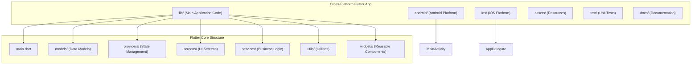
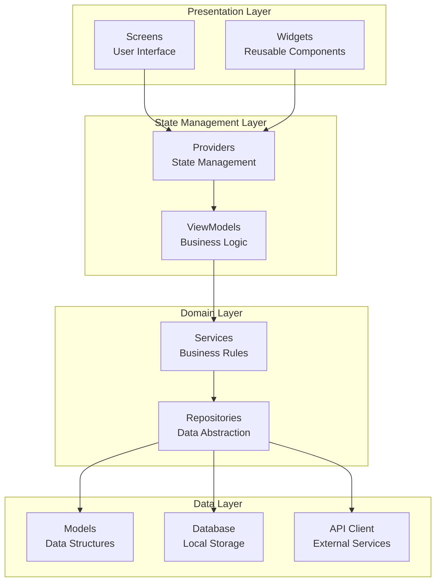
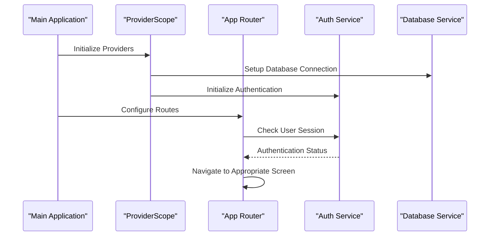
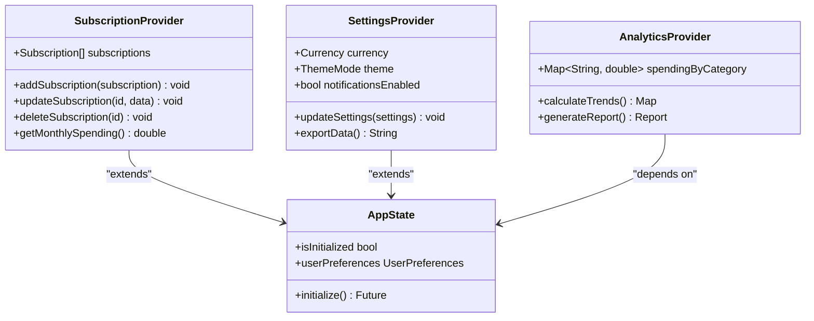
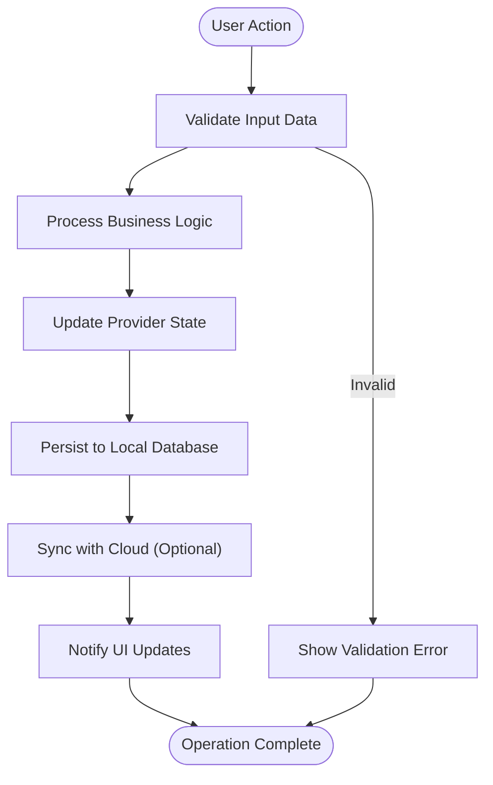
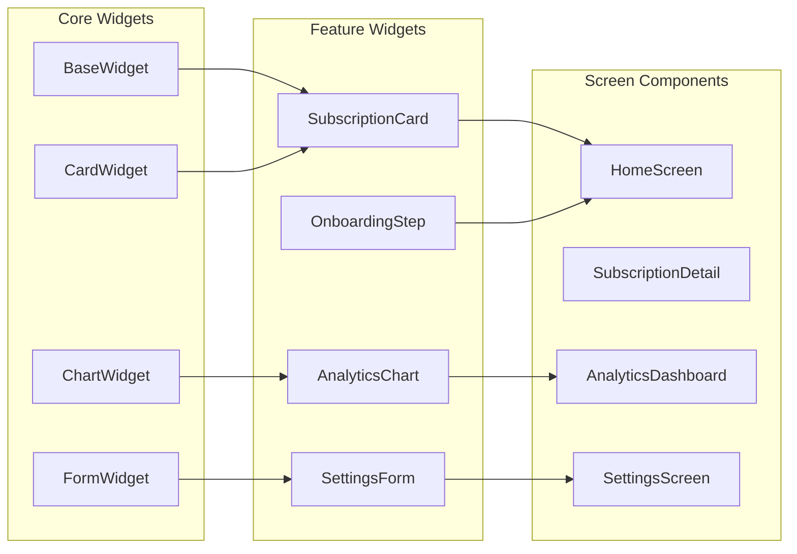
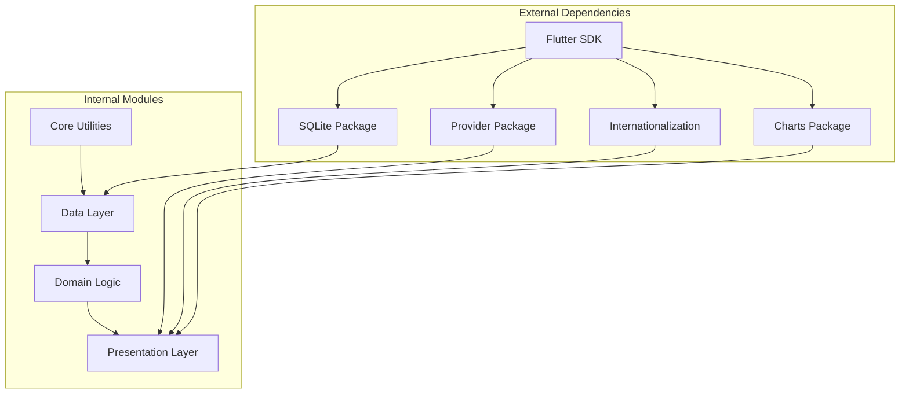

# Project Overview

<cite>
**Referenced Files in This Document**
- [README.md](file://README.md)
- [pubspec.yaml](file://pubspec.yaml)
- [lib/main.dart](file://lib/main.dart)
- [docs/PROJECT_BRIEF.md](file://docs/PROJECT_BRIEF.md)
- [docs/ARCHITECTURE.md](file://docs/ARCHITECTURE.md)
- [android/app/src/main/kotlin/br/com/assinaturasninja/assinaturas_ninja/MainActivity.kt](file://android/app/src/main/kotlin/br/com/assinaturasninja/assinaturas_ninja/MainActivity.kt)
- [ios/Runner/AppDelegate.swift](file://ios/Runner/AppDelegate.swift)
</cite>

## Table of Contents
1. [Introduction](#introduction)
2. [Project Structure](#project-structure)
3. [Core Components](#core-components)
4. [Architecture Overview](#architecture-overview)
5. [Detailed Component Analysis](#detailed-component-analysis)
6. [Dependency Analysis](#dependency-analysis)
7. [Performance Considerations](#performance-considerations)
8. [Troubleshooting Guide](#troubleshooting-guide)
9. [Conclusion](#conclusion)

## Introduction

ASSINATURAS NINJA is a comprehensive subscription management application designed to help users track and manage their recurring subscriptions across various services. The application provides a unified platform for monitoring subscription costs, renewal dates, and usage patterns, enabling users to maintain financial control over their digital service portfolio.

The app serves as a personal finance tool that addresses the growing complexity of modern subscription-based services, from streaming platforms to software utilities and cloud storage solutions. By centralizing subscription management, users can optimize their spending, avoid unwanted renewals, and gain insights into their subscription habits.

## Project Structure

The ASSINATURAS NINJA application follows Flutter's standard cross-platform architecture, supporting both Android and iOS platforms through a single codebase. The project structure demonstrates a well-organized separation of concerns with distinct directories for different functional areas.

**Diagram sources**
- [lib/main.dart:1-50](file://lib/main.dart#L1-L50)
- [android/app/src/main/kotlin/br/com/assinaturasninja/assinaturas_ninja/MainActivity.kt:1-30](file://android/app/src/main/kotlin/br/com/assinaturasninja/assinaturas_ninja/MainActivity.kt#L1-L30)
- [ios/Runner/AppDelegate.swift:1-30](file://ios/Runner/AppDelegate.swift#L1-L30)

The project implements a feature-based organization within the lib directory, promoting modularity and maintainability. Each major feature area has its own dedicated folder containing related models, providers, screens, and services.

**Section sources**
- [README.md:1-50](file://README.md#L1-L50)
- [pubspec.yaml:1-100](file://pubspec.yaml#L1-L100)

## Core Components

### Technology Stack

The application leverages Flutter's cross-platform capabilities with Provider for state management, following industry best practices for scalable mobile applications.

**Key Technologies:**
- **Flutter Framework**: Cross-platform UI framework for building native-performance applications
- **Provider**: State management solution implementing the Provider pattern
- **Dart Programming Language**: Type-safe, object-oriented language optimized for client-side development
- **SQLite/Local Storage**: Persistent data storage for subscription information
- **Material Design**: Native-looking UI components for consistent user experience

### Target Platforms

The application supports both major mobile platforms:

**Android Support:**
- Minimum API level compatibility
- Material Design implementation
- Android-specific optimizations and permissions handling

**iOS Support:**
- iOS 12+ compatibility
- Native iOS design patterns integration
- iOS-specific features and permissions

### Core Features

#### Subscription CRUD Operations
Users can perform complete lifecycle management of their subscriptions:
- **Create**: Add new subscriptions with detailed information
- **Read**: View subscription details and history
- **Update**: Modify subscription parameters and billing cycles
- **Delete**: Remove subscriptions no longer in use

#### User Onboarding Flow
A guided setup process helps users configure their subscription tracking preferences and import existing subscription data.

#### Settings Management
Comprehensive configuration options including:
- Currency preferences
- Notification settings
- Data export/import functionality
- Theme customization

#### Analytics Capabilities
Insightful reporting features including:
- Monthly spending analysis
- Subscription category breakdown
- Renewal date predictions
- Cost optimization recommendations

**Section sources**
- [docs/PROJECT_BRIEF.md:1-100](file://docs/PROJECT_BRIEF.md#L1-L100)
- [docs/ARCHITECTURE.md:1-150](file://docs/ARCHITECTURE.md#L1-L150)

## Architecture Overview

The application follows the MVVM (Model-View-ViewModel) architectural pattern combined with the Provider pattern for state management. This approach ensures clean separation of concerns, testability, and maintainable code structure.

**Diagram sources**
- [lib/main.dart:1-100](file://lib/main.dart#L1-L100)
- [lib/providers/:1-50](file://lib/providers/#L1-L50)
- [lib/services/:1-50](file://lib/services/#L1-L50)

### Key Design Patterns

#### MVVM Pattern Implementation
- **Model**: Data structures representing subscription entities and application state
- **View**: Flutter widgets and screens providing user interface
- **ViewModel**: Providers managing business logic and state synchronization

#### Provider Pattern
Centralized state management ensuring reactive UI updates when data changes. The Provider pattern enables efficient state sharing across the widget tree without prop drilling.

#### Repository Pattern
Abstraction layer for data access, providing clean interfaces for data operations while hiding implementation details of local storage and external APIs.

**Section sources**
- [docs/ARCHITECTURE.md:50-200](file://docs/ARCHITECTURE.md#L50-L200)

## Detailed Component Analysis

### Main Application Entry Point

The application initializes with a comprehensive setup including dependency injection, theme configuration, and provider registration. The main entry point establishes the foundation for the entire application lifecycle.

**Diagram sources**
- [lib/main.dart:1-150](file://lib/main.dart#L1-L150)

### Provider Architecture

The state management system uses multiple providers organized by feature domains:

**Diagram sources**
- [lib/providers/subscription_provider.dart:1-200](file://lib/providers/subscription_provider.dart#L1-L200)
- [lib/providers/settings_provider.dart:1-150](file://lib/providers/settings_provider.dart#L1-L150)
- [lib/providers/analytics_provider.dart:1-180](file://lib/providers/analytics_provider.dart#L1-L180)

### Data Management System

The application implements a robust data management system with local persistence and optional cloud synchronization:

**Diagram sources**
- [lib/services/subscription_service.dart:1-200](file://lib/services/subscription_service.dart#L1-L200)
- [lib/models/subscription_model.dart:1-150](file://lib/models/subscription_model.dart#L1-L150)

### User Interface Components

The application features a modular widget architecture with reusable components:

**Diagram sources**
- [lib/widgets/base_widget.dart:1-100](file://lib/widgets/base_widget.dart#L1-L100)
- [lib/screens/home_screen.dart:1-200](file://lib/screens/home_screen.dart#L1-L200)

**Section sources**
- [lib/main.dart:1-200](file://lib/main.dart#L1-L200)
- [lib/providers/:1-500](file://lib/providers/#L1-L500)
- [lib/services/:1-300](file://lib/services/#L1-L300)
- [lib/widgets/:1-200](file://lib/widgets/#L1-L200)

## Dependency Analysis

The application maintains clear dependency boundaries and follows inversion of control principles:

**Diagram sources**
- [pubspec.yaml:1-150](file://pubspec.yaml#L1-L150)

### Platform-Specific Integrations

**Android Integration:**
- Kotlin-based MainActivity extending FlutterActivity
- Android-specific permissions and lifecycle management
- Material Design 3 compliance

**iOS Integration:**
- Swift-based AppDelegate configuration
- iOS-specific features and capabilities
- App Store deployment preparation

**Section sources**
- [pubspec.yaml:1-200](file://pubspec.yaml#L1-L200)
- [android/app/src/main/kotlin/br/com/assinaturasninja/assinaturas_ninja/MainActivity.kt:1-50](file://android/app/src/main/kotlin/br/com/assinaturasninja/assinaturas_ninja/MainActivity.kt#L1-L50)
- [ios/Runner/AppDelegate.swift:1-50](file://ios/Runner/AppDelegate.swift#L1-L50)

## Performance Considerations

The application implements several performance optimization strategies:

### State Management Optimization
- Selective widget rebuilding using Provider's `Selector`
- Efficient data caching mechanisms
- Lazy loading for large datasets

### Memory Management
- Proper disposal of resources and listeners
- Image optimization and caching
- Database query optimization

### UI Performance
- Widget tree optimization
- Efficient list rendering with pagination
- Smooth animations and transitions

## Troubleshooting Guide

### Common Issues and Solutions

**State Synchronization Problems:**
- Ensure proper provider hierarchy setup
- Verify reactive updates are triggered correctly
- Check for circular dependencies in state management

**Database Connectivity Issues:**
- Validate database initialization sequence
- Implement proper error handling for connection failures
- Use migration strategies for schema updates

**Platform-Specific Issues:**
- Handle Android/iOS permission requests appropriately
- Test platform-specific features thoroughly
- Implement fallback mechanisms for unsupported features

### Debugging Strategies

**Development Tools:**
- Flutter DevTools for performance profiling
- Logging frameworks for detailed debugging
- Unit testing for critical business logic

**Production Monitoring:**
- Crash reporting integration
- Performance metrics collection
- User behavior analytics

## Conclusion

ASSINATURAS NINJA represents a well-architected subscription management solution built with modern Flutter development practices. The application successfully combines cross-platform compatibility with native performance, providing users with a comprehensive tool for managing their subscription ecosystem.

The implementation demonstrates strong adherence to architectural patterns, particularly MVVM and Provider patterns, ensuring maintainable and scalable code structure. The modular design facilitates easy feature expansion and maintenance while providing a solid foundation for future enhancements.

Key strengths include:
- Clean separation of concerns across layers
- Robust state management with Provider
- Comprehensive feature set addressing real user needs
- Cross-platform compatibility with platform-specific optimizations
- Strong focus on user experience and performance

The application serves as an excellent example of modern Flutter development, showcasing best practices in architecture, state management, and cross-platform mobile application development.