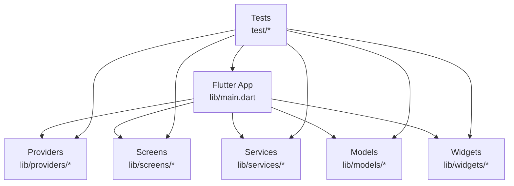
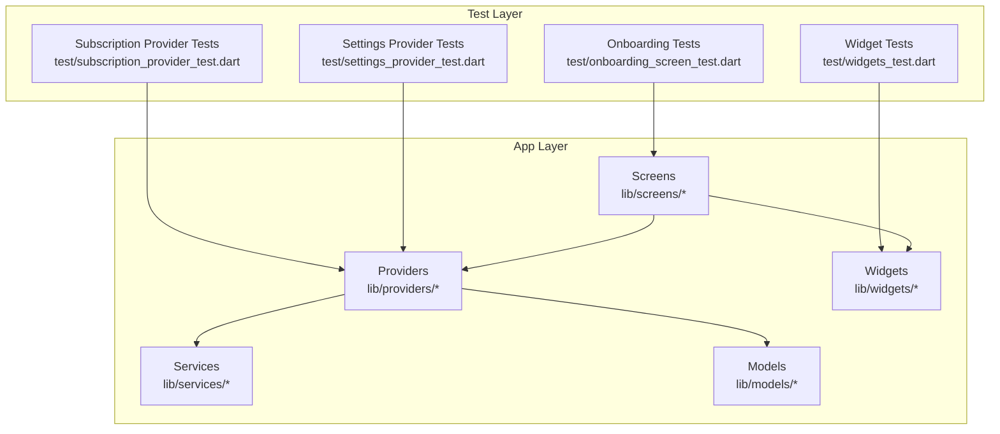
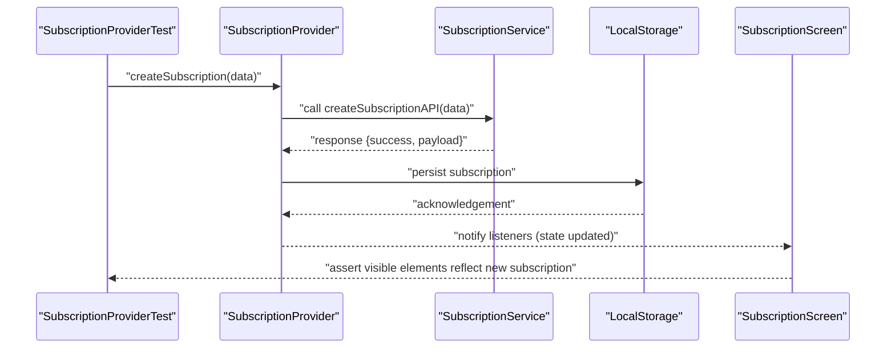
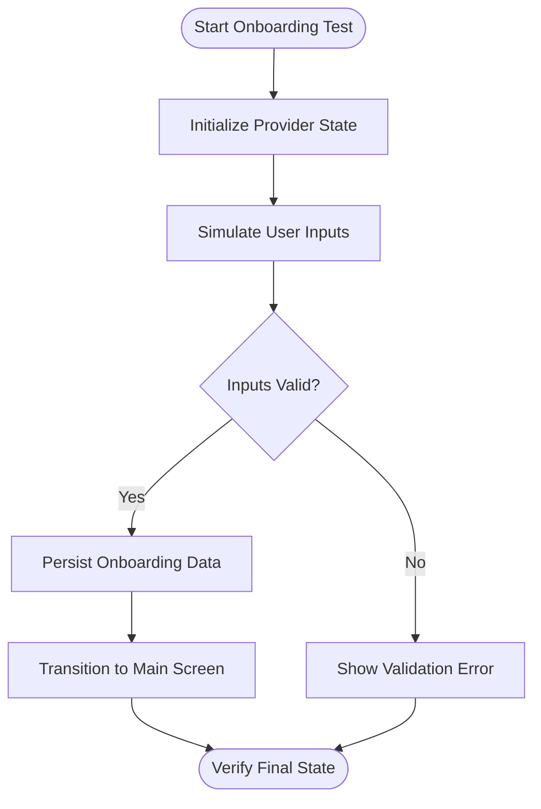
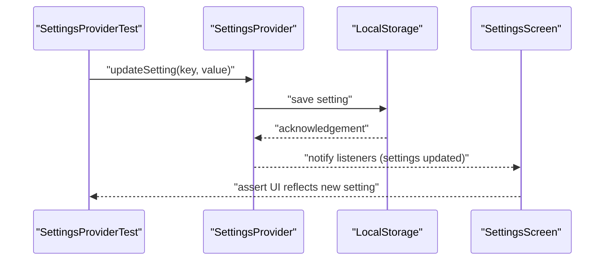
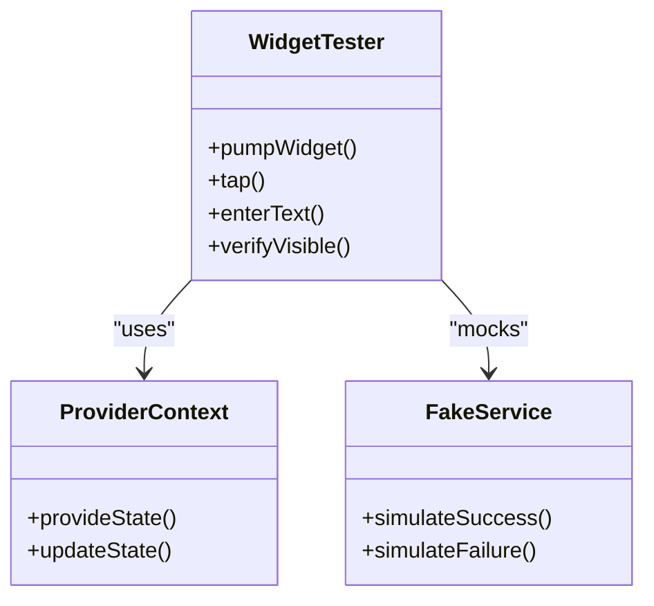
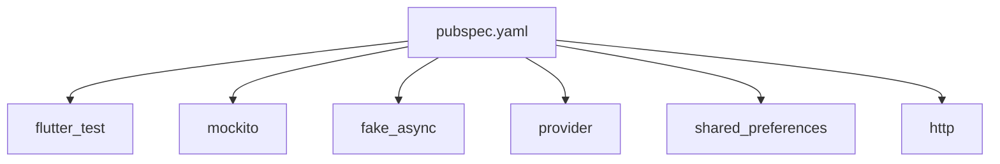

# Integration Testing

<cite>
**Referenced Files in This Document**
- [README.md](file://README.md)
- [pubspec.yaml](file://pubspec.yaml)
- [lib/main.dart](file://lib/main.dart)
- [test/onboarding_screen_test.dart](file://test/onboarding_screen_test.dart)
- [test/settings_provider_test.dart](file://test/settings_provider_test.dart)
- [test/subscription_model_test.dart](file://test/subscription_model_test.dart)
- [test/subscription_provider_test.dart](file://test/subscription_provider_test.dart)
- [test/widgets_test.dart](file://test/widgets_test.dart)
</cite>

## Table of Contents
1. [Introduction](#introduction)
2. [Project Structure](#project-structure)
3. [Core Components](#core-components)
4. [Architecture Overview](#architecture-overview)
5. [Detailed Component Analysis](#detailed-component-analysis)
6. [Dependency Analysis](#dependency-analysis)
7. [Performance Considerations](#performance-considerations)
8. [Troubleshooting Guide](#troubleshooting-guide)
9. [Conclusion](#conclusion)
10. [Appendices](#appendices)

## Introduction
This document provides comprehensive integration testing guidance for the ASSINATURAS NINJA application. It focuses on end-to-end strategies that validate complete user workflows and system integrations, including multi-component interactions, data persistence, and cross-platform behavior. The guide covers subscription management, user onboarding, and settings configuration, with practical examples for test environment setup, database mocking, and API service simulation. It also includes guidelines for writing reliable integration tests that simulate real user scenarios and catch integration issues early.

## Project Structure
The project is a Flutter application with platform-specific directories (android, ios), shared Dart code under lib, and tests under test. Key areas relevant to integration testing include:
- Application entry point and provider wiring
- Feature screens and providers for state management
- Existing unit/integration tests for onboarding, subscriptions, settings, and widgets
- Dependencies declared in pubspec.yaml

**Diagram sources**
- [lib/main.dart](file://lib/main.dart)
- [test/onboarding_screen_test.dart](file://test/onboarding_screen_test.dart)
- [test/settings_provider_test.dart](file://test/settings_provider_test.dart)
- [test/subscription_model_test.dart](file://test/subscription_model_test.dart)
- [test/subscription_provider_test.dart](file://test/subscription_provider_test.dart)
- [test/widgets_test.dart](file://test/widgets_test.dart)

**Section sources**
- [README.md](file://README.md)
- [pubspec.yaml](file://pubspec.yaml)
- [lib/main.dart](file://lib/main.dart)

## Core Components
Integration testing should focus on the following core components and their interactions:
- Providers: Manage app state and coordinate business logic across screens and services.
- Screens: Represent user-facing flows such as onboarding and subscription management.
- Services: Encapsulate external integrations like APIs or local storage.
- Models: Define data structures used throughout the app.
- Widgets: Reusable UI building blocks that may be exercised by higher-level tests.

Key responsibilities for integration tests:
- Validate end-to-end user journeys (e.g., onboarding to subscription activation).
- Ensure providers correctly update UI and persist state changes.
- Verify service calls are invoked with correct parameters and handle responses.
- Confirm cross-platform behaviors remain consistent.

**Section sources**
- [lib/main.dart](file://lib/main.dart)
- [test/onboarding_screen_test.dart](file://test/onboarding_screen_test.dart)
- [test/settings_provider_test.dart](file://test/settings_provider_test.dart)
- [test/subscription_model_test.dart](file://test/subscription_model_test.dart)
- [test/subscription_provider_test.dart](file://test/subscription_provider_test.dart)
- [test/widgets_test.dart](file://test/widgets_test.dart)

## Architecture Overview
The integration testing architecture centers around simulating realistic user flows while isolating external dependencies through mocks and fakes. The diagram below shows how tests interact with providers, services, and UI layers.

**Diagram sources**
- [test/onboarding_screen_test.dart](file://test/onboarding_screen_test.dart)
- [test/subscription_provider_test.dart](file://test/subscription_provider_test.dart)
- [test/settings_provider_test.dart](file://test/settings_provider_test.dart)
- [test/widgets_test.dart](file://test/widgets_test.dart)
- [lib/main.dart](file://lib/main.dart)

## Detailed Component Analysis

### Subscription Management Workflow
End-to-end validation of subscription lifecycle:
- Create a new subscription via provider
- Persist state changes
- Update UI accordingly
- Handle success and error paths

Recommended approach:
- Use provider-based tests to assert state transitions and side effects.
- Mock services to simulate API responses and network failures.
- Assert UI updates triggered by provider state changes.

**Diagram sources**
- [test/subscription_provider_test.dart](file://test/subscription_provider_test.dart)
- [lib/main.dart](file://lib/main.dart)

**Section sources**
- [test/subscription_provider_test.dart](file://test/subscription_provider_test.dart)
- [test/subscription_model_test.dart](file://test/subscription_model_test.dart)

### User Onboarding Process
Validate the full onboarding flow from initial launch to completion:
- Navigate through onboarding screens
- Capture user inputs and preferences
- Persist onboarding status
- Transition to main app state

Testing strategy:
- Drive screen navigation using widget tester utilities.
- Inject mock providers to avoid heavy initialization.
- Assert final state reflects completed onboarding.

**Diagram sources**
- [test/onboarding_screen_test.dart](file://test/onboarding_screen_test.dart)
- [lib/main.dart](file://lib/main.dart)

**Section sources**
- [test/onboarding_screen_test.dart](file://test/onboarding_screen_test.dart)

### Settings Configuration
Ensure settings changes propagate across the app:
- Toggle features or preferences
- Persist configuration
- Reflect changes in dependent screens and widgets

Testing strategy:
- Use provider tests to verify state updates and persistence.
- Simulate configuration changes and assert downstream effects.
- Validate default values and edge cases.

**Diagram sources**
- [test/settings_provider_test.dart](file://test/settings_provider_test.dart)
- [lib/main.dart](file://lib/main.dart)

**Section sources**
- [test/settings_provider_test.dart](file://test/settings_provider_test.dart)

### Widget Interactions
Exercise reusable widgets within realistic contexts:
- Provide minimal provider context
- Simulate user gestures and input
- Assert visual and behavioral outcomes

Testing strategy:
- Build focused widget tests that integrate with providers and services.
- Use fake implementations for external dependencies.
- Validate accessibility and responsiveness.

**Diagram sources**
- [test/widgets_test.dart](file://test/widgets_test.dart)
- [lib/main.dart](file://lib/main.dart)

**Section sources**
- [test/widgets_test.dart](file://test/widgets_test.dart)

## Dependency Analysis
Integration tests rely on specific dependencies declared in the project manifest. Understanding these helps configure test environments and select appropriate mocking libraries.

**Diagram sources**
- [pubspec.yaml](file://pubspec.yaml)

**Section sources**
- [pubspec.yaml](file://pubspec.yaml)

## Performance Considerations
- Keep integration tests fast by minimizing heavy initialization and avoiding real network calls.
- Use asynchronous helpers to control timers and futures deterministically.
- Prefer lightweight fakes over complex mocks when possible.
- Parallelize independent tests where supported by the runner.
- Cache expensive setup steps between related tests.

[No sources needed since this section provides general guidance]

## Troubleshooting Guide
Common integration testing pitfalls and resolutions:
- Flaky tests due to timing: Use deterministic async utilities and explicit waits.
- Uninitialized providers: Ensure proper provider injection in test widgets.
- Network errors not reproduced: Configure fake services to return expected responses consistently.
- State not persisted: Verify storage layer is mocked and acknowledged in tests.
- Cross-platform differences: Run tests on multiple emulators/devices and assert platform-agnostic behavior.

**Section sources**
- [test/onboarding_screen_test.dart](file://test/onboarding_screen_test.dart)
- [test/settings_provider_test.dart](file://test/settings_provider_test.dart)
- [test/subscription_provider_test.dart](file://test/subscription_provider_test.dart)
- [test/widgets_test.dart](file://test/widgets_test.dart)

## Conclusion
By focusing on end-to-end workflows, provider-driven state changes, and simulated external integrations, integration tests for ASSINATURAS NINJA can reliably validate subscription management, onboarding, and settings configuration. Following the strategies outlined here will help catch integration issues early and maintain confidence in cross-platform functionality.

[No sources needed since this section summarizes without analyzing specific files]

## Appendices

### Test Environment Setup
- Initialize Flutter test environment and ensure required packages are available.
- Configure test-specific assets and locales if needed.
- Set up global test fixtures for common data models and provider states.

**Section sources**
- [pubspec.yaml](file://pubspec.yaml)
- [lib/main.dart](file://lib/main.dart)

### Database Mocking Guidelines
- Replace persistent storage with in-memory fakes during tests.
- Seed fake storage with known datasets for predictable outcomes.
- Assert persistence operations are called with expected payloads.

**Section sources**
- [test/settings_provider_test.dart](file://test/settings_provider_test.dart)
- [test/subscription_provider_test.dart](file://test/subscription_provider_test.dart)

### API Service Simulation
- Implement fake HTTP clients that return controlled responses.
- Simulate latency and failure modes to exercise error handling.
- Verify request construction and response parsing in providers.

**Section sources**
- [test/subscription_provider_test.dart](file://test/subscription_provider_test.dart)
- [pubspec.yaml](file://pubspec.yaml)

### Writing Reliable Integration Tests
- Isolate each scenario with clear setup and teardown.
- Use descriptive test names reflecting user actions and expectations.
- Avoid brittle assertions; prefer semantic checks over exact pixel matches.
- Cover happy paths, edge cases, and error conditions.
- Regularly review flakiness and refine synchronization points.

**Section sources**
- [test/onboarding_screen_test.dart](file://test/onboarding_screen_test.dart)
- [test/widgets_test.dart](file://test/widgets_test.dart)