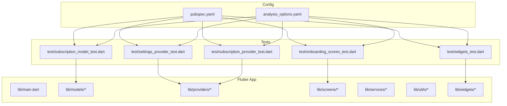
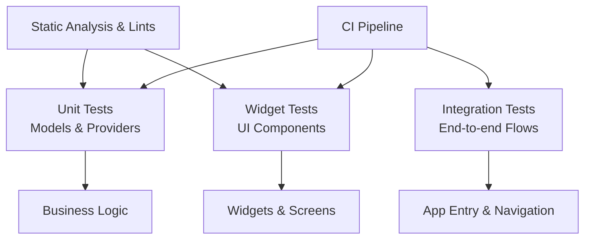
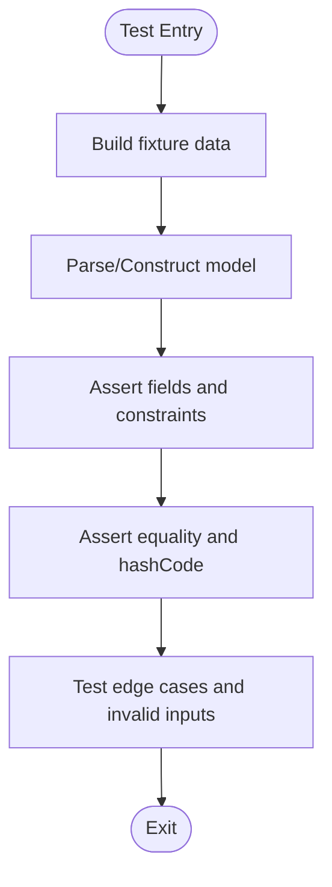
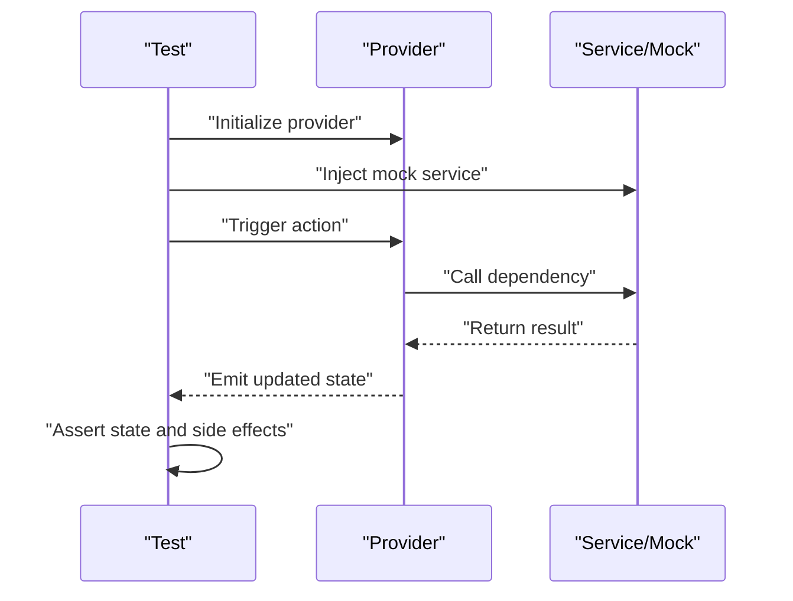
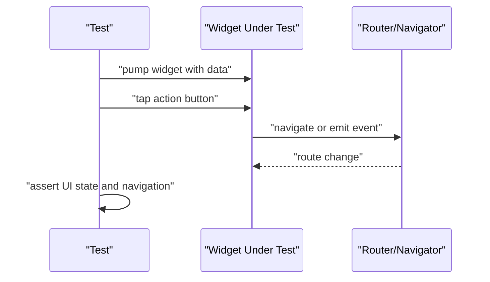
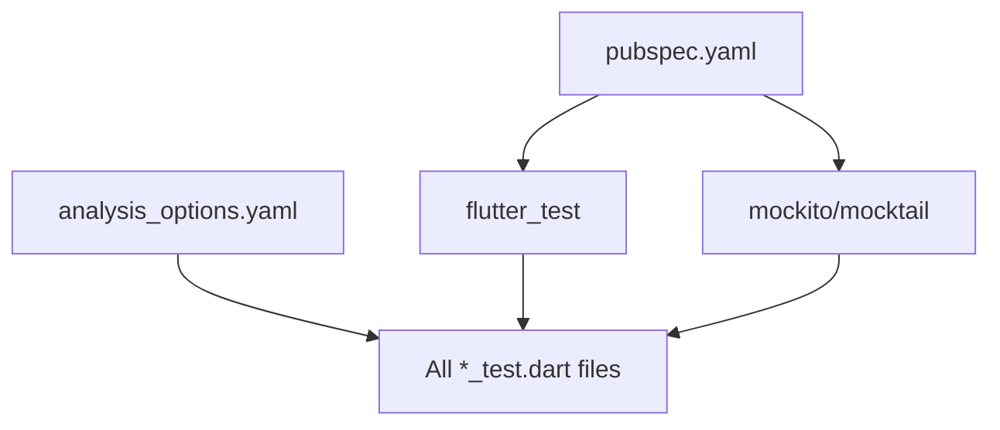

# Testing Best Practices

<cite>
**Referenced Files in This Document**
- [pubspec.yaml](file://pubspec.yaml)
- [analysis_options.yaml](file://analysis_options.yaml)
- [onboarding_screen_test.dart](file://test/onboarding_screen_test.dart)
- [settings_provider_test.dart](file://test/settings_provider_test.dart)
- [subscription_model_test.dart](file://test/subscription_model_test.dart)
- [subscription_provider_test.dart](file://test/subscription_provider_test.dart)
- [widgets_test.dart](file://test/widgets_test.dart)
- [SKILL.md](file://.agents/skills/flutter-tests/SKILL.md)
</cite>

## Table of Contents
1. [Introduction](#introduction)
2. [Project Structure](#project-structure)
3. [Core Components](#core-components)
4. [Architecture Overview](#architecture-overview)
5. [Detailed Component Analysis](#detailed-component-analysis)
6. [Dependency Analysis](#dependency-analysis)
7. [Performance Considerations](#performance-considerations)
8. [Troubleshooting Guide](#troubleshooting-guide)
9. [Conclusion](#conclusion)
10. [Appendices](#appendices)

## Introduction
This document defines comprehensive testing best practices for the ASSINATURAS NINJA Flutter project. It consolidates conventions, naming standards, organizational patterns, coverage expectations, quality gates, and continuous integration guidance. It also provides maintenance strategies, debugging workflows, performance and memory testing approaches, anti-patterns to avoid, recommended patterns for sustainable suites, test data management, environment configuration, and collaborative workflows. The goal is to ensure tests remain fast, reliable, readable, and maintainable across the team.

## Project Structure
The project follows a standard Flutter layout with tests colocated under the test directory. Each feature area has corresponding unit and widget tests aligned with its implementation.

**Diagram sources**
- [pubspec.yaml](file://pubspec.yaml)
- [analysis_options.yaml](file://analysis_options.yaml)
- [onboarding_screen_test.dart](file://test/onboarding_screen_test.dart)
- [settings_provider_test.dart](file://test/settings_provider_test.dart)
- [subscription_model_test.dart](file://test/subscription_model_test.dart)
- [subscription_provider_test.dart](file://test/subscription_provider_test.dart)
- [widgets_test.dart](file://test/widgets_test.dart)

**Section sources**
- [pubspec.yaml](file://pubspec.yaml)
- [analysis_options.yaml](file://analysis_options.yaml)
- [onboarding_screen_test.dart](file://test/onboarding_screen_test.dart)
- [settings_provider_test.dart](file://test/settings_provider_test.dart)
- [subscription_model_test.dart](file://test/subscription_model_test.dart)
- [subscription_provider_test.dart](file://test/subscription_provider_test.dart)
- [widgets_test.dart](file://test/widgets_test.dart)

## Core Components
- Test runner and dependencies: Managed via pubspec.yaml. Ensure flutter_test and any mocking or assertion libraries are declared as dev_dependencies.
- Static analysis and linting: Configured via analysis_options.yaml. Use consistent lints to enforce readability and correctness in tests.
- Feature-aligned tests: Tests mirror application structure (models, providers, screens, widgets). Keep one-to-one mapping between source files and their tests.

Recommended conventions:
- Naming:
  - File names: snake_case with _test.dart suffix (e.g., subscription_provider_test.dart).
  - Test groups: describe("Feature") blocks mirroring production modules.
  - Test cases: it("should ... when ... then ...") style describing behavior.
- Organization:
  - Group by feature or module.
  - Separate unit tests from widget/integration tests into distinct directories if the suite grows.
- Assertions:
  - Prefer meaningful assertions over generic checks.
  - Use expect() with descriptive messages.
- Isolation:
  - Each test should be independent and deterministic.
  - Avoid shared mutable state; reset or rebuild per test.

**Section sources**
- [pubspec.yaml](file://pubspec.yaml)
- [analysis_options.yaml](file://analysis_options.yaml)
- [subscription_model_test.dart](file://test/subscription_model_test.dart)
- [subscription_provider_test.dart](file://test/subscription_provider_test.dart)
- [settings_provider_test.dart](file://test/settings_provider_test.dart)
- [onboarding_screen_test.dart](file://test/onboarding_screen_test.dart)
- [widgets_test.dart](file://test/widgets_test.dart)

## Architecture Overview
Testing architecture aligns with the app’s layered design:
- Unit tests validate business logic in models and providers.
- Widget tests verify UI components and interactions.
- Integration tests (when added) validate cross-layer flows such as onboarding.

[No sources needed since this diagram shows conceptual workflow, not actual code structure]

## Detailed Component Analysis

### Models Testing (Subscription Model)
Focus areas:
- Immutability and equality semantics.
- Serialization/deserialization correctness.
- Edge cases and boundary values.

Guidelines:
- Create minimal fixtures for model instances.
- Assert both value equality and identity where applicable.
- Validate parsing errors and invalid inputs.

**Section sources**
- [subscription_model_test.dart](file://test/subscription_model_test.dart)

### Providers Testing (Settings and Subscription Providers)
Focus areas:
- State transitions and reactive updates.
- Dependency injection and mock usage.
- Error propagation and recovery paths.

Guidelines:
- Use mocks for external dependencies (services, repositories).
- Verify that listeners update correctly after state changes.
- Test async operations with proper awaiting and timeouts.

**Section sources**
- [settings_provider_test.dart](file://test/settings_provider_test.dart)
- [subscription_provider_test.dart](file://test/subscription_provider_test.dart)

### Widget Testing (Onboarding Screen and Widgets)
Focus areas:
- User interactions and navigation triggers.
- Theme and localization rendering.
- Async UI updates and loading states.

Guidelines:
- Pump widgets with realistic data.
- Tap buttons and assert route changes or state updates.
- Use tester.pumpAndSettle() for animations and futures.

**Section sources**
- [onboarding_screen_test.dart](file://test/onboarding_screen_test.dart)
- [widgets_test.dart](file://test/widgets_test.dart)

### Test Skill Reference
The repository includes a dedicated skill file outlining Flutter testing practices. Refer to it for additional conventions and examples.

**Section sources**
- [SKILL.md](file://.agents/skills/flutter-tests/SKILL.md)

## Dependency Analysis
Ensure all test-related dependencies are declared in pubspec.yaml under dev_dependencies. Common packages include flutter_test, mockito/mocktail, and golden tools if used.

**Diagram sources**
- [pubspec.yaml](file://pubspec.yaml)
- [analysis_options.yaml](file://analysis_options.yaml)
- [onboarding_screen_test.dart](file://test/onboarding_screen_test.dart)
- [settings_provider_test.dart](file://test/settings_provider_test.dart)
- [subscription_model_test.dart](file://test/subscription_model_test.dart)
- [subscription_provider_test.dart](file://test/subscription_provider_test.dart)
- [widgets_test.dart](file://test/widgets_test.dart)

**Section sources**
- [pubspec.yaml](file://pubspec.yaml)
- [analysis_options.yaml](file://analysis_options.yaml)

## Performance Considerations
- Keep tests fast:
  - Prefer unit tests over heavy widget tests when possible.
  - Mock I/O and network calls.
  - Use small, focused fixtures.
- Optimize widget tests:
  - Minimize pump cycles; use pumpUntilFound or specific conditions.
  - Avoid unnecessary rebuilds by isolating state.
- Memory leak detection:
  - Use Flutter inspector and DevTools during interactive runs.
  - For automated checks, consider heap snapshots and leak tracking libraries in CI.
- Benchmarking:
  - Add micro-benchmarks for critical paths using benchmark_harness if needed.
  - Track regression trends in CI.

[No sources needed since this section provides general guidance]

## Troubleshooting Guide
Common issues and resolutions:
- Flaky tests:
  - Identify race conditions and add explicit waits or pumpAndSettle().
  - Stabilize timers and animations.
- Environment mismatches:
  - Centralize config via environment variables or build variants.
  - Seed deterministic test data.
- Assertion failures:
  - Print contextual logs before assertions.
  - Use expectLater for async assertions.
- Debugging failing tests:
  - Run single test with verbose output.
  - Use print statements sparingly; prefer structured logging.
  - Inspect widget trees with debugDumpTree() when necessary.

**Section sources**
- [onboarding_screen_test.dart](file://test/onboarding_screen_test.dart)
- [settings_provider_test.dart](file://test/settings_provider_test.dart)
- [subscription_model_test.dart](file://test/subscription_model_test.dart)
- [subscription_provider_test.dart](file://test/subscription_provider_test.dart)
- [widgets_test.dart](file://test/widgets_test.dart)

## Conclusion
Adopting these testing best practices will improve reliability, speed, and maintainability of the ASSINATURAS NINJA test suite. Align tests with the app’s architecture, enforce consistent naming and organization, and integrate static analysis and CI checks to uphold quality gates. Regularly review and refactor tests alongside production code to keep the suite sustainable.

[No sources needed since this section summarizes without analyzing specific files]

## Appendices

### Test Coverage Requirements
- Target minimum coverage thresholds per module (e.g., lines, branches).
- Exclude generated code and trivial getters/setters.
- Report coverage in CI and block merges below thresholds.

### Quality Gates and Continuous Integration
- Gate criteria:
  - All tests pass.
  - Static analysis clean (no warnings/errors).
  - Coverage meets threshold.
- CI steps:
  - Install dependencies.
  - Run unit and widget tests.
  - Generate coverage report.
  - Upload artifacts and annotate PRs.

### Test Data Management
- Centralize fixtures in a dedicated folder (e.g., test/fixtures).
- Use builders/factories for complex objects.
- Version fixtures alongside features.

### Environment Configuration
- Use build modes (debug/profile/release) and environment flags.
- Provide test-specific configs and mocks for external services.

### Collaborative Testing Workflows
- Pair programming for complex tests.
- Code reviews focusing on determinism and clarity.
- Maintain a shared test library for common helpers.

### Anti-Patterns to Avoid
- Over-coupling tests to UI details.
- Using real I/O/network in unit tests.
- Shared mutable state across tests.
- Long-running synchronous operations in tests.

### Recommended Patterns
- Arrange-Act-Assert structure.
- Parameterized tests for repetitive scenarios.
- Clear error messages in assertions.
- Isolate side effects behind interfaces for mocking.

[No sources needed since this section provides general guidance]