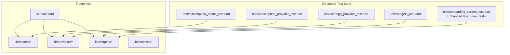
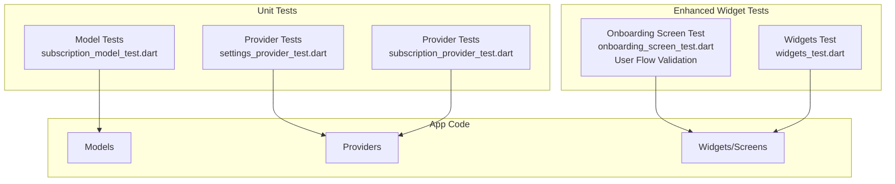
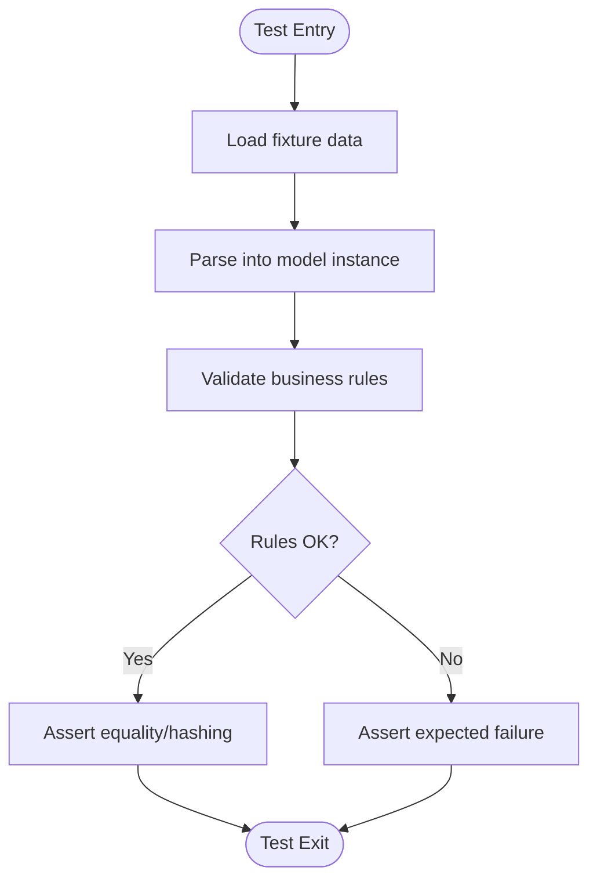
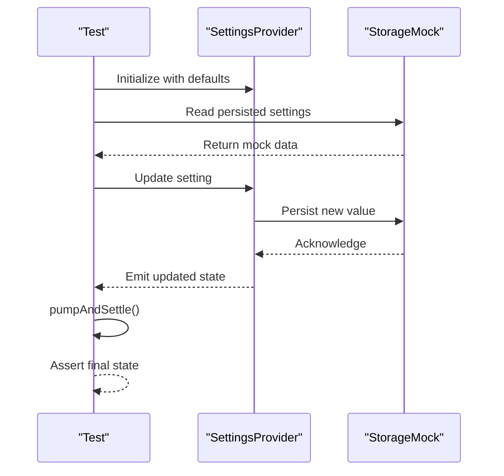
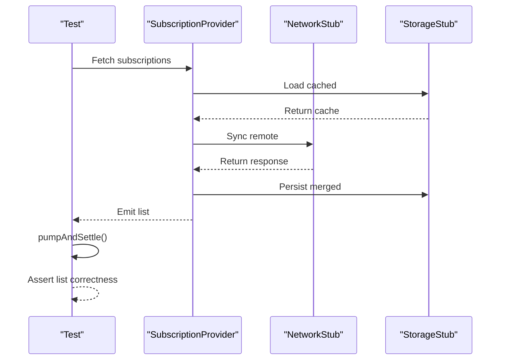
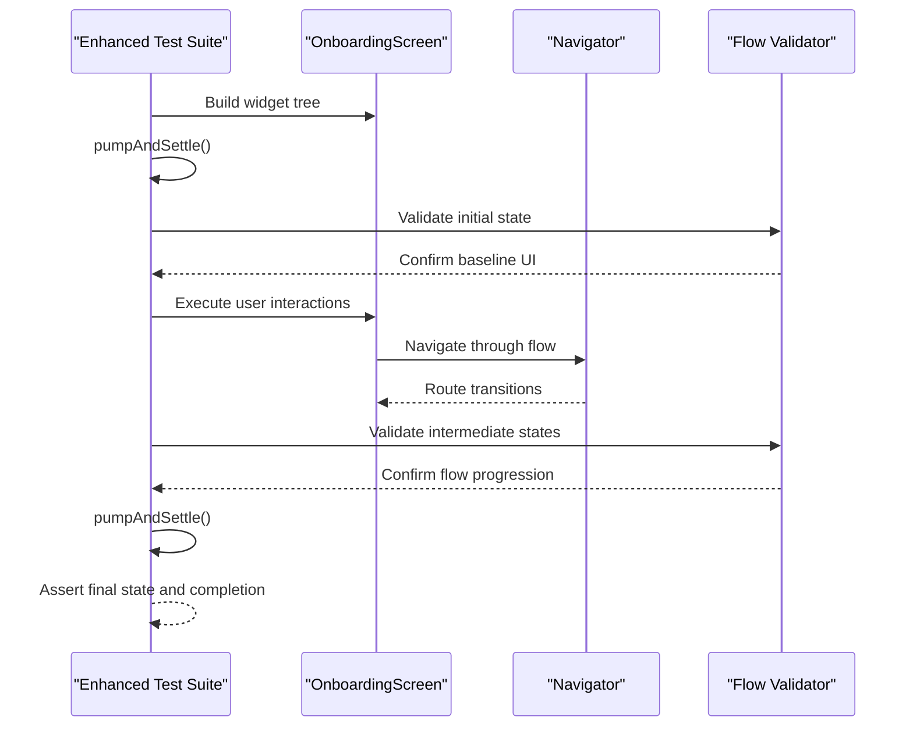
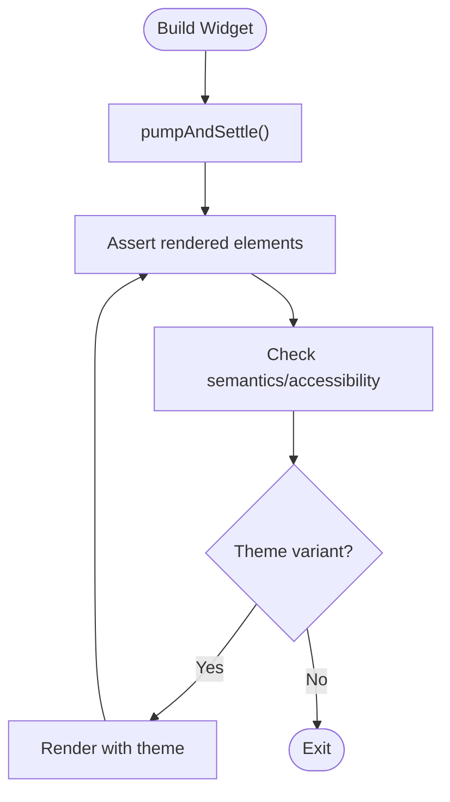
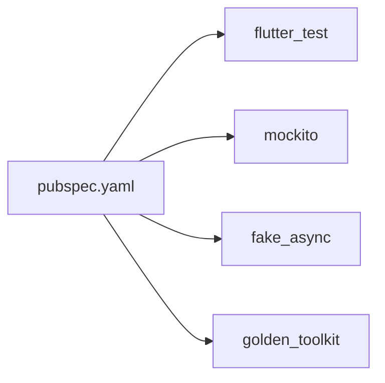

# Testing Strategy

<cite>
**Referenced Files in This Document**
- [pubspec.yaml](file://pubspec.yaml)
- [lib/main.dart](file://lib/main.dart)
- [test/subscription_model_test.dart](file://test/subscription_model_test.dart)
- [test/settings_provider_test.dart](file://test/settings_provider_test.dart)
- [test/subscription_provider_test.dart](file://test/subscription_provider_test.dart)
- [test/onboarding_screen_test.dart](file://test/onboarding_screen_test.dart)
- [test/widgets_test.dart](file://test/widgets_test.dart)
</cite>

## Update Summary
**Changes Made**
- Enhanced onboarding screen testing infrastructure with comprehensive user flow validation
- Updated widget testing section to reflect new onboarding workflow coverage
- Strengthened integration-style test patterns for end-to-end user journeys
- Expanded testing guidelines for UI component validation and navigation flows

## Table of Contents
1. [Introduction](#introduction)
2. [Project Structure](#project-structure)
3. [Core Components](#core-components)
4. [Architecture Overview](#architecture-overview)
5. [Detailed Component Analysis](#detailed-component-analysis)
6. [Dependency Analysis](#dependency-analysis)
7. [Performance Considerations](#performance-considerations)
8. [Troubleshooting Guide](#troubleshooting-guide)
9. [Conclusion](#conclusion)
10. [Appendices](#appendices)

## Introduction
This document defines the testing strategy for the ASSINATURAS NINJA Flutter application. It covers unit tests for models and providers, widget tests for UI components, and integration-style tests for user workflows. The enhanced testing infrastructure now includes comprehensive onboarding screen tests that ensure quality assurance for user flow functionality. It also explains test organization, mocking strategies, test data management, guidelines for writing effective tests, coverage expectations, continuous integration setup, tools and frameworks used, debugging techniques, performance testing approaches, and common patterns and best practices.

## Project Structure
The project follows a standard Flutter layout with tests colocated under the test directory. The current test suite includes:
- Unit tests for domain models and state providers
- Widget tests for screens and reusable widgets
- Enhanced onboarding workflow tests validating complete user journeys from launch to completion

**Diagram sources**
- [lib/main.dart](file://lib/main.dart)
- [test/subscription_model_test.dart](file://test/subscription_model_test.dart)
- [test/settings_provider_test.dart](file://test/settings_provider_test.dart)
- [test/subscription_provider_test.dart](file://test/subscription_provider_test.dart)
- [test/onboarding_screen_test.dart](file://test/onboarding_screen_test.dart)
- [test/widgets_test.dart](file://test/widgets_test.dart)

**Section sources**
- [pubspec.yaml](file://pubspec.yaml)
- [lib/main.dart](file://lib/main.dart)
- [test/subscription_model_test.dart](file://test/subscription_model_test.dart)
- [test/settings_provider_test.dart](file://test/settings_provider_test.dart)
- [test/subscription_provider_test.dart](file://test/subscription_provider_test.dart)
- [test/onboarding_screen_test.dart](file://test/onboarding_screen_test.dart)
- [test/widgets_test.dart](file://test/widgets_test.dart)

## Core Components
This section outlines the primary testing targets and how they are exercised by the existing tests.

- Models
  - Subscription model is validated via dedicated unit tests focusing on equality, serialization boundaries, and business rules.
  - Recommended additions: boundary value tests, invalid input handling, and immutability checks.

- Providers
  - Settings provider and subscription provider are tested to ensure state transitions, side effects (e.g., persistence), and reactive updates behave as expected.
  - Recommended additions: error propagation, async operations, and dependency injection verification.

- Widgets and Screens
  - **Updated**: Onboarding screen now features enhanced testing infrastructure with comprehensive user flow validation covering initial render, user interactions, navigation outcomes, and state-driven UI changes. Generic widgets are covered by widget tests that assert UI rendering, interactions, and navigation outcomes.
  - Recommended additions: accessibility assertions, theme/dark mode checks, and localization coverage.

- Integration-style Tests
  - **Enhanced**: Onboarding flow test validates a complete user journey from launch to completion, including navigation and state changes with improved quality assurance mechanisms.
  - Recommended additions: service layer stubs, database or storage mocks, and network failure scenarios.

**Section sources**
- [test/subscription_model_test.dart](file://test/subscription_model_test.dart)
- [test/settings_provider_test.dart](file://test/settings_provider_test.dart)
- [test/subscription_provider_test.dart](file://test/subscription_provider_test.dart)
- [test/onboarding_screen_test.dart](file://test/onboarding_screen_test.dart)
- [test/widgets_test.dart](file://test/widgets_test.dart)

## Architecture Overview
The testing architecture aligns with the app's layered structure:
- Unit tests target pure logic in models and providers
- Widget tests target presentation layer components with enhanced onboarding workflow coverage
- Integration tests simulate user workflows across layers using lightweight mocks/stubs

[No sources needed since this diagram shows conceptual workflow, not actual code structure]

## Detailed Component Analysis

### Model Testing: Subscription Model
Focus areas:
- Equality and hashing behavior
- Serialization/deserialization edge cases
- Business rule validation (e.g., date ranges, required fields)
- Immutability guarantees

Recommended patterns:
- Use golden fixtures for serialized payloads
- Parameterized tests for multiple valid/invalid inputs
- Deterministic time handling for date-related logic

**Section sources**
- [test/subscription_model_test.dart](file://test/subscription_model_test.dart)

### Provider Testing: Settings Provider
Focus areas:
- State initialization and default values
- Asynchronous updates and persistence
- Error propagation and recovery
- Reactive listeners and rebuild triggers

Recommended patterns:
- Mock external dependencies (storage, preferences)
- Verify no unexpected rebuilds using tester.pumpAndSettle()
- Test concurrent updates and race conditions deterministically

**Section sources**
- [test/settings_provider_test.dart](file://test/settings_provider_test.dart)

### Provider Testing: Subscription Provider
Focus areas:
- CRUD operations over subscriptions
- Conflict resolution and optimistic updates
- Network/storage error handling
- Listener notifications and UI synchronization

Recommended patterns:
- Stub network responses and storage errors
- Validate idempotency of actions
- Ensure cleanup on dispose

**Section sources**
- [test/subscription_provider_test.dart](file://test/subscription_provider_test.dart)

### Widget Testing: Enhanced Onboarding Screen
**Updated**: The onboarding screen testing infrastructure has been significantly enhanced to provide comprehensive quality assurance for user flow functionality.

Focus areas:
- Initial render and layout validation
- User interactions (taps, text input) with precise interaction tracking
- Navigation outcomes and route transitions
- State-driven UI changes throughout the user journey
- End-to-end workflow validation from launch to completion

Recommended patterns:
- Use tester.pumpWidget() and pumpAndSettle() for proper widget lifecycle management
- TapFinder and find.byType() for precise interaction targeting
- Verify route pushes and pop behaviors with comprehensive navigation assertions
- Implement step-by-step user flow validation with intermediate state checks

**Section sources**
- [test/onboarding_screen_test.dart](file://test/onboarding_screen_test.dart)

### Widget Testing: Reusable Widgets
Focus areas:
- Rendering consistency across themes
- Accessibility labels and semantics
- Input validation feedback
- Performance-sensitive rendering paths

Recommended patterns:
- Golden tests for visual regression
- Semantics tree assertions
- Theme and locale variations

**Section sources**
- [test/widgets_test.dart](file://test/widgets_test.dart)

## Dependency Analysis
Testing dependencies are declared in the package manifest. The test suite relies on Flutter's testing framework and any additional packages used by providers or services.

**Diagram sources**
- [pubspec.yaml](file://pubspec.yaml)

**Section sources**
- [pubspec.yaml](file://pubspec.yaml)

## Performance Considerations
- Prefer deterministic timing: use FakeAsync or controlled timers to avoid flaky tests.
- Minimize heavy widget trees in unit tests; isolate logic in providers and models.
- Use pumpAndSettle() judiciously; prefer targeted pumps when possible.
- For widget tests, consider golden comparisons to catch regressions early.
- Profile critical paths with Flutter DevTools and add focused tests around hotspots.
- **Updated**: Enhanced onboarding tests should be optimized for performance by using efficient widget tree construction and minimizing unnecessary rebuilds during user flow validation.

[No sources needed since this section provides general guidance]

## Troubleshooting Guide
Common issues and resolutions:
- Flaky tests due to async timing: replace real timers with FakeAsync and control event loops explicitly.
- Unresolved dependencies in provider tests: inject mocks or fakes via constructor parameters or provider overrides.
- Widget test timeouts: reduce subtree complexity, isolate interactions, and verify only necessary parts of the tree.
- Golden mismatches: update baselines after intentional UI changes; ensure consistent device metrics and fonts.
- Navigation assertions failing: wrap Navigator in a testable wrapper or use MaterialApp's routes and observers for easier verification.
- **Updated**: Enhanced onboarding flow tests may require careful attention to navigation timing and state synchronization between steps.

Debugging techniques:
- Use debugPrint() sparingly and filter logs during CI runs.
- Leverage Flutter Inspector and DevTools in interactive runs.
- Isolate failures by running single test files and narrowing down interactions.
- **Updated**: For complex user flow tests, implement step-by-step logging to track test execution progress and identify specific failure points in the user journey.

[No sources needed since this section provides general guidance]

## Conclusion
The current test suite establishes a solid foundation covering models, providers, and key UI components. The enhanced testing infrastructure with comprehensive onboarding screen tests ensures robust quality assurance for user flow functionality. Expanding coverage with robust mocking, comprehensive integration flows, and performance-oriented tests will further improve reliability and maintainability. Adopting the patterns and guidelines herein will help sustain high-quality tests aligned with the application's architecture.

[No sources needed since this section summarizes without analyzing specific files]

## Appendices

### Test Organization Guidelines
- Place unit tests near their source modules where feasible; otherwise group by feature under test/.
- Name test files descriptively and mirror production module names.
- Keep tests small, focused, and independent; avoid shared mutable state between tests.
- **Updated**: Organize enhanced user flow tests in dedicated directories that reflect the logical sequence of user interactions.

### Mocking Strategies
- Use mock classes for services, repositories, and external APIs.
- Inject mocks via constructors or provider overrides.
- Validate interactions (calls, arguments) and return values deterministically.

### Test Data Management
- Centralize fixtures in a dedicated folder (e.g., test/fixtures).
- Use JSON or Dart objects for stable, versioned test payloads.
- Generate large datasets programmatically to cover edge cases.

### Writing Effective Tests
- Follow Arrange-Act-Assert structure.
- Cover happy paths, error paths, and boundary conditions.
- Avoid testing implementation details; focus on observable behavior.
- **Updated**: For user flow tests, validate each step of the journey and ensure intermediate states are properly verified.

### Coverage Requirements
- Aim for high branch and line coverage on core logic (models, providers).
- Prioritize critical user journeys and complex algorithms.
- Treat coverage as a guide, not a goal; meaningful tests matter more than percentages.
- **Updated**: Enhanced onboarding flow tests should achieve comprehensive coverage of all user interaction paths and navigation scenarios.

### Continuous Integration Setup
- Run all tests on every PR with a headless Flutter environment.
- Cache dependencies to speed up builds.
- Publish test reports and artifacts (logs, screenshots) for review.
- Gate merges on passing tests and minimum coverage thresholds.
- **Updated**: Include enhanced user flow tests in CI pipeline with appropriate timeout configurations for complex navigation scenarios.

### Tools and Frameworks
- flutter_test: core unit and widget testing framework
- mockito: mocking library for isolating dependencies
- fake_async: deterministic asynchronous testing
- golden_toolkit: golden image testing for UI regression

### Common Test Patterns and Best Practices
- Parameterized tests for multiple inputs
- Fixture-based testing for serialization
- Observer-based testing for provider state changes
- Interaction-driven widget tests with explicit taps and inputs
- Cleanup and reset between tests to prevent cross-test pollution
- **Updated**: Step-by-step user flow validation with intermediate state assertions for comprehensive journey testing