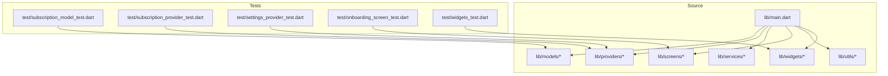
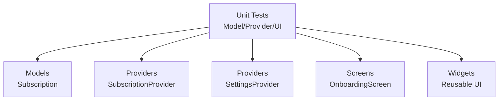
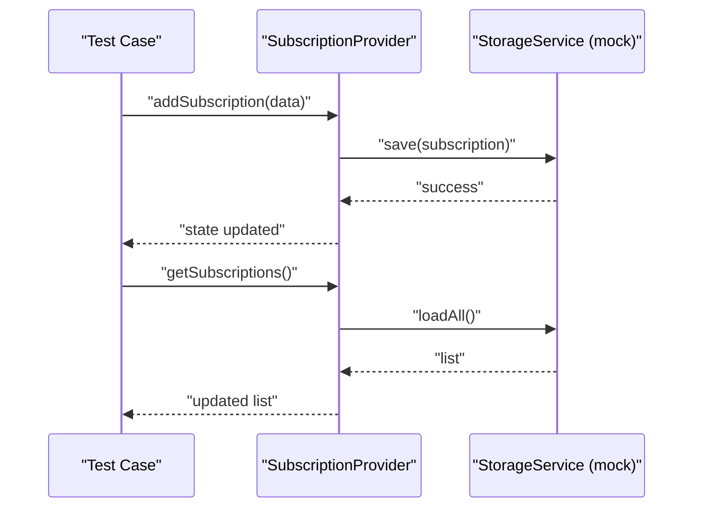
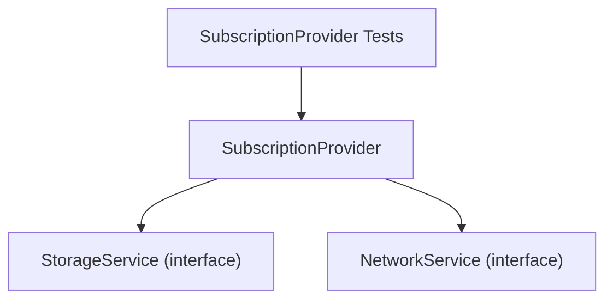

# Unit Testing

<cite>
**Referenced Files in This Document**
- [subscription_model_test.dart](file://test/subscription_model_test.dart)
- [subscription_provider_test.dart](file://test/subscription_provider_test.dart)
- [settings_provider_test.dart](file://test/settings_provider_test.dart)
- [onboarding_screen_test.dart](file://test/onboarding_screen_test.dart)
- [widgets_test.dart](file://test/widgets_test.dart)
- [main.dart](file://lib/main.dart)
</cite>

## Table of Contents
1. [Introduction](#introduction)
2. [Project Structure](#project-structure)
3. [Core Components](#core-components)
4. [Architecture Overview](#architecture-overview)
5. [Detailed Component Analysis](#detailed-component-analysis)
6. [Dependency Analysis](#dependency-analysis)
7. [Performance Considerations](#performance-considerations)
8. [Troubleshooting Guide](#troubleshooting-guide)
9. [Conclusion](#conclusion)
10. [Appendices](#appendices)

## Introduction
This document provides a comprehensive unit testing guide for the ASSINATURAS NINJA application. It focuses on testing strategies for models, providers, and business logic components, with emphasis on test organization patterns, mocking techniques for external dependencies, and assertion best practices. It also includes examples for testing subscription CRUD operations, provider state management, and data validation logic, along with guidance on test data setup, isolation strategies, and performance considerations to ensure reliable and maintainable tests.

## Project Structure
The project follows a standard Flutter layout with dedicated directories for models, providers, services, screens, utils, and widgets. Tests are organized under the test directory, mirroring the structure of the source code where applicable. The main entry point is located at lib/main.dart.

[No sources needed since this diagram shows conceptual workflow, not actual code structure]

## Core Components
This section outlines the core areas covered by unit tests:
- Models: Data structures and validation rules for subscriptions.
- Providers: State management for subscriptions and settings.
- Screens and Widgets: UI-related behavior and interactions.

Key testing objectives:
- Validate model immutability and equality semantics.
- Verify provider state transitions and persistence integration points.
- Ensure UI components respond correctly to user actions and state changes.

**Section sources**
- [subscription_model_test.dart](file://test/subscription_model_test.dart)
- [subscription_provider_test.dart](file://test/subscription_provider_test.dart)
- [settings_provider_test.dart](file://test/settings_provider_test.dart)
- [onboarding_screen_test.dart](file://test/onboarding_screen_test.dart)
- [widgets_test.dart](file://test/widgets_test.dart)

## Architecture Overview
At a high level, the app separates concerns into models (data), providers (state), and UI layers (screens/widgets). Unit tests target these layers independently:
- Model tests validate data integrity and transformation logic.
- Provider tests verify state updates, side effects, and interactions with services or storage.
- Screen and widget tests focus on user interactions and rendering based on provided state.

[No sources needed since this diagram shows conceptual workflow, not actual code structure]

## Detailed Component Analysis

### Subscription Model Testing
Focus areas:
- Equality and hashing correctness.
- Immutability guarantees.
- Validation rules for required fields and constraints.
- Conversion between JSON and domain objects.

Recommended strategies:
- Use golden fixtures for JSON payloads to ensure stable parsing.
- Assert both positive and negative cases for validation.
- Test edge cases such as empty strings, nulls, and boundary values.

Example scenarios:
- Create valid subscription instances and assert properties.
- Attempt invalid inputs and assert expected errors or exceptions.
- Serialize and deserialize to ensure round-trip consistency.

**Section sources**
- [subscription_model_test.dart](file://test/subscription_model_test.dart)

### Subscription Provider Testing
Focus areas:
- CRUD operations: create, read, update, delete.
- State transitions after mutations.
- Error handling and recovery paths.
- Interaction with external dependencies (e.g., storage or network).

Mocking techniques:
- Replace real storage/network calls with test doubles that return deterministic results.
- Inject mock dependencies via constructor parameters or dependency injection containers.
- Verify method call counts and arguments using verification helpers.

State management patterns:
- Initialize provider with known state.
- Trigger actions and assert resulting state snapshots.
- Ensure async operations complete before assertions.

Example scenarios:
- Add a new subscription and assert list length and item presence.
- Update an existing subscription and assert property changes.
- Delete a subscription and assert removal from state.
- Handle failure scenarios by asserting error states or messages.

**Diagram sources**
- [subscription_provider_test.dart](file://test/subscription_provider_test.dart)

**Section sources**
- [subscription_provider_test.dart](file://test/subscription_provider_test.dart)

### Settings Provider Testing
Focus areas:
- Persistence of settings across app sessions.
- Default values and fallback behaviors.
- Reactive updates when settings change.

Testing strategies:
- Initialize provider with default settings and verify initial state.
- Mutate settings and assert persisted values.
- Simulate missing or corrupted data and assert safe defaults.

Example scenarios:
- Toggle a boolean setting and verify it persists.
- Change a string setting and confirm retrieval returns the updated value.
- Clear settings and assert reset to defaults.

**Section sources**
- [settings_provider_test.dart](file://test/settings_provider_test.dart)

### Onboarding Screen Testing
Focus areas:
- User interactions (taps, input changes).
- Navigation triggers based on completion state.
- Rendering correctness given different provider states.

Testing strategies:
- Use widget tester to simulate taps and input.
- Provide mocked providers to control state.
- Assert navigation calls and UI elements visibility.

Example scenarios:
- Tap “Next” and assert navigation to the next screen.
- Render onboarding steps with different content and assert text presence.
- Handle back navigation and ensure state remains consistent.

**Section sources**
- [onboarding_screen_test.dart](file://test/onboarding_screen_test.dart)

### Widgets Testing
Focus areas:
- Reusable UI components’ behavior and appearance.
- Event propagation and callbacks.
- Responsiveness to theme and locale changes.

Testing strategies:
- Isolate widgets by providing minimal required context.
- Mock complex dependencies to keep tests fast and deterministic.
- Use semantic checks to assert accessibility and labels.

Example scenarios:
- Tap a button and assert callback invocation.
- Render a list item with varying data and assert layout.
- Verify theme-dependent colors and fonts are applied.

**Section sources**
- [widgets_test.dart](file://test/widgets_test.dart)

## Dependency Analysis
Unit tests should minimize coupling to external systems. Common dependencies include:
- Storage services for persistence.
- Network clients for remote data.
- Platform-specific APIs.

Best practices:
- Define interfaces for external dependencies and inject mocks in tests.
- Keep provider tests focused on state transitions rather than I/O details.
- Avoid shared mutable state across tests; isolate each test case.

[No sources needed since this diagram shows conceptual workflow, not actual code structure]

## Performance Considerations
- Prefer pure functions and immutable data to reduce test complexity and execution time.
- Use lightweight mocks instead of heavy integrations.
- Group related assertions to avoid redundant setup/teardown.
- Run tests in parallel where possible and avoid blocking operations.
- Cache expensive computations within tests if necessary, but ensure determinism.

[No sources needed since this section provides general guidance]

## Troubleshooting Guide
Common issues and resolutions:
- Flaky tests due to timing: introduce explicit waits or pump loops until state stabilizes.
- Unexpected state mutations: ensure providers do not mutate shared instances; use copyWith or immutable patterns.
- Assertion failures on UI: verify widget tree depth and ensure all asynchronous work completes before assertions.
- Mock misconfiguration: double-check method signatures and return types; log mock invocations during debugging.

**Section sources**
- [subscription_provider_test.dart](file://test/subscription_provider_test.dart)
- [settings_provider_test.dart](file://test/settings_provider_test.dart)
- [onboarding_screen_test.dart](file://test/onboarding_screen_test.dart)
- [widgets_test.dart](file://test/widgets_test.dart)

## Conclusion
Effective unit testing for ASSINATURAS NINJA hinges on clear separation of concerns, robust mocking of external dependencies, and precise assertions over state and behavior. By following the strategies outlined above—especially around model validation, provider state transitions, and UI interaction—you can build a reliable test suite that safeguards functionality and accelerates development.

[No sources needed since this section summarizes without analyzing specific files]

## Appendices

### Test Organization Patterns
- Place tests close to their source files when feasible (e.g., test/subscription_model_test.dart for models).
- Use descriptive test names that convey intent and scenario.
- Separate setup, exercise, and assert phases clearly within each test.

### Mocking Techniques for External Dependencies
- Implement interfaces for storage and network layers.
- Provide test implementations that return deterministic data.
- Verify interactions using verification helpers to ensure correct usage.

### Assertion Best Practices
- Assert exact state snapshots for critical paths.
- Use meaningful error messages in assertions to aid debugging.
- Cover both success and failure branches explicitly.

### Example Scenarios Reference
- Subscription CRUD operations: see [subscription_provider_test.dart](file://test/subscription_provider_test.dart).
- Provider state management: see [settings_provider_test.dart](file://test/settings_provider_test.dart).
- Data validation logic: see [subscription_model_test.dart](file://test/subscription_model_test.dart).
- UI interactions: see [onboarding_screen_test.dart](file://test/onboarding_screen_test.dart) and [widgets_test.dart](file://test/widgets_test.dart).

**Section sources**
- [subscription_model_test.dart](file://test/subscription_model_test.dart)
- [subscription_provider_test.dart](file://test/subscription_provider_test.dart)
- [settings_provider_test.dart](file://test/settings_provider_test.dart)
- [onboarding_screen_test.dart](file://test/onboarding_screen_test.dart)
- [widgets_test.dart](file://test/widgets_test.dart)