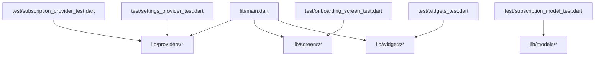
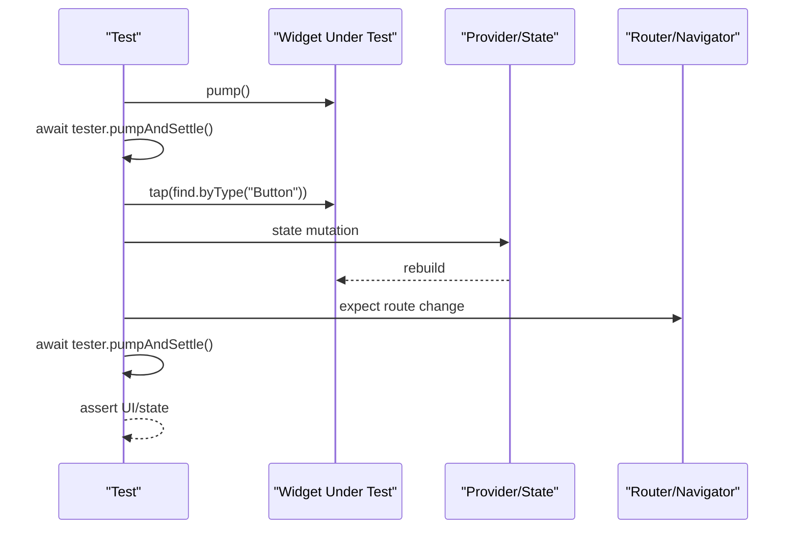
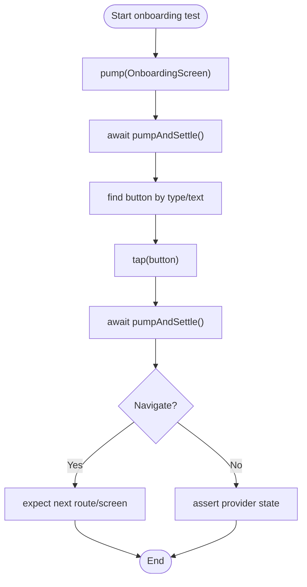
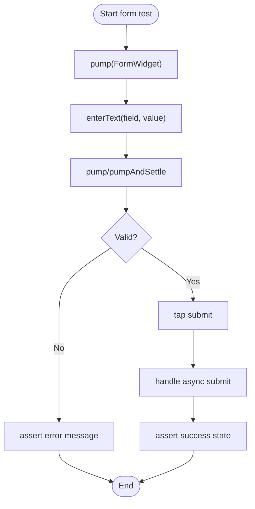
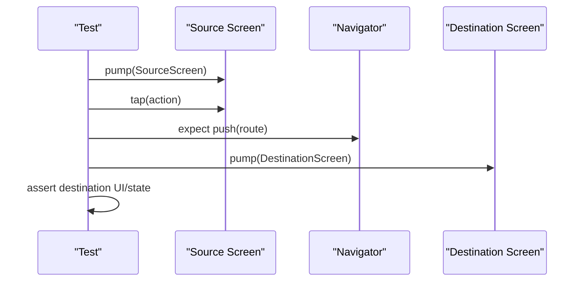
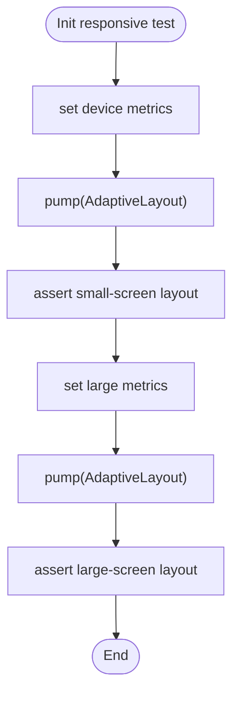
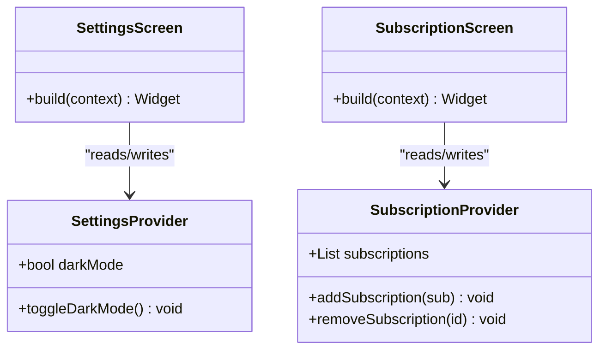
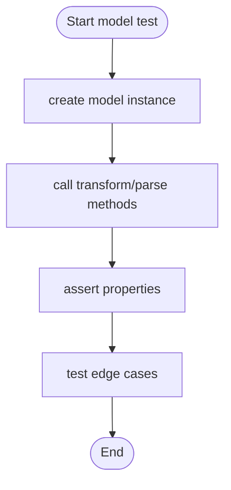
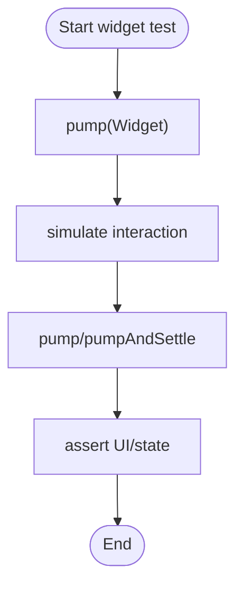
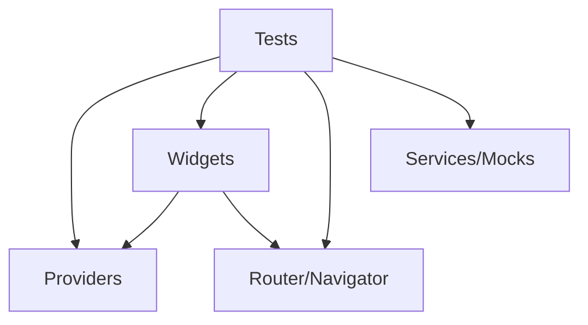

# Widget Testing

<cite>
**Referenced Files in This Document**
- [main.dart](file://lib/main.dart)
- [onboarding_screen_test.dart](file://test/onboarding_screen_test.dart)
- [settings_provider_test.dart](file://test/settings_provider_test.dart)
- [subscription_model_test.dart](file://test/subscription_model_test.dart)
- [subscription_provider_test.dart](file://test/subscription_provider_test.dart)
- [widgets_test.dart](file://test/widgets_test.dart)
</cite>

## Table of Contents
1. [Introduction](#introduction)
2. [Project Structure](#project-structure)
3. [Core Components](#core-components)
4. [Architecture Overview](#architecture-overview)
5. [Detailed Component Analysis](#detailed-component-analysis)
6. [Dependency Analysis](#dependency-analysis)
7. [Performance Considerations](#performance-considerations)
8. [Troubleshooting Guide](#troubleshooting-guide)
9. [Conclusion](#conclusion)
10. [Appendices](#appendices)

## Introduction
This document provides comprehensive widget testing guidance for the ASSINATURAS NINJA Flutter application. It focuses on testing UI components, screen interactions, and user flows using Flutter’s widget testing framework. You will learn how to:
- Build and assert on widget trees
- Simulate user interactions (taps, text input, scrolling)
- Verify state changes and navigation outcomes
- Test asynchronous behavior and animations
- Use test utilities and mock widgets effectively
- Maintain reliable and performant tests across platforms

The strategies are grounded in the existing test files and core application entry point to ensure alignment with the project’s structure and patterns.

## Project Structure
At a high level, the Flutter app is organized into feature directories under lib (models, providers, screens, services, utils, widgets), with tests colocated under test. The main entry point initializes the app and its providers, while tests exercise individual widgets, providers, and models.

**Diagram sources**
- [main.dart](file://lib/main.dart)
- [onboarding_screen_test.dart](file://test/onboarding_screen_test.dart)
- [widgets_test.dart](file://test/widgets_test.dart)
- [subscription_provider_test.dart](file://test/subscription_provider_test.dart)
- [settings_provider_test.dart](file://test/settings_provider_test.dart)
- [subscription_model_test.dart](file://test/subscription_model_test.dart)

**Section sources**
- [main.dart](file://lib/main.dart)
- [onboarding_screen_test.dart](file://test/onboarding_screen_test.dart)
- [widgets_test.dart](file://test/widgets_test.dart)
- [subscription_provider_test.dart](file://test/subscription_provider_test.dart)
- [settings_provider_test.dart](file://test/settings_provider_test.dart)
- [subscription_model_test.dart](file://test/subscription_model_test.dart)

## Core Components
This section outlines the key testing targets and strategies based on the repository’s tests and entry point.

- Application bootstrap and provider setup
  - The app entry point wires up providers and routes. Tests should wrap widgets in the same provider context used by the app to ensure realistic state behavior.
  - Reference path: [main.dart](file://lib/main.dart)

- Onboarding screen tests
  - Validate initial UI elements, simulate user actions (e.g., tapping “Next”), and assert navigation or state transitions.
  - Reference path: [onboarding_screen_test.dart](file://test/onboarding_screen_test.dart)

- Provider tests (settings and subscription)
  - Exercise state mutations, verify derived values, and ensure reactive updates propagate to dependent widgets.
  - Reference paths:
    - [settings_provider_test.dart](file://test/settings_provider_test.dart)
    - [subscription_provider_test.dart](file://test/subscription_provider_test.dart)

- Model tests (subscription model)
  - Validate data transformations, validation rules, and equality/hash behaviors.
  - Reference path: [subscription_model_test.dart](file://test/subscription_model_test.dart)

- Reusable widget tests
  - Unit-test small, reusable widgets in isolation, including interaction handling and layout assertions.
  - Reference path: [widgets_test.dart](file://test/widgets_test.dart)

**Section sources**
- [main.dart](file://lib/main.dart)
- [onboarding_screen_test.dart](file://test/onboarding_screen_test.dart)
- [settings_provider_test.dart](file://test/settings_provider_test.dart)
- [subscription_provider_test.dart](file://test/subscription_provider_test.dart)
- [subscription_model_test.dart](file://test/subscription_model_test.dart)
- [widgets_test.dart](file://test/widgets_test.dart)

## Architecture Overview
Widget tests interact with the Flutter engine through a virtual tree. The typical flow is:
- Pump a widget tree into the tester
- Locate widgets via finders
- Simulate interactions (tap, enter text, scroll)
- Pump and settle to process async work and animations
- Assert on the resulting UI or state

[No sources needed since this diagram shows conceptual workflow, not actual code structure]

## Detailed Component Analysis

### Onboarding Screen Testing
Focus areas:
- Initial render: verify presence of title, description, and primary action buttons
- Interaction simulation: tap “Next” or “Skip” and assert navigation or state update
- Responsive behavior: test different viewports to ensure layout adapts
- Asynchronous flows: if there are delays or animations, use pumpAndSettle appropriately

Recommended approach:
- Wrap the screen in the same providers used by the app
- Use finders to locate actionable widgets
- Simulate taps and then pump until settled
- Assert that the next screen appears or that provider state changed

[No sources needed since this diagram shows conceptual workflow, not actual code structure]

**Section sources**
- [onboarding_screen_test.dart](file://test/onboarding_screen_test.dart)

### Form Inputs and Validation
Focus areas:
- Text field population via tester.enterText
- Validation feedback (error messages, disabled submit)
- Focus and keyboard simulation where relevant
- Async validation (debounce, network checks) using fakeAsync or mocks

Recommended approach:
- Pump a form widget with necessary providers
- Enter text and pump to trigger validation
- Assert error states and submission readiness
- For async validation, use fakeAsync and advance timers

[No sources needed since this diagram shows conceptual workflow, not actual code structure]

### Navigation Flows
Focus areas:
- Route expectations after user actions
- Passing parameters between screens
- Back navigation behavior

Recommended approach:
- Use NavigatorObserver or route matching in tests
- Expect specific route names or screen types after interactions
- Ensure provider state persists across navigations when required

[No sources needed since this diagram shows conceptual workflow, not actual code structure]

### Responsive Layouts
Focus areas:
- Testing multiple screen sizes and orientations
- Ensuring adaptive layouts and breakpoints behave correctly

Recommended approach:
- Use tester.view to set device metrics before pumping
- Assert visibility and positioning of key elements at different sizes
- Avoid brittle pixel-based assertions; prefer semantic or structural checks

[No sources needed since this diagram shows conceptual workflow, not actual code structure]

### Provider State Verification
Focus areas:
- Verifying state changes after user actions
- Ensuring dependent widgets rebuild with new values
- Isolating provider logic from UI

Recommended approach:
- Pump the widget with the appropriate provider scope
- Trigger actions that mutate state
- Use provider selectors or widget finders to assert derived values
- For complex state, consider unit-testing providers directly

**Diagram sources**
- [settings_provider_test.dart](file://test/settings_provider_test.dart)
- [subscription_provider_test.dart](file://test/subscription_provider_test.dart)

**Section sources**
- [settings_provider_test.dart](file://test/settings_provider_test.dart)
- [subscription_provider_test.dart](file://test/subscription_provider_test.dart)

### Model Testing
Focus areas:
- Data transformation and parsing
- Equality and hashing correctness
- Validation constraints

Recommended approach:
- Construct model instances with representative data
- Assert properties, computed fields, and conversion methods
- Cover edge cases and invalid inputs

[No sources needed since this diagram shows conceptual workflow, not actual code structure]

**Section sources**
- [subscription_model_test.dart](file://test/subscription_model_test.dart)

### Reusable Widgets
Focus areas:
- Isolated testing of small, composable widgets
- Interaction handling and visual assertions
- Parameter-driven behavior verification

Recommended approach:
- Pump the widget with minimal dependencies
- Simulate interactions and assert output
- Use custom finders for readability and maintainability

[No sources needed since this diagram shows conceptual workflow, not actual code structure]

**Section sources**
- [widgets_test.dart](file://test/widgets_test.dart)

## Dependency Analysis
Widget tests often depend on providers, services, and routing. To keep tests fast and deterministic:
- Provide lightweight mocks or fakes for external dependencies
- Scope providers around the widget under test
- Avoid heavy initialization in tests; defer to setUp or helper functions

[No sources needed since this diagram shows conceptual workflow, not actual code structure]

**Section sources**
- [main.dart](file://lib/main.dart)
- [onboarding_screen_test.dart](file://test/onboarding_screen_test.dart)
- [widgets_test.dart](file://test/widgets_test.dart)
- [subscription_provider_test.dart](file://test/subscription_provider_test.dart)
- [settings_provider_test.dart](file://test/settings_provider_test.dart)
- [subscription_model_test.dart](file://test/subscription_model_test.dart)

## Performance Considerations
- Prefer pumpAndSettle only when necessary; use pump for synchronous updates to speed up tests
- Minimize widget tree size in tests; isolate small components whenever possible
- Avoid real network calls; use mocks or fakes
- Cache expensive computations in providers during tests if safe
- Group related assertions to reduce repeated pumping

[No sources needed since this section provides general guidance]

## Troubleshooting Guide
Common issues and remedies:
- Unsettled animations or async tasks
  - Use await tester.pumpAndSettle() after interactions that trigger animations or futures
- Finder not found
  - Ensure the widget is pumped and visible; check keys, types, and semantics
- Provider state not updating
  - Wrap the widget in the correct provider scope; verify actions mutate state within the same context
- Flaky navigation tests
  - Await route transitions and pumpAndSettle before asserting destination UI
- Platform-specific behavior
  - Mock platform channels or conditionally skip tests on unsupported platforms

[No sources needed since this section provides general guidance]

## Conclusion
By following these widget testing strategies—building focused widget trees, simulating realistic interactions, verifying state and navigation, and leveraging mocks—you can achieve reliable and maintainable tests for the ASSINATURAS NINJA application. Align your tests with the app’s provider architecture and entry point to reflect production behavior while keeping execution fast and deterministic.

[No sources needed since this section summarizes without analyzing specific files]

## Appendices

### Quick Checklist for Widget Tests
- Wrap widgets in the same provider scope as the app
- Use descriptive finders and keys
- Pump and settle appropriately
- Assert on meaningful UI or state changes
- Keep tests isolated and fast

[No sources needed since this section provides general guidance]