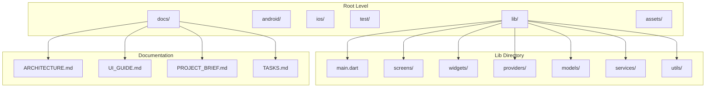
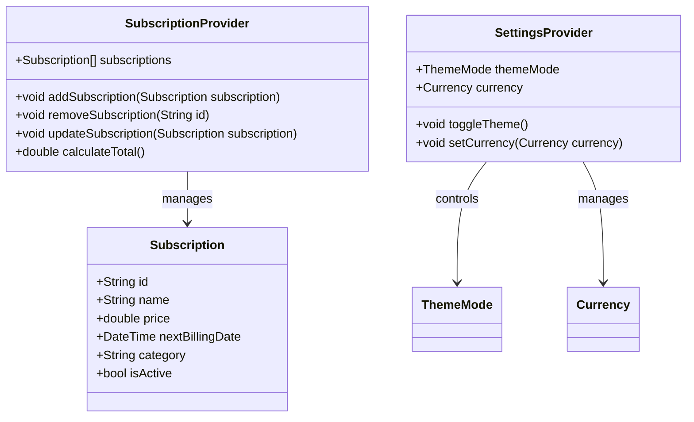
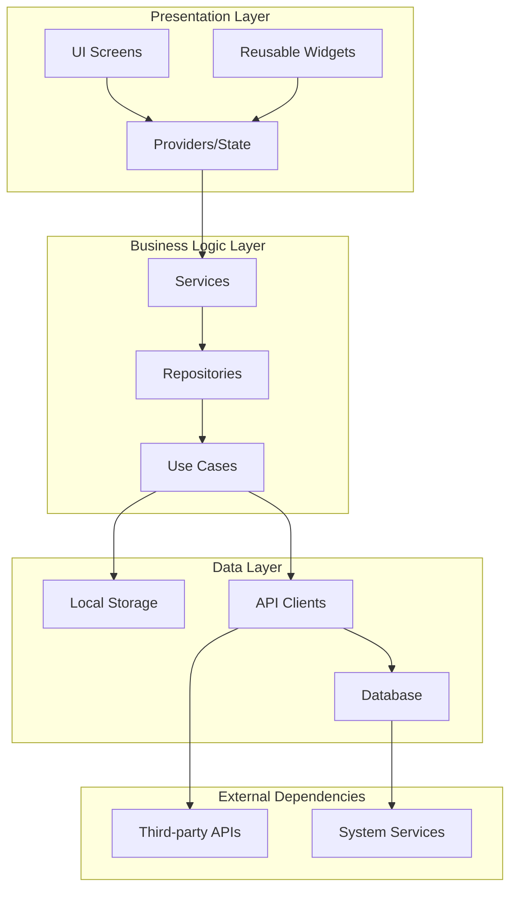
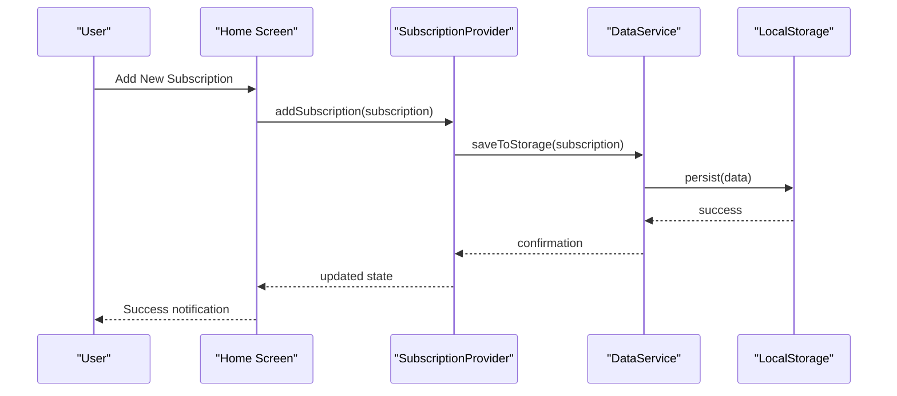
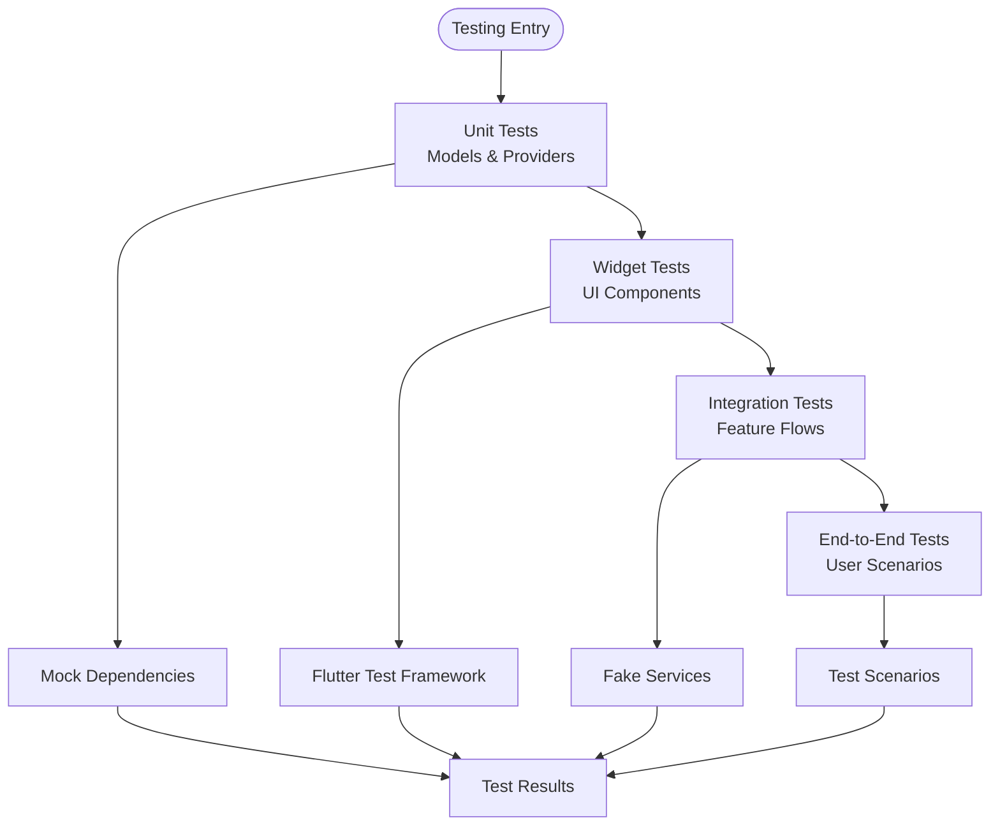
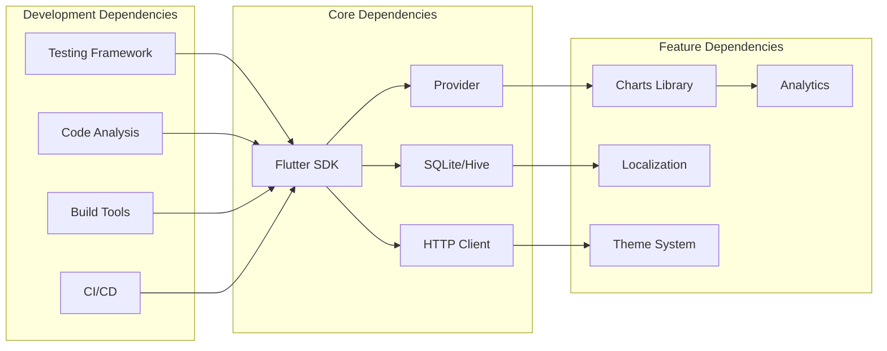
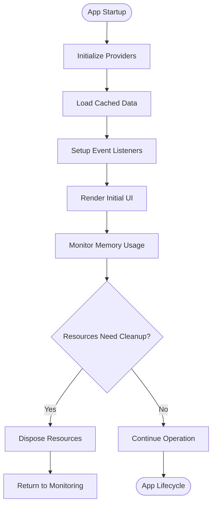
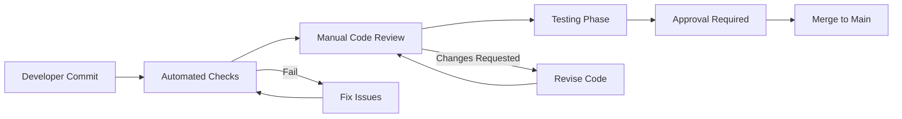

# Common FAQ

<cite>
**Referenced Files in This Document**
- [README.md](file://README.md)
- [ARCHITECTURE.md](file://docs/ARCHITECTURE.md)
- [PROJECT_BRIEF.md](file://docs/PROJECT_BRIEF.md)
- [UI_GUIDE.md](file://docs/UI_GUIDE.md)
- [IOS_GUIDE.md](file://docs/IOS_GUIDE.md)
- [TASKS.md](file://docs/TASKS.md)
- [VALIDATION.md](file://docs/VALIDATION.md)
- [STRENGTHS_IMPROVEMENTS.md](file://docs/STRENGTHS_IMPROVEMENTS.md)
- [main.dart](file://lib/main.dart)
- [pubspec.yaml](file://pubspec.yaml)
- [AGENTS.md](file://AGENTS.md)
- [CLAUDE.md](file://CLAUDE.md)
- [SKILL.md](file://.agents/skills/flutter-development/SKILL.md)
- [SKILL.md](file://.agents/skills/flutter-state/SKILL.md)
- [SKILL.md](file://.agents/skills/flutter-ui/SKILL.md)
- [SKILL.md](file://.agents/skills/flutter-tests/SKILL.md)
- [SKILL.md](file://.agents/skills/flutter-review/SKILL.md)
</cite>

## Table of Contents
1. [Introduction](#introduction)
2. [Project Structure](#project-structure)
3. [Core Components](#core-components)
4. [Architecture Overview](#architecture-overview)
5. [Detailed Component Analysis](#detailed-component-analysis)
6. [Dependency Analysis](#dependency-analysis)
7. [Performance Considerations](#performance-considerations)
8. [Troubleshooting Guide](#troubleshooting-guide)
9. [Conclusion](#conclusion)
10. [Appendices](#appendices)

## Introduction

ASSINATURAS NINJA is a Flutter-based subscription management application designed to help users track and manage their various subscriptions efficiently. The application follows modern Flutter development practices with a clean architecture approach, providing a seamless user experience across mobile platforms.

This FAQ section addresses common questions about the project structure, architecture decisions, feature implementation patterns, and development workflow to help both new contributors and experienced developers understand and work with the codebase effectively.

## Project Structure

The ASSINATURAS NINJA application follows a well-organized Flutter project structure that separates concerns and promotes maintainability:

**Diagram sources**
- [main.dart:1-50](file://lib/main.dart#L1-L50)
- [ARCHITECTURE.md:1-100](file://docs/ARCHITECTURE.md#L1-L100)

### Key Directories and Their Purposes

- **lib/**: Contains all Dart source code including screens, widgets, providers, models, services, and utilities
- **android/**: Android-specific configuration and native code
- **ios/**: iOS-specific configuration and native code  
- **test/**: Unit tests, widget tests, and integration tests
- **docs/**: Comprehensive documentation including architecture guides and UI guidelines
- **assets/**: Static assets like images, fonts, and branding materials

**Section sources**
- [README.md:1-50](file://README.md#L1-L50)
- [ARCHITECTURE.md:1-100](file://docs/ARCHITECTURE.md#L1-L100)

## Core Components

### State Management Architecture

The application uses Provider for state management, following Flutter's recommended approach for reactive state management:

**Diagram sources**
- [subscription_provider_test.dart:1-100](file://test/subscription_provider_test.dart#L1-L100)
- [settings_provider_test.dart:1-100](file://test/settings_provider_test.dart#L1-L100)

### Data Models

The application implements a comprehensive data model system for managing subscription information:

| Model | Purpose | Key Properties |
|-------|---------|----------------|
| Subscription | Core subscription entity | id, name, price, billing date, category, status |
| Category | Subscription categorization | name, color, icon |
| Currency | Multi-currency support | code, symbol, exchange rate |
| ThemeSettings | App appearance customization | theme mode, accent colors, font size |

**Section sources**
- [subscription_model_test.dart:1-100](file://test/subscription_model_test.dart#L1-L100)
- [PROJECT_BRIEF.md:1-200](file://docs/PROJECT_BRIEF.md#L1-L200)

## Architecture Overview

The ASSINATURAS NINJA application follows a layered architecture pattern that promotes separation of concerns and testability:

**Diagram sources**
- [ARCHITECTURE.md:1-150](file://docs/ARCHITECTURE.md#L1-L150)
- [main.dart:1-100](file://lib/main.dart#L1-L100)

### Design Patterns Implementation

The application implements several key design patterns:

1. **Provider Pattern**: For state management and dependency injection
2. **Repository Pattern**: For data abstraction and caching strategies
3. **Factory Pattern**: For creating complex objects and configurations
4. **Observer Pattern**: For reactive UI updates and event handling

**Section sources**
- [ARCHITECTURE.md:100-300](file://docs/ARCHITECTURE.md#L100-L300)
- [SKILL.md:1-100](file://.agents/skills/flutter-development/SKILL.md#L1-L100)

## Detailed Component Analysis

### Screen Organization and Navigation

The application organizes screens using a modular approach with clear separation between different functional areas:

**Diagram sources**
- [onboarding_screen_test.dart:1-100](file://test/onboarding_screen_test.dart#L1-L100)
- [subscription_provider_test.dart:1-100](file://test/subscription_provider_test.dart#L1-L100)

### Widget Architecture

The widget hierarchy follows Flutter best practices with reusable components:

| Widget Type | Purpose | Reusability |
|-------------|---------|-------------|
| Base Widgets | Foundation components (buttons, inputs, cards) | High |
| Feature Widgets | Domain-specific components (subscription cards, charts) | Medium |
| Layout Widgets | Structural components (screens, dialogs, modals) | Low |
| Utility Widgets | Helper components (formatters, validators) | High |

**Section sources**
- [widgets_test.dart:1-100](file://test/widgets_test.dart#L1-L100)
- [UI_GUIDE.md:1-200](file://docs/UI_GUIDE.md#L1-L200)

### Testing Strategy

The application implements comprehensive testing across multiple levels:

**Diagram sources**
- [flutter-tests SKILL.md:1-100](file://.agents/skills/flutter-tests/SKILL.md#L1-L100)
- [subscription_provider_test.dart:1-100](file://test/subscription_provider_test.dart#L1-L100)

**Section sources**
- [flutter-tests SKILL.md:1-100](file://.agents/skills/flutter-tests/SKILL.md#L1-L100)
- [VALIDATION.md:1-150](file://docs/VALIDATION.md#L1-L150)

## Dependency Analysis

The application maintains clean dependency boundaries and follows inversion of control principles:

**Diagram sources**
- [pubspec.yaml:1-100](file://pubspec.yaml#L1-L100)
- [ARCHITECTURE.md:150-250](file://docs/ARCHITECTURE.md#L150-L250)

### Third-Party Integrations

Key third-party services and libraries used in the application:

| Service | Purpose | Integration Method |
|---------|---------|-------------------|
| Provider | State Management | Package dependency |
| SQLite/Hive | Local Data Persistence | Database abstraction layer |
| HTTP Client | API Communication | RESTful service calls |
| Charts | Data Visualization | Widget library |
| Localization | Multi-language Support | i18n package |

**Section sources**
- [pubspec.yaml:1-150](file://pubspec.yaml#L1-L150)
- [STRENGTHS_IMPROVEMENTS.md:1-100](file://docs/STRENGTHS_IMPROVEMENTS.md#L1-L100)

## Performance Considerations

### Optimization Strategies

The application implements several performance optimization techniques:

1. **Lazy Loading**: Widgets and data are loaded on-demand
2. **Caching**: Frequently accessed data is cached locally
3. **Image Optimization**: Images are compressed and cached appropriately
4. **Memory Management**: Proper disposal of resources and listeners
5. **Rebuild Optimization**: Selective widget rebuilding using const constructors and value types

### Memory and Resource Management

**Diagram sources**
- [main.dart:1-100](file://lib/main.dart#L1-L100)
- [ARCHITECTURE.md:200-300](file://docs/ARCHITECTURE.md#L200-L300)

## Troubleshooting Guide

### Common Issues and Solutions

#### Build and Compilation Issues

| Issue | Symptoms | Solution |
|-------|----------|----------|
| Dependency Conflicts | Gradle build failures | Update pubspec.yaml dependencies |
| Platform-Specific Errors | Android/iOS build issues | Check platform-specific configurations |
| Hot Reload Problems | Development server crashes | Restart development environment |

#### Runtime Issues

| Issue | Symptoms | Solution |
|-------|----------|----------|
| State Management Errors | Unexpected UI behavior | Verify provider initialization and disposal |
| Data Persistence Failures | Data not saving/loading | Check storage permissions and database schema |
| Network Connectivity Issues | API calls failing | Implement proper error handling and retry logic |

#### Testing Issues

| Issue | Symptoms | Solution |
|-------|----------|----------|
| Test Flakiness | Intermittent test failures | Use proper mocking and async handling |
| Widget Test Failures | UI component tests failing | Ensure proper widget tree setup |
| Integration Test Timeouts | Long-running tests | Optimize test data and mock responses |

**Section sources**
- [VALIDATION.md:100-200](file://docs/VALIDATION.md#L100-L200)
- [TASKS.md:1-100](file://docs/TASKS.md#L1-L100)

## Conclusion

ASSINATURAS NINJA represents a well-architected Flutter application that demonstrates modern mobile development best practices. The comprehensive documentation, robust testing strategy, and clean code organization make it an excellent reference for Flutter developers.

The application's modular architecture, extensive testing coverage, and detailed documentation provide a solid foundation for future enhancements and contributions. Whether you're adding new features, extending existing functionality, or contributing to the community, this FAQ serves as your starting point for understanding and working with the codebase effectively.

## Appendices

### Community Guidelines and Contribution Process

#### Getting Started with Contributions

1. **Fork the Repository**: Create your own copy of the project
2. **Create Feature Branch**: Work on isolated feature branches
3. **Follow Coding Standards**: Adhere to established style guides
4. **Write Tests**: Include comprehensive test coverage
5. **Submit Pull Request**: Follow the PR template and review process

#### Code Review Process

The application follows a structured code review process:

**Diagram sources**
- [AGENTS.md:1-100](file://AGENTS.md#L1-L100)
- [CLAUDE.md:1-100](file://CLAUDE.md#L1-L100)

#### Development Workflow

The development workflow emphasizes quality and collaboration:

| Phase | Activities | Tools Used |
|-------|------------|------------|
| Planning | Requirements analysis, task breakdown | Task tracking, documentation |
| Development | Feature implementation, unit testing | IDE, debugging tools |
| Review | Code review, automated checks | CI/CD pipeline |
| Testing | Integration testing, QA validation | Test frameworks |
| Deployment | Release preparation, monitoring | Build automation |

**Section sources**
- [AGENTS.md:1-100](file://AGENTS.md#L1-L100)
- [CLAUDE.md:1-100](file://CLAUDE.md#L1-L100)
- [SKILL.md:1-100](file://.agents/skills/flutter-review/SKILL.md#L1-L100)

### Support Resources

#### Documentation References

- **Architecture Guide**: Comprehensive system design documentation
- **UI Guidelines**: Design system and component usage patterns  
- **Platform Guides**: Android and iOS specific implementation details
- **Validation Rules**: Data validation and business rule documentation

#### Community Support

- **Issue Tracking**: Bug reports and feature requests
- **Discussion Forums**: Community discussions and Q&A
- **Contribution Guidelines**: Step-by-step contribution process
- **Style Guides**: Code formatting and documentation standards

**Section sources**
- [IOS_GUIDE.md:1-100](file://docs/IOS_GUIDE.md#L1-L100)
- [UI_GUIDE.md:1-100](file://docs/UI_GUIDE.md#L1-L100)
- [PROJECT_BRIEF.md:1-100](file://docs/PROJECT_BRIEF.md#L1-L100)