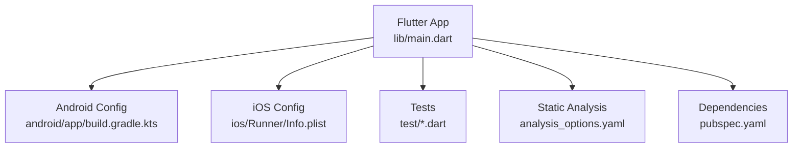
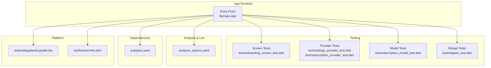
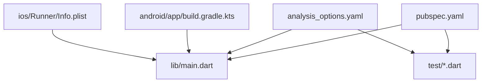

# Development & Debugging

<cite>
**Referenced Files in This Document**
- [pubspec.yaml](file://pubspec.yaml)
- [analysis_options.yaml](file://analysis_options.yaml)
- [lib/main.dart](file://lib/main.dart)
- [android/app/build.gradle.kts](file://android/app/build.gradle.kts)
- [ios/Runner/Info.plist](file://ios/Runner/Info.plist)
- [test/onboarding_screen_test.dart](file://test/onboarding_screen_test.dart)
- [test/settings_provider_test.dart](file://test/settings_provider_test.dart)
- [test/subscription_model_test.dart](file://test/subscription_model_test.dart)
- [test/subscription_provider_test.dart](file://test/subscription_provider_test.dart)
- [test/widgets_test.dart](file://test/widgets_test.dart)
</cite>

## Table of Contents
1. Introduction
2. Project Structure
3. Core Components
4. Architecture Overview
5. Detailed Component Analysis
6. Dependency Analysis
7. Performance Considerations
8. Troubleshooting Guide
9. Conclusion
10. Appendices

## Introduction
This document provides a comprehensive guide to debugging and troubleshooting the ASSINATURAS NINJA Flutter application during development. It covers:
- Flutter DevTools usage, hot reload behavior, and breakpoint debugging
- Testing framework troubleshooting for unit, widget, and integration tests
- Code analysis, linting, and static analysis issues
- Performance profiling, memory leak detection, and CPU optimization
- Log analysis, error tracking, and production debugging strategies

The guidance is tailored to this project’s structure and configuration files.

## Project Structure
At a high level, the app follows standard Flutter conventions:
- Application entry point and runtime initialization are defined under lib/main.dart
- Platform-specific configurations exist in android/app/build.gradle.kts and ios/Runner/Info.plist
- Tests are organized under test/ with dedicated files for screens, providers, models, and widgets
- Static analysis rules are configured via analysis_options.yaml
- Dependencies and assets are declared in pubspec.yaml

[No sources needed since this diagram shows conceptual workflow, not actual code structure]

## Core Components
Key areas relevant to debugging and development:
- Entry point and runtime setup (lib/main.dart)
- Test suite organization and patterns (test/*.dart)
- Static analysis configuration (analysis_options.yaml)
- Dependency management (pubspec.yaml)
- Platform build and info settings (android/app/build.gradle.kts, ios/Runner/Info.plist)

Focus on these areas when diagnosing startup issues, test failures, or environment problems.

**Section sources**
- [lib/main.dart](file://lib/main.dart)
- [test/onboarding_screen_test.dart](file://test/onboarding_screen_test.dart)
- [test/settings_provider_test.dart](file://test/settings_provider_test.dart)
- [test/subscription_model_test.dart](file://test/subscription_model_test.dart)
- [test/subscription_provider_test.dart](file://test/subscription_provider_test.dart)
- [test/widgets_test.dart](file://test/widgets_test.dart)
- [analysis_options.yaml](file://analysis_options.yaml)
- [pubspec.yaml](file://pubspec.yaml)
- [android/app/build.gradle.kts](file://android/app/build.gradle.kts)
- [ios/Runner/Info.plist](file://ios/Runner/Info.plist)

## Architecture Overview
The following diagram maps core development and debugging touchpoints across the app:

**Diagram sources**
- [lib/main.dart](file://lib/main.dart)
- [test/onboarding_screen_test.dart](file://test/onboarding_screen_test.dart)
- [test/settings_provider_test.dart](file://test/settings_provider_test.dart)
- [test/subscription_model_test.dart](file://test/subscription_model_test.dart)
- [test/subscription_provider_test.dart](file://test/subscription_provider_test.dart)
- [test/widgets_test.dart](file://test/widgets_test.dart)
- [analysis_options.yaml](file://analysis_options.yaml)
- [pubspec.yaml](file://pubspec.yaml)
- [android/app/build.gradle.kts](file://android/app/build.gradle.kts)
- [ios/Runner/Info.plist](file://ios/Runner/Info.plist)

## Detailed Component Analysis

### Flutter DevTools and Hot Reload
- Launch DevTools from your IDE or command line while running the app. Use the Performance tab to capture timelines, the Memory tab to inspect allocations, and the Widget Inspector to explore the tree.
- Hot reload applies UI changes without restarting; use it to iterate quickly on UI logic. If hot reload fails due to stateful changes, fall back to hot restart.
- Breakpoint debugging: set breakpoints in Dart code and step through execution. For provider/state updates, pause at setState or provider change points to inspect state transitions.

Common pitfalls:
- Hot reload does not preserve mutable global state; reset state between runs if necessary.
- Some third-party plugins may require full restarts after changes.

[No sources needed since this section provides general guidance]

### Unit Test Troubleshooting
- Ensure all dependencies required by tested classes are available in the test environment.
- Mock external services and platform channels where applicable.
- Verify that asynchronous operations complete within test timeouts.

Typical checks:
- Confirm test imports and package versions match those in pubspec.yaml.
- Validate that any shared utilities used by tests are deterministic.

**Section sources**
- [test/subscription_model_test.dart](file://test/subscription_model_test.dart)
- [test/settings_provider_test.dart](file://test/settings_provider_test.dart)
- [test/subscription_provider_test.dart](file://test/subscription_provider_test.dart)
- [pubspec.yaml](file://pubspec.yaml)

### Widget Test Debugging
- Use tester.pumpAndSettle() to wait for animations and async work to settle before assertions.
- Inspect widget trees using finders and print descriptions to locate missing or unexpected widgets.
- Isolate failing widgets by creating minimal reproduction cases.

Tips:
- Avoid relying on real network calls; mock responses.
- Use golden tests cautiously; ensure consistent rendering environments.

**Section sources**
- [test/onboarding_screen_test.dart](file://test/onboarding_screen_test.dart)
- [test/widgets_test.dart](file://test/widgets_test.dart)

### Integration Test Setup Problems
- Ensure device/emulator connectivity and permissions are granted.
- Verify platform-specific configurations (e.g., Android manifest, iOS Info.plist) do not block test flows.
- Stabilize timing-sensitive interactions with explicit waits.

**Section sources**
- [android/app/build.gradle.kts](file://android/app/build.gradle.kts)
- [ios/Runner/Info.plist](file://ios/Runner/Info.plist)

### Code Analysis, Linting, and Static Analysis
- Run static analysis to identify potential bugs and style violations.
- Adjust rules in analysis_options.yaml to align with team standards.
- Address warnings early to prevent technical debt accumulation.

Common actions:
- Enable/disable specific lints as needed.
- Use ignore comments sparingly and document reasons.

**Section sources**
- [analysis_options.yaml](file://analysis_options.yaml)

### Performance Profiling and Optimization
- Use DevTools Performance to capture frame timelines and identify jank.
- Monitor memory growth in the Memory tab; look for retained objects indicating leaks.
- Profile CPU usage to find heavy computations; consider offloading to background isolates.

Optimization strategies:
- Minimize rebuilds by splitting widgets and using const constructors.
- Debounce expensive operations and cache results where appropriate.

[No sources needed since this section provides general guidance]

### Logging, Error Tracking, and Production Debugging
- Centralize logging around critical paths and user actions.
- Capture stack traces and contextual data for errors.
- In production builds, avoid verbose logs; rely on structured error reporting.

Best practices:
- Include version and environment metadata in logs.
- Redact sensitive information before sending logs externally.

[No sources needed since this section provides general guidance]

## Dependency Analysis
Review dependencies and dev dependencies to ensure compatibility and reproducibility. Pin versions where stability matters and keep them updated regularly.

**Diagram sources**
- [pubspec.yaml](file://pubspec.yaml)
- [analysis_options.yaml](file://analysis_options.yaml)
- [lib/main.dart](file://lib/main.dart)
- [test/onboarding_screen_test.dart](file://test/onboarding_screen_test.dart)
- [test/settings_provider_test.dart](file://test/settings_provider_test.dart)
- [test/subscription_model_test.dart](file://test/subscription_model_test.dart)
- [test/subscription_provider_test.dart](file://test/subscription_provider_test.dart)
- [test/widgets_test.dart](file://test/widgets_test.dart)
- [android/app/build.gradle.kts](file://android/app/build.gradle.kts)
- [ios/Runner/Info.plist](file://ios/Runner/Info.plist)

**Section sources**
- [pubspec.yaml](file://pubspec.yaml)
- [analysis_options.yaml](file://analysis_options.yaml)

## Performance Considerations
- Prefer immutable data structures and pure functions to reduce rebuilds.
- Use efficient list handling and avoid unnecessary allocations in hot paths.
- Profile both UI thread and isolate performance to balance workload.
- Keep asset sizes small and lazy-load resources when possible.

[No sources needed since this section provides general guidance]

## Troubleshooting Guide

### Startup and Build Issues
- Clean and rebuild the project to resolve stale artifacts.
- Check platform configurations for permission or capability mismatches.
- Verify that required SDKs and tools are installed and up-to-date.

**Section sources**
- [android/app/build.gradle.kts](file://android/app/build.gradle.kts)
- [ios/Runner/Info.plist](file://ios/Runner/Info.plist)

### Hot Reload Failures
- If hot reload does not apply, perform a hot restart.
- Reset stateful components to known defaults before re-running.
- Investigate plugin-specific limitations that may require full restarts.

[No sources needed since this section provides general guidance]

### Test Failures
- Reproduce failures locally with verbose output.
- Isolate flaky tests and add stabilization steps.
- Ensure mocks and fakes reflect current interfaces.

**Section sources**
- [test/onboarding_screen_test.dart](file://test/onboarding_screen_test.dart)
- [test/settings_provider_test.dart](file://test/settings_provider_test.dart)
- [test/subscription_model_test.dart](file://test/subscription_model_test.dart)
- [test/subscription_provider_test.dart](file://test/subscription_provider_test.dart)
- [test/widgets_test.dart](file://test/widgets_test.dart)

### Linting and Static Analysis Errors
- Review analysis_options.yaml to understand active rules.
- Fix reported issues systematically; prioritize correctness over style initially.
- Add targeted ignores only when justified and documented.

**Section sources**
- [analysis_options.yaml](file://analysis_options.yaml)

### Memory Leaks and CPU Spikes
- Use DevTools Memory to track object retention and heap snapshots.
- Identify long-lived references preventing garbage collection.
- Profile CPU to pinpoint heavy computations and optimize algorithms.

[No sources needed since this section provides general guidance]

### Logs and Error Tracking
- Centralize log emission and include context such as screen, action, and payload summaries.
- Implement error boundaries to catch and report exceptions gracefully.
- Correlate logs with timestamps and request IDs for traceability.

[No sources needed since this section provides general guidance]

## Conclusion
Effective debugging and development workflows combine tooling, disciplined testing, and proactive analysis. By leveraging DevTools, maintaining robust tests, and adhering to static analysis rules, you can quickly diagnose issues and deliver a high-quality Flutter application.

[No sources needed since this section summarizes without analyzing specific files]

## Appendices

### Quick Commands and Workflows
- Run static analysis and tests to validate changes before committing.
- Use DevTools during interactive sessions to profile and inspect runtime behavior.
- Maintain consistent dependency versions across environments.

[No sources needed since this section provides general guidance]