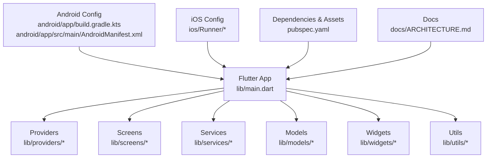
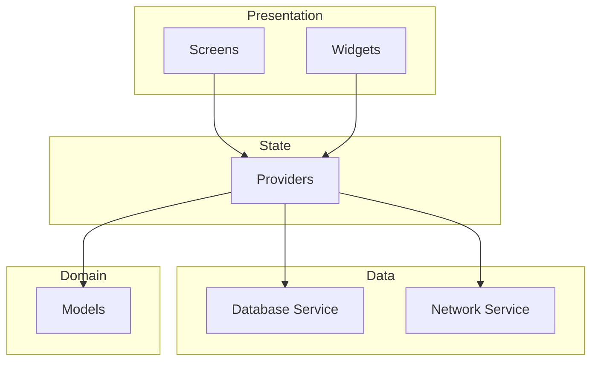
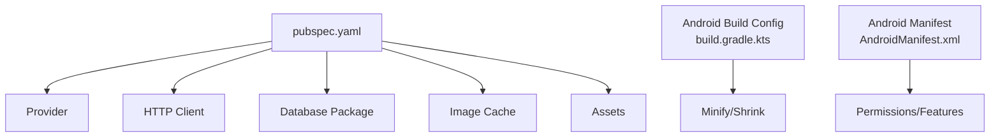

# Performance Optimization

<cite>
**Referenced Files in This Document**
- [main.dart](file://lib/main.dart)
- [pubspec.yaml](file://pubspec.yaml)
- [build.gradle.kts](file://android/app/build.gradle.kts)
- [AndroidManifest.xml](file://android/app/src/main/AndroidManifest.xml)
- [ARCHITECTURE.md](file://docs/ARCHITECTURE.md)
- [README.md](file://README.md)
</cite>

## Table of Contents
1. [Introduction](#introduction)
2. [Project Structure](#project-structure)
3. [Core Components](#core-components)
4. [Architecture Overview](#architecture-overview)
5. [Detailed Component Analysis](#detailed-component-analysis)
6. [Dependency Analysis](#dependency-analysis)
7. [Performance Considerations](#performance-considerations)
8. [Troubleshooting Guide](#troubleshooting-guide)
9. [Conclusion](#conclusion)
10. [Appendices](#appendices)

## Introduction
This document provides a comprehensive performance optimization and troubleshooting guide for the ASSINATURAS NINJA Flutter application, with a focus on:
- Profiling with Flutter DevTools (widgets rebuilds, rendering, memory, network, and database)
- Optimizing state management using Provider to minimize unnecessary rebuilds
- Memory management, garbage collection tuning, and resource cleanup strategies
- Database query optimization, network request caching, and image loading performance
- App startup time optimization, bundle size reduction, and runtime performance monitoring
- Benchmarks, interpretation of profiling results, and best practices tailored to subscription management apps

The guidance is grounded in the project’s structure and configuration files and is designed to be actionable for both new and experienced Flutter developers.

## Project Structure
At a high level, the app follows a typical Flutter layout:
- lib contains Dart source code including main entry point, providers, screens, services, models, utils, and widgets
- android and ios contain platform-specific configurations and native code
- docs includes architecture and project documentation
- test contains unit and widget tests
- pubspec.yaml defines dependencies and assets

**Diagram sources**
- [main.dart](file://lib/main.dart)
- [pubspec.yaml](file://pubspec.yaml)
- [build.gradle.kts](file://android/app/build.gradle.kts)
- [AndroidManifest.xml](file://android/app/src/main/AndroidManifest.xml)
- [ARCHITECTURE.md](file://docs/ARCHITECTURE.md)

**Section sources**
- [README.md](file://README.md)
- [ARCHITECTURE.md](file://docs/ARCHITECTURE.md)

## Core Components
Key areas that impact performance in this app include:
- Application bootstrap and provider setup in the main entry point
- State management via Provider across screens and services
- Data access layer (database and network) used by services
- UI components (screens and widgets) driven by providers
- Platform-level settings (Android/iOS) affecting build and runtime behavior

Focus your optimization efforts on:
- Minimizing widget rebuild scope through precise provider usage
- Reducing heavy computations during build
- Caching expensive data and images
- Optimizing database queries and network requests
- Monitoring and reducing memory pressure and GC churn

[No sources needed since this section provides general guidance]

## Architecture Overview
The app uses a layered approach:
- Presentation layer (screens and widgets) consumes state from providers
- Providers coordinate business logic and expose state to the UI
- Services encapsulate data access (database and network)
- Models represent domain entities
- Platform configs influence build-time and runtime performance

[No sources needed since this diagram shows conceptual workflow, not actual code structure]

## Detailed Component Analysis

### Flutter DevTools Profiling Workflow
Use Flutter DevTools to identify bottlenecks across multiple dimensions:
- Widgets tab: detect excessive rebuilds and deep trees; use RepaintBoundary and const where appropriate
- Performance overlay: monitor frame times and jank; target consistent 60fps or 120fps depending on device
- Memory tab: track allocations, leaks, and GC events; look for spikes correlating with user actions
- Network tab: analyze latency, payload sizes, and cache hits; ensure proper caching headers and local caching
- Timeline: correlate UI work, GC, and IO; identify long tasks blocking the main thread

Actionable steps:
- Enable performance overlay in debug builds for quick checks
- Record sessions while performing key flows (e.g., opening subscriptions list, adding a new subscription)
- Export timelines and compare before/after changes

[No sources needed since this section provides general guidance]

### Widget Rebuild Optimization with Provider
Common issues:
- Overly broad provider scopes causing unnecessary rebuilds
- Using non-isolate-safe operations inside build methods
- Frequent allocation of large objects in build

Optimization strategies:
- Split providers into focused units and consume only what each screen needs
- Use Selector or selective listeners to rebuild only when relevant fields change
- Cache computed values and avoid heavy work in build; move to background isolates if necessary
- Prefer const constructors for static widgets and immutable data

[No sources needed since this section provides general guidance]

### Memory Management and Garbage Collection Tuning
Symptoms:
- Frame drops after navigating between lists
- High memory usage with frequent GC pauses
- Image-related memory spikes

Recommendations:
- Dispose resources explicitly (controllers, streams, timers)
- Avoid retaining references to large objects longer than needed
- Use image caching libraries and clear caches when switching contexts
- Monitor heap snapshots in DevTools to find retained objects and break cycles

[No sources needed since this section provides general guidance]

### Resource Cleanup Strategies
Best practices:
- Close database connections and cursors when no longer needed
- Cancel network requests on dispose to prevent leaks
- Unsubscribe from streams and remove event listeners
- Clear temporary files and caches periodically

[No sources needed since this section provides general guidance]

### Database Query Optimization
Guidelines:
- Index frequently queried columns (e.g., subscription name, category, renewal date)
- Use pagination and limit result sets for large lists
- Batch writes and transactions to reduce IO overhead
- Avoid SELECT *; fetch only required fields
- Cache read-heavy queries locally and invalidate on updates

[No sources needed since this section provides general guidance]

### Network Request Caching
Approaches:
- HTTP cache headers (ETag, Last-Modified) for server-managed caching
- Client-side caching with a local store for critical data (e.g., categories, plans)
- Deduplicate concurrent requests and share responses
- Implement retry with exponential backoff and circuit breaker patterns

[No sources needed since this section provides general guidance]

### Image Loading Performance
Strategies:
- Use cached image providers and specify appropriate sizes
- Preload frequently viewed images at startup or during idle time
- Compress images and serve responsive variants
- Lazy load images in lists and pause off-screen items

[No sources needed since this section provides general guidance]

### App Startup Time Optimization
Tactics:
- Minimize work in main() and defer non-critical initialization
- Use deferred imports for heavy modules
- Reduce asset sizes and lazy-load optional assets
- Profile cold start with DevTools timeline and isolate startup logs

[No sources needed since this section provides general guidance]

### Bundle Size Reduction
Actions:
- Remove unused dependencies and features
- Enable tree-shaking and minification in release builds
- Optimize assets (images, fonts) and use vector formats where possible
- Analyze bundle with flutter build and platform tools

[No sources needed since this section provides general guidance]

### Runtime Performance Monitoring
Implementation ideas:
- Instrument key metrics (startup time, navigation duration, list render time)
- Report anomalies and slow paths to analytics
- Use feature flags to toggle verbose logging in production profiles

[No sources needed since this section provides general guidance]

## Dependency Analysis
Review dependencies and their impact on performance:
- Large third-party packages can increase startup time and memory footprint
- Native plugins may introduce platform-specific overhead
- Asset-heavy packages inflate bundle size

Steps:
- Audit pubspec.yaml for heavy dependencies
- Replace or split packages where feasible
- Ensure platform configs enable optimizations (minify, shrink resources)

**Diagram sources**
- [pubspec.yaml](file://pubspec.yaml)
- [build.gradle.kts](file://android/app/build.gradle.kts)
- [AndroidManifest.xml](file://android/app/src/main/AndroidManifest.xml)

**Section sources**
- [pubspec.yaml](file://pubspec.yaml)
- [build.gradle.kts](file://android/app/build.gradle.kts)
- [AndroidManifest.xml](file://android/app/src/main/AndroidManifest.xml)

## Performance Considerations
General recommendations for subscription management apps:
- Keep subscription lists responsive with virtualization and pagination
- Debounce search inputs and filter efficiently
- Cache plan details and pricing tiers
- Avoid synchronous heavy operations on the UI thread
- Use background processing for sync and import/export tasks

[No sources needed since this section provides general guidance]

## Troubleshooting Guide
Common issues and resolutions:
- Excessive rebuilds: narrow provider scopes, use selectors, and prefer const widgets
- Jank in lists: implement pagination, lazy loading, and efficient item builders
- Memory spikes: inspect heap snapshots, release controllers, and clear caches
- Slow startup: profile timeline, defer initialization, and optimize assets
- Network slowness: enable caching, compress payloads, and parallelize independent calls

Diagnostic steps:
- Capture DevTools sessions during problematic flows
- Compare baseline vs optimized builds
- Validate fixes with regression tests and automated benchmarks

[No sources needed since this section provides general guidance]

## Conclusion
By systematically profiling with DevTools, refining Provider-based state management, optimizing data access and images, and tightening platform build settings, you can achieve smooth interactions, fast startup, and efficient resource usage in the ASSINATURAS NINJA app. Adopt continuous monitoring and benchmarking to sustain performance as the app evolves.

[No sources needed since this section summarizes without analyzing specific files]

## Appendices

### Benchmarking Checklist
- Cold start time (ms)
- First meaningful paint (ms)
- List scroll FPS stability
- Memory peak and average
- Network latency and cache hit ratio
- Bundle size and asset sizes

### Profiling Results Interpretation
- Frame budget: aim for <16.67ms per frame at 60fps
- GC frequency: fewer, shorter pauses are better
- Memory growth: should stabilize after warm-up
- Network: prioritize cache hits and reduced payload sizes

[No sources needed since this section provides general guidance]