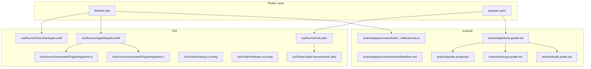
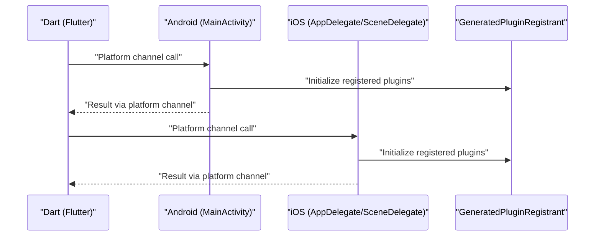
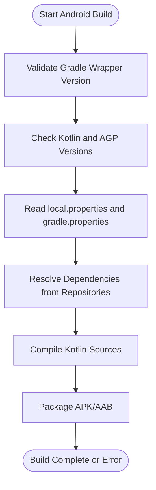
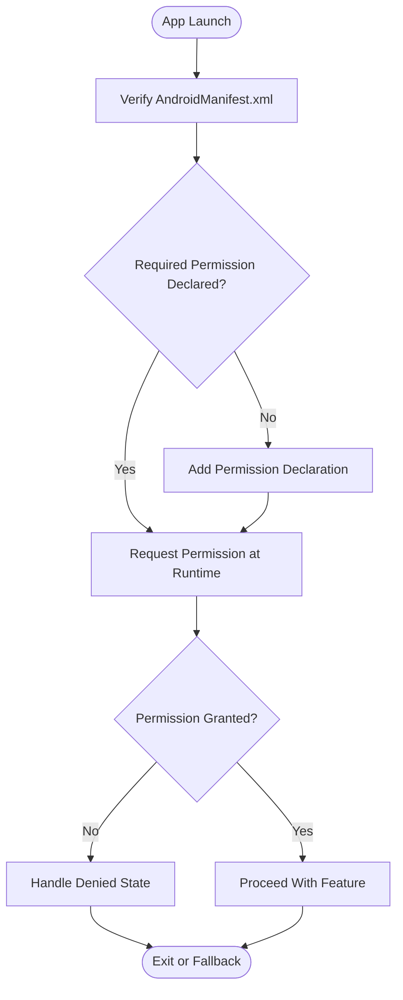
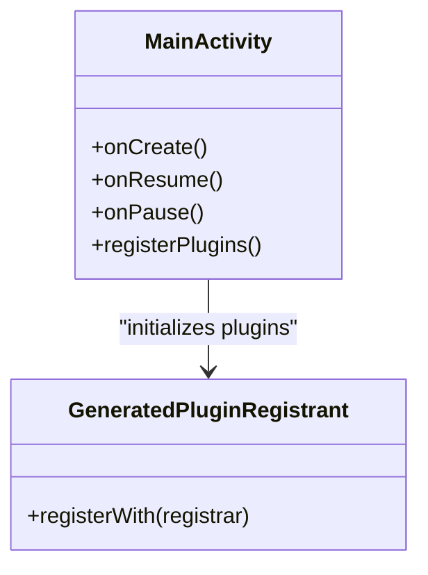
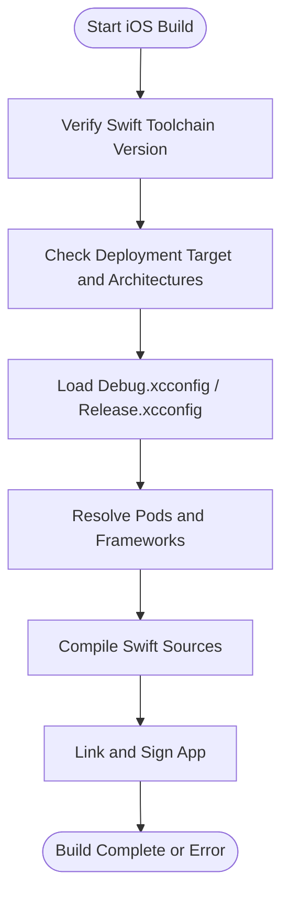
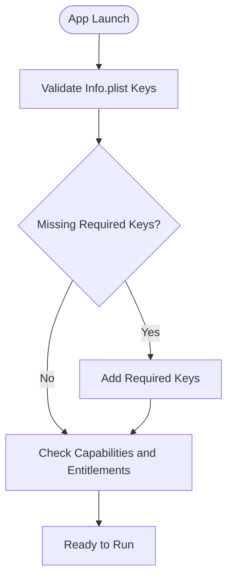
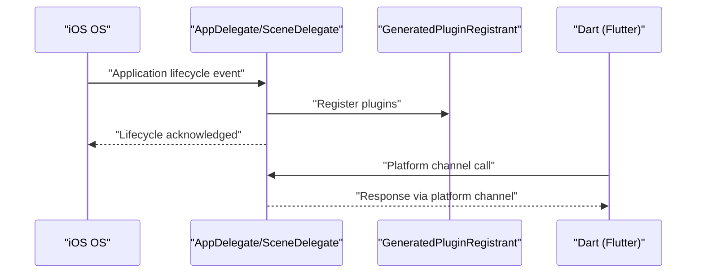
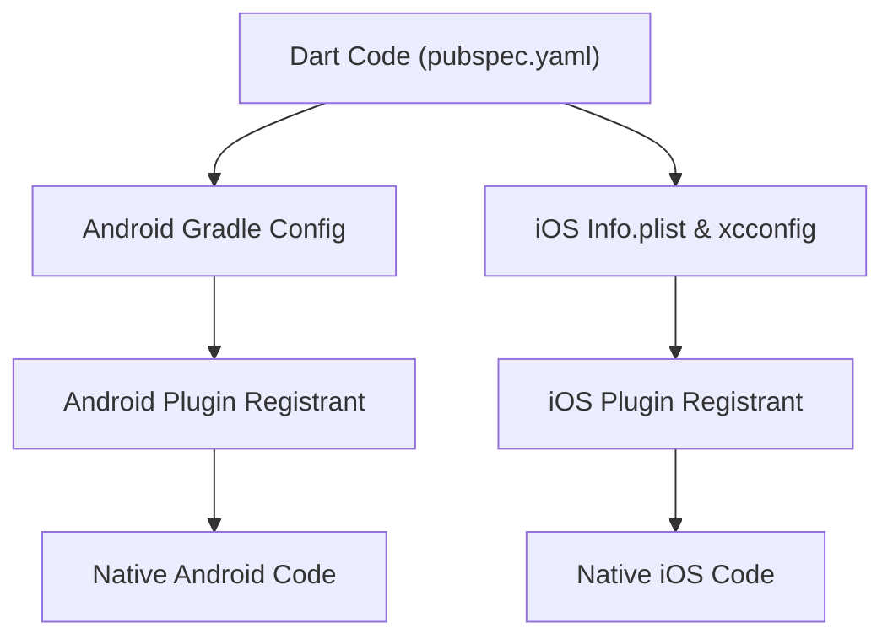
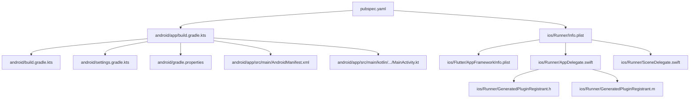

# Platform-Specific Issues

<cite>
**Referenced Files in This Document**
- [AndroidManifest.xml](file://android/app/src/main/AndroidManifest.xml)
- [MainActivity.kt](file://android/app/src/main/kotlin/br/com/assinaturasninja/assinaturas_ninja/MainActivity.kt)
- [build.gradle.kts](file://android/app/build.gradle.kts)
- [build.gradle.kts](file://android/build.gradle.kts)
- [gradle.properties](file://android/gradle.properties)
- [settings.gradle.kts](file://android/settings.gradle.kts)
- [Info.plist](file://ios/Runner/Info.plist)
- [AppDelegate.swift](file://ios/Runner/AppDelegate.swift)
- [SceneDelegate.swift](file://ios/Runner/SceneDelegate.swift)
- [GeneratedPluginRegistrant.h](file://ios/Runner/GeneratedPluginRegistrant.h)
- [GeneratedPluginRegistrant.m](file://ios/Runner/GeneratedPluginRegistrant.m)
- [Debug.xcconfig](file://ios/Flutter/Debug.xcconfig)
- [Release.xcconfig](file://ios/Flutter/Release.xcconfig)
- [AppFrameworkInfo.plist](file://ios/Flutter/AppFrameworkInfo.plist)
- [pubspec.yaml](file://pubspec.yaml)
- [main.dart](file://lib/main.dart)
</cite>

## Table of Contents
1. [Introduction](#introduction)
2. [Project Structure](#project-structure)
3. [Core Components](#core-components)
4. [Architecture Overview](#architecture-overview)
5. [Detailed Component Analysis](#detailed-component-analysis)
6. [Dependency Analysis](#dependency-analysis)
7. [Performance Considerations](#performance-considerations)
8. [Troubleshooting Guide](#troubleshooting-guide)
9. [Conclusion](#conclusion)
10. [Appendices](#appendices)

## Introduction
This document provides platform-specific troubleshooting guidance for the ASSINATURAS NINJA application on Android and iOS. It focuses on common build, configuration, permission, and submission issues, along with diagnostic techniques and logging strategies tailored to each platform. The goal is to help developers quickly identify and resolve problems during development, testing, and App Store distribution.

## Project Structure
The project follows a Flutter-based architecture with native platform directories:
- Android: Gradle-based build with Kotlin source and manifest configuration
- iOS: Xcode workspace with Swift app entry points and Info.plist configuration
- Shared Dart code under lib, including main entry point and feature modules

**Diagram sources**
- [main.dart](file://lib/main.dart)
- [pubspec.yaml](file://pubspec.yaml)
- [AndroidManifest.xml](file://android/app/src/main/AndroidManifest.xml)
- [MainActivity.kt](file://android/app/src/main/kotlin/br/com/assinaturasninja/assinaturas_ninja/MainActivity.kt)
- [build.gradle.kts](file://android/app/build.gradle.kts)
- [build.gradle.kts](file://android/build.gradle.kts)
- [gradle.properties](file://android/gradle.properties)
- [settings.gradle.kts](file://android/settings.gradle.kts)
- [Info.plist](file://ios/Runner/Info.plist)
- [AppDelegate.swift](file://ios/Runner/AppDelegate.swift)
- [SceneDelegate.swift](file://ios/Runner/SceneDelegate.swift)
- [GeneratedPluginRegistrant.h](file://ios/Runner/GeneratedPluginRegistrant.h)
- [GeneratedPluginRegistrant.m](file://ios/Runner/GeneratedPluginRegistrant.m)
- [Debug.xcconfig](file://ios/Flutter/Debug.xcconfig)
- [Release.xcconfig](file://ios/Flutter/Release.xcconfig)
- [AppFrameworkInfo.plist](file://ios/Flutter/AppFrameworkInfo.plist)

**Section sources**
- [main.dart](file://lib/main.dart)
- [pubspec.yaml](file://pubspec.yaml)
- [AndroidManifest.xml](file://android/app/src/main/AndroidManifest.xml)
- [MainActivity.kt](file://android/app/src/main/kotlin/br/com/assinaturasninja/assinaturas_ninja/MainActivity.kt)
- [build.gradle.kts](file://android/app/build.gradle.kts)
- [build.gradle.kts](file://android/build.gradle.kts)
- [gradle.properties](file://android/gradle.properties)
- [settings.gradle.kts](file://android/settings.gradle.kts)
- [Info.plist](file://ios/Runner/Info.plist)
- [AppDelegate.swift](file://ios/Runner/AppDelegate.swift)
- [SceneDelegate.swift](file://ios/Runner/SceneDelegate.swift)
- [GeneratedPluginRegistrant.h](file://ios/Runner/GeneratedPluginRegistrant.h)
- [GeneratedPluginRegistrant.m](file://ios/Runner/GeneratedPluginRegistrant.m)
- [Debug.xcconfig](file://ios/Flutter/Debug.xcconfig)
- [Release.xcconfig](file://ios/Flutter/Release.xcconfig)
- [AppFrameworkInfo.plist](file://ios/Flutter/AppFrameworkInfo.plist)

## Core Components
- Android Application Entry Point: MainActivity handles lifecycle integration and plugin registration.
- iOS Application Entry Points: AppDelegate and SceneDelegate manage app lifecycle and plugin registration.
- Build Configuration: Gradle (Android) and Xcode xcconfig (iOS) define toolchain versions, flags, and environment variables.
- Manifest and Plist: AndroidManifest.xml declares permissions and components; Info.plist defines iOS app metadata and capabilities.
- Plugin Registration: GeneratedPluginRegistrant bridges Flutter plugins to native platforms.

**Section sources**
- [MainActivity.kt](file://android/app/src/main/kotlin/br/com/assinaturasninja/assinaturas_ninja/MainActivity.kt)
- [AppDelegate.swift](file://ios/Runner/AppDelegate.swift)
- [SceneDelegate.swift](file://ios/Runner/SceneDelegate.swift)
- [build.gradle.kts](file://android/app/build.gradle.kts)
- [build.gradle.kts](file://android/build.gradle.kts)
- [gradle.properties](file://android/gradle.properties)
- [settings.gradle.kts](file://android/settings.gradle.kts)
- [AndroidManifest.xml](file://android/app/src/main/AndroidManifest.xml)
- [Info.plist](file://ios/Runner/Info.plist)
- [GeneratedPluginRegistrant.h](file://ios/Runner/GeneratedPluginRegistrant.h)
- [GeneratedPluginRegistrant.m](file://ios/Runner/GeneratedPluginRegistrant.m)

## Architecture Overview
The Flutter layer invokes platform channels that are handled by native code. Android uses MainActivity and Gradle configurations; iOS uses AppDelegate/SceneDelegate and Info.plist. Plugin registration ensures third-party packages integrate correctly.

**Diagram sources**
- [MainActivity.kt](file://android/app/src/main/kotlin/br/com/assinaturasninja/assinaturas_ninja/MainActivity.kt)
- [AppDelegate.swift](file://ios/Runner/AppDelegate.swift)
- [SceneDelegate.swift](file://ios/Runner/SceneDelegate.swift)
- [GeneratedPluginRegistrant.h](file://ios/Runner/GeneratedPluginRegistrant.h)
- [GeneratedPluginRegistrant.m](file://ios/Runner/GeneratedPluginRegistrant.m)

## Detailed Component Analysis

### Android Build System and Gradle
Common issues include Gradle wrapper mismatches, Kotlin version conflicts, and dependency resolution failures. Verify Gradle and Kotlin versions align with the project’s requirements and ensure local properties and settings are correct.

Key areas to inspect:
- Root and app-level Gradle files for toolchain and dependency declarations
- gradle.properties for JVM and Gradle options
- settings.gradle.kts for included projects and repository definitions

**Diagram sources**
- [build.gradle.kts](file://android/app/build.gradle.kts)
- [build.gradle.kts](file://android/build.gradle.kts)
- [gradle.properties](file://android/gradle.properties)
- [settings.gradle.kts](file://android/settings.gradle.kts)

**Section sources**
- [build.gradle.kts](file://android/app/build.gradle.kts)
- [build.gradle.kts](file://android/build.gradle.kts)
- [gradle.properties](file://android/gradle.properties)
- [settings.gradle.kts](file://android/settings.gradle.kts)

### Android Manifest and Permissions
Permissions must be declared in the manifest and requested at runtime where required. Ensure component declarations match your app’s structure and that any dynamic features or services are properly configured.

Focus areas:
- Permission declarations
- Activity/service/component entries
- Min/target SDK alignment with dependencies

**Diagram sources**
- [AndroidManifest.xml](file://android/app/src/main/AndroidManifest.xml)

**Section sources**
- [AndroidManifest.xml](file://android/app/src/main/AndroidManifest.xml)

### Android Kotlin Compilation and MainActivity
Kotlin compilation errors often stem from language level mismatches or incompatible library APIs. MainActivity should initialize plugins and handle lifecycle events consistently with Flutter expectations.

Checkpoints:
- Kotlin language and target compatibility
- Plugin initialization in MainActivity
- Lifecycle callbacks and error handling

**Diagram sources**
- [MainActivity.kt](file://android/app/src/main/kotlin/br/com/assinaturasninja/assinaturas_ninja/MainActivity.kt)
- [GeneratedPluginRegistrant.h](file://ios/Runner/GeneratedPluginRegistrant.h)
- [GeneratedPluginRegistrant.m](file://ios/Runner/GeneratedPluginRegistrant.m)

**Section sources**
- [MainActivity.kt](file://android/app/src/main/kotlin/br/com/assinaturasninja/assinaturas_ninja/MainActivity.kt)

### iOS Build System and Xcode Configuration
Xcode build errors can arise from Swift toolchain mismatches, missing entitlements, or incorrect deployment targets. xcconfig files control debug/release behaviors and environment variables.

Areas to review:
- Deployment target and Swift version compatibility
- Debug.xcconfig and Release.xcconfig flags
- Workspace and scheme correctness

**Diagram sources**
- [Debug.xcconfig](file://ios/Flutter/Debug.xcconfig)
- [Release.xcconfig](file://ios/Flutter/Release.xcconfig)

**Section sources**
- [Debug.xcconfig](file://ios/Flutter/Debug.xcconfig)
- [Release.xcconfig](file://ios/Flutter/Release.xcconfig)

### iOS Info.plist and App Metadata
Info.plist contains critical app metadata, capability declarations, and privacy usage descriptions. Missing or incorrect keys can cause launch failures or App Store rejections.

Review items:
- Required keys for app functionality
- Privacy usage descriptions for camera, photos, network, etc.
- Bundle identifier and versioning consistency

**Diagram sources**
- [Info.plist](file://ios/Runner/Info.plist)
- [AppFrameworkInfo.plist](file://ios/Flutter/AppFrameworkInfo.plist)

**Section sources**
- [Info.plist](file://ios/Runner/Info.plist)
- [AppFrameworkInfo.plist](file://ios/Flutter/AppFrameworkInfo.plist)

### iOS AppDelegate and SceneDelegate
AppDelegate and SceneDelegate manage app lifecycle and plugin registration. Ensure they initialize plugins and handle background/foreground transitions appropriately.

**Diagram sources**
- [AppDelegate.swift](file://ios/Runner/AppDelegate.swift)
- [SceneDelegate.swift](file://ios/Runner/SceneDelegate.swift)
- [GeneratedPluginRegistrant.h](file://ios/Runner/GeneratedPluginRegistrant.h)
- [GeneratedPluginRegistrant.m](file://ios/Runner/GeneratedPluginRegistrant.m)

**Section sources**
- [AppDelegate.swift](file://ios/Runner/AppDelegate.swift)
- [SceneDelegate.swift](file://ios/Runner/SceneDelegate.swift)
- [GeneratedPluginRegistrant.h](file://ios/Runner/GeneratedPluginRegistrant.h)
- [GeneratedPluginRegistrant.m](file://ios/Runner/GeneratedPluginRegistrant.m)

### Cross-Platform Integration and Plugin Registration
Flutter plugins bridge Dart to native code. Ensure plugin versions are compatible with both platforms and that generated registrants are present and up-to-date.

**Diagram sources**
- [pubspec.yaml](file://pubspec.yaml)
- [build.gradle.kts](file://android/app/build.gradle.kts)
- [Info.plist](file://ios/Runner/Info.plist)
- [GeneratedPluginRegistrant.h](file://ios/Runner/GeneratedPluginRegistrant.h)
- [GeneratedPluginRegistrant.m](file://ios/Runner/GeneratedPluginRegistrant.m)

**Section sources**
- [pubspec.yaml](file://pubspec.yaml)
- [build.gradle.kts](file://android/app/build.gradle.kts)
- [Info.plist](file://ios/Runner/Info.plist)
- [GeneratedPluginRegistrant.h](file://ios/Runner/GeneratedPluginRegistrant.h)
- [GeneratedPluginRegistrant.m](file://ios/Runner/GeneratedPluginRegistrant.m)

## Dependency Analysis
This section maps key dependencies between platform configurations and entry points.

**Diagram sources**
- [pubspec.yaml](file://pubspec.yaml)
- [build.gradle.kts](file://android/app/build.gradle.kts)
- [build.gradle.kts](file://android/build.gradle.kts)
- [settings.gradle.kts](file://android/settings.gradle.kts)
- [gradle.properties](file://android/gradle.properties)
- [AndroidManifest.xml](file://android/app/src/main/AndroidManifest.xml)
- [MainActivity.kt](file://android/app/src/main/kotlin/br/com/assinaturasninja/assinaturas_ninja/MainActivity.kt)
- [Info.plist](file://ios/Runner/Info.plist)
- [AppFrameworkInfo.plist](file://ios/Flutter/AppFrameworkInfo.plist)
- [AppDelegate.swift](file://ios/Runner/AppDelegate.swift)
- [SceneDelegate.swift](file://ios/Runner/SceneDelegate.swift)
- [GeneratedPluginRegistrant.h](file://ios/Runner/GeneratedPluginRegistrant.h)
- [GeneratedPluginRegistrant.m](file://ios/Runner/GeneratedPluginRegistrant.m)

**Section sources**
- [pubspec.yaml](file://pubspec.yaml)
- [build.gradle.kts](file://android/app/build.gradle.kts)
- [build.gradle.kts](file://android/build.gradle.kts)
- [settings.gradle.kts](file://android/settings.gradle.kts)
- [gradle.properties](file://android/gradle.properties)
- [AndroidManifest.xml](file://android/app/src/main/AndroidManifest.xml)
- [MainActivity.kt](file://android/app/src/main/kotlin/br/com/assinaturasninja/assinaturas_ninja/MainActivity.kt)
- [Info.plist](file://ios/Runner/Info.plist)
- [AppFrameworkInfo.plist](file://ios/Flutter/AppFrameworkInfo.plist)
- [AppDelegate.swift](file://ios/Runner/AppDelegate.swift)
- [SceneDelegate.swift](file://ios/Runner/SceneDelegate.swift)
- [GeneratedPluginRegistrant.h](file://ios/Runner/GeneratedPluginRegistrant.h)
- [GeneratedPluginRegistrant.m](file://ios/Runner/GeneratedPluginRegistrant.m)

## Performance Considerations
- Android:
  - Align Gradle and Kotlin versions to avoid recompilation overhead.
  - Enable incremental builds and configure JVM options for faster compiles.
  - Use ProGuard/R8 rules judiciously to reduce APK size without breaking reflection-heavy plugins.
- iOS:
  - Keep deployment targets consistent across schemes and xcconfig files.
  - Avoid unnecessary framework linking and strip unused symbols in release builds.
  - Profile memory and CPU using Instruments to detect leaks or hotspots.

[No sources needed since this section provides general guidance]

## Troubleshooting Guide

### Android Troubleshooting
- Gradle Build Failures
  - Validate Gradle wrapper version and local.properties paths.
  - Check root and app-level Gradle files for conflicting versions.
  - Clear caches and rebuild if dependency resolution fails.
- Kotlin Compilation Errors
  - Ensure Kotlin language level matches library requirements.
  - Update incompatible dependencies and verify API compatibility.
- Manifest Configuration Issues
  - Confirm all required permissions are declared.
  - Verify minSdkVersion and targetSdkVersion align with dependencies.
  - Check activity/service declarations and intent filters.
- Permission Handling Problems
  - Request runtime permissions before accessing protected resources.
  - Handle denied states gracefully and provide fallback flows.

**Section sources**
- [build.gradle.kts](file://android/app/build.gradle.kts)
- [build.gradle.kts](file://android/build.gradle.kts)
- [gradle.properties](file://android/gradle.properties)
- [settings.gradle.kts](file://android/settings.gradle.kts)
- [AndroidManifest.xml](file://android/app/src/main/AndroidManifest.xml)

### iOS Troubleshooting
- Xcode Build Errors
  - Verify Swift toolchain and deployment target compatibility.
  - Inspect Debug.xcconfig and Release.xcconfig for incorrect flags.
  - Reinstall pods and regenerate project files if necessary.
- Swift Compilation Problems
  - Update incompatible libraries and ensure Swift version alignment.
  - Fix deprecated APIs and adjust imports accordingly.
- Info.plist Configuration
  - Add required keys and privacy usage descriptions.
  - Ensure bundle identifier and versioning are consistent.
- App Store Submission Rejections
  - Review rejection reasons related to permissions, metadata, and entitlements.
  - Validate Info.plist keys and update privacy statements.
  - Test on latest OS versions and device types.

**Section sources**
- [Debug.xcconfig](file://ios/Flutter/Debug.xcconfig)
- [Release.xcconfig](file://ios/Flutter/Release.xcconfig)
- [Info.plist](file://ios/Runner/Info.plist)
- [AppFrameworkInfo.plist](file://ios/Flutter/AppFrameworkInfo.plist)

### Platform Feature Integration Troubleshooting
- Ensure plugins are declared in pubspec.yaml and compatible with both platforms.
- Verify plugin registration in MainActivity (Android) and AppDelegate/SceneDelegate (iOS).
- Check platform-specific configurations (permissions, entitlements) for features like camera, storage, or network access.

**Section sources**
- [pubspec.yaml](file://pubspec.yaml)
- [MainActivity.kt](file://android/app/src/main/kotlin/br/com/assinaturasninja/assinaturas_ninja/MainActivity.kt)
- [AppDelegate.swift](file://ios/Runner/AppDelegate.swift)
- [SceneDelegate.swift](file://ios/Runner/SceneDelegate.swift)
- [GeneratedPluginRegistrant.h](file://ios/Runner/GeneratedPluginRegistrant.h)
- [GeneratedPluginRegistrant.m](file://ios/Runner/GeneratedPluginRegistrant.m)

### Native Module Debugging
- Android:
  - Use logcat to capture native logs and stack traces.
  - Enable verbose Gradle output for detailed build diagnostics.
- iOS:
  - Use Console.app and Instruments for crash reports and performance profiling.
  - Inspect Xcode build logs and lldb for debugging Swift and Objective-C code.

**Section sources**
- [MainActivity.kt](file://android/app/src/main/kotlin/br/com/assinaturasninja/assinaturas_ninja/MainActivity.kt)
- [AppDelegate.swift](file://ios/Runner/AppDelegate.swift)
- [SceneDelegate.swift](file://ios/Runner/SceneDelegate.swift)

### Cross-Platform Compatibility Issues
- Align minimum supported OS versions across platforms.
- Validate plugin behavior differences and implement conditional logic in Dart where necessary.
- Test on representative devices and OS versions to catch platform-specific regressions.

**Section sources**
- [pubspec.yaml](file://pubspec.yaml)
- [AndroidManifest.xml](file://android/app/src/main/AndroidManifest.xml)
- [Info.plist](file://ios/Runner/Info.plist)

## Conclusion
By systematically checking platform configurations, validating dependencies, and leveraging platform-specific diagnostic tools, most Android and iOS issues in the ASSINATURAS NINJA application can be identified and resolved efficiently. Focus on Gradle/Kotlin alignment for Android and Xcode/Swift toolchain consistency for iOS, while ensuring proper manifest and plist configurations and robust permission handling.

[No sources needed since this section summarizes without analyzing specific files]

## Appendices

### Diagnostic Tools and Logging Techniques
- Android:
  - Use adb logcat for runtime logs and crash analysis.
  - Enable Gradle parallel builds and caching to speed up iterations.
- iOS:
  - Use Xcode console and Instruments for profiling and debugging.
  - Validate Info.plist keys and entitlements prior to submission.

[No sources needed since this section provides general guidance]