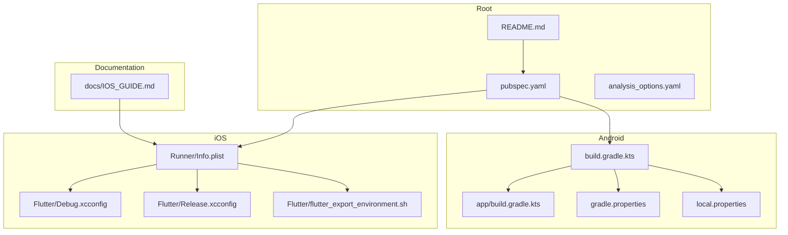
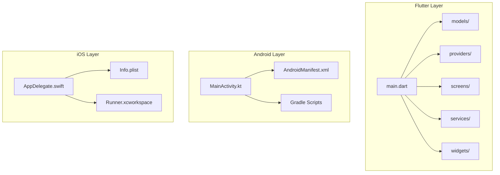
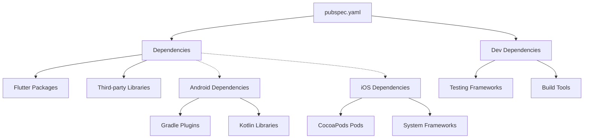

# Setup & Installation Issues

<cite>
**Referenced Files in This Document**
- [README.md](file://README.md)
- [pubspec.yaml](file://pubspec.yaml)
- [android/build.gradle.kts](file://android/build.gradle.kts)
- [android/app/build.gradle.kts](file://android/app/build.gradle.kts)
- [android/gradle.properties](file://android/gradle.properties)
- [android/local.properties](file://android/local.properties)
- [ios/Runner/Info.plist](file://ios/Runner/Info.plist)
- [ios/Flutter/Debug.xcconfig](file://ios/Flutter/Debug.xcconfig)
- [ios/Flutter/Release.xcconfig](file://ios/Flutter/Release.xcconfig)
- [ios/Flutter/flutter_export_environment.sh](file://ios/Flutter/flutter_export_environment.sh)
- [docs/IOS_GUIDE.md](file://docs/IOS_GUIDE.md)
</cite>

## Table of Contents
1. [Introduction](#introduction)
2. [Project Structure](#project-structure)
3. [Core Components](#core-components)
4. [Architecture Overview](#architecture-overview)
5. [Detailed Component Analysis](#detailed-component-analysis)
6. [Dependency Analysis](#dependency-analysis)
7. [Performance Considerations](#performance-considerations)
8. [Troubleshooting Guide](#troubleshooting-guide)
9. [Conclusion](#conclusion)
10. [Appendices](#appendices)

## Introduction
This document provides comprehensive troubleshooting guidance for setup and installation issues in the ASSINATURAS NINJA Flutter application. It focuses on common problems developers encounter during initial project setup, including:
- Flutter SDK installation and environment configuration
- Dependency resolution with pub get
- Android build configuration and Gradle issues
- iOS certificate and provisioning profile problems
- Environment variable setup and platform-specific configurations

The guide includes step-by-step solutions, expected outputs, verification steps, diagnostic commands, and recovery procedures for corrupted installations.

## Project Structure
The project follows standard Flutter conventions with separate directories for Android and iOS platforms. Key configuration files include:
- Root-level Flutter configuration (pubspec.yaml)
- Android build scripts and properties
- iOS configuration files and export scripts
- Documentation including iOS-specific setup guide



**Diagram sources**
- [README.md](file://README.md)
- [pubspec.yaml](file://pubspec.yaml)
- [android/build.gradle.kts](file://android/build.gradle.kts)
- [android/app/build.gradle.kts](file://android/app/build.gradle.kts)
- [android/gradle.properties](file://android/gradle.properties)
- [android/local.properties](file://android/local.properties)
- [ios/Runner/Info.plist](file://ios/Runner/Info.plist)
- [ios/Flutter/Debug.xcconfig](file://ios/Flutter/Debug.xcconfig)
- [ios/Flutter/Release.xcconfig](file://ios/Flutter/Release.xcconfig)
- [ios/Flutter/flutter_export_environment.sh](file://ios/Flutter/flutter_export_environment.sh)
- [docs/IOS_GUIDE.md](file://docs/IOS_GUIDE.md)

**Section sources**
- [README.md](file://README.md)
- [pubspec.yaml](file://pubspec.yaml)

## Core Components
The Flutter application consists of several core components that require proper setup:

### Flutter Dependencies Management
The project uses pubspec.yaml for dependency management, which defines all required packages and their versions.

### Platform-Specific Configurations
- **Android**: Uses Gradle build system with Kotlin DSL
- **iOS**: Uses Xcode workspace with CocoaPods integration

### Environment Configuration
Environment variables and platform-specific settings are managed through various configuration files.

**Section sources**
- [pubspec.yaml](file://pubspec.yaml)
- [android/build.gradle.kts](file://android/build.gradle.kts)
- [ios/Runner/Info.plist](file://ios/Runner/Info.plist)

## Architecture Overview
The application follows a standard Flutter architecture with clear separation between platform-specific code and shared business logic.



**Diagram sources**
- [lib/main.dart](file://lib/main.dart)
- [android/app/src/main/kotlin/br/com/assinaturasninja/assinaturas_ninja/MainActivity.kt](file://android/app/src/main/kotlin/br/com/assinaturasninja/assinaturas_ninja/MainActivity.kt)
- [android/app/src/main/AndroidManifest.xml](file://android/app/src/main/AndroidManifest.xml)
- [ios/Runner/AppDelegate.swift](file://ios/Runner/AppDelegate.swift)
- [ios/Runner/Info.plist](file://ios/Runner/Info.plist)

## Detailed Component Analysis

### Flutter SDK and Environment Setup
Common issues during Flutter SDK installation and environment configuration:

#### Flutter Version Compatibility
Ensure your Flutter SDK version is compatible with the project requirements defined in the pubspec.yaml file.

#### PATH Configuration
Verify that Flutter is properly added to your system PATH and accessible from command line.

#### Diagnostic Commands
```bash
flutter doctor -v
flutter --version
which flutter
```

#### Expected Output
The `flutter doctor` command should show no red marks or warnings related to Flutter installation.

**Section sources**
- [pubspec.yaml](file://pubspec.yaml)

### Dependency Resolution Issues (pub get failures)
Common pub get failure scenarios and solutions:

#### Network Connectivity Issues
- Check internet connectivity
- Verify proxy settings if behind corporate firewall
- Try using alternative package sources

#### Corrupted Pub Cache
```bash
flutter clean
rm -rf ~/.pub-cache
flutter pub cache repair
flutter pub get
```

#### Version Conflicts
Check for conflicting package versions in pubspec.lock and resolve by updating dependencies.

#### Expected Success Output
```
Running "flutter pub get" in assinaturas_ninja...
Resolving dependencies...
Got dependencies!
```

**Section sources**
- [pubspec.yaml](file://pubspec.yaml)
- [pubspec.lock](file://pubspec.lock)

### Android Build Configuration Issues

#### Gradle Wrapper Problems
Ensure the correct Gradle wrapper version is configured:

```bash
cd android
./gradlew --version
```

#### Java/Kotlin Version Mismatch
Verify that your Java and Kotlin versions match the project requirements.

#### Android SDK Configuration
Check that local.properties contains the correct Android SDK path:

```properties
sdk.dir=/path/to/android/sdk
```

#### Common Error Messages and Solutions

**Error**: "Could not find matching configuration"
**Solution**: Clean and rebuild the project
```bash
flutter clean
flutter pub get
cd android && ./gradlew clean
cd .. && flutter build apk
```

**Error**: "Minimum supported Gradle version"
**Solution**: Update Gradle wrapper version in gradle-wrapper.properties

**Section sources**
- [android/build.gradle.kts](file://android/build.gradle.kts)
- [android/app/build.gradle.kts](file://android/app/build.gradle.kts)
- [android/gradle.properties](file://android/gradle.properties)
- [android/local.properties](file://android/local.properties)

### iOS Certificate and Provisioning Profile Problems

#### Missing Development Certificate
Generate a new development certificate if missing:
```bash
security cms -D -i <certificate_file>.mobileprovision
```

#### Invalid Provisioning Profile
Recreate provisioning profiles through Xcode or Apple Developer Portal.

#### Code Signing Issues
Verify signing settings in Xcode workspace configuration.

#### Common iOS Build Errors

**Error**: "No profiles were found"
**Solution**: Install required provisioning profiles and certificates

**Error**: "Code signing is disabled"
**Solution**: Enable automatic signing in Xcode project settings

**Section sources**
- [ios/Runner/Info.plist](file://ios/Runner/Info.plist)
- [docs/IOS_GUIDE.md](file://docs/IOS_GUIDE.md)

### Environment Variable Setup

#### Flutter Environment Variables
Set up necessary environment variables for different platforms:

```bash
# Android
export ANDROID_HOME=/path/to/android/sdk
export PATH=$PATH:$ANDROID_HOME/platform-tools

# iOS
export DEVELOPER_DIR=/Applications/Xcode.app/Contents/Developer
```

#### Platform-Specific Configuration Files
- **Android**: local.properties for SDK paths
- **iOS**: .xcconfig files for build settings
- **Cross-platform**: .env files for application configuration

**Section sources**
- [android/local.properties](file://android/local.properties)
- [ios/Flutter/Debug.xcconfig](file://ios/Flutter/Debug.xcconfig)
- [ios/Flutter/Release.xcconfig](file://ios/Flutter/Release.xcconfig)
- [ios/Flutter/flutter_export_environment.sh](file://ios/Flutter/flutter_export_environment.sh)

## Dependency Analysis



**Diagram sources**
- [pubspec.yaml](file://pubspec.yaml)
- [android/build.gradle.kts](file://android/build.gradle.kts)
- [ios/Runner/Info.plist](file://ios/Runner/Info.plist)

**Section sources**
- [pubspec.yaml](file://pubspec.yaml)
- [android/build.gradle.kts](file://android/build.gradle.kts)

## Performance Considerations

### Build Optimization
- Use incremental builds where possible
- Configure ProGuard/R8 for Android release builds
- Enable bitcode for iOS applications

### Memory Management
- Monitor memory usage during development
- Optimize asset loading strategies
- Implement efficient state management patterns

### Network Performance
- Implement caching strategies for API responses
- Use appropriate HTTP client configurations
- Handle network errors gracefully

## Troubleshooting Guide

### Initial Setup Verification Checklist

#### System Requirements
- [ ] Flutter SDK installed and in PATH
- [ ] Android Studio with required plugins
- [ ] Xcode installed (for iOS development)
- [ ] Git installed and configured
- [ ] Internet connection available

#### Environment Validation
```bash
flutter doctor -v
flutter analyze
flutter test --coverage
```

### Common Error Patterns and Solutions

#### Pattern 1: Package Resolution Failures
**Symptoms**: 
- Timeout errors during pub get
- SSL certificate errors
- Package not found errors

**Resolution Steps**:
1. Clear pub cache
2. Check network connectivity
3. Verify package availability
4. Retry with verbose logging

#### Pattern 2: Android Build Failures
**Symptoms**:
- Gradle sync errors
- Java compilation failures
- Manifest merging issues

**Resolution Steps**:
1. Clean Android build directory
2. Verify Java/Kotlin versions
3. Check Android SDK paths
4. Re-sync Gradle project

#### Pattern 3: iOS Build Failures
**Symptoms**:
- Code signing errors
- Missing framework errors
- Provisioning profile issues

**Resolution Steps**:
1. Clean derived data
2. Verify certificate validity
3. Check provisioning profiles
4. Reconfigure signing settings

### Recovery Procedures for Corrupted Installations

#### Complete Flutter Reinstallation
```bash
# Backup existing Flutter installation
mv ~/flutter ~/flutter_backup

# Download fresh Flutter SDK
git clone https://github.com/flutter/flutter.git -b stable

# Update PATH configuration
export PATH="$PATH:`pwd`/flutter/bin"

# Verify installation
flutter doctor -v
```

#### Android Studio Reconfiguration
1. Uninstall Android Studio
2. Delete Android SDK directory
3. Reinstall Android Studio
4. Install required SDK components
5. Configure project SDK paths

#### iOS Development Environment Reset
1. Clean Xcode derived data
2. Reset iOS simulator
3. Reinstall CocoaPods
4. Reconfigure signing certificates

### Diagnostic Tools and Commands

#### Flutter Diagnostics
```bash
flutter doctor -v
flutter --version
flutter config --list
```

#### Android Diagnostics
```bash
adb devices
adb shell getprop | grep ro.build.version.sdk
./gradlew tasks
```

#### iOS Diagnostics
```bash
xcode-select -p
xcrun simctl list
pod --version
```

### Log Analysis and Debugging

#### Flutter Logs
```bash
flutter run --verbose
flutter logs
```

#### Android Logs
```bash
adb logcat *:S Flutter:I
adb shell dumpsys package br.com.assinaturasninja
```

#### iOS Logs
```bash
xcrun simctl launch booted com.yourcompany.assinaturasNinja
log stream --predicate 'process == "Runner"'
```

**Section sources**
- [README.md](file://README.md)
- [docs/IOS_GUIDE.md](file://docs/IOS_GUIDE.md)

## Conclusion
This troubleshooting guide addresses the most common setup and installation issues encountered when working with the ASSINATURAS NINJA Flutter application. By following the systematic approach outlined in this document, developers can quickly identify and resolve setup problems, ensuring a smooth development experience.

Key recommendations:
- Always verify system requirements before starting setup
- Use diagnostic tools regularly to catch issues early
- Maintain clean development environments
- Document any custom configurations for team reference
- Keep Flutter SDK and platform tools updated

For persistent issues, consult the official Flutter documentation and community forums for additional support resources.

## Appendices

### Quick Reference Commands

#### Essential Flutter Commands
```bash
flutter create .
flutter pub get
flutter clean
flutter build apk --release
flutter build ios --release
```

#### Android-Specific Commands
```bash
cd android
./gradlew assembleDebug
./gradlew assembleRelease
./gradlew clean
```

#### iOS-Specific Commands
```bash
cd ios
pod install
pod update
xcodebuild -workspace Runner.xcworkspace -scheme Runner -configuration Release
```

### Useful Links and Resources
- [Flutter Documentation](https://flutter.dev/docs)
- [Android Development Guide](https://developer.android.com/studio)
- [iOS Development Guide](https://developer.apple.com/xcode/)
- [Pub Package Manager](https://pub.dev/)