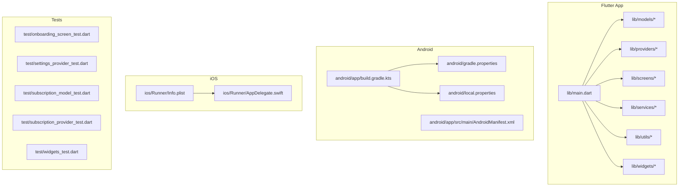
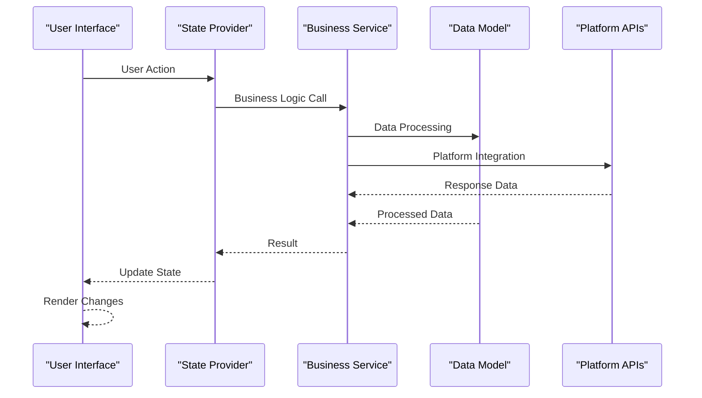
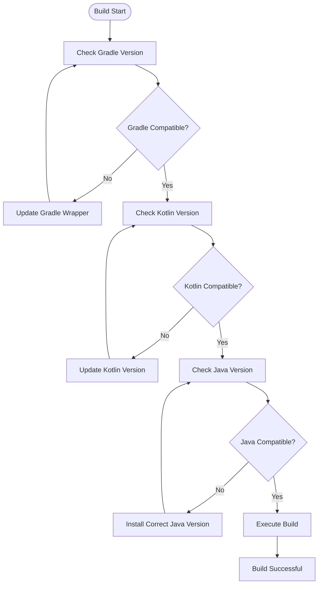
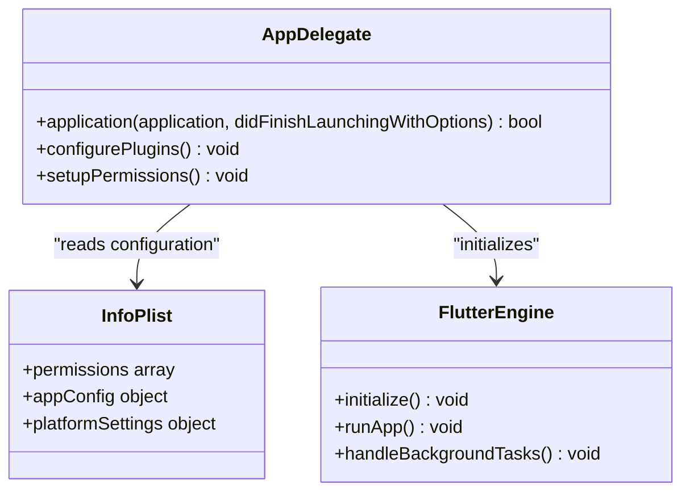
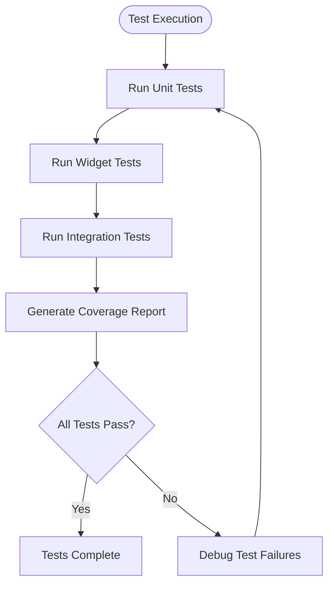
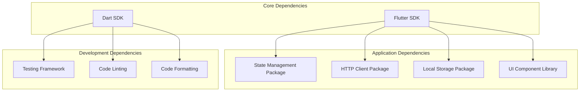

# Troubleshooting & FAQ

<cite>
**Referenced Files in This Document**
- [README.md](file://README.md)
- [pubspec.yaml](file://pubspec.yaml)
- [lib/main.dart](file://lib/main.dart)
- [android/app/build.gradle.kts](file://android/app/build.gradle.kts)
- [android/gradle.properties](file://android/gradle.properties)
- [android/local.properties](file://android/local.properties)
- [ios/Runner/Info.plist](file://ios/Runner/Info.plist)
- [ios/Runner/AppDelegate.swift](file://ios/Runner/AppDelegate.swift)
- [docs/ARCHITECTURE.md](file://docs/ARCHITECTURE.md)
- [docs/IOS_GUIDE.md](file://docs/IOS_GUIDE.md)
- [docs/PROJECT_BRIEF.md](file://docs/PROJECT_BRIEF.md)
- [test/onboarding_screen_test.dart](file://test/onboarding_screen_test.dart)
- [test/settings_provider_test.dart](file://test/settings_provider_test.dart)
- [test/subscription_model_test.dart](file://test/subscription_model_test.dart)
- [test/subscription_provider_test.dart](file://test/subscription_provider_test.dart)
- [test/widgets_test.dart](file://test/widgets_test.dart)
</cite>

## Table of Contents
1. [Introduction](#introduction)
2. [Project Structure](#project-structure)
3. [Core Components](#core-components)
4. [Architecture Overview](#architecture-overview)
5. [Detailed Component Analysis](#detailed-component-analysis)
6. [Dependency Analysis](#dependency-analysis)
7. [Performance Considerations](#performance-considerations)
8. [Troubleshooting Guide](#troubleshooting-guide)
9. [Conclusion](#conclusion)
10. [Appendices](#appendices)

## Introduction
This document provides comprehensive troubleshooting and frequently asked questions for the ASSINATURAS NINJA Flutter application. It focuses on practical solutions for setup, development, and deployment issues across Android and iOS, including build problems, dependency conflicts, debugging techniques, performance profiling, memory leak detection, log analysis, and error resolution strategies. The content is designed to be accessible to developers with varying levels of experience while remaining precise and actionable.

## Project Structure
The project follows a standard Flutter layout with platform-specific configurations under android and ios directories, Dart source code under lib, tests under test, and documentation under docs. Key configuration files include pubspec.yaml for dependencies, Gradle files for Android builds, and Info.plist/AppDelegate for iOS runtime behavior.

**Diagram sources**
- [lib/main.dart:1-50](file://lib/main.dart#L1-L50)
- [android/app/build.gradle.kts:1-30](file://android/app/build.gradle.kts#L1-L30)
- [android/gradle.properties:1-20](file://android/gradle.properties#L1-L20)
- [android/local.properties:1-10](file://android/local.properties#L1-L10)
- [ios/Runner/Info.plist:1-30](file://ios/Runner/Info.plist#L1-L30)
- [ios/Runner/AppDelegate.swift:1-20](file://ios/Runner/AppDelegate.swift#L1-L20)

**Section sources**
- [README.md:1-50](file://README.md#L1-L50)
- [pubspec.yaml:1-50](file://pubspec.yaml#L1-L50)
- [docs/ARCHITECTURE.md:1-30](file://docs/ARCHITECTURE.md#L1-L30)

## Core Components
The application is structured around core components that handle different aspects of functionality:

- **Main Entry Point**: The primary application initialization and routing configuration
- **Models**: Data structures and business logic entities
- **Providers**: State management and data flow controllers
- **Screens**: User interface screens and navigation flows
- **Services**: External API calls, database operations, and third-party integrations
- **Utils**: Helper functions and utility classes
- **Widgets**: Reusable UI components

Common issues in these components typically involve state synchronization problems, incorrect dependency injection, and improper lifecycle management.

**Section sources**
- [lib/main.dart:1-100](file://lib/main.dart#L1-L100)
- [docs/ARCHITECTURE.md:30-100](file://docs/ARCHITECTURE.md#L30-L100)

## Architecture Overview
The application follows a layered architecture pattern with clear separation of concerns between presentation, business logic, and data layers.

**Diagram sources**
- [lib/main.dart:1-50](file://lib/main.dart#L1-L50)
- [docs/ARCHITECTURE.md:50-150](file://docs/ARCHITECTURE.md#L50-L150)

## Detailed Component Analysis

### Build System Configuration
The Android build system uses Gradle Kotlin DSL with specific configurations for version compatibility and build optimization.

**Diagram sources**
- [android/app/build.gradle.kts:1-50](file://android/app/build.gradle.kts#L1-L50)
- [android/gradle.properties:1-30](file://android/gradle.properties#L1-L30)

**Section sources**
- [android/app/build.gradle.kts:1-100](file://android/app/build.gradle.kts#L1-L100)
- [android/gradle.properties:1-50](file://android/gradle.properties#L1-L50)

### iOS Configuration and Setup
iOS configuration involves proper Info.plist setup and AppDelegate initialization for platform-specific features.

**Diagram sources**
- [ios/Runner/AppDelegate.swift:1-50](file://ios/Runner/AppDelegate.swift#L1-L50)
- [ios/Runner/Info.plist:1-100](file://ios/Runner/Info.plist#L1-L100)

**Section sources**
- [ios/Runner/AppDelegate.swift:1-100](file://ios/Runner/AppDelegate.swift#L1-L100)
- [ios/Runner/Info.plist:1-200](file://ios/Runner/Info.plist#L1-L200)
- [docs/IOS_GUIDE.md:1-100](file://docs/IOS_GUIDE.md#L1-L100)

### Testing Framework Implementation
The testing suite covers unit tests for models, providers, and widget tests for UI components.

**Diagram sources**
- [test/onboarding_screen_test.dart:1-50](file://test/onboarding_screen_test.dart#L1-L50)
- [test/settings_provider_test.dart:1-50](file://test/settings_provider_test.dart#L1-L50)
- [test/subscription_model_test.dart:1-50](file://test/subscription_model_test.dart#L1-L50)
- [test/subscription_provider_test.dart:1-50](file://test/subscription_provider_test.dart#L1-L50)
- [test/widgets_test.dart:1-50](file://test/widgets_test.dart#L1-L50)

**Section sources**
- [test/onboarding_screen_test.dart:1-100](file://test/onboarding_screen_test.dart#L1-L100)
- [test/settings_provider_test.dart:1-100](file://test/settings_provider_test.dart#L1-L100)
- [test/subscription_model_test.dart:1-100](file://test/subscription_model_test.dart#L1-L100)
- [test/subscription_provider_test.dart:1-100](file://test/subscription_provider_test.dart#L1-L100)
- [test/widgets_test.dart:1-100](file://test/widgets_test.dart#L1-L100)

## Dependency Analysis
The project manages dependencies through pubspec.yaml with careful version pinning to ensure compatibility across platforms.

**Diagram sources**
- [pubspec.yaml:1-100](file://pubspec.yaml#L1-L100)

**Section sources**
- [pubspec.yaml:1-200](file://pubspec.yaml#L1-L200)

## Performance Considerations
Performance optimization in Flutter applications requires monitoring several key areas:

- **Widget Rebuilds**: Minimize unnecessary rebuilds using const constructors and proper state management
- **Memory Usage**: Monitor memory leaks through proper disposal of resources and listeners
- **Network Requests**: Implement caching strategies and optimize API calls
- **Image Loading**: Use appropriate image formats and implement lazy loading
- **Database Operations**: Optimize queries and use proper indexing

## Troubleshooting Guide

### Common Setup Issues

#### Android Build Problems
**Issue**: Gradle build failures due to version incompatibilities
**Solution**: Ensure compatible versions of Gradle, Kotlin, and Java are installed and configured correctly. Check the Gradle wrapper properties and update if necessary.

**Issue**: Missing Android SDK components
**Solution**: Install required Android SDK packages through Android Studio or command line tools. Verify the Android SDK path in local.properties.

#### iOS Build Problems
**Issue**: CocoaPods installation failures
**Solution**: Update Ruby and reinstall CocoaPods. Clean the Pods directory and reinstall dependencies.

**Issue**: Code signing errors
**Solution**: Verify provisioning profiles and certificates are properly configured in Xcode workspace settings.

### Development Issues

#### Hot Reload Not Working
**Symptoms**: Changes not reflected during development
**Solutions**:
- Restart the Flutter daemon
- Clear build cache and rebuild
- Check for syntax errors in modified files
- Verify file permissions and watch service

#### State Management Problems
**Symptoms**: UI not updating when state changes
**Solutions**:
- Ensure proper provider implementation
- Check for correct context usage
- Verify state mutation methods are called
- Review async state updates

### Deployment Issues

#### APK/AAB Build Failures
**Symptoms**: Release build crashes or fails
**Solutions**:
- Enable ProGuard/R8 rules properly
- Check for debug-only code in release builds
- Verify resource shrinking configuration
- Test with different build variants

#### App Store Submission Problems
**Symptoms**: App rejected during review
**Solutions**:
- Ensure all required permissions are declared
- Test on latest iOS version
- Verify app icon and splash screen requirements
- Check for deprecated API usage

### Debugging Techniques

#### Flutter DevTools Usage
**Memory Profiling**: Use the Memory tab to identify memory leaks and monitor heap usage
**Performance Monitoring**: Analyze frame rendering and widget rebuild patterns
**Network Inspection**: Monitor API calls and response times
**Logging**: Implement structured logging for better issue tracking

#### Log Analysis
**Android Logs**: Use adb logcat to capture device logs
**iOS Logs**: Use Console.app or xcrun simctl to view simulator logs
**Flutter Logs**: Implement custom logging with severity levels
**Crash Reports**: Integrate crash reporting services for production monitoring

### Error Resolution Strategies

#### Dependency Conflicts
**Detection**: Use `flutter pub deps` to analyze dependency tree
**Resolution**: Pin conflicting package versions or find compatible alternatives
**Prevention**: Regularly update dependencies and test compatibility

#### Platform-Specific Issues
**Android**: Check AndroidManifest.xml permissions and activity declarations
**iOS**: Verify Info.plist entries and entitlements configuration
**Cross-platform**: Use conditional imports and platform checks

## Conclusion
This troubleshooting guide provides comprehensive solutions for common issues encountered during the development and deployment of the ASSINATURAS NINJA application. By following the diagnostic procedures and best practices outlined here, developers can efficiently resolve issues and maintain high-quality code throughout the application lifecycle.

## Appendices

### Frequently Asked Questions

#### Q: How do I fix dependency resolution errors?
**A**: Run `flutter clean`, then `flutter pub get`. If issues persist, check for version conflicts using `flutter pub deps --tree` and update conflicting packages to compatible versions.

#### Q: Why is my app crashing on startup?
**A**: Check the console output for stack traces. Common causes include missing dependencies, incorrect configuration, or null reference exceptions. Use debugging tools to identify the exact location of the crash.

#### Q: How do I optimize app performance?
**A**: Use Flutter DevTools to analyze performance metrics. Focus on reducing widget rebuilds, optimizing network requests, and implementing proper caching strategies.

#### Q: What should I do if tests fail randomly?
**A**: Ensure proper test isolation, avoid shared state between tests, and use appropriate mocking. Consider adding retry logic for flaky tests and investigate timing-related issues.

#### Q: How do I handle platform-specific code?
**A**: Use conditional imports and platform detection. Create platform-specific implementations and abstract them behind common interfaces for better maintainability.

**Section sources**
- [docs/PROJECT_BRIEF.md:1-100](file://docs/PROJECT_BRIEF.md#L1-L100)
- [README.md:50-150](file://README.md#L50-L150)
- [docs/VALIDATION.md:1-100](file://docs/VALIDATION.md#L1-L100)