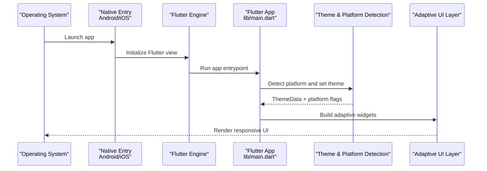
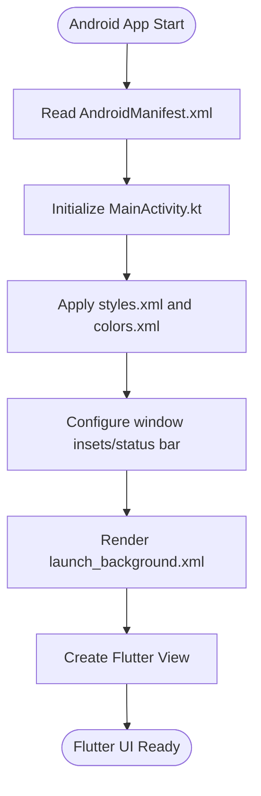
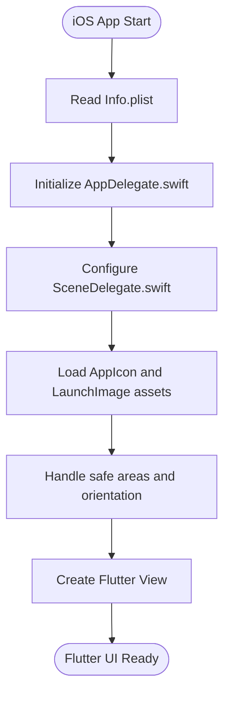
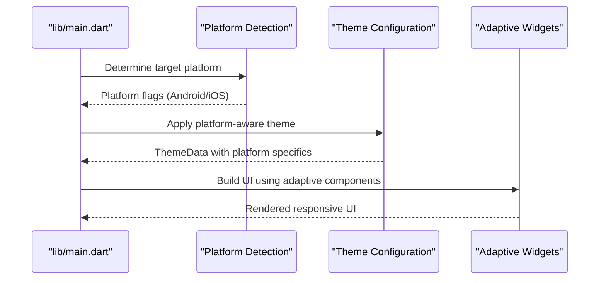
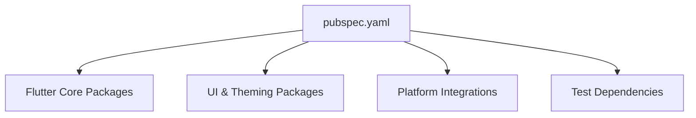

# Responsive Design & Platform Adaptations

<cite>
**Referenced Files in This Document**
- [main.dart](file://lib/main.dart)
- [pubspec.yaml](file://pubspec.yaml)
- [MainActivity.kt](file://android/app/src/main/kotlin/br/com/assinaturasninja/assinaturas_ninja/MainActivity.kt)
- [AndroidManifest.xml](file://android/app/src/main/AndroidManifest.xml)
- [launch_background.xml](file://android/app/src/main/res/drawable/launch_background.xml)
- [styles.xml](file://android/app/src/main/res/values/styles.xml)
- [colors.xml](file://android/app/src/main/res/values/colors.xml)
- [AppIcon Contents.json](file://ios/Runner/Assets.xcassets/AppIcon.appiconset/Contents.json)
- [LaunchImage Contents.json](file://ios/Runner/Assets.xcassets/LaunchImage.imageset/Contents.json)
- [Info.plist](file://ios/Runner/Info.plist)
- [AppDelegate.swift](file://ios/Runner/AppDelegate.swift)
- [SceneDelegate.swift](file://ios/Runner/SceneDelegate.swift)
- [UI_GUIDE.md](file://docs/UI_GUIDE.md)
- [IOS_GUIDE.md](file://docs/IOS_GUIDE.md)
</cite>

## Table of Contents
1. [Introduction](#introduction)
2. [Project Structure](#project-structure)
3. [Core Components](#core-components)
4. [Architecture Overview](#architecture-overview)
5. [Detailed Component Analysis](#detailed-component-analysis)
6. [Dependency Analysis](#dependency-analysis)
7. [Performance Considerations](#performance-considerations)
8. [Troubleshooting Guide](#troubleshooting-guide)
9. [Conclusion](#conclusion)
10. [Appendices](#appendices)

## Introduction
This document explains how ASSINATURAS NINJA implements responsive design and platform-specific UI adaptations across Android and iOS. It covers screen size adaptation, orientation handling, device type considerations, and platform-specific UI patterns (Material Design on Android and Cupertino on iOS). It also provides guidelines for implementing responsive layouts, handling different aspect ratios, optimizing user experience, and strategies for conditional rendering and cross-platform compatibility.

## Project Structure
The project follows a standard Flutter layout with platform-specific directories:
- lib: Dart application code including screens, widgets, providers, services, and utilities
- android: Android native configuration and resources
- ios: iOS native configuration and assets
- docs: Documentation including UI and iOS guides

```mermaid
graph TB
subgraph "Flutter App"
main["lib/main.dart"]
ui_guide["docs/UI_GUIDE.md"]
end
subgraph "Android"
manifest["android/app/src/main/AndroidManifest.xml"]
activity["android/app/src/main/kotlin/.../MainActivity.kt"]
styles["android/app/src/main/res/values/styles.xml"]
colors["android/app/src/main/res/values/colors.xml"]
launch_bg["android/app/src/main/res/drawable/launch_background.xml"]
end
subgraph "iOS"
info_plist["ios/Runner/Info.plist"]
app_delegate["ios/Runner/AppDelegate.swift"]
scene_delegate["ios/Runner/SceneDelegate.swift"]
app_icon["ios/Runner/Assets.xcassets/AppIcon.appiconset/Contents.json"]
launch_image["ios/Runner/Assets.xcassets/LaunchImage.imageset/Contents.json"]
end
main --> ui_guide
main --> manifest
main --> info_plist
manifest --> activity
manifest --> styles
manifest --> colors
manifest --> launch_bg
info_plist --> app_delegate
info_plist --> scene_delegate
info_plist --> app_icon
info_plist --> launch_image
```

**Diagram sources**
- [main.dart](file://lib/main.dart)
- [AndroidManifest.xml](file://android/app/src/main/AndroidManifest.xml)
- [MainActivity.kt](file://android/app/src/main/kotlin/br/com/assinaturasninja/assinaturas_ninja/MainActivity.kt)
- [styles.xml](file://android/app/src/main/res/values/styles.xml)
- [colors.xml](file://android/app/src/main/res/values/colors.xml)
- [launch_background.xml](file://android/app/src/main/res/drawable/launch_background.xml)
- [Info.plist](file://ios/Runner/Info.plist)
- [AppDelegate.swift](file://ios/Runner/AppDelegate.swift)
- [SceneDelegate.swift](file://ios/Runner/SceneDelegate.swift)
- [AppIcon Contents.json](file://ios/Runner/Assets.xcassets/AppIcon.appiconset/Contents.json)
- [LaunchImage Contents.json](file://ios/Runner/Assets.xcassets/LaunchImage.imageset/Contents.json)

**Section sources**
- [main.dart](file://lib/main.dart)
- [UI_GUIDE.md](file://docs/UI_GUIDE.md)

## Core Components
Responsive design in this project is implemented through:
- Flutter’s built-in responsive utilities (MediaQuery, LayoutBuilder, OrientationBuilder)
- Adaptive widgets that switch between Material and Cupertino components based on platform
- Platform-aware theming and typography scaling
- Asset sizing and density-aware images
- Safe area handling to avoid notches and system UI overlaps

Platform-specific UI considerations:
- Android: Material Design components, navigation patterns, and status bar integration
- iOS: Cupertino components, safe area usage, and iOS-specific gestures

Guidelines:
- Use relative sizing (percentages, flex) over fixed pixel values
- Define breakpoints for small, medium, and large screens
- Test both portrait and landscape orientations
- Provide appropriate asset resolutions for hdpi, xhdpi, xxhdpi, xxxhdpi on Android and @1x, @2x, @3x on iOS

**Section sources**
- [UI_GUIDE.md](file://docs/UI_GUIDE.md)

## Architecture Overview
The app initializes the Flutter engine and configures platform-specific behaviors at startup. The following sequence shows how the app bootstraps and integrates with platform configurations.

**Diagram sources**
- [main.dart](file://lib/main.dart)
- [MainActivity.kt](file://android/app/src/main/kotlin/br/com/assinaturasninja/assinaturas_ninja/MainActivity.kt)
- [AppDelegate.swift](file://ios/Runner/AppDelegate.swift)
- [SceneDelegate.swift](file://ios/Runner/SceneDelegate.swift)

## Detailed Component Analysis

### Android Platform Configuration
Responsiveness and appearance on Android are influenced by:
- Activity lifecycle and window insets
- Status bar and navigation bar styling
- Theme attributes and color schemes
- Launch background and splash behavior

Key files:
- MainActivity.kt: Configures the FlutterActivity and can adjust window insets or system UI visibility
- AndroidManifest.xml: Declares permissions, screen orientation policies, and theme references
- styles.xml: Defines theme attributes such as status bar color and window flags
- colors.xml: Provides color tokens used by themes and UI elements
- launch_background.xml: Controls the initial splash drawing before Flutter renders

**Diagram sources**
- [MainActivity.kt](file://android/app/src/main/kotlin/br/com/assinaturasninja/assinaturas_ninja/MainActivity.kt)
- [AndroidManifest.xml](file://android/app/src/main/AndroidManifest.xml)
- [styles.xml](file://android/app/src/main/res/values/styles.xml)
- [colors.xml](file://android/app/src/main/res/values/colors.xml)
- [launch_background.xml](file://android/app/src/main/res/drawable/launch_background.xml)

**Section sources**
- [MainActivity.kt](file://android/app/src/main/kotlin/br/com/assinaturasninja/assinaturas_ninja/MainActivity.kt)
- [AndroidManifest.xml](file://android/app/src/main/AndroidManifest.xml)
- [styles.xml](file://android/app/src/main/res/values/styles.xml)
- [colors.xml](file://android/app/src/main/res/values/colors.xml)
- [launch_background.xml](file://android/app/src/main/res/drawable/launch_background.xml)

### iOS Platform Configuration
On iOS, responsiveness and appearance are influenced by:
- Info.plist settings (status bar style, supported orientations, app icons)
- AppDelegate and SceneDelegate initialization
- Asset catalogs for app icon and launch image
- Safe area handling for notches and dynamic islands

Key files:
- Info.plist: Contains keys for status bar appearance, supported interface orientations, and other runtime behaviors
- AppDelegate.swift: Initializes the Flutter engine and can configure global iOS behaviors
- SceneDelegate.swift: Manages scene lifecycle and window configuration
- AppIcon Contents.json: Defines app icon variants for different scales
- LaunchImage Contents.json: Defines launch image variants for different devices

**Diagram sources**
- [Info.plist](file://ios/Runner/Info.plist)
- [AppDelegate.swift](file://ios/Runner/AppDelegate.swift)
- [SceneDelegate.swift](file://ios/Runner/SceneDelegate.swift)
- [AppIcon Contents.json](file://ios/Runner/Assets.xcassets/AppIcon.appiconset/Contents.json)
- [LaunchImage Contents.json](file://ios/Runner/Assets.xcassets/LaunchImage.imageset/Contents.json)

**Section sources**
- [Info.plist](file://ios/Runner/Info.plist)
- [AppDelegate.swift](file://ios/Runner/AppDelegate.swift)
- [SceneDelegate.swift](file://ios/Runner/SceneDelegate.swift)
- [AppIcon Contents.json](file://ios/Runner/Assets.xcassets/AppIcon.appiconset/Contents.json)
- [LaunchImage Contents.json](file://ios/Runner/Assets.xcassets/LaunchImage.imageset/Contents.json)

### Flutter App Initialization and Platform Detection
The app entrypoint sets up the Flutter environment and detects the current platform to apply platform-specific UI patterns. This includes selecting Material or Cupertino widgets and adjusting themes accordingly.

**Diagram sources**
- [main.dart](file://lib/main.dart)

**Section sources**
- [main.dart](file://lib/main.dart)

### Responsive Layout Strategies
Recommended strategies for building responsive layouts:
- Use MediaQuery to read screen width, height, and orientation
- Use LayoutBuilder to adapt to parent constraints
- Use OrientationBuilder to respond to rotation changes
- Implement breakpoints for small (<600), medium (600–1024), and large (>1024) widths
- Prefer flexible layouts (Row/Column with Expanded/Flexible) over fixed sizes
- Use SafeArea to avoid system UI intrusions
- Scale typography and spacing based on screen density

Example patterns:
- Conditional rendering based on platform detection
- Responsive breakpoints controlling grid columns and navigation style
- Cross-platform compatibility using shared logic with platform-specific UI wrappers

[No sources needed since this section provides general guidance]

### Platform-Specific UI Patterns
- Android: Follow Material Design guidelines; use Material widgets, consistent elevation, ripple effects, and bottom sheets where appropriate
- iOS: Follow Cupertino patterns; use Cupertino widgets, translucent navigation bars, and iOS-style gestures

Guidelines:
- Wrap platform-specific UI in adapters to keep business logic platform-agnostic
- Maintain consistent UX while respecting platform conventions
- Ensure accessibility labels and semantics match platform expectations

**Section sources**
- [UI_GUIDE.md](file://docs/UI_GUIDE.md)

## Dependency Analysis
The app’s dependencies include Flutter framework packages and platform integrations. The pubspec file lists core dependencies and dev dependencies that influence UI behavior and testing.

**Diagram sources**
- [pubspec.yaml](file://pubspec.yaml)

**Section sources**
- [pubspec.yaml](file://pubspec.yaml)

## Performance Considerations
- Avoid heavy computations during build; use providers or state management to minimize rebuilds
- Cache images and assets; provide multiple densities to reduce memory pressure
- Use const constructors where possible to optimize widget tree construction
- Limit nested builders; prefer extracting reusable widgets
- Profile layout performance with Flutter DevTools to identify expensive rebuilds

[No sources needed since this section provides general guidance]

## Troubleshooting Guide
Common issues and resolutions:
- Incorrect status bar or navigation bar appearance on Android: Verify styles.xml and AndroidManifest.xml theme references
- Notch or safe area overlap on iOS: Ensure SafeArea is applied and Info.plist orientation settings are correct
- Launch image or icon not updating: Confirm asset catalog entries and scale variants in Contents.json files
- Orientation not responding: Check platform configuration and ensure orientation listeners are correctly wired in Flutter

**Section sources**
- [styles.xml](file://android/app/src/main/res/values/styles.xml)
- [AndroidManifest.xml](file://android/app/src/main/AndroidManifest.xml)
- [Info.plist](file://ios/Runner/Info.plist)
- [AppIcon Contents.json](file://ios/Runner/Assets.xcassets/AppIcon.appiconset/Contents.json)
- [LaunchImage Contents.json](file://ios/Runner/Assets.xcassets/LaunchImage.imageset/Contents.json)

## Conclusion
ASSINATURAS NINJA leverages Flutter’s responsive capabilities alongside platform-specific configurations to deliver a cohesive user experience across Android and iOS. By combining adaptive widgets, thoughtful theming, and careful platform integration, the app maintains consistency while honoring platform conventions. Following the guidelines and patterns outlined here will help maintain scalability and usability as the app grows.

[No sources needed since this section summarizes without analyzing specific files]

## Appendices
- Additional platform-specific guidance and best practices can be found in the documentation files:
  - UI guide for design patterns and responsive strategies
  - iOS guide for platform-specific setup and considerations

**Section sources**
- [UI_GUIDE.md](file://docs/UI_GUIDE.md)
- [IOS_GUIDE.md](file://docs/IOS_GUIDE.md)