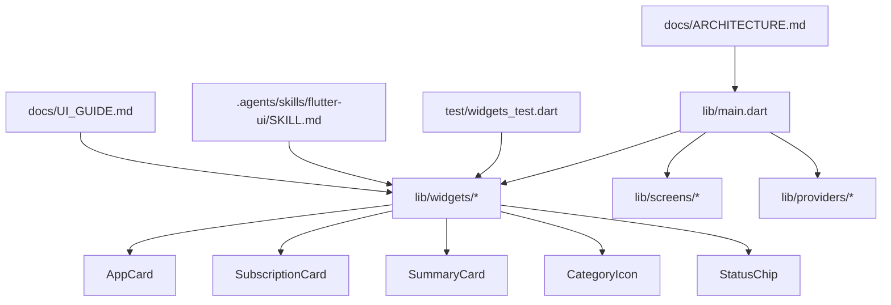
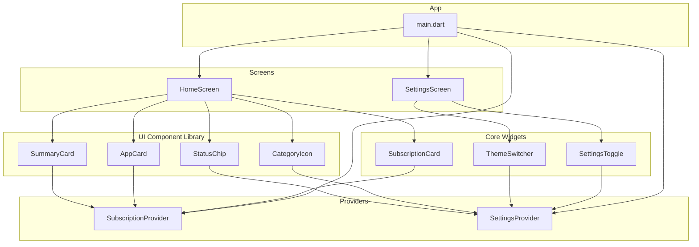
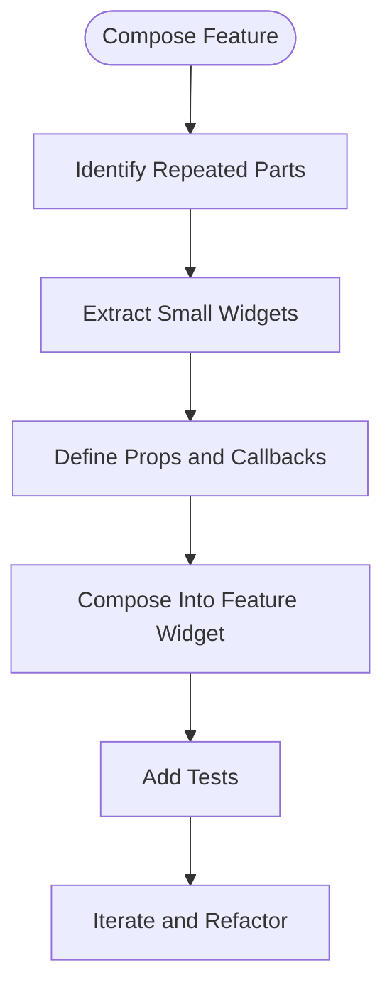
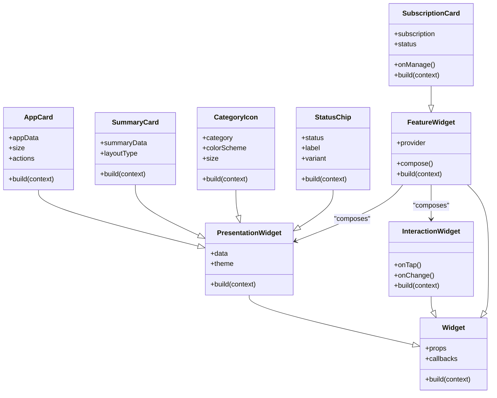
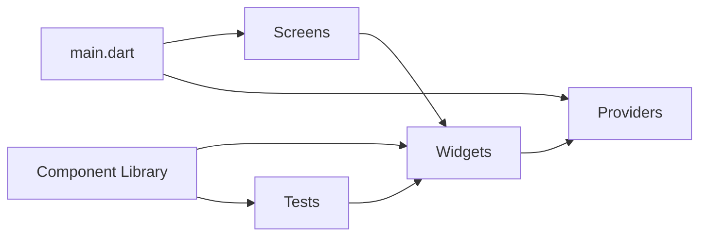

# Reusable Widget Components

<cite>
**Referenced Files in This Document**
- [main.dart](file://lib/main.dart)
- [widgets_test.dart](file://test/widgets_test.dart)
- [SKILL.md](file://.agents/skills/flutter-ui/SKILL.md)
- [UI_GUIDE.md](file://docs/UI_GUIDE.md)
- [ARCHITECTURE.md](file://docs/ARCHITECTURE.md)
</cite>

## Update Summary
**Changes Made**
- Updated Core Components section to reflect the new comprehensive UI component library
- Added detailed analysis of app card, subscription card, summary card, category icon, and status chip components
- Enhanced Component Hierarchy section with new component examples
- Updated Concrete Examples section with specific widget implementations
- Revised Architecture Overview diagram to include new component types

## Table of Contents
1. [Introduction](#introduction)
2. [Project Structure](#project-structure)
3. [Core Components](#core-components)
4. [Architecture Overview](#architecture-overview)
5. [Detailed Component Analysis](#detailed-component-analysis)
6. [Dependency Analysis](#dependency-analysis)
7. [Performance Considerations](#performance-considerations)
8. [Troubleshooting Guide](#troubleshooting-guide)
9. [Conclusion](#conclusion)
10. [Appendices](#appendices)

## Introduction
This document explains the reusable widget components system in ASSINATURAS NINJA with a focus on composition strategy, hierarchy, naming conventions, prop/attribute patterns, event handling, responsive layouts, accessibility, and integration patterns. The system now includes a comprehensive UI component library featuring app cards, subscription cards, summary cards, category icons, and status chips designed for design consistency across the application. It synthesizes project rules and UI guidance to provide practical guidelines for building maintainable Flutter widgets that compose well, scale across screens, and remain accessible and testable.

## Project Structure
The Flutter application organizes UI code under lib with a dedicated widgets directory for reusable components. The entry point initializes providers and routes, while tests validate widget behavior. The new component library provides consistent visual elements for subscription management and categorization.

**Diagram sources**
- [main.dart](file://lib/main.dart)
- [widgets_test.dart](file://test/widgets_test.dart)
- [SKILL.md](file://.agents/skills/flutter-ui/SKILL.md)
- [UI_GUIDE.md](file://docs/UI_GUIDE.md)
- [ARCHITECTURE.md](file://docs/ARCHITECTURE.md)

**Section sources**
- [main.dart](file://lib/main.dart)
- [widgets_test.dart](file://test/widgets_test.dart)
- [SKILL.md](file://.agents/skills/flutter-ui/SKILL.md)
- [UI_GUIDE.md](file://docs/UI_GUIDE.md)
- [ARCHITECTURE.md](file://docs/ARCHITECTURE.md)

## Core Components
Reusable widgets follow a consistent composition model with the new comprehensive UI component library:
- Small, single-purpose widgets composed into larger features.
- Props (constructor parameters) define appearance and behavior; callbacks represent events.
- Stateless-first approach with stateful wrappers only when necessary.
- Theme-aware styling via Material theme and custom design tokens.
- Accessibility attributes provided by default where applicable.

**Updated** The component library now includes specialized widgets for subscription management:

### App Card Component
- Displays application information with icon, title, and metadata
- Supports different sizes and layout variations
- Includes action buttons and status indicators

### Subscription Card Component  
- Shows subscription details with pricing, duration, and renewal info
- Provides quick actions for management operations
- Integrates with status chips for visual state indication

### Summary Card Component
- Presents aggregated data in compact format
- Supports multiple data visualization patterns
- Adapts content based on available space

### Category Icon Component
- Renders categorized icons with consistent styling
- Supports dynamic color theming based on category type
- Includes fallback mechanisms for missing assets

### Status Chip Component
- Displays status indicators with semantic meaning
- Uses consistent color coding for different states
- Provides clear visual feedback for user interactions

Widget composition strategy:
- Container widgets manage layout and constraints.
- Presentation widgets render data without side effects.
- Interaction widgets encapsulate user actions and emit events via callbacks.
- Feature widgets combine presentation and interaction layers.

Naming conventions:
- Use descriptive PascalCase names reflecting purpose (e.g., SubscriptionCard, SettingsToggle).
- Group related widgets in feature-specific files or folders.
- Avoid generic names like Button or Card unless they are truly generic.

Prop/attribute patterns:
- Prefer named, non-nullable props with clear defaults.
- Use booleans for toggles, enums for variants, and typed objects for complex configuration.
- Separate display props from behavior props.
- Provide optional callbacks for events (e.g., onTap, onChange).

Event handling approaches:
- Callbacks for one-off interactions.
- Provider/state management for shared state changes.
- Focus and semantics for keyboard and screen reader support.

Responsive layouts:
- Use LayoutBuilder, MediaQuery, and Flexible/Expanded to adapt to screen sizes.
- Breakpoints driven by available space rather than device types.
- Fluid typography and spacing using theme scales.

Accessibility compliance:
- Provide semantic labels and descriptions.
- Ensure sufficient contrast and scalable text.
- Support dynamic type and high-contrast modes.
- Test with TalkBack/VoiceOver and keyboard navigation.

Integration patterns:
- Compose widgets inside screens and other widgets.
- Inject providers at the top of the subtree for scoped access.
- Keep business logic out of widgets; delegate to services and providers.

**Section sources**
- [SKILL.md](file://.agents/skills/flutter-ui/SKILL.md)
- [UI_GUIDE.md](file://docs/UI_GUIDE.md)
- [ARCHITECTURE.md](file://docs/ARCHITECTURE.md)

## Architecture Overview
The widget layer composes small building blocks into feature-rich screens. Providers supply state and services; screens orchestrate layout and flow; widgets remain focused on rendering and interaction. The new component library establishes a consistent visual language across the application.

**Diagram sources**
- [main.dart](file://lib/main.dart)
- [ARCHITECTURE.md](file://docs/ARCHITECTURE.md)

## Detailed Component Analysis

### Widget Composition Strategy
- Build feature widgets by composing smaller presentation and interaction widgets.
- Encapsulate repeated UI patterns into reusable components.
- Favor immutability and pure functions for predictable rendering.

[No sources needed since this diagram shows conceptual workflow, not actual code structure]

### Component Hierarchy and Design Principles
- Single responsibility per widget.
- Clear separation between layout, presentation, and interaction.
- Theme-driven styling with consistent tokens.
- Minimal state within widgets; lift state to providers when shared.

**Updated** The new component library follows these principles:

[No sources needed since this diagram shows conceptual relationships, not specific source files]

### Naming Conventions and Prop Patterns
- Use meaningful names that describe intent.
- Group related props logically.
- Provide sensible defaults and validation through required fields.
- Use enums for constrained options.

**Updated** New component prop patterns:
- AppCard: `appData`, `size`, `showActions`
- SubscriptionCard: `subscription`, `status`, `compactMode`
- SummaryCard: `summaryData`, `layoutType`, `showDetails`
- CategoryIcon: `category`, `colorScheme`, `size`
- StatusChip: `status`, `label`, `variant`, `onClick`

### Event Handling Approaches
- Emit events via callbacks for local interactions.
- Dispatch state updates to providers for cross-widget communication.
- Use focus and semantics for keyboard and assistive technology.

**Updated** Component-specific event patterns:
- AppCard: `onLaunch`, `onRate`, `onShare`
- SubscriptionCard: `onRenew`, `onCancel`, `onViewDetails`
- SummaryCard: `onExpand`, `onRefresh`
- CategoryIcon: `onSelect`, `onFilter`
- StatusChip: `onClick`, `onDismiss`

### Responsive Layout Guidelines
- Leverage LayoutBuilder and MediaQuery for adaptive layouts.
- Use flexible sizing and fluid spacing.
- Test across breakpoints and orientations.

**Updated** Component responsiveness:
- All cards support multiple size variants (small, medium, large)
- Grid layouts adapt based on available screen width
- Typography scales proportionally with container size

### Accessibility Compliance Checklist
- Semantic labels and roles.
- Contrast ratios and scalable text.
- Keyboard navigability and focus order.
- Screen reader testing.

**Updated** Component accessibility features:
- All interactive elements have proper semantic labels
- Color combinations meet WCAG contrast requirements
- Full keyboard navigation support
- Screen reader announcements for state changes

### Concrete Examples from the Codebase
- Widget creation and customization: see the widget tests for usage patterns and assertions.
- Integration with providers: observe how widgets consume provider state and trigger updates.
- Composition examples: review how feature widgets assemble smaller components.

**Updated** New component usage patterns:
- AppCard integration with app listing screens
- SubscriptionCard in subscription management interfaces
- SummaryCard for dashboard and overview displays
- CategoryIcon throughout categorization features
- StatusChip for status indicators across all screens

**Section sources**
- [widgets_test.dart](file://test/widgets_test.dart)
- [SKILL.md](file://.agents/skills/flutter-ui/SKILL.md)
- [UI_GUIDE.md](file://docs/UI_GUIDE.md)

## Dependency Analysis
Widgets depend on providers for state and on theme resources for styling. Screens depend on both widgets and providers. Tests depend on widgets to verify behavior. The new component library maintains clean dependency boundaries.

**Diagram sources**
- [main.dart](file://lib/main.dart)
- [widgets_test.dart](file://test/widgets_test.dart)

**Section sources**
- [main.dart](file://lib/main.dart)
- [widgets_test.dart](file://test/widgets_test.dart)

## Performance Considerations
- Prefer const constructors for immutable widgets.
- Minimize rebuilds by isolating state and using selective providers.
- Avoid heavy computations in build; memoize results when appropriate.
- Use efficient lists and pagination for large datasets.

**Updated** Component-specific performance optimizations:
- AppCard uses lazy loading for app metadata
- SubscriptionCard implements virtual scrolling for large lists
- SummaryCard caches computed values
- CategoryIcon uses asset caching strategies
- StatusChip minimizes rebuild scope with selective state management

## Troubleshooting Guide
Common issues and resolutions:
- Unexpected rebuilds: check provider scopes and unnecessary dependencies.
- Layout overflow: use Flexible/Expanded and wrap content appropriately.
- Accessibility failures: add labels and ensure semantic structure.
- Test flakiness: stabilize async interactions and mock providers.

**Updated** Component-specific troubleshooting:
- AppCard image loading failures: implement fallback images and error states
- SubscriptionCard state synchronization: verify provider updates and callback chains
- SummaryCard data formatting: validate input data structures and edge cases
- CategoryIcon asset resolution: handle missing assets gracefully
- StatusChip color conflicts: ensure theme consistency and contrast compliance

**Section sources**
- [widgets_test.dart](file://test/widgets_test.dart)
- [UI_GUIDE.md](file://docs/UI_GUIDE.md)

## Conclusion
By adhering to composition-first principles, clear naming, robust prop patterns, and accessibility standards, the widget system in ASSINATURAS NINJA remains maintainable, testable, and adaptable across devices. The new comprehensive UI component library enhances design consistency while maintaining clean separation of concerns and predictable state flows. The standardized components for app display, subscription management, summaries, categorization, and status indication provide a solid foundation for future development.

## Appendices
- Reference the UI guide and architecture docs for additional patterns and best practices.
- Consult the Flutter UI skill for detailed component development guidance.

**Updated** Component library reference:
- AppCard: Application display and management interface
- SubscriptionCard: Subscription lifecycle management
- SummaryCard: Data aggregation and presentation
- CategoryIcon: Visual categorization system
- StatusChip: State indication and user feedback

**Section sources**
- [UI_GUIDE.md](file://docs/UI_GUIDE.md)
- [ARCHITECTURE.md](file://docs/ARCHITECTURE.md)
- [SKILL.md](file://.agents/skills/flutter-ui/SKILL.md)