# Screen Architecture & Navigation

<cite>
**Referenced Files in This Document**
- [main.dart](file://lib/main.dart)
- [routes.dart](file://lib/routes.dart)
- [screens directory](file://lib/screens)
- [providers directory](file://lib/providers)
- [widgets directory](file://lib/widgets)
- [services directory](file://lib/services)
- [models directory](file://lib/models)
- [utils directory](file://lib/utils)
</cite>

## Update Summary
**Changes Made**
- Added comprehensive documentation for the centralized routing system implementation in lib/routes.dart
- Updated navigation patterns section to reflect structured navigation approaches
- Enhanced route configuration examples with named routes implementation
- Added new sections covering centralized routing benefits and best practices
- Updated architecture diagrams to include the new routing layer

## Table of Contents
1. [Introduction](#introduction)
2. [Project Structure](#project-structure)
3. [Core Components](#core-components)
4. [Architecture Overview](#architecture-overview)
5. [Centralized Routing System](#centralized-routing-system)
6. [Detailed Component Analysis](#detailed-component-analysis)
7. [Dependency Analysis](#dependency-analysis)
8. [Performance Considerations](#performance-considerations)
9. [Troubleshooting Guide](#troubleshooting-guide)
10. [Conclusion](#conclusion)
11. [Appendices](#appendices)

## Introduction

ASSINATURAS NINJA is a Flutter-based subscription management application designed to help users track and manage their various subscriptions efficiently. The application follows modern Flutter development practices with a feature-based screen organization structure and implements a robust navigation system using a centralized routing approach for better maintainability and scalability.

The screen architecture is designed around clear separation of concerns, where each screen represents a specific business domain or user flow within the application. The navigation system provides seamless transitions between different app sections while maintaining proper state management and data flow through a centralized routing configuration.

## Project Structure

The ASSINATURAS NINJA application follows a well-organized feature-based architecture that promotes maintainability and scalability:

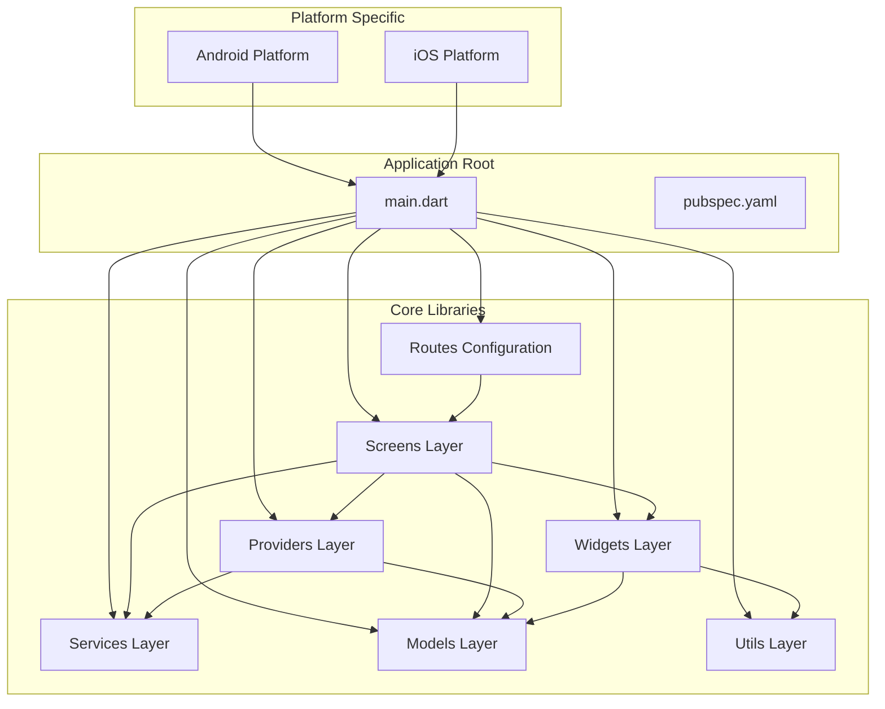

**Diagram sources**
- [main.dart](file://lib/main.dart)
- [routes.dart](file://lib/routes.dart)
- [screens directory](file://lib/screens)
- [providers directory](file://lib/providers)

### Directory Organization

The application follows a feature-based organization pattern where related functionality is grouped together:

- **Routes**: Centralized routing configuration and navigation patterns
- **Screens**: Contains all UI screens organized by feature domains
- **Providers**: Manages application state using Provider package
- **Widgets**: Reusable UI components and custom widgets
- **Services**: Business logic and external API integrations
- **Models**: Data structures and business entities
- **Utils**: Helper functions and utility classes

**Section sources**
- [main.dart](file://lib/main.dart)
- [routes.dart](file://lib/routes.dart)
- [screens directory](file://lib/screens)
- [providers directory](file://lib/providers)

## Core Components

### Screen Organization Pattern

The application implements a feature-based screen organization where each major feature area has its own dedicated screen files. This approach promotes better code organization and makes it easier to locate and modify specific functionality.

#### Screen Naming Conventions

Screens follow consistent naming conventions to improve code readability and maintainability:

- **Descriptive Names**: Screen names clearly indicate their purpose (e.g., `SubscriptionListScreen`, `SettingsScreen`)
- **Feature Prefixing**: Related screens are grouped under feature-specific directories
- **State Management Integration**: Screens work closely with corresponding providers for state management

#### Provider-Screen Relationship

Each screen typically works with one or more providers to manage its state:

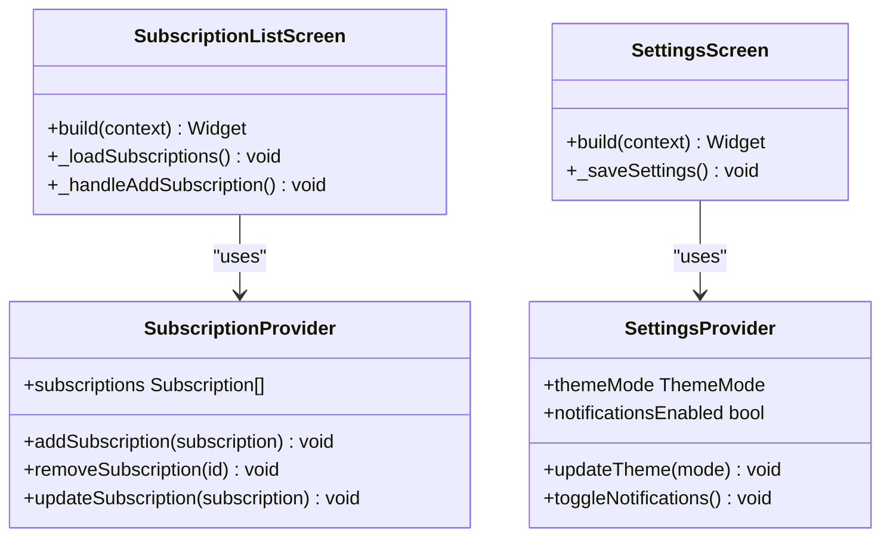

**Diagram sources**
- [screens directory](file://lib/screens)
- [providers directory](file://lib/providers)

### Navigation System Architecture

The navigation system is built around a centralized routing configuration that provides structured navigation patterns and named routes for better maintainability. This approach ensures consistency across the application while making it easier to manage complex navigation flows.

#### Route Configuration

Routes are defined centrally in the routes configuration file to ensure consistency across the application:

| Route Name | Description | Parameters | Authentication Required |
|------------|-------------|------------|------------------------|
| `/` | Home/Welcome Screen | None | No |
| `/subscriptions` | Subscription List | Filter options | Yes |
| `/subscription/add` | Add New Subscription | Parent context | Yes |
| `/subscription/edit/{id}` | Edit Existing Subscription | Subscription ID | Yes |
| `/settings` | Application Settings | None | Yes |
| `/profile` | User Profile | None | Yes |

#### Navigation Flow Patterns

The application implements several common navigation patterns through the centralized routing system:

1. **Push/Pop Operations**: Standard screen transitions with back button support
2. **Named Routes**: Type-safe navigation with route parameters
3. **Deep Linking**: Direct navigation to specific screens from external links
4. **Modal Navigation**: Dialog-based interactions for quick actions

**Section sources**
- [routes.dart](file://lib/routes.dart)
- [screens directory](file://lib/screens)
- [providers directory](file://lib/providers)

## Architecture Overview

The ASSINATURAS NINJA application follows a layered architecture pattern that separates concerns and promotes testability and maintainability:

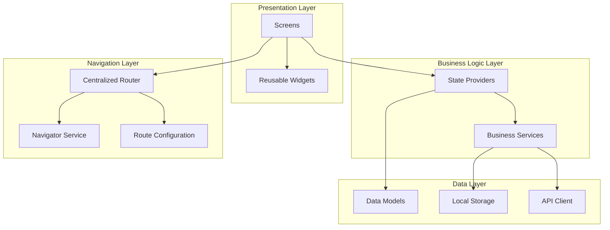

**Diagram sources**
- [main.dart](file://lib/main.dart)
- [routes.dart](file://lib/routes.dart)
- [screens directory](file://lib/screens)
- [providers directory](file://lib/providers)

### State Management Integration

The application uses Provider for state management, creating a clean separation between UI state and business logic:

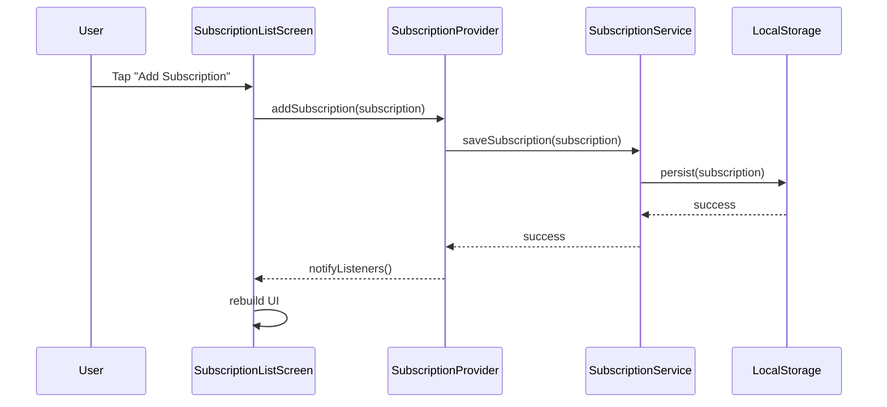

**Diagram sources**
- [screens directory](file://lib/screens)
- [providers directory](file://lib/providers)
- [services directory](file://lib/services)

## Centralized Routing System

The centralized routing system serves as the backbone of the application's navigation architecture, providing a single source of truth for all navigation patterns and route configurations.

### Benefits of Centralized Routing

The centralized routing approach offers several key advantages:

- **Maintainability**: All route definitions are in one location, making updates and modifications straightforward
- **Consistency**: Ensures uniform navigation patterns throughout the application
- **Type Safety**: Provides compile-time validation of route parameters and types
- **Testing**: Simplifies testing by centralizing navigation logic
- **Documentation**: Route definitions serve as living documentation of the app's navigation structure

### Route Configuration Structure

The routing system is organized into logical groups:

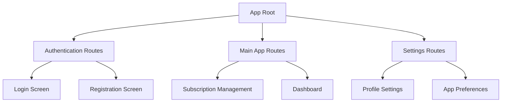

**Diagram sources**
- [routes.dart](file://lib/routes.dart)

### Named Routes Implementation

Named routes provide type-safe navigation with parameter validation:

| Route Pattern | Purpose | Parameters | Example Usage |
|---------------|---------|------------|---------------|
| `/subscription/edit/{id}` | Edit subscription | String id | `context.pushNamed('/subscription/edit', arguments: {'id': '123'})` |
| `/search?q={query}&filter={type}` | Search with filters | Query params | `context.pushNamed('/search', queryParameters: {'q': 'active', 'filter': 'monthly'})` |
| `/dashboard` | Main dashboard | None | `context.pushNamed('/dashboard')` |

### Navigation Context Extension

The routing system extends Flutter's Navigator context to provide intuitive navigation methods:

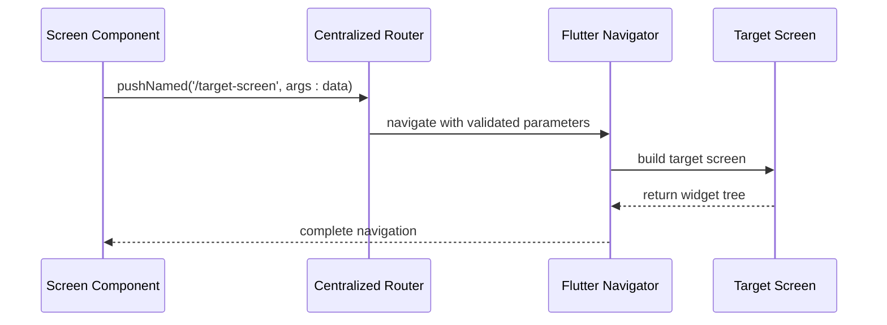

**Diagram sources**
- [routes.dart](file://lib/routes.dart)

### Deep Linking Support

The centralized routing system includes comprehensive deep linking support:

- **URL Scheme Handling**: Configured URL schemes for mobile platforms
- **Parameter Extraction**: Automatic parsing of URL parameters
- **Route Validation**: Server-side and client-side route validation
- **Fallback Handling**: Graceful error handling for invalid deep links

**Section sources**
- [routes.dart](file://lib/routes.dart)

## Detailed Component Analysis

### Screen Implementation Patterns

#### Basic Screen Structure

Each screen follows a consistent implementation pattern that promotes code reusability and maintainability:

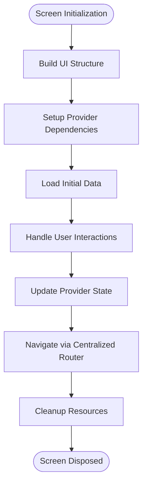

**Diagram sources**
- [screens directory](file://lib/screens)

#### Advanced Navigation Patterns

##### Push/Pop Operations

Standard navigation operations for moving between screens through the centralized router:

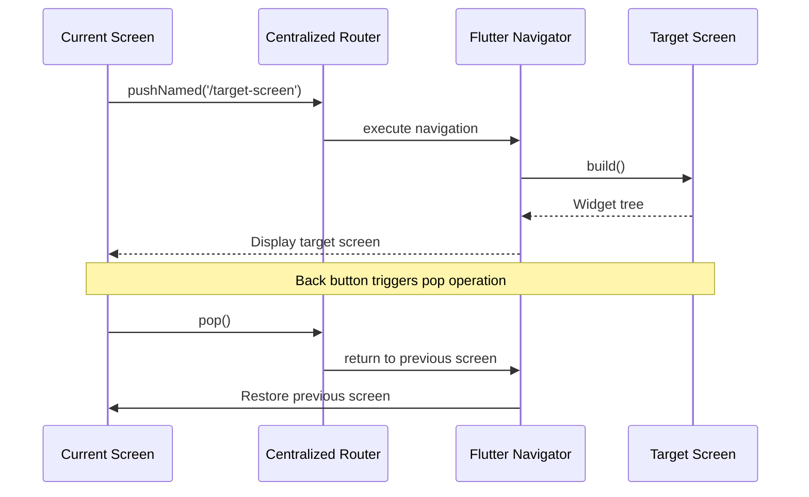

**Diagram sources**
- [routes.dart](file://lib/routes.dart)
- [screens directory](file://lib/screens)

##### Named Routes with Parameters

Type-safe navigation with parameter passing through the centralized routing system:

| Parameter Type | Usage Example | Validation | Error Handling |
|---------------|---------------|------------|----------------|
| String IDs | `/subscription/edit/{id}` | Format validation | Invalid ID fallback |
| Query Parameters | `/search?q=query&filter=active` | Input sanitization | Empty results handling |
| Complex Objects | Route arguments via Map | Serialization handling | Deserialization errors |

##### Deep Linking Implementation

Support for deep linking allows direct navigation to specific content:

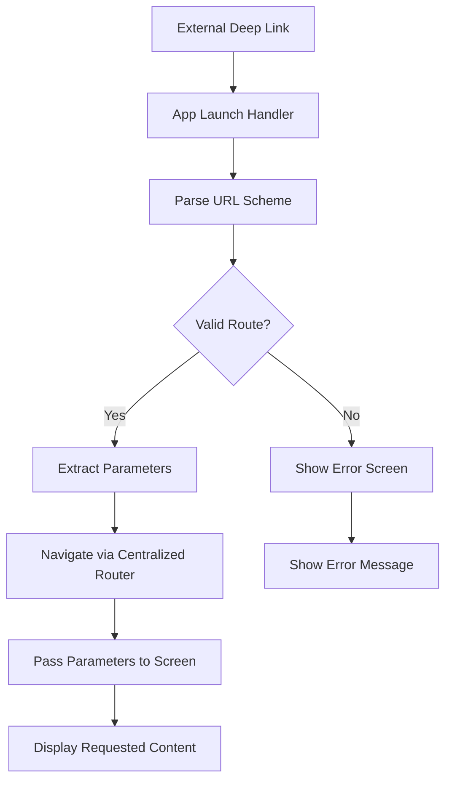

**Diagram sources**
- [routes.dart](file://lib/routes.dart)
- [main.dart](file://lib/main.dart)

### Provider Integration Patterns

#### Screen-Provider Communication

Screens communicate with providers through well-defined interfaces:

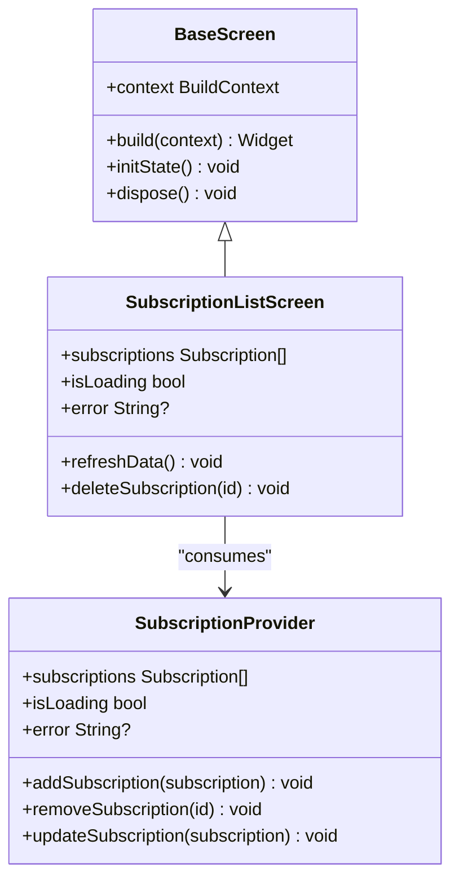

**Diagram sources**
- [screens directory](file://lib/screens)
- [providers directory](file://lib/providers)

#### State Synchronization

Provider state synchronization ensures UI consistency across the application:

| State Type | Scope | Lifecycle | Update Mechanism |
|------------|-------|-----------|------------------|
| Global State | Application-wide | App lifecycle | Provider.notifyListeners() |
| Feature State | Feature-specific | Feature lifecycle | Provider.notifyListeners() |
| Screen State | Screen-specific | Screen lifecycle | setState() |
| Temporary State | Method scope | Method execution | Local variables |

**Section sources**
- [screens directory](file://lib/screens)
- [providers directory](file://lib/providers)

## Dependency Analysis

The screen architecture maintains clear dependency boundaries to ensure loose coupling and high cohesion:

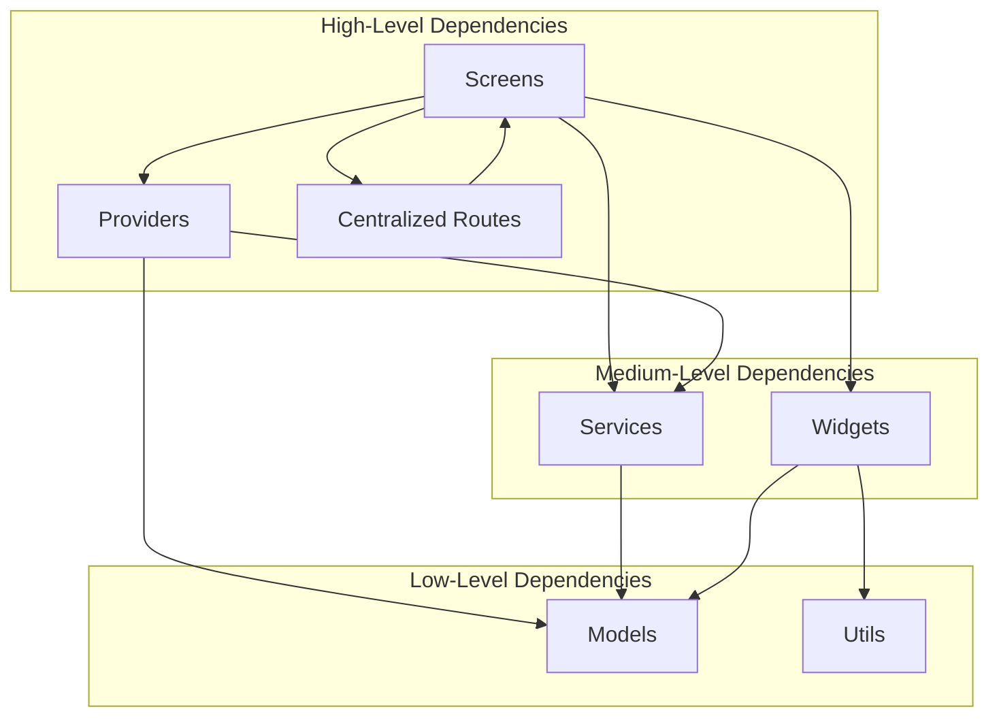

**Diagram sources**
- [routes.dart](file://lib/routes.dart)
- [screens directory](file://lib/screens)
- [providers directory](file://lib/providers)
- [services directory](file://lib/services)

### Circular Dependency Prevention

The architecture prevents circular dependencies through careful layering:

1. **Screens depend only on providers, widgets, and routes**
2. **Providers depend on services and models**
3. **Services depend on models and utilities**
4. **Routes depend only on screen definitions**
5. **Models have no internal dependencies**

### External Dependencies

The application integrates with several external libraries for enhanced functionality:

| Library | Purpose | Version | Integration Point |
|---------|---------|---------|-------------------|
| provider | State management | Latest | All screens and providers |
| flutter_riverpod | Alternative state management | Optional | Future migration path |
| go_router | Advanced routing | Optional | Complex navigation scenarios |
| shared_preferences | Local storage | Latest | Settings persistence |
| http | HTTP client | Latest | API communication |

**Section sources**
- [routes.dart](file://lib/routes.dart)
- [screens directory](file://lib/screens)
- [providers directory](file://lib/providers)

## Performance Considerations

### Screen Optimization Strategies

#### Lazy Loading Implementation

Implement lazy loading for large lists and complex screens:

- **Pagination**: Load data in chunks for long lists
- **Image Caching**: Cache images to reduce network requests
- **Widget Reuse**: Use const constructors and key properties
- **State Isolation**: Keep unrelated state in separate providers

#### Memory Management

Proper memory management prevents leaks and improves performance:

- **Dispose Controllers**: Clean up TextEditingControllers and other resources
- **Cancel Streams**: Cancel stream subscriptions when screens are disposed
- **Remove Event Listeners**: Remove listeners to prevent memory leaks
- **Use Weak References**: Avoid strong references to large objects

### Navigation Performance

Optimize navigation performance through efficient routing:

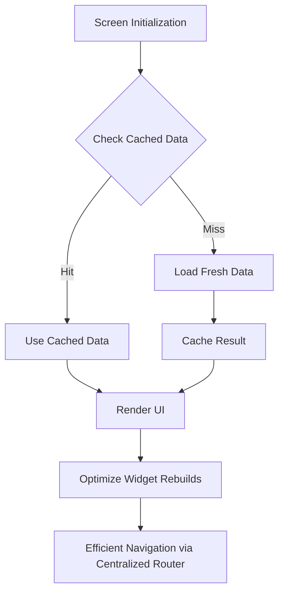

**Diagram sources**
- [routes.dart](file://lib/routes.dart)
- [screens directory](file://lib/screens)

## Troubleshooting Guide

### Common Navigation Issues

#### Route Not Found Errors

When encountering "Route not found" errors:

1. **Verify Route Registration**: Ensure routes are properly registered in MaterialApp
2. **Check Route Names**: Confirm exact string matching for named routes
3. **Validate Path Parameters**: Verify parameter types and formats
4. **Debug Navigation Calls**: Add logging to trace navigation calls

#### State Loss During Navigation

State loss issues typically occur when:

- **Provider Scope**: Ensure providers are scoped correctly
- **Screen Recreation**: Check if screens are being recreated unnecessarily
- **State Persistence**: Implement proper state persistence for critical data

#### Deep Linking Failures

Deep linking problems often stem from:

- **URL Scheme Configuration**: Verify platform-specific URL scheme setup
- **Parameter Parsing**: Ensure proper URL parameter extraction
- **Route Matching**: Check route pattern matching logic

### Debugging Techniques

#### Navigation Logging

Implement comprehensive navigation logging:

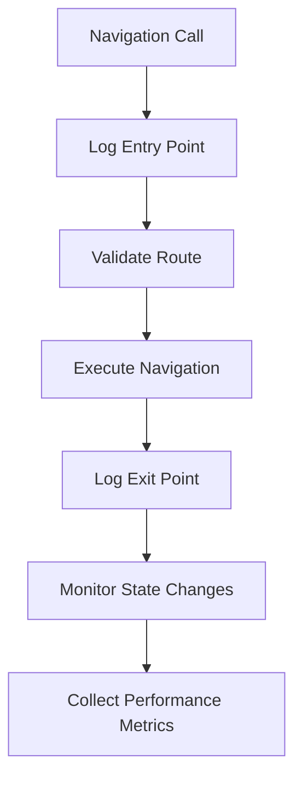

**Diagram sources**
- [routes.dart](file://lib/routes.dart)
- [screens directory](file://lib/screens)

#### Performance Profiling

Use Flutter DevTools for performance analysis:

- **Widget Inspector**: Analyze widget rebuild patterns
- **Memory Profiler**: Identify memory leaks and usage patterns
- **Network Profiler**: Monitor API call performance
- **Timeline View**: Understand navigation timing and bottlenecks

**Section sources**
- [routes.dart](file://lib/routes.dart)
- [screens directory](file://lib/screens)

## Conclusion

The ASSINATURAS NINJA application implements a robust and scalable screen architecture that follows Flutter best practices. The feature-based organization, combined with Provider-based state management and a centralized routing system, creates a maintainable and performant application structure.

Key architectural strengths include:

- **Clear Separation of Concerns**: Distinct layers for presentation, business logic, and data management
- **Centralized Navigation Control**: Single source of truth for all routing and navigation patterns
- **Consistent Navigation Patterns**: Standardized approaches to screen transitions and routing
- **Scalable State Management**: Provider-based state management that scales with application complexity
- **Testable Architecture**: Well-defined interfaces and dependencies enable comprehensive testing

The documented patterns and guidelines provide a solid foundation for extending the application with new features while maintaining code quality and performance standards.

## Appendices

### Quick Reference: Creating New Screens

#### Step-by-Step Screen Creation Process

1. **Create Screen File**: Add new screen in appropriate feature directory
2. **Define Provider**: Create or extend provider for screen state
3. **Implement UI**: Build responsive widget tree
4. **Configure Navigation**: Register route in centralized routing system
5. **Add Tests**: Write unit and integration tests
6. **Document**: Update relevant documentation

#### Navigation Checklist

- [ ] Route registered in centralized routing system
- [ ] Provider dependencies injected
- [ ] Error handling implemented
- [ ] Loading states managed
- [ ] Navigation parameters validated
- [ ] Back navigation handled
- [ ] Deep linking configured (if applicable)

### Best Practices Summary

#### Screen Development Guidelines

- **Single Responsibility**: Each screen should focus on one primary function
- **State Management**: Use providers for complex state, setState for local UI state
- **Error Handling**: Implement comprehensive error handling and user feedback
- **Accessibility**: Ensure proper accessibility labels and semantic structure
- **Testing**: Write comprehensive tests for screen logic and navigation

#### Navigation Best Practices

- **Centralized Routing**: Always use the centralized routing system for navigation
- **Consistent Patterns**: Use consistent navigation patterns throughout the app
- **Back Button Support**: Always handle back button navigation appropriately
- **Loading States**: Show appropriate loading indicators during navigation
- **Error Recovery**: Provide meaningful error messages and recovery options
- **Performance**: Optimize navigation for smooth user experience

#### Centralized Routing Best Practices

- **Route Organization**: Group related routes logically in the routing configuration
- **Parameter Validation**: Implement comprehensive parameter validation for all routes
- **Error Handling**: Provide graceful fallbacks for invalid routes and parameters
- **Documentation**: Maintain clear documentation for all available routes and their purposes
- **Testing**: Test navigation flows thoroughly to ensure reliability