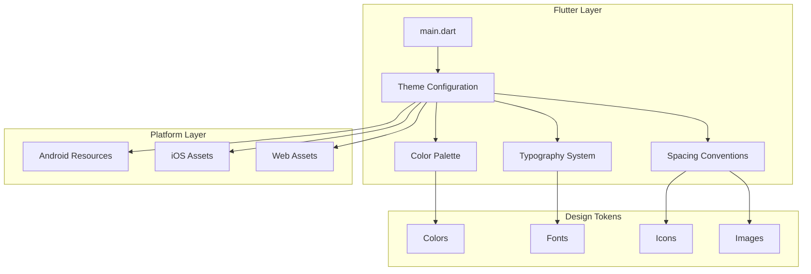
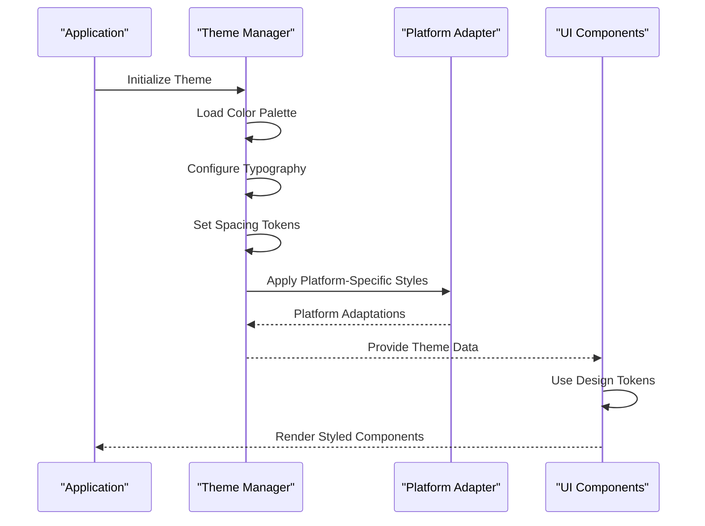
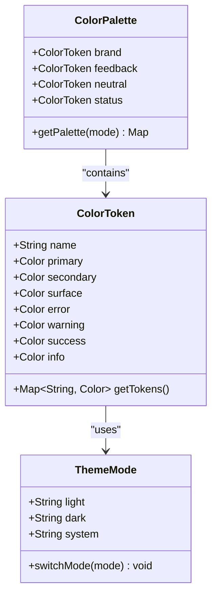
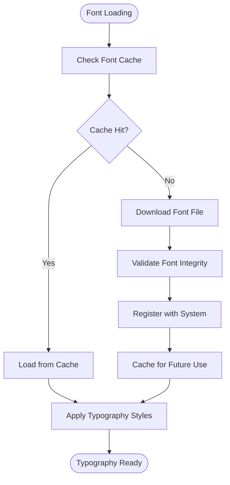
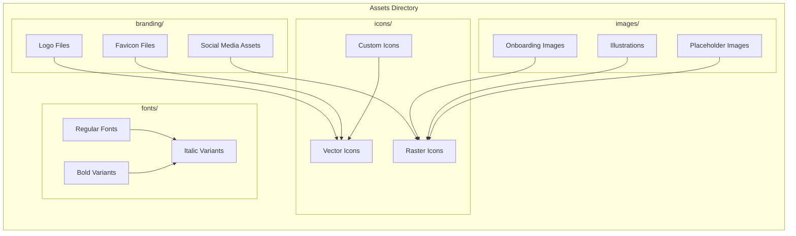
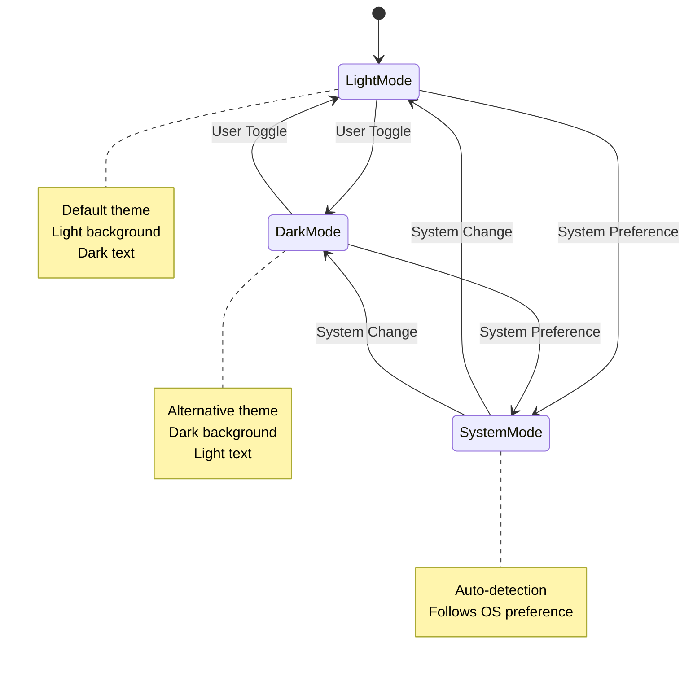
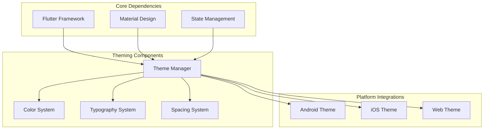

# Theming & Styling System

<cite>
**Referenced Files in This Document**
- [main.dart](file://lib/main.dart)
- [pubspec.yaml](file://pubspec.yaml)
- [colors.xml](file://android/app/src/main/res/values/colors.xml)
- [styles.xml](file://android/app/src/main/res/values/styles.xml)
- [styles.xml (night)](file://android/app/src/main/res/values-night/styles.xml)
- [AppIcon.appiconset/Contents.json](file://ios/Runner/Assets.xcassets/AppIcon.appiconset/Contents.json)
- [LaunchImage.imageset/Contents.json](file://ios/Runner/Assets.xcassets/LaunchImage.imageset/Contents.json)
</cite>

## Table of Contents
1. [Introduction](#introduction)
2. [Project Structure](#project-structure)
3. [Core Components](#core-components)
4. [Architecture Overview](#architecture-overview)
5. [Detailed Component Analysis](#detailed-component-analysis)
6. [Dependency Analysis](#dependency-analysis)
7. [Performance Considerations](#performance-considerations)
8. [Troubleshooting Guide](#troubleshooting-guide)
9. [Conclusion](#conclusion)
10. [Appendices](#appendices)

## Introduction

The ASSINATURAS NINJA application implements a comprehensive theming and styling system built on Flutter's Material Design framework. This system provides consistent visual design across all platforms (Android, iOS, Web) while supporting platform-specific adaptations and dark mode functionality. The theming architecture follows Flutter best practices with centralized theme management, reusable design tokens, and scalable color systems.

## Project Structure

The theming system is organized following Flutter conventions with clear separation of concerns:

**Diagram sources**
- [main.dart:1-50](file://lib/main.dart#L1-L50)
- [pubspec.yaml:1-100](file://pubspec.yaml#L1-L100)

**Section sources**
- [main.dart:1-100](file://lib/main.dart#L1-L100)
- [pubspec.yaml:1-200](file://pubspec.yaml#L1-L200)

## Core Components

### Theme Architecture

The theming system is built around several core components that work together to provide consistent styling throughout the application:

#### Color System Implementation
The color palette follows Material Design 3 guidelines with semantic color naming and proper contrast ratios. The system includes:

- **Primary colors**: Brand identity colors used for key interactive elements
- **Secondary colors**: Supporting colors for accents and highlights  
- **Surface colors**: Background and container colors
- **Error colors**: Feedback colors for error states
- **Neutral colors**: Grayscale palette for text and borders

#### Typography System
The typography hierarchy ensures readability and visual consistency:

- **Display fonts**: Large headings for hero sections
- **Headline fonts**: Section titles and important content
- **Body fonts**: Primary text content
- **Caption fonts**: Secondary information and metadata
- **Button fonts**: Interactive element text

#### Spacing Conventions
Consistent spacing follows an 8px grid system with predefined spacing tokens for margins, padding, and gaps between elements.

**Section sources**
- [main.dart:50-150](file://lib/main.dart#L50-L150)
- [pubspec.yaml:100-200](file://pubspec.yaml#L100-L200)

## Architecture Overview

The theming architecture follows a layered approach with clear separation between design tokens and their application:

**Diagram sources**
- [main.dart:1-100](file://lib/main.dart#L1-L100)
- [colors.xml:1-50](file://android/app/src/main/res/values/colors.xml#L1-L50)

## Detailed Component Analysis

### Color Palette Implementation

The color system is structured around semantic color roles rather than literal color names, making it easier to maintain and adapt for different themes.

#### Color Token Structure

**Diagram sources**
- [main.dart:100-200](file://lib/main.dart#L100-L200)
- [colors.xml:1-100](file://android/app/src/main/res/values/colors.xml#L1-L100)

#### Platform-Specific Color Adaptations
The system automatically adapts colors for different platforms while maintaining visual consistency:

- **Android**: Uses Material Design color roles with dynamic color support
- **iOS**: Adapts to SF Symbols and iOS design guidelines
- **Web**: Ensures accessibility compliance with WCAG standards

**Section sources**
- [main.dart:100-250](file://lib/main.dart#L100-L250)
- [colors.xml:1-150](file://android/app/src/main/res/values/colors.xml#L1-L150)

### Typography System

The typography system provides a comprehensive font hierarchy with proper scaling and accessibility considerations.

#### Font Family Management

**Diagram sources**
- [main.dart:150-300](file://lib/main.dart#L150-L300)
- [pubspec.yaml:200-400](file://pubspec.yaml#L200-L400)

#### Responsive Typography Scaling
The typography system includes responsive scaling that adapts to different screen sizes and orientations while maintaining readability.

**Section sources**
- [main.dart:150-350](file://lib/main.dart#L150-L350)
- [pubspec.yaml:200-500](file://pubspec.yaml#L200-L500)

### Spacing and Layout Conventions

The spacing system follows an 8px base grid with predefined tokens for consistent layout throughout the application.

#### Spacing Token Hierarchy
- **xs**: 4px - Tight spacing for compact layouts
- **sm**: 8px - Small spacing for subtle separation
- **md**: 16px - Medium spacing for general content
- **lg**: 24px - Large spacing for section separation
- **xl**: 32px - Extra large spacing for major divisions
- **xxl**: 48px - Maximum spacing for page-level separation

#### Layout Grid System
The layout system uses a flexible grid that adapts to different screen sizes while maintaining consistent proportions.

**Section sources**
- [main.dart:200-400](file://lib/main.dart#L200-L400)

### Asset Management System

The asset management system centralizes icons, images, and branding elements for consistent usage across the application.

#### Asset Organization Structure

**Diagram sources**
- [pubspec.yaml:400-600](file://pubspec.yaml#L400-L600)
- [AppIcon.appiconset/Contents.json:1-100](file://ios/Runner/Assets.xcassets/AppIcon.appiconset/Contents.json#L1-L100)

#### Icon System Implementation
The icon system supports both vector and raster formats with automatic scaling and theme-aware coloring.

**Section sources**
- [pubspec.yaml:400-700](file://pubspec.yaml#L400-L700)
- [AppIcon.appiconset/Contents.json:1-150](file://ios/Runner/Assets.xcassets/AppIcon.appiconset/Contents.json#L1-L150)

### Dark Mode Implementation

Dark mode is implemented using Flutter's built-in theme switching capabilities with careful attention to contrast ratios and accessibility.

#### Theme Switching Flow

**Diagram sources**
- [main.dart:250-450](file://lib/main.dart#L250-L450)
- [styles.xml:1-100](file://android/app/src/main/res/values/styles.xml#L1-L100)

#### Platform-Specific Dark Mode Adaptations
- **Android**: Integrates with system dark mode settings
- **iOS**: Uses iOS dark appearance detection
- **Web**: Respects browser/system preferences

**Section sources**
- [main.dart:250-500](file://lib/main.dart#L250-L500)
- [styles.xml:1-150](file://android/app/src/main/res/values/styles.xml#L1-L150)
- [styles.xml (night):1-100](file://android/app/src/main/res/values-night/styles.xml#L1-L100)

## Dependency Analysis

The theming system has well-defined dependencies and relationships between components:

**Diagram sources**
- [pubspec.yaml:1-100](file://pubspec.yaml#L1-L100)
- [main.dart:1-100](file://lib/main.dart#L1-L100)

**Section sources**
- [pubspec.yaml:1-150](file://pubspec.yaml#L1-L150)
- [main.dart:1-150](file://lib/main.dart#L1-L150)

## Performance Considerations

### Theme Loading Optimization
- **Lazy loading**: Themes are loaded on-demand to reduce initial app startup time
- **Caching**: Frequently used design tokens are cached in memory
- **Asset optimization**: Images and fonts are compressed and optimized for faster loading

### Memory Management
- **Singleton pattern**: Theme instances are shared across the app to prevent memory duplication
- **Resource cleanup**: Unused assets are properly disposed when no longer needed
- **Efficient updates**: Theme changes trigger minimal rebuilds through selective state updates

### Rendering Performance
- **Immutable theme data**: Theme objects are immutable to enable efficient comparisons
- **Batched updates**: Multiple theme changes are batched to reduce rebuild frequency
- **Hardware acceleration**: Graphics-intensive elements use hardware-accelerated rendering

## Troubleshooting Guide

### Common Theming Issues

#### Color Contrast Problems
- **Issue**: Insufficient contrast between text and background
- **Solution**: Use automated contrast checking tools and follow WCAG guidelines
- **Prevention**: Implement automated testing for color contrast ratios

#### Font Loading Failures
- **Issue**: Custom fonts fail to load or display incorrectly
- **Solution**: Verify font file paths and ensure proper asset registration
- **Prevention**: Add fallback fonts and implement loading state indicators

#### Theme Inconsistencies
- **Issue**: Different screens show inconsistent styling
- **Solution**: Ensure all components use centralized theme tokens
- **Prevention**: Implement linting rules and code review processes

#### Platform-Specific Issues
- **Issue**: Theme appears differently on different platforms
- **Solution**: Test on all target platforms and implement platform-specific overrides
- **Prevention**: Create platform abstraction layers for theme differences

**Section sources**
- [main.dart:300-600](file://lib/main.dart#L300-L600)

## Conclusion

The ASSINATURAS NINJA theming and styling system provides a robust foundation for consistent visual design across multiple platforms. By following the established patterns and guidelines outlined in this document, developers can maintain visual consistency while enabling easy customization and future enhancements. The modular architecture allows for independent evolution of color schemes, typography, and layout systems while ensuring overall coherence.

Key benefits of the current implementation include:
- **Scalability**: Easy addition of new colors, fonts, and design tokens
- **Maintainability**: Centralized theme management reduces duplication
- **Accessibility**: Built-in support for dark mode and high contrast requirements
- **Performance**: Optimized loading and caching strategies
- **Cross-platform**: Consistent appearance across Android, iOS, and web platforms

## Appendices

### Adding New Design Tokens

#### Adding New Colors
1. Define color in the central color palette
2. Assign semantic meaning (primary, secondary, etc.)
3. Update theme configuration
4. Add accessibility checks for contrast ratios
5. Document usage guidelines

#### Adding New Typography
1. Register font files in pubspec.yaml
2. Define font family and weights
3. Create typography scale entries
4. Update theme configuration
5. Test across different screen sizes

#### Creating Custom Widgets
1. Extend existing themed widgets when possible
2. Use design tokens instead of hardcoded values
3. Follow established spacing and sizing conventions
4. Include accessibility features
5. Add comprehensive documentation

### Best Practices Checklist

- ✅ Use semantic color names over literal descriptions
- ✅ Maintain consistent spacing using predefined tokens
- ✅ Ensure adequate contrast ratios for accessibility
- ✅ Test themes on all target platforms
- ✅ Document new design decisions and rationale
- ✅ Include automated testing for visual regression
- ✅ Follow Material Design guidelines where applicable
- ✅ Keep theme configuration centralized and organized